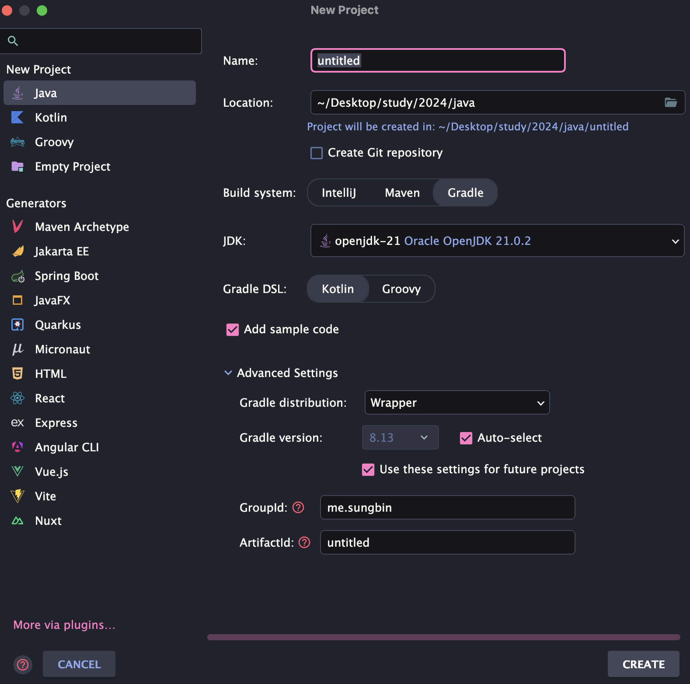
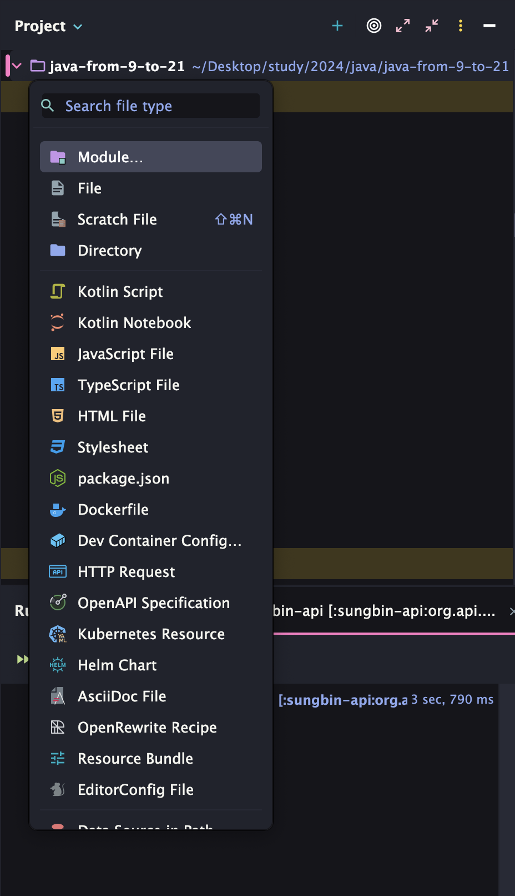
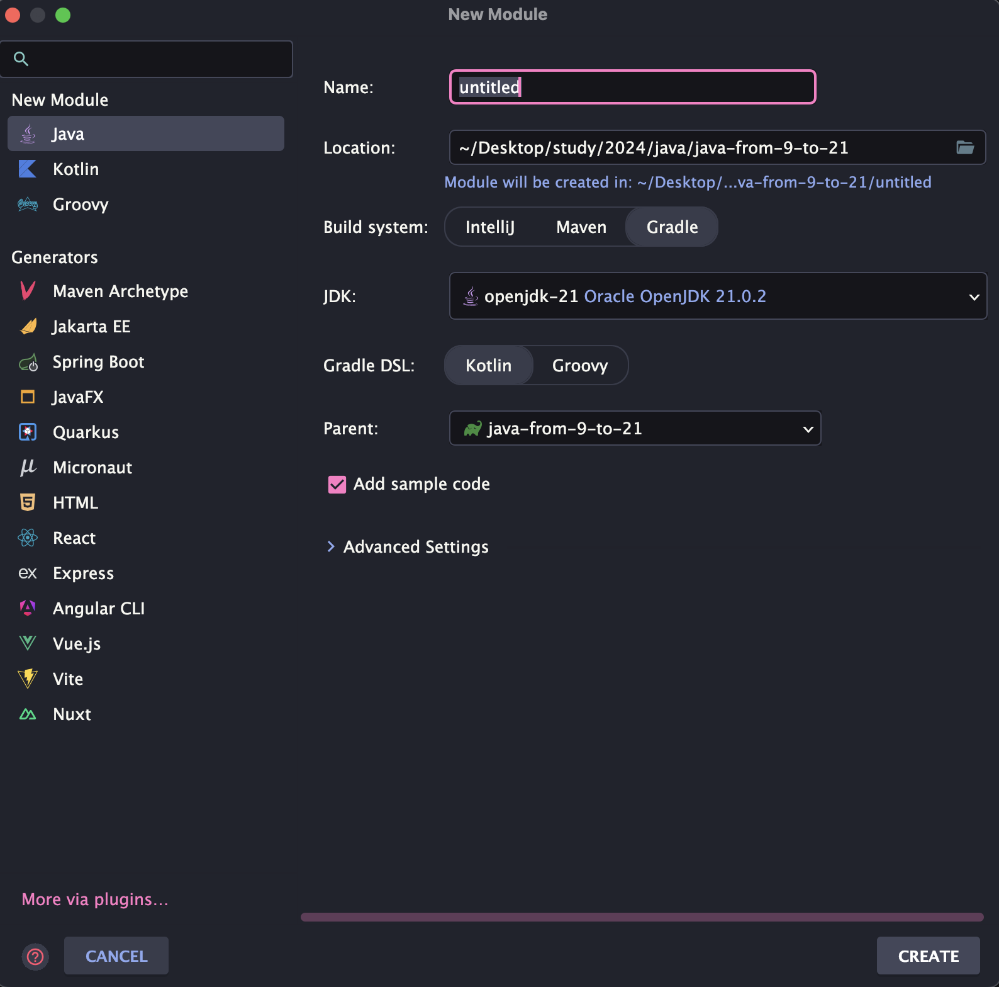
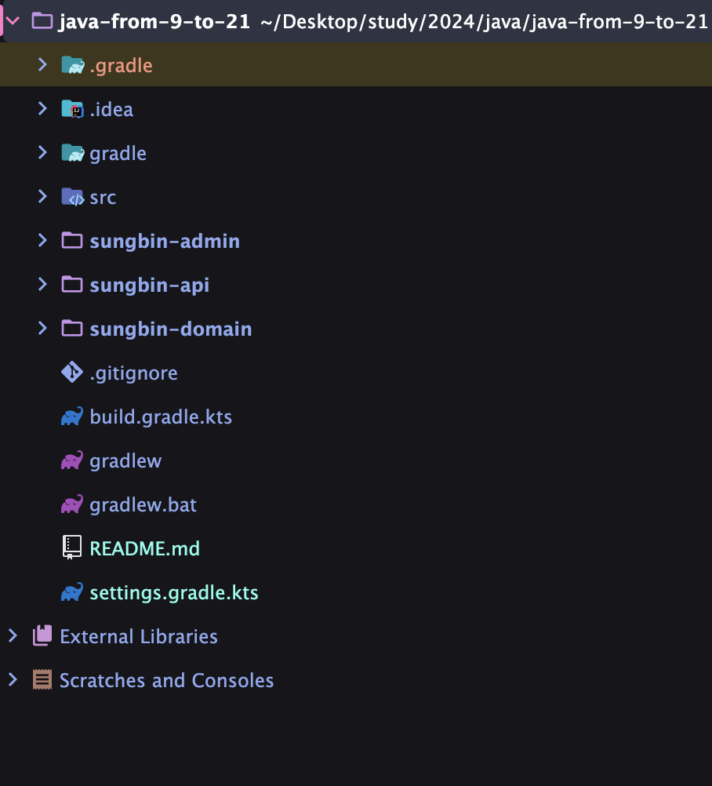
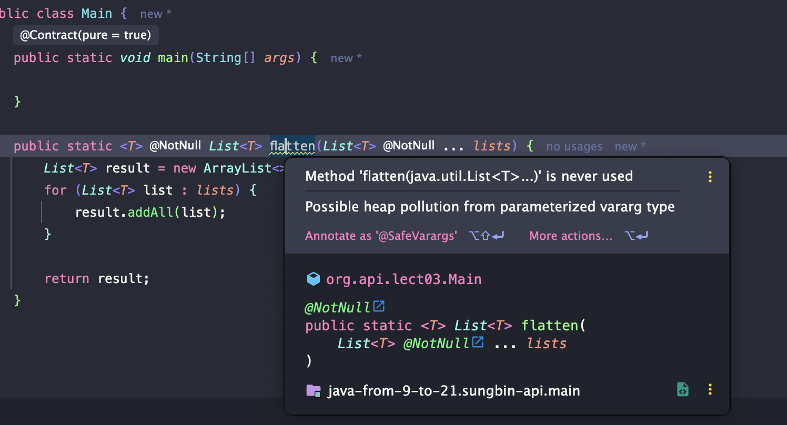

> 해당 블로그 글은 [태현님의 인프런 강의](https://inf.run/SjyDc)를 바탕으로 쓰여진 글입니다.

## 자바9와 자바 플랫폼 모듈 시스템

이번에는 자바9의 등장하는 자바 플랫폼 모듈 시스템에 대해 알아보자. "자바 플랫폼 모듈 시스템"을 줄여서 **JPMS**라고 부른다. 앞으로 JPMS라고 칭하겠다. JPMS에서 가장 핵심적인 키워드는 **모듈**이다. 사실 실무에서 대부분의 큰 프로젝트들은 다수의 모듈들로 구성이 되어 있다. 또한 이런 모듈 기반 프로젝트들은 자바9 이전에서도 많이 사용하기도 했다. 그러면 JPMS가 없을때 즉, 자바9 이전에는 어떻게 모듈 시스템을 사용했을까?

비로 빌드 툴인 **Maven**이나 **Gradle**을 이용하는 방식이였다. 한 프로젝트 안에서 여러 모듈을 만들어 각 모듈 간의 의존성을 관리할 수 있다. 의존성을 관리할 수 있게 되면, 프로젝트의 코드를 여러 모듈로 나누고, 각 모듈끼리 연관관계를 설정해 줄 수 있다. 그러면 한번 빌드 툴 만으로 멀티 모듈을 만들어보도록 하자.

먼저 인텔리제이를 켜서 아래와 같이 프로젝트를 만든다. 프로젝트 이름은 본인이 편한걸로 해주면 된다.



그러면 프로젝트가 세팅이 되었다면 이제 인텔리제이 안에서 모듈을 생성하면 된다. 이전에 Gradle 포스팅 시간에는 명령어로 멀티 모듈 시스템을 만들어 보았지만 매우 번거로웠다. 이 점을 고려하여 인텔리제이에서 쉽게 모듈을 만드는 방법이 있다.



먼저 위와 같이 최상위 루트 디렉토리(프로젝트 디렉토리)에서 단축키 `command + n`을 누르면 위와 같이 팝업이 뜰 것이다. 여기서 모듈을 선택해주면 된다. 만약 모듈이 안 뜬다면 팝업이 뜬 상태에서 키보드로 module이라고 입력하면 자동 검색이 된다.



이제 모듈을 선택하면 위와 같은 팝업이 등장한다. 여기서는 이름만 설정해주면 되고 다른 세팅은 건드릴 필요가 없다. 그래서 이렇게 모듈을 생성해 아래와 같이 admin, api, domain 모듈을 생성하면 된다. 보통 프로젝트에서는 `서비스명-api`와 같이 앞에 서비스 명을 붙여준다. 지금은 딱히 서비스 명이 없기에 필자는 필자 이름으로 진행하였다.



이렇게 생긴 3개의 모듈은 각각의 빌드 설정 파일 (`build.gradle.kts`)을 기본적으로 갖고 있는데, 지금 되어 있는 것처럼 모듈 별로 각각 설정 할 수도 있고, 최상단에 존재하는 빌드 설정 파일을 이용해 공통된 설정을 적용할 수도 있다. 만약 공통된 설정을 적용하고 싶다면, `allprojects` 혹은 `subprojects` 지시어를 사용하면 된다.

그러면 마지막으로 `build.gradle.kts`파일에 의존성 설정을 해야 JPMS가 없었던 프로젝트처럼 모듈간 연동을 할 수 있다. 각 api 모듈, admin 모듈의 `build.gradle.kts`파일에 아래와 같이 domain 모듈의 의존성을 추가할 수 있다.

먼저 admin 모듈의 `build.gradle.kts` 파일은 아래와 같다.

``` kotlin
plugins {
    id("java")
}

group = "me.sungbin"
version = "1.0-SNAPSHOT"

repositories {
    mavenCentral()
}

dependencies {
    implementation(project(":sungbin-domain"))
    testImplementation(platform("org.junit:junit-bom:5.10.0"))
    testImplementation("org.junit.jupiter:junit-jupiter")
}

tasks.test {
    useJUnitPlatform()

```

`implementation`에 `project` 클러져를 넣어주는데 프로젝트 명은 우리가 만든 도메인 모듈 명으로 진행해주면 된다. 이와 마찬가지로 아래와 같이 api 모듈도 진행해주면 된다.

``` kotlin
plugins {
    id("java")
}

group = "me.sungbin"
version = "1.0-SNAPSHOT"

repositories {
    mavenCentral()
}

dependencies {
    implementation(project(":sungbin-domain"))
    testImplementation(platform("org.junit:junit-bom:5.10.0"))
    testImplementation("org.junit.jupiter:junit-jupiter")
}

tasks.test {
    useJUnitPlatform()
}
```

여기서 한 가지 의문점이 들 수 있다. 이전 필자가 쓴 Gradle 포스팅을 본 독자라면 `implementation`과 `api`의 차이가 여기서는 무슨 역할을 하는지 궁금할 것이다. 물론 필자가 쓴 Gradle 포스팅에도 잘 정리해두었지만 여기서 잠깐 집고 넘어가면 다음과 같다.

- `implementation`: 직접적인 의존성을 맺은 모듈에만 보여주고 그 외에는 감춘다. 예를 들어 a라는 모듈이 b 모듈의 의존성을 참조하고 b모듈이 c 모듈 의존성을 참조한다고 가정하면 a 모듈은 c 모듈의 의존성을 참조할 수 없다.
- `api`: 직접적인 의존성을 맺은 모듈 외에도 간접적으로 참조하는 모듈에게도 해당 스펙을 공개한다. 예를 들어 a라는 모듈이 b 모듈의 의존성을 참조하고 b모듈이 c 모듈 의존성을 참조한다고 가정하면 a 모듈은 c 모듈의 의존성을 참조할 수 있다.

이제 자바9 이전에는 이와같이 의존성을 참조할 수 있었다. 생각보다 인텔리제이를 이용하니 간단히 해결되었다. 그러면 자바9에 추가된 JPMS는 무슨 차이가 있었던걸까?

- 첫째로, JPMS를 사용하면, gradle, maven과 같은 빌드 툴을 사용하지 않고, 모듈을 구성할 수 있다. 즉, java 코드로 이루어진 Java의 여러 API 들도 모듈 구성을 갖출 수 있게 되었다.
    - JDK 9 이전에는 모든 JDK 코드가 하나로 뭉쳐 있었기 때문에 관리도 어렵고 유지보수도 어려웠다고 한다. 또한 자바를 설치하고 싶으면, 모든 JDK 코드를 설치해야 했기 때문에 용량과 성능 측면에서 아쉬움이 있었다. JDK 9 이후로는 자바에 “모듈”이라는 개념이 추가되었기 때문에 JDK 코드를 다운로드 받을 때 특정한 모듈 들만 선택적으로 설치할 수도 있게 되었다.
- 두 번째로, JPMS를 사용하면 조금 더 세밀한 접근성 제어가 가능하다. 예를 들어, domain 모듈에 `org.user`, `org.admin` 패키지가 있는데 여기서 특정 패키지만 노출시키고 싶다거나 private 멤버에 대한 리플렉션 오픈 여부도 설정할 수 있게 할 수 있다.

그럼 우리가 추가한 모듈에 JPMS를 적용해보자. 방법은 진짜 단순하다. 각 모듈의 `src/main/java`에 `module-info.java`라는 파일을 추가해주면 끝이다. 안의 내용 형식은 아래와 같다.

``` java
module 모듈 이름 {

}
```

그리고 이 안에 의존성을 가져올 패키지 명을 적어주면 된다. 즉, api나 admim 모듈에서는 아래와 같이 작성하면 된다.

``` java
module com.admin {
    requires com.domain;
}
```

위와 같이 하면 admin 모듈과 api 모듈에서 domain 모듈 의존성을 가져올 수 있다. 그리고 추가로 도메인 모듈에도 아래와 같이 작성해야 우리가 빌드 툴에 작성한 것과 같이 진행된다.

``` java
module com.domain {
    exports org.domain;
}
```

여기서 `exports` 키워드를 통해 특정 모듈에게 해당 패키지를 노출 시키게 할 수도 있고 아니게 할 수도 있다. 아래와 같은 코드를 보면 이해가 될 것이다.

``` java
module com.domain {
    // org.domain.admin 패키지는 com.admin 모듈에만 노출한다.
    exports org.domain.admin to com.admin
}
```

`requires`에 대한 추가적인 옵션도 존재한다. `requires static`을 사용하면, 컴파일 타임에 대한 의존성만 갖게 할 수 있고, `requires transitive`를 사용하면, 추이적인 의존성을 갖게 할 수 있다.

> 📚 용어 정리
>
> 추이적인 의존성이란, 내가 필요한 모듈을, 나를 필요로 하는 모듈에게 까지 전달하는 의존성을 말한다. 앞서 설명했던 gradle의 implementation과 api 를 떠올리면 이해하기 쉽다.

## JPMS의 추가적인 기능들

JPMS의 추가적인 기능들이 많이 생겼다. 일단 리플렉션 관련해서 살펴보자.

``` java
public class Person {
    private int weight;

    public int getWeight() {
        return weight;
    }
}
```

위의 클래스를 선언하고 아래와 같이 몸무게를 리플렉션을 통하여 변경이 가능하다.

``` java
public static void main(String[] args) throws Exception {
    // 새로운 사람을 만든다
    Person p = new Person();
    // private 변수에 접근할 수 있도록 접근을 허 가한다.
    Class<Person> personClass = Person.class;
    Field weight = personClass.getDeclaredField("weight");
    weight.setAccessible(true);
    // 몸무게 를 100으로 바꿔
    weight.set(p, 100);
    System.out.println("weight : " + p.getWeight());
}
```

널리 사용되는 용어는 아니지만, setAccessible과 같이 private 멤버까지 건들 수 있는 리플렉션을 “deep reflection (깊은 리플렉션)”이라 하고, 기본적인 자바의 접근 지시어를 준수하는 리플렉션을 “shallow reflection (얕은 리플렉션)”이라고도 부른다. 이렇게 해당 리플렉션은 프레임워크등에서 자주 사용이 된다.

그런데 JPMS가 등장하고 나서부터 모듈간 private 멤버에 자유로운 접근을 막아두었다. 즉, private 멤버까지 접근하고 싶다면 추가적인 설정이 필요한 것이다. 그것이 바로 `open`, `opens`, `opens ... to`이다. 이 지시어들은 deep reflection 리플렉션 허가에 관한 지시어로, 자바 9 이전에는 다른 자바 코드의 private 멤버를 가져와 리플렉션 기술을 적용하는 것이 가능했다. 하지만, 자바 9 이후로 모듈 시스템이 적용되며, 다른 open 과 같은 지시어를 사용해야만, private 멤버에 대한 리플렉션을 사용할 수 있도록 변경되었다. 예시는 아래와 같다.

``` java
open module com.domain {
    exports org.domain;
}
```

그리고 코드를 통해 확인해보면 deep reflection이 적용된 것을 볼 수 있다. 또한 아래와 같이 `opens`를 사용하면 특정 패키지에만 deep reflection 사용을 허가할 수 있다.

``` java
module com.domain {
    exports org.domain;
    opens org.domain; // open 대신 opens를 사용
}
```

추가적으로 의존성에서 `exports ... to`를 사용했던 것과 유사하게 `opens ... to`를 사용하면 특정 패키지를 특정 모듈에 대해서만 deep reflection을 허용한다.

``` java
module com.domain {
    exports org.domain;
    // com.api 모듈에서 org.domain 패키지 내 코드에 deep reflection 사용 가능
    opens org.domain to com.api
}
```

그렇다면 만약, `exports`를 하지 않고, `opens`만 사용하면 어떻게 될까?! `exports`를 사용하지 않았기 때문에 다른 모듈에서 코드에 직접 접근할 수는 없지만, `opens`를 통해 리플렉션에 대한 권한 허가는 되어 있기 때문에 리플렉션은 사용할 수 있게 된다.

``` java
module com.domain {
    opens org.domain; // exports를 제거한 후 opens만 사용
}
```

``` java
// [api 모듈] org.api 패키지 안의 Main 클래스
public static void main(String[] args) throws Exception {
    Class<?> clazz = Class.forName("org.domain.Person"); // ✅ 정상 실행!!
    // clazz의 private 멤버에 접근할 수 있다.
    DomainPerson person = new DomainPerson(); // ❌ 오류 발생!!
}
```

이렇게 JPMS와 관련된 리플렉션 기능에 대해 살펴보았다. 이제 JPMS에 추가된 또 다른 기능 으로는 서비스 등록, 사용 기능이 있다. JPMS에서 제공하는 서비스 관련 지시어를 살펴보기 위해, 서비스에 대한 개념을 간단히 짚어보자. 서비스란, 코드의 변경 없이 원하는 기능을 갈아 끼우는 메커니즘을 의미한다. 예시를 보자.

``` java
package org.domain.service;

import java.util.ArrayList;
import java.util.List;

public class MemoryStringRepository {

    private final List<String> strings = new ArrayList<>();

    public void save(String newStr) {
        strings.add(newStr);
        System.out.println("문자열 메모리 저장");
    }
}
```

위와 같이 메모리에 문자열을 저장하는 클래스가 있다고 해보자. 그러면 아마도 아래와 같이 작성해서 사용할 것이다.

``` java
package org.api.lect02.service;

public class StringSaveComponent {

    private final MemoryStringRepository stringRepository = new MemoryStringRepository();

    public void mainLogic() {
        stringRepository.save("문자열");
    }
}
```

하지만 요구사항이 변경되어 DB에 저장해야 한다고 해보자. 그러면 해당 클래스를 만들고 위의 코드의 변경사항이 많아 질 것이다. 이를 해결하는 방법으로 우리는 다형성의 원리를 적용할 수 있다. 하지만 다형성 원리를 적용한다고 해도 코드의 변경을 완전히 막지는 못한다. 왜냐하면 `new` 연산자를 통해 직접 인스턴스화를 하고 있기 때문이다.

그래서 다음으로 떠올리는 방법이 바로 DI와 같은 의존성 주입 패턴이다. 서비스 역시 비슷한 원리이다! 우리가 특정 구현체를 직접 코드에 작성하는 대신, 서비스로더를 사용해 특정 구현체를 검색해서 가져온다면, 코드를 전혀 변경하지 않고도 기능을 쉽게 갈아 끼울 수 있다.

- Service Consumer : 서비스 구현체를 사용하는 컴포넌트 ex. StringSaveComponent
- Service Provider : 특정 서비스 구현체를 제공하는 컴포넌트 ex. MemoryStringRepository
- Service Loader : 특정 서비스 구현체를 선택해서 가져오는 컴포넌트

서비스는 위와 같은 것으로 구분을 할 수 있다. 실무에서도 이런 패턴을 적극 사용하기도 한다. 자 그럼 JPMS를 이용해 서비스를 사용해 보자! 우리가 방금 살펴보았던 것처럼, `MemoryStringRepository`와 `DatabaseStringRepository`를 구현체로 등록하고 둘 중 하나를 선택해 사용할 것이다. Service Provider는 domain 모듈에 Loader와 Consumer는 api 모듈에 만들어보자.

먼저 도메인 모듈에 아래와 같이 인터페이스를 정의한다.

``` java
package org.domain.service;

public interface StringRepository {
    void save(String newStr);
}
```

이제 이를 구현하는 구현체를 만들어보자.

``` java
package org.domain.service;

import java.util.ArrayList;
import java.util.List;

public class MemoryStringRepository implements StringRepository {

    private final List<String> strings = new ArrayList<>();

    @Override
    public void save(String newStr) {
        strings.add(newStr);
        System.out.println("문자열 메모리 저장");
    }
}
```

``` java
package org.domain.service;

public class DatabaseStringRepository implements StringRepository {

    @Override
    public void save(String newStr) {
        System.out.println("데이터베이스에 저장");
    }
}
```

그리고 `module-info.java`에 명시적으로 해당 인터페이스와 구현체를 서비스로 제공하겠다고 명시해야 한다.

``` java
module com.domain {
    exports org.domain;
    exports org.domain.service;

    provides org.domain.service.StringRepository with
            org.domain.service.MemoryStringRepository,
            org.domain.service.DatabaseStringRepository;
}
```

`provides` 지시어 뒤에는 서비스 인터페이스가 들어가고, `with` 뒤에는 이 모듈이 제공하고 있는 서비스 인터페이스의 구현체들이 들어가야 한다.

이제 api 모듈에서 서비스 로더를 만들어보자.

``` java
package org.api.lect02.service;

import org.domain.service.StringRepository;

import java.util.ServiceLoader;

public class StringRepositoryLoader {

    private static final String DEFAULT = "org.domain.service.MemoryStringRepository";

    public static StringRepository getDefault() {
        return getRepository(DEFAULT);
    }

    private static StringRepository getRepository(String name) {
        for (StringRepository repository : ServiceLoader.load(StringRepository.class)) {
            if (repository.getClass().getName().equals(name)) {
                return repository;
            }
        }
        throw new IllegalArgumentException("원하는 서비스를 찾을 수 없습니다!");
    }
}
```

``` java
package org.api.lect02.service;

import org.domain.service.StringRepository;

public class StringSaveComponent {

    private final StringRepository stringRepository = StringRepositoryLoader.getDefault();

    public void mainLogic() {
        stringRepository.save("문자열");
    }
}
```

지금은 DEFAULT 라는 상수로 특정 타입을 찾아 주었지만, 이런 문자열을 외부에서 받거나 어노테이션 등의 적절한 메커니즘을 적용하면, api 모듈의 코드를 전혀 변경하지 않고 설정만 바꿈으로써 기능을 갈아 끼울 수 있다.

이렇게 코드를 작성했다면 `module-info.java`를 통해 서비스를 지정해주자.

``` java
module com.api {
    requires com.domain;
    uses org.domain.service.StringRepository;
}
```

이런 서비스 매커니즘이 자바9 에서 처음 등장한 것은 아니다! 이전에는 module-info.java 를 사용하는 대신, resources 폴더 안에 META-INF/services 폴더를 만들고 그 안에 우리가 등록하려는 서비스를 기입하는 방식이었다. 하지만 JPMS 등장 이후 이를 좀 더 간편하게 만들어준 것뿐이다.

JPMS가 등장하며, 서비스 매커니즘을 사용할 때 classpath를 기준으로 서비스를 등록/검색 대신, 모듈을 기준으로 등록/검색하게 바뀐 것이다. 물론, 자바 9 이후에도 classpath를 기준으로 서비스 매커니즘을 사용할 수 있다.

그럼 핵심 키워드를 적용해보자.

- `requires` : 특정 모듈을 가져온다.
- `requires static` : 특정 모듈의 컴파일 의존성만 가져온다.
- `requires transitive` : 특정 모듈을 추이적으로 가져온다.
- `exports` : 특정 패키지를 외부에 노출한다.
- `exports ... to` : 특정 패키지를 특정 모듈에만 노출한다.
- `open` : 모듈 전체에 대한 deep reflection을 허가한다
- `opens` : 특정 패키지에 대한 deep reflection을 허가한다.
- `opens ... to` : 특정 모듈에만 특정 패키지의 deep reflection을 허가한다.
- `provides ... with ...` : 서비스 구현체들을 등록한다.
- `uses` : 특정 서비스 인터페이스를 사용한다.

추가적으로 모듈 개념이 자바 플랫폼에 적용되며 눈에 보이지 않는 몇 가지 변경점도 생기게 되었다.

첫번째로, 클래스 로더의 구성이 변경되었다.

클래스 로더란 자바 클래스를 JVM 으로 가져오는 것을 말한다. 눈에 보이지는 않지만, 자바 코드를 실행시키게 되면, 자바 코드에서 사용하고 있는 클래스 정보들을 JVM으로 가져와야 한다. 그래야 해당 클래스에 존재하는 여러 기능들을 사용할 수 있기 때문이다. 자바 9에서 모듈 시스템이 등장하기 이전에는 세단계의 클래스 로더가 있었다.

- Bootstrap 클래스 로더
    - 최상위 클래스 로더로 가장 기본적인 클래스들을 가져온다.
- Extensions 클래스 로더
    - 추가적인 클래스들을 가져온다.
    - “기본적인” 클래스와 “추가적인” 클래스는 클래스가 위치한 경로를 통해 구분한다.
    - “기본적인” 클래스는 `<JAVA_HOME>/jre/lib` 디렉토리에 위치한 클래스를 의미하고, “추가적인” 클래스는 `<JAVA_HOME>/jre/lib/ext` 디렉토리 혹은 `java.ext.dirs` 시스템 프로퍼티에 지정된 디렉토리에 있는 클래스를 의마한다.
- System 클래스 로더
    - 클래스패스에서 찾을 수 있는 클래스들을 가져온다.

자바 9에서는 모듈이 등장하게되며 클래스 로더의 구성도 변경되었다.

- Bootstrap 클래스 로더
    - 동일하게 최상위 클래스 로더이지만, java.base와 같은 중요한 모듈에 있는 클래스들을 가져온다.
    - 자바 9 이전의 bootstrap 클래스 로더보다 처리하는 클래스 수가 줄어들었다.
- Platform 클래스 로더
    - **자바 9 클래스 로더 시스템에서 가장 큰 변경점으로, Extensions 클래스 로더가 갖고 있는 메커니즘은 완전히 제거되었다.**
    - 제거된 java extension 매커니즘을 한 줄로 요약하면, 개발자들이 Java 플랫폼에 커스텀 API를 집어 넣을 수 있는 기능이다.
    - Bootstrap 클래스 로더가 처리하지 않는 Java SE Platform 모듈 내의 클래스들을 가져온다.
    - JCP 표준으로 관리되는 클래스들도 가져오는 역할을 갖는다.
- Application 클래스 로더
    - Java SE Platform 혹은 JDK 모듈에 있지 않은 클래스를 가져오는 로더이다.

기존 시스템과의 호환성을 위해 자바 9에서도 클래스 로더는 3단계로 구성되었으며, 모듈 시스템을 사용하지 않더라도 여전히 클래스패스를 통해 클래스를 가져올 수 있다.

JPMS의 등장으로 눈에 보이지 않는 두 번째 변경점은 JRE, JDK의 구성이 변경되었다는 것이다. JRE, JDK 내부에는 `rt.jar` `tools.jar` 등 몇 가지 jar이 포함되어 있었는데, 이들은 제거되고, JRE, JDK의 디렉토리 구성에도 약간의 변경이 있었다. 또한, 모듈 시스템이 등장했기 때문에 필요한 모듈들만 갖고 있는 JRE / JDK를 구성할 수도 있고, 이런 개념을 “modular image”라고 부른다. 여기서 image가 바로 JRE 혹은 JDK를 가리키는 용어이다.

## 자바 9에서 추가된 언어 기능

### 확장된 try-with-resources

자바 9에서는 자바 7에서 등장했던 try-with-resources 구문의 기능이 조금 더 확장되었다.

원래 `try-with-resources` 구문이 없던 시절에는 아래와 같이 `finally`로 자원을 썼으면 닫아줘야 했다. 그러다 보니 개발자가 실수로 자원을 안 닫는 문제도 발생하고 코드가 조금 장황하다는 지적도 있었다.

``` java
Resource r1 = new Resource();

try {
    
} finally {
    r1.close();
}
```

그래서 자바7부터 `try-with-resources`를 도입이 되어 `AutoClosable`을 구현한 클래스라면 자동으로 자원을 닫게끔 변경해주었다.

``` java
try (Resource r1 = new Resource()) {

}
```

하지만 조금 한 가지 아쉬운점이 존재하였는데 바로 아래와 같이 자동으로 닫을 자원을 반드시 `try ( )` 안에 선언해야 한다는 점이었다. 하지만 자바 9부터는 final 변수 혹은 초기화한 이후에 값이 변경되지 않은 변수이면, `try ( )` 구문 안에 변수 이름을 한 번 더 쓰는 것으로 try-with-resources 효과를 동일하 사용할 수 있게 되었다.

``` java
Resource r1 = new Resource("r1");
final Resource r2 = new Resource("r2");

try (r1; r2) {
}
```

### @SafeVarargs + private method

자바9 이전에는 `@SafeVarargs`라는 어노테이션을 private 메서드와 함께 사용할 수 없었는데 자바9부터는 함께 사용이 가능해졌다.

`@SafeVarargs`를 이해하기 위해서는 가변인자와 제네릭의 조합을 이해해야 한다. 가변인자를 사용한다면 메서드를 호출할 때, 매개변수의 개수를 자유롭게 넣을 수 있고 해당 값들이 담겨 있는 배열이 자동 생성된다.

``` java
public static <T> List<T> flatten(List<T>... lists) {
    List<T> result = new ArrayList<>();
    for (List<T> list : lists) {
        result.addAll(list);
    }

    return result;
}
```

그런데 flatten 함수에서는 타입 파라미터인 T와 가변인자가 함께 사용되고 있고 별로 문제가 없고 실행도 잘 되지만, IDE가 아래와 같이 경고를 띄우준다.



이 경고는 안전하지 않은 코드를 실행시키고 있다고 말하고 있고, 여기서 안전하지 않은 코드란 타입 파라미터와 가변 인자가 함께 사용되고 있는 코드를 의미한다. 분명 우리는 문제 없이 코드를 실행시켰는데, 왜 타입 파라미터와 가변 인자를 함께 사용하면 안전하지 않다고 하는 것일까? 그 이유는 바로 배열의 원리에 있다. 배열은 상위 타입의 배열로 치환될 수 있고, 상위 타입으로 치환된 배열에는 실제 타입과 다른 하위 타입이 들어갈 수 있어, 메모리 오염에 빠질 수 있는 것이다. 대표적으로 바로 아래와 같은 예시이다.

``` java
public static <T> List<T> flatten(List<T>... lists) {
    Object[] obj = lists;
    obj[0] = 1;

    List<T> result = new ArrayList<>();
    for (List<T> list : lists) {
        result.addAll(list);
    }

    return result;
}
```

핵심은 `List<T>[]` 타입인 lists 를 `Object[]` 타입으로 형변환하는 것이다. `Object[]` 타입으로 형변환을 하게되면, `Object` 배열에는 Object의 하위 타입인 그 무엇이든 넣을 수 있고, 이 값은 원래 배열에 들어 있던 `List<T>` 와는 다른 타입일 수 있다. 이 경우, lists 자체가 이상하게 변질되고, 그로 인한 에러가 발생하거나 최종 결과물이 이상하게 변질될 수 있는 것이다. 심지어 이런 에러는 컴파일 타임 때 확인할 수 없고, 때문에 자바는 제네릭과 가변인자의 조합에 대해 경고를 하고 있된 것이다.

바로 이럴 때 `@SafeVarargs` 를 사용할 수 있다. 이 어노테이션는 “이 메소드에서 사용하고 있는 제네릭 + 가변인자 조합은 안전해요”라는 의미이고, 따라서 출력되는 “uses unchecked or unsafe operations.” 경고도 제거해 주게 된다.

### 익명 클래스 + diamond syntax

익명 클래스를 사용할 때, 다이아몬드 문법을 쓸 수 있다는 것이다. 바로 코드를 보면 이해가 될 것이다.

``` java
private static class InnerClass<T> {
    private final T t;

    public InnerClass(T t) {
        this.t = t;
    }
}
```

제네릭 타입을 둔 정적 중첩 클래스를 두었고 해당 클래스를 선언할때 아래와 같이 타입추론이 가능하게 선언을 할 수 있었다.

``` java
InnerClass<Integer> ic = new InnerClass<>(3) {
};
```

원래 자바9 이전에는 타입추론이 불가능하여 익명 클래스 한에서 다이아몬드 문법을 쓰지를 못했지만 자바9부터는 가능케 되었다.

### 인터페이스에서 private 메소드를 사용할 수 있도록 변경

기존 인터페이스에는 추상 메서드만 정의를 할 수 있었다. 하지만 점점 시간이 지나면서 구현체들이 공통적으로 구현하는 메서드들을 자기네들이 만들고 있다는 것을 보고 인터페이스에 추상 메서드로 정의를 하고 싶었다. 하지만 해당 인터페이스를 구현하는 모든 클래스가 추가된 추상 메서드로 전부 깨지기 때문에 만들지를 못하였다. 그래서 나중에는 인터페이스의 s를 붙인 형태의 인터페이스도 많이 등장했다. 대표적으로 `Collection`과 `Collections`가 대표적이다. 하지만 나중에는 이 두 인터페이스가 뭐가 다른건지 질문이 많이 올라오게 되었고 더 모호해지게 되는 결과를 초래하였다. 그래서 자바에서는 자바8부터 `default` 메서드를 두었다. 이제 인터페이스에 `default` 메서드로 공통 로직 작성이 가능케 하며 필요하다면 구현 클래스에서 재정의도 가능하게 되었다. 그러다 보니, 인터페이스 `default` 메서드를 작성할 때 공통된 비즈니스 로직이 나타나게 되었고 이를 위해 자바9부터 `private` 메서드도 사용 가능하게 변경되었다.

### underscore 네이밍 불가

원래 자바8까지는 변수 네이밍으로 `_`가 가능했다. 하지만 자바9부터는 불가능하게 되었다.

## 자바 9의 추가적인 변경 내용

### Collection 기능 추가

가장 먼저, `Collection`을 만드는 방법이 추가 되었다. 자바9 이전에는 `Arrays.asList()`라는 형식으로 컬렉션을 만들었지만 자바9 이후부터는 `List.of`와 같이 정적 팩토리 메서드를 통해 컬렉션을 만든다. 이런 정적 팩토리 메서드는 `Set`과 `Map`에도 동일하게 적용이 된다. 다만 해당 정적 팩토리 메서드로 생성한 컬렉션은 불변이다. 따라서 값을 변경하거나 제거하거나 추가하면 `UnsupportedOperationException`이 발생한다. 또한, 과거 불변 컬렉션을 만들기 위해 사용했던 `Collections.unmodifiableList`와는 그 구현체가 다르다. 실제 코드를 타고 들어가면, `Collections.unmodifiableList`는 `UnmodifiableRandomAccessList` 혹은 `UnmodifiableList` 구현체가 사용되지만, `List.of`는 `ImmutableCollections.ListN`이 구현체로 사용된다. 둘 모두 “불변” 이라는 느낌이 있어 같은 것처럼 보이지만 구현체 자체가 다른 것이다! 또한 이런 구현체 차이에서 이어지는 차이점으로 새로운 정적 팩토리 메소드를 사용하면 조금 더 메모리 효율적인 코드 작성이 가능하다. 예를 들어, `Set.of(1, 2)`는 `ImmutableCollections.Set12`를 구현체로 사용하고 있는데 이 구현체는 들어오는 두 가지 값을 직접 필드에 저장한다. 반면, `HashSet`은 내부적으로 객체인 `HashMap`을 갖고 있기 때문에 단순히 두 데이터를 필드에 저장하는 것보다 많은 메모리를 차지하고, 특정 API를 사용하는데도 여러 번의 메소드 호출 체인을 거쳐야 한다.

### Optional, Stream 기능 추가

`Optional`과 `Stream`에 다양한 기능들이 추가되었다. 먼저 `Optional`부터 살펴보자.

- `ifPresentOrElse(action, emptyAction)`
    - 기존에 있던 `ifPresent(action)`의 기능이 조금 더 확대된 API가 나왔다.
    - 두 함수를 받아, 값이 존재하면 앞의 action을, 값이 존재하지 않으면 뒤의 emptyAction을 실행시킨다.
- `or(supplier)`
    - `Optional`에서 체이닝을 통해 값이 존재하지 않을 경우 다른 `Optional`로 변환할 수 있도록 `or` API가 등장하였다.
- `stream()`
    - `Optional`을 `Stream`으로 변환하는 함수가 새로 추가되었다.
    - 값이 존재하면, 해당 값 1개만을 갖고 있는 `Stream`이 되고, 값이 존재하지 않으면, 비어있는 `Stream`이 만들어진다.


다음 `Stream`에 추가된 기능들을 살펴보자.

- `takeWhile(predicate)`
    - `filter(predicate)`와 기능이 비슷하지만, 모든 데이터를 확인하는 `filter`와 다르게 `takeWhile`은 false인 결과가 나오는 순간 뒤의 데이터는 모두 버리게된다.
- `dropWhile(predicate)`
    - `takeWhile(predicate)`과 비슷하지만 반대이다. `predicate`의 값이 true인 경우 데이터를 버리고, false인 결과가 나오는 순간부터 뒤의 데이터는 모두 살리게된다.
- `ofNullable(t)`
    - 정적 팩토리 메소드이다. null일 수도 있는 t 값을 받아서, null인 경우는 비어 있는 Stream, null이 아닌 경우는 해당 값 하나를 갖고 있는 Stream을 반환한다.
- `iterate`
    - 기존에 존재하던 iterate 기능을 개선한 정적 팩토리 메소드가 추가되었다.
    - 기존에는 메서드 체이닝으로 `limit`과 함께 제한을 걸어 무한 스트림을 방지하여 사용했다면 자바9부터는 `iterate`의 첫번째 인자에 초기값을, 두번째 인자에 제한을 걸어두는 조건식을 세번째 인자에 실행 로직을 작어주면 되는 것이다.
    - 뭔가 `for-i`문과 유사한 것을 볼 수 있다.

### CompletableFuture API 기능 추가

비동기 프로그래밍을 할 때 많이 사용되는 `CompletableFuture`에는 `CompletableFuture`를 복사하거나 `default Executor`를 가져오는 함수처럼 소소한 몇 가지 기능이 추가되었으며, 타임아웃, 지연 실행 관련 기능도 새로 생기게 되었다. 아래의 예제 코드를 살펴보자.

``` java
package org.api.lect04;

import java.util.List;
import java.util.concurrent.CompletableFuture;
import java.util.concurrent.ExecutionException;
import java.util.concurrent.Executor;
import java.util.concurrent.TimeUnit;

public class Main {
    public static void main(String[] args) throws ExecutionException, InterruptedException {
        Executor executor = CompletableFuture.delayedExecutor(5, TimeUnit.SECONDS);
        Runnable sleep = () -> System.out.println(System.currentTimeMillis() + " - 작업 완료");

        System.out.println(System.currentTimeMillis() + " - 작업 실행");

        CompletableFuture<Void> future = CompletableFuture.runAsync(sleep, executor);
        future.get();
    }
}
```

`delapyedExecutor`를 사용하여 지연 기능을 만들 수 있다. 이렇게 사용한 Executor를 `runAsync`에 넣어두면 된다. 또한 `onTimeout`이라는 메서드를 통하여 `CompletableFuture`에서 실행하고 있는 작업에 대한 타임아웃을 걸 수 있다. 이와 비슷한 함수로는 `completeOnTimeout`이 있다. 이 함수는 `orTimeout`과 사용법이 같지만, 타임아웃이 되면, 에러와 함께 `CompletableFuture`가 종료되는 대신 매개변수로 받은 값을 반환하는 `CompletableFuture`를 만들어 낸다.

### Processor API 추가

추가적으로 자바 9에서는 native 프로세스를 제어할 수 있는 인터페이스가 등장했다. `ProcessHandle` 인터페이스를 이용하면, 현재 프로세스 (즉, java 프로세스)를 가져오거나 특정 pid를 통해 프로세스를 가져올 수 있고, 이렇게 가져온 `Process`를 이용해 정보를 읽거나 프로세스를 제거하는 등의 조작을 할 수 있됐다.

- `Process`: 프로세스 자체를 표현
- `ProcessHandle`: 프로세스를 제어하는 기능들
- `ProcessHandle.Info`: 프로세스 관련 다양한 정보 조회

### 그 외 추가적인 변화

- Stack-Walking API 추가
    - `StackWalker`관련 API가 추가되었다. `StackWalker`란 말 그대로 스택을 훑는 기능을 갖고 있다. 쉽게 말해 지금 시점의 스택 프레임을 제어할 수 있는 방법인 것이다.
    - StackWalker API를 사용하면, 스택에 관한 여러 정보를 쉽게 얻고 조작할 수 있으며, StackWalker 인스턴스를 가져올 때 적절한 옵션을 주면 리플렉션으로 인해 호출된 내역이나, JVM 내부 함수의 호출 기록까지도 확인할 수 있다.
- 내부 문자열 처리 방식 개선
    - 자바 9부터 내부 문자열 처리 방식이 개선되었다. 기존에는 문자열을 저장할 때 단순히 UTF-16 char 배열을 사용해 글자 하나당 무조건 2byte가 쓰였지만, 자바 9부터 문자열 저장에 1byte가 필요한지 2byte가 필요한지에 따라 다르게 저장하고 있다.
    - 이러한 방식을 자바에서는 “compact string”이라고 부르고 있다.
- JDK 버전 스키마 방식 변경
    - 자바 9 이전에는 자바의 버전을 표기하는 방식이 직관적이지 않았다. 예를 들어 1.7.0_60 혹은 JDK 7u80 이라는 표기처럼 포맷도 통일되지 않았고, 마치 두 버전 사이에 20개의 업데이트가 있어 보이지만 사실은 마이너 릴리즈 하나 차이이다.
    - 따라서 자바 9 부터는 `메이저.마이너.보안패치`와 같이 3개의 숫자를 사용하는 방식을 사용하게되었다. 또한, 기존에는 1.7 → 1.8 처럼 자바 버전이 올라갈 때 1.x 버전으로 표기되었지만, 자바 9부터는 9.0.0 처럼 메이저 버전을 지속적으로 변경하게 되었다.
    - 한 가지 알아두면 좋을 내용으로는, 보안패치 버전은 마이너 버전이 올라가더라도 0으로 리셋되지 않는다. 예를 들어 9.0.1은 한 번의 보안 패치가 적용된 9.0 버전인데 여기서 마이너 버전이 올라가더라도 9.1.0 이 되지 않고 9.1.1 으로 표기된다.
- 메모리 및 GC 관련 변경사항
    - G1GC가 default GC로 변경되었다. 자바 9 이전에는 parallel GC가 기본값이었고, 튜닝을 할 때 메모리 사이즈, 애플리케이션 상황에 따라 CMS GC를 사용하거나 G1 GC를 사용했는데, 이제 G1 GC가 default GC로 변경되었고 CMS GC는 deprecated 되었다.
    - G1GC는 기존에 물리적으로 Old 영역과 Young 영역을 나누던 방식에서 벗어나, 메모리를 바둑판처럼 쪼갠 region이라는 개념으로 메모리를 관리한다. 이 region은 논리적으로 Old 영역, Young 영역 등을 나누게 되고 이렇게 각기 나눠진 region을 이용하여 메모리 회수를 하다 보니 메모리 전체를 관리하는 방식보다 메모리 회수를 할 때 발생하는 프로그램 중단 시간이 평균적으로 줄어들게 되었다.
    - OutOfMemoryError가 발생했을 때 사용할 수 있는 옵션이 두 가지 추가되었다.
        - `ExitOnOutOfMemoryError`는 OOM이 처음 발생했을 때 JVM 자체를 종료하는 옵션으로, OOM을 처리하기 보다 JVM을 재시작하는 것이 나을 때 유용하쓸 수 있는 옵션이다.
        - `CrashOnOutOfMemoryError`는 OOM이 발생했을 때 JVM 크래시를 일으키고, 가능하다면 크래시 파일을 만들어 두게 하는 옵션이다.

## 자바 9의 Flow API

자바9에는 Flow API가 추가되었다. 자바 문서에서는 아래와 같이 말한다.

> 리액티브 프로그래밍 지원을 위한 주요 API들이 추가되었다.

하지만, 이렇게 마무리 하기보다는 리액티브 프로그래밍이 무엇이고 왜 등장하게 되었는지, 자바 9에 추가된 Flow API와는 무슨 관계인지, 다른 리액티브 라이브러리와는 어떻게 다른지 알아보도록 하자!

우리가 커피집에 갔다고 해보자. 해당 커피는 처음에 줄을 서서 커피를 주문하고 커피가 만들어질 때까지 기다린 후, 커피가 나오면 고객이 받아가서 마시는 흐름으로 굴러갔다. 하지만 이 점에서 고객은 계속 커피가 나올때 까지 기달려야 하고 이 기다림을 통해 뒤에서 기다리는 손님은 한참을 기달려야 한다. 또한 기달리는 동안 고객은 같이 온 친구와 이야기도 못하고 줄에 서있으니 매우 화가 날 것이다. 그래서 해당 커피집은 플로우를 바꾸기로 하였다. 고객이 커피집에 오면 고객 휴대폰에 어플을 자동 설치되게끔 만들었다. 그리고 해당 어플로 고객은 커피를 주문할 수도 있고 취소할 수도 있다. 해당 어플이 설치되면 자리에 가서 친구랑 이야기를 하면서 주문을 할 수 있을 것이고 커피가 나오면 알람을 통해 커피를 받을 수 있을 것이다. 굉장히 효율적인 구조이다. 물론, 이런 장점이 있다고 해서 두 번째 방식이 언제나 옳은 것은 아니다. 첫 번째 방법은 그 구조가 간단하기 때문에 쉽고 익숙하며, 해당 구조를 경험해 본 인력도 풍부하다. 반면 두 번째 방법은 상대적으로 구조가 복잡하고, 이 구조가 익숙한 인력 역시 상대적으로 부족하다. 결국 일종의 Trade-Off인 셈이다.

여기서 기술적으로 조금 접목하자면 첫번째 방식이 바로 `Spring Web MVC`방식이고 두번째 방식이 `Spring Webflux`인 것이다.

여기서 커피 손님과 사장님을 구독자 - 발행자 관계로 표현할 수 있고 어플이 구독행위가 되는 것이다. 즉 영어로 표현하자면 구독자를 `Subscriber`, 발행자를 `Publisher`, 구독 행위를 `Subscription`이라 한다. 그리고 이것을 코드로 표현하면 아래와 같이 작성할 수 있을 것이다.

``` java
public interface Publisher<T> {
    void subscribe(Subscriber<T> subscriber); // 커피 발행
}
```

``` java
public interface Subscription {
    public void request(long n); // 어플로 커피 주문 요청
    public void cancel(); // 어플로 커피 주문 취소
}
```

``` java
public interface Subscriber<T> {
    public void onSubscribe(Subscription subscription);
    public void onNext(T item);
}
```

여기서 추가적으로, 고객이 커피를 요청했을 때 하필 그날 따라 커피를 너무 많이 내려 기계가 고장 날 수도 있고, 아니면 원두 재고가 모두 떨어져서 더 이상 커피를 제공하지 못할 수도 있다. 이것을 표현하기 위해 `Subscriber`에게 커피가 없는지 혹은 기계고장으로 못 파는지에 대한 상태를 구독자한테 보내줘야 한다. 그래서 아래와 같이 추상 메서드를 추가할 수 있을 것이다.

``` java
public interface Subscriber<T> {
    public void onSubscribe(Subscription subscription); // 고객이 커피 주문
    public void onNext(T item); // 다음 행위
    public void onError(Throwable throwable); // 기계 고장으로 커피 주문 x
    public void onComplete(); // 원두 재고 소진
}
```

이제 이것을 가지고 한번 우리 예시를 코드로 작성해보자. 위의 해당 인터페이스들은 `java.util.concurrent.Flow` 클래스 안에 우리가 필요한 인터페이스들이 들어 있다.

먼저 사장님부터 코딩해보자.

``` java
package org.api.lect05;

import java.util.concurrent.CompletableFuture;
import java.util.concurrent.Flow;
import java.util.concurrent.Future;

public class CoffeePublisher implements Flow.Publisher<String> {

    @Override
    public void subscribe(Flow.Subscriber<? super String> subscriber) {
        subscriber.onSubscribe(new CoffeeSubscription(subscriber));
    }

    private static class CoffeeSubscription implements Flow.Subscription {

        private Future<?> future;

        private final Flow.Subscriber<? super String> subscriber;

        public CoffeeSubscription(Flow.Subscriber<? super String> subscriber) {
            this.subscriber = subscriber;
        }

        @Override
        public void request(long n) {
            if (n < 0) {
                subscriber.onError(new IllegalArgumentException());
            } else {
                CompletableFuture.runAsync(() -> {
                    try {
                        Thread.sleep(1000);
                        subscriber.onNext("아메리카노");
                    } catch (InterruptedException e) {
                        throw new RuntimeException(e);
                    }
                });

            }
        }

        @Override
        public void cancel() {
            if (future != null) {
                future.cancel(false);
            }
        }
    }
}
```

이제 다음으로 손님을 코딩해보자.

``` java
package org.api.lect05;

import java.util.concurrent.Flow;

public class CoffeeSubscriber implements Flow.Subscriber<String> {

    private Flow.Subscription subscription;

    private int coffeeCount = 0;

    @Override
    public void onSubscribe(Flow.Subscription subscription) {
        this.subscription = subscription;
        subscription.request(1L);
    }

    @Override
    public void onNext(String item) {
        System.out.println("수신: " + item);
        ++coffeeCount;

        if (coffeeCount < 2) {
            subscription.request(1L);
        }
    }

    @Override
    public void onError(Throwable throwable) {
        System.out.println("에러 발생!!");
    }

    @Override
    public void onComplete() {
        System.out.println("더 이상 받을 커피가 없습니다!");
        subscription.cancel();
    }
}
```

이제 손님을 사장님을 구독시켜보자.

``` java
package org.api.lect05;

public class Main {
    public static void main(String[] args) throws InterruptedException {
        CoffeeSubscriber subscriber = new CoffeeSubscriber();
        CoffeePublisher publisher = new CoffeePublisher();

        publisher.subscribe(subscriber);

        Thread.sleep(5000);
    }
}
```

이렇게 리액티브 프로그래밍 표준을 이용한 간단한 예제를 살펴보았다. 멀티 스레드, 동시성 등을 고려하지 않고, 하나의 데이터를 주고받는 간단한 예제이지만 단순히 함수를 호출하고 `return`하는 전통적인 방식에 비하면 복잡한 것을 느낄 수 있다. 성능과 복잡도의 Trade-Off인 셈이다. 물론 우리가 리액티브 프로그래밍을 한다고 해서 `Publisher`와 `Subscriber`같은 인터페이스를 구현한 구현체를 직접 만들지 않는다. 리액티브 라이브러리마다 각자의 구현체가 존재하며, 우리는 어떤 라이브러리를 사용하는지에 따라 특정 구현체를 직접적으로 사용하게다. 단지, 이들이 상호작용하는 뼈대 원래가 `Publisher`와 `Subscriber`라 이해하면 된다!

기존에 사용하고 있던 `RxJava`,`reactor`와 같은 리액티브 라이브러리와 이번에 자바 9에 추가된 Flow API는 무엇이 다른 것일까? 자바 9 이전에도 리액티브 방식을 사용해 프로그래밍을 하고 있었는데, 자바 라이브러리에 Flow API가 추가된 것은 어떤 의미가 있을까?

Flow API 추가의 의미를 한 문장으로 정리해 보자면 리액티브 스트림즈 표준을 자브러리에 넣어, “다양한 리액티브 라이브러리 간의 호환이 용이해지고, 자바 표준 라이바 내부에서도 리액티브 프로그래밍을 할 수 있게 되었다”라고 할 수 있다. 예를 들어, 리액티브 라이브러리 A / B / C를 혼용해서 사용한다고 해보자. 그럼, 각 라이브러리는 다른 라이브러리끼리의 호환 코드를 모두 작성해야만 한다. 만약 라이브러리의 수가 다양해지면, 각 라이브러리의 호환 코드를 모두 작성하기 더욱 어렵 될 것이다. 하지만 만약 자바 표준 라이브러리에 리액티브 스트림즈 인터페이스가 존재하고, 이 인터페이스를 활용한 호환 코드를 작성하게 되면, 다양한 라이브러리의 호환이 더욱 용이해질 것이다. 뿐만 아니라, JDK 내부에서도 리액티브 프로그래밍이 필요한 경우, Flow API를 직접적으로 사용할 수 있다.

표를 통하여 간단히 정리해보자.

<table style="width: 100%; border-collapse: collapse; font-family: -apple-system, BlinkMacSystemFont, 'Segoe UI', Roboto, Arial, sans-serif; box-shadow: 0 2px 10px rgba(0, 0, 0, 0.1);">
    <thead>
        <tr style="background-color: #4a90e2; color: white;">
            <th style="padding: 16px; text-align: left; font-weight: 600; border: 1px solid #3a7bc8;"></th>
            <th style="padding: 16px; text-align: left; font-weight: 600; border: 1px solid #3a7bc8;">RxJava</th>
            <th style="padding: 16px; text-align: left; font-weight: 600; border: 1px solid #3a7bc8;">reactor</th>
            <th style="padding: 16px; text-align: left; font-weight: 600; border: 1px solid #3a7bc8;">Flow API</th>
        </tr>
    </thead>
    <tbody>
        <tr style="background-color: white; color: black;">
            <td style="padding: 14px 16px; border: 1px solid #e0e0e0; font-weight: 600;">JDK 버전</td>
            <td style="padding: 14px 16px; border: 1px solid #e0e0e0;">8 이상에서<br>사용 가능</td>
            <td style="padding: 14px 16px; border: 1px solid #e0e0e0;">8 이상에서만<br>사용 가능</td>
            <td style="padding: 14px 16px; border: 1px solid #e0e0e0;">9 이상에서만<br>사용 가능</td>
        </tr>
        <tr style="background-color: #f8f9fa; color: black;">
            <td style="padding: 14px 16px; border: 1px solid #e0e0e0; font-weight: 600;">활용</td>
            <td style="padding: 14px 16px; border: 1px solid #e0e0e0;">클라이언트</td>
            <td style="padding: 14px 16px; border: 1px solid #e0e0e0;">spring webflux</td>
            <td style="padding: 14px 16px; border: 1px solid #e0e0e0;">호환성<br>표준 라이브러리</td>
        </tr>
        <tr style="background-color: white; color: black;">
            <td style="padding: 14px 16px; border: 1px solid #e0e0e0; font-weight: 600;">리액티브 스트림즈</td>
            <td style="padding: 14px 16px; border: 1px solid #e0e0e0;">약간 다르다</td>
            <td style="padding: 14px 16px; border: 1px solid #e0e0e0;">완전히 동일</td>
            <td style="padding: 14px 16px; border: 1px solid #e0e0e0;">완전히 동일</td>
        </tr>
    </tbody>
</table>

## 자바 10의 주요 변경 내용

### 언어적 변경 내역

자바 언어에 새로운 예약어가 등장했다. 바로 `var` 예약어이다. 이 예약어는 지역 변수에서 타입을 추론하도록 도와준다.

``` java
Map<String, String> map1 = Map.of("A", "B");
var map2 = Map.of("A", "B");
```

위와 같이 컬렉션들과 같이 사용하면 간결하게 표기가 가능하다. 이렇게 할당되는 값을 보고 자바는 타입을 추론할 수 있게 되는 것이다. 추론된 변수는 값을 변경할 수 있는 가변이기 때문에 다른 값을 집어넣을 수도 있다. 하지만 여전히 추론된 타입을 유지해야 한다. 만약 불변으로 만들고 싶다면 `var` 키워드 앞에 `final` 키워드를 붙여주면 된다.

그런데 다른 언어들을 보면 불변인 `var`들이 존재한다. 대표적으로 코틀린의 `val`같은게 존재하는데 왜 자바에서는 이렇게 만들지 않았을까?

- 타입 추론은 지역 변수에만 적용되며, 지역 변수는 필드와 같이 더 넓은 범위에 관여하는 언어 요소보다 불변, 가변 여부가 덜 신경 쓰이고
- `var - val` 혹은 `var - let` 사용의 경우 각각 반대하는 의견이 많았으나 `var` 도입에 대해서는 최선은 아니지만 괜찮다는 의견이 많았기 때문

추가적으로 var 예약어는 while 이나 if 와 달리 “키워드”가 아니기 때문에 변수 이름으로 사용할 수 있다. 또한 자바 10까지는 람다 식의 변수에 var 을 사용하지 못했으나 자바11부터는 람다식에도 적용이 가능하다.

> ⚠️ 주의
>
> - `var` 예약어를 사용할 때 타입을 추론하는 예약어이기 때문에 값을 초기화하지 않거나, null을 변수에 넣으면 사용하지 못한다.
> - 람다식을 집어넣을 수도 없고, 배열 선언에 집어넣을 수도 없다.
> - 다이아몬드 연산자와 var 을 함께 사용하면, 기본적으로 <> 안에 Object가 들어간 것으로 간주한다.
> - 익명 클래스와 함께 사용할 수는 있지만, 별도의 타입으로 간주한다. 즉, 익명 클래스로 선언된 타입이 아닌 것이다.

### 주요 API 변경

#### 컬렉션에 `copyOf()` 메서드 추가

- 원본 컬렉션을 깊게 복사한, 불변 컬렉션을 반환한다. 불변이기 때문에 반환된 컬렉션에 원소를 추가, 제거, 수정하려 하면 에러가 발생한다.
- 이때 깊은 복사 (deep copy)가 적용되기 때문에 원본 컬렉션에 값을 변경해도 복사된 컬렉션은 변경이 없다.
- 자바 8까지 사용했던 `Collections.unmodifiableList`과는 다른 모습을 보여주는 셈이다. 

#### 컬렉션에 기타 메서드 추가

- 스트림 연산 이후에 `Collectors.toList()` 대신 `Collectors.toUnmodifiableList()`를 사용할 수 있게 되었다.

#### 매개 변수가 없는 orElseThrow

- 기존의 `orElseThrow()`는 항상 예외를 반환하는 `Supplier`를 사용해야 했지만, 이제 별다른 매개변수를 사용하지 않고 `orElseThrow()`를 호출하면 `NoSuchElementException`를 던지게 되었다.

### 추가적인 변경 사항

- 시간 기반의 배포 버전 관리
    - 자바 9에서 자바 버전은 `1.2`, `1.3`으로 증가하던 오랜 관습을 깨고 `9.0.0`, `10.0.0`으로 넘버링 되게 변경됐다.
    - 자바 10 에서는 이런 넘버링을 유지하지만 몇 가지 릴리즈 간격과 관련된 규칙이 추가 되었다.
        - 자바 9 / 자바 10과 같은 메이저 버전은 6개월마다 출시된다.
        - `9.0.1`에서 중간 버전을 담당하는 0은 항상 0으로 고정된다.
        -  세번째로 존재하는 업데이트 버전은 출시 한 달 후에는 1이 올라가고, 그 다음부터는 3개월마다 1이 올라간다.
        - 만약 긴급한 패치가 필요하다면, `10.0.0.1`과 같이 네 번째 숫자가 올라간다.
        - LTS 주기가 3년으로 변경되었다.
    - G1GC 성능 개선
        - 자바 9에서 default GC가 되었던, G1GC의 성능이 추가적으로 개선되었다.

## 자바 11의 주요 변경 내용

### 언어적 변경 내용

언어적인 측면에서는 크게 없다. 다만 `var` 키워드가 람다식에도 적용가능해졌다는 점 하나가 존재한다.

### 주요 API 변경 내용

#### strip

첫 번째로는 띄어쓰기 혹은 탭 같은 white space를 쉽게 제거할 수 있는 `strip()` 함수이다. `strip()` 함수는 해당 문자열의 앞 뒤에 존재하는 white space를 모두 제거한다. white space인지 판별하는 `isWhiteSpace` 메서드도 추가되었고 앞쪽 공백만 없앨지 뒷쪽 공백만 없앨지에 대한 `stripLeading()`, `stripTrailing()`에 대해서도 추가되었다.

#### isBlank

이름에서도 알 수 있듯이 특정 문자열에 white space 로만 구성되어 있거나 비어 있다면 true, 그렇지 않다면 false를 반환한다.

#### lines

이 메소드는, `\n`과 같은 개행 문자를 기준으로 문자열을 쪼개 `Stream<String>`을 반환한다.

#### repeat

이 메소드는 반복 횟수를 파라미터로 받아, 주어진 문자열을 반복해 이어붙인 문자열을 반환한다.

#### toArray

Collection 인터페이스에도 새로운 기능이 하나 추가되었다. 컬렉션을 배열로 쉽게 바꿀 수 있는 `toArray()` 메소드이다. 이 `toArray()` 메소드는 기존에도 존재했지만, 컬렉션의 원소들이 옮겨갈 배열을 직접 만든 후 매개변수에 넣어주어야 했다. 자바 11에서는 `toArray()`가 배열 생성자 참조를 이용할 수 있도록 메소드가 하나 추가되었다.

``` java
List<String> strings = List.of("A", "B", "C");
String[] result = strings.toArray(String[]::new);
```

#### Predicate.not()

`Predicate` 인터페이스에도 새로운 static 메소드가 하나 추가되었다. 바로 `Predicate.not()` 메소드이다. 이 메소드는 특정 조건을 반대로 해서 필터링을 걸고 싶을 때 사용할 수 있다.

``` java
List<String> strings = List.of("A", " ", " ");

List<String> result = strings.stream()
            .filter(Predicate.not(String::isBlank))
            .collect(Collectors.toList());
```

#### Files 메서드 변경

Files 메소드에도 4가지 메소드가 추가되었다. 이번에 추가된 함수들은 파일 내용 전체를 문자열로 읽어 들이거나, 특정 문자열 전체를 파일에 써야 할 때 유용할 것이다. 먼저, `readString()` 메소드이다.

``` java
var path = Paths.get(Paths.get(".").toAbsolutePath() + "/test.txt");
String str = Files.readString(path);
System.out.println(str);
```

이 외에 `writeString`같은 메서드도 존재하는데 이 메서드들은 파일 크기가 큰 파일에서는 절대 쓰면 안된다. 쓰다가 메모리 부족 문제가 발생할 수 있기 때문이다.

#### HTTP Client

기존에도 HTTP Client가 자바 표준 라이브러리 내부에 있긴 했지만, 거의 25년 전에 개발된 만큼 HTTP/2.0, HTTP/1.1 지원이 되지 않고, 비동기 처리도 불가능했으며, 사용하거나 유지 보수 하는 것이 매우 어려웠다고 한다. 때문에 지금까지는 HTTP 요청을 해야 하는 상황이라면, `apache HttpClient`를 사용하거나, `OkHttp`, `Jetty`등을 가져와 사용했다. 스프링을 사용해 본 개발자라면 한 번쯤 들어봤을 `RestTemplate` 역시 내부 HTTP Client 로써 `apache HttpClient`를 default로 사용하고 있다.

만약 자바 9에 등장한 `module-info.java`가 모듈에 존재한다면, 해당 모듈은 named module로 간주되고, `HttpClient`를 사용하기 위해서 한 가지 설정을 해줘야 한다. 바로 `java.net.http` 모듈에 대한 의존성 추가이다.

``` java
module com.api {
    requires com.domain;
    requires java.net.http;
    uses org.domain.service.StringRepository;
}
```

새로 생긴 `HttpClient`를 사용하는 방법은 간단하다! 핵심 객체는 3가지로, 역할이 직관적으로 매칭된다.

- `HttpRequest` : HTTP 요청을 나타내는 객체
- `HttpResponse<T>` : HTTP 응답을 나타내는 객체
- `HttpClient` : `HttpRequest`를 받아 `HttpResponse`를 반환하는 클라이언트

그럼 활용 예제를 코드로 보자. 해당 부분은 실제 실무에서 그렇게 자주 사용되지 않고 이것을 wrapping한 클래스를 사용하기에 일단 코드만 보고 이런식으로 사용하기는 하는구나라고 알아두자.

``` java
package org.api.lect07;

import java.io.IOException;
import java.net.URI;
import java.net.http.HttpClient;
import java.net.http.HttpRequest;
import java.net.http.HttpResponse;

public class HttpMain {
    public static void main(String[] args) throws IOException, InterruptedException {
        var client = HttpClient.newHttpClient();
//        var request = HttpRequest.newBuilder(URI.create("https://postman-echo.com/get"))
//                .GET()
//                .build();

        var request = HttpRequest.newBuilder(URI.create("https://postman-echo.com/post"))
                .POST(HttpRequest.BodyPublishers.ofString("{\"num\": 1}"))
                .build();

//        HttpResponse<String> response = client.send(request, HttpResponse.BodyHandlers.ofString());
//        printWithThread(response.statusCode());
//        printWithThread(response.body());

        client.sendAsync(request, HttpResponse.BodyHandlers.ofString())
                .thenAccept(response -> {
                    printWithThread(response.statusCode());
                    printWithThread(response.body());
                });

        client.close();
    }

    private static void printWithThread(Object object) {
        System.out.printf("%s %s\n", Thread.currentThread().getName(), object);
    }
}
```

### 알아두면 좋은 변경 내역

마지막으로 알아두면 좋은 추가적인 변경 내용을 확인해 보자! 자바 11에서는 가비지 컬렉터의 새로운 유형인 ZGC가 experimental 상태로 최초 공개되었다. ZGC는 G1GC와 유사하게 바둑판 모양으로 메모리를 관리하지만, G1GC 보다 훨씬 큰 애플리케이션을 대상으로 만들어진 가비지 컬렉션이다 자바 11에서 experimental로 등장한 ZGC는 자바 15에서 정식 GC로 인정되었다.

> 잘못된 지식이 있을 경우 댓글로 남겨주시면 빠르게 반영하겠습니다!