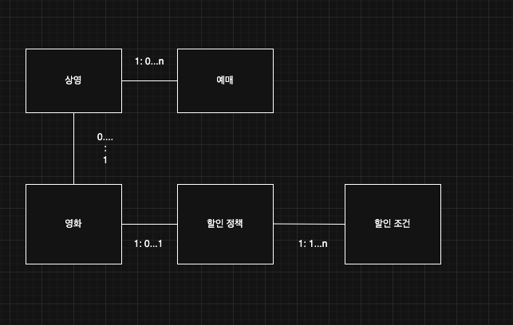

> 해당 블로그 글은 [조영호님의 인프런 강의](https://inf.run/eUUx4)를 바탕으로 쓰여진 글입니다.

## 절차적인 설계

이제 이전에 배운 영화 시스템 도메인 지식으로 절차적인 설계를 진행해보도록 하겠다. 절차지향적인 설계 방식에는 크게 2가지 개념이 존재한다. 바로 **데이터**와 **프로세스**이다. 데이터는 도메인에 대한 상태를 표현하며, 프로세스는 도메인에 행위에 대해 기술한다. 보통 절차지향적 스타일은 데이터와 프로세스를 작성할때 데이터부터 우선순위를 두고 작성을 진행한다.

보통 실무에서 데이터라는 것은 객체 안에 표현을 한다. 그리고 해당 객체와 외부 DB의 테이블과 매핑관계를 이루는 것이 일반적이다. 그리고 데이터라는 것을 객체로 표현할 때 데이터들을 객체의 멤버 변수로 두고 캡슐화를 위해 접근 제어자를 `private`으로 두곤 한다. 그리고 해당 멤버 변수를 접근하거나 변경이 필요할 경우도 있기에 `getter`나 `setter`와 같은 `public method`를 제공하기 마련이다. 그럼 독자들은 이런 생각이 들 수 있을 것이다.

> 🙋🏻 질문
>
> 객체로 뭔가를 하니까 이건 절차지향적이 아니라 객체지향적이지 않을까? 

필자도 처음에는 그렇게 생각을 했지만 객체지향적인 것은 단순히 객체를 사용한다고 객체지향적인 설계가 아니다. 해당 부분은 추후에 자세히 말해보도록 하겠다.

다음은 프로세스를 살펴보자. 프로세스의 핵심 개념은 바로 **데이터를 어떻게 처리할 것인가**이다. 절차적인 설계 관점에서 프로세스는 로직을 실행 순서대로 클래스에 배치하는 것을 의미한다. 우리의 영화 도메인을 생각했을 때 예매라는 것을 생각해보면 다음과 같은 순서로 이루어질 것이다.

- DB로부터 데이터를 메모리로 불러온다.
- 할인 조건을 통하여 할인이 가능한지 판단한다.
- 할인이 가능하면 할인 정책에 따라 계산을 진행하고 그게 아니라면 정가로 계산을 한다.
- 생성된 예약 정보를 DB에 저장후, 사용자에게 보여준다.

이런 절차대로 메서드를 만들어서 우리는 구현을 하면 될 것이다. 그런데 첫번째 과정의 DB로부터 데이터를 메모리로 불러오는 행위를 보통 어떤 객체가 맡아서 진행을 하곤 한다. 웹 어플리케이션일 경우 `repository`가 진행을 하거나 `Data Access Object(DAO)`를 통해 데이터를 불러와 실제 우리가 정의한 데이터 클래스로 변환해주는 작업을 맡는다. 그리고 해당 DAO를 실제 로직을 작성하는 클래스(ex. service 클래스)에 사용하기 위해 변수로 포함시켜두는 것이 일반적이다.

그럼 위에 예시를 든 예매에 대한 설계 코드를 보면서 설계를 마무리해보자.

``` java
public Reservation reserveScreening(Long customerId, Long screeningId, Integer audienceCount) {
  // DB로부터 Movie, Screening, DiscountPolicy, DiscountCondition 조회
  // Screening에 적용할 수 있는 DiscountCondition이 있는지 판단
  // DiscountCondition에 따라 금액 계산
  // Reservation 생성 후 DB에 저장 및 반환
}
```

먼저 예약은 고객Id, 상영정보Id, 상영 할 고객 수를 인자로 받는 메서드를 설계를 하였다. 그리고 해당 안에 주석으로 절차적인 순서를 작성해나갔다.

> 실무에서도 주니어 개발자라면 먼저 이렇게 주석으로 작성 후, 하나하나 설계를 해나가는 것이 좋은 방법이라고 생각이 든다.

먼저 DAO를 통해 외부 DB의 데이터와 매핑된 데이터 클래스를 얻어온다. 그 후에 `DiscountCondition`을 루프를 돌아서 기간 조건인지 순서 조건인지 판단을 한 후에 `DiscountCondition`을 반환시킨다. 아무런 조건이 없다면 null을 반환시키게끔 해보자. 다음으로 반환된 `DiscountCondiotion`이 `null`인지 체크를 하여 금액을 계산 후 `Reservation`객체를 생성하여 DB에 저장하고 반환시키는 로직이다.

이런 절차적인 설계 방식의 핵심은 데이터가 사용 될 문맥을 전혀 고려하지 않은 채 독립적으로 데이터를 설계했다는 것이다. 또한, 데이터가 완선되면 외부의 프로세스에 데이터를 처리하기 위한 로직을 구현한다. 이런 방식은 결국 `Service` 클래스에 프로세스가 나열 될 것이고 하나의 `Service` 클래스가 데이터 클래스와 DAO를 전부 제어하는 **중앙 집중식 제어** 스타일이라는 점이다. 이런 점은 나중에 우리가 유지보수를 할 때 엄청 고생을 할 것이다.

## 예제. 절차적인 설계

그러면 예제 코드를 살펴보자. 예제 코드는 여기서 코드를 직접적으로 보여주기 보다는 [강사님의 깃허브 저장소](https://github.com/eternity-oop/object-basic-02-01)를 링크로 남겨두겠다. 본인이 직접 한번 작성해보고 비교해보자! 필자는 직접 한번 구현 후 비교를 해보았다.

## 변경과 의존성

우리는 지금까지 해서 절차적인 설계 방식으로 설계를 진행하였다. 하지만 이런 절차적인 설계 방식에는 문제가 존재하였다. 예를 들어, 할인 조건이 변경되는 것과 같은 요구사항이 온다거나, 조금 더 깔끔한 코드의 작성을 위한 리팩토링 과정을 통해 변경할 수 있을 것이다. 예를 들어 `DiscountCondition`에 새로운 조건인 순서 조건과 시간 조건을 조합한 조건이 추가되어야 한다고 보자. 그러면 아마 아래와 같이 변경이 될 것이다.

``` java
package me.sungbin.reservation.domain;

import java.time.DayOfWeek;
import java.time.LocalTime;

public class DiscountCondition {

    public enum ConditionType {
        PERIOD_CONDITION,
        SEQUENCE_CONDITION,
        COMBINED_CONDITION
    }

    private Long id;

    private Long policyId;

    private ConditionType conditionType;

    private DayOfWeek dayOfWeek;

    private LocalTime startTime;

    private LocalTime endTime;

    private Integer sequence;

    public DiscountCondition() {
    }

    public DiscountCondition(Long policyId, ConditionType conditionType, DayOfWeek dayOfWeek, LocalTime startTime, LocalTime endTime, Integer sequence) {
        this(null, policyId, conditionType, dayOfWeek, startTime, endTime, sequence);
    }

    public DiscountCondition(Long id, Long policyId, ConditionType conditionType, DayOfWeek dayOfWeek, LocalTime startTime, LocalTime endTime, Integer sequence) {
        this.id = id;
        this.policyId = policyId;
        this.conditionType = conditionType;
        this.dayOfWeek = dayOfWeek;
        this.startTime = startTime;
        this.endTime = endTime;
        this.sequence = sequence;
    }

    public Long getId() {
        return id;
    }

    public void setId(Long id) {
        this.id = id;
    }

    public Long getPolicyId() {
        return policyId;
    }

    public void setPolicyId(Long policyId) {
        this.policyId = policyId;
    }

    public boolean isPeriodCondition() {
        return ConditionType.PERIOD_CONDITION.equals(conditionType);
    }

    public boolean isSequenceCondition() {
        return ConditionType.SEQUENCE_CONDITION.equals(conditionType);
    }

    public ConditionType getConditionType() {
        return conditionType;
    }

    public void setConditionType(ConditionType conditionType) {
        this.conditionType = conditionType;
    }

    public DayOfWeek getDayOfWeek() {
        return dayOfWeek;
    }

    public void setDayOfWeek(DayOfWeek dayOfWeek) {
        this.dayOfWeek = dayOfWeek;
    }

    public LocalTime getStartTime() {
        return startTime;
    }

    public void setStartTime(LocalTime startTime) {
        this.startTime = startTime;
    }

    public LocalTime getEndTime() {
        return endTime;
    }

    public void setEndTime(LocalTime endTime) {
        this.endTime = endTime;
    }

    public Integer getSequence() {
        return sequence;
    }

    public void setSequence(Integer sequence) {
        this.sequence = sequence;
    }
}
```

이에 따라 아래의 `ReservationService` 클래스도 변경이 생길 것이다. 왜냐하면 조건을 순회할 때 조합 조건이 생김으로 조건문을 추가해줘야 하기 때문이다.

``` java
package me.sungbin.reservation.service;

import me.sungbin.generic.Money;
import me.sungbin.reservation.domain.*;
import me.sungbin.reservation.persistence.*;

import java.util.List;

public class ReservationService {

    private ScreeningDAO screeningDAO;

    private MovieDAO movieDAO;

    private DiscountPolicyDAO discountPolicyDAO;

    private DiscountConditionDAO discountConditionDAO;

    private ReservationDAO reservationDAO;

    public ReservationService(ScreeningDAO screeningDAO, MovieDAO movieDAO, DiscountPolicyDAO discountPolicyDAO,
                              DiscountConditionDAO discountConditionDAO, ReservationDAO reservationDAO) {
        this.screeningDAO = screeningDAO;
        this.movieDAO = movieDAO;
        this.discountConditionDAO = discountConditionDAO;
        this.discountPolicyDAO = discountPolicyDAO;
        this.reservationDAO = reservationDAO;
    }

    public Reservation reserveScreening(Long customerId, Long screeningId, Integer audienceCount) {
        Screening screening = screeningDAO.selectScreening(screeningId);
        Movie movie = movieDAO.selectMovie(screening.getMovieId());
        DiscountPolicy policy = discountPolicyDAO.selectDiscountPolicy(movie.getId());
        List<DiscountCondition> conditions = discountConditionDAO.selectDiscountConditions(policy.getId());
        DiscountCondition condition = findDiscountCondition(screening, conditions);
        Money fee;

        if (condition != null) {
            fee = movie.getFee().minus(calculateDiscount(policy, movie));
        } else {
            fee = movie.getFee();
        }

        Reservation reservation = makeReservation(customerId, screeningId, audienceCount, fee);
        reservationDAO.insert(reservation);

        return reservation;
    }

    private DiscountCondition findDiscountCondition(Screening screening, List<DiscountCondition> conditions) {
        for (DiscountCondition condition : conditions) {
            if (condition.isPeriodCondition()) {
                if (screening.isPlayedIn(condition.getDayOfWeek(),
                        condition.getStartTime(),
                        condition.getEndTime())) {
                    return condition;
                }
            } else { // 새로운 조건 추가 필요
                if (condition.getSequence().equals(screening.getSequence())) {
                    return condition;
                }
            }
        }

        return null;
    }

    private Money calculateDiscount(DiscountPolicy policy, Movie movie) {
        if (policy.isAmountPolicy()) {
            return policy.getAmount();
        } else if (policy.isPercentPolicy()) {
            return movie.getFee().times(policy.getPercent());
        }

        return Money.ZERO;
    }

    private Reservation makeReservation(Long customerId, Long screeningId, Integer audienceCount, Money fee) {
        return new Reservation(customerId, screeningId, audienceCount, fee.times(audienceCount));
    }
}
```

지금처럼 데이터 클래스가 변경됨에 따라 프로세스도 함께 변경되는 문제가 존재한다. 이것을 다른 말로 하면 **의존성**이 존재한다라고 말할 수 있다. 즉, `ReservationService`가 `DiscountCondition`를 의존하는 것이다. 즉, 쉽게 더 말하면 `DiscountCondition` 변경이 `ReservationService`에 전파된다라고도 볼 수 있다.

> 📚 용어정리
>
> 의존성: 다른 코드가 수정될 때 함께 수정 될 **가능성**
>
> 의존성은 변경 방향에 반대이다.

그러면 우리는 어떤 클래스에 의존하는지 어떻게 알 수 있을까? 바로 코드를 봤을 때 해당 클래스 외의 외부 클래스가 보이면 해당 클래스는 그 외부 클래스에 의존한다라고 볼 수 있는 것이다.

의존성 측면에서 절차적인 설계가 왜 변경에 민감할까? 바로 데이터와 프로세스가 분리되어 있기 때문이다. 또한 우리가 작성한 `DiscountCondition`과 같은 데이터 클래스를 잘 보면 `private`으로 외부에 접근 못하게 캡슐화를 해두었지만 단순히 `getter/setter`를 열어둠으로 변경 및 조회를 누구나 아무때나 할 수 있다. 즉, 이것은 캡슐화 원칙에 지키지 못한 것이다. 즉, 객체가 사용 될 문맥을 전혀 고려하지 않고 설계를 한 것이다.

이런 파급효과로 인하여 데이터가 변경될 때 함께 수정해야 할 부분을 예측하기 어렵다. 이런 문제를 해결하기 위한 근본적인 방법은 프로세스가 데이터의 내부 구조에 의존하고 있으면 된다. 즉, 외부의 프로세스를 객체 안으로 포함시키면 된다. 이것이 객체지향의 출발점이다.

## 데이터와 프로세스 통합하기

그러면 데이터와 프로세스를 어떻게 통합할까? 이런 리팩토링 함에 있어서 엄청 중요한 규칙이 존재한다. 바로 **데이터의 getter를 사용해서 판단하고 결정하는 로직이 있다면 그것을 그대로 데이터에 둬라**라는 것이다. 즉, 쉽게 생각해서 getter 메서드가 외부 클래스에서 사용되고 있다면 해당 부분 로직을 객체 안으로 옮길 수 있는지 판단해보라는 것이다. 이것을 전문용어로 **객체 책임의 이동**이라고 부른다.

> 📚 용어정리
>
> 책임: 데이터를 이용해서 의사 결정을 하거나 데이터의 상태를 변경하는 로직

이렇게 함으로 캡슐화도 잘 지켜지고 진정한 객체가 된 듯 보인다. 하지만 여전히 살펴보면 `ReservationService`는 `DiscountPolicy`, `DiscountCondition`같은 데이터 클래스를 계속 의존하고 있는 형태이다. 이런 문제를 어떻게 해결할까? 해결법은 도메인 구조를 이용하여 **의존성을 제어**하는 것이다.

객체지향에서 우리는 객체를 단순히 클래스로만 만들었다고 객체지향이라고 하지 않는다. 그 클래스가 데이터를 외부에서 제공받고 판단 로직도 외부에 있는것과 같은 수동적인 존재라면 객체지향 관점에서 이것을 데이터라고 부르고 자기 자신의 상태를 직접 관리하고 스스로 판단하는 것과 같은 능동적인 존재라면 이것을 비로소 객체라고 부른다.

## 절차에서 객체로

그러면 도메인 구조를 통하여 의존성 제어를 어떻게 할까? 잘 생각해보면 첫 도메인 개념을 알아갈때 설계했던 설계도가 큰 도움을 줄 것이다.



위의 그림을 보면 할인 정책은 여러 할인 조건을 가지는 1:n 관계가 성립된다. 이것을 그대로 코드로 옮기는 과정이 바로 도메인 구조를 통한 의존성 제어 방법이다. 위와 같이 변경을 한다면 최종적으로 `ReservationService`는 `DiscountPolicy`만을 참조할 것이고 `DiscountCondition`은 전혀 모르는 존재가 될 것이다. 즉, `ReservationService`는 `DiscountPolicy`의 변경에만 영향을 맏을 것이다.

그러면 애초에 처음부터 이렇게 고려하여 설계할 수 없었을까? 절차지향적으로는 불가능하다. 왜냐하면 절차지향적 설계는 데이터가 사용될 문맥을 전혀 고려하지 않고 설계를 하기 때문이다. 그래서 정말 제대로 객체지향적으로 설계를 하려면 객체를 설계하기 전에 이 객체가 어디서 쓰일지에 대한 문맥이 필요하다. 이것을 바로 **책임 주도 개발**이라고 부른다.

## 예제. 절차에서 객체로

이제 위의 이론적인 이야기를 직접 한번 변경해보자. 코드는 [강사님 레파지토리](https://github.com/eternity-oop/object-basic-02-04)를 공유하겠다.

> 잘못된 지식이 있을 경우 댓글로 남겨주시면 빠르게 반영하겠습니다!