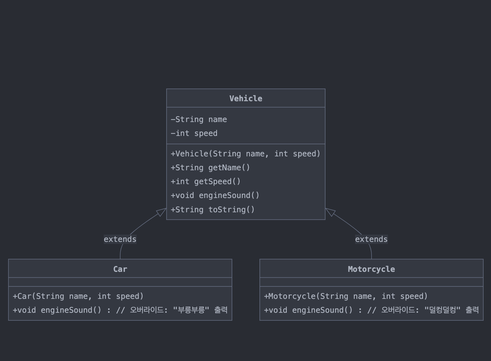

> 해당 블로그 글은 [영한님의 인프런 강의](https://inf.run/xexJb)를 바탕으로 쓰여진 글입니다.

## 프로젝트 환경 구성

프로젝트 환경 구성은 필자가 쓴 [자바 입문편 내용](https://sungbin.kr/Hello-World/#%EA%B0%9C%EB%B0%9C-%ED%99%98%EA%B2%BD-%EC%84%A4%EC%A0%95)을 참고 바란다.

## 제네릭이 필요한 이유

대부분의 최신 프로그래밍 언어는 제네릭 개념을 제공한다. 그러면 예제코드를 통하여 왜 제네릭이 필요한지 알아보자.

``` java
package generic.ex1;

public class IntegerBox {

    private Integer value;

    public Integer get() {
        return value;
    }

    public void set(Integer value) {
        this.value = value;
    }
}
```

``` java
package generic.ex1;

public class StringBox {

    private String value;

    public String get() {
        return value;
    }

    public void set(String value) {
        this.value = value;
    }
}
```

위의 코드들은 정수형을 담는 박스 객체와 문자열을 담는 박스 객체를 작성했다. 즉, 비유적으로 말하면 정수형을 담는 마트 카트와 문자열을 담는 마트 카트를 만든 것이다. 그런데 요구사항이 추가가 되어, 실수형, 불린형을 담는 박스도 만들어야 한다고 해보자. 그러면 우리는 `DoubleBox`, `BooleanBox`같은 것을 개발해야 할 것이다. 너무 비효율적인 것이 느껴질 것이다. 그러면 이를 한번에 담는 마트 카트가 필요할텐데 어떻게 할까? 바로 `Object`를 이용하면 될 것 같다고 느껴질 것이다.

## 다형성을 통한 중복 해결 시도

`Object` 는 모든 타입의 부모이다. 따라서 다형성(다형적 참조)를 사용해서 이 문제를 간단히 해결할 수 있을 것 같다.

``` java
package generic.ex1;

public class ObjectBox {

    private Object value;

    public Object get() {
        return value;
    }

    public void set(Object value) {
        this.value = value;
    }
}
```

위와 같이 `ObjectBox`를 만들었다. 즉, 모든 타입을 다 담을 수 있는 마트 카트를 개발한 것이다. 하지만 해당 코드에는 몇가지 문제점들이 존재한다. 이제 한번 사용하는 예제를 살펴보면서 문제점들을 보자.

``` java
package generic.ex1;

public class BoxMain {
    public static void main(String[] args) {
        ObjectBox integerBox = new ObjectBox();
        integerBox.set(10);
        Integer integer = (Integer) integerBox.get();
        System.out.println("integer = " + integer);

        ObjectBox stringBox = new ObjectBox();
        stringBox.set("hello");
        String str = (String) stringBox.get();
        System.out.println("str = " + str);

        // 잘못된 타입의 인수 전달 시
        integerBox.set("문자100");
        Integer result = (Integer) integerBox.get();
        System.out.println("result = " + result);
    }
}
```

첫번째 문제로 **반환 타입**이 안 맞는 문제가 있다. `get()` 메서드를 호출할 때 반환타입은 `Object`이다. 하지만 실제 원하는 타입을 변경하려면 강제적으로 다운 캐스팅이라는 작업을 해줘야 한다. 왜냐하면 자식타입이 부모 타입을 담을 수 없기 때문이다.

``` java
Integer integer = integerBox.get(); // 컴파일 에러:: Integer(자식) = Object(부모)
```

두번째 문제로 **잘못된 타입의 인수**가 전달 될 문제이다. `set()` 메서드를 사용할 때 인수로 어느 값을 넣던 문제가 되지 않는다. 왜냐하면 파라미터 타입이 `Object`이기 때문이다. 그래서 아래와 같이 정수타입을 넣어야 하는데 문자열 타입을 넣는 경우에 문제가 되는 것이다.

``` java
integerBox.set("문자100");
Integer result = (Integer) integerBox.get(); // 다운 캐스팅 시, 문자열 타입을 정수형으로 타입 캐스팅이 문제
```

다형성을 활용한 덕분에 코드의 중복을 제거하고, 기존 코드를 재사용할 수 있게 되었다. 하지만 입력할 때 실수로 원하지 않는 타입이 들어갈 수 있는 타입 안전성 문제가 발생한다. 그리고 반환 시점에도 `Object` 를 반환하기 때문에 원하는 타입을 정확하게 받을 수 없고, 항상 위험한 다운 캐스팅을 시도해야한다. 결과적으로 이 방식은 타입 안전성이 떨어진다.

그러면 이런 문제점들을 어떻게 해결할까? 이런 문제점을 해결하기 위해 나온 것이 바로 **제네릭**이다.

## 제네릭 적용

제네릭을 사용하면 위와 같은 문제들을 해결할 수 있다. 즉, `get()` 메서드를 호출할 때 다운 캐스팅을 안 해도 되고 `set()` 메서드를 호출할 때 적절한 타입의 인수만 들어가게끔 도와준다. 그럼 코드를 통해 살펴보자.

``` java
package generic.ex1;

public class GenericBox<T> {

    private T value;

    public T get() {
        return value;
    }

    public void set(T value) {
        this.value = value;
    }
}
```

`<>` 를 사용한 클래스를 제네릭 클래스라 한다. 이 기호(`<>`)를 보통 다이아몬드라 한다. 제네릭 클래스를 사용할 때는 특정 타입을 미리 지정하지 않는다. 대신에 `<T>`와 같은 **타입 매개 변수**를 넣는다. 그리고 해당 클래스를 사용할 때 타입을 지정해주면 `T`와 같은 타입 매개 변수가 특정 타입을 변경이 된다. 그러면 해당 클래스를 사용하는 코드를 살펴보자.

``` java
package generic.ex1;

public class BoxMain {
    public static void main(String[] args) {
        GenericBox<Integer> integerBox = new GenericBox<Integer>();
        integerBox.set(10);
        Integer integer = integerBox.get();
        System.out.println("integer = " + integer);

        GenericBox<String> stringBox = new GenericBox<String>();
        stringBox.set("hello");
        String str = stringBox.get();
        System.out.println("str = " + str);

        GenericBox<Double> doubleBox = new GenericBox<Double>();
        doubleBox.set(10.5);
        Double doubleValue = doubleBox.get();
        System.out.println("doubleValue = " + doubleValue);

        GenericBox<Integer> integerBox2 = new GenericBox<>();
    }
}
```

위와 같이 참조형 변수를 선언할때 기존에 타입 매개변수로 선언되어 있던 곳에 특정 타입을 집어 넣으면 된다. 이렇게함으로 기존에 `set()` 메서드에 타입에 맞지 않는 값을 넣는 것을 컴파일 단계에서 방지해주고 `get()` 메서드를 호출할 때 다운 캐스팅이 필요가 없어진다.

제네릭 클래스를 사용하면 다음과 같이 `GenericBox` 객체를 생성하는 시점에 원하는 타입을 마음껏 지정할 수 있다. 참고로 제네릭을 도입한다고 해서 앞서 설명한 `GenericBox<String>` , `GenericBox<Integer>` 와 같은 코드가 실제 만들어지는 것은 아니다. 대신에 자바 컴파일러가 우리가 입력한 타입 정보를 기반으로 이런 코드가 있다고 가정하고 컴파일 과정에 타입 정보를 반영한다. 이 과정에서 타입이 맞지 않으면 컴파일 오류가 발생한다.

### 타입 추론

``` java
GenericBox<Integer> integerBox2 = new GenericBox<Integer>(); // 타입 직접 입력
GenericBox<Integer> integerBox2 = new GenericBox<>(); // 타입 추론
```

첫번째 줄의 코드를 보면 변수를 선언할 때와 객체를 생성할 때 `<Integer>` 가 두 번 나온다. 자바는 왼쪽에 있는 변수를 선언할 때의 `<Integer>` 를 보고 오른쪽에 있는 객체를 생성할 때 필요한 타입 정보를 얻을 수 있다. 따라서 두 번째 줄의 오른쪽 코드 `new GenericBox<>()` 와 같이 타입 정보를 생략할 수 있다. 이렇게 자바가 스스로 타입 정보를 추론해서 개발자가 타입 정보를 생략할 수 있는 것을 타입 추론이라 한다. 참고로 타입 추론이 그냥 되는 것은 아니고, 자바 컴파일러가 타입을 추론할 수 있는 상황에만 가능하다. 쉽게 이야기해서 읽을 수 있는 타입 정보가 주변에 있어야 추론할 수 있다.

> ⚠️ 주의
>
> 타입추론은 생성자 부분에 다이아몬드 안에 추론이 가능한 것이다. 타입추론이 가능한 것은 참조형 변수 타입을 보고 객체 생성을 할 때 이미 참조현 변수에 타입이 정의되어 있기에 타입추론이 가능한 것이다. 그런데 타입 추론을 참조형 변수에 적용하면 자바는 해당 변수의 타입을 알 수 없기에 적용이 안된다.

## 제네릭 용어와 관례

제네릭의 핵심은 **사용할 타입을 미리 결정하지 않는다는 점**이다. 클래스 내부에서 사용하는 타입을 클래스를 정의하는 시점에 결정하는 것이 아니라 실제 사용하는 생성 시점에 타입을 결정하는 것이다. 이것을 쉽게 비유하자면 메서드의 매개변수와 인자의 관계와 비슷하다.

``` java
void hello() {
  System.out.println("hello");
}
```

위의 메서드는 매개변수 없이 hello라는 문자열을 출력하는 메서드다. 즉, 해당 메서드는 무슨 짓을 해도 hello라는 문자열만 출력이 가능하다. 재사용성이 떨어지는 메서드이다. 하지만 위의 메서드를 아래와 같이 변경하면 어떨까?

``` java
void hello(String str) {
  System.out.println(str);
}
```

매개변수로 문자열을 정의하고 인자로 문자열을 받으면 hello라는 문자열뿐만 아니라 다양한 문자열 출력이 가능하다. 즉, 재사용성이 좋은 메서드이다.

### 제네릭의 타입 매개변수와 타입 인자

제네릭도 앞서 설명한 메서드의 매개변수와 인자의 관계와 비슷하게 작동한다. 제네릭 클래스를 정의할 때 내부에서 사용할 타입을 미리 결정하는 것이 아니라, 해당 클래스를 실제 사용하는 생성 시점에 내부에서 사용할 타입을 결정하는 것이다. 차이가 있다면 **메서드의 매개변수는 사용할 값에 대한 결정을 나중으로 미루는 것**이고, **제네릭의 타입 매개변수는 사용할 타입에 대한 결정을 나중으로 미루는 것**이다.

### 용어 정리

- 제네릭 타입: 클래스나 인터페이스를 정의할 때 타입 매개변수를 사용하는 것을 말한다. 제네릭 클래스, 제네릭 인터페이스를 모두 합쳐서 제네릭 타입이라 한다. 예시로 우리가 정의한 `GenericBox` 클래스를 제네릭 타입이라고 말한다.
  - 타입은 클래스, 인터페이스, 기본형(`int` 등)을 모두 합쳐서 부르는 말이다.
- 타입 매개변수: 제네릭 타입이나 메서드에서 사용되는 변수로, 실제 타입으로 대체된다.
  - `GenericBox`에서 `T` 를 타입 매개변수라 한다.
- 타입 인자: 제네릭 타입을 사용할 때 제공되는 실제 타입이다.
  - `Integer`, `String`같은 것을 타입 인자라고 한다.

### 제네릭 명명 관례

타입 매개변수는 일반적인 변수명처럼 소문자로 사용해도 문제는 없다. 하지만 일반적으로 대문자를 사용하고 용도에 맞는 단어의 첫글자를 사용하는 관례를 따른다. 그러면 주로 실무에서는 어떻게 사용하는지 보자.

- `E`: Element
- `K`: Key
- `N`: Number
- `T`: Type
- `V`: Value
- `S`, `U`, `V`: 2nd, 3rd, 4th types

주로 사용하는 제네릭 타입 매개 변수는 위와 같지만, 우리가 필요에 따라 적절하게 적으면 될 것 같다. 다만, 단어의 첫글자를 사용하는 관례만 지키면 될 것 같다.

> ✅ 참고
>
> 타입 매개 변수를 꼭 1자리로 할 필요는 없다.

### 제네릭 기타

한번에 여러 타입 매개변수를 선언할 수 있다.

``` java
class Map<K, V> {}
```

제네릭의 타입 인자로 기본형(`int`, `double`)은 사용할 수 없다. 대신에 래퍼 클래스(`Integer`,`Double`)를 사용하면 된다.

### raw type

제네릭 타입을 사용할 때는 항상 `<>` 를 사용해서 사용시점에 원하는 타입을 지정해야 한다. 그런데 다음과 같이 `<>` 을 지정하지 않을 수 있는데, 이런 것을 로 타입(raw type), 또는 원시 타입이라한다.

``` java
GenericBox box = new GenericBox();
```

제네릭 타입으로 클래스를 정의해두었지만 이렇게 제네릭 타입을 쓰지 않고 원시타입을 쓰는 경우는 자바가 자동으로 제네릭 타입 인자를 `Object`로 해준다. 그러면 이렇게 원시타입이 등장한 배경은 무엇일까?

자바의 제네릭이 자바가 처음 등장할 때 부터 있었던 것이 아니라 자바가 오랜기간 사용된 이후에 등장했기 때문에 제네릭이 없던 시절의 과거 코드와의 하위 호환이 필요했다. 그래서 어쩔 수 없이 이런 로 타입을 지원한다. 자바는 호환성에 끝장을 보기에 결국 호환성으로 원시타입을 남겨둔 것이지, 실제 원시타입을 의도적으로 작성해서는 안된다.

## 제네릭 활용 예제

그러면 예제코드를 통해 제네릭에 대해 익숙해져 보자. 강의와 다르게 차량 관련 예제로 해보겠다.



위의 UML로 차량 클래스들을 만들어보자.

``` java
public class Vehicle {
    private String name;
    private int speed;

    public Vehicle(String name, int speed) {
        this.name = name;
        this.speed = speed;
    }

    public String getName() {
        return name;
    }

    public int getSpeed() {
        return speed;
    }

    public void engineSound() {
        System.out.println("일반 엔진 소리");
    }

    @Override
    public String toString() {
        return "Vehicle{" +
                "name='" + name + '\'' +
                ", speed=" + speed +
                '}';
    }
}
```

위와 같이 탈것 관련 부모 클래스를 정의하였다. 해당 부모 클래스는 탈것의 이름, 속도라는 필드를 가지고 있고 엔진 소리에 대한 메서드를 정의하였다. 이제 이 부모 클래스를 상속받는 자식 클래스를 만들어보자.

``` java
public class Car extends Vehicle {
    public Car(String name, int speed) {
        super(name, speed);
    }

    @Override
    public void engineSound() {
        System.out.println("부릉부릉");
    }
}
```

자동차 클래스가 부모 클래스를 상속받고 `engineSound()`라는 메서드를 재정의하였다.

``` java
public class Motorcycle extends Vehicle {
    public Motorcycle(String name, int speed) {
        super(name, speed);
    }

    @Override
    public void engineSound() {
        System.out.println("덜컹덜컹");
    }
}
```

오토바이 클래스가 부모 클래스를 상속 받고 `engineSound()` 메서드를 재정의하였다.

이제 탈것들을 담을 수 있는 제네릭 타입 클래스를 만들어보겠다.

``` java
public class Box<T> {
    private T value;

    public T get() {
        return value;
    }

    public void set(T value) {
        this.value = value;
    }
}
```

이제 이를 이용해서 사용하는 `main()` 메서드 클래스를 만들어보자.

``` java
public class VehicleMain1 {
    public static void main(String[] args) {
        Vehicle vehicle = new Vehicle("탈것", 0);
        Car car = new Car("자동차", 200);
        Motorcycle motorcycle = new Motorcycle("오토바이", 150);
        
        Box<Car> carBox = new Box<>();
        carBox.set(car);
        Car findCar = carBox.get();
        System.out.println("findCar = " + findCar);

        Box<Motorcycle> motorcycleBox = new Box<>();
        motorcycleBox.set(motorcycle);
        Motorcycle findMotorcycle = motorcycleBox.get();
        System.out.println("findMotorcycle = " + findMotorcycle);

        Box<Vehicle> vehicleBox = new Box<>();
        vehicleBox.set(vehicle);
        Vehicle findVehicle = vehicleBox.get();
        System.out.println("findVehicle = " + findVehicle);
    }
}
```

`Box`라는 제네릭 타입에 각각 맞는 탈것을 꺼내고 넣고 하는 것을 구햔해두었다. 여기서 잘 보면 탈것이라는 부모 클래스 하나만 제네릭 인자로 넣어두면 뭔가 위의 코드를 리팩토링 할 수 있을 것 같다.

``` java
public class VehicleMain2 {
    public static void main(String[] args) {
        Vehicle vehicle = new Vehicle("탈것", 0);
        Car car = new Car("자동차", 200);
        Motorcycle motorcycle = new Motorcycle("오토바이", 150);

        Box<Vehicle> vehicleBox = new Box<>();
        vehicleBox.set(vehicle);
        vehicleBox.set(car);
        vehicleBox.set(motorcycle);

        Vehicle findVehicle = vehicleBox.get();
        System.out.println("findVehicle = " + findVehicle);
    }
}
```

위와 같이 부모 클래스를 타입 인자로 두고 자식 인스턴스들을 넣을 수 있다. 그 이유는 부모타입에 자식 타입을 넣을 수 있기 때문이다. 이제 점차적으로 위의 코드들을 발전시켜보면서 제네릭에 대해 알아보겠다. 내용이 길어지니 다음 포스팅에 이어가도록 하겠다.

> 잘못된 지식이 있을 경우 댓글로 남겨주시면 빠르게 반영하겠습니다!