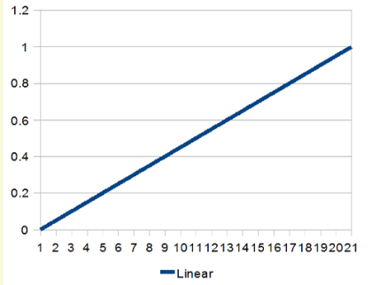
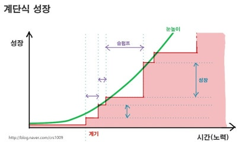

## 2025년 1분기 회고(feat. 중요한 것은 포기하지 않는 마음)

거리의 눈이 녹고 벚꽃이 피어나는 시기가 찾아왔다. 많은 사람이 벚꽃을 보러 가는 듯하지만, 나는 그럴 수 없었다. 올해 반드시 이루어야 하는 목표가 있기 때문이다. 남들처럼 여가 시간을 즐기면서는 이 목표들을 모두 달성하기 어려울 것 같다는 생각이 들었다.

2025년 새해 첫날 내가 작성한 [회고록](https://sungbin.kr/2024년-주니어-개발자-회고록/)의 후반부에서 언급했듯이, 올해 반드시 이루어야 할 목표들이 있다. 그중에서도 '이직'이 나에게는 가장 중점적인 목표라고 생각한다.

### 아직 겨울인 채용시장

주변에서 많은 분이 "채용 시장이 많이 얼어붙었으니 지금은 회사에 붙어 있는 게 좋겠다"라는 말씀을 자주 하셨다. 처음 이 말을 들었을 때는 별 감흥이 없었지만, 실제로 이직을 준비해보니 그 의미를 크게 깨닫게 되었다. 하지만 나는 이렇게 생각했다.

> 아무리 어려워도 이직할 사람은 결국 다 이직한다. 그러니 나도 열심히 해보자!

이런 생각으로 본격적으로 이직 준비를 시작했다.

### 꾸준함

무엇이든 꾸준히 열심히 하면 기회가 찾아오고 목표를 달성할 수 있다고 믿는다. 하지만 무작정 열심히만 하는 것이 아니라 효율적인 공부 방법도 필요하다고 생각했다. 또한, 인간에게 주어진 하루 24시간을 효율적으로 활용하기 위해 구체적인 계획을 세워보았다.

먼저 나는 평일의 경우, 수면 시간과 운동 시간을 제외하고 퇴근 후 3~4시간을 학습에 투자하기로 했다. 출퇴근 시간에는 컴퓨터 과학(CS)처럼 암기가 필요한 내용이나 예상 기술 면접 질문을 공부하기로 했으며, 점심시간에도 빠르게 식사를 마치고 휴게실에서 부족한 부분을 강의로 보충했다. 주말에는 수면과 운동 시간을 제외한 대부분의 시간을 공부하는 일정으로 계획했다. 또한 틈 날때마다 다양한 개발자 오픈채팅방에 질문거리들이 올라오면 바로 답변을 하거나 해당 질문들을 스크랩해서 모아둔다. 해당 행위가 나중에 기술면접에 도움이 될거라 생각을 하게 되었다.

이러한 루틴을 지금까지 유지하면서 다음과 같은 생각이 들었다.

> 이렇게만 하면 뭐든 이룰 수 있지 않을까?

하지만 세상은 그리 호락호락하지 않았다.

### 개발자라는 직업을 포기해야할까?

많은 기업에 서류 지원을 하고 여러 기술 면접을 치르면서 수많은 실패를 겪었다. 그 과정에서 다음과 같은 회의감이 들기 시작했다.

> 노력을 하는데 왜 안 될까?
>
> 개발자가 내 적성에는 맞는 것일까?

한동안 이 질문들을 곱씹으며 깊이 고민했다. 내가 왜 개발자라는 직업을 선택했고, 이 길이 정말 내게 맞는지 스스로에게 계속 질문했다.

### 초심(初心)

며칠간 깊이 고민한 끝에 회의감에 대한 결론을 내릴 수 있었다. 나는 노력을 하면 즉각적인 결과와 성과가 나타나기를 원했던 것 같다. 즉, 아래와 같은 비례 그래프를 기대했던 것이다.

하지만 실제로 노력의 성장은 계단형 그래프에 가깝다고 생각한다.

지금 나는 아마 계단의 수평적인 위치에 있다고 본다. 하지만 이 자리에서도 꾸준히 노력을 이어간다면 다음 계단의 상승 폭은 크게 다가올 것이다.

나는 몰입하는 것을 즐긴다. 이것이 내가 개발자가 되고 싶었던 초심이었다고 생각한다. 개발 자체와 학습하는 과정에서 큰 몰입과 즐거움을 느꼈기 때문에 개발자의 길을 선택했다. 다시 고민해봐도 이 결론은 변하지 않았다.

### 실리적인 경험

예전의 나는 어떤 경험이라도 하면 좋다고 생각해 다양한 행사나 밋업에 참여했다. 하지만 돌이켜보니 이것이 내게 큰 도움이 되지 않았던 것 같다. 앞으로는 특정 경험이 내게 어떤 이익이나 손해를 가져오는지 조금 더 실리적으로 판단해야겠다고 결심했다. 물론 모든 것을 계산적으로만 접근할 수는 없겠지만, 적어도 '개발'이라는 목표에 있어서는 좀 더 전략적으로 시간을 사용해야 한다고 생각한다.

다른 사람의 관점에서는 이기적으로 보일 수 있지만, 소중한 시간을 효율적으로 사용하여 목표를 더 빨리 달성하려면 어쩔 수 없는 선택이라고 본다.

### 중요한 것은 포기하지 않는 마음

이 글의 부제이기도 하다. 포기하지 않고 꾸준히 하자. 그러면 언젠가 내가 원하는 목표를 이룰 수 있을 것이다. 많은 사람이 노력한 만큼 즉시 결과나 성과가 보이지 않으면 불안해하다가 중도 포기한다. 하지만 끝까지 포기하지 않는다면, 남들보다 조금 늦더라도 결국 목표에 도달할 수 있다고 믿는다.

또한, 너무 남들과 비교하며 부러워하지 않기로 했다. 유명한 사람들도 한때는 무명 시절을 겪었다. 그들도 현재의 위치에 오기까지 엄청난 노력과 시간을 투자했을 것이다. 내가 아직 목표에 도달하지 못했다면, 그만큼의 노력을 더 하면 된다.

## 마무리

아직 채용 시장의 문이 좁고 경제 상황도 좋지 않다. 하지만 이 상황에 좌절하지 않고 끝까지 최선을 다하면, 벚꽃이 질 때쯤이나 첫눈이 내릴 때쯤에는 지금보다 목표에 가까워질 수 있지 않을까?

> 🗒️ 홍보
>
> 현재 나는 개발자 관련 오픈채팅방을 운영하고 있다. 관심이 있으신 분들은 참여바랍니다.
>
> 링크: https://open.kakao.com/o/g5lbCQEh
>
> 참여코드: 0702