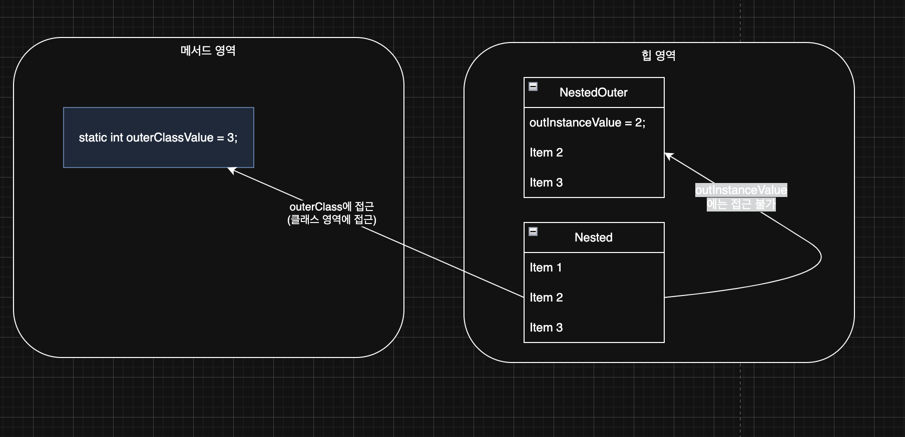
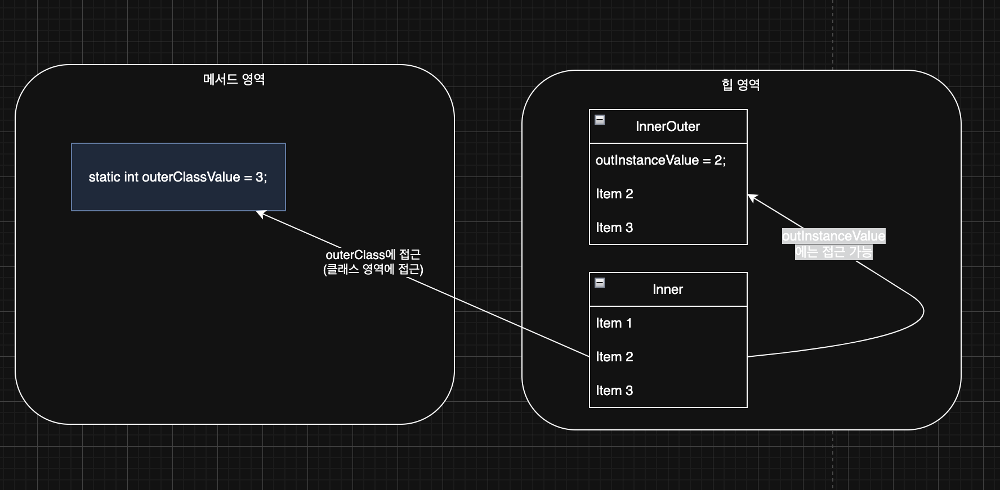

> 해당 블로그 글은 [영한님의 인프런 강의](https://inf.run/FiFGQ)를 바탕으로 쓰여진 글입니다.

## 중첩 클래스, 내부 클래스란?

우리는 이전에 '중첩'이라는 말을 많이 들어봤다. 대표적으로 이중 for문(중첩 for문)이라는 용어에서 '중첩'이라는 말을 사용했고 그게 무엇인지 알 수 있다. 이것을 토대로 보았을 때 중첩 클래스는 클래스 안에 클래스가 있을 때 중첩 클래스라고 부른다.

### 중첩 클래스 분류

중첩 클래스는 다음과 같이 분류할 수 있다.

- 정적 중첩 클래스: `static`이 붙고 바깥 클래스의 인스턴스에 소속되지 않는다.
- 내부 클래스: `static`이 안 붙고 바깥 클래스의 인스턴스에 소속된다.
  - 내부 클래스: 바깥 클래스의 인스턴스의 멤버에 접근
  - 지역 클래스: 내부 클래스의 특징 + 지역 변수에 접근
  - 익명 클래스: 지역 클래스의 특징 + 클래스의 이름이 없는 특별한 클래스

해당 부분은 마치 변수와 비슷하다. 정적 변수가 정적 중첩 클래스와 유사하다 보면 되고, 내부 변수(클래스 변수)가 내부 클래스, 지역 변수가 지역 클래스로 보면 된다. 조금 특별한 것은 익명 클래스인데 지역 클래스에 이름 없는 버전이라고 보면 된다. 쉽게 비유하면 이름 없는 변수인 것이다. 이렇게 유사한 만큼 선언 위치도 변수와 동일하다.

그럼 중첩이라는 단어와 내부라는 단어는 무슨 차이가 있는 것일까?

- 중첩: 어떤 다른 것이 내부에 위치하거나 포함되는 구조적인 관계
- 내부: 나의 내부에 있는 나를 구성하는 요소

쉽게 이야기하면 여기서 의미하는 중첩은 나의 안에 있지만 내것이 아닌 것을 말한다. 단순히 위치만 안에 있는 것이다. 마치 택배상자 안에 다른 유리병이 있는 것과 유사하다. 반면에 여기서 의미하는 내부는 나의 내부에서 나를 구성하는 요소를 말한다. 짜장밥 안에 밥과 같은 존재라고 보면 좋을 것 같다.

정리하면 정적 중첩 클래스는 바깥 클래스의 안에 있지만 바깥 클래스와 관계 없는 전혀 다른 클래스를 말한다. 내부 클래스는 바깥 클래스의 내부에 있으면서 바깥 클래스를 구성하는 요소를 말한다.

> ✅ 참고
>
> 실무에서는 중첩, 내부라는 단어를 명확히 구분하지 않고, 중첩 클래스 또는 내부 클래스라고 이야기한다. 왜냐하면 클래스 안에 클래스가 있는 것을 중첩 클래스라고 하기 때문이다. 그리고 내부 클래스도 중첩 클래스의 한 종류이다. 따라서 둘을 명확히 구분하지는 않는다. 엄밀하게 이야기하면 `static` 이 붙어있는 정적 중첩 클래스는 내부 클래스라고 하면 안된다. 하지만 대부분의 개발자들이 둘을 구분해서 말하지 않기 때문에 내부 또는 중첩 클래스라고 하면 상황과 문맥에 따라서 이해하면 된다.

### 중첩 클래스는 언제 사용할까?

내부 클래스를 포함한 모든 중첩 클래스는 특정 클래스가 다른 하나의 클래스 안에서만 사용되거나, 둘이 아주 긴밀하게 연결되어 있는 특별한 경우에만 사용해야 한다. 외부의 여러 클래스가 특정 중첩 클래스를 사용한다면 중첩 클래스로 만들면 안된다.

### 중첩 클래스를 사용하는 이유

- **논리적 그룹화**: 특정 클래스가 다른 하나의 클래스 안에서만 사용되는 경우 해당 클래스 안에 포함하는 것이 논리적으로 더 그룹화 된다. 패키지를 열었을 때 다른 곳에서 사용될 필요가 없는 중첩 클래스가 외부에 노출되지 않는 장점도 있다.
- **캡슐화**: 중첩 클래스는 바깥 클래스의 `private` 멤버에 접근할 수 있다. 이렇게 해서 둘을 긴밀하게 연결하고 불 필요한 `public` 메서드를 제거할 수 있다.

중첩 클래스를 출력해보면 중첩 클래스의 이름은 `NestedOuter$Nested` 와 같이 바깥 클래스,`$`, 중첩 클래스의 조합으로 만들어진다.

## 정적 중첩 클래스

예제 코드를 먼저 살펴보자.

``` java
package nested.nested;

public class NestedOuter {

    private static int outClassValue = 3;

    private int outInstanceValue = 2;

    static class Nested {
        private int nestedInstanceValue = 1;

        public void print() {
            System.out.println(nestedInstanceValue); // 자신의 멤버에 접근

//            System.out.println(outInstanceValue); // 바깥 클래스의 인스턴스 멤버에는 접근 불가

            System.out.println(NestedOuter.outClassValue); // 바깥 클래스의 클래스 멤버에 접근 가능. private도 접근 가능
        }
    }
}
```

위의 코드처럼 정적 중첩 클래스는 `static`키워드가 붙는다. 따라서 외부 클래스의 인스턴스와 전혀 무관하다. 정적 중첩 클래스는 자신의 인스턴스 변수는 당연히 접근이 가능하고 심지어 바깥 클래스의 클래스 변수가 접근제어자가 `private`이더라도 접근이 가능하다. 단, 바깥 클래스의 인스턴스 변수에는 접근이 불가능하다.

그럼 해당 정적 중첩 클래스 사용방법을 살펴보자.

``` java
package nested.nested;

public class NestedOuterMain {
    public static void main(String[] args) {
        NestedOuter.Nested nested = new NestedOuter.Nested();
        nested.print();

        System.out.println("nestedClass = " + nested.getClass());
    }
}
```

정적 중첩 클래스는 `new 바깥클래스.중첩클래스()`로 생성할 수 있다. 중첩 클래스는 `NestedOuter.Nested` 와 같이 `바깥 클래스.중첩클래스`로 접근할 수 있다. 여기서 `new NestedOuter()`로 만든 바깥 클래스의 인스턴스와 `new NestedOuter.Nested()`로 만든 정적 중첩 클래스의 인스턴스는 서로 아무 관계가 없는 인스턴스이다. 단지 클래스 구조상 중첩해 두었을 뿐이다.

그림을 통해서 확인하면 아래와 같다.



## 정적 중첩 클래스의 활용

그럼 예제를 통해 정적 중첩 클래스 활용방안을 살펴보자.

``` java
@Getter
@NoArgsConstructor(access = AccessLevel.PROTECTED)
public class ErrorResponse {

    private String message;

    private HttpStatus status;

    private String code;

    @JsonInclude(JsonInclude.Include.NON_EMPTY)
    private List<ValidationError> errors;

    private final LocalDateTime timestamp = LocalDateTime.now(ZoneId.of("Asia/Seoul"));

    private ErrorResponse(final ExceptionCode exceptionCode) {
        this.message = exceptionCode.getMessage();
        this.status = exceptionCode.getHttpStatus();
        this.code = exceptionCode.getCode();
    }

    private ErrorResponse(final ExceptionCode exceptionCode, final String message) {
        this.message = message;
        this.status = exceptionCode.getHttpStatus();
        this.code = exceptionCode.getCode();
    }

    private ErrorResponse(final ExceptionCode exceptionCode, final List<ValidationError> errors) {
        this.message = exceptionCode.getMessage();
        this.status = exceptionCode.getHttpStatus();
        this.code = exceptionCode.getCode();
        this.errors = errors;
    }

    public static ErrorResponse of(final ExceptionCode errorCode) {
        return new ErrorResponse(errorCode);
    }

    public static ErrorResponse of(final ExceptionCode errorCode, final String message) {
        return new ErrorResponse(errorCode, message);
    }

    public static ErrorResponse of(final ExceptionCode code, final BindingResult bindingResult) {
        return new ErrorResponse(code, ValidationError.of(bindingResult));
    }
}
```

위의 코드는 에러 응답 객체를 작성한 코드이다. 지금은 모르는 개념들도 있을테니 그냥 흐름만 보면 된다. 그리고 `ValidationError`라는 클래스를 같은 패키지에 아래와 같이 정의했다고 하자.

``` java
@Getter
@NoArgsConstructor
@AllArgsConstructor
private static class ValidationError {

    private String field;

    private String value;

    private String reason;

    public static List<ValidationError> of(final String field, final String value, final String reason) {
        final List<ValidationError> validationErrors = new ArrayList<>();
        validationErrors.add(new ValidationError(field, value, reason));

        return validationErrors;
    }

    public static List<ValidationError> of(final BindingResult bindingResult) {
        final List<FieldError> validationErrors = bindingResult.getFieldErrors();

        return validationErrors.stream()
                .map(fieldError -> new ValidationError(fieldError.getField(),
                        fieldError.getRejectedValue() == null ? "" : fieldError.getRejectedValue().toString(),
                            fieldError.getDefaultMessage()))
                .toList();
        }
}
```

위의 코드를 보면 `ValidationError`는 현재 `ErrorResponse`만 쓴다고 해보자. 그러면 다른 개발자가 보았을 때 `ValidationError`도 어딘가서 써야하나 혼동이 올 수 있다. 그래서 아래와 같이 리팩토링 하는게 적절한 가이드일 것 같다.

``` java
@Getter
@NoArgsConstructor(access = AccessLevel.PROTECTED)
public class ErrorResponse {

    private String message;

    private HttpStatus status;

    private String code;

    @JsonInclude(JsonInclude.Include.NON_EMPTY)
    private List<ValidationError> errors;

    private final LocalDateTime timestamp = LocalDateTime.now(ZoneId.of("Asia/Seoul"));

    private ErrorResponse(final ExceptionCode exceptionCode) {
        this.message = exceptionCode.getMessage();
        this.status = exceptionCode.getHttpStatus();
        this.code = exceptionCode.getCode();
    }

    private ErrorResponse(final ExceptionCode exceptionCode, final String message) {
        this.message = message;
        this.status = exceptionCode.getHttpStatus();
        this.code = exceptionCode.getCode();
    }

    private ErrorResponse(final ExceptionCode exceptionCode, final List<ValidationError> errors) {
        this.message = exceptionCode.getMessage();
        this.status = exceptionCode.getHttpStatus();
        this.code = exceptionCode.getCode();
        this.errors = errors;
    }

    public static ErrorResponse of(final ExceptionCode errorCode) {
        return new ErrorResponse(errorCode);
    }

    public static ErrorResponse of(final ExceptionCode errorCode, final String message) {
        return new ErrorResponse(errorCode, message);
    }

    public static ErrorResponse of(final ExceptionCode code, final BindingResult bindingResult) {
        return new ErrorResponse(code, ValidationError.of(bindingResult));
    }

    @Getter
    @NoArgsConstructor(access = AccessLevel.PRIVATE)
    @AllArgsConstructor(access = AccessLevel.PRIVATE)
    private static class ValidationError {

        private String field;

        private String value;

        private String reason;

        public static List<ValidationError> of(final String field, final String value, final String reason) {
            final List<ValidationError> validationErrors = new ArrayList<>();
            validationErrors.add(new ValidationError(field, value, reason));

            return validationErrors;
        }

        public static List<ValidationError> of(final BindingResult bindingResult) {
            final List<FieldError> validationErrors = bindingResult.getFieldErrors();

            return validationErrors.stream()
                    .map(fieldError -> new ValidationError(fieldError.getField(),
                            fieldError.getRejectedValue() == null ? "" : fieldError.getRejectedValue().toString(),
                            fieldError.getDefaultMessage()))
                    .toList();
        }
    }
}
```

### 정적 중첩 클래스 접근

나의 클래스에 포함된 중첩 클래스가 아니라 다른 곳에 있는 중첩 클래스에 접근할 때는 `바깥클래스.중첩클래스`로 접근해야 한다.

중첩 클래스(내부 클래스 포함)는 그 용도가 자신이 소속된 바깥 클래스 안에서 사용되는 것이다. 따라서 자신이 소속된 바깥 클래스가 아닌 외부에서 생성하고 사용하고 있다면, 이미 중첩 클래스의 용도에 맞지 않을 수 있다. 이때는 중첩 클래스를 밖으로 빼는 것이 더 나은 선택이다.

## 내부 클래스

정적 중첩 클래스는 바깥 클래스와 서로 관계가 없다. 하지만 내부 클래스는 바깥 클래스의 인스턴스를 이루는 요소가된다. 쉽게 이야기해서 내부 클래스는 바깥 클래스의 인스턴스에 소속된다.

예제 코드를 살펴보자.

``` java
package nested.inner;

public class InnerOuter {

    private static int outClassValue = 3;

    private int outInstanceValue = 2;

    class Inner {
        private int innerInstanceValue = 1;

        public void print() {
            System.out.println(innerInstanceValue);

            System.out.println(outInstanceValue);

            System.out.println(InnerOuter.outClassValue);
        }
    }
}
```

위와 같이 내부 클래스는 `static`이 붙지 않는다. 또한 바깥 클래스의 인스턴스 변수, 클래스 변수에 모두 접근이 가능하다. 하지만 실제 해당 내부 클래스를 사용할 때 주의점이 존재한다.

``` java
package nested.inner;

public class InnerOuterMain {
    public static void main(String[] args) {
        InnerOuter outer = new InnerOuter();
        InnerOuter.Inner inner = outer.new Inner();
        inner.print();

        System.out.println("innerClass = " + inner.getClass());
    }
}
```

내부 클래스를 사용할 때는 바깥 클래스의 인스턴스화를 먼저 해야 한다. 그렇지 않고서 절대 내부 클래스를 사용할 수 없다.

내부 클래스는 `바깥클래스의 인스턴스 참조.new 내부클래스()`로 생성할 수 있다. `outer.new Inner()`로 생성한 내부 클래스는 개념상 바깥 클래스의 인스턴스 내부에 생성된다.



## 내부 클래스의 활용

그러면 내부 클래스가 어떻게 활용되는지 예제를 통해 살펴보자.

``` java
public class SecuritySystem {
    private boolean armed;
    private String homeName;
    private List<String> authorizedPersons;
    private SmartHome smartHome;  // 참조를 유지

    public SecuritySystem(String homeName, List<String> authorizedPersons, SmartHome smartHome) {
        this.homeName = homeName;
        this.authorizedPersons = authorizedPersons;
        this.smartHome = smartHome;
        this.armed = !smartHome.isHomeOwnerPresent();
    }

    public void arm() {
        armed = true;
        System.out.println(homeName + "의 보안 시스템이 활성화되었습니다.");
    }

    public void disarm() {
        armed = false;
        System.out.println(homeName + "의 보안 시스템이 비활성화되었습니다.");
    }

    public void checkVisitor(String person) {
        System.out.println(person + "이(가) " + homeName + "의 현관에 도착했습니다.");
        
        if (authorizedPersons.contains(person)) {
            System.out.println("인증된 방문자입니다. 문이 열립니다.");
            disarm();
        } else {
            System.out.println("인증되지 않은 방문자입니다.");
            if (armed) {
                System.out.println("경고: 보안 시스템이 활성화되어 있습니다!");
                if (smartHome.isHomeOwnerPresent()) {
                    System.out.println("집 주인에게 알림을 보냅니다.");
                } else {
                    System.out.println("보안 회사에 알림을 보냅니다.");
                }
            }
        }
    }

    // 승인된 사용자 목록 업데이트
    public void updateAuthorizedPersons(List<String> authorizedPersons) {
        this.authorizedPersons = authorizedPersons;
    }
}
```

위와 같은 시큐리티 시스템 클래스가 있고 해당 클래스는 스마트 홈 클래스에서만 사용한다. 또한 해당 클래스는 스마트홈 클래스를 참조하고 있는 구조이다.

``` java
public class SmartHome {
    private String homeName;
    private boolean homeOwnerPresent;
    private List<String> authorizedPersons;
    private SecuritySystem securitySystem;
    
    public SmartHome(String homeName) {
        this.homeName = homeName;
        this.homeOwnerPresent = false;
        this.authorizedPersons = new ArrayList<>();
        this.authorizedPersons.add("홈 주인");
        
        // 순환 참조: SmartHome이 SecuritySystem을 생성하고, SecuritySystem에 SmartHome 참조를 전달
        this.securitySystem = new SecuritySystem(homeName, authorizedPersons, this);
    }
    
    public boolean isHomeOwnerPresent() {
        return homeOwnerPresent;
    }
    
    public void homeOwnerEnter() {
        homeOwnerPresent = true;
        System.out.println("주인이 " + homeName + "에 들어왔습니다.");
        securitySystem.disarm();
    }
    
    public void homeOwnerLeave() {
        homeOwnerPresent = false;
        System.out.println("주인이 " + homeName + "을(를) 나갔습니다.");
        securitySystem.arm();
    }
    
    public void addAuthorizedPerson(String person) {
        authorizedPersons.add(person);
        securitySystem.updateAuthorizedPersons(authorizedPersons);
        System.out.println(person + "이(가) " + homeName + "의 인증된 사용자 목록에 추가되었습니다.");
    }
    
    public void someoneAtDoor(String person) {
        securitySystem.checkVisitor(person);
    }
}
```

스마트홈 클래스는 시큐리티 시스템 클래스를 참조하고 있다. 이것은 서로 긴밀한 관계가 있다는 것을 알 수 있을 것이다. 이것을 한번 내부 클래스로 리팩토링 해보자.

``` java
package nested.inner.example;

import java.util.ArrayList;
import java.util.List;

public class SmartHome {
    private String homeName;
    private boolean homeOwnerPresent;
    private List<String> authorizedPersons;
    private SecuritySystem securitySystem;
    
    public SmartHome(String homeName) {
        this.homeName = homeName;
        this.homeOwnerPresent = false;
        this.authorizedPersons = new ArrayList<>();
        this.authorizedPersons.add("홈 주인");
        this.securitySystem = new SecuritySystem();
    }
    
    public void homeOwnerEnter() {
        homeOwnerPresent = true;
        System.out.println("주인이 " + homeName + "에 들어왔습니다.");
        securitySystem.disarm();
    }
    
    public void homeOwnerLeave() {
        homeOwnerPresent = false;
        System.out.println("주인이 " + homeName + "을(를) 나갔습니다.");
        securitySystem.arm();
    }
    
    public void addAuthorizedPerson(String person) {
        authorizedPersons.add(person);
        System.out.println(person + "이(가) " + homeName + "의 인증된 사용자 목록에 추가되었습니다.");
    }
    
    public void someoneAtDoor(String person) {
        securitySystem.checkVisitor(person);
    }
    
    // 내부 클래스 (non-static inner class)
    private class SecuritySystem {
        private boolean armed;
        
        public SecuritySystem() {
            this.armed = !homeOwnerPresent; // 외부 클래스의 필드 직접 참조
        }
        
        public void arm() {
            armed = true;
            System.out.println(homeName + "의 보안 시스템이 활성화되었습니다."); // 외부 클래스의 필드 직접 참조
        }
        
        public void disarm() {
            armed = false;
            System.out.println(homeName + "의 보안 시스템이 비활성화되었습니다."); // 외부 클래스의 필드 직접 참조
        }
        
        public void checkVisitor(String person) {
            System.out.println(person + "이(가) " + homeName + "의 현관에 도착했습니다."); // 외부 클래스의 필드 직접 참조
            
            if (authorizedPersons.contains(person)) { // 외부 클래스의 필드 직접 참조
                System.out.println("인증된 방문자입니다. 문이 열립니다.");
                disarm();
            } else {
                System.out.println("인증되지 않은 방문자입니다.");
                if (armed) {
                    System.out.println("경고: 보안 시스템이 활성화되어 있습니다!");
                    if (homeOwnerPresent) { // 외부 클래스의 필드 직접 참조
                        System.out.println("집 주인에게 알림을 보냅니다.");
                    } else {
                        System.out.println("보안 회사에 알림을 보냅니다.");
                    }
                }
            }
        }
    }
}
```

이렇게 내부 클래스로 리팩토링 하니까 객체를 생성해서 참조값을 두지 않고 바로 직접 접근해서 사용할 수 있다. 심지어 외부 클래스의 메서드도 내부 클래스에서 사용이 가능하고 심지어 변수로도 접근이 가능하니 불필요한 메서드도 제거가 가능해질 것이다.

## 같은 이름의 바깥 변수 접근

바깥 클래스의 인스턴스 변수 이름과 내부 클래스의 인스턴스 변수 이름이 같으면 어떻게 될까?

``` java
package nested;

public class ShadowingMain {
    public int value = 1;

    class Inner {
        public int value = 2;

        void go() {
            int value = 3;
            System.out.println("value = " + value);
            System.out.println("this.value = " + this.value);
            System.out.println("ShadowingMain.value = " + ShadowingMain.this.value);
        }
    }

    public static void main(String[] args) {
        ShadowingMain main = new ShadowingMain();
        Inner inner = main.new Inner();
        inner.go();
    }
}
```

위와 같은 코드가 있을 때 `value`라고만 선언하면 가장 가까운 위치를 찾는다. 위의 코드에서는 지역변수가 제일 가까우므로 지역변수가 출력이 된다. `this.value`라고 출력을 할 경우 내부 클래스의 인스턴스 변수가 출력이 된다. 그러면 만약 외부 클래스의 인스턴스 변수를 출력하고 싶다면 어떻게 될까? `바깥클래스이름.this`로 사용하면 외부 클래스의 멤버 변수에 접근할 수 있다. 이렇게 다른 변수들을 가려서 보이지 않게 하는 것을 섀도잉(Shadowing)이라 한다.

하지만 이런 섀도잉은 안 하는게 좋다. 프로그래밍에서 가장 중요한 것은 명확성이다. 이렇게 이름이 같은 경우 처음부터 이름을 서로 다르게 지어서 명확하게 구분하는 것이 더 나은 방법이다.

> 잘못된 지식이 있을 경우 댓글로 남겨주시면 빠르게 반영하겠습니다!