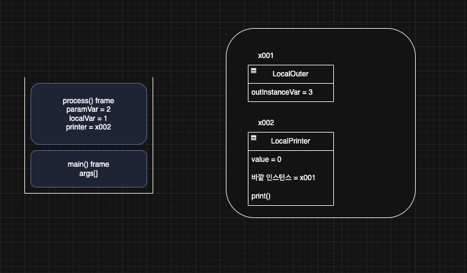
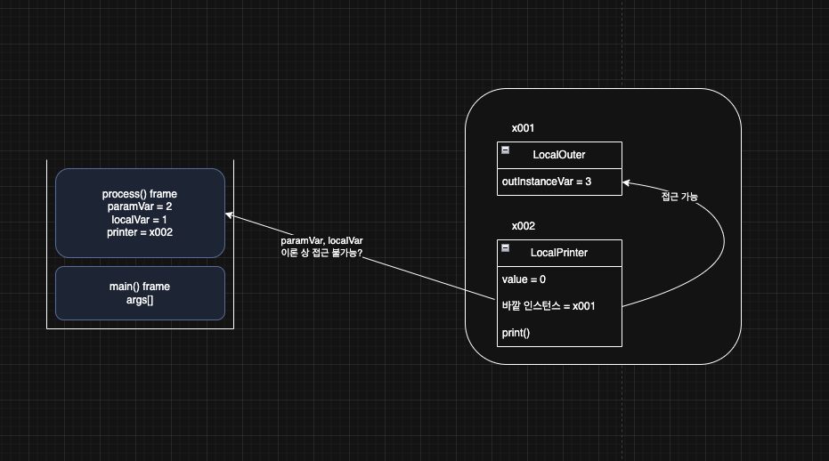
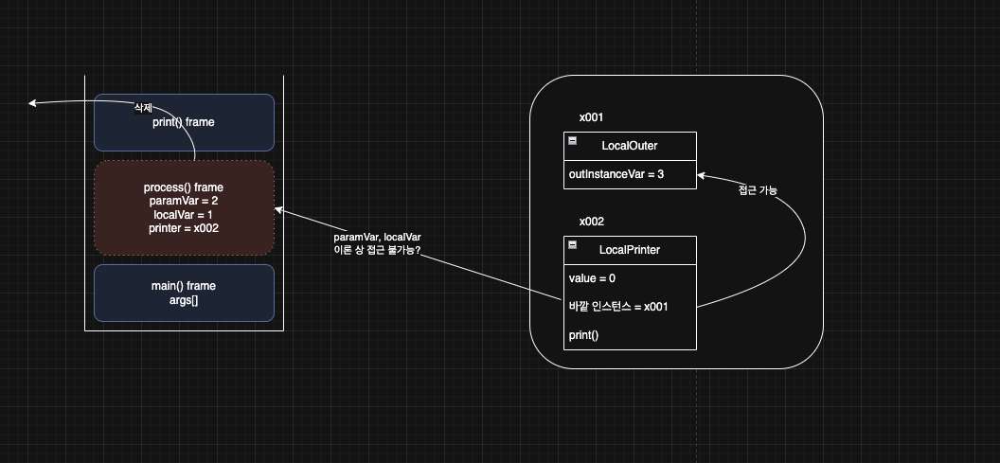
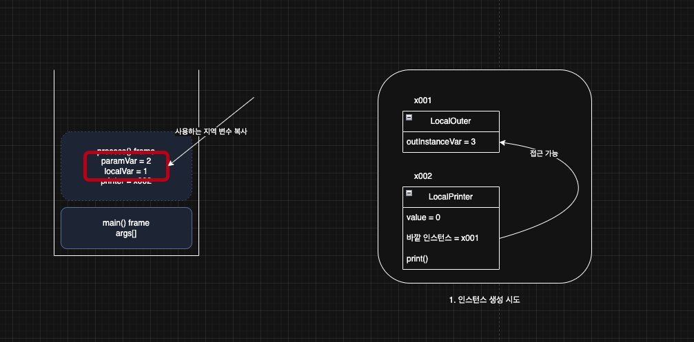
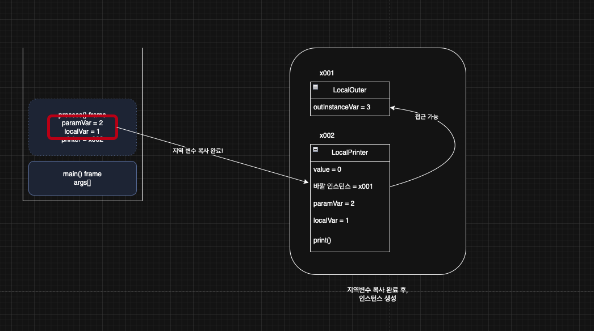

> 해당 블로그 글은 [영한님의 인프런 강의](https://inf.run/FiFGQ)를 바탕으로 쓰여진 글입니다.

## 지역 클래스 - 시작

지역 클래스(Local class)는 내부 클래스의 특별한 종류의 하나이다. 따라서 내부 클래스의 특징을 그대로 가진다. 그리고 지역 클래스는 지역 변수처럼 코드 블럭 안에서 정의 된다.

### 지역 클래스의 접근 범위

- 자신의 인스턴스 변수에 접근이 가능하다.
- 자신이 속한 코드블럭의 지역변수에 접근이 가능하다.
- 자신이 속한 코드블럭의 파라미터 변수에도 접근이 가능하다.
- 바깥 클래스의 인스턴스 변수에도 접근이 가능하다.

그럼 예제를 살펴보자.

``` java
package nested.local;

@FunctionalInterface
public interface Printer {
    void print();
}
```

위와 같은 인터페이스가 존재하고 해당 인터페이스를 구현한 지역클래스 예제를 보자.

``` java
package nested.local;

public class LocalOuter {

    private int outInstanceVar = 3;

    public void process(int paramVar) {
        int localVar = 1;

        class LocalPrinter implements Printer {
            int value = 0;

            @Override
            public void print() {
                System.out.println("value = " + value);
                System.out.println("localVar = " + localVar);
                System.out.println("paramVar = " + paramVar);
                System.out.println("outInstanceVar = " + outInstanceVar);
            }
        }

        LocalPrinter printer = new LocalPrinter();
        printer.print();
    }

    public static void main(String[] args) {
        LocalOuterV2 localOuter = new LocalOuterV2();
        localOuter.process(2);
    }
}
```

> ✅ 참고
>
> 지역 클래스는 말 그대로 지역변수와 같다. 지역변수는 접근 제어자를 붙일 수 없다. 따라서 지역 클래스도 접근 제어자를 못 붙인다.

## 지역 클래스 - 지역 변수 캡처1

> ✅ 참고
>
> 지역 변수 캡쳐링은 단순히 지역 클래스가 접근하는 지역 변수 값은 변경하면 안 된다라고 요약할 수 있어서 해당 내용이 어려우면 이렇게라도 알자.

### 변수의 생명 주기

- 클래스 변수: 프로그램 종료 까지, 가장 길다(메서드 영역)
  - 클래스 변수(static 변수)는 메서드 영역에 존재하고, 자바가 클래스 정보를 읽어 들이는 순간부터 프로그램 종료까지 존재한다.
- 인스턴스 변수: 인스턴스의 생존 기간(힙 영역)
  - 인스턴스 변수는 본인이 소속된 인스턴스가 GC 되기 전까지 존재한다. 생존 주기가 긴 편이다.
- 지역 변수: 메서드 호출이 끝나면 사라짐(스택 영역)
  - 지역 변수는 스택 영역의 스택 프레임 안에 존재한다. 따라서 메서드가 호출 되면 생성되고, 메서드 호출이 종료되면 스택 프레임이 제거되면서 그 안에 있는 지역 변수도 모두 제거된다. 생존 주기가 아주 짧다. 참고로 매개변수도 지역 변수의 한 종류이다.

그러면 예시 코드와 그림을 통해 조금 재밌는 부분을 보자.

``` java
package nested.local;

public class LocalOuterV3 {

    private int outInstanceVar = 3;

    public Printer process(int paramVar) {
        int localVar = 1;

        class LocalPrinter implements Printer {
            int value = 0;

            @Override
            public void print() {
                System.out.println("value = " + value);
                System.out.println("localVar = " + localVar);
                System.out.println("paramVar = " + paramVar);
                System.out.println("outInstanceVar = " + outInstanceVar);
            }
        }

        Printer printer = new LocalPrinter();
        
        return printer;
    }

    public static void main(String[] args) {
        LocalOuterV3 localOuter = new LocalOuterV3();
        Printer printer = localOuter.process(2);
        printer.print();
    }
}
```

위와 같이 코드를 작성해보았다. 그런데 조금 아리송한 개념이 있다. 일단 그 개념을 그림과 함께 설명해보도록 하겠다.

### LocalPrinter 인스턴스 생성 직후 메모리 그림



#### 지역 클래스 인스턴스의 생존 범위

- 지역 클래스로 만든 객체도 인스턴스이기 때문에 힙 영역에 존재한다. 따라서 GC 전까지 생존한다.
  - `LocalPrinter` 인스턴스는 `process()` 메서드 안에서 생성된다. 그리고 `process()` 에서 `main()`으로 생성한 `LocalPrinter` 인스턴스를 반환하고 `printer` 변수에 참조를 보관한다. 따라서 `LocalPrinter` 인스턴스는 `main()` 이 종료될 때 까지 생존한다.
- `paramVar`,`localVar` 와 같은 지역 변수는 `process()` 메서드를 실행하는 동안에만 스택 영역에서 생존한다. `process()` 메서드가 종료되면 `process()` 스택 프레임이 스택 영역에서 제거 되면서 함께 제거된다.

### LocalPrinter.print() 접근 메모리 그림



- `LocalPrinter`의 `print()` 메서드를 호출하면 바깥 인스턴스 변수를 접근할 때는 아무런 문제가 없다. 왜냐하면 해당 인스턴스 변수는 GC가 되고 나서 사라지기 때문이기 때문에 `main()`메서드가 종료되고 나서 사라질 예정이기에 아무런 문제가 없다.
- 그런데 문제는 `paramVar`와 `localVar`같은 지역변수를 접근할 때가 문제가 될 것 같다. 왜냐하면 코드를 보면 `process()` 메서드를 호출하고 해당 반환값을 `main()` 메서드 안에서 받는다. 그 후에 `print()` 메서드를 호출한다. 호출 후에 지역변수들을 접근하려고 보니 메서드 스택에 `process()` 스택이 사라지고 난 후이다. 사실 정확한 이론적인 그림은 아래와 같아 질 것이다.



그러면 오류가 나야 하는 것이 아닐까? 하지만 결과는 정상적으로 출력이 잘 된다. 왜 그런걸까?

## 지역 클래스 - 지역 변수 캡처2

지역 변수의 생명주기는 짧고, 지역 클래스를 통해 생성한 인스턴스의 생명 주기는 길다. 지역 클래스를 통해 생성한 인스턴스가 지역 변수에 접근해야 하는데, 둘의 생명 주기가 다르기 때문에 인스턴스는 살아 있지만, 지역 변수는 이미 제거된 상태일 수 있다.

### 지역변수 캡처링

자바는 이런 문제를 해결하기 위해 지역 클래스의 인스턴스를 생성하는 시점에 필요한 지역 변수를 복사해서 생성한 인스턴스에 함께 넣어둔다. 이런 과정을 변수 캡처(Capture)라 한다. 물론 모든 지역 변수를 캡처하는 것이 아니라 접근이 필요한 지역 변수만 캡처한다.

> ✅ 참고
>
> 참고로 바깥 클래스 참조 값도 캡쳐링을 한다.

그러면 캡처 과정을 그림을 통해 살펴보자.

#### 지역 클래스의 인스턴스 생성과 지역 변수 캡처 과정1



- `LocalPrinter` 인스턴스를 생성한다. 생성하려고 할 때 지역 클래스가 접근하는 지역변수 목록들을 확인한다. 그리고 사용하는 지역 변수들을 복사한다.

#### 지역 클래스의 인스턴스 생성과 지역 변수 캡처 과정2



- 지역 변수를 복사가 완료 되었으면 인스턴스의 인스턴스 변수로 붙여넣기를 한다. 그리고 인스턴스 생성이 완료된다. 이제 복사한 변수를 통해서 접근이 가능해지는 것이다.

사실 지역 클래스가 접근하는 지역 변수는 지역 변수가 아니라 캡쳐받은 인스턴스 변수인 셈이다. 캡처한 `paramVar`,`localVar`의 생명주기는 `LocalPrinter` 인스턴스의 생명주기와 같다. 따라서 `LocalPrinter` 인스턴스는 지역 변수의 생명주기와 무관하게 언제든지 `paramVar`,`localVar` 캡처 변수에 접근할 수 있다. 이렇게 해서 지역 변수와 지역 클래스를 통해 생성한 인스턴스의 생명주기가 다른 문제를 해결한다.

## 지역 클래스 - 지역 변수 캡처3

지역 클래스가 접근하는 지역 변수는 절대로 중간에 값이 변하면 안된다. 따라서 `final`로 선언하거나 또는 사실상 `final` 이어야 한다. 이것은 자바 문법이고 규칙이다.

> 📚 용어 정리
>
> 사실상 `final` 지역 변수는 지역 변수에 `final` 키워드를 사용하지는 않았지만, 값을 변경하지 않는 지역 변수를 뜻한다. `final` 키워드를 넣지 않았을 뿐이지, 실제로는 `final` 키워드를 넣은 것 처럼 중간에 값을 변경하지 않은 지역 변수이다. 따라서 사실상 `final` 지역 변수는 `final` 키워드를 넣어도 동일하게 작동해야 한다.

그래서 중간에 지역변수 값을 지역 클래스에서 변경하려고 한다면 컴파일 에러가 발생한다. 왜 이렇게 자바는 제약을 두었을까? 아래와 같은 이유때문에 지역 변수의 값을 변경하지 못하게 하는 것이다.

- 지역 변수의 값을 변경하면 인스턴스에 캡처한 변수의 값도 변경해야 한다.
- 반대로 인스턴스에 있는 캡처 변수의 값을 변경하면 해당 지역 변수의 값도 다시 변경해야 한다.
- 개발자 입장에서 보면 예상하지 못한 곳에서 값이 변경될 수 있다. 이는 디버깅을 어렵게 한다.
- 지역 변수의 값과 인스턴스에 있는 캡처 변수의 값을 서로 동기화 해야 하는데, 멀티쓰레드 상황에서 이런 동기화는 매우 어렵고, 성능에 나쁜 영향을 줄 수 있다. 이 부분은 멀티쓰레드를 학습하면 이해할 수 있다.

이 모든 문제는 캡처한 지역 변수의 값이 변하기 때문에 발생한다. 자바는 캡처한 지역 변수의 값을 변하지 못하게 막아서 이런 복잡한 문제들을 근본적으로 차단한다.

## 익명 클래스 - 시작

익명 클래스는 지역 클래스의 한 종류이다. 지역 클래스인데 이름이 없는 것이 특징이다. 방금까지 봤던 지역 클래스를 익명 클래스로 변경해보겠다.

``` java
package nested.anonymous;

import nested.local.Printer;

public class AnonymousOuter {

    private int outInstanceVar = 3;

    public void process(int paramVar) {
        int localVar = 1;

        Printer printer = new Printer() {
            int value = 0;

            @Override
            public void print() {
                System.out.println("value = " + value);
                System.out.println("localVar = " + localVar);
                System.out.println("paramVar = " + paramVar);
                System.out.println("outInstanceVar = " + outInstanceVar);
            }
        };

        printer.print();
        System.out.println("printer.class = " + printer.getClass());
    }

    public static void main(String[] args) {
        AnonymousOuter main = new AnonymousOuter();
        main.process(2);
    }
}
```

이전에 지역 클래스는 아래와 같이 선언을 해주고

``` java
class LocalPrinter implements Printer {
 // ....
}

Printer printer = new LocalPrinter();
```

아래와 같이 사용을 했어야 했다.

``` java
printer.print();
```

하지만 익명 클래스를 사용하면 선언과 생성을 한번에 처리가 가능하다.

``` java
Printer printer = new Printer(){
  //body
}
```

- 익명 클래스는 이름 없는 지역 클래스를 선언하면서 동시에 생성한다.
- 익명 클래스는 부모 클래스를 상속 받거나, 또는 인터페이스를 구현해야 한다. 익명 클래스를 사용할 때는 상위 클래스나 인터페이스가 필요하다.
- 익명 클래스는 말 그대로 이름이 없다. 이름을 가지지 않으므로, 생성자를 가질 수 없다. (기본 생성자만 사용됨)
- 익명 클래스는 `AnonymousOuter$1` 과 같이 자바 내부에서 바깥 클래스 이름 + `$` + 숫자로 정의된다. 익명 클래스가 여러개면 `$1`,`$2`,`$3`으로 숫자가 증가하면서 구분된다.

### 장점

익명 클래스를 사용하면 클래스를 별도로 정의하지 않고도 인터페이스나 추상 클래스를 즉석에서 구현할 수 있어 코드가 더 간결해진다. 하지만, 복잡하거나 재사용이 필요한 경우에는 별도의 클래스를 정의하는 것이 좋다.

### 사용할 수 없을 때

익명 클래스는 단 한 번만 인스턴스를 생생할 수 있다. 여러 번 생성이 필요하다면 익명 클래스를 사용할 수 없다. 대신에 지역 클래스를 선언하고 사용하면 된다.

## 익명 클래스 활용

온라인 쇼핑몰 도메인에서 상품과 할인 정책 관련 로직을 익명 클래스를 활용하여 구현하는 예제를 통해서 익명 클래스에 익숙해지자.

``` java
public class Product {
    private String name;
    private int price;
    
    public Product(String name, int price) {
        this.name = name;
        this.price = price;
    }
    
    public String getName() {
        return name;
    }
    
    public int getPrice() {
        return price;
    }
}
```

``` java
public interface DiscountPolicy {
    int calculateDiscount(Product product);
}
```

위와 같이 상품 도메인과 할인 정책 인터페이스를 개발하였다. 이제 각각 인터페이스의 구현체를 개발해보자.

``` java
// 정률 할인 정책 구현
public class PercentDiscountPolicy implements DiscountPolicy {
    private double percent;
    
    public PercentDiscountPolicy(double percent) {
        this.percent = percent;
    }
    
    @Override
    public int calculateDiscount(Product product) {
        return (int)(product.getPrice() * percent / 100);
    }
}
```

``` java
// 정액 할인 정책 구현
public class FixedDiscountPolicy implements DiscountPolicy {
    private int amount;
    
    public FixedDiscountPolicy(int amount) {
        this.amount = amount;
    }
    
    @Override
    public int calculateDiscount(Product product) {
        return amount;
    }
}
```

그리고 해당 클래스를 이용하여 사용하면 쇼핑몰을 완성할 수 있을 것 같다. 하지만 여기에 문제점이 보일 것이다. 바로 할인 정책은 `main()` 메서드에서만 쓰인다는 점이다. 그래서 해당 부분을 지역 클래스 더 나아가 익명클래스로 한번에 바꿔보자.

``` java
public class ShoppingMallExample {
    public static void main(String[] args) {
        // 상품 생성
        Product laptop = new Product("노트북", 1000000);
        Product phone = new Product("스마트폰", 800000);
        Product watch = new Product("스마트워치", 300000);
        
        // 1. 익명 클래스를 사용한 10% 할인 정책
        DiscountPolicy tenPercentOff = new DiscountPolicy() {
            @Override
            public int calculateDiscount(Product product) {
                return (int)(product.getPrice() * 0.1);
            }
        };
        
        // 2. 익명 클래스를 사용한 고정 할인 정책 (50,000원 할인)
        DiscountPolicy fixedAmountOff = new DiscountPolicy() {
            @Override
            public int calculateDiscount(Product product) {
                return 50000;
            }
        };
        
        // 3. 익명 클래스를 사용한 가격 기반 조건부 할인 정책
        DiscountPolicy conditionalDiscount = new DiscountPolicy() {
            @Override
            public int calculateDiscount(Product product) {
                if (product.getPrice() >= 1000000) {
                    return (int)(product.getPrice() * 0.2); // 100만원 이상 상품 20% 할인
                } else if (product.getPrice() >= 500000) {
                    return (int)(product.getPrice() * 0.1); // 50만원 이상 상품 10% 할인
                }
                return 0; // 그 외에는 할인 없음
            }
        };
        
        // 4. 익명 클래스를 사용한 특정 상품 할인 정책
        DiscountPolicy specificProductDiscount = new DiscountPolicy() {
            @Override
            public int calculateDiscount(Product product) {
                if (product.getName().equals("노트북")) {
                    return 100000; // 노트북만 10만원 할인
                }
                return 0;
            }
        };
        
        // 5. 익명 클래스를 사용한 복합 할인 정책 (최대 할인액 제한)
        DiscountPolicy maxLimitDiscount = new DiscountPolicy() {
            private final int MAX_DISCOUNT = 100000;
            
            @Override
            public int calculateDiscount(Product product) {
                int discount = (int)(product.getPrice() * 0.15); // 15% 할인
                return Math.min(discount, MAX_DISCOUNT); // 최대 10만원까지만 할인
            }
        };
        
        // 할인 적용 결과 출력
        System.out.println("=== 10% 할인 정책 ===");
        printDiscountedPrice(laptop, tenPercentOff);
        
        System.out.println("\n=== 고정 금액 할인 정책 ===");
        printDiscountedPrice(laptop, fixedAmountOff);
        
        System.out.println("\n=== 가격 기반 조건부 할인 정책 ===");
        printDiscountedPrice(laptop, conditionalDiscount);
        printDiscountedPrice(phone, conditionalDiscount);
        printDiscountedPrice(watch, conditionalDiscount);
        
        System.out.println("\n=== 특정 상품 할인 정책 ===");
        printDiscountedPrice(laptop, specificProductDiscount);
        printDiscountedPrice(phone, specificProductDiscount);
        
        System.out.println("\n=== 최대 할인액 제한 정책 ===");
        printDiscountedPrice(laptop, maxLimitDiscount);
        printDiscountedPrice(phone, maxLimitDiscount);
    }
    
    private static void printDiscountedPrice(Product product, DiscountPolicy policy) {
        int discount = policy.calculateDiscount(product);
        int finalPrice = product.getPrice() - discount;
        
        System.out.println(product.getName() + " 원가: " + product.getPrice() + "원");
        System.out.println("할인액: " + discount + "원");
        System.out.println("최종 가격: " + finalPrice + "원");
    }
}
```

### 람다(lamba)

자바8 이전까지 메서드에 인수로 전달할 수 있는 것은 크게 2가지였다.

- `int`,`double` 과 같은 기본형 타입
- `Process`,`Member` 와 같은 참조형 타입(인스턴스)

지금처럼 코드 조각을 전달하기 위해 클래스를 정의하고 메서드를 만들고 또 인스턴스를 꼭 생성해서 전달해야 할까? 생각해보면 클래스나 인스턴스와 관계 없이 다음과 같이 메서드만 전달할 수 있다면 더 간단하지 않을까? 그래서 자바8에 들어서면서 큰 변화가 있었는데 바로 메서드(더 정확히는 함수)를 인수로 전달할 수 있게 되었다. 이것을 간단히 람다(Lambda)라 한다.

간단히 람다로 변경해보는 법을 보겠다. 일단 인터페이스는 구현해야 할 메서드가 하나이므로 `@FunctionalInterface`를 붙일 수 있다.

``` java
@FunctionalInterface
public interface DiscountPolicy {
    int calculateDiscount(Product product);
}
```

다음으로 기존 익명 클래스를 IDE 도움을 받아서 아래와 같이 변경이 가능하다.

``` java
DiscountPolicy tenPercentOff = product -> (int)(product.getPrice() * 0.1);
DiscountPolicy fixedAmountOff = product -> 50000;
DiscountPolicy conditionalDiscount = product -> {
    if (product.getPrice() >= 1000000) return (int)(product.getPrice() * 0.2);
    else if (product.getPrice() >= 500000) return (int)(product.getPrice() * 0.1);
    return 0;
};
```

람다에 대한 자세한 내용은 추후에 다루겠다.

> 잘못된 지식이 있을 경우 댓글로 남겨주시면 빠르게 반영하겠습니다!