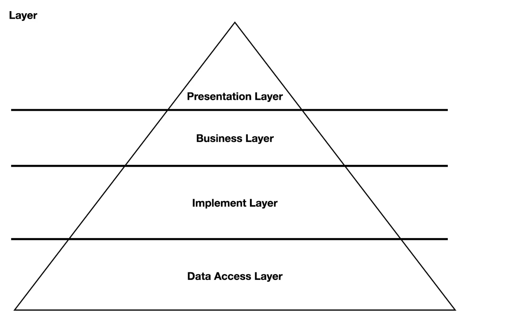

> 본 포스팅은 인프런의 [제미니의 개발실무 - 지속 성장 가능한 소프트웨어를 만들어가는 방법](https://inf.run/wMtej)를 참조하여 작성한 글입니다.

## Introduce

많은 회사들이 차세대라는 프로젝트를 진행하면서 기존 시스템을 사용자 친화적으로 업그레이드를 많이한다. 해당 일부 회사들은 이런 차세대 프로젝트의 주기가 빨라지는 경우도 존재한다. 하지만 이런 차세대를 하면서 초기에 장애가 나고 그 장애를 안정화 시키지만 추가적인 기능이 또 들어가야 할 때 차세대한 시스템이 확장성이 떨어져서 또 차세대를 하는 경우가 존재한다. 이런 경우는 개발자의 시간과 금전적인 리소스가 낭비가 된다. 그래서 우리는 이런 소프트웨어를 개발할 때 이러한 상황을 고려하고 이러한 상황이 발생할 때를 대비하여 미리 준비를 해야한다고 한다.

그러기 위해 우리는 이러한 준비를 위해 아래와 같은 3가지 파트를 나누어서 이야기 해보려고 한다.

- Business Logic
- Layer
- Module

비즈니스 로직은 어떻게 구성을 하고 수많은 레이어는 어떻게 분리를 하고 모듈간에는 어떻게 나누는지에 대해 한번 알아보도록 하자.

## Business Logic

비즈니스 로직은 우리가 개발을 하면서 정말 많이 들어본 용어이다. 그러면 비즈니스 로직은 무엇일까? 아래의 스프링 서버 예시를 한번 살펴보도록 하자.

<div style="max-width: 600px; margin: 0 auto; padding: 20px; font-family: Arial, sans-serif; background-color: #fff;">
  <div style="text-align: center; font-size: 32px; font-weight: bold; margin-bottom: 30px; color: #000;">API Server</div>
  
  <div style="border: 3px solid #000; padding: 40px; text-align: center; font-size: 28px; font-weight: bold; background-color: #fff; margin-bottom: 10px; color: #000;">Controller</div>
  <div style="text-align: center; font-size: 40px; margin: 10px 0; color: #000;">↓</div>
  
  <div style="border: 3px solid #000; padding: 40px; text-align: center; font-size: 28px; font-weight: bold; background-color: #fff; margin-bottom: 10px; color: #000;">Service</div>
  <div style="text-align: center; font-size: 40px; margin: 10px 0; color: #000;">↓</div>
  
  <div style="border: 3px solid #000; padding: 40px; text-align: center; font-size: 28px; font-weight: bold; background-color: #fff; margin-bottom: 10px; color: #000;">Repository</div>
</div>

위와 같은 소프트웨어를 보면 스프링을 이용하여 API 서버를 구축하였다. 컨트롤러를 통해서 요청을 받고 서비스 레이어에서 비즈니스 로직을 수행하고 필요한 데이터가 있다면 레파지토리 레이어를 통해서 DB에 접근하여 데이터를 가져온다. 그러면 여기서 의문이 있다. 왜 비즈니스 로직은 서비스 레이어에 작성해야 할까? 그러면 대부분 사람들은 아래와 같이 이야기 할 것이다.

> 이제까지 그렇게 만들아왔고 기조가 그러니까 그렇게 만들었다.

그러면 여기서 비즈니스 로직은 무엇일까? 한번 코드를 살펴보자.

``` kotlin
fun businessPay(request: PayRequest, userId: Long) {
    val user = userRepository.findById(userId)
        .orElseThrow { RuntimeException("존재하지 않는 사용자입니다.") }
    
    val store = storeRepository.findByIdAndStatus(request.storeId, StoreStatus.ACTIVE)
    if (store.storeType == StoreType.HYPER && user.type != UserType.HYPER) throw RuntimeException("등급이 낮습니다.")
    if (store.storeType == StoreType.SUPER && user.type != UserType.SUPER) throw RuntimeException("등급이 낮습니다.")
    
    val storeItem = storeItemRepository.findById(request.storeItemId)
        .orElseThrow { RuntimeException("정상적인 상품이 아닙니다.") }
    if (storeItem.amount != request.amount) throw RuntimeException("정상적인 상품이 아닙니다.")
    if (storeItem.status != request.itemStatus) throw RuntimeException("정상적인 상품이 아닙니다.")
    
    val itemArgument = when (storeItem.type) {
        ItemType.SINGLE -> {...}
        ItemType.DELIVERY -> {...}
        ItemType.TAX -> {...}
        ItemType.NOTAX -> {...}
        ItemType.PACKAGE -> {...}
        else -> {...}
    }
    
    val point = pointRepository.findByUserId(user.id)
        .orElseGet { newPoint(user.id) }
    minusPoint(point, request.pointAmount)
    
    val payment = newPayment(user, store, storeItem, itemArgument)
    paymentRepository.save(payment)
}
```

위의 로직을 살펴보면 `userId`를 바탕으로 유저 객체를 찾고 `storedId`를 통해서 store 객체를 찾는데 유저 타입을 통해 뭔가 예외도 처리하고 그 다음에 `storeItemId`를 통해서도 찬단 로직을 쓴 다음에 `payment`객체를 만들어서 저장히는 듯 보인다. 그러면 해당 함수에서 대체 어떤 로직을 처리하는 것일까? 한눈에 들어올까? 필자가 느끼기에는 한눈에 들어오지 않는다. 또한, 해당 로직은 비즈니스 로직이 아니라 뭔가 구현 로직인듯 보인다. 비즈니스 레이어라는 서비스 레이어에서 데이터 조회까지 다 하고 payment도 만들고 포인트도 차감하고 직접 저장까지 하는데 필자가 느끼기에는 이런 부분으로 비즈니스 로직보다는 구현 로직에 가깝다고 생각이 든다. 그러면 필자가 느끼는 비즈니스 로직은 무엇인가? 바로 아래와 같은 코드를 말하고 싶은 것이다.

``` kotlin
@Service
class PaymentService(
    private val userReader: UserReader,
    private val storeReader: StoreReader,
    private val pointManager: PointManager,
    private val paymentAppender: PaymentAppender,
) {
    fun businessPay(targetStore: TargetStore, usePoint: UsePoint, userId: Long) {
        val user = userReader.read(userId)
        
        val store = storeReader.read(targetStore, StoreGrade(user.type))
        
        pointManager.use(user, usePoint)
        paymentAppender.append(user, store)
    }
}
```

위의 코드는 이전에 보여줬던 코드와 동일한 코드이며, 이전 코드를 리팩토링 한 결과이다. 간단하게만 보더라도 혹여나 신규 입사자가 보더라도 명확한 로직 흐름이 보이는 것을 알 수 있다. 즉, 코드의 흐름으로 해당 함수가 처리하는 내용이 보인다. 즉, 이런 자연스러운 흐름으로 작성된 로직이 비즈니스 로직이라 생각이 든다. 위와 같이 작성하니 서비스 코드에서 하는 일이 매우 준 셈이다. 데이터를 직접 조회해서 검증하거나 payment를 만들거나 포인트를 만들고 차감하는 행위도 하지 않고 로직 자체도 가지지 않는 것이다. 비즈니스를 중심으로 각 역할을 가진 협력 도구 클래스들을 중계해주는 역할만 하고 있는 셈이다. 그리고 각 도구 클래스들이 명시적으로 한 가지 일을 하고 있는 형태가 잘 나타나져 있다.

그래서 위의 코드를 만약 신규 입사자가 본다거나 혹은 비개발직군과 소통을 할 때 비즈니스 컨텍스트를 이해하고 있는 사람이라면 이해가 잘 되는 코드가 된 것이다. 필자도 실무에서 위와 같은 형태로 작성을 못하는 경우가 많다. 그래서 나중에 유지보수를 할 때도 엄청 복잡해져서 코드 파악이 안 되는 경험도 했었다. 따라서, 필자도 앞으로는 이렇게 작성해보는 경험을 가지면서 진행을 해보도록 해야겠다.

## Layer

다음으로 Layer에 대하여 이야기를 해보려고 한다. 각 회사마다 팀마다 Layer에 대한 규칙이 있을 것이고 혹은 일반적인 규칙인 controller-service-repository로 레이어를 관리할 수도 있다. 혹은 다양한 패턴을 적용한 레이어로 관리할 수 있을 것이다. 우선, 필자가 제안하는 레이어를 살펴보도록 하자.



위의 피라미드 형태를 보면 총 4단계로 이루어져 있다. Presentation Layer -> Business Layer -> Implement Layer -> Data access Layer가 있다. 그러면 하나씩 살펴보자.

먼저 Presentation Layer를 살펴보자. 해당 레이어는 노출을 담당하는 레이어로 코드상으로는 controller같은 것이 될 수 있을 것이다. controller말고도 converter나 요청/응답 DTO, validator등 노출에 필요한 클래스들이 해당 레이어에 들어갈 것이다.

다음으로 비즈니스 로직을 담당하는 Business Layer를 살펴보자. 코드 기준으로는 서비스 클래스들이 해당 레이어에 속한다고 보면 좋을 것 같다. 이전에 살펴본 개선한 서비스 코드가 해당 레이어에 들어가는 것이다.

세번째로 비즈니스 코드를 이루기 위한 도구 클래스들이 있는 곳인 Implement Layer를 살펴보자. 위의 예시 코드에 `UserReader`와 같이 상세 구현로직이 있는 클래스가 해당 레이어에 소속된다. 실제 프로젝트에서도 해당 레이어에 가장 많은 클래스들이 존재할 것이고 구현 로직을 담당하기 때문에 재사용성이 높은 핵심 레이어라고 보면 좋을 것 같다.

마지막으로 Data Access Layer에 대해 살펴보자. 시스템적으로 DB나 캐시, SFPT, 파일 스토리지등 이런 상세 구현 로직이 외부 시스템에 접근할때 거쳐가는 레이어라고 볼 수 있다.

그러면 이 레이어로 4가지 규칙을 살펴보도록 하자.

### 레이어는 위에서 아래로 순 방향으로만 참조되어야 한다.

첫번째 규칙은 레이어는 위에서 아래로 순 방향으로만 참조되어야 한다라는 아주 간단한 규칙이다.

### 레이어의 참조 방향이 역류되지 않아야 한다.

두번째 규칙은 레이어의 참조 방향이 역류되지 않아야 한다이다. 코드로 이야기 해보면 `UserService`라는 서비스 레이어 클래스가 `UserController`를 가지고 있는 것은 아주 이상한 일이라고 자연스럽게 느낄 것이다.

### 레이어의 참조가 하위 레이어를 건너뛰어서는 안 된다.

세번째 규칙은 레이어의 참조가 하위 레이어를 건너뛰어서는 안 된다이다. 처음에 보여준 예제 코드를 보면 서비스 레이어에서 repository들을 주입받는 것은 아주 좋지 못한 결과인셈이다. 왜냐하면 비즈니스 레이어에서 상세 로직과 구현기술에 대해 세부적으로 알게 되는 셈인 것이다. 이러한 형태는 소프트웨어를 오랫동안 유지하고 확장시키려고 할 때 걸림돌이 될 수 있는 가능성이 높다. 이러한 문제를 방지하기 위해서 Implement Layer를 두어서 해당 레이어에서 상세 구현 로직을 풀어내고 Business Layer가 Implement Layer를 사용하는 그래서 비즈니스 로직을 풀어나가는 형태가 되어야 한다.

### 동일 레이어 간에는 서로 참조하지 않아야 한다. (Implement는 예외)

마지막 규칙은 동일 레이어 간에는 서로 참조하지 않아야 한다이다. 다만 Implement Layer는 예외적으로 서로 참조가 가능하다. 이 규칙은 Implement Layer에 재사용성을 더 늘리고 협력이 가능한 완결성이 높은 Implement 구현체들을 더 많이 만들게 제안한다. 비즈니스가 오염되는 것을 방지하는 규칙이기도 하고 구현체의 재사용성을 위해 이런 규칙을 가지고 있다고 이해하면 좋을 것 같다.

### Module & Outro

다음으로 Module에 대해 이야기 해보자. 좋은 소프트웨어를 만들기 위해서 모듈화를 하는 것은 정말 중요하다. 또한, 모듈간의 격리를 이용하면 소프트웨어를 제약하기도 하고 통제권을 얻기도 하는 장점이 있는 것 같다. 다음 예제를 살펴보자.

``` kotlin
dependencies {
    api("org.springframework.security:spring-security-web")
    api("org.springframework.boot:spring-boot-starter-data-jpa")
    runtimeOnly("org.mariadb.jdbc:mariadb-java-client")
}
```

위의 의존성만 보더라도 단순하게 web과 jpa 의존성으로 API 서버를 만들겠다라고 이해가 될 것이다. 그런데 만약 해당 서버에 사용자수도 많아지고 다양한 기능들도 추가한다면 해당 서버는 아래와 같이 확장될 수 있을 것이다.

``` kotlin
dependencies {
    api("org.springframework.security:spring-security-web")
    api("org.springframework.boot:spring-boot-starter-data-jpa")
    api("org.springframework.boot:spring-boot-starter-actuator")
    api("org.springframework.boot:spring-boot-starter-data-redis")
    api("org.springframework.boot:spring-boot-starter-cache")
    api("org.springframework.cloud:spring-cloud-starter-config")
    api("org.ehcache:ehcache")
    api("org.springframework.kafka:spring-kafka")
    runtimeOnly("org.mariadb.jdbc:mariadb-java-client")
}
```

요구사항도 많아지면서 구현해야할 것들이 많아지고 그러다 보니 의존성이 되게 많이 추가가 된 것이다. 이렇게 의존성들이 많이 추가되다 보니까 해당 서버의 걱정스러운 면은 해당 모듈이 오염될 가능성이 있을 것 같다라는 생각이 들 것이다. 이러한 상황에서 새로운 요구사항으로 배치를 개발해야 한다고 가정해보자. 그럼 어떤 형태로 확장이 될까? 아마 api 모듈을 그대로 가져가서 배치 모듈을 구성한다고 해보자. 물론 일정이 타이트한 경우 이렇게 하겠지만 그렇지 않은 경우는 이렇게 하지는 않을 것이다. 일단 현재 일정이 타이트해서 api 모듈의 의존성을 그대로 가져와서 작성했다고 해보자. 그러면 목적은 이루었으니 지금은 괜찮을 것이다. 그런데 만약, 성능을 개선한다던지 버그가 생겨서 버그를 수정하려고 한다면 어떻게 할까?

예를 들어, JPA를 걷어내고 새로운 기술로 변경해야한다는 가정을 해보자. 그런데 api 모듈과 배치 모듈이 같은 의존성을 가지고 있으면 문제가 생기게 된다. JPA 의존성을 다른 의존성으로 교체를 하게되다보면 다른 상세 구현 로직이 변경될 수도 있을 수도 있기 때문이다. 이렇게 한 모듈에서 너무 많은 의존성을 알게 되는 문제로 인해 나오는 것 같다. 또한, 이런 JPA를 걷어낼 때 api 모듈뿐만 아니라 배치 모듈에서도 걷어내야 하는 문제도 발생하는 것이다.

그러면 어떻게 모듈을 구축해야할까? 필자였다면 각자 의존성을 카테고리화하여 각 모듈로 만들 것 같다. 예를 들어 결제 모듈이 있다고 하자. 그런데 신규 기능으로 국세청과 연동해야 하는 작업이 있다고 하자. 그러면 해당 모듈에 국세청 관련 의존성을 추가하는 것이 아니라 별도 모듈로 구성하여 진행할 것 같다. 그렇게 되면 결제 관련 모듈은 커지지 않는 현상이 될 것이다. 새로운 기능에 대한 의존성을 추가하면서도 말이다.

``` kotlin
/** API **/
dependencies {
    implementation(project(":modules:logging"))
    implementation(project(":modules:cloud-config"))

    implementation(project(":modules:db-payments"))

    implementation(project(":modules:client-nts-api"))

    implementation("org.springframework.boot:spring-boot-starter-web")
}
```

만약 결제 모듈에 배치 모듈도 생겼다고 해보자. 그럴 경우 위와 같이 모듈화를 진행하면 아래와 같이 모듈을 재사용할 수 있는 부분도 생기고 각 핵심 모듈은 커지지 않는 장점이 존재한다.

``` kotlin
/** Batch **/
dependencies {
    implementation(project(":modules:logging"))
    implementation(project(":modules:cloud-config"))

    implementation(project(":modules:client-nts-sftp"))

    implementation("org.springframework.boot:spring-boot-starter-batch")
}
```