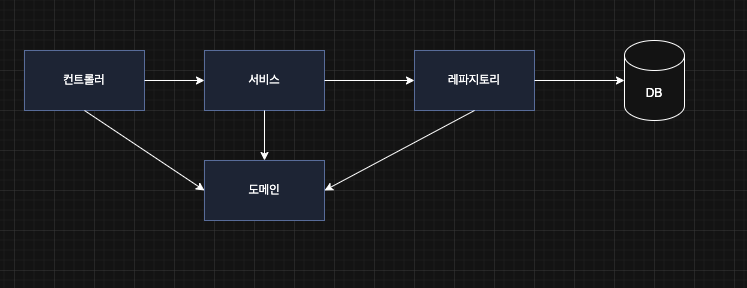
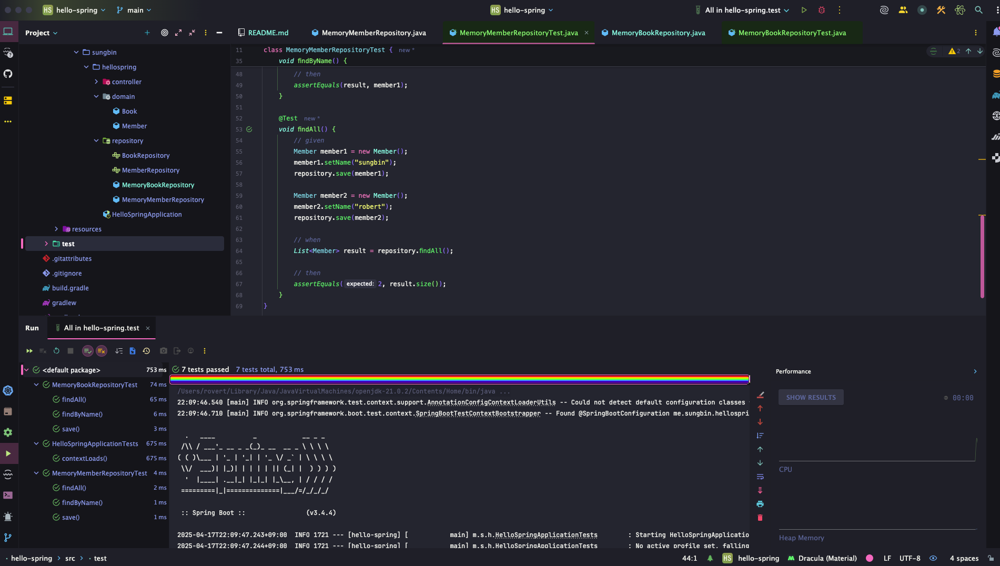

> 해당 블로그 글은 [영한님의 인프런 강의](https://inf.run/deYaF)를 바탕으로 쓰여진 글입니다.

## 비즈니스 요구사항 정리

이제 우리가 프로젝트를 만들어 보면서 실제 전반적인 개발 흐름을 살펴보자. 강의에서는 회원 도메인으로 하였지만 실제 나는 책 도메인으로 한번 해보겠다. 이렇게 응용해봐야 내 실력에도 도움이 되지 않을까 싶다. 요구 사항은 다음과 같다고 해보자.

- 데이터: 책id, 제목
- 기능: 책 등록, 조회
- 아직 DB가 선정되지 않음

실무에서 일반적인 웹 어플리케이션 구조는 다음과 같다고 본다.



- 컨트롤러: 웹 MVC의 컨트롤러 역할
- 서비스: 핵심 비즈니스 로직 구현
- 레파지토리: DB 접근, 도메인 객체를 DB에 저장하고 관리
- 도메인: 비즈니스 도메인 객체

그리고 아직 DB가 선정되지 않았기에 초기에는 메모리로 한번 해보겠다. 그리고 나중에 결정이 되면 추가 확장을 위해 인터페이스를 이용해보겠다.


## 책 도메인과 레파지토리 만들기

일단 아래와 같이 도메인과 레파지토리 코드를 작성해보자.

### 도메인

``` java
package me.sungbin.hellospring.domain;

public class Book {

    private Long id;

    private String title;

    public Long getId() {
        return id;
    }

    public void setId(Long id) {
        this.id = id;
    }

    public String getTitle() {
        return title;
    }

    public void setTitle(String title) {
        this.title = title;
    }
}
```

### 레파지토리

``` java
package me.sungbin.hellospring.repository;

import me.sungbin.hellospring.domain.Book;
import java.util.List;
import java.util.Optional;

public interface BookRepository {

    Book save(Book book);

    Optional<Book> findById(Long id);

    Optional<Book> findByTitle(String title);

    List<Book> findAll();
}
```

``` java
package me.sungbin.hellospring.repository;

import me.sungbin.hellospring.domain.Book;

import java.util.*;

/**
 * 동시성 문제가 고려되어 있지 않음, 실무에서는 ConcurrentHashMap, AtomicLong 사용 고려
 */
public class MemoryBookRepository implements BookRepository {

    private static Map<Long, Book> store = new HashMap<>();

    private static long sequence = 0L;

    @Override
    public Book save(Book book) {
        book.setId(++sequence);
        store.put(book.getId(), book);

        return book;
    }

    @Override
    public Optional<Book> findById(Long id) {
        return Optional.ofNullable(store.get(id));
    }

    @Override
    public Optional<Book> findByTitle(String title) {
        return store.values().stream()
                .filter(book -> book.getTitle().equals(title))
                .findAny();
    }

    @Override
    public List<Book> findAll() {
        return new ArrayList<>(store.values());
    }

    public void clearStore() {
        store.clear();
    }
}
```

## 책 리포지토리 테스트 케이스 작성

위에 작성한 코드에 대한 테스트 코드를 작성해보자. 테스트 코드가 없다면 매번 직접 실행 혹은 실행 툴을 이용하여 확인을 하는 반복적인 작업을 할 것이다. 이러한 방법은 준비하고 실행하는데 오래 걸리고, 반복 실행하기 어렵고 여러 테스트를 한번에 실행하기 어렵다는 단점이 있다. 자바는 JUnit이라는 프레임워크로 테스트를 실행해서 이러한 문제를 해결한다.

그러면 테스트 코드를 아래와 같이 작성해보자.

``` java
package me.sungbin.hellospring.repository;

import me.sungbin.hellospring.domain.Book;
import org.junit.jupiter.api.AfterEach;
import org.junit.jupiter.api.Test;

import java.util.List;

import static org.junit.jupiter.api.Assertions.assertEquals;

class MemoryBookRepositoryTest {

    private MemoryBookRepository repository = new MemoryBookRepository();

    @AfterEach
    void tearDown() {
        repository.clearStore();
    }

    @Test
    void save() {
        // given
        Book book = new Book();
        book.setTitle("토비의 스프링");

        // when
        repository.save(book);

        // then
        Book result = repository.findById(book.getId()).get();
        assertEquals(result, book);
    }

    @Test
    void findByName() {
        // given
        Book book1 = new Book();
        book1.setTitle("토비의 스프링");
        repository.save(book1);

        Book book2 = new Book();
        book2.setTitle("JPA");
        repository.save(book2);

        // when
        Book result = repository.findByTitle("토비의 스프링").get();

        // then
        assertEquals(result, book1);
    }

    @Test
    void findAll() {
        // given
        Book book1 = new Book();
        book1.setTitle("토비의 스프링");
        repository.save(book1);

        Book book2 = new Book();
        book2.setTitle("JPA");
        repository.save(book2);

        // when
        List<Book> result = repository.findAll();

        // then
        assertEquals(2, result.size());
    }
}
```

보통 실무에서 이렇게 비즈니스 로직을 작성하고 테스트 코드를 작성하는 방법도 있지만 먼저 틀을 잡는 관점에서 실패에 대한 테스트코드를 작성후 실패 결과를 확인 후 성공으로 변경하게 비즈니스 로직을 작성하는 방법론이 존재한다. 이것이 바로 `TDD`다.

또한 위의 테스트 코드를 실행하다 보면 에러가 `@AfterEach`가 붙은 tearDown 메서드 없이 돌리면 실패가 되는 경우가 있을 것이다. 이것은 바로 테스트가 끝난 후 데이터를 삭제를 안 해줬기 때문에 발생하는 문제이다. 그래서 보통 DB관련 테스트를 돌릴 때는 테스트가 끝난 직후에 데이터를 초기화 해주는 작업이 필요하다. 그리고 `@AfterEach`라는 어노테이션이 바로 각 테스트 메서드가 끝난 후 실행되게 해주는 역할을 한다.

테스트 메서드는 메서드 단위로 테스트가 가능하며 클래스 단위로도 가능하다. 또한 전체 패키지 레벨에서도 가능하다. 필자는 보통 각 테스트 코드를 작성 후 메서드 레벨로 테스트하다가 하나의 클래스 레벨 테스트 코드가 작성되면 클래스 레벨로 테스트 진행한다. 마지막 모든 케이스의 테스트를 작성 했을 때 패키지 레벨로 전체 돌려본다. 전체 패키지 레벨로 테스트를 돌리면 성공했다는 가정하에 아래와 같이 나올 것이다.



> ✅ 참고
>
> 테스트는 각각 독립적으로 실행되어야 한다. 테스트 순서에 의존관계가 있는 것은 좋은 테스트가 아니다.

## 책 서비스 개발

이제 실제 비즈니스 로직을 작성해보자. 아래와 같이 책 등록, 전체 조회, 한건 조회를 구현해보자.

``` java
package me.sungbin.hellospring.service;

import me.sungbin.hellospring.domain.Book;
import me.sungbin.hellospring.repository.BookRepository;
import me.sungbin.hellospring.repository.MemoryBookRepository;

import java.util.List;
import java.util.Optional;

public class BookService {

    private final BookRepository bookRepository = new MemoryBookRepository();

    /**
     * 책 등록
     */
    public Long register(Book book) {
        validateDuplicateBook(book);
        bookRepository.save(book);

        return book.getId();
    }

    /**
     * 전체 책 조회
     */
    public List<Book> findBooks() {
        return bookRepository.findAll();
    }

    public Optional<Book> findOne(Long id) {
        return bookRepository.findById(id);
    }

    private void validateDuplicateBook(Book book) {
        bookRepository.findByTitle(book.getTitle())
                .ifPresent(b -> {
                    throw new IllegalStateException("이미 등록된 책입니다.");
                });
    }
}
```

여기서 유념히 볼 것은 바로 유효성 검사 부분이다. 반드시 비즈니스 로직을 작성할 때 예외케이스를 항상 염두해두고 작성을 해야한다.

## 책 서비스 테스트

테스트 코드를 쉽게 만드는 단축키는 맥 기준 `command + shift + t`이다. 그러면 테스트 디렉토리에 똑같은 패키지로 만들어진다.

또한 테스트를 작성할 때 추천 기법이 있다. 바로 `given-when-then`이다. 즉, 뭐가 주어지고 뭘 할 때 어떠한 결과가 있어야 한다라고 해야 로직 자체도 명확해진다. 왠만한 테스트는 이 패턴에 다 부합하다.

또한 테스트는 해당 로컬이나 개발서버에만 돌리고 프로덕션에는 안 나가기 때문에 명확히 파악하기 위해 메서드명을 한글로 해도 된다.

그러면 테스트코드를 작성해보자. 다만, 테스트 코드 작성 전에 재밌는 짓좀 해보자. 지금은 메모리 기반 repository를 쓰고 있다. 하지만 이 repository는 DB가 선정이 되면 변경 될 예정이다. 하지만 실제 서비스 로직에서는 repository 객체를 직접 생성했다. 그러지 말고 외부에서 주입 받도록 DI구조로 변경해보자.

``` java
package me.sungbin.hellospring.service;

import me.sungbin.hellospring.domain.Book;
import me.sungbin.hellospring.repository.BookRepository;

import java.util.List;
import java.util.Optional;

public class BookService {

    private final BookRepository bookRepository;

    public BookService(BookRepository bookRepository) {
        this.bookRepository = bookRepository;
    }

    /**
     * 책 등록
     */
    public Long register(Book book) {
        validateDuplicateBook(book);
        bookRepository.save(book);

        return book.getId();
    }

    /**
     * 전체 책 조회
     */
    public List<Book> findBooks() {
        return bookRepository.findAll();
    }

    public Optional<Book> findOne(Long id) {
        return bookRepository.findById(id);
    }

    private void validateDuplicateBook(Book book) {
        bookRepository.findByTitle(book.getTitle())
                .ifPresent(b -> {
                    throw new IllegalStateException("이미 등록된 책입니다.");
                });
    }
}
```

또한 이렇게 DI구조로 변경되는 이유 중 하나가 만약 서비스 객체에서 직접 repository를 생성한 객체는 테스트 코드에서 생성한 객체와 다른 객체이다. 이것은 분명하다. 참조 값이 다르기 때문이다. 물론 repository 안에 HashMap은 static이라 지금은 문제가 안되겠지만 실제는 그렇지 않다. 그래서 실무에서는 이렇게 하면 안된다. 게다가 서로 참조값이 다른 repository이기 때문에 다른 repostory를 테스트 하는 꼴이다. 결국 신뢰할 수 없는 테스트이다. 그래서 DI구조로 바꾼 것이다. 그러면 이제 테스트코드를 아래와 같이 작성해보자.

``` java
package me.sungbin.hellospring.service;

import me.sungbin.hellospring.domain.Book;
import me.sungbin.hellospring.repository.MemoryBookRepository;
import org.junit.jupiter.api.AfterEach;
import org.junit.jupiter.api.BeforeEach;
import org.junit.jupiter.api.Test;

import static org.junit.jupiter.api.Assertions.*;

class BookServiceTest {

    private BookService bookService;

    private MemoryBookRepository bookRepository;

    @BeforeEach
    void setUp() {
        bookRepository = new MemoryBookRepository();
        bookService = new BookService(bookRepository);
    }

    @AfterEach
    void tearDown() {
        bookRepository.clearStore();
    }

    @Test
    void 등록() throws Exception {
        // given
        Book book = new Book();
        book.setTitle("스프링");

        // when
        Long savedId = bookService.register(book);

        // then
        Book findBook = bookRepository.findById(savedId).get();
        assertEquals(findBook.getTitle(), book.getTitle());
    }

    @Test
    void 중복_책_제외() throws Exception {
        // given
        Book book1 = new Book();
        book1.setTitle("스프링");

        Book book2 = new Book();
        book2.setTitle("스프링");

        // when
        bookService.register(book1);
        IllegalStateException e = assertThrows(IllegalStateException.class, () -> bookService.register(book2));

        // then
        assertEquals("이미 등록된 책입니다.", e.getMessage());
    }
}
```

여기서 몇가지 문법만 살펴보자. `assertEquals`는 첫번째 파라미터로 예상되는 값, 두번째 파라미터로 실제 값을 넣고 서로 같은지 알려주는 메서드이다. 또한 예외가 발생하는 경우는 `try-catch`로 하는것이 아니라 `assertThrows`의 첫번째 파라미터로 예외 클래스, 2번째 파리미터는 람다로 명시한 예외 클래스가 나오는 메서드를 적어주면 된다.

`@BeforeEach`는 각 테스트 메서드가 실행되기 전에 반드시 실행시켜야 할 로직들을 실행해주는 메서드이다. 위와 같이 생성자 초기화 같은 것들을 할 수 있다. 즉, 테스트가 서로 영향이 없도록 항상 새로운 객체를 생성하고, 의존관계도 새로 맺어준다.

> 테스트 문법은 여기서는 상세히 공부하지는 않겠다. 중요한 부분만 살펴보고 지금은 그냥 넘어가자.

> 잘못된 지식이 있을 경우 댓글로 남겨주시면 빠르게 반영하겠습니다!