> 해당 블로그 글은 [영한님의 인프런 강의](https://inf.run/xexJb)를 바탕으로 쓰여진 글입니다.

## 배열의 특징1 - 배열과 인덱스

> 📚 용어 정리
>
> 배열과 같이 여러 데이터(자료)를 구조화해서 다루는 것을 자료 구조라 한다.

자바는 배열 뿐만 아니라, 컬렉션 프레임워크라는 이름으로 다양한 자료 구조를 제공한다. 컬렉션 프레임워크를 살펴보기 전에 한번 배열의 코드를 통해 배열의 특징들을 살펴보도록 하자.

``` java
package collection.array;

import java.util.Arrays;

public class ArrayMain1 {
    public static void main(String[] args) {
        int[] arr = new int[5];

        System.out.println("==index 입력: O(1)==");
        arr[0] = 1;
        arr[1] = 2;
        arr[2] = 3;
        System.out.println(Arrays.toString(arr));

        System.out.println("==index 변경: O(1)==");
        arr[2] = 10;
        System.out.println(Arrays.toString(arr));

        System.out.println("==index 조회: O(1)==");
        System.out.println("arr[2] = " + arr[2]);

        System.out.println("==배열 검색: O(n)==");
        System.out.println(Arrays.toString(arr));

        int value = 10;
        for (int i = 0; i < arr.length; i++) {
            System.out.println("arr[" + i + "] = " + arr[i]);

            if (arr[i] == value) {
                System.out.println(value + " 찾음");
                break;
            }
        }
    }
}
```

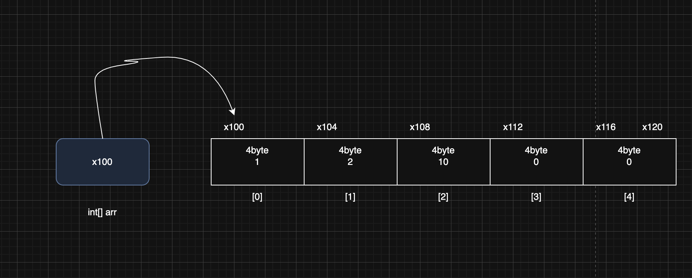

`int[] arr = new int[5];`를 통하여 위와 같이 배열이 생성 될 것이다. 처음에는 초기 값이 0이다. 그리고 코드들을 수행하면서 위와 같이 값이 채워질 것이다. 그런데 코드를 보면서 의문사항이 든다. 배열에 입력, 변경, 조회를 할 때는 한번에 찾을 수 있는 것일까? 또 검색을 할 때는 왜 이리 성능이 안 나오는 것일까? 일단 먼저 배열의 특징을 살펴보고 해당 부분에 대해 설명하겠다. 배열의 특징은 다음과 같다.

### 배열의 특징

- 배열에서 자료를 찾을 때 인덱스(index)를 사용하면 매우 빠르게 자료를 찾을 수 있다.
- 인덱스를 통한 입력, 변경, 조회의 경우 한번의 계산으로 자료의 위치를 찾을 수 있다.

### 배열 index 사용 예시

예를 들어 `arr[2]`를 찾는다고 생각해보자. 배열은 컴퓨터 메모리상 주소값이 이어서 붙어있다. 또한 지금은 `int`형이라는 고정된 크기 값의 배열로 이루어져 있다. 따라서 인덱스 값이 주어지고 해당 부분의 있는 값을 조회한다고 한다면 컴퓨터는 배열의 시작 위치인 x100 부터 시작해서 자료의 크기(4byte)와 인덱스 번호를 곱하면 원하는 메모리 위치를 찾을 수 있다. 즉, 쉽게 이야기해서 컴퓨터에 배열 인덱스를 주고 값을 조회, 입력, 변경을 요청하면 아래의 공식에 대입하여 해당 인덱스의 메모리 값을 찾아주는 것이다. 비유적으로 이야기 하자면 카운터가 손님의 요청으로 5층의 3번째 방을 찾아달라고 요청한다면 카운터는 바로 5층이 어디있는지 참조값을 확인 후, 해당 호실을 보고 계산해서 찾아주는 것처럼 말이다.

> 공식
>
> 배열의 시작 참조 + (자료의 크기 * 인덱스 위치)

배열의 경우 인덱스를 사용하면 한번의 계산으로 매우 효율적으로 자료의 위치를 찾을 수 있다. 정리하면 배열에서 인덱스를 사용하는 경우 데이터가 아무리 많아도 **한 번의 연산으로 필요한 위치를 찾을 수 있다.** 데이터가 10억건이 있더라도 한번의 연산으로 해결할 수 있으니 엄청 효율적인 것이다.

### 배열 검색

배열에 들어있는 데이터를 찾는 것을 검색이라 한다. 배열에 들어있는 데이터를 검색할 때는 배열에 들어있는 데이터를 하나하나 비교해야 한다. 이때는 이전과 같이 인덱스를 사용해서 한번에 찾을 수 없다. 대신에 배열안에 들어있는 데이터를 하나하나 확인해야 한다. 따라서 평균적으로 볼때 배열의 크기가 클 수록 오랜 시간이 걸린다. 배열의 순차 검색은 배열에 들어있는 데이터의 크기 만큼 연산이 필요하다. **배열의 크기가 n이면 연산도 n만큼 필요하다.** 예를 들어 10억건의 데이터에 10이라는 숫자를 검색하려 한다면 10억건의 데이터를 다 뒤져야 찾을 수 있다. 운이 좋다면 한번에 찾을 수도 있겠지만 정말 최악의 경우 10억건의 데이터를 다 뒤졌는데도 못 찾을 수 있는 것이다. 비유적으로 표현하자면 손님의 요청으로 5층에 "김민수"라는 손님이 있는지 찾아야 한다고 하자. 그러면 5층의 모든 호실에 문을 뚜드려서 "김민수"가 있냐고 확인해야 한다. 운이 좋다면 1호실에 바로 찾을 수도 있겠지만 정말 최악의 경우 5층에 "김민수"라는 손님이 없을 경우인 것이다.

## 빅오(O) 표기법

빅오(Big O) 표기법은 알고리즘의 성능을 분석할 때 사용하는 수학적 표현 방식이다. 이는 특히 알고리즘이 처리해야 할 데이터의 양이 증가할 때, 그 알고리즘이 얼마나 빠르게 실행되는지 나타낸다. 여기서 중요한 것은 알고리즘의 정확한 실행 시간을 계산하는 것이 아니라, 데이터 양의 증가에 따른 성능의 변화 추세를 이해하는 것이다.

### 빅오 표기법 예시


- **O(1)** - 상수 시간: 입력 데이터의 크기에 관계없이 알고리즘의 실행 시간이 일정한다.
    - ex. 배열에서 인덱스를 사용하는 경우
- **O(n)** - 선형 시간: 알고리즘의 실행 시간이 입력 데이터의 크기에 비례하여 증가한다.
    - ex. 배열의 검색, 배열의 모든 요소를 순회하는 경우
- **O(n²)** - 제곱 시간: 알고리즘의 실행 시간이 입력 데이터의 크기의 제곱에 비례하여 증가한다.
    - ex. 보통 이중 루프를 사용하는 알고리즘에서 나타남
- **O(log n)** - 로그 시간: 알고리즘의 실행 시간이 데이터 크기의 로그에 비례하여 증가한다.
    - ex. 이진 탐색
- **O(n log n)** - 선형 로그 시간
    - ex. 정렬 알고리즘

빅오 표기법은 매우 큰 데이터를 입력한다고 가정하고, 데이터 양 증가에 따른 성능의 변화 추세를 비교하는데 사용한다. 쉽게 이야기해서 정확한 성능을 측정하는 것이 목표가 아니라 매우 큰 데이터가 들어왔을 때의 대략적인 추세를 비교를 하는 것이 목적이다. 즉, 짜잘짜잘한 상수값이 있더라도 하나의 큰 추세를 보는 것이기에 상수는 `O(1)`의 경우를 제외하고 제거한다.

빅오 표기법은 별도의 이야기가 없으면 보통 최악의 상황을 가정해서 표기한다. 물론 최적(O(1)), 평균(O(n/2)), 최악(O(n²))의 경우로 나누어 표기하는 경우도 있다.

배열에 데이터가 100,000건이 있다면 인덱스를 사용하면 1번의 연산으로 결과를 찾을 수 있지만, 순차 검색을 사용한다면 최악의 경우 100,000번의 연산이 필요하다. 배열에 들어있는 데이터의 크기가 증가할 수록 그 차이는 매우 커진다. 따라서 인덱스를 사용할 수 있다면 최대한 활용하는 것이 좋다.

## 배열의 특징2 - 데이터 추가

이번에는 배열의 특정 위치에 새로운 데이터를 추가해보자. 데이터를 추가할 때, 첫번째 인덱스에 데이터를 추가를 하는 것과 특정 인덱스에 데이터를 추가하는 것과 마지막 인덱스에 데이터를 추가하는 과정을 살펴보자.

### 첫번째 인덱스에 데이터 추가

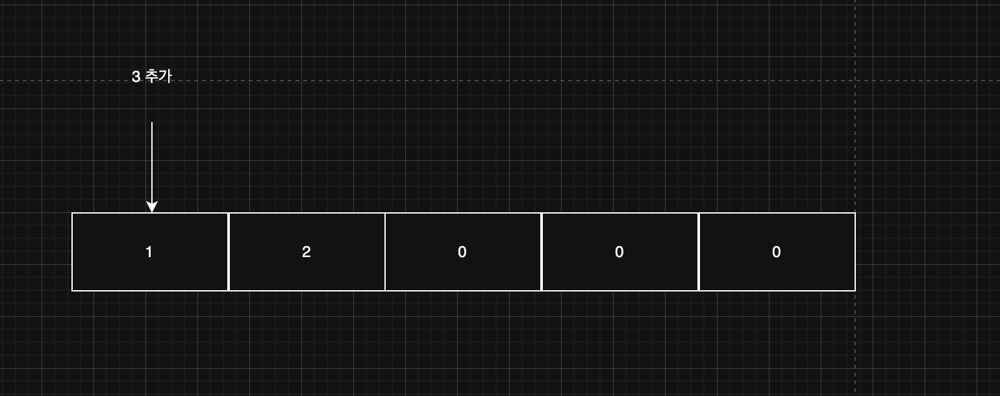

먼저 데이터를 추가하기 전에 첫번째 인덱스를 찾아야 한다. 여기서 `O(1)`의 연산이 발생한다.

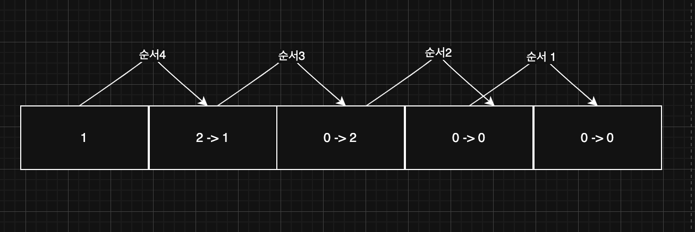

다음으로 첫번째 인덱스에 데이터를 삽입하기 위해서는 기존의 값은 유지를 해야 하기 때문에 기존의 값을 다음 인덱스로 값으로 복사를 해두어야 한다. 그런데 복사 순서는 위의 그림과 같이 배열의 마지막 인덱스부터 진행을 해야 한다. 안 그러면 배열의 복사 된 값이 유지가 안 되는 문제가 발생한다. 해당 복사 과정에서 `O(n)`연산이 발생한다.

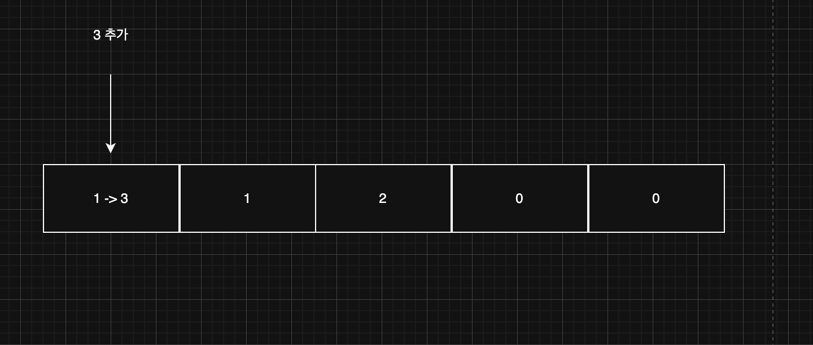

마지막으로 첫번째 인덱스에 데이터를 삽입한다. 해당 과정에서 `O(1)`의 연산이 발생한다.

최종적으로 `O(1)` + `O(n)` + `O(1)` = `O(n+2)` = `O(n)`의 연산이 발생하게 되는 것이다.

### 특정 인덱스에 데이터 추가

배열의 중간에 데이터를 추가한다고 해보자.

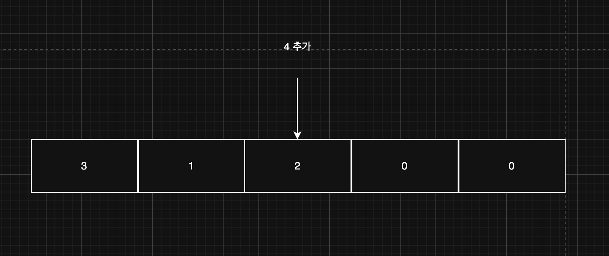

그럼 먼저 데이터의 중간 위치의 인덱스를 찾아야 한다. 여기서 `O(1)`의 연산이 발생한다.

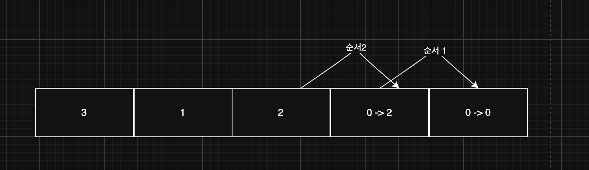

다음으로 중간 인덱스에 데이터를 삽입하기 위해서는 기존의 값을 유지를 해야 하기 때문에 해당 중간 인덱스부터 마지막 인덱스까지 각각 다음 인덱스로 값을 복사해두어야 한다. 그런데 복사 순서는 위의 그림과 같이 배열의 마지막 인덱스부터 진행을 해야한다. 첫번째 인덱스에 데이터 삽입 과정과 다른 점은 중간 인덱스 왼쪽편의 인덱스들은 데이터 복사를 안 해도 된다는 것이다. 해당 과정 복사에서 `O(n/2)`의 연산이 발생한다. 이유는 중간 인덱스이니 전체 n개의 절반이니 대략 이정도 연산이 발생하는 것이다.

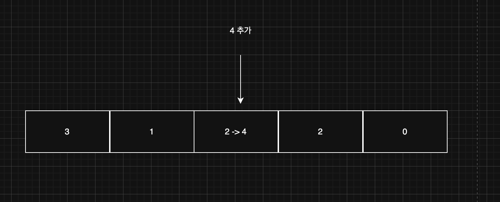

마지막으로 중간 인덱스에 데이터를 삽입한다. 해당 과정에서 `O(1)`의 연산이 발생한다.

최종적으로 `O(1)` + `O(n/2)` + `O(1)` = `O(n/2 + 2)` = `O(n)`의 연산이 발생하게 되는 것이다.

### 마지막 인덱스에 데이터 추가

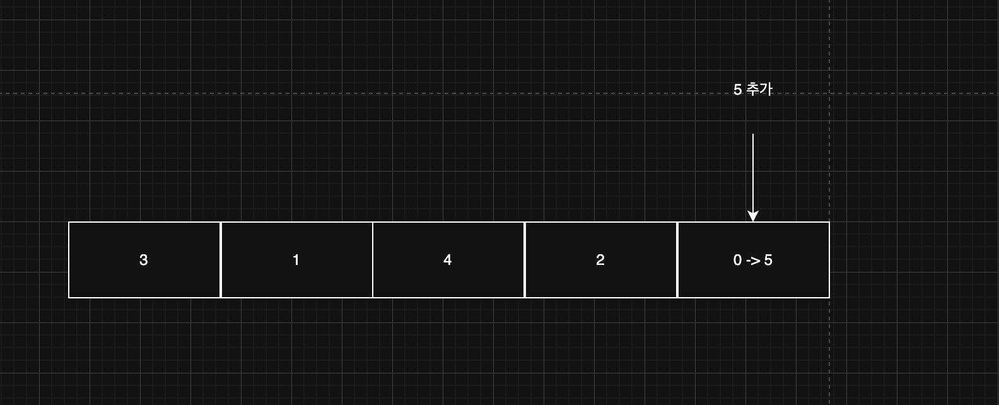

마지막 인덱스에 데이터를 추가하는 과정은 마지막 인덱스를 찾아서 바꿔주기만 하면 되므로 `O(1)`연산만 발생한다.

### 배열의 한계

배열은 가장 기본적인 자료 구조이고, 특히 인덱스를 사용할 때 최고의 효율이 나온다. 하지만 이런 배열에는 큰 단점이 있다. 바로 배열의 크기를 배열을 생성하는 시점에 미리 정해야 한다는 점이다. 배열처럼 처음부터 정적으로 길이가 정해져있는 것이 아니라, 동적으로 언제든지 길이를 늘리고 줄일 수 있는 자료 구조가 있다면 편리할 것이다. 그래서 나온게 `List` 자료 구조이다.

## 직접 구현하는 배열 리스트1 - 시작

기존 배열에는 문제점들이 있었다. 첫째, **배열의 길이를 동적으로 변경이 불가했다.** 둘째, **데이터를 추가하기 불편했다.** 데이터를 중간에 추가하려면 기존의 인덱스의 값들을 복사해서 다음 인덱스로 넣어주고 변경하려는 인덱스의 값을 변경해야 했다.

배열의 이런 불편함을 해소하고 동적으로 데이터를 추가할 수 있는 자료 구조를 List(리스트)라 한다.

### List 자료구조

리스트 자료구조는 배열과 유사하다. 다만 차이점은 동적으로 배열의 길이를 변경할 수 있다는 것이다. 그러면 한번 우리가 해당 자료구조를 직접 구현해보자. 처음에는 부족한 코드겠지만 점차 발전 시킬 예정이다.

``` java
package collection.array;

import java.util.Arrays;

public class MyArrayListV1 {

    private static final int DEFAULT_CAPACITY = 5;

    private Object[] elementData;

    private int size;

    public MyArrayListV1() {
        elementData = new Object[DEFAULT_CAPACITY];
    }

    public MyArrayListV1(int initialCapacity) {
        elementData = new Object[initialCapacity];
    }

    public int size() {
        return size;
    }

    public void add(Object e) {
        elementData[size] = e;
        size++;
    }

    public Object get(int index) {
        return elementData[index];
    }

    public Object set(int index, Object element) {
        Object oldValue = get(index);
        elementData[index] = element;

        return oldValue;
    }

    public int indexOf(Object o) {
        for (int i = 0; i < size; i++) {
            if (o.equals(elementData[i])) {
                return i;
            }
        }

        return -1;
    }

    @Override
    public String toString() {
        return Arrays.toString(Arrays.copyOf(elementData, size)) + " size = " + size + ", capacity = " + elementData.length;
    }
}
```

그러면 주요 필드와 메서드, 그리고 처음 보는 문법들에 대해 살펴보자.

- `Object[] elementData` : 다양한 타입의 데이터를 보관하기 위해 `Object` 배열을 사용한다.
- `DEFAULT_CAPACITY` : 리스트를 생성할 때 사용하는 기본 배열의 크기이다. 만약 기본 배열 크기를 사용하기 싫다면 배열의 크기를 입력을 받는 생성자를 호출하여 인스턴스를 생성하면 된다.
- `size` : 리스트의 크기는 `size` 를 사용한다. 리스트를 표현하기 위해 내부에서 배열을 사용할 뿐이다. 배열의 길이와 다르다. `size`는 실제 데이터가 들어가 있는 크기를 말하면 이해가 쉬울 것이다.
- `add(Object e)` : 리스트에 데이터를 추가한다. 데이터를 추가하면 `size` 가 하나 증가한다.
- `get(index)` : 인덱스에 있는 항목을 조회한다.
- `set(index, element)` : 인덱스에 있는 항목을 변경한다. 그리고 변경 전, 기존의 값을 반환한다.
- `indexOf(Object o)` : 검색 기능이다. 리스트를 순차 탐색해서 인수와 같은 데이터가 있는 인덱스의 위치를 반환한다. 데이터가 없으면 `-1`을 반환한다.
- `Arrays.copyOf(elementData, size)` : `size` 크기의 배열을 새로 만든다. 여기서는 `toString()` 출력시 `size` 이후의 의미 없는 값을 출력하지 않기 위해 사용한다.

이제 해당 클래스를 사용하는 코드를 살펴보자.

``` java
package collection.array;

public class MyArrayListV1Main {
    public static void main(String[] args) {
        MyArrayListV1 list = new MyArrayListV1();

        System.out.println("==데이터 추가==");
        System.out.println(list);
        list.add("a");
        System.out.println(list);
        list.add("b");
        System.out.println(list);
        list.add("c");
        System.out.println(list);

        System.out.println("==기능 사용==");
        System.out.println("list.size(): " + list.size());
        System.out.println("list.get(1): " + list.get(1));
        System.out.println("list.indexOf('c'): " + list.indexOf("c"));
        System.out.println("list.set(2, 'z'), oldValue " + list.set(2, "z"));
        System.out.println(list);

        System.out.println("==범위 초과==");
        list.add("d");
        System.out.println(list);
        list.add("e");
        System.out.println(list);

        list.add("f");
        System.out.println(list);
    }
}
```

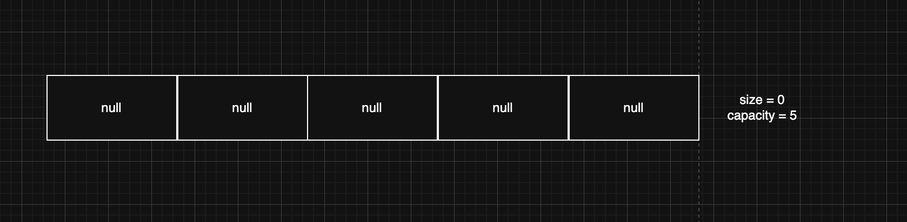

그럼 그림을 통해 하나하나 살펴보자. 처음에 생성자를 호출하여 인스턴스를 생성하면 위와 같이 배열이 생성될 것이다. 배열의 길이(capacity)는 5가 될 것이고, size(배열에 들어있는 실제 데이터 길이)는 0일 것이다.

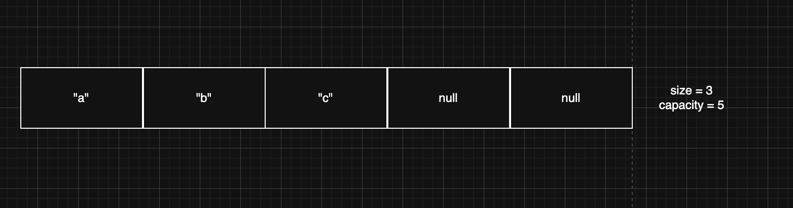

이제 `add()` 메서드를 통하여 데이터를 추가하면 위와 같이 size가 3으로 증가할 것이다.

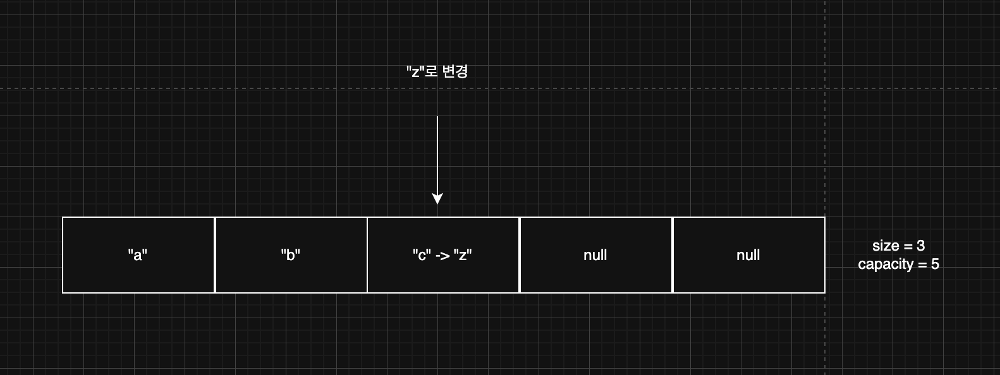

이제 `set()` 메서드를 통해 특정 인덱스의 데이터를 변경하는 것을 살펴보자. 아마 위와 같이 변경이 될 것이다.

이제 뭔가 완벽한 코드가 된 것 같지만 문제가 있다. 범위를 초과할 경우 런타임 예외가 발생하는 것이다. 우리가 원하는 리스트는 동적으로 저장할 수 있는 크기가 커지는 것이다. 저장할 수 있는 데이터의 크기가 동적으로 변할 수 있도록 코드를 변경해보자.

## 직접 구현하는 배열 리스트2 - 동적 배열

그러면 동적 배열이 가능하게 기존 코드를 변경해보자.

``` java
package collection.array;

import java.util.Arrays;

public class MyArrayListV2 {

    private static final int DEFAULT_CAPACITY = 5;

    private Object[] elementData;

    private int size;

    public MyArrayListV2() {
        elementData = new Object[DEFAULT_CAPACITY];
    }

    public MyArrayListV2(int initialCapacity) {
        elementData = new Object[initialCapacity];
    }

    public int size() {
        return size;
    }

    public void add(Object e) {
        if (size == elementData.length) {
            grow();
        }

        elementData[size] = e;
        size++;
    }

    public Object get(int index) {
        return elementData[index];
    }

    public Object set(int index, Object element) {
        Object oldValue = get(index);
        elementData[index] = element;

        return oldValue;
    }

    public int indexOf(Object o) {
        for (int i = 0; i < size; i++) {
            if (o.equals(elementData[i])) {
                return i;
            }
        }

        return -1;
    }

    @Override
    public String toString() {
        return Arrays.toString(Arrays.copyOf(elementData, size)) + " size = " + size + ", capacity = " + elementData.length;
    }

    private void grow() {
        int oldCapacity = elementData.length;
        int newCapacity = oldCapacity * 2;

        elementData = Arrays.copyOf(elementData, newCapacity);
    }
}
```

추가된 부분은 `grow()`라는 `private` 메서드이다. 해당 메서드는 `add()`에서 호출이 되는데 `add()`를 호출할 때 기존 capacity가 넘어설려고 하면 해당 capacity를 2배로 증가시켜주는 구조이다. 여기서 `Arrays.copyOf()`를 사용하면 새로운 배열의 길이를 생성하고 데이터를 복새해주는 기능까지 수행한다. 단, 해당 메서드는 복잡한 로직을 내부적으로 수행하기 때문에 무거운 연산이다. 그러면 위의 클래스를 사용하는 코드를 살펴보자.

``` java
package collection.array;

public class MyArrayListV2Main {
    public static void main(String[] args) {
        MyArrayListV2 list = new MyArrayListV2(2);
        System.out.println(list);

        list.add("a");
        System.out.println(list);
        list.add("b");
        System.out.println(list);
        list.add("c");
        System.out.println(list);
        list.add("d");
        System.out.println(list);
        list.add("e");
        System.out.println(list);
        list.add("f");
        System.out.println(list);
    }
}
```

이제 그림을 통해 살펴보자.

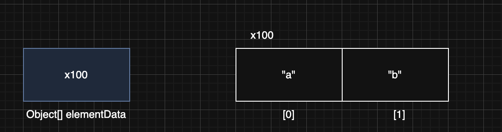

처음에 생성자를 호출하여 인스턴스를 생성하면 위와 같이 될 것이다. 그런데 여기서 "c"라는 문자열을 추가하려는 순간 `grow()` 메서드가 내부적으로 수행되면서 아래와 같이 기존 배열의 크기에 2개 증가된 길이의 새로운 배열을 만든 후, 복사하는 과정이 될 것이다. 그리고 참조값을 새로운 배열에 할당해주고 기존 배열은 GC의 대상이 될 것이다.


> ✅ 참고
>
> 배열을 새로 복사해서 만드는 연산은 배열을 새로 만들고 또 기존 데이터를 복사하는 시간이 걸리므로 가능한 줄이는 것이 좋다. 이렇게 2배씩 증가하면 배열을 새로 만들고 복사하는 연산을 줄일 수 있다. 반면에 배열의 크기를 너무 크게 증가하면 사용되지 않고 낭비되는 메모리가 많아지는 단점이 발생할 수 있다. 참고로 예제를 단순화 하기 위해 여기서는 2배씩 증가했지만, 실제 `ArrayList`같은 경우 보통 50% 정도 증가하는 방법을 사용한다.

## 직접 구현하는 배열 리스트3 - 기능 추가

다음으로 기능들을 추가해보자. 특정 인덱스 위치에 데이터 추가 및 삭제를 구현해보도록 하자.

### 순서대로 추가

데이터를 순서대로 추가하는 경우는 `O(1)`연산으로 매우 간단하다.

### 특정 인덱스에 추가

특정 인덱스에 추가가 문제이다. 만약 인덱스가 마지막이라면 큰 연산이 없이 인덱스로 데이터를 넣으면 그만이기에 `O(1)`연산으로 비교적 간단하다. 하지만 첫번째 인덱스거나 중간 인덱스 시, 기존에 있는 데이터를 마지막부터 오른쪽으로 옮겨야 하기 때문에 문제가 발생한다.

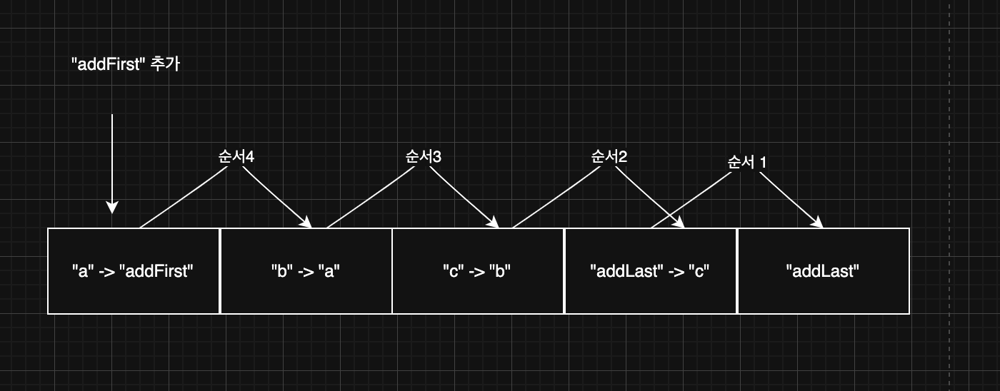

특정 인덱스에 추가는 마지막 인덱스를 제외하고는 위와 같이 먼저 데이터를 오른쪽으로 옮기고 데이터를 추가해야 한다. 즉 `O(n)`의 연산이 발생한다. 그러면 삭제를 살펴보자.

### 순서대로 삭제

삭제도 추가와 마찬가지로 순차적 삭제는 `O(1)`연산으로 매우 간단하다.

### 특정 인덱스 삭제

특정 인덱스에 삭제가 문제이다. 만약 삭제가 마지막이라면 큰 연산이 없이 인덱스에 데이터 값을 null로 하면 그만이기에 `O(1)`연산으로 비교적 간단하다. 하지만 첫번째 인덱스거나 특정 인덱스 시, 기존에 있는 데이터를 특정 인덱스 후부터 왼쪽으로 옮겨야 하기 때문에 문제가 발생한다.


특정 인덱스에 삭제는 마지막 인덱스를 제외하고는 위와 같이 먼저 데이터를 왼쪽으로 옮기고 데이터를 삭제해야 한다. 즉 `O(n)`의 연산이 발생한다.

그럼 위 과정들을 코드로 살펴보자.

``` java
package collection.array;

import java.util.Arrays;

public class MyArrayListV3 {

    private static final int DEFAULT_CAPACITY = 5;

    private Object[] elementData;

    private int size = 0;

    public MyArrayListV3() {
        elementData = new Object[DEFAULT_CAPACITY];
    }

    public MyArrayListV3(int initialCapacity) {
        elementData = new Object[initialCapacity];
    }

    public int size() {
        return size;
    }

    public void add(Object e) {
        if (size == elementData.length) {
            grow();
        }

        elementData[size] = e;
        size++;
    }

    public void add(int index, Object e) {
        if (size == elementData.length) {
            grow();
        }
        shiftRightFrom(index);
        elementData[index] = e;
        size++;
    }

    public Object get(int index) {
        return elementData[index];
    }

    public Object set(int index, Object element) {
        Object oldValue = get(index);
        elementData[index] = element;

        return oldValue;
    }

    public Object remove(int index) {
        Object oldValue = get(index);
        shiftLeftFrom(index);

        size--;
        elementData[size] = null;

        return oldValue;
    }

    public int indexOf(Object o) {
        for (int i = 0; i < size; i++) {
            if (o.equals(elementData[i])) {
                return i;
            }
        }

        return -1;
    }

    @Override
    public String toString() {
        return Arrays.toString(Arrays.copyOf(elementData, size)) + " size = " + size + ", capacity = " + elementData.length;
    }

    private void grow() {
        int oldCapacity = elementData.length;
        int newCapacity = oldCapacity * 2;

        elementData = Arrays.copyOf(elementData, newCapacity);
    }

    private void shiftRightFrom(int index) {
        for (int i = size; i > index; i--) {
            elementData[i] = elementData[i - 1];
        }
    }

    private void shiftLeftFrom(int index) {
        for (int i = index; i < size - 1; i++) {
            elementData[i] = elementData[i + 1];
        }
    }
}
```

``` java
package collection.array;

public class MyArrayListV3Main {
    public static void main(String[] args) {
        MyArrayListV3 list = new MyArrayListV3();
        list.add("a");
        list.add("b");
        list.add("c");
        System.out.println(list);

        System.out.println("addLast");
        list.add(3, "addLast");
        System.out.println(list);

        System.out.println("addFirst");
        list.add(0, "addFirst");
        System.out.println(list);

        Object removed1 = list.remove(4);
        System.out.println("remove(4) = " + removed1);
        System.out.println(list);

        Object removed2 = list.remove(0);
        System.out.println("remove(0) = " + removed2);
        System.out.println(list);
    }
}
```

지금까지 우리가 만든 자료 구조를 배열 리스트(`ArrayList`)라 한다. 리스트(List) 자료 구조를 사용하는데, 내부의 데이터는 배열(Array)에 보관하는 것이다.

### 배열 리스트의 빅오

- 데이터 추가
    - 마지막에 추가: O(1)
    - 앞, 중간에 추가: O(n)
- 데이터 삭제
    - 마지막에 삭제: O(1)
    - 앞, 중간에 삭제: O(n)
- 인덱스 조회: O(1)
- 데이터 검색: O(n)

지금까지 우리는 배열 리스트를 구현해보았다. 하지만 여전히 우리가 작성한 배열리스트에는 문제가 있다. 바로 여러 타입들이 들어갈 수 있다는 문제다. 즉, 타입 세이프하지 않다. 이 문제를 제네릭을 이용하여 수정해보자.

## 직접 구현하는 배열 리스트4 - 제네릭1

그럼 기존 구조를 제네릭을 넣어서 변경해보자. 아래와 같이 변경하면 될 것이다.

``` java
package collection.array;

import java.util.Arrays;

public class MyArrayListV4<E> {

    private static final int DEFAULT_CAPACITY = 5;

    private Object[] elementData;

    private int size = 0;

    public MyArrayListV4() {
        elementData = new Object[DEFAULT_CAPACITY];
    }

    public MyArrayListV4(int initialCapacity) {
        elementData = new Object[initialCapacity];
    }

    public int size() {
        return size;
    }

    public void add(E e) {
        if (size == elementData.length) {
            grow();
        }

        elementData[size] = e;
        size++;
    }

    public void add(int index, E e) {
        if (size == elementData.length) {
            grow();
        }
        shiftRightFrom(index);
        elementData[index] = e;
        size++;
    }

    @SuppressWarnings("unchecked")
    public E get(int index) {
        return (E) elementData[index];
    }

    public E set(int index, E element) {
        E oldValue = get(index);
        elementData[index] = element;

        return oldValue;
    }

    public E remove(int index) {
        E oldValue = get(index);
        shiftLeftFrom(index);

        size--;
        elementData[size] = null;

        return oldValue;
    }

    public int indexOf(E o) {
        for (int i = 0; i < size; i++) {
            if (o.equals(elementData[i])) {
                return i;
            }
        }

        return -1;
    }

    @Override
    public String toString() {
        return Arrays.toString(Arrays.copyOf(elementData, size)) + " size = " + size + ", capacity = " + elementData.length;
    }

    private void grow() {
        int oldCapacity = elementData.length;
        int newCapacity = oldCapacity * 2;

        elementData = Arrays.copyOf(elementData, newCapacity);
    }

    private void shiftRightFrom(int index) {
        for (int i = size; i > index; i--) {
            elementData[i] = elementData[i - 1];
        }
    }

    private void shiftLeftFrom(int index) {
        for (int i = index; i < size - 1; i++) {
            elementData[i] = elementData[i + 1];
        }
    }
}
```

위와 같이 제네릭을 이용하여 변경을 해보았다. 그런데 몇 가지 의문점이 있을 것이다. `Object[]`도 제네릭으로 변경하면 안될까? 물론 타입 매개변수로 변경이 가능하다. 하지만 `new Object[]`부분에서 걸린다. 왜냐하면 타입 이레이저로 `new E[]`는 안되기 때문이다.

제네릭을 사용한 덕분에 타입 인자로 지정한 타입으로만 안전하게 데이터를 저장하고, 조회할 수 있게 되었다. 제네릭의 도움으로 타입 안전성이 높은 자료 구조를 만들 수 있었다.

## 직접 구현하는 배열 리스트5 - 제네릭2

제네릭은 런타임에 이레이저에 의해 타입 정보가 사라진다. 따라서 런타임에 타입 정보가 필요한 생성자에 사용할 수 없다. 따라서 제네릭을 기반으로 배열을 생성하는 다음 코드는 작동하지 않고, 컴파일 오류가 발생한다. 참고로 이것은 자바가 제공하는 제네릭의 한계이다. 그래서 배열 부분만 `Object`로 둔 것이다.

또한, `elementData[]` 에 데이터를 보관하는 `add(E e)` 메서드를 보자. `E` 타입으로 데이터를 입력한다. `elementData[]` 에 데이터를 조회하는 `get()` 메서드를 보자. 보관할 때와 같은 `E` 타입으로 데이터를 다운 캐스팅해서 반환한다. 따라서 배열의 모든 데이터는 `E` 타입으로 보관된다. 그리고 `get()`으로 배열에서 데이터를 꺼낼 때 `(E)`로 다운 캐스팅해도 보관한 `E` 타입으로 다운 캐스팅하기 때문에 아무런 문제가 되지 않는다.

### ArrayList 단점

- 정확한 크기를 미리 알지 못하면 메모리가 낭비된다. 배열을 사용하므로 배열 뒷 부분에 사용되지 않고, 낭비되는 메모리가 있다.
- 데이터를 중간에 추가하거나 삭제할 때 비효율적이다.
    - 이 경우 데이터를 한 칸씩 밀어야 한다. 이것은 O(n)으로 성능이 좋지 않다.
    - 만약 데이터의 크기가 1,000,000건이라면 최악의 경우 데이터를 추가할 때 마다 1,000,000건의 데이터를 밀어야 한다.

> 잘못된 지식이 있을 경우 댓글로 남겨주시면 빠르게 반영하겠습니다!