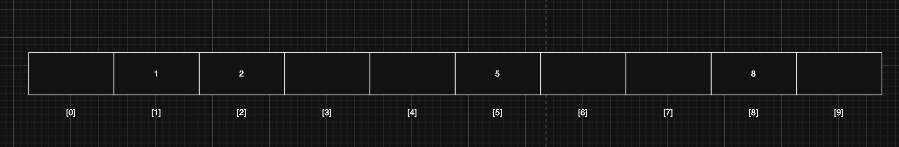
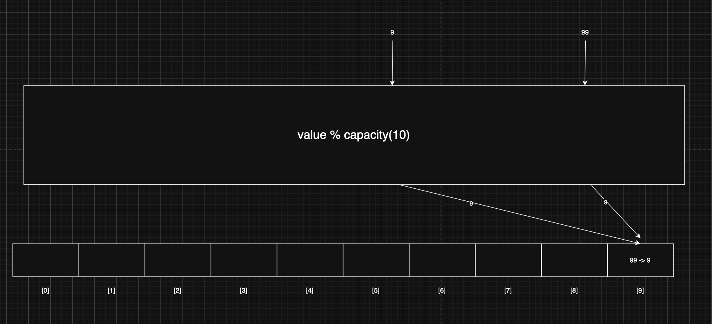
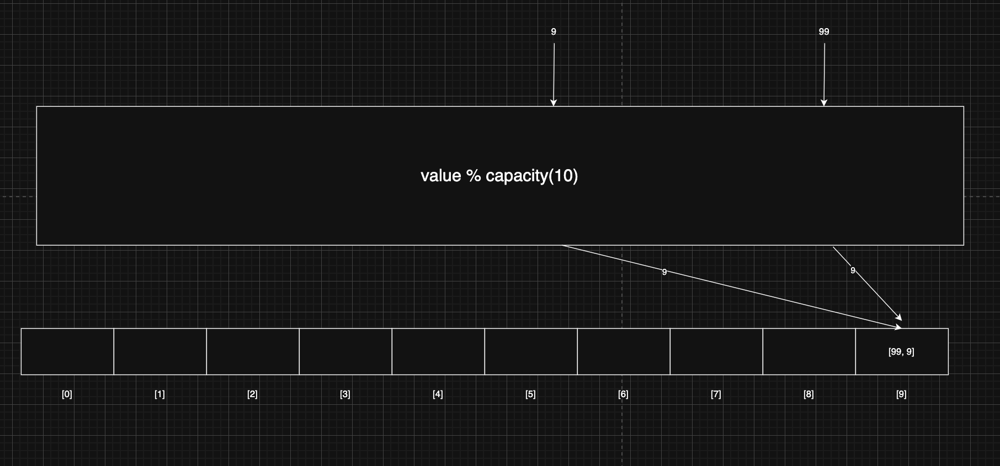

> 해당 블로그 글은 [영한님의 인프런 강의](https://inf.run/xexJb)를 바탕으로 쓰여진 글입니다.

## 리스트(List) vs 세트(Set)

자료 구조에서의 List와 Set은 각각 특정한 방식으로 데이터를 저장하고 관리하는 데 사용된다.

### List

- 정의: 리스트는 요소들의 순차적인 컬렉션이다. 요소들은 특정 순서를 가지며, 같은 요소가 여러 번 나타날 수 있다.
- 특징
    - 순서 유지: 리스트에 추가된 요소는 특정한 순서를 유지한다. 이 순서는 요소가 추가된 순서를 반영할 수 있다.
    - 중복 허용: 리스트는 동일한 값이나 객체의 중복을 허용한다.
    - 인덱스 접근: 리스트의 각 요소는 인덱스를 통해 접근할 수 있다. 이 인덱스는 보통 0부터 시작한다.
- 용도: 순서가 중요하거나 중복된 요소를 허용해야 하는 경우에 주로 사용된다. 예를 들어, 장바구니 시스템에 많이 사용된다.

### Set

- 정의: 셋은 유일한 요소들의 컬렉션이다. 참고로 세트보다는 셋으로 많이 불린다.
- 특징
    - 유일성: 셋에는 중복된 요소가 존재하지 않는다. 셋에 요소를 추가할 때, 이미 존재하는 요소면 무시된다.
    - 순서 미보장: 대부분의 셋 구현에서는 요소들의 순서를 보장하지 않는다. 즉, 요소를 출력할 때 입력 순서와 다를 수 있다.
    - 빠른 검색: 셋은 요소의 유무를 빠르게 확인할 수 있도록 최적화되어 있다. 이는 데이터의 중복을 방지하고 빠른 조회를 가능하게 한다.
- 용도: 중복을 허용하지 않고, 요소의 유무만 중요한 경우에 사용된다. 예를 들어, 회원 ID 목록 집합같은 곳에 사용된다.

## 직접 구현하는 Set0 - 시작

셋의 구현은 단순하다. 데이터를 추가하고 데이터가 있는지 유무까지만 단순히 구현하면 될 것 같다. 그럼 한번 구현해보자.

``` java
package collection.set;

import java.util.Arrays;

public class MyHashSetV0 {

    private int[] elementData = new int[10];

    private int size = 0;

    public boolean add(int value) {
        if (contains(value)) {
            return false;
        }

        elementData[size] = value;
        size++;

        return true;
    }

    public boolean contains(int value) {
        for (int data : elementData) {
            if (data == value) {
                return true;
            }
        }

        return false;
    }

    public int getSize() {
        return size;
    }

    @Override
    public String toString() {
        return "MyHashSetV0{" +
                "elementData=" + Arrays.toString(Arrays.copyOf(elementData, size)) +
                ", size=" + size +
                '}';
    }
}
```

`add()` 메서드는 중복된 값이 들어가는지 확인하고 아니라면 데이터를 추가해준다. 따라서 중복된 값 확인하는데 O(n)이 발생하고 데이터를 추가하는데 O(1)이 발생함으로 결과적으로 O(n)의 비용이 발생한다. `contains()` 메서드는 중복된 값이 들어가는지 확인하는 메서드로 O(n)이 발생한다. 따라서 성능이 매우 안 좋다. 데이터를 추가할 때마다 이렇게 성능이 느린 자료 구조는 사용하기 어렵다. 그럼 이것을 어떻게 효율적으로 변경할 수 있을지 알아보자.

## 해시 알고리즘1 - 시작

해시 알고리즘을 사용하면 데이터를 찾는 검색 성능을 평균 O(1)로 비약적으로 끌어올릴 수 있다. 어떻게 성능을 올릴 수 있을까?

상식적으로 생각해도 배열의 데이터가 있다면 이것을 검색하기 위해서는 `for`문을 이용하여 일일이 다 확인하는 방법밖에는 없을 것이다. 그런데 O(1)로 어떻게 비용을 줄일 수 있을까?

## 해시 알고리즘2 - index 사용

배열은 인덱스의 위치를 사용해서 데이터를 찾을 때 O(1)로 매우 빠른 특징을 가지고 있다. 반면에 데이터를 검색할 때는 배열에 들어있는 데이터 하나하나를 모두 비교해야 하므로 인덱스를 활용할 수 없다. 그런데 만약에 데이터를 검색할 때도 인덱스를 활용해서 데이터를 한 번에 찾을 수 있다면 어떻게 될까? 이렇게만 할 수 있다면 O(n) -> O(1)로 바꾸어서 성능을 획기적으로 끌어올릴 수 있을 것이다.

물론 배열같은 경우에는 인덱스와 그 안에 실제 들어가져 있는 데이터 값이 달라서 인덱스와 데이터 값을 일치시켜서 할 수가 없다. 하지만 굳이 데이터 값과 인덱스 값을 동일하게 해서 한다면 어떻게 될까? 인덱스를 이용한 배열 검색으로 O(1)로 성능을 극한으로 올릴 수 있다. 아래의 그림처럼 말이다.



하지만 그림을 보면 알다 싶이 문제점이 있다. 바로 불필요한 메모리 공간이 낭비가 된다는 것이다. 이 문제를 한번 해결해보자.

## 해시 알고리즘3 - 메모리 낭비

데이터의 값을 인덱스로 사용한 덕분에 O(1)의 매우 빠른 검색 속도를 얻을 수 있다. 그리고 이 코드는 정상적으로 수행된다. 하지만 낭비되는 메모리 공간이 너무 많다. 데이터의 값을 인덱스로 사용할 때, 입력할 수 있는 값의 범위가 `int` 라면 한번의 연산에 최신 컴퓨터의 메모리가 거의 다 소모되어 버린다. 만약 사용자가 1, 2, 1000, 200000의 네 개의 값만 입력한다면 나머지 대부분의 메모리가 빈 공간으로 낭비될 것이다. 뿐만 아니라 처음 배열을 생성하기 위해 메모리를 할당하는데도 너무 오랜 시간이 소모된다. 따라서 데이터의 값을 인덱스로 사용하는 방식은 입력 값의 범위가 넓다면 사용하기 어려워 보인다. 그러면 어떻게 해결할 수가 있을까?

## 해시 알고리즘4 - 나머지 연산

공간도 절약하면서, 넓은 범위의 값을 사용할 수 있는 방법이 있는데, 바로 나머지 연산을 사용하는 것이다. 추가하거나 검색해야 할 값에다가 배열의 크기(capacity)로 나머지 연산을 수행하고 나온 값을 인덱스로 하여 데이터를 넣거나 찾으면 된다. 이렇게 배열의 인덱스로 사용할 수 있도록 원래의 값을 계산한 인덱스를 해시 인덱스(hashIndex)라 한다. 14의 해시 인덱스는 4, 99의 해시 인덱스는 9이다. 나머지 연산을 통해 해시 인덱스를 구하고, 해시 인덱스를 배열의 인덱스로 사용해보자.


위의 그림은 배열의 크기인 10을 기준으로 나머지 연산을 수행한 결과이다. 이렇게 하면 데이터 추가도 그렇고 데이터 검색을 할 때도 O(1)의 성능으로 빠르게 수행할 수 있다.

입력 값의 범위가 넓어도 실제 모든 값이 들어오지는 않기 때문에 배열의 크기를 제한하고, 나머지 연산을 통해 메모리가 낭비되는 문제도 해결할 수 있다. 해시 인덱스를 사용해서 O(1)의 성능으로 데이터를 저장하고, O(1)의 성능으로 데이터를 조회할 수 있게 되었다. 덕분에 자료 구조의 조회 속도를 비약적으로 향상할 수 있게 되었다.

다만, 문제점이 있다. 바로 해시 인덱스가 충돌하는 경우이다. 예를 들어 99를 나머지 연산하면 9가 나오고 9번 인덱스에 값이 저장된다. 그런데 9라는 숫자가 들어와서 해시 인덱스를 구하면 9가 되고 기존 99의 값을 덥어쓰게 되는 결과가 나오게 된다. 이런 문제를 해시 충돌이라고 하는데 해당 문제를 어떻게 해결할 수 있을까?

## 해시 알고리즘5 - 해시 충돌 설명



해당 해시 충돌을 해결할 수 있는 방법은 배열의 크기(capacity)를 키워주면 된다. 그러면 해시 충돌이 발생하지 않을 것이다. 만약 발생한다 하더라도 다시 키워주면 되는 것이다. 하지만 이러면 기존의 문제인 메모리 공간 낭비가 매우 심해진다. 그러면 어떻게 해결할까?

### 해시 충돌 해결

해시 충돌을 인정하면 문제 해결의 실마리가 보인다. 해시 충돌은 낮은 확률로 일어날 수 있다고 가정하는 것이다. 해결 방안은 바로 해시 충돌이 일어났을 때 단순하게 같은 해시 인덱스의 값을 같은 인덱스에 함께 저장해버리는 것이다.



배열 안에 데이터 자체를 넣는게 아니라 배열을 만들어서 그 배열안에 데이터를 넣는 것이다. 그러면 여기서 의문이 들 것이다. 해시 인덱스를 구해서 넣는 것은 괜찮을 지 몰라도 만약 조회를 하는 경우라면 성능이 O(n)으로 나빠지지 않을까? 그렇다. 해시충돌이 발생 할 경우를 대비하여 배열에 데이터 자체를 넣는 것이 아니라 배열 자체를 넣어서 그 안에 데이터를 넣고 조회하는 경우는 O(n)의 성능이 나온다. 심지어 최악의 경우 같은 해시 인덱스에 데이터가 쭉 들어가는 경우일 것이다.

해시 인덱스를 사용하는 방식은 최악의 경우 O(n)의 성능을 보인다. 하지만 확률적으로 보면 어느 정도 넓게 퍼지기 때문에 평균으로 보면 대부분 O(1)의 성능을 제공한다. 해시 충돌이 가끔 발생해도 내부에서 값을 몇 번만 비교하는 수준이기 때문에 대부분의 경우 매우 빠르게 값을 찾을 수 있다.

## 해시 알고리즘6 - 해시 충돌 구현

그러면 위의 내용을 코드로 구현해보자. 나는 배열안에 배열을 `LinkedList`로 하였지만 `ArrayList`를 써도 무방하다.

``` java
package collection.set;

import java.util.Arrays;
import java.util.LinkedList;

public class HashStart {

    static final int CAPACITY = 10;

    public static void main(String[] args) {
        LinkedList<Integer>[] buckets = new LinkedList[CAPACITY];

        for (int i = 0; i < CAPACITY; i++) {
            buckets[i] = new LinkedList<>();
        }

        add(buckets, 1);
        add(buckets, 2);
        add(buckets, 5);
        add(buckets, 8);
        add(buckets, 14);
        add(buckets, 99);
        add(buckets, 9);
        System.out.println("buckets = " + Arrays.toString(buckets));

        int searchValue = 9;
        boolean contains = contains(buckets, searchValue);
        System.out.println("buckets.contains(" + searchValue + ") = " + contains);

    }

    private static void add(LinkedList<Integer>[] buckets, int value) {
        int hashIndex = hashIndex(value);
        LinkedList<Integer> bucket = buckets[hashIndex];

        if (!bucket.contains(value)) {
            bucket.add(value);
        }
    }

    private static boolean contains(LinkedList<Integer>[] buckets, int searchValue) {
        int hashIndex = hashIndex(searchValue);
        LinkedList<Integer> bucket = buckets[hashIndex];

        return bucket.contains(searchValue);
    }

    static int hashIndex(int value) {
        return value % CAPACITY;
    }
}
```

코드를 보면 이해가 어느정도 될 것이다. 그래서 따로 설명은 안 할텐데 궁금하면 강의를 참조 바란다.

### 해시 인덱스 충돌 확률

해시 충돌이 발생하면 데이터를 추가하거나 조회할 때, 연결 리스트 내부에서 O(n)의 추가 연산을 해야 하므로 성능이 떨어진다. 따라서 해시 충돌은 가급적 발생하지 않도록 해야 한다. 해시 충돌이 발생할 확률은 입력하는 데이터의 수와 배열의 크기와 관련이 있다. 입력하는 데이터의 수와 비교해서 배열의 크기가 클 수록 충돌 확률은 낮아진다.

통계적으로 입력한 데이터의 수가 배열의 크기를 75% 넘지 않으면 해시 인덱스는 자주 충돌하지 않는다. 반대로 75%를 넘으면 자주 충돌하기 시작한다. 배열의 크기를 크게 만들면 해시 충돌은 줄어서 성능은 좋아지지만, 많은 메모리가 낭비된다. 반대로 배열의 크기를 너무 작게 만들면 해시가 자주 충돌해서 성능이 나빠진다. 상황에 따라 다르겠지만 보통 75%를 적절한 크기로 보고 기준으로 잡는 것이 효과적이다.

해시 인덱스를 사용한다면 데이터를 추가하는 경우 평균적으로 O(1)의 성능을 보이고 최악은 O(n)이다. 조회도 마찬가지다. 해시 인덱스를 사용하는 방식은 사실 최악의 경우는 거의 발생하지 않는다. 배열의 크기만 적절하게 잡아주면 대부분 O(1)에 가까운 매우 빠른 성능을 보여준다.

그래서 해시 충돌은 거의 발생하지 않는다고 생각하고 사용하면 좋을 것 같다.

> 잘못된 지식이 있을 경우 댓글로 남겨주시면 빠르게 반영하겠습니다!