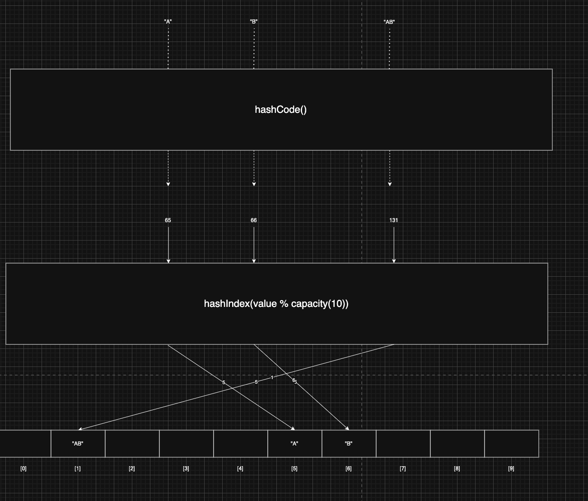
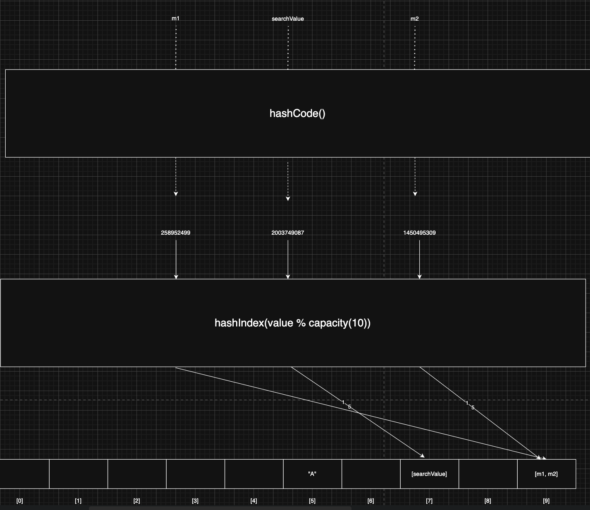
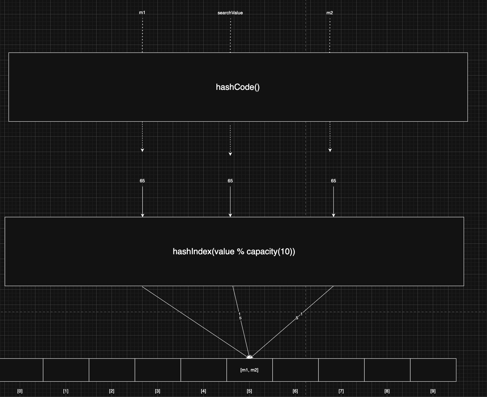

> 해당 블로그 글은 [영한님의 인프런 강의](https://inf.run/xexJb)를 바탕으로 쓰여진 글입니다.

## 직접 구현하는 Set1 - MyHashSetV1

그러면 기존의 `MyHashSetV0`의 성능을 해시 인덱스를 이용하여 구현해보겠다. 이전의 `MyHashSetV0`는 성능이 O(n)으로 좋지 못하였는데 해시 인덱스를 통하여 개선을 할 수 있을 것 같다.

``` java
package collection.set;

import java.util.Arrays;
import java.util.LinkedList;

public class MyHashSetV1 {

    static final int DEFAULT_INITIAL_CAPACITY = 16;

    LinkedList<Integer>[] buckets;

    private int size = 0;

    private int capacity = DEFAULT_INITIAL_CAPACITY;

    public MyHashSetV1() {
        initBuckets();
    }

    public MyHashSetV1(int capacity) {
        this.capacity = capacity;
        initBuckets();
    }

    public boolean add(int value) {
        int hashIndex = hashIndex(value);
        LinkedList<Integer> bucket = buckets[hashIndex];

        if (bucket.contains(value)) {
            return false;
        }

        bucket.add(value);
        size++;

        return true;
    }

    public boolean contains(int searchValue) {
        int hashIndex = hashIndex(searchValue);
        LinkedList<Integer> bucket = buckets[hashIndex];

        return bucket.contains(searchValue);
    }

    public boolean remove(int value) {
        int hashIndex = hashIndex(value);
        LinkedList<Integer> bucket = buckets[hashIndex];
        boolean result = bucket.remove(Integer.valueOf(value));

        if (result) {
            size--;
            return true;
        } else {
            return false;
        }
    }

    public int getSize() {
        return size;
    }

    @Override
    public String toString() {
        return "MyHashSetV1{" +
                "buckets=" + Arrays.toString(buckets) +
                ", size=" + size +
                ", capacity=" + capacity +
                '}';
    }

    private void initBuckets() {
        buckets = new LinkedList[capacity];

        for (int i = 0; i < capacity; i++) {
            buckets[i] = new LinkedList<>();
        }
    }

    private int hashIndex(int value) {
        return value % capacity;
    }
}
```

기존의 `MyHashSetV0`에서는 반복문을 통하여 일일이 조회 후, 추가, 조회를 하였다. 하지만 해시 인덱스를 사용하여 성능이 O(1)로 끌어올렸다. 추가적으로 기존에는 삭제기능이 없었서 추가까지 진행하였다.

여기서 남은 문제가 존재한다. 우리는 지금까지 데이터가 숫자라고 가정하고 진행을 하였다. 그런데 문자열은 어떻게 해시 인덱스를 이용할까? 문자열에는 나머지 연산이 존재하지 않는다. 그 방법을 알아보자.

## 문자열 해시 코드

지금까지 해시 인덱스를 구할 때 숫자를 기반으로 해시 인덱스를 구했다. 해시 인덱스는 배열의 인덱스로 사용해야 하므로 0, 1, 2, 같은 숫자(양의 정수)만 사용할 수 있다. 따라서 문자를 사용할 수 없다. 문자 데이터를 기반으로 숫자 해시 인덱스를 구하려면 어떻게 해야 할까?

모든 문자는 본인만의 고유한 숫자로 표현할 수 있다. 이것을 **아스키 코드**라고 말한다. 즉, 문자열이 오면 아스키 코드로 값을 변경한 뒤, 해시 인덱스를 구하면 될 것 같다.

> ✅ 참고
>
> 컴퓨터는 바보다. 자세히 말하면 숫자밖에 모르는 바보다. 컴퓨터의 데이터는 0과 1밖에 없고 그걸로 연산을 하는 장치이다. 즉, 문자를 직접 이해하지는 못한다. 대신에 각 문자에 고유한 숫자를 할당해서 인식한다.

### 해시 코드와 해시 함수

문자열을 기반으로 아스키 코드 값을 구해 숫자로 변환하는 코드를 해시코드라고 부른다. 해시코드는 숫자이기 때문에 배열의 인덱스로 사용이 가능하다.



- `hashCode()` 메서드를 사용해서 문자열을 해시 코드로 변경한다. 그러면 고유한 정수 숫자 값이 나오는데, 이것을 해시 코드라 한다.
- 숫자 값인 해시 코드를 사용해서 해시 인덱스를 생성한다.
- 이렇게 생성된 해시 인덱스를 배열의 인덱스로 사용하면 된다.

### 📚 용어 정리

- 해시 함수
    - 해시 함수는 임의의 길이의 데이터를 입력으로 받아, 고정된 길이의 해시값(해시 코드)을 출력하는 함수이다.
        - 여기서 의미하는 고정된 길이는 저장 공간의 크기를 뜻한다.
    - 같은 데이터를 입력하면 항상 같은 해시 코드가 출력된다.
    - 다른 데이터를 입력해도 같은 해시 코드가 출력될 수 있다. 이것을 해시 충돌이라 한다. ex. "BC" => 133, "AD" => 133
- 해시 코드
    - 해시 코드는 데이터를 대표하는 값을 뜻한다. 보통 해시 함수를 통해 만들어진다.
- 해시 인덱스
    - 해시 인덱스는 데이터의 저장 위치를 결정하는데, 주로 해시 코드를 사용해서 만든다.
    - 보통 해시 코드의 결과에 배열의 크기를 나누어 구한다.

세상의 어떤 객체든지 정수로 만든 해시 코드만 정의할 수 있다면 해시 인덱스를 사용할 수 있다. 문자열 뿐만 아니라 우리가 직접 만든 객체들도 말이다.

## 자바의 hashCode()

해시 자료 구조에 저장하려면 모든 객체가 숫자 해시 코드를 제공할 수 있어야 한다. 그래서 `Object` 클래스에서 `hashCode()` 메서드를 정의해두었다.

``` java
public class Object {
    public int hashCode();
}
```

- 이 메서드를 그대로 사용하기 보다는 보통 재정의(오버라이딩)해서 사용한다.
- 해당 메서드의 `hashCode()`의 결과 값은 해당 객체의 참조값이 반환된다.

그러면 한번 예제 코드를 통해 `hashCode()`를 재정의하는 것을 보도록 해보겠다.

``` java
package collection.set.member;

import java.util.Objects;

public class Member {

    private String id;

    public Member(String id) {
        this.id = id;
    }

    public String getId() {
        return id;
    }

    @Override
    public boolean equals(Object o) {
        if (o == null || getClass() != o.getClass()) return false;
        Member member = (Member) o;
        return Objects.equals(getId(), member.getId());
    }

    @Override
    public int hashCode() {
        return Objects.hashCode(getId());
    }

    @Override
    public String toString() {
        return "Member{" +
                "id='" + id + '\'' +
                '}';
    }
}
```

### Object의 해시 코드 비교

`Object` 가 기본으로 제공하는 `hashCode()` 는 객체의 참조값을 해시 코드로 사용한다. 따라서 각각의 인스턴스마다 서로 다른 값을 반환한다.

### 자바의 기본 클래스의 해시 코드

`Integer`,`String` 같은 자바의 기본 클래스들은 대부분 내부 값을 기반으로 해시 코드를 구할 수 있도록 `hashCode()` 메서드를 재정의해 두었다. 재정의한 것은 해당 데이터 값이 같으면 같은 해시 코드를 반환하게끔 정의하였다.

> 해시 코드의 경우 정수를 반환하기 때문에 마이너스 값이 나올 수 있다.

그러면 뭔가 예전의 의문이 풀릴듯 하다. 예전에 IDE의 도움으로 `equals()` 메서드를 재정의하여 동등성을 구현할 때 `hashCode()`를 같이 재정의 하였다. 그 이유는 동등성으로 같은 객체라고 정의를 하였다면 해당 같은 객체는 같은 해시코드가 나와야 동일한 해시 인덱스에 들어 갈 것이다. 만약 동등성으로 같다고 정의된 객체가 `hashCode()`를 구현 안해서 다른 해시 인덱스에 들어가면 정말 엄청난 일이 일어날 것이다.

자바가 기본으로 제공하는 클래스 대부분은 `hashCode()` 를 재정의해두었다. 객체를 직접 만들어야 하는 경우에 `hashCode()` 를 재정의하면 된다. `hashCode()` 만 재정의하면 필요한 모든 종류의 객체를 해시 자료 구조에 보관할 수 있다. 정리하면 해시 자료 구조에 데이터를 저장하는 경우 `hashCode()` 를 구현해야 한다.

## 직접 구현하는 Set2 - MyHashSetV2

기존 `MyHashSetV1`는 정수형 타입만 받을 수 있지만 모든 타입을 받을 수 있게 `Object`로 변경하였다. 또한 기존 `hashIndex()` 메서드를 해시 코드를 이용해야 해서 해시코드를 구한 후에 나머지 연산자를 진행하였다. 단, 해시코드가 음수가 나올 수 있기 때문에 현재는 양수만 받을 수 있게 절대값 연산을 사용하였다. 코드는 아래와 같다.

``` java
package collection.set;

import java.util.Arrays;
import java.util.LinkedList;

public class MyHashSetV2 {

    static final int DEFAULT_INITIAL_CAPACITY = 16;

    LinkedList<Object>[] buckets;

    private int size = 0;

    private int capacity = DEFAULT_INITIAL_CAPACITY;

    public MyHashSetV2() {
        initBuckets();
    }

    public MyHashSetV2(int capacity) {
        this.capacity = capacity;
        initBuckets();
    }

    public boolean add(Object value) {
        int hashIndex = hashIndex(value);
        LinkedList<Object> bucket = buckets[hashIndex];

        // 평균적 O(1)
        if (bucket.contains(value)) {
            return false;
        }

        bucket.add(value);
        size++;

        return true;
    }

    public boolean contains(Object searchValue) {
        int hashIndex = hashIndex(searchValue);
        LinkedList<Object> bucket = buckets[hashIndex];

        return bucket.contains(searchValue);
    }

    public boolean remove(Object value) {
        int hashIndex = hashIndex(value);
        LinkedList<Object> bucket = buckets[hashIndex];
        boolean result = bucket.remove(value);

        if (result) {
            size--;
            return true;
        } else {
            return false;
        }
    }

    public int getSize() {
        return size;
    }

    @Override
    public String toString() {
        return "MyHashSetV2{" +
                "buckets=" + Arrays.toString(buckets) +
                ", size=" + size +
                ", capacity=" + capacity +
                '}';
    }

    private void initBuckets() {
        buckets = new LinkedList[capacity];

        for (int i = 0; i < capacity; i++) {
            buckets[i] = new LinkedList<>();
        }
    }

    private int hashIndex(Object value) {
        return Math.abs(value.hashCode()) % capacity;
    }
}
```

> ✅ 참고
>
> 참고로 "AB"같은 경우는 "A"의 아스키 코드인 65와 "B"의 아스키 코드인 66을 단순히 더한 값이 아닌 복잡한 연산을 통해 해시코드를 구한다.

## 직접 구현하는 Set3 - 직접 만든 객체 보관

그럼 우리가 만든 `MyHashSetV2`로 커스텀한 객체도 담을 수 있을 것이다. 단, 커스텀 객체가 `equals()`와 `hashCode()`를 구현해야 한다.

그런데 `hashCode()`를 재정의를 해야 하는 것은 알겠다. 그런데 `equals()`는 동등성 비교가 필요가 없다면 안 해도 되지 않을까? 사실 그렇지 않다. `hashCode()`와 `equals()`를 재정의를 같이 해야 하는 이유가 있다. 앞전에 논리적 동등성 보장때문에 같이 해야한다고 언급을 했지만 더 필요한 이유가 있다. `MyHashSetV2` 클래스의 `add()`나 `contains()` 메서드를 보면 `LinkedList`의 `contains()`를 호출해서 중복검사를 진행하고 있다. 바로 여기서 `equals()`가 호출되기 때문이다.

만약 어느 서로 다른 두 객체의 해시코드를 구하고 해시 인덱스를 구했더니 해시충돌이 발생할 수 있다. 그러면 조회하거나 값을 추가할 때 해당 값이 있는지 여부를 확인할 때 `equals()` 메서드를 사용하는데 만약 재정의를 안 했다면 잘못된 결과가 나올 수 있는 것이다.

## equals, hashCode의 중요성1

해시 자료 구조를 사용하려면 `hashCode()`도 중요하지만, 해시 인덱스가 충돌할 경우를 대비에서 `equals()`도 반드시 재정의해야 한다. 해시 인덱스가 충돌할 경우 같은 해시 인덱스에 있는 데이터들을 하나하나 비교해서 찾아야한다. 이때 `equals()` 를 사용해서 비교한다.

> ✅ 참고
>
> 해시 인덱스가 같아도 실제 저장된 데이터는 다를 수 있다. 따라서 특정 인덱스에 데이터가 하나만 있어도 `equals()`로 찾는 데이터가 맞는지 검증해야 한다. 서로 다른 두 객체가 있다고 해보자. 서로 다른 두 객체지만 해시 인덱스는 같을 수 있다. 그런데 검색을 할 경우  재정의 된 `equals()`를 사용하지 않는다면 검색기능이 원활히지 못할 것이다.

따라서 해시 자료 구조를 사용하려면 반드시 `hashCode()` 와 `equals()` 를 구현해야한다. 지금부터 `hashCode()` , `equals()` 를 제대로 구현하지 않으면 어떤 문제가 발생하는지 알아보자.

### hashCode, equals를 모두 구현하지 않은 경우

``` java
package collection.set.member;

public class MemberNoHashNoEq {

    private String id;

    public MemberNoHashNoEq(String id) {
        this.id = id;
    }

    public String getId() {
        return id;
    }

    @Override
    public String toString() {
        return "MemberNoHashNoEq{" +
                "id='" + id + '\'' +
                '}';
    }
}
```

위와 같은 코드가 있다고 하자. 여기서는 `equals()`와 `hashCode()`를 직접 구현하지 않았다. 즉, `Object` 클래스의 기본 기능을 사용한 것이다. 그러면 사용하는 코드를 통해 문제점을 살펴보자.

``` java
package collection.set.member;

import collection.set.MyHashSetV2;

public class HashAndEqualsMain1 {
    public static void main(String[] args) {
        MyHashSetV2 set = new MyHashSetV2(10);
        MemberNoHashNoEq m1 = new MemberNoHashNoEq("A");
        MemberNoHashNoEq m2 = new MemberNoHashNoEq("A");

        System.out.println("m1.hashCode() = " + m1.hashCode());
        System.out.println("m2.hashCode() = " + m2.hashCode());
        System.out.println("m1.equals(m2) = " + m1.equals(m2));

        set.add(m1);
        set.add(m2);
        System.out.println(set); // 중복 등록

        MemberNoHashNoEq searchValue = new MemberNoHashNoEq("A"); // 검색 실패
        System.out.println("searchValue.hashCode() = " + searchValue.hashCode());

        boolean contains = set.contains(searchValue);
        System.out.println("contains = " + contains);
    }
}
```

m1과 m2는 논리적으로 같은 객체이다. 그리고 지금 `Set` 자료구조이므로 데이터가 중복이 되면 안되지만 중복 저장이 발생한다. 또한 객체 검색을 할 때도 저장된 객체를 찾지를 못한다. 즉, 쉽게 풀면 아래의 그림과 같이 되는 것이다.



위의 그림처럼 데이터 중복 저장도 될 뿐더러 검색을 할 때도 해시 인덱스가 다르기 때문에 값을 찾지를 못하게 된다.

## equals, hashCode의 중요성2

### hashCode는 구현했지만 equals를 구현하지 않은 경우

``` java
package collection.set.member;

import java.util.Objects;

public class MemberOnlyHash {

    private String id;

    public MemberOnlyHash(String id) {
        this.id = id;
    }

    public String getId() {
        return id;
    }

    @Override
    public int hashCode() {
        return Objects.hashCode(getId());
    }

    @Override
    public String toString() {
        return "MemberOnlyHash{" +
                "id='" + id + '\'' +
                '}';
    }
}
```

위의 코드는 `hashCode()`만 재정의한 코드이다. 이제 사용하는 코드를 통하여 문제점을 확인해보자.

``` java
package collection.set.member;

import collection.set.MyHashSetV2;

public class HashAndEqualsMain2 {
    public static void main(String[] args) {
        MyHashSetV2 set = new MyHashSetV2(10);
        MemberOnlyHash m1 = new MemberOnlyHash("A");
        MemberOnlyHash m2 = new MemberOnlyHash("A");

        System.out.println("m1.hashCode() = " + m1.hashCode());
        System.out.println("m2.hashCode() = " + m2.hashCode());
        System.out.println("m1.equals(m2) = " + m1.equals(m2));

        set.add(m1);
        set.add(m2);
        System.out.println(set); // 중복 등록

        MemberOnlyHash searchValue = new MemberOnlyHash("A"); // 검색 실패
        System.out.println("searchValue.hashCode() = " + searchValue.hashCode());

        boolean contains = set.contains(searchValue);
        System.out.println("contains = " + contains);
    }
}
```

결과를 보면 알겠지만 중복된 데이터가 추가가 되었으며 검색 또한 실패를 하였다. 서로 다른 객체가 `hashCode()`를 사용하면 같은 해시값은 나와서 같은 해시 인덱스로 나올 것이다. 그런데 추가를 할때 `equals()` 메서드를 재정의하지 않았으니 참조값을 기반으로 확인하는데 서로 다른 참조값이니 데이터 중복 추가가 되버린 것이다. 검색 또한 마찬가지다. 같은 해시 인덱스는 나오지만 안에 리스트를 찾을 때 서로 다른 참조값이므로 검색에 실패하게 된다.



그래서 반드시 `equals()` 메서드와 `hashCode()` 메서드를 재정의하여야 한다. 물론 `hashCode()` 를 항상 재정의해야 하는 것은 아니다. 하지만 해시 자료 구조를 사용하는 경우 `hashCode()`와 `equals()`를 반드시 함께 재정의해야 한다. 물론 직접 재정의하는 것은 쉽지 않으므로 IDE의 도움을 받자.

> ✅ 참고
>
> 이펙티브 자바 서적에서는 반드시 어느 경우라도 **equals()&hashCode()를 정의해야 한다.**라고 쓰여있다. 그 만큼 중요하다는 것이지 않을까?

> ✅ 참고
>
> 다른 데이터를 입력해도 같은 해시 코드가 출력될 수 있다. 이것을 해시 충돌이라 한다. 해시 함수로 해시 코드를 만들 때 단순히 문자의 숫자를 더하기만 해서는 해시가 충돌할 가능성이 높다. 해시가 충돌하면 결과적으로 같은 해시 인덱스에 보관된다. 따라서 성능이 나빠진다. 자바의 해시 함수는 이런 문제를 해결하기 위해 문자의 숫자를 단순히 더하기만 하는 것이 아니라 내부에서 복잡한 추가 연산을 수행한다. 복잡한 추가 연산으로 다양한 범위의 해시 코드가 만들어지므로 해시가 충돌할 가능성이 낮아지고, 결과적으로 해시 자료 구조를 사용할 때 성능이 개선된다.

해시 함수는 같은 입력에 대해서 항상 동일한 해시 코드를 반환해야 한다. 좋은 해시 함수는 해시 코드가 한 곳에 뭉치지 않고 균일하게 분포하는 것이 좋다. 그래야 해시 인덱스도 골고루 분포되어서 해시 자료 구조의 성능을 최적화할 수 있다. 이런 해시 함수를 직접 구현하는 것은 쉽지 않다. 자바가 제공하는 해시 함수들을 사용하면 이런 부분을 걱정하지 않고 최적화 된 해시 코드를 구할 수 있다. 하지만 자바가 제공하는 해시 함수를 사용해도 같은 해시 코드가 생성되어서 해시 코드가 충돌하는 경우도 간혹 존재한다.

이 경우 같은 해시 코드를 가지기 때문에 해시 인덱스도 같게 된다. 하지만 `equals()` 를 사용해서 다시 비교하기 때문에 해시 코드가 충돌하더라도 문제가 되지는 않는다. 그리고 매우 낮은 확률로 충돌하기 때문에 성능에 대한 부분도 크게 걱정하지 않아도 된다.

## 직접 구현하는 Set4 - 제네릭과 인터페이스 도입

제네릭을 도입해서 타입 안전성을 높여보자.

``` java
package collection.set;

public interface MySet<E> {
    boolean add(E element);

    boolean remove(E value);

    boolean contains(E value);
}
```

이제 위의 인터페이스의 구현체를 만들어보자.

``` java
package collection.set;

import java.util.Arrays;
import java.util.LinkedList;

public class MyHashSetV3<E> implements MySet<E> {

    static final int DEFAULT_INITIAL_CAPACITY = 16;

    LinkedList<E>[] buckets;

    private int size = 0;

    private int capacity = DEFAULT_INITIAL_CAPACITY;

    public MyHashSetV3() {
        initBuckets();
    }

    public MyHashSetV3(int capacity) {
        this.capacity = capacity;
        initBuckets();
    }

    @Override
    public boolean add(E value) {
        int hashIndex = hashIndex(value);
        LinkedList<E> bucket = buckets[hashIndex];

        // 평균적 O(1)
        if (bucket.contains(value)) {
            return false;
        }

        bucket.add(value);
        size++;

        return true;
    }

    @Override
    public boolean contains(E searchValue) {
        int hashIndex = hashIndex(searchValue);
        LinkedList<E> bucket = buckets[hashIndex];

        return bucket.contains(searchValue);
    }

    @Override
    public boolean remove(E value) {
        int hashIndex = hashIndex(value);
        LinkedList<E> bucket = buckets[hashIndex];
        boolean result = bucket.remove(value);

        if (result) {
            size--;
            return true;
        } else {
            return false;
        }
    }

    public int getSize() {
        return size;
    }

    @Override
    public String toString() {
        return "MyHashSetV3{" +
                "buckets=" + Arrays.toString(buckets) +
                ", size=" + size +
                ", capacity=" + capacity +
                '}';
    }

    private void initBuckets() {
        buckets = new LinkedList[capacity];

        for (int i = 0; i < capacity; i++) {
            buckets[i] = new LinkedList<>();
        }
    }

    private int hashIndex(Object value) {
        return Math.abs(value.hashCode()) % capacity;
    }
}
```

제네릭의 덕분에 타입 안전성이 높은 자료 구조를 만들 수 있었다.

> 잘못된 지식이 있을 경우 댓글로 남겨주시면 빠르게 반영하겠습니다!