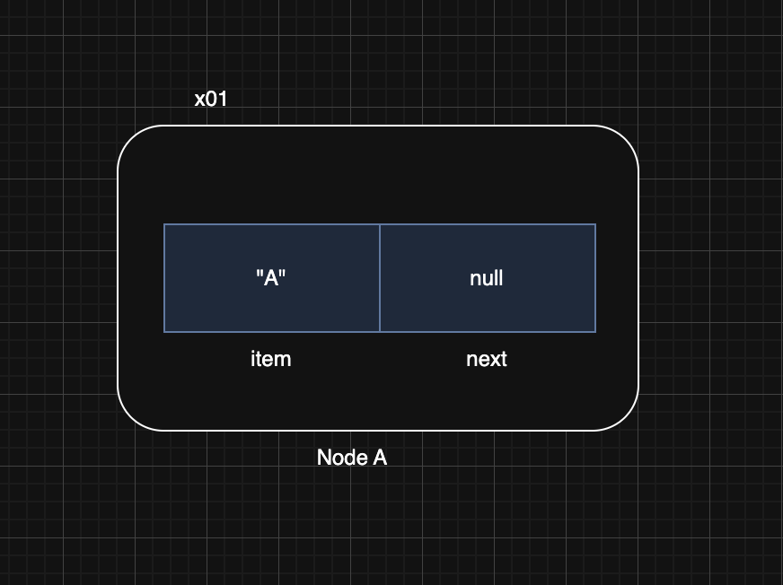
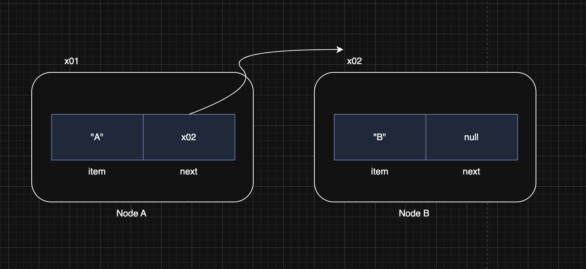
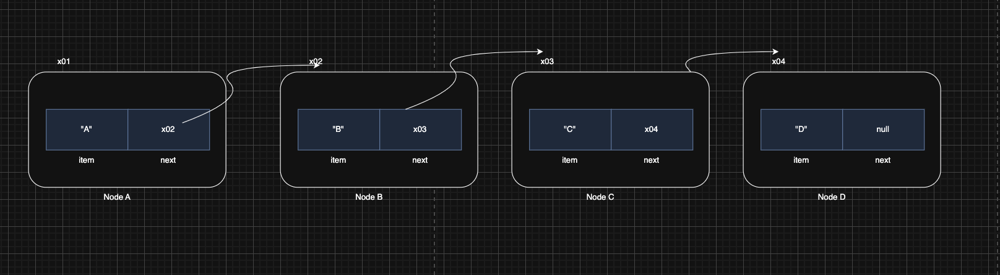
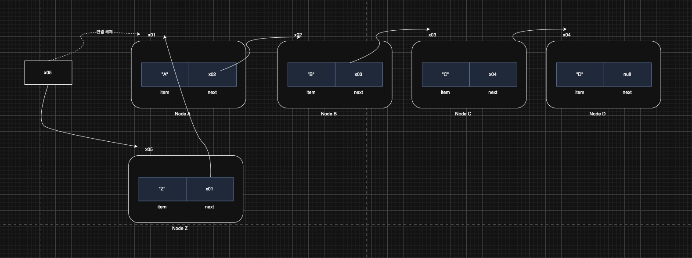
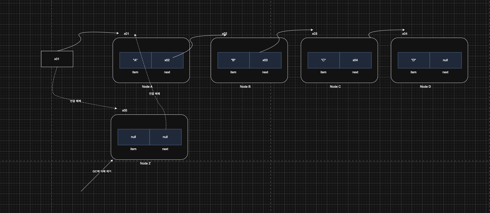
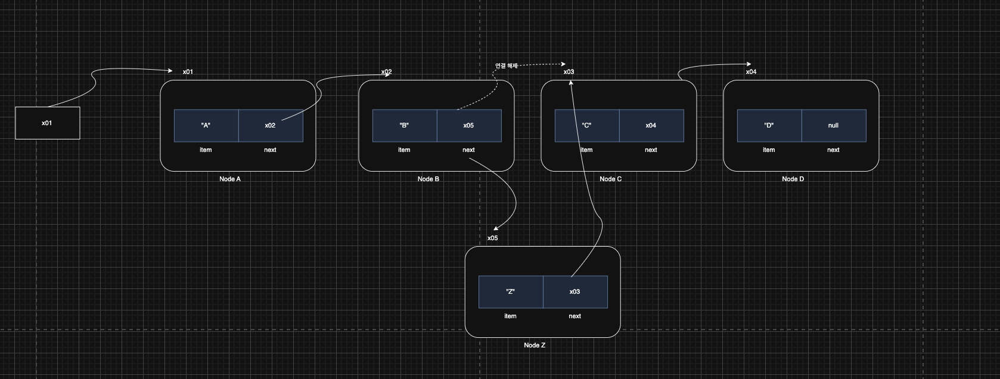

> 해당 블로그 글은 [영한님의 인프런 강의](https://inf.run/xexJb)를 바탕으로 쓰여진 글입니다.

## 노드와 연결1

### 배열 리스트의 단점

- 배열의 사용하지 않는 공간 낭비
    - 배열은 필요한 데이터 크기만큼 처음 선언시 정해줘야 한다. 하지만 실제 데이터가 얼마나 필요할지는 알 수가 없다.
- 배열의 중간에 데이터 추가
    - 배열의 앞이나 중간에 데이터를 추가하면 추가할 데이터의 공간을 확보하기 위해 기존 데이터들을 오른쪽으로 이동해야한다. 그리고 삭제의 경우에는 빈 공간을 채우기 위해 왼쪽으로 이동해야 한다. 이런 작업때문에 성능이 좋지 못하다.

### 노드와 연결

낭비되는 메모리 없이 딱 필요한 만큼만 메모리를 확보해서 사용하고, 또 앞이나 중간에 데이터를 추가하거나 삭제할 때도 효율적인 자료 구조가 있는데, 바로 노드를 만들고 각 노드를 서로 연결하는 방식이다. 그러면 먼저 그림을 통해 알아보자.

#### 노드 생성



- `Node` 인스턴스를 생성해주고 item에 "A"를 넣어주는 그림은 위와 같다.
    - `Node`는 기본적으로 자신이 가지고 있는 `item` 필드와 다음 노드의 참조값을 가지고 있는 `next`가 존재한다.

#### 노드 추가



- `Node` 인스턴스를 생성하고 item에 "B"를 넣어준다.
- 처음 만든 `Node`의 next 필드에 방금 생성한 `Node`의 참조값을 연결해준다.
- 이를 통해 두 노드가 연결되었다. 그림은 위와 같다.

그러면 코드를 통해 알아보자.

``` java
package collection.link;

public class Node {

    Object item;

    Node next;

    public Node(Object item) {
        this.item = item;
    }
}
```

``` java
package collection.link;

public class NodeMain1 {
    public static void main(String[] args) {
        Node first = new Node("A");
        first.next = new Node("B");
        first.next.next = new Node("C");

        System.out.println("모든 노드 탐색하기");
        Node x = first;

        while (x != null) {
            System.out.println(x.item);
            x = x.next;
        }
    }
}
```

위의 코드를 통해 그림의 내용이 이해될꺼라 생각한다.

## 노드와 연결2

이제 조금 결과물이 `[A -> B -> C]`형태로 출력해보게 변경해보겠다. 아래와 같이 `toString()` 메서드를 오버라이딩하면 된다.

``` java
package collection.link;

public class Node {

    Object item;

    Node next;

    public Node(Object item) {
        this.item = item;
    }

    @Override
    public String toString() {
        StringBuilder sb = new StringBuilder();
        Node x = this;
        sb.append("[");

        while (x != null) {
            sb.append(x.item);

            if (x.next != null) {
                sb.append("->");
            }

            x = x.next;
        }

        sb.append("]");

        return sb.toString();
    }
}
```

여기서 `String`이 아닌 `StringBuilder`를 사용한 이유는 반목문에 문자열 조합을 하기 때문이다. 반복문에서 문자열 조합시, 불변객체인 `String`보단, `StringBuilder`를 사용하는게 성능상 좋다.

## 노드와 연결3

지금부터 우리가 만들었던 `Node` 클래스를 활용하여 아래의 기능들을 만들어 보겠다.

- 모든 노드 탐색하기
- 마지막 노드 조회하기
- 특정 index의 노드 조회하기
- 노드에 데이터 추가하기

코드를 작성해보자.

``` java
package collection.link;

public class NodeMain3 {
    public static void main(String[] args) {
        Node first = new Node("A");
        first.next = new Node("B");
        first.next.next = new Node("C");

        System.out.println(first);
        printAll(first);

        Node lastNode = getLastNode(first);
        System.out.println("lastNode = " + lastNode);

        int index = 2;
        Node index2Node = getNode(first, index);
        System.out.println("index2Node = " + index2Node.item);

        System.out.println("데이터 추가하기");
        add(first, "D");
        System.out.println(first);
        add(first, "E");
        System.out.println(first);
        add(first, "F");
        System.out.println(first);
    }

    private static void printAll(Node node) {
        Node x = node;

        while (x != null) {
            System.out.println(x.item);
            x = x.next;
        }
    }

    private static Node getLastNode(Node node) {
        Node x = node;

        while (x.next != null) {
            x = x.next;
        }

        return x;
    }

    private static Node getNode(Node node, int index) {
        Node x = node;

        for (int i = 0; i < index; i++) {
            x = x.next;
        }

        return x;
    }

    private static void add(Node node, String param) {
        Node lastNode = getLastNode(node);
        lastNode.next = new Node(param);
    }
}
```

### 모든 노트 탐색하기

다음 노드가 없을 때 까지 반복해서 노드의 데이터를 출력한다.

### 마지막 노드 조회하기

`Node.next` 의 참조값이 `null` 이면 노드의 끝이다. `getLastNode()` 는 노드를 순서대로 탐색하면서 `Node.next` 의 참조값이 `null` 인 노드를 찾아서 반환한다.

### 특정 index의 노드 조회하기

`x = x.next` 를 호출할 때 마다 x가 참조하는 노드의 위치가 순서대로 하나씩 증가한다. `index` 의 수 만큼만 반복해서 이동하면 원하는 위치의 노드를 찾을 수 있다.

### 데이터 추가하기

데이터를 추가할 때는 새로운 노드를 만들고, 마지막 노드에 새로 만든 노드를 연결하면 된다. 순서대로 설명하면 먼저 마지막 노드를 찾고, 마지막 노드의 `next` 에 새로운 노드를 연결하면 된다.

### 정리

- 노드는 내부에 데이터와 다음 노드에 대한 참조를 가지고 있다.
- 지금까지 설명한 구조는 각각의 노드가 참조를 통해 연결(Link, 링크) 되어 있다.
- 데이터를 추가할 때 동적으로 필요한 만큼의 노드만 만들어서 연결하면 된다. 따라서 배열과 다르게 메모리를 낭비하지 않는다. (내부에 참조값을 가지고 있어서 배열 리스트보다 추가 메모리가 필요하긴 하다.)
- 이렇게 각각의 노드를 연결(링크)해서 사용하는 자료 구조로 리스트를 만들 수 있는데, 이것을 연결 리스트라 한다.

## 직접 구현하는 연결 리스트1 - 시작

우리는 앞서 배열을 통해서 리스트를 만들었는데 이것을 배열 리스트(`ArrayList`)라 한다. 이번에는 배열이 아닌 앞서 학습한 노드와 연결 구조를 통해서 리스트를 만들어보자. 이런 자료 구조를 연결 리스트(`LinkedList`)라 한다. 참고로 링크드 리스트, 연결 리스트라는 용어를 둘다 사용한다.

그러면 코드를 통해 한번 직접 연결 리스트를 구현해보자.

``` java
package collection.link;

public class MyLinkedListV1 {

    private Node first;

    private int size = 0;

    public void add(Object e) {
        Node newNode = new Node(e);

        if (first == null) {
            first = newNode;
        } else {
            Node lastNode = getLastNode();
            lastNode.next = newNode;
        }

        size++;
    }

    public Object set(int index, Object element) {
        Node x = getNode(index);
        Object oldValue = x.item;

        x.item = element;

        return oldValue;
    }

    public Object get(int index) {
        Node node = getNode(index);

        return node.item;
    }

    public int indexOf(Object o) {
        int index = 0;

        for (Node x = first; x != null; x = x.next) {
            if (o.equals(x.item)) {
                return index;
            }

            index++;
        }

        return -1;
    }

    public int size() {
        return size;
    }

    @Override
    public String toString() {
        return "MyLinkedListV1{" +
                "first=" + first +
                ", size=" + size +
                '}';
    }

    private Node getLastNode() {
        Node x = first;

        while (x.next != null) {
            x = x.next;
        }

        return x;
    }

    private Node getNode(int index) {
        Node x = first;

        for (int i = 0; i < index; i++) {
            x = x.next;
        }

        return x;
    }
}
```

그러면 사용하는 코드를 작성해보자.

``` java
package collection.link;

public class MyLinkedListV1Main {
    public static void main(String[] args) {
        MyLinkedListV1 list = new MyLinkedListV1();

        System.out.println("==데이터 추가==");
        System.out.println(list);
        list.add("a");
        System.out.println(list);
        list.add("b");
        System.out.println(list);
        list.add("c");
        System.out.println(list);

        System.out.println("==기능 사용==");
        System.out.println("list.size() = " + list.size());
        System.out.println("list.get(1) = " + list.get(1));
        System.out.println("list.indexOf('c') = " + list.indexOf("c"));
        System.out.println("list.set(2, 'z'), oldValue = " + list.set(2, "z"));
        System.out.println(list);

        System.out.println("==범위 초과==");
        list.add("d");
        System.out.println(list);
        list.add("e");
        System.out.println(list);
        list.add("f");
        System.out.println(list);
    }
}
```

해당 코드는 기존 배열 리스트를 배울 때 사용했던 코드와 거의 비슷하다. 다른 점은 `ArrayList` 대신에 `LinkedList`를 사용한 점이다.

### 연결 리스트와 빅오



- **Object get(int index)**
    - 특정 위치에 있는 데이터를 반환한다.
    - O(n)
        - 배열은 인덱스로 원하는 데이터를 즉시 찾을 수 있다. 따라서 배열을 사용하는 배열 리스트(`ArrayList`)도 인덱스로 조회시 O(1)의 빠른 성능을 보장한다. 하지만 연결 리스트에서 사용하는 노드들은 배열이 아니다. 단지 다음 노드에 대한 참조가 있을 뿐이다. 따라서 인덱스로 원하는 위치의 데이터를 찾으려면 인덱스 숫자 만큼 다음 노드를 반복해서 찾아야 한다. 따라서 인덱스 조회 성능이 나쁘다.
        - 특정 인덱스를 찾는데 O(n)이 걸린다.
- **void add(Object e)**
    - 마지막에 데이터를 추가한다.
    - O(n)
        - 마지막 노드를 찾는데 O(n)이 소요된다. 마지막 노드에 새로운 노드를 추가하는데 O(1)이 걸린다. 따라서 O(n)이다.
- **Object set(int index, Object element)**
    - 특정 위치에 있는 데이터를 찾아서 변경한다. 그리고 기존 값을 반환한다.
    - O(n)
        - 특정 위치의 노드를 찾는데 O(n)이 걸린다.
- **int indexOf(Object o)**
    - 데이터를 검색하고, 검색된 위치를 반환한다.
    - O(n)
        - 모든 노드를 순회하면서 `equals()` 를 사용해서 같은 데이터가 있는지 찾는다.

이렇게만 보았을 때 배열 리스트가 훨씬 성능이 좋아 보인다. 그리고 연결 리스트는 사용할 필요가 없어 보인다. 그러면 왜 연결 리스트를 학습할까? 그 이유를 알아보자.

## 직접 구현하는 연결 리스트2 - 추가와 삭제1

특정 위치에 있는 데이터를 추가하고, 삭제하는 기능을 만들어보자. 직접 코드로 작성하기 전에 그림부터 먼저 확인해보자.

### 첫번째 위치에 노드 추가



- 신규 노드를 먼저 생성한다. 
- 신규 노드와 다음 노드 연결한다.
- first에 신규 노드 연결한다.
- 노드를 추가했으므로 오른쪽 노드의 index가 하나씩 뒤로 밀려난다.
    - 연결 리스트는 배열처럼 실제 index가 존재하는 것이 아니다. 처음으로 연결된 노드를 index 0, 그 다음으로 연결된 노드를 index 1로 가정할 뿐이다. 연결 리스트에서 index는 연결된 순서를 뜻한다.
- 배열의 경우 첫 번째 항목에 데이터가 추가되면 모든 데이터를 오른쪽으로 하나씩 밀어야 하지만 연결 리스트는 새로 생성한 노드의 참조만 변경하면 된다. 나머지 노드는 어떤 일이 일어난지도 모른다.
- 연결 리스트의 첫 번째 항목에 값을 추가하는 것은 매우 빠르다. O(1)로 표현할 수 있다.

### 첫번째 위치에 데이터 삭제



- 삭제 노드를 선택한다.
- first에 삭제 대상 노드의 다음 노드를 연결한다.
- 삭제 대상 노드의 데이터를 초기화 한다.
- 삭제 노드는 더이상 아무도 참조를 안 하므로 GC에 의해 제거된다.
- 노드를 삭제했으므로 오른쪽 노드의 index가 하나씩 당겨진다.
- 배열의 경우 첫 번째 항목이 삭제되면 모든 데이터를 왼쪽으로 하나씩 밀어야 하지만 연결 리스트는 일부 참조만 변경하면 된다. 나머지 노드는 어떤 일이 일어난지도 모른다.
- 연결 리스트의 첫 번째 항목에 값을 삭제하는 것은 매우 빠르다. O(1)로 표현할 수 있다.

### 중간 위치에 데이터 추가



- 새로운 노드를 생성하고, 노드가 입력될 위치의 직전 노드(prev)를 찾아둔다.
- 신규 노드와 다음 노드를 연결한다. 직전 노드(prev)의 다음 노드를 연결하면 된다.
- 직전 노드(prev)에 신규 노드를 연결한다.
- 노드를 추가했으므로 추가한 노드 오른쪽에 있는 노드들의 index가 하나씩 뒤로 밀려난다.
- 배열의 경우 데이터가 추가되면 인덱스 위치 부터 모든 데이터를 오른쪽으로 하나씩 밀어야 하지만 연결 리스트는 새로 생성한 노드의 참조만 변경하면 된다. 나머지 노드는 어떤 일이 일어난지도 모른다.
- O(n)의 성능이다.
    - 연결 리스트는 인덱스를 사용해서 노드를 추가할 위치를 찾는데 O(n)이 걸린다.
    - 위치를 찾고 노드를 추가하는데는 O(1)이 걸린다.
    - 따라서 둘을 합하면 O(n)이 걸린다.

### 중간 위치에 데이터 삭제


- 삭제 대상을 찾는다. 그리고 삭제 대상의 직전 노드(prev)도 찾아둔다.
- 직전 노드(prev)의 다음 노드를 삭제 노드의 다음 노드와 연결한다.
- 삭제 노드의 데이터를 초기화 한다.
    - 더는 삭제 노드를 참조하는 곳이 없다. 삭제 노드는 이후 GC의 대상이 되어서 제거된다.
- 노드를 삭제했으므로 오른쪽 노드의 index가 하나씩 당겨진다.
- O(n)의 성능이다.
    - 연결 리스트에서 인덱스로 삭제할 항목을 찾는데 O(n)이 걸린다.
    - 연결 리스트에서 항목을 삭제하는 것은 매우 빠르다. O(1)로 표현할 수 있다.

## 직접 구현하는 연결 리스트3 - 추가와 삭제2

위의 그림을 이제 코드로 표현하면 아래와 같다.

``` java
package collection.link;

public class MyLinkedListV2 {

    private Node first;

    private int size = 0;

    public void add(Object e) {
        Node newNode = new Node(e);

        if (first == null) {
            first = newNode;
        } else {
            Node lastNode = getLastNode();
            lastNode.next = newNode;
        }

        size++;
    }

    public void add(int index, Object e) {
        Node newNode = new Node(e);

        if (index == 0) {
            newNode.next = first;
            first = newNode;
        } else {
            Node prev = getNode(index - 1);
            newNode.next = prev.next;
            prev.next = newNode;
        }

        size++;
    }

    public Object set(int index, Object element) {
        Node x = getNode(index);
        Object oldValue = x.item;

        x.item = element;

        return oldValue;
    }

    public Object remove(int index) {
        Node removeNode = getNode(index);
        Object removedItem = removeNode.item;

        if (index == 0) {
            first = removeNode.next;
        } else {
            Node prev = getNode(index - 1);
            prev.next = removeNode.next;
        }

        removeNode.item = null;
        removeNode.next = null;
        size--;

        return removedItem;
    }

    public Object get(int index) {
        Node node = getNode(index);

        return node.item;
    }

    public int indexOf(Object o) {
        int index = 0;

        for (Node x = first; x != null; x = x.next) {
            if (o.equals(x.item)) {
                return index;
            }

            index++;
        }

        return -1;
    }

    public int size() {
        return size;
    }

    @Override
    public String toString() {
        return "MyLinkedListV1{" +
                "first=" + first +
                ", size=" + size +
                '}';
    }

    private Node getLastNode() {
        Node x = first;

        while (x.next != null) {
            x = x.next;
        }

        return x;
    }

    private Node getNode(int index) {
        Node x = first;

        for (int i = 0; i < index; i++) {
            x = x.next;
        }

        return x;
    }
}
```

그래서 아래와 같이 사용하는 코드를 통해 확인해보면 정상적으로 되는 것을 볼 수 있다.

``` java
package collection.link;

public class MyLinkedListV2Main {
    public static void main(String[] args) {
        MyLinkedListV2 list = new MyLinkedListV2();

        list.add("a");
        list.add("b");
        list.add("c");

        System.out.println(list);

        System.out.println("첫 번째 항목에 추가");
        list.add(0, "d");
        System.out.println(list);

        System.out.println("첫 번째 항목 삭제");
        list.remove(0);
        System.out.println(list);

        System.out.println("중간 항목에 추가");
        list.add(1, "e");
        System.out.println(list);

        System.out.println("중간 항목 삭제");
        list.remove(1);
        System.out.println(list);
    }
}
```

### 직접 만든 배열 리스트와 연결 리스트의 성능 비교 표

<table style="border-collapse: collapse; width: 100%; border: 2px solid #666;">
  <thead>
    <tr>
      <th style="border: 2px solid #666; padding: 8px; background-color: slateblue; color: white;">메서드 이름</th>
      <th style="border: 2px solid #666; padding: 8px; background-color: slateblue; color: white;">설명</th>
    </tr>
  </thead>
  <tbody>
    <tr>
      <td style="border: 2px solid #666; padding: 8px; background-color: rgba(200, 200, 200, 0.2);">dayOfWeekInMonth</td>
      <td style="border: 2px solid #666; padding: 8px; background-color: rgba(200, 200, 200, 0.2);">주어진 요일이 몇 번째인지에 따라 날짜를 조정한다.</td>
    </tr>
    <tr>
      <td style="border: 2px solid #666; padding: 8px; background-color: rgba(200, 200, 200, 0.1);">firstDayOfMonth</td>
      <td style="border: 2px solid #666; padding: 8px; background-color: rgba(200, 200, 200, 0.1);">해당 월의 첫째 날로 조정한다.</td>
    </tr>
    <tr>
      <td style="border: 2px solid #666; padding: 8px; background-color: rgba(200, 200, 200, 0.2);">firstDayOfNextMonth</td>
      <td style="border: 2px solid #666; padding: 8px; background-color: rgba(200, 200, 200, 0.2);">다음 달의 첫째 날로 조정한다.</td>
    </tr>
    <tr>
      <td style="border: 2px solid #666; padding: 8px; background-color: rgba(200, 200, 200, 0.1);">firstDayOfNextYear</td>
      <td style="border: 2px solid #666; padding: 8px; background-color: rgba(200, 200, 200, 0.1);">다음 해의 첫째 날로 조정한다.</td>
    </tr>
    <tr>
      <td style="border: 2px solid #666; padding: 8px; background-color: rgba(200, 200, 200, 0.2);">firstDayOfYear</td>
      <td style="border: 2px solid #666; padding: 8px; background-color: rgba(200, 200, 200, 0.2);">해당 해의 첫째 날로 조정한다.</td>
    </tr>
    <tr>
      <td style="border: 2px solid #666; padding: 8px; background-color: rgba(200, 200, 200, 0.1);">firstInMonth</td>
      <td style="border: 2px solid #666; padding: 8px; background-color: rgba(200, 200, 200, 0.1);">주어진 요일 중 해당 월의 첫 번째 요일로 조정한다.</td>
    </tr>
    <tr>
      <td style="border: 2px solid #666; padding: 8px; background-color: rgba(200, 200, 200, 0.2);">lastDayOfMonth</td>
      <td style="border: 2px solid #666; padding: 8px; background-color: rgba(200, 200, 200, 0.2);">해당 월의 마지막 날로 조정한다.</td>
    </tr>
    <tr>
      <td style="border: 2px solid #666; padding: 8px; background-color: rgba(200, 200, 200, 0.1);">lastDayOfNextMonth</td>
      <td style="border: 2px solid #666; padding: 8px; background-color: rgba(200, 200, 200, 0.1);">다음 달의 마지막 날로 조정한다.</td>
    </tr>
    <tr>
      <td style="border: 2px solid #666; padding: 8px; background-color: rgba(200, 200, 200, 0.2);">lastDayOfNextYear</td>
      <td style="border: 2px solid #666; padding: 8px; background-color: rgba(200, 200, 200, 0.2);">다음 해의 마지막 날로 조정한다.</td>
    </tr>
    <tr>
      <td style="border: 2px solid #666; padding: 8px; background-color: rgba(200, 200, 200, 0.1);">lastDayOfYear</td>
      <td style="border: 2px solid #666; padding: 8px; background-color: rgba(200, 200, 200, 0.1);">해당 해의 마지막 날로 조정한다.</td>
    </tr>
    <tr>
      <td style="border: 2px solid #666; padding: 8px; background-color: rgba(200, 200, 200, 0.2);">lastInMonth</td>
      <td style="border: 2px solid #666; padding: 8px; background-color: rgba(200, 200, 200, 0.2);">주어진 요일 중 해당 월의 마지막 요일로 조정한다.</td>
    </tr>
    <tr>
      <td style="border: 2px solid #666; padding: 8px; background-color: rgba(200, 200, 200, 0.1);">next</td>
      <td style="border: 2px solid #666; padding: 8px; background-color: rgba(200, 200, 200, 0.1);">주어진 요일 이후의 가장 가까운 요일로 조정한다.</td>
    </tr>
    <tr>
      <td style="border: 2px solid #666; padding: 8px; background-color: rgba(200, 200, 200, 0.2);">nextOrSame</td>
      <td style="border: 2px solid #666; padding: 8px; background-color: rgba(200, 200, 200, 0.2);">주어진 요일 이후의 가장 가까운 요일로 조정하되, 현재 날짜가 주어진 요일인 경우 현재 날짜를 반환한다.</td>
    </tr>
    <tr>
      <td style="border: 2px solid #666; padding: 8px; background-color: rgba(200, 200, 200, 0.1);">previous</td>
      <td style="border: 2px solid #666; padding: 8px; background-color: rgba(200, 200, 200, 0.1);">주어진 요일 이전의 가장 가까운 요일로 조정한다.</td>
    </tr>
    <tr>
      <td style="border: 2px solid #666; padding: 8px; background-color: rgba(200, 200, 200, 0.2);">previousOrSame</td>
      <td style="border: 2px solid #666; padding: 8px; background-color: rgba(200, 200, 200, 0.2);">주어진 요일 이전의 가장 가까운 요일로 조정하되, 현재 날짜가 주어진 요일인 경우 현재 날짜를 반환한다.</td>
    </tr>
  </tbody>
</table>

- 배열 리스트는 인덱스를 통해 추가나 삭제할 위치를 O(1)로 빠르게 찾지만, 추가나 삭제 이후에 데이터를 한 칸씩 밀어야 한다. 이 부분이 O(n)으로 오래 걸린다.
- 반면에 연결 리스트는 인덱스를 통해 추가나 삭제할 위치를 O(n)으로 느리게 찾지만, 찾은 이후에는 일부 노드의 참조값만 변경하면 되므로 이 부분이 O(1)로 빠르다.
- 앞에 추가하는 경우: 연결 리스트는 배열 리스트처럼 추가한 항목의 오른쪽에 있는 데이터를 모두 한 칸씩 밀지 않아도 된다. 단순히 일부 노드의 참조만 변경하면 된다. 따라서 데이터를 앞쪽에 추가하는 경우 보통 연결 리스트가 더 좋은 성능을 제공한다.
    - 배열 리스트: 데이터를 앞쪽에 추가하는 경우 모든 데이터를 오른쪽으로 한 칸씩 밀어야 한다. O(n)
    - 연결 리스트: 데이터를 앞쪽에 추가하는 경우 일부 노드의 참조만 변경하면 된다. O(1)
- 마지막에 데이터를 추가하는 경우
    - 배열 리스트
        - 인덱스로 마지막 위치를 바로 찾을 수 있다. O(1)
        - 데이터를 마지막에 추가하는 경우 데이터를 이동하지 않아도 된다. O(1)
        - 따라서 O(1)의 성능을 제공한다.
    - 연결 리스트
        - 노드를 마지막까지 순회해야 마지막 노드를 찾을 수 있다. 따라서 마지막 노드를 찾는데 O(n)의 시간이 걸린다.
        - 데이터를 추가하는 경우 일부 노드의 참조만 변경하면 된다. O(1)
        - 따라서 O(n)의 성능을 제공한다.

### 배열 리스트 vs 연결 리스트

데이터를 조회할 일이 많고, 뒷 부분에 데이터를 추가한다면 배열 리스트가 보통 더 좋은 성능을 제공한다. 앞쪽의 데이터를 추가하거나 삭제할 일이 많다면 연결 리스트를 사용하는 것이 보통 더 좋은 성능을 제공한다.

> ✅ 참고
>
> 우리가 구현한 연결 리스트는 한 방향으로만 이동하는 단일 연결 리스트다. 노드를 앞뒤로 모두 연결하는 이중 연결 리스트를 사용하면 성능을 더 개선할 수 있다. 자바가 제공하는 연결 리스트는 이중 연결 리스트다. 추가로 자바가 제공하는 연결 리스트는 마지막 노드를 참조하는 변수를 가지고 있어서, 뒤에 추가하거나 삭제하는 삭제하는 경우에도 O(1)의 성능을 제공한다.

## 직접 구현하는 연결 리스트4 - 제네릭 도입

이제 제네릭을 도입하여 타입 안전성을 높여보자. 또한, `Node`는 `LinkdedList`에서만 사용하니, 중첩 클래스로 만드는 것이 적합할 것 같다.

``` java
package collection.link;

public class MyLinkedListV3<E> {

    private Node<E> first;

    private int size = 0;

    public void add(E e) {
        Node<E> newNode = new Node<>(e);

        if (first == null) {
            first = newNode;
        } else {
            Node<E> lastNode = getLastNode();
            lastNode.next = newNode;
        }

        size++;
    }

    public void add(int index, E e) {
        Node<E> newNode = new Node<>(e);

        if (index == 0) {
            newNode.next = first;
            first = newNode;
        } else {
            Node<E> prev = getNode(index - 1);
            newNode.next = prev.next;
            prev.next = newNode;
        }

        size++;
    }

    public E set(int index, E element) {
        Node<E> x = getNode(index);
        E oldValue = x.item;

        x.item = element;

        return oldValue;
    }

    public E remove(int index) {
        Node<E> removeNode = getNode(index);
        E removedItem = removeNode.item;

        if (index == 0) {
            first = removeNode.next;
        } else {
            Node<E> prev = getNode(index - 1);
            prev.next = removeNode.next;
        }

        removeNode.item = null;
        removeNode.next = null;
        size--;

        return removedItem;
    }

    public E get(int index) {
        Node<E> node = getNode(index);

        return node.item;
    }

    public int indexOf(E o) {
        int index = 0;

        for (Node<E> x = first; x != null; x = x.next) {
            if (o.equals(x.item)) {
                return index;
            }

            index++;
        }

        return -1;
    }

    public int size() {
        return size;
    }

    @Override
    public String toString() {
        return "MyLinkedListV1{" +
                "first=" + first +
                ", size=" + size +
                '}';
    }

    private Node<E> getLastNode() {
        Node<E> x = first;

        while (x.next != null) {
            x = x.next;
        }

        return x;
    }

    private Node<E> getNode(int index) {
        Node<E> x = first;

        for (int i = 0; i < index; i++) {
            x = x.next;
        }

        return x;
    }

    private static class Node<E> {
        E item;

        Node<E> next;

        public Node(E item) {
            this.item = item;
        }

        @Override
        public String toString() {
            StringBuilder sb = new StringBuilder();
            Node<E> temp = this;
            sb.append("[");

            while (temp != null) {
                sb.append(temp.item);

                if (temp.next != null) {
                    sb.append("->");
                }

                temp = temp.next;
            }

            sb.append("]");

            return sb.toString();
        }
    }
}
```

이제 사용하는 코드를 작성하여 테스트 해보자.

``` java
package collection.link;

public class MyLinkedListV3Main {
    public static void main(String[] args) {
        MyLinkedListV3<String> stringList = new MyLinkedListV3<>();
        stringList.add("a");
        stringList.add("b");
        stringList.add("c");
        String string = stringList.get(0);
        System.out.println("string = " + string);

        MyLinkedListV3<Integer> intList = new MyLinkedListV3<>();
        intList.add(1);
        intList.add(2);
        intList.add(3);
        Integer integer = intList.get(0);
        System.out.println("integer = " + integer);
    }
}
```

제네릭의 덕분에 타입 안전성 있는 자료 구조를 만들 수 있다.

> 잘못된 지식이 있을 경우 댓글로 남겨주시면 빠르게 반영하겠습니다!