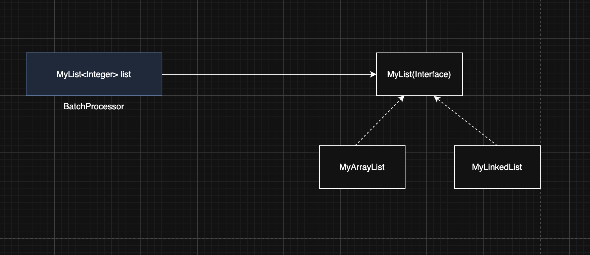
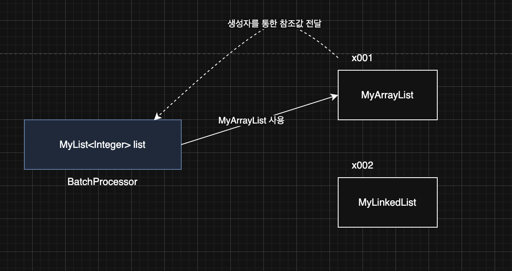
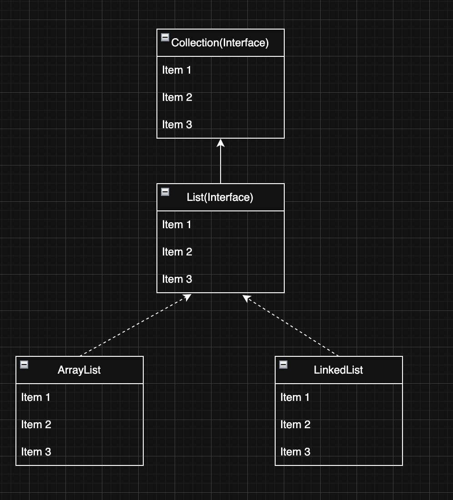

> 해당 블로그 글은 [영한님의 인프런 강의](https://inf.run/xexJb)를 바탕으로 쓰여진 글입니다.

## 리스트 추상화1 - 인터페이스 도입

다형성과 OCP 원칙을 가장 잘 활용할 수 있는 곳 중에 하나가 바로 자료 구조이다.

### List 자료구조

순서가 있고, 중복을 허용하는 자료 구조를 리스트(`List`)라 한다. 우리가 커스텀하게 구현한 `ArrayList`와 `LinkedList`는 보았을 때 내부 로직만 다르고 메서드는 거의 동일하다. 이런것을 보았을 때 하나의 인터페이스를 만들고 해당 인터페이스를 구현하면 다형성 원칙을 지킬 수 있을 것 같아 보인다. 한번 코드로 작성해보자.

``` java
package collection.list;

public interface MyList<E> {

    int size();

    void add(E e);

    void add(int index, E e);

    E get(int index);

    E set(int index, E element);

    E remove(int index);

    int indexOf(E o);
}
```

위와 같이 인터페이스를 정의하고 해당 인터페이스를 `MyArrayList`, `MyLinkedList`가 구현하도록 하겠다.

``` java
package collection.list;

import java.util.Arrays;

public class MyArrayList<E> implements MyList<E> {

    private static final int DEFAULT_CAPACITY = 5;

    private Object[] elementData;

    private int size = 0;

    public MyArrayList() {
        elementData = new Object[DEFAULT_CAPACITY];
    }

    public MyArrayList(int initialCapacity) {
        elementData = new Object[initialCapacity];
    }

    @Override
    public int size() {
        return size;
    }

    @Override
    public void add(E e) {
        if (size == elementData.length) {
            grow();
        }

        elementData[size] = e;
        size++;
    }

    @Override
    public void add(int index, E e) {
        if (size == elementData.length) {
            grow();
        }
        shiftRightFrom(index);
        elementData[index] = e;
        size++;
    }

    @Override
    @SuppressWarnings("unchecked")
    public E get(int index) {
        return (E) elementData[index];
    }

    @Override
    public E set(int index, E element) {
        E oldValue = get(index);
        elementData[index] = element;

        return oldValue;
    }

    @Override
    public E remove(int index) {
        E oldValue = get(index);
        shiftLeftFrom(index);

        size--;
        elementData[size] = null;

        return oldValue;
    }

    @Override
    public int indexOf(E o) {
        for (int i = 0; i < size; i++) {
            if (o.equals(elementData[i])) {
                return i;
            }
        }

        return -1;
    }

    @Override
    public String toString() {
        return Arrays.toString(Arrays.copyOf(elementData, size)) + " size = " + size + ", capacity = " + elementData.length;
    }

    private void grow() {
        int oldCapacity = elementData.length;
        int newCapacity = oldCapacity * 2;

        elementData = Arrays.copyOf(elementData, newCapacity);
    }

    private void shiftRightFrom(int index) {
        for (int i = size; i > index; i--) {
            elementData[i] = elementData[i - 1];
        }
    }

    private void shiftLeftFrom(int index) {
        for (int i = index; i < size - 1; i++) {
            elementData[i] = elementData[i + 1];
        }
    }
}
```

``` java
package collection.list;

public class MyLinkedList<E> implements MyList<E> {

    private Node<E> first;

    private int size = 0;

    @Override
    public void add(E e) {
        Node<E> newNode = new Node<>(e);

        if (first == null) {
            first = newNode;
        } else {
            Node<E> lastNode = getLastNode();
            lastNode.next = newNode;
        }

        size++;
    }

    @Override
    public void add(int index, E e) {
        Node<E> newNode = new Node<>(e);

        if (index == 0) {
            newNode.next = first;
            first = newNode;
        } else {
            Node<E> prev = getNode(index - 1);
            newNode.next = prev.next;
            prev.next = newNode;
        }

        size++;
    }

    @Override
    public E set(int index, E element) {
        Node<E> x = getNode(index);
        E oldValue = x.item;

        x.item = element;

        return oldValue;
    }

    @Override
    public E remove(int index) {
        Node<E> removeNode = getNode(index);
        E removedItem = removeNode.item;

        if (index == 0) {
            first = removeNode.next;
        } else {
            Node<E> prev = getNode(index - 1);
            prev.next = removeNode.next;
        }

        removeNode.item = null;
        removeNode.next = null;
        size--;

        return removedItem;
    }

    @Override
    public E get(int index) {
        Node<E> node = getNode(index);

        return node.item;
    }

    @Override
    public int indexOf(E o) {
        int index = 0;

        for (Node<E> x = first; x != null; x = x.next) {
            if (o.equals(x.item)) {
                return index;
            }

            index++;
        }

        return -1;
    }

    @Override
    public int size() {
        return size;
    }

    @Override
    public String toString() {
        return "MyLinkedListV1{" +
                "first=" + first +
                ", size=" + size +
                '}';
    }

    private Node<E> getLastNode() {
        Node<E> x = first;

        while (x.next != null) {
            x = x.next;
        }

        return x;
    }

    private Node<E> getNode(int index) {
        Node<E> x = first;

        for (int i = 0; i < index; i++) {
            x = x.next;
        }

        return x;
    }

    private static class Node<E> {
        E item;

        Node<E> next;

        public Node(E item) {
            this.item = item;
        }

        @Override
        public String toString() {
            StringBuilder sb = new StringBuilder();
            Node<E> temp = this;
            sb.append("[");

            while (temp != null) {
                sb.append(temp.item);

                if (temp.next != null) {
                    sb.append("->");
                }

                temp = temp.next;
            }

            sb.append("]");

            return sb.toString();
        }
    }
}
```

## 리스트 추상화2 - 의존관계 주입

현재 사내에 배치 프로그램이 존재한다고 해보자. 그런데 현재 배치 작업이 너무 오래걸린다고 VOC가 들어왔다고 해보자. 그래서 나한테 지라 티켓이 발급되었고 해당 태스크를 진행하려고 기존 배치 프로그램을 확인해보니 아래와 같이 되어 있다는 것을 확인할 수 있었다.

``` java
public class BatchProcessor {
    private MyArrayList<Integer> list = new MyArrayList<>();

    public void logic() {
        // 배치 로직
    }
}
```

그리고 디버깅을 통해 왜 성능이 느려졌는지 분석을 하였다. 분석한 결과 데이터를 추가하는 배치쪽에서 주로 배열 앞에다가 추가하는 로직이 많다는 것을 보게 되었다. 그래서 나는 `MyArrayList` 대신에 `MyLinkedList`로 변경하고자 하였다. 하지만 생각해보니 이런 알고리즘 전략이 변경이 될 때마다 배치 프로그램을 중단시키고 수정하고 다시 배포하는 일련의 과정들을 거쳐야 하는 불편함이 있다. 왜냐하면 해당 배치 프로그램은 구체적인 것에 의존하고 있는 것이기 때문이다.

그래서 다형성 원칙과 OCP원칙을 떠올려 구체적인 것을 의존하게 하는 것이 아닌 추상적인 것을 의존하게끔 변경하게 하려고 한다. 그리고 해당 배치 프로그램을 생성하는 쪽에서 알고리즘 전략을 선택해주면 좋을 것이다. 그렇게 작성해보자. 먼저 배치 프로그램을 작성하면 다음과 같다.

``` java
package collection.list;

public class BatchProcessor {

    private final MyList<Integer> list;

    public BatchProcessor(MyList<Integer> list) {
        this.list = list;
    }

    public void logic(int size) {
        long startTime = System.currentTimeMillis();

        for (int i = 0; i < size; i++) {
            list.add(0, i);
        }

        long endTime = System.currentTimeMillis();

        System.out.println("크기: " + size + ", 계산 시간: " + (endTime - startTime) + "ms");
    }
}
```

추상적인 것을 의존하게끔 인터페이스 타입으로 선언하고 그 구현체를 외부로 주입받는 구조로 하게 두었다. 이것은 `BatchProcessor` 의 외부에서 의존관계가 결정되어서 `BatchProcessor` 인스턴스에 들어오는 것 같다. 마치 의존관계가 외부에서 주입되는 것 같다고 해서 이것을 **의존관계 주입**이라 한다.

> ✅ 참고
>
> 위의 코드는 생성자를 통해서 의존관계를 주입했기 때문에 생성자 의존관계 주입이라 한다.

이제 실행하는 코드를 작성해보자.

``` java
package collection.list;

public class BatchProcessorMain {
    public static void main(String[] args) {
        MyArrayList<Integer> list = new MyArrayList<>();
//        MyLinkedList<Integer> list = new MyLinkedList<>();

        BatchProcessor processor = new BatchProcessor(list);
        processor.logic(50_000);
    }
}
```

두 알고리즘을 선택해서 비교해보니 확실히 `MyLinkedList`의 성능이 매우 뛰어나다는 것을 확인할 수 있었다.

## 리스트 추상화3 - 컴파일 타임, 런타임 의존관계

의존관계는 크게 컴파일 타임 의존관계와 런타임 의존관계로 나눌 수 있다.

- 컴파일 타임: 코드 컴파일 시점을 뜻한다.
- 런타임: 프로그램 실행 시점을 뜻한다.

### 컴파일 타임 의존관계 vs 런타임 의존관계

#### 컴파일 타임 의존관계



- 컴파일 타임 의존관계는 자바 컴파일러가 보는 의존관계이다. 클래스에 모든 의존관계가 다 나타난다.
- 쉽게 이야기해서 클래스에 바로 보이는 의존관계이다. 그리고 실행하지 않은 소스 코드에 정적으로 나타나는 의존 관계이다.
- `BatchProcessor` 클래스는 현재 `MyList`라는 추상적인 인터페이스에만 의존하고 구체적인 구현체에는 의존하지 않는다. 코드상으로 보았을 때 딱 보일 것이다.

#### 런타임 의존 관계



- 런타임 의존관계는 실제 프로그램이 작동할 때 보이는 의존관계다. 주로 생성된 인스턴스와 그것을 참조하는 의존 관계이다.
- 쉽게 이야기해서 프로그램이 실행될 때 인스턴스 간에 의존관계로 보면 된다.
- 런타임 의존관계는 프로그램 실행 중에 계속 변할 수 있다.

이렇게 생성자를 통해 런타임 의존관계를 주입하는 것을 **생성자 의존관계 주입** 또는 줄여서 **생성자 주입**이라 한다. 클라이언트 클래스는 컴파일 타임에 추상적인 것에 의존하고, 런타임에 의존 관계 주입을 통해 구현체를 주입받아 사용함으로써, 이런 이점을 얻을 수 있다.

> ✅ 참고
>
> 디자인 패턴 중에 가장 중요한 패턴을 하나 뽑으라고 하면 전략 패턴을 뽑을 수 있다. 전략 패턴은 알고리즘을 클라이언트 코드의 변경 없이 쉽게 교체할 수 있다. 방금 설명한 코드가 바로 전략 패턴을 사용한 코드이다. `MyList` 인터페이스가 바로 전략을 정의하는 인터페이스가 되고, 각각의 구현체인 `MyArrayList`, `MyLinkedList`가 전략의 구체적인 구현이 된다. 그리고 전략을 클라이언트 코드(`BatchProcessor` )의 변경 없이 손쉽게 교체할 수 있다.

## 직접 구현한 리스트의 성능 비교

그러면 우리가 실제 만든 `MyArrayList`와 `MyLinkedList`의 성능을 비교해보자.

``` java
package collection.list;

public class MyListPerformanceTest {
    public static void main(String[] args) {
        int size = 50_000;

        System.out.println("==MyArrayList 추가==");
        addFirst(new MyArrayList<>(), size);
        addMid(new MyArrayList<>(), size);
        MyArrayList<Integer> arrayList = new MyArrayList<>();
        addLast(arrayList, size);

        System.out.println("==MyLinkedList 추가==");
        addFirst(new MyLinkedList<>(), size);
        addMid(new MyLinkedList<>(), size);
        MyLinkedList<Integer> linkedList = new MyLinkedList<>();
        addLast(linkedList, size);

        int loop = 10000;

        System.out.println("==MyArrayList 조회==");
        getIndex(arrayList, loop, 0);
        getIndex(arrayList, loop, size / 2);
        getIndex(arrayList, loop, size - 1);

        System.out.println("==MyLinkedList 조회==");
        getIndex(linkedList, loop, 0);
        getIndex(linkedList, loop, size / 2);
        getIndex(linkedList, loop, size - 1);

        System.out.println("==MyArrayList 검색==");
        search(arrayList, loop, 0);
        search(arrayList, loop, size / 2);
        search(arrayList, loop, size - 1);

        System.out.println("==MyLinkedList 검색==");
        search(linkedList, loop, 0);
        search(linkedList, loop, size / 2);
        search(linkedList, loop, size - 1);

    }

    private static void addFirst(MyList<Integer> list, int size) {
        long startTime = System.currentTimeMillis();

        for (int i = 0; i < size; i++) {
            list.add(0, i);
        }

        long endTime = System.currentTimeMillis();

        System.out.println("앞에 추가 - 크기: " + size + ", 계산 시간: " + (endTime - startTime) + "ms");
    }

    private static void addMid(MyList<Integer> list, int size) {
        long startTime = System.currentTimeMillis();

        for (int i = 0; i < size; i++) {
            list.add(i / 2, i);
        }

        long endTime = System.currentTimeMillis();

        System.out.println("평균 추가 - 크기: " + size + ", 계산 시간: " + (endTime - startTime) + "ms");
    }

    private static void addLast(MyList<Integer> list, int size) {
        long startTime = System.currentTimeMillis();

        for (int i = 0; i < size; i++) {
            list.add(i);
        }

        long endTime = System.currentTimeMillis();

        System.out.println("뒤에 추가 - 크기: " + size + ", 계산 시간: " + (endTime - startTime) + "ms");
    }

    private static void getIndex(MyList<Integer> list, int loop, int index) {
        long startTime = System.currentTimeMillis();

        for (int i = 0; i < loop; i++) {
            list.get(index);
        }

        long endTime = System.currentTimeMillis();

        System.out.println("index: " + index + ", 반복: " + loop + ", 계산 시간: " + (endTime - startTime) + "ms");
    }

    private static void search(MyList<Integer> list, int loop, int findValue) {
        long startTime = System.currentTimeMillis();

        for (int i = 0; i < loop; i++) {
            list.indexOf(findValue);
        }

        long endTime = System.currentTimeMillis();

        System.out.println("findValue: " + findValue + ", 반복: " + loop + ", 계산 시간: " + (endTime - startTime) + "ms");
    }
}
```

### 추가, 삭제

- 배열 리스트는 인덱스를 통해 추가나 삭제할 위치를 O(1)로 빠르게 찾지만, 추가나 삭제 이후에 데이터를 한칸씩 밀어야 한다. 이 부분이 O(n)으로 오래 걸린다.
- 연결 리스트는 인덱스를 통해 추가나 삭제할 위치를 O(n)으로 느리게 찾지만, 실제 데이터의 추가는 간단한 참조 변경으로 빠르게 O(1)로 수행된다.

### 앞에 추가(삭제)

- 배열 리스트: 추가나 삭제할 위치는 찾는데 O(1), 데이터를 한칸씩 이동 O(n) -> O(n)
- 연결 리스트: 추가나 삭제할 위치는 찾는데 O(1), 노드를 변경하는데 O(1) -> O(1)

### 평균 추가(삭제)

- 배열 리스트: 추가나 삭제할 위치는 찾는데 O(1), 인덱스 이후의 데이터를 한칸씩 이동 O(n/2) -> O(n)
- 연결 리스트: 추가나 삭제할 위치는 찾는데 O(n/2), 노드를 변경하는데 O(1) -> O(n)

### 뒤에 추가(삭제)

- 배열 리스트: 추가나 삭제할 위치는 찾는데 O(1), 이동할 데이터 없음 -> O(1)
- 연결 리스트: 추가나 삭제할 위치는 찾는데 O(n), 노드를 변경하는데 O(1) -> O(n)

### 인덱스 조회

- 배열 리스트: 배열에 인덱스를 사용해서 값을 O(1)로 찾을 수 있음
- 연결 리스트: 노드를 인덱스 수 만큼 이동해야함 O(n)

### 검색

- 배열 리스트: 데이터를 찾을 때 까지 배열을 순회 O(n)
- 연결 리스트: 데이터를 찾을 때 까지 노드를 순회 O(n)

### 시간 복잡도와 실제 성능

- 이론적으로 `MyLinkedList` 의 평균 추가(중간 삽입) 연산은 `MyArrayList` 보다 빠를 수 있다. 그러나 실제 성능은 요소의 순차적 접근 속도, 메모리 할당 및 해제 비용, CPU 캐시 활용도 등 다양한 요소에 의해 영향을 받는다.
- `MyArrayList` 는 요소들이 메모리 상에서 연속적으로 위치하여 CPU 캐시 효율이 좋고, 메모리 접근 속도가 빠르다.
- 반면, `MyLinkedList` 는 각 요소가 별도의 객체로 존재하고 다음 요소의 참조를 저장하기 때문에 CPU 캐시 효율이 떨어지고, 메모리 접근 속도가 상대적으로 느릴 수 있다.
- `MyArrayList` 의 경우 `CAPACITY` 를 넘어서면 배열을 다시 만들고 복사하는 과정이 추가된다. 하지만 한번에 2배씩 늘어나기 때문에 이 과정은 가끔 발생하므로, 전체 성능에 큰 영향을 주지는 않는다.

그래서 알고리즘적으로는 `MyLinkedList`가 성능이 뛰어날 것 같지만 CPU 캐싱 최적화 효과등을 고려한다면 `MyArrayList`가 더 뛰어난 것을 알 수 있다. 같은 시간 복잡도를 가지더라도 `MyArrayList`의 성능이 더 나오는 것은 바로 해당 이유 때문이다.

### 배열 리스트 vs 연결 리스트

대부분의 경우 배열 리스트가 성능상 유리하다. 이런 이유로 실무에서는 주로 배열 리스트를 기본으로 사용한다. 단, 앞쪽에 데이터를 삭제 혹은 검색이 주로 이루어지는 시스템이라면 그때는 연결 리스트를 고려하자.

## 자바 리스트

### List 자료구조

순서가 있고, 중복을 허용하는 자료 구조를 리스트라 한다. 컬렉션 프레임워크의 여러 자료구조 중에 하나이며, 실무에서 제일 많이 사용하는 자료구조이기도 하다. 그러면 컬렉션 프레임워크 구조를 한번 간략히 살펴보자.



### Collection 인터페이스

`Collection` 인터페이스는 `java.util` 패키지의 컬렉션 프레임워크의 핵심 인터페이스 중 하나이다. 이 인터페이스는 자바에서 다양한 컬렉션, 즉 데이터 그룹을 다루기 위한 메서드를 정의한다. `Collection` 인터페이스는 `List`,`Set`,`Queue` 와 같은 다양한 하위 인터페이스와 함께 사용되며, 이를 통해 데이터를 리스트, 세트, 큐 등의 형태로 관리할 수 있다.

### List 인터페이스

`List` 인터페이스는 `java.util` 패키지에 있는 컬렉션 프레임워크의 일부다. `List` 는 객체들의 순서가 있는 컬렉션을 나타내며, 같은 객체의 중복 저장을 허용한다. 이 리스트는 배열과 비슷하지만, 크기가 동적으로 변화하는 컬렉션을 다룰 때 유연하게 사용할 수 있다. 해당 인터페이스의 대표적인 구현체로는 `ArrayList`, `LinkedList`가 존재한다. 이 외에 다양한 구현체들이 존재하니 한번 살펴보는 것도 좋은 공부가 될 것 같다.

### List 인터페이스 주요 메서드

<table style="border-collapse: collapse; width: 100%; border: 2px solid #666;">
  <thead>
    <tr>
      <th style="border: 2px solid #666; padding: 8px; background-color: slateblue; color: white;">메서드</th>
      <th style="border: 2px solid #666; padding: 8px; background-color: slateblue; color: white;">설명</th>
    </tr>
  </thead>
  <tbody>
    <tr>
      <td style="border: 2px solid #666; padding: 8px; background-color: rgba(200, 200, 200, 0.2);">add(E e)</td>
      <td style="border: 2px solid #666; padding: 8px; background-color: rgba(200, 200, 200, 0.2);">리스트의 끝에 지정된 요소를 추가한다.</td>
    </tr>
    <tr>
      <td style="border: 2px solid #666; padding: 8px; background-color: rgba(200, 200, 200, 0.1);">add(int index, E element)</td>
      <td style="border: 2px solid #666; padding: 8px; background-color: rgba(200, 200, 200, 0.1);">리스트의 지정된 위치에 요소를 삽입한다.</td>
    </tr>
    <tr>
      <td style="border: 2px solid #666; padding: 8px; background-color: rgba(200, 200, 200, 0.2);">addAll(Collection<? extends E> c)</td>
      <td style="border: 2px solid #666; padding: 8px; background-color: rgba(200, 200, 200, 0.2);">지정된 컬렉션의 모든 요소를 리스트의 끝에 추가한다.</td>
    </tr>
    <tr>
      <td style="border: 2px solid #666; padding: 8px; background-color: rgba(200, 200, 200, 0.1);">addAll(int index, Collection<? extends E> c)</td>
      <td style="border: 2px solid #666; padding: 8px; background-color: rgba(200, 200, 200, 0.1);">지정된 컬렉션의 모든 요소를 리스트의 지정된 위치에 추가한다.</td>
    </tr>
    <tr>
      <td style="border: 2px solid #666; padding: 8px; background-color: rgba(200, 200, 200, 0.2);">get(int index)</td>
      <td style="border: 2px solid #666; padding: 8px; background-color: rgba(200, 200, 200, 0.2);">리스트에서 지정된 위치의 요소를 반환한다.</td>
    </tr>
    <tr>
      <td style="border: 2px solid #666; padding: 8px; background-color: rgba(200, 200, 200, 0.1);">set(int index, E element)</td>
      <td style="border: 2px solid #666; padding: 8px; background-color: rgba(200, 200, 200, 0.1);">지정한 위치의 요소를 변경하고, 이전 요소를 반환한다.</td>
    </tr>
    <tr>
      <td style="border: 2px solid #666; padding: 8px; background-color: rgba(200, 200, 200, 0.2);">remove(int index)</td>
      <td style="border: 2px solid #666; padding: 8px; background-color: rgba(200, 200, 200, 0.2);">리스트에서 지정된 위치의 요소를 제거하고 그 요소를 반환한다.</td>
    </tr>
    <tr>
      <td style="border: 2px solid #666; padding: 8px; background-color: rgba(200, 200, 200, 0.1);">remove(Object o)</td>
      <td style="border: 2px solid #666; padding: 8px; background-color: rgba(200, 200, 200, 0.1);">리스트에서 지정된 첫 번째 요소를 제거한다.</td>
    </tr>
    <tr>
      <td style="border: 2px solid #666; padding: 8px; background-color: rgba(200, 200, 200, 0.2);">clear()</td>
      <td style="border: 2px solid #666; padding: 8px; background-color: rgba(200, 200, 200, 0.2);">리스트에서 모든 요소를 제거한다.</td>
    </tr>
    <tr>
      <td style="border: 2px solid #666; padding: 8px; background-color: rgba(200, 200, 200, 0.1);">indexOf(Object o)</td>
      <td style="border: 2px solid #666; padding: 8px; background-color: rgba(200, 200, 200, 0.1);">리스트에서 지정된 요소의 첫 번째 인덱스를 반환한다.</td>
    </tr>
    <tr>
      <td style="border: 2px solid #666; padding: 8px; background-color: rgba(200, 200, 200, 0.2);">lastIndexOf(Object o)</td>
      <td style="border: 2px solid #666; padding: 8px; background-color: rgba(200, 200, 200, 0.2);">리스트에서 지정된 요소의 마지막 인덱스를 반환한다.</td>
    </tr>
    <tr>
      <td style="border: 2px solid #666; padding: 8px; background-color: rgba(200, 200, 200, 0.1);">contains(Object o)</td>
      <td style="border: 2px solid #666; padding: 8px; background-color: rgba(200, 200, 200, 0.1);">리스트가 지정된 요소를 포함하고 있는지 여부를 반환한다.</td>
    </tr>
    <tr>
      <td style="border: 2px solid #666; padding: 8px; background-color: rgba(200, 200, 200, 0.2);">sort(Comparator<? super E> c)</td>
      <td style="border: 2px solid #666; padding: 8px; background-color: rgba(200, 200, 200, 0.2);">리스트의 요소를 지정된 비교자에 따라 정렬한다.</td>
    </tr>
    <tr>
      <td style="border: 2px solid #666; padding: 8px; background-color: rgba(200, 200, 200, 0.1);">subList(int fromIndex, int toIndex)</td>
      <td style="border: 2px solid #666; padding: 8px; background-color: rgba(200, 200, 200, 0.1);">리스트의 일부분의 뷰를 반환한다.</td>
    </tr>
    <tr>
      <td style="border: 2px solid #666; padding: 8px; background-color: rgba(200, 200, 200, 0.2);">size()</td>
      <td style="border: 2px solid #666; padding: 8px; background-color: rgba(200, 200, 200, 0.2);">리스트의 요소 수를 반환한다.</td>
    </tr>
    <tr>
      <td style="border: 2px solid #666; padding: 8px; background-color: rgba(200, 200, 200, 0.1);">isEmpty()</td>
      <td style="border: 2px solid #666; padding: 8px; background-color: rgba(200, 200, 200, 0.1);">리스트가 비어있는지 여부를 반환한다.</td>
    </tr>
    <tr>
      <td style="border: 2px solid #666; padding: 8px; background-color: rgba(200, 200, 200, 0.2);">iterator()</td>
      <td style="border: 2px solid #666; padding: 8px; background-color: rgba(200, 200, 200, 0.2);">리스트의 요소에 대한 반복자를 반환한다.</td>
    </tr>
    <tr>
      <td style="border: 2px solid #666; padding: 8px; background-color: rgba(200, 200, 200, 0.1);">toArray()</td>
      <td style="border: 2px solid #666; padding: 8px; background-color: rgba(200, 200, 200, 0.1);">리스트의 모든 요소를 배열로 반환한다.</td>
    </tr>
    <tr>
      <td style="border: 2px solid #666; padding: 8px; background-color: rgba(200, 200, 200, 0.2);">toArray(T[] a)</td>
      <td style="border: 2px solid #666; padding: 8px; background-color: rgba(200, 200, 200, 0.2);">리스트의 모든 요소를 지정된 배열로 반환한다.</td>
    </tr>
  </tbody>
</table>

### 자바 ArrayList

자바가 제공하는 `ArrayList` 는 우리가 직접 만든 `MyArrayList` 와 거의 비슷하다. 특징은 다음과 같다.

- 배열을 사용해서 데이터를 관리한다.
- 기본 `CAPACITY` 는 10이다.
    - `CAPACITY` 를 넘어가면 배열을 50% 증가한다.
- 메모리 고속 복사 연산을 사용한다.
    - `ArrayList` 의 중간 위치에 데이터를 추가하면, 추가할 위치 이후의 모든 요소를 한 칸씩 뒤로 이동시켜야 한다.
    - 자바가 제공하는 `ArrayList` 는 이 부분을 최적화 하는데, 배열의 요소 이동은 시스템 레벨에서 최적화된 메모리 고속 복사 연산을 사용해서 비교적 빠르게 수행된다. 참고로 `System.arraycopy()` 를 사용한다.
    - 시스템 레벨에서 배열을 한 번에 아주 빠르게 복사한다. 이 부분은 OS, 하드웨어에 따라 성능이 다르기 때문에 정확한 측정이 어렵지만, 한 칸씩 이동하는 방식과 비교하면 보통 수 배 이상의 빠른 성능을 제공한다.

### 자바 LinkedList

자바가 제공하는 `LinkedList` 는 우리가 직접 만든 `MyLinkedList` 와 거의 비슷하다. 특징은 다음과 같다.

- 이중 연결 리스트 구조
- 첫 번째 노드와 마지막 노드 둘다 참조

#### 단일 연결 리스트

- 우리가 직접 구현한 것 처럼 첫번째 노드를 가리키는 변수가 하나 있고 해당 노드안에는 데이터가 저장되어 있는 `item` 필드와 다음 노드를 가리키는 `next`라는 필드가 존재한다.

#### 이중 연결 리스트

- 자바가 제공하는 `LinkedList` 는 이중 연결 구조를 사용한다. 이 구조는 다음 노드 뿐만 아니라 이전 노드로도 이동할 수 있다.
- 해당 구조는 단일 연결 리스트의 노드에 `prev`라는 필드를 두어서 이전 노드의 값도 가리키게 해두었다.
- 또한 이중 연결 리스트는 마지막 노드에 대한 참조를 제공한다. 따라서 데이터를 마지막에 추가하는 경우에도 O(1)의 성능을 제공한다.
- 이전 노드로 이동할 수 있기 때문에 마지막 노드부터 앞으로, 그러니까 역방향으로 조회할 수 있다.
    - 덕분에 인덱스 조회 성능을 최적화 할 수 있다.
    - 찾는 인덱스 위치가 중간보다 아래면 첫번째 노드부터 찾고, 중간보다 높으면 마지막 노드부터 역방향 검색하여 찾는다.

## 자바 리스트의 성능 비교

그러면 직접 구현한 컬렉션 프레임워크를 사용하지 말고 자바에서 제공해주는 컬렉션 프레임워크를 이용해서 성능을 비교해보겠다.

``` java
package collection.list;

import java.util.ArrayList;
import java.util.LinkedList;
import java.util.List;

public class JavaListPerformanceTest {
    public static void main(String[] args) {
        int size = 50_000;

        System.out.println("==ArrayList 추가==");
        addFirst(new ArrayList<>(), size);
        addMid(new ArrayList<>(), size);
        ArrayList<Integer> arrayList = new ArrayList<>();
        addLast(arrayList, size);

        System.out.println("==LinkedList 추가==");
        addFirst(new LinkedList<>(), size);
        addMid(new LinkedList<>(), size);
        LinkedList<Integer> linkedList = new LinkedList<>();
        addLast(linkedList, size);

        int loop = 10000;

        System.out.println("==ArrayList 조회==");
        getIndex(arrayList, loop, 0);
        getIndex(arrayList, loop, size / 2);
        getIndex(arrayList, loop, size - 1);

        System.out.println("==LinkedList 조회==");
        getIndex(linkedList, loop, 0);
        getIndex(linkedList, loop, size / 2);
        getIndex(linkedList, loop, size - 1);

        System.out.println("==ArrayList 검색==");
        search(arrayList, loop, 0);
        search(arrayList, loop, size / 2);
        search(arrayList, loop, size - 1);

        System.out.println("==LinkedList 검색==");
        search(linkedList, loop, 0);
        search(linkedList, loop, size / 2);
        search(linkedList, loop, size - 1);

    }

    private static void addFirst(List<Integer> list, int size) {
        long startTime = System.currentTimeMillis();

        for (int i = 0; i < size; i++) {
            list.add(0, i);
        }

        long endTime = System.currentTimeMillis();

        System.out.println("앞에 추가 - 크기: " + size + ", 계산 시간: " + (endTime - startTime) + "ms");
    }

    private static void addMid(List<Integer> list, int size) {
        long startTime = System.currentTimeMillis();

        for (int i = 0; i < size; i++) {
            list.add(i / 2, i);
        }

        long endTime = System.currentTimeMillis();

        System.out.println("평균 추가 - 크기: " + size + ", 계산 시간: " + (endTime - startTime) + "ms");
    }

    private static void addLast(List<Integer> list, int size) {
        long startTime = System.currentTimeMillis();

        for (int i = 0; i < size; i++) {
            list.add(i);
        }

        long endTime = System.currentTimeMillis();

        System.out.println("뒤에 추가 - 크기: " + size + ", 계산 시간: " + (endTime - startTime) + "ms");
    }

    private static void getIndex(List<Integer> list, int loop, int index) {
        long startTime = System.currentTimeMillis();

        for (int i = 0; i < loop; i++) {
            list.get(index);
        }

        long endTime = System.currentTimeMillis();

        System.out.println("index: " + index + ", 반복: " + loop + ", 계산 시간: " + (endTime - startTime) + "ms");
    }

    private static void search(List<Integer> list, int loop, int findValue) {
        long startTime = System.currentTimeMillis();

        for (int i = 0; i < loop; i++) {
            list.indexOf(findValue);
        }

        long endTime = System.currentTimeMillis();

        System.out.println("findValue: " + findValue + ", 반복: " + loop + ", 계산 시간: " + (endTime - startTime) + "ms");
    }
}
```

### 추가, 삭제

- 배열 리스트는 인덱스를 통해 추가나 삭제할 위치를 O(1)로 빠르게 찾지만, 추가나 삭제 이후에 데이터를 한칸씩 밀어야 한다. 이 부분이 O(n)으로 오래 걸린다.
- 연결 리스트는 인덱스를 통해 추가나 삭제할 위치를 O(n)으로 느리게 찾지만, 실제 데이터의 추가는 간단한 참조 변경으로 O(1)로 빠르게 수행된다.

### 앞에 추가(삭제)

- 배열 리스트: 추가나 삭제할 위치는 찾는데 O(1), 데이터를 한칸씩 이동 O(n) -> O(n)
- 연결 리스트: 추가나 삭제할 위치는 찾는데 O(1), 노드를 변경하는데 O(1) -> O(1)

### 평균 추가(삭제)

- 배열 리스트: 추가나 삭제할 위치는 찾는데 O(1), 인덱스 이후의 데이터를 한칸씩 이동 O(n/2) -> O(n)
- 연결 리스트: 추가나 삭제할 위치는 찾는데 O(n/2), 노드를 변경하는데 O(1) -> O(n)

### 뒤에 추가(삭제)

- 배열 리스트: 추가나 삭제할 위치는 찾는데 O(1), 이동할 데이터 없음 -> O(1)
- 연결 리스트: 추가나 삭제할 위치는 찾는데 O(1), 노드를 변경하는데 O(1) -> O(1)
    - 참고로 자바가 제공하는 연결 리스트는 마지막 위치를 가지고 있다.

### 인덱스 조회

- 배열 리스트: 배열에 인덱스를 사용해서 값을 O(1)로 찾을 수 있음
- 연결 리스트: 노드를 인덱스 수 만큼 이동해야함 O(n)

### 검색

- 배열 리스트: 데이터를 찾을 때 까지 배열을 순회 O(n)
- 연결 리스트: 데이터를 찾을 때 까지 노드를 순회 O(n)

### 데이터를 추가할 때 자바 ArrayList가 직접 구현한 MyArrayList보다 빠른 이유

자바의 배열 리스트는 이때 메모리 고속 복사를 사용하기 때문에 성능이 최적화된다.

### 시간 복잡도와 실제 성능

- 이론적으로 `LinkedList` 의 평균 추가(중간 삽입) 연산은 `ArrayList` 보다 빠를 수 있다. 그러나 실제 성능은 요소의 순차적 접근 속도, 메모리 할당 및 해제 비용, CPU 캐시 활용도 등 다양한 요소에 의해 영향을 받는다.
- `ArrayList` 는 요소들이 메모리 상에서 연속적으로 위치하여 CPU 캐시 효율이 좋고, 메모리 접근 속도가 빠르다.
- 반면, `LinkedList` 는 각 요소가 별도의 객체로 존재하고 다음 요소의 참조를 저장하기 때문에 CPU 캐시 효율이 떨어지고, 메모리 접근 속도가 상대적으로 느릴 수 있다.
- `ArrayList` 의 경우 `CAPACITY` 를 넘어서면 배열을 다시 만들고 복사하는 과정이 추가된다. 하지만 한번에 2배씩 늘어나기 때문에 이 과정은 가끔 발생하므로, 전체 성능에 큰 영향을 주지는 않는다.

그래서 알고리즘적으로는 `LinkedList`가 성능이 뛰어날 것 같지만 CPU 캐싱 최적화 효과등을 고려한다면 `ArrayList`가 더 뛰어난 것을 알 수 있다. 같은 시간 복잡도를 가지더라도 `ArrayList`의 성능이 더 나오는 것은 바로 해당 이유 때문이다.

> 잘못된 지식이 있을 경우 댓글로 남겨주시면 빠르게 반영하겠습니다!