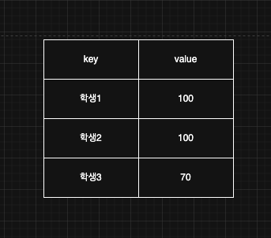
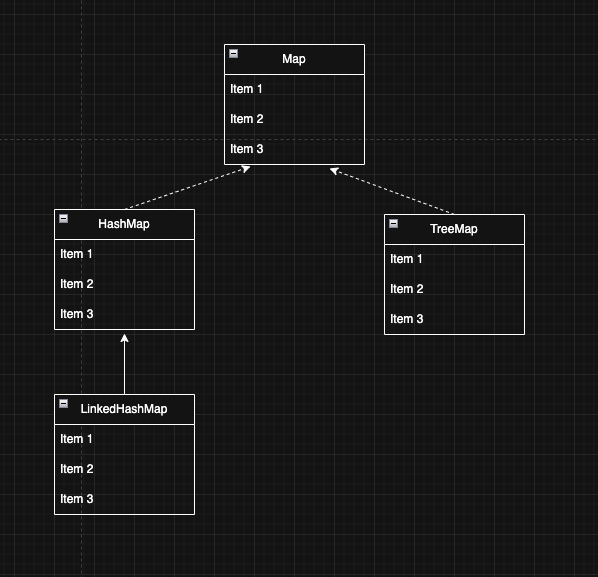
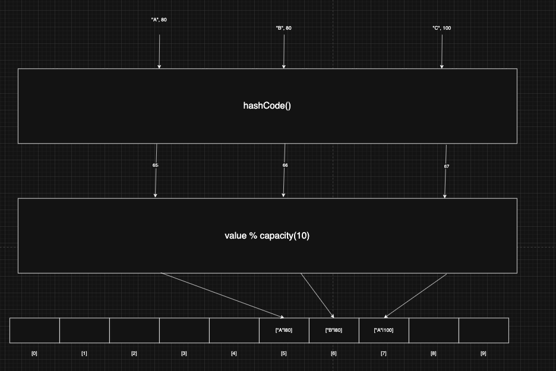
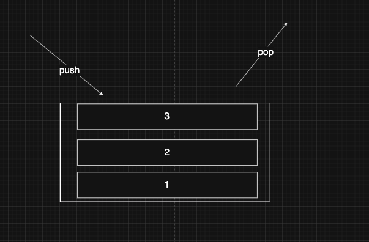
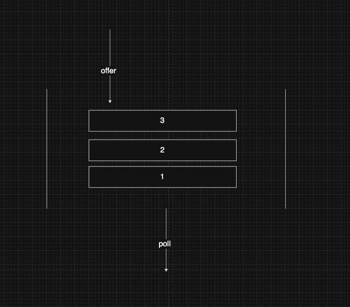
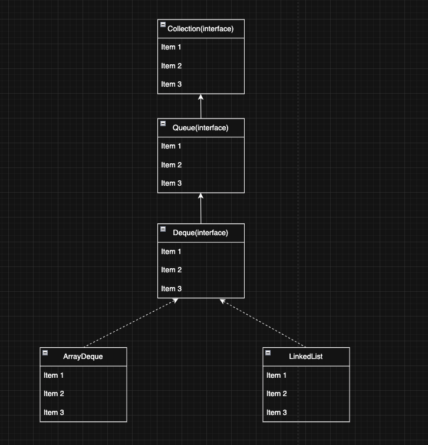
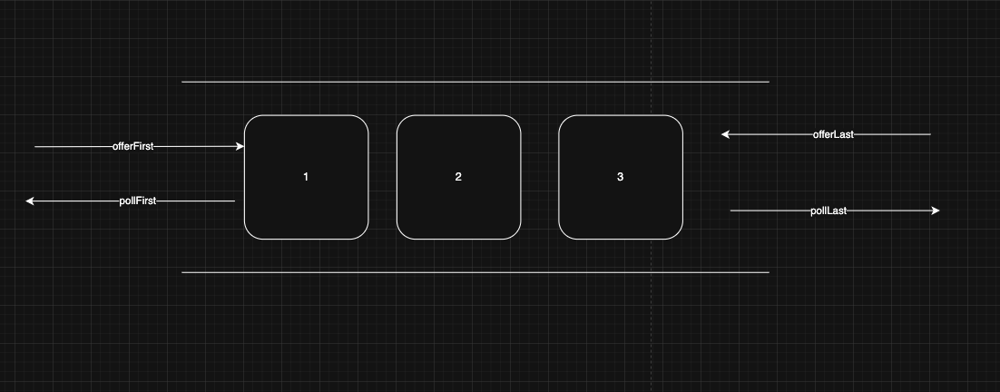

> 해당 블로그 글은 [영한님의 인프런 강의](https://inf.run/xexJb)를 바탕으로 쓰여진 글입니다.

## 컬렉션 프레임워크 - Map 소개10



`Map`은 키-값의 쌍을 저장하는 자료 구조이다.

- 키는 맵 내에서 유일해야 한다. 그리고 키를 통해 값을 빠르게 검색할 수 있다.
- 키는 중복될 수 없지만, 값은 중복될 수 있다.
- `Map` 은 순서를 유지하지 않는다.

`Map`은 마치 일종의 보물상자라고 생각하면 쉽다. 보물상자 안에 아이템은 중복될 수 있다. 하지만 해당 보물상자를 열려면 고유한 key가 필요하다. 이렇게 생각하면 쉬울 것 같다. 그러면 `Map`의 UML을 살펴보자.



`Map`은 다른 자료구조와 다르게 `Collection` 인터페이스를 구현하지 않는다. 왜냐하면 다른 자료구조는 이제까지 데이터 하나가 저장되어 있는 형태였다면 `Map`은 `key`와 `value`가 같이 저장되어 있는 형태이기 때문에 아마 `Collection` 인터페이스를 구현하지 않는 것이지 않을까 싶다.

### Map 인터페이스의 주요 메서드

<table style="border-collapse: collapse; width: 100%; border: 2px solid #666;">
  <thead>
    <tr>
      <th style="border: 2px solid #666; padding: 8px; background-color: slateblue; color: white;">메서드</th>
      <th style="border: 2px solid #666; padding: 8px; background-color: slateblue; color: white;">설명</th>
    </tr>
  </thead>
  <tbody>
    <tr>
      <td style="border: 2px solid #666; padding: 8px; background-color: rgba(200, 200, 200, 0.2);">put(K key, V value)</td>
      <td style="border: 2px solid #666; padding: 8px; background-color: rgba(200, 200, 200, 0.2);">지정된 키와 값을 맵에 저장한다. (같은 키가 있으면 값을 변경)</td>
    </tr>
    <tr>
      <td style="border: 2px solid #666; padding: 8px; background-color: rgba(200, 200, 200, 0.1);">putAll(Map&lt;? extends K,? extends V&gt; m)</td>
      <td style="border: 2px solid #666; padding: 8px; background-color: rgba(200, 200, 200, 0.1);">지정된 맵의 모든 매핑을 현재 맵에 복사한다.</td>
    </tr>
    <tr>
      <td style="border: 2px solid #666; padding: 8px; background-color: rgba(200, 200, 200, 0.2);">putIfAbsent(K key, V value)</td>
      <td style="border: 2px solid #666; padding: 8px; background-color: rgba(200, 200, 200, 0.2);">지정된 키가 없는 경우에 키와 값을 맵에 저장한다.</td>
    </tr>
    <tr>
      <td style="border: 2px solid #666; padding: 8px; background-color: rgba(200, 200, 200, 0.1);">get(Object key)</td>
      <td style="border: 2px solid #666; padding: 8px; background-color: rgba(200, 200, 200, 0.1);">지정된 키에 연결된 값을 반환한다.</td>
    </tr>
    <tr>
      <td style="border: 2px solid #666; padding: 8px; background-color: rgba(200, 200, 200, 0.2);">getOrDefault(Object key, V defaultValue)</td>
      <td style="border: 2px solid #666; padding: 8px; background-color: rgba(200, 200, 200, 0.2);">지정된 키에 연결된 값을 반환한다. 키가 없는 경우 `defaultValue`로 지정한 값을 대신 반환한다.</td>
    </tr>
    <tr>
      <td style="border: 2px solid #666; padding: 8px; background-color: rgba(200, 200, 200, 0.1);">remove(Object key)</td>
      <td style="border: 2px solid #666; padding: 8px; background-color: rgba(200, 200, 200, 0.1);">지정된 키와 그에 연결된 값을 맵에서 제거한다.</td>
    </tr>
    <tr>
      <td style="border: 2px solid #666; padding: 8px; background-color: rgba(200, 200, 200, 0.2);">clear()</td>
      <td style="border: 2px solid #666; padding: 8px; background-color: rgba(200, 200, 200, 0.2);">맵에서 모든 키와 값을 제거한다.</td>
    </tr>
    <tr>
      <td style="border: 2px solid #666; padding: 8px; background-color: rgba(200, 200, 200, 0.1);">containsKey(Object key)</td>
      <td style="border: 2px solid #666; padding: 8px; background-color: rgba(200, 200, 200, 0.1);">맵이 지정된 키를 포함하고 있는지 여부를 반환한다.</td>
    </tr>
    <tr>
      <td style="border: 2px solid #666; padding: 8px; background-color: rgba(200, 200, 200, 0.2);">containsValue(Object value)</td>
      <td style="border: 2px solid #666; padding: 8px; background-color: rgba(200, 200, 200, 0.2);">맵이 하나 이상의 키에 지정된 값을 연결하고 있는지 여부를 반환한다.</td>
    </tr>
    <tr>
      <td style="border: 2px solid #666; padding: 8px; background-color: rgba(200, 200, 200, 0.1);">keySet()</td>
      <td style="border: 2px solid #666; padding: 8px; background-color: rgba(200, 200, 200, 0.1);">맵의 키들을 `Set` 형태로 반환한다.</td>
    </tr>
    <tr>
      <td style="border: 2px solid #666; padding: 8px; background-color: rgba(200, 200, 200, 0.2);">values()</td>
      <td style="border: 2px solid #666; padding: 8px; background-color: rgba(200, 200, 200, 0.2);">맵의 값들을 `Collection` 형태로 반환한다.</td>
    </tr>
    <tr>
      <td style="border: 2px solid #666; padding: 8px; background-color: rgba(200, 200, 200, 0.1);">entrySet()</td>
      <td style="border: 2px solid #666; padding: 8px; background-color: rgba(200, 200, 200, 0.1);">맵의 키-값 쌍을 `Set&lt;Map.Entry&lt;K,V&gt;&gt;` 형태로 반환한다.</td>
    </tr>
    <tr>
      <td style="border: 2px solid #666; padding: 8px; background-color: rgba(200, 200, 200, 0.2);">size()</td>
      <td style="border: 2px solid #666; padding: 8px; background-color: rgba(200, 200, 200, 0.2);">맵에 있는 키-값 쌍의 개수를 반환한다.</td>
    </tr>
    <tr>
      <td style="border: 2px solid #666; padding: 8px; background-color: rgba(200, 200, 200, 0.1);">isEmpty()</td>
      <td style="border: 2px solid #666; padding: 8px; background-color: rgba(200, 200, 200, 0.1);">맵이 비어 있는지 여부를 반환한다.</td>
    </tr>
  </tbody>
</table>

`Map` 은 키와 값을 보관하는 자료 구조이다. 따라서 키와 값을 하나로 묶을 수 있는 방법이 필요하다. 이때 `Entry`를 사용한다. `Entry`는 키-값의 쌍으로 이루어진 간단한 객체이다. `Entiry`는 `Map` 내부에서 키와 값을 함께 묶어서 저장할 때 사용한다. 쉽게 이야기해서 우리가 `Map`에 키와 값으로 데이터를 저장하면 `Map`은 내부에서 키와 값을 하나로 묶는 `Entry` 객체를 만들어서 보관한다. 비유적으로 표현하자면 호텔의 각 층이 `Map`이고 각 방에 호실이 `Entry`라고 생각하자. 그리고 각 방에는 사람이라는 `value`와 열쇠가 같이 있을 것이다. 참고로 하나의 `Map`에 여러 `Entry`가 저장될 수 있다. 참고로 `Entry`는 `Map` 내부에 있는 인터페이스이다. 우리는 구현체보다는 이 인터페이스를 사용하면 된다.

`values()` 메서드를 이용하면 값들을 `Collection`형태로 반환이 되는데 그 이유는 값은 중복이 허용이되고 순서보장이 안되기 때문에 `Set`도 `List`로도 반환하기 애매하기에 제일 상위 인터페이스인 `Collection`형태로 반환하는 것이다.

## 컬렉션 프레임워크 - Map 소개2

만약 같은 키로 다른 데이터를 집어 넣으면 어떻게 될까? 코드를 통해 살펴보자.

``` java
package collection.map;

import java.util.HashMap;
import java.util.Map;

public class MapMain {
    public static void main(String[] args) {
        Map<String, Integer> studentMap = new HashMap<>();

        studentMap.put("studentA", 90);
        System.out.println(studentMap);

        studentMap.put("studentA", 100);
        System.out.println(studentMap);

        boolean containsKey = studentMap.containsKey("studentA");
        System.out.println("containsKey = " + containsKey);

        studentMap.remove("studentA");
        System.out.println(studentMap);
    }
}
```

값이 덮어쓰여진 것을 알 수 있다. 즉, 같은 키로 데이터를 다르게 저장하면 마지막에 저장한 값이 남는다.

## 컬렉션 프레임워크 - Map 구현체

자바의 `Map` 인터페이스는 키-값 쌍을 저장하는 자료 구조이다. `Map` 은 인터페이스이기 때문에, 직접 인스턴스를 생성 할 수는 없고, 대신 `Map` 인터페이스를 구현한 여러 클래스를 통해 사용할 수 있다. 대표적으로 `HashMap`,`TreeMap`, `LinkedHashMap`이 있다.

### Map vs Set

`Map`과 `Set`은 매우 유사하다. 사실, `Set`은 `Map`을 이용하여 만들었다. `Map`에 value값만 더미 값으로 두고 `key`값만 사용하면 바로 그게 `Set`이다. 그래서 구현체들고 매우 유사하고 각 구현체의 특징도 유사하다.

### HashMap

- 구조: `HashMap`은 해시를 사용해서 요소를 저장한다. 키(`Key`) 값은 해시 함수를 통해 해시 코드로 변환되고, 이 해시 코드는 데이터를 저장하고 검색하는 데 사용된다.
- 특징: 삽입, 삭제, 검색 작업은 해시 자료 구조를 사용하므로 일반적으로 상수 시간(`O(1)`)의 복잡도를 가진다.
- 순서: 순서를 보장하지 않는다.

### LinkedHashMap

- 구조: `LinkedHashMap`은 `HashMap`과 유사하지만, 연결 리스트를 사용하여 삽입 순서 또는 최근 접근 순서에 따라 요소를 유지한다.
- 특징: 입력 순서에 따라 순회가 가능하다. `HashMap`과 같지만 입력 순서를 링크로 유지해야 하므로 조금 더 무겁다.
- 성능: `HashMap`과 유사하게 대부분의 작업은 `O(1)`의 시간 복잡도를 가진다.
- 순서: 입력 순서를 보장한다.

### TreeMap

- 구조: `TreeMap`은 레드-블랙 트리를 기반으로 한 구현이다.
- 특징: 모든 키는 자연 순서 또는 생성자에 제공된 `Comparator`에 의해 정렬된다.
- 성능: `get`,`put`,`remove`와 같은 주요 작업들은 `O(log n)`의 시간 복잡도를 가진다.
- 순서: 키는 정렬된 순서로 저장된다.

### 자바 HashMap 작동 원리

자바의 `HashMap`은 `HashSet`과 작동 원리가 같다. `Set`과 비교하면 다음과 같은 차이가 있다.

- `Key`를 사용해서 해시 코드를 생성한다.
- `Key` 뿐만 아니라 값(`Value`)을 추가로 저장해야 하기 때문에 `Entry`를 사용해서 `Key`, `Value`를 하나로 묶어서 저장한다.



> ⚠️ 주의
>
> `Map`의 `Key`로 사용되는 객체는 `hashCode()`,`equals()`를 반드시 구현해야 한다.

## 스택 자료 구조



아래쪽은 막혀 있고, 위쪽만 열려있는 김치냉장고와 같은 구조를 스택 자료구조라 한다. 먼저 넣은 것이 나중에 나오는 LIFO(후입선출) 구조이며, 넣는 것을 `push`, 빼는 것을 `pop`이라고 표현한다.

> ⚠️ 주의
>
> 자바의 `Stack` 클래스는 내부에서 `Vector` 라는 자료 구조를 사용한다. 이 자료 구조는 자바 1.0에 개발되었는데, 지금은 사용되지 않고 하위 호환을 위해 존재한다. 지금은 더 빠른 좋은 자료 구조가 많다. 따라서 `Vector` 를 사용하는 `Stack`도 사용하지 않는 것을 권장한다. 대신에 이후에 설명할 `Deque` 를 사용하는 것이 좋다.

## 큐 자료 구조



스택과 반대로 먼저 들어간 것이 먼저 나오는 FIFO(선입선출) 구조를 큐 자료구조라고 한다. 스택과 달리 위의 그림처럼 양쪽이 뚫려 있으며 넣는 것을 `offer`, 빼는 것을 `poll`이라고 표현한다.



큐는 `Collection` 인터페이스를 상속하고 있으며 해당 구현체로 `ArrayDeque`와 `LinkedList`가 존재한다.

> ✅ 참고
>
> `LinkedList`는 `Deque`와 `List` 인터페이스를 다중 구현 하고 있다.

## Deque 자료 구조



Deque는 양쪽 끝에서 요소를 추가하거나 제거할 수 있다. Deque는 일반적인 큐(Queue)와 스택(Stack)의 기능을 모두 포함하고 있어, 매우 유연한 자료 구조이다. 그래서 앞에서 넣는 것을 `offerFirst`, 앞에서 꺼내는 것을 `pollFirst`, 뒤에 넣는 것을 `offerLast`, 뒤에서 꺼내는 것을 `pollLast`라고 한다. 그럼 한번 예제 코드를 살펴보자.

``` java
package collection.deque;

import java.util.ArrayDeque;
import java.util.Deque;
import java.util.LinkedList;

public class DequeMain {
    public static void main(String[] args) {
        Deque<Integer> deque = new ArrayDeque<>();
//        Deque<Integer> deque = new LinkedList<>();

        deque.offerFirst(1);
        System.out.println(deque);
        deque.offerFirst(2);
        System.out.println(deque);
        deque.offerLast(3);
        System.out.println(deque);
        deque.offerLast(4);
        System.out.println(deque);

        System.out.println("deque.peekFirst() = " + deque.peekFirst());
        System.out.println("deque.peekLast() = " + deque.peekLast());

        System.out.println("pollFirst = " + deque.pollFirst());
        System.out.println("pollFirst = " + deque.pollFirst());
        System.out.println("pollLast = " + deque.pollLast());
        System.out.println("pollLast = " + deque.pollLast());
        System.out.println(deque);
    }
}
```

코드를 보면 메서드명이 명확해서 쉽게 알 수 있을 것이다. 그런데 생소한 `peek~()` 메서드가 있다. 이것은 실제로 담에 나올 값을 보여주기만 하고 실제로 꺼내지는 않는다.

### Deque 구현체와 성능 테스트

`Deque` 의 대표적인 구현체는 `ArrayDeque`, `LinkedList`가 있다. 이 둘 중에 `ArrayDeque`가 모든 면에서 더 빠르다. 둘의 차이는 `ArrayList` vs `LinkedList` 의 차이와 비슷한데, 작동 원리가 하나는 배열을 하나는 동적 노드 링크를 사용하기 때문이다. 이론상, 노드의 연결을 끊고 추가하는 것이 빠를 것 같아 `LinkedList`가 성능이 좋을 것 같지만 현대 PC에서는 `ArrayList`가 캐싱 기능을 이용해서 훨 빠르다고 말한적이 있다. `ArrayDeque`도 이런 이유때문에 더 빠르다.

물론, `ArrayDeque`는 추가로 특별한 원형 큐 자료 구조를 사용하는데, 덕분에 앞, 뒤 입력 모두 O(1)의 성능을 제공한다. 마찬가지로 `LinkedList`도 O(1)의 성능을 가지지만 실제로는 `ArrayDeque`가 더 빠르다.

## Deque와 Stack, Queue

`Deque`는 `offerFirst`, `offerLast`, `pollFirst`, `pollLast`를 제공하기 때문에 `Stack`과 `Queue`를 사용할 수 있을 것 같다. `offerFirst`, `pollFirst`를 사용하면 `Stack`으로 이용할 수 있고, `offerFirst`, `pollLast`를 이용하면 `Queue`를 이용할 수 있다. 하지만 뭔가 헷갈린다. 이를 위해 `Deque`는 `Stack`의 메서드와 `Queue`의 메서드를 제공한다.

지금까지 다양한 자료구조들을 살펴보았다. `List`, `Set`, `Map`, `Stack`, `Queue`, `Deque`를 살펴보고 구현체들을 살펴보았다. 이제 조금은 익숙할테니 내가 직접 그림을 그리면서 설명해보면 더욱 좋을 것 같다. 독자들도 지금 시점에서 한번 그림으로 그려보면서 설명해보자. 나중에 생각이 안 날때 그림이 생각날 정도로 반복학습을 해보자.

> 잘못된 지식이 있을 경우 댓글로 남겨주시면 빠르게 반영하겠습니다!