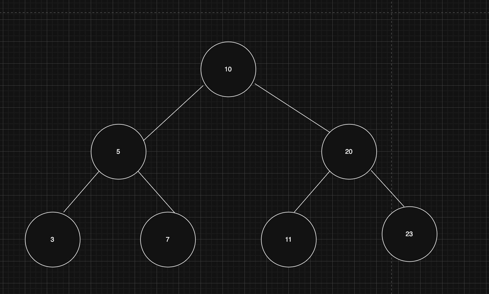
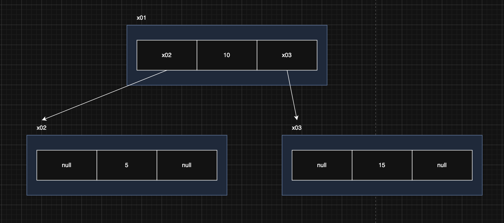
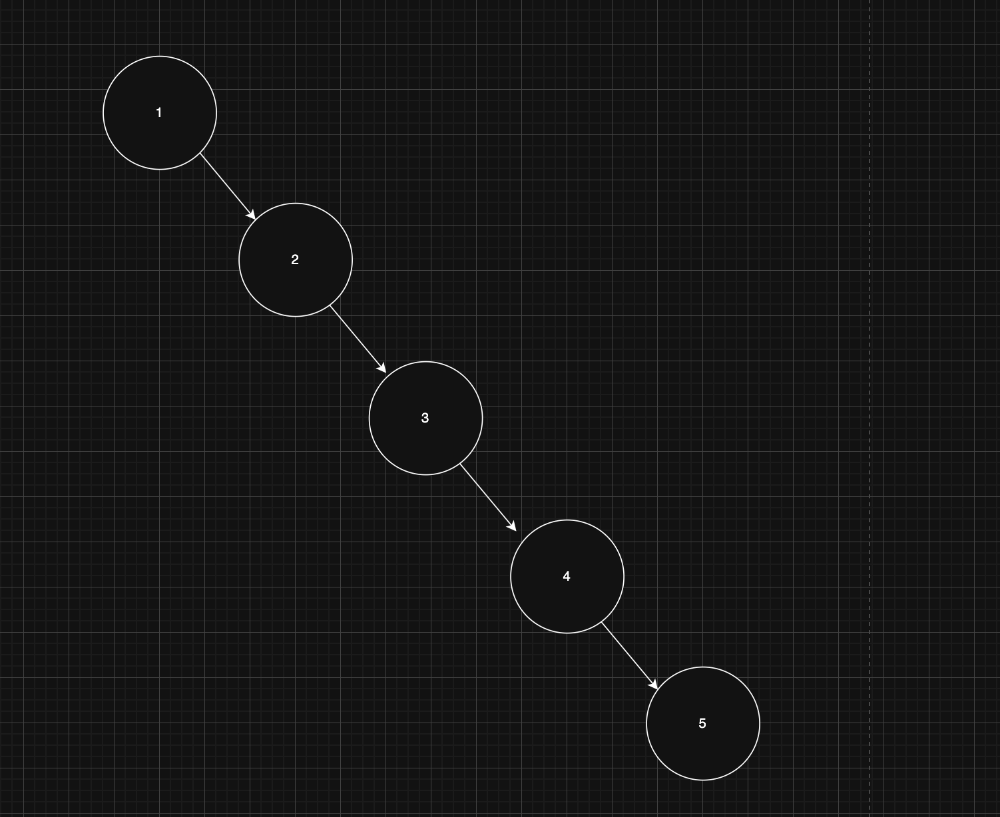

> 해당 블로그 글은 [영한님의 인프런 강의](https://inf.run/xexJb)를 바탕으로 쓰여진 글입니다.

## 자바가 제공하는 Set1 - HashSet, LinkedHashSet

### Set

셋은 중복을 허용하지 않고, 순서를 보장하지 않는 자료 구조이다.

### 컬렉션 프레임워크 - Set


#### Collection 인터페이스

`Collection` 인터페이스는 `java.util` 패키지의 컬렉션 프레임워크의 핵심 인터페이스 중 하나이다. 이 인터페이스는 자바에서 다양한 컬렉션, 즉 데이터 그룹을 다루기 위한 메서드를 정의한다. `Collection` 인터페이스는 `List`,`Set`,`Queue`와 같은 다양한 하위 인터페이스와 함께 사용되며, 이를 통해 데이터를 리스트, 세트, 큐 등의 형태로 관리할 수 있다.

#### Set 인터페이스

자바의 `Set` 인터페이스는 `java.util` 패키지의 컬렉션 프레임워크에 속하는 인터페이스 중 하나이다. `Set` 인터페이스는 중복을 허용하지 않는 유일한 요소의 집합을 나타낸다. 즉, 어떤 요소도 같은 `Set` 내에 두 번 이상 나타날 수 없다. `Set` 은 수학적 집합 개념을 구현한 것으로 순서를 보장하지 않으며, 특정 요소가 집합에 있는지 여부를 확인하는데 최적화되어 있다.

#### Set 인터페이스 주요 메서드

<table style="border-collapse: collapse; width: 100%; border: 2px solid #666;">
  <thead>
    <tr>
      <th style="border: 2px solid #666; padding: 8px; background-color: slateblue; color: white;">메서드</th>
      <th style="border: 2px solid #666; padding: 8px; background-color: slateblue; color: white;">설명</th>
    </tr>
  </thead>
  <tbody>
    <tr>
      <td style="border: 2px solid #666; padding: 8px; background-color: rgba(200, 200, 200, 0.2);">add(E e)</td>
      <td style="border: 2px solid #666; padding: 8px; background-color: rgba(200, 200, 200, 0.2);">지정된 요소를 세트에 추가한다(이미 존재하는 경우 추가하지 않음).</td>
    </tr>
    <tr>
      <td style="border: 2px solid #666; padding: 8px; background-color: rgba(200, 200, 200, 0.1);">addAll(Collection<? extends E> c)</td>
      <td style="border: 2px solid #666; padding: 8px; background-color: rgba(200, 200, 200, 0.1);">지정된 컬렉션의 모든 요소를 세트에 추가한다.</td>
    </tr>
    <tr>
      <td style="border: 2px solid #666; padding: 8px; background-color: rgba(200, 200, 200, 0.2);">contains(Object o)</td>
      <td style="border: 2px solid #666; padding: 8px; background-color: rgba(200, 200, 200, 0.2);">세트가 지정된 요소를 포함하고 있는지 여부를 반환한다.</td>
    </tr>
    <tr>
      <td style="border: 2px solid #666; padding: 8px; background-color: rgba(200, 200, 200, 0.1);">containsAll(Collection<?> c)</td>
      <td style="border: 2px solid #666; padding: 8px; background-color: rgba(200, 200, 200, 0.1);">세트가 지정된 컬렉션의 모든 요소를 포함하고 있는지 여부를 반환한다.</td>
    </tr>
    <tr>
      <td style="border: 2px solid #666; padding: 8px; background-color: rgba(200, 200, 200, 0.2);">remove(Object o)</td>
      <td style="border: 2px solid #666; padding: 8px; background-color: rgba(200, 200, 200, 0.2);">지정된 요소를 세트에서 제거한다.</td>
    </tr>
    <tr>
      <td style="border: 2px solid #666; padding: 8px; background-color: rgba(200, 200, 200, 0.1);">removeAll(Collection<?> c)</td>
      <td style="border: 2px solid #666; padding: 8px; background-color: rgba(200, 200, 200, 0.1);">지정된 컬렉션에 포함된 요소를 세트에서 모두 제거한다.</td>
    </tr>
    <tr>
      <td style="border: 2px solid #666; padding: 8px; background-color: rgba(200, 200, 200, 0.2);">retainAll(Collection<?> c)</td>
      <td style="border: 2px solid #666; padding: 8px; background-color: rgba(200, 200, 200, 0.2);">지정된 컬렉션에 포함된 요소만을 유지하고 나머지 요소는 세트에서 제거한다.</td>
    </tr>
    <tr>
      <td style="border: 2px solid #666; padding: 8px; background-color: rgba(200, 200, 200, 0.1);">clear()</td>
      <td style="border: 2px solid #666; padding: 8px; background-color: rgba(200, 200, 200, 0.1);">세트에서 모든 요소를 제거한다.</td>
    </tr>
    <tr>
      <td style="border: 2px solid #666; padding: 8px; background-color: rgba(200, 200, 200, 0.2);">size()</td>
      <td style="border: 2px solid #666; padding: 8px; background-color: rgba(200, 200, 200, 0.2);">세트에 있는 요소의 수를 반환한다.</td>
    </tr>
    <tr>
      <td style="border: 2px solid #666; padding: 8px; background-color: rgba(200, 200, 200, 0.1);">isEmpty()</td>
      <td style="border: 2px solid #666; padding: 8px; background-color: rgba(200, 200, 200, 0.1);">세트가 비어 있는지 여부를 반환한다.</td>
    </tr>
    <tr>
      <td style="border: 2px solid #666; padding: 8px; background-color: rgba(200, 200, 200, 0.2);">iterator()</td>
      <td style="border: 2px solid #666; padding: 8px; background-color: rgba(200, 200, 200, 0.2);">세트의 요소에 대한 반복자를 반환한다.</td>
    </tr>
    <tr>
      <td style="border: 2px solid #666; padding: 8px; background-color: rgba(200, 200, 200, 0.1);">toArray()</td>
      <td style="border: 2px solid #666; padding: 8px; background-color: rgba(200, 200, 200, 0.1);">세트의 모든 요소를 배열로 반환한다.</td>
    </tr>
    <tr>
      <td style="border: 2px solid #666; padding: 8px; background-color: rgba(200, 200, 200, 0.2);">toArray(T[] a)</td>
      <td style="border: 2px solid #666; padding: 8px; background-color: rgba(200, 200, 200, 0.2);">세트의 모든 요소를 지정된 배열로 반환한다.</td>
    </tr>
  </tbody>
</table>

### HashSet

- 구현: 해시 자료 구조를 사용해서 요소를 저장한다.
- 순서: 요소들은 특정한 순서 없이 저장된다. 즉, 요소를 추가한 순서를 보장하지 않는다.
- 시간 복잡도: `HashSet` 의 주요 연산(추가, 삭제, 검색)은 평균적으로 `O(1)` 시간 복잡도를 가진다.
- 용도: 데이터의 유일성만 중요하고, 순서가 중요하지 않은 경우에 적합하다.

### LinkedHashSet

- 구현: `LinkedHashSet`은 `HashSet`에 연결 리스트를 추가해서 요소들의 순서를 유지한다.
- 순서: 요소들은 추가된 순서대로 유지된다. 즉, 순서대로 조회 시 요소들이 추가된 순서대로 반환된다.
- 시간 복잡도: `LinkedHashSet`도 `HashSet`과 마찬가지로 주요 연산에 대해 평균 `O(1)` 시간 복잡도를 가진다.
- 용도: 데이터의 유일성과 함께 삽입 순서를 유지해야 할 때 적합하다.

> ✅ 참고
>
> 연결 링크를 유지하기 때문에 `HashSet`보다 무겁다.

`LinkedHashSet`은 `HashSet`에 추가 순서 유지를 한 상태로 실제 해시 인덱스 안에 배열 같은 자료구조가 있는게 아니라 `Node`가 존재하고 해당 `Node`안의 `item`안에 배열 같은 자료구조가 존재한다. 또한 `head`, `tail`과 같은 참조변수가 있어서 시작 노드와 끝 노드를 알 수 있다. 정확히 말하면 해시 인덱스 안에 양방향 연결리스트가 있다고 보면 좋을 것 같다. 그리고 데이터가 삽입될 때마다 노드를 생성하고 이전 노드와 연결을 하는 구조이다. 따라서 순서유지보장이 잘 되는 것이다.

## 자바가 제공하는 Set2 - TreeSet

### TreeSet

- 구현: `TreeSet` 은 이진 탐색 트리를 개선한 레드-블랙 트리를 내부에서 사용한다.
- 순서: 요소들은 정렬된 순서로 저장된다. 순서의 기준은 비교자(`Comparator`)로 변경할 수 있다.
- 시간 복잡도: 주요 연산들은 `O(log n)`의 시간 복잡도를 가진다. 따라서 `HashSet`보다는 느리다.
- 용도: 데이터들을 정렬된 순서로 유지하면서 집합의 특성을 유지해야 할 때 사용한다. 예를 들어, 범위 검색이나 정렬된 데이터가 필요한 경우에 유용하다. 참고로 입력된 순서가 아니라 데이터 값의 순서이다.

### 트리구조



- 트리는 부모 노드와 자식 노드로 구성된다.
- 가장 높은 부모를 루트라고 한다.
- 자식이 2개까지 올 수 있는 트리를 **이진 트리**라 한다.
- 노드의 왼쪽 자손은 더 작은 값을 가지고, 오른쪽 자손은 더 큰 값을 가지는 것을 **이진 탐색 트리**라 한다.

`TreeSet` 은 이진 탐색 트리를 개선한 레드-블랙 트리를 사용한다. 기본 개념은 비슷하므로 이진 탐색 트리의 원리를 알아보자.

### 트리구조 구현



트리 구조는 위와 같이 그림으로 표현할 수 있다. 루트 노드에 왼쪽 노드의 참조값과 오른쪽 노드의 참조값을 가지고 있는 형태이다. 우리가 앞서 배운 연결 리스트와 매우 유사한 구조이다.

이진 탐색 트리의 핵심은 데이터를 입력하는 시점에 정렬해서 보관한다는 점이다. 그리고 작은 값은 왼쪽에 큰 값은 오른쪽에 저장하면 된다.

### 이진 탐색 트리의 빅오 - O(log n)


한번 찾는 과정을 살펴보자. 숫자 11을 찾는다고 해보자.

- 먼저 루트 노드인 10과 숫자 11과 비교를 한다. 11이 더 크므로 오른쪽 노드로 내려간다.
- 숫자 11과 노드의 값 20을 비교한다. 11이 더 작으므로 왼쪽 노드로 내려간다.
- 숫자 11과 노드의 값 11을 비교한다. 같으므로 숫자 11을 찾을 수 있다.

7개의 데이터를 연산 결과 3번만에 찾을 수 있었다. 만약 이게 배열 리스트나 연결 리스트였다면 7개의 데이터를 다 확인했어야 할텐데 트리구조는 극명한 성능을 낸다.

이것을 수학으로 `log₂(n)`으로 표현한다. 여기서는 어려운 수학 공식이 핵심이 아니다. 로그는 쉽게 이야기해서 2로 몇번 나누어서 1에 도달할 수 있는지 계산하면 된다. 빅오 표기법에서 상수는 사용하지 않으므로 상수를 제외하고 단순히 `O(log n)`로 표현한다.

### 이진 탐색 트리와 성능

이진 탐색 트리의 검색, 삽입, 삭제의 평균 성능은 `O(log n)`의 성능이 나온다. 하지만 최악의 경우 `O(n)`의 성능이 나올 수 있다. 만약 데이터를 1, 2, 3, 4, 5를 순서대로 넣는다고 해보자. 그러면 트리구조는 아래와 같아 질 것이다.



이렇게 오른쪽으로 치우치게 되면, 결과적으로 5를 검색 했을 때 데이터의 수인 5만큼 검색을 해야 한다.

### 이진 탐색 트리 개선

이런 문제를 해결하기 위한 다양한 해결 방안이 있는데 트리의 균형이 너무 깨진 경우 동적으로 균형을 다시 맞추는것이다. 즉, 가운데 값으로 루트를 둔 다음에 트리 구조로 동적 변형을 하는 것이다. AVL 트리, 레드-블랙 트리 같은 균형을 맞추는 다양한 알고리즘이 존재한다. 자바의 `TreeSet`은 레드-블랙 트리를 사용해서 균형을 지속해서 유지한다. 따라서 최악의 경우에도 `O(log n)` 의 성능을 제공한다.

### 이진 탐색 트리 순회

이진 탐색 트리의 핵심은 입력 순서가 아니라, 데이터의 값을 기준으로 정렬해서 보관한다는 점이다. 따라서 정렬된 순서로 데이터를 차례로 조회할 수 있다. 데이터를 차례로 순회하려면 중위 순회라는 방법을 사용하면 된다. 왼쪽 서브트리를 방문한 다음, 현재 노드를 처리하고, 마지막으로 오른쪽 서브트리를 방문한다. 이 방식은 이진 탐색 트리의 특성상, 노드를 오름차순으로 방문한다.

## 자바가 제공하는 Set3 - 예제

자바가 제공해주는 `HashSet`, `LinkedHashSet`, `TreeSet`이 어떻게 데이터를 보관하는지 예제로 알아보자.

``` java
package collection.set.javaset;

import java.util.*;

public class JavaSetMain {
    public static void main(String[] args) {
        run(new HashSet<>());
        run(new LinkedHashSet<>());
        run(new TreeSet<>());
    }

    private static void run(Set<String> set) {
        System.out.println("set = " + set.getClass());

        set.add("C");
        set.add("B");
        set.add("A");
        set.add("1");
        set.add("2");

        Iterator<String> iterator = set.iterator();

        while (iterator.hasNext()) {
            System.out.print(iterator.next() + " ");
        }

        System.out.println();
    }
}
```

결과를 보면 알다 싶이 `HashSet`은 입력한 순서를 보장하진 않지만 제일 빠르다.(O(1)) `LinkedHashSet`은 입력한 순서를 보장하지만 `HashSet`보다 느리다.(O(1)) `TreeSet`은 정렬된 데이터를 보장한다. (O(log n))

> ✅ 참고
>
> `TreeSet` 을 사용할 때 데이터를 정렬하려면 크다, 작다라는 기준이 필요하다. 1, 2, 3이나 "A", "B", "C" 같은 기본 데이터는 크다 작다라는 기준이 명확하기 때문에 정렬할 수 있다. 하지만 우리가 직접 만든 객체는 크다 작다는 기준을 어떻게 알 수 있을까? 이런 기준을 제공하려면 `Comparable` , `Comparator` 인터페이스를 구현해야한다. 이 부분은 추후 포스팅을 해보겠다.

## 자바가 제공하는 Set4 - 최적화

자바의 `HashSet` 은 우리가 직접 구현한 내용과 거의 같지만 다음과 같은 최적화를 추가로 진행한다.

- 해시 기반 자료 구조를 사용하는 경우 통계적으로 입력한 데이터의 수가 배열의 크기를 75% 정도 넘어가면 해시 인덱스가 자주 충돌한다. 따라서 75%가 넘어가면 성능이 떨어지기 시작한다.
    - 해시 충돌로 같은 해시 인덱스에 들어간 데이터를 검색하려면 모두 탐색해야 한다. 따라서 성능이 O(n)으로 좋지 않다.
- 자바의 `HashSet` 은 데이터의 양이 배열 크기의 75%를 넘어가면 배열의 크기를 2배로 늘리고 2배 늘어난 크기를 기준으로 모든 요소에 해시 인덱스를 다시 적용한다. 이것을 전문용어로 재해싱(rehashing)이라고 한다.
    - 해시 인덱스를 다시 적용하는 시간이 걸리지만, 결과적으로 해시 충돌이 줄어든다.
- 자바 `HashSet` 의 기본 크기는 `16` 이다.

실무에서는 `Set` 이 필요한 경우 `HashSet` 을 가장 많이 사용한다. 그리고 입력 순서 유지, 값 정렬의 필요에 따라서 `LinkedHashSet`,`TreeSet`을 선택하면 된다.

> 잘못된 지식이 있을 경우 댓글로 남겨주시면 빠르게 반영하겠습니다!