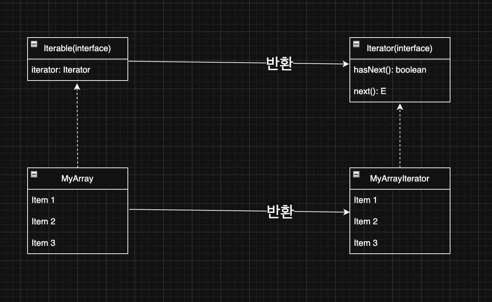
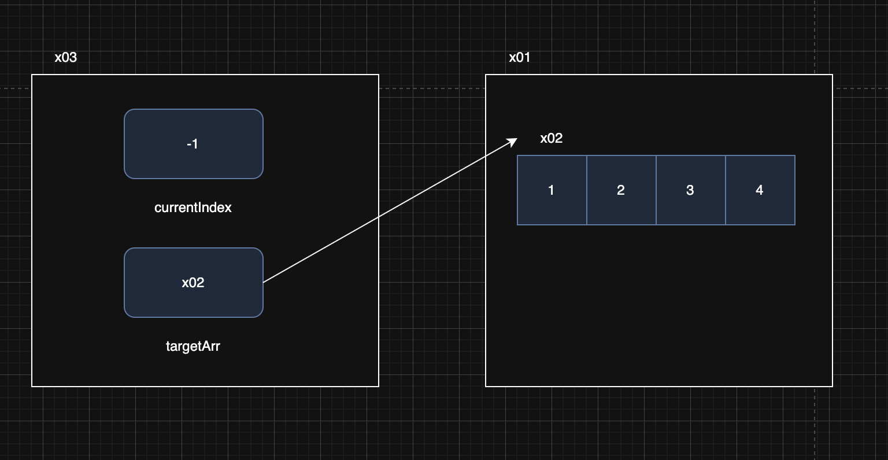
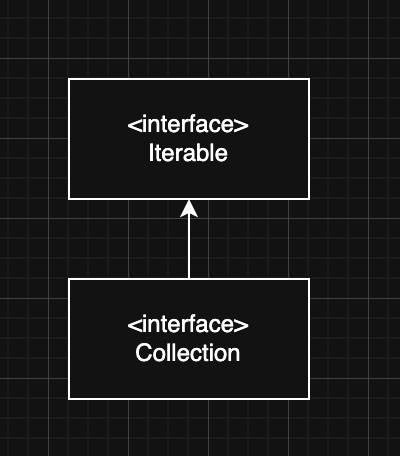
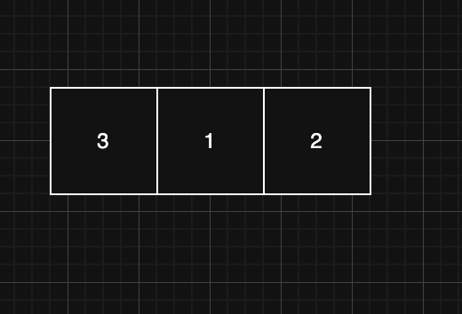
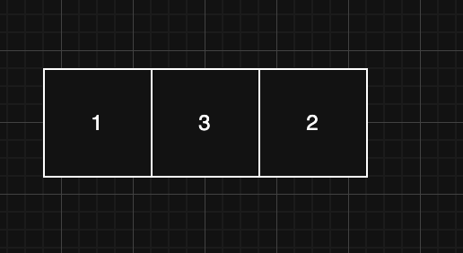
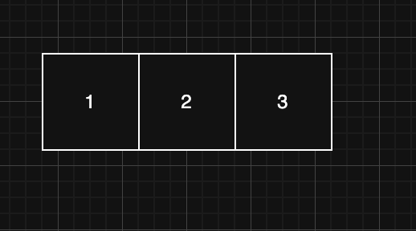

> 해당 블로그 글은 [영한님의 인프런 강의](https://inf.run/xexJb)를 바탕으로 쓰여진 글입니다.

## 순회1 - 직접 구현하는 Iterable, Iterator

순회라는 단어는 여러 곳을 돌아다닌다는 뜻이다. 자료 구조에 순회는 자료 구조에 들어있는 데이터를 차례대로 접근해서 처리하는 것을 순회라 한다. 그런데 다양한 자료 구조가 있고, 각각의 자료 구조마다 데이터를 접근하는 방법이 모두 다르다.

배열 리스트 같은 경우는 인덱스 0번부터 `size`까지 인덱스를 증가시키면서 순회를 진행해야 하고 연결 리스트는 `Node`의 `next`를 참조해서 해당 값이 null일때까지 순회를 진행해야 한다. 이처럼 여러 자료구조마다 순회방식이 매우 다양하고 복잡하다. 이것을 사용하는 사용자 입장에서 이런 내부 구조 로직을 알아야 한다는 것은 매우 불필요하다. 사용자는 내부 구조가 뭔지 모르게 블랙박스라고 생각하고 사용하기만 하면 된다.

자료 구조의 구현과 관계 없이 모든 자료 구조를 동일한 방법으로 순회할 수 있는 일관성 있는 방법이 있다면, 자료 구조를 사용하는 개발자 입장에서 매우 편리할 것이다. 자바는 이런 문제를 해결하기 위해 `Iterable`과 `Iterator` 인터페이스를 제공한다.

### Iterable, Iterator

`Iterable`은 반복 가능하다라는 의미이고 `Iterator`은 반복자라는 의미이다. 내부 구조를 살펴보자.

``` java
public interface Iterable<T> {
  Iterator<T> iterator();
}
```

`Iterable`은 `Iterator`만 반환한다. 즉, 반복 가능하니 반복자를 반환해야 한다라는 의미로 생각하면 쉬울 것 같다.

``` java
public interface Iterator<E> {
  boolean hasNext();
  E next();
}
```

`hasNext()`는 다음 요소가 있는지 판단하닌 기준 로직이고, `next()`는 다음 요소를 반환하는 로직이다. 이 두 인터페이스를 구현하면 순회를 할 수 있고, 사용자는 해당 인터페이스의 메서드만 사용하기만 하면 된다. 정말 간편해진 것 같다. 그럼 예제코드를 통해 한번 뼈저리게 느껴보자.

``` java
package collection.iterable;

import java.util.Iterator;

public class MyArrayIterator implements Iterator<Integer> {

    private int currentIndex = -1;

    private int[] targetArr;

    public MyArrayIterator(int[] targetArr) {
        this.targetArr = targetArr;
    }

    @Override
    public boolean hasNext() {
        return currentIndex < targetArr.length - 1;
    }

    @Override
    public Integer next() {
        return targetArr[++currentIndex];
    }
}
```

해당 클래스는 배열의 반복자를 커스텀하게 개발한 것이다. 처음 `currentIndex`의 값을 -1로 설정하고 외부로 주입 받은 배열의 참조값을 통해 배열에 접근하여 `hasNext()`메서드를 구현한다. 그리고 `next()` 메서드를 통해 인덱스를 증가시켜 첫 배열의 인덱스인 0을 가리키게 한다. 이제 해당 반복자를 `Iterable`을 구현한 클래스에 반환시켜야 할 것이다.

> ✅ 참고
>
> Iterator` 는 단독으로 사용할 수 없다. 또한 해당 구현체도 단독으로 사용 불가다.

``` java
package collection.iterable;

import java.util.Iterator;

public class MyArray implements Iterable<Integer> {

    private int[] numbers;

    public MyArray(int[] numbers) {
        this.numbers = numbers;
    }

    @Override
    public Iterator<Integer> iterator() {
        return new MyArrayIterator(numbers);
    }
}
```

이제 사용하는 코드를 확인해보자.

``` java
package collection.iterable;

import java.util.Iterator;

public class MyArrayMain {
    public static void main(String[] args) {
        MyArray myArray = new MyArray(new int[]{1, 2, 3, 4});
        Iterator<Integer> iterator = myArray.iterator();

        System.out.println("iterator 사용");

        while (iterator.hasNext()) {
            Integer value = iterator.next();
            System.out.println("value = " + value);
        }
    }
}
```

그럼 이제 클래스 구조도를 살펴보자.



- `MyArray`는 `Iterable` 인터페이스를 구현한다. 따라서 `MyArray`는 반복할 수 있다는 의미가 된다.
- `Iterable` 인터페이스를 구현하면 `iterator()` 메서드를 구현해야 한다. 이 메서드는 `Iterator` 인터페이스를 구현한 반복자를 반환한다. 여기서는 `MyArrayIterator`를 생성해서 반환했다.

그럼 이제 메모리 구조도를 그림을 통해 살펴보자.



- `MyArrayIterator`의 인스턴스를 생성할 때 순회할 대상을 지정해야 한다. 여기서는 `MyArray`의 배열을 지정했다.
- `MyArrayIterator` 인스턴스는 내부에서 `MyArray`의 배열을 참조한다.
- 이제 `MyArrayIterator`를 통해 `MyArray`가 가진 내부 데이터를 순회할 수 있다.

## 순회2 - 향상된 for문

`Iterable`,`Iterator`를 사용하면 또 하나의 큰 장점을 얻을 수 있다. 바로 향상된 for문을 사용이 가능하다. 즉, 배열이거나 `Iterable`을 구현한 구현체에 한해서 향상된 for문을 사용이 가능하다. 즉, 기존의 아래의 코드를

``` java
while (iterator.hasNext()) {
  Integer value = iterator.next();
  System.out.println("value = " + value);
}
```

아래의 코드로 변경이 가능한 것이다.

``` java
for (int value : myArray) {
  System.out.println("value = " + value);
}
```

훨씬 간단해졌다. 사실은 자바 컴파일러가 위의 향상된 for문을 기존에 작성한 코드로 컴파일 타임에 변경을 해주는 거라 이해를 하면 된다. 그래서 전체 배열 순회를 하는 경우 향상된 for문을 실무에서 많이 이용한다.

## 순회3 - 자바가 제공하는 Iterable, Iterator



- 자바 컬렉션 프레임워크는 배열 리스트, 연결 리스트, 해시 셋, 연결 해시 셋, 트리 셋 등등 다양한 자료 구조를 제공한다.
- 자바는 컬렉션 프레임워크를 사용하는 개발자가 편리하고 일관된 방법으로 자료 구조를 순회할 수 있도록 `Iterable` 인터페이스를 제공하고, 이미 각각의 구현체에 맞는 `Iterator`도 다 구현해두었다.
- 자바 `Collection` 인터페이스의 상위에 `Iterable`이 있다는 것은 모든 컬렉션을 `Iterable`과 `Iterator` 를 사용해서 순회할 수 있다는 뜻이다.
- `Map` 의 경우 `Key` 뿐만 아니라 `Value` 까지 있기 때문에 바로 순회를 할 수는 없다. 대신에 `Key` 나 `Value` 를 정해서 순회할 수 있는데, `keySet()`, `values()`를 호출하면 `Set`, `Collection`을 반환하기 때문에 `Key`나 `Value`를 정해서 순회할 수 있다. 물론 `Entry`를 `Set`구조로 반환하는 `entrySet()`도 순회가 가능하다.

예제 코드를 통해 살펴보자.

``` java
package collection.iterable;

import java.util.*;

public class JavaIterableMain {
    public static void main(String[] args) {
        List<Integer> list = new ArrayList<>();
        list.add(1);
        list.add(2);
        list.add(3);

        Set<Integer> set = new HashSet<>();
        set.add(1);
        set.add(2);
        set.add(3);

        printAll(list.iterator());
        printAll(set.iterator());

        forEach(list);
        forEach(set);
    }

    private static void printAll(Iterator<Integer> iterator) {
        System.out.println("iterator = " + iterator.getClass());
        while (iterator.hasNext()) {
            System.out.println(iterator.next());
        }
    }

    private static void forEach(Iterable<Integer> iterable) {
        System.out.println("iterable = " + iterable.getClass());
        for (Integer i : iterable) {
            System.out.println(i);
        }
    }
}
```

`Iterable`과 `Iterator`를 통해 사용을 하니 다형성이 정말 잘 사용된 것을 확인할 수 있다.

> ✅ 참고
>
> 실행결과를 보면 `java.util.ArrayList$Itr`와 `java.util.HashMap$KeyIterator`이 나올 것이다. `$`표시는 내부 클래스라는 의미이다. 또한 `HashSet`을 사용하는데 클래스 이름이 `HashMap`이 나오는 이유는 바로 `HashSet`자체가 `HashMap`을 가져다 쓰기 때문이다.

> ✅ 참고
>
> Iterator (반복자) 디자인 패턴은 객체 지향 프로그래밍에서 컬렉션의 요소들을 순회할 때 사용되는 디자인 패턴이다. 이 패턴은 컬렉션의 내부 표현 방식을 노출시키지 않으면서도 그 안의 각 요소에 순차적으로 접근할 수 있게 해준다. Iterator 패턴은 컬렉션의 구현과는 독립적으로 요소들을 탐색할 수 있는 방법을 제공하며, 이로 인해 코드의 복잡성을 줄이고 재사용성을 높일 수 있다.

## 정렬1 - Comparable, Comparator

예제 코드를 통하여 데이터를 정렬하는 방법을 알아보자.

``` java
package collection.compare;

import java.util.Arrays;

public class SortMain1 {
    public static void main(String[] args) {
        Integer[] array = {3, 2, 1};
        System.out.println(Arrays.toString(array));

        System.out.println("기본 정렬 후");
        Arrays.sort(array);
        System.out.println(Arrays.toString(array));
    }
}
```

`Arrays.sort()` 메서드를 사용하면 배열의 값을 비교하여 오름차순으로 정렬을 해준다. 비교 순서는 간단히 보면 아래와 같다.



위와 같은 배열이 있는데 첫번째 요소와 다음 요소를 비교를 진행한다. 즉, 3과 1을 비교해서 3이 더 크므로 서로 위치를 교환한다.



이제 다음 인덱스인 3과 2를 비교한다. 3이 더 크므로 두 위치를 교환한다.



이제 다시 처음 인덱스로 돌아와서 마지막 인덱스와 비교를 한다. 1이 더 작으므로 위치는 그대로 유지한다.

이런식으로 `Arrays.sort()` 메서드를 이용하면 정렬을 진행한다.

> ✅ 참고
>
> 실제로는 정렬 성능을 높이기 위한 다양한 정렬 알고리즘이 존재한다. 자바는 초기에는 퀵소트를 사용했다가 지금은 데이터가 작을 때(32개 이하)는 듀얼 피벗 퀵소트(Dual-Pivot QuickSort)를 사용하고, 데이터가 많을 때는 팀소트(TimSort)를 사용한다. 이런 알고리즘은 평균 O(n log n)의 성능을 제공한다.

### 비교자 - Comparator

그런데 만약 오름차순 정렬이 아닌 내림차순 정렬을 하려면 어떻게 해야할까? 자바에서 제공해주는 `Comparator`을 구현하고 `compare()` 메서드를 오버라이딩해서 정의하면 된다.

``` java
package collection.compare;

import java.util.Arrays;
import java.util.Comparator;

public class SortMain2 {
    public static void main(String[] args) {
        Integer[] array = {3, 2, 1};
        System.out.println(Arrays.toString(array));

        System.out.println("Comparator 비교");

        Arrays.sort(array, new AscComparator());
        System.out.println("AscComparator: " + Arrays.toString(array));

        Arrays.sort(array, new DescComparator());
        System.out.println("DescComparator: " + Arrays.toString(array));

        Arrays.sort(array, new AscComparator().reversed());
        System.out.println("AscComparator.reversed: " + Arrays.toString(array));
    }

    static class AscComparator implements Comparator<Integer> {

        @Override
        public int compare(Integer o1, Integer o2) {
            System.out.println("o1 = " + o1 + " o2 = " + o2);
            return (o1 < o2) ? -1 : ((o1 == o2) ? 0 : 1);
        }
    }

    static class DescComparator implements Comparator<Integer> {

        @Override
        public int compare(Integer o1, Integer o2) {
            System.out.println("o1 = " + o1 + " o2 = " + o2);
            return ((o1 < o2) ? -1 : ((o1 == o2) ? 0 : 1)) * -1;
        }
    }
}
```

`Arrays.sort()` 메서드에 첫번째 인자로 배열과 두번째 인자로 비교자를 넣을 수 있다. 비교자는 `Comparator`를 구현하면 된다. 그러면 자동으로 `compare()` 메서드를 호출한다.

> ✅ 참고
>
> 위의 코드에서는 오름차순 비교자, 내림차순 비교자를 만들었지만 각각 `reversed()`라는 메서드를 제공해준다. 해당 메서드를 이용하면 오름차순은 내림차순으로 내림차순은 오름차순으로 변경된다.

## 정렬2 - Comparable, Comparator

자바가 기본으로 제공하는 `Integer` , `String` 같은 객체를 제외하고 직접 만든 객체를 정렬하려면 어떻게 해야 할까? 내가 만든 객체이기 때문에 정렬을 할 때 내가 만든 두 객체 중에 어떤 객체가 더 큰지 알려줄 방법이 있어야 한다. 이때는 `Comparable` 인터페이스를 구현하면 된다. 이 인터페이스는 이름 그대로 비교 가능한, 비교할 수 있는 이라는 뜻으로, 객체에 비교 기능을 추가해 준다.

예제 코드를 살펴보자.

``` java
package collection.compare;

public class MyUser implements Comparable<MyUser> {

    private String id;

    private int age;

    public MyUser(String id, int age) {
        this.id = id;
        this.age = age;
    }

    public String getId() {
        return id;
    }

    public int getAge() {
        return age;
    }

    @Override
    public int compareTo(MyUser o) {
        return this.age < o.age ? -1 : (this.age == o.age ? 0 : 1);
    }

    @Override
    public String toString() {
        return "MyUser{" +
                "id='" + id + '\'' +
                ", age=" + age +
                '}';
    }
}
```

해당 코드는 `Comparable` 인터페이스를 구현한 것을 알 수 있다. 그러면 `compareTo()`메서드를 재정의하여야 하는데 여기서 정렬 기준을 작성하면 된다. 이제 이런 객체를 `Arrays.sort()` 메서드에 전달해주면 해당 메서드가 객체의 `Comparable`이 구현되어 있는지 보고 구현이 되어 있다면 정렬을 진행해준다.

``` java
MyUser myUser1 = new MyUser("a", 30);
MyUser myUser2 = new MyUser("b", 20);
MyUser myUser3 = new MyUser("c", 10);

MyUser[] array = {myUser1, myUser2, myUser3};
System.out.println("기본 데이터");
System.out.println(Arrays.toString(array));
```

그런데 만약 다른 기준으로 정렬을 하고 싶다면 이전에 살펴본 것처럼 `Comparator`를 구현한 비교자 클래스를 만들고 두번째 인자로 넣어주면 된다. 예제코드에서는 id 비교자를 만들어서 해보았다.

``` java
package collection.compare;

import java.util.Comparator;

public class IdComparator implements Comparator<MyUser> {

    @Override
    public int compare(MyUser o1, MyUser o2) {
        return o1.getId().compareTo(o2.getId());
    }
}
```

위와 같이 비교자 클래스를 만들고 아래와 같이 만들면 된다.

``` java
package collection.compare;

import java.util.Arrays;

public class SortMain3 {
    public static void main(String[] args) {
        MyUser myUser1 = new MyUser("a", 30);
        MyUser myUser2 = new MyUser("b", 20);
        MyUser myUser3 = new MyUser("c", 10);

        MyUser[] array = {myUser1, myUser2, myUser3};
        System.out.println("기본 데이터");
        System.out.println(Arrays.toString(array));

        System.out.println("Comparable 기본 정렬");
        Arrays.sort(array);
        System.out.println(Arrays.toString(array));

        System.out.println("IdComparator 정렬");
        Arrays.sort(array, new IdComparator());
        System.out.println(Arrays.toString(array));

        System.out.println("IdComparator().reversed() 정렬");
        Arrays.sort(array, new IdComparator().reversed());
        System.out.println(Arrays.toString(array));
    }
}
```

> ⚠️ 주의
>
> 만약 `Comparable`도 구현하지 않고, `Comparator`도 제공하지 않으면 `ClassCastException`이라는 런타임 예외가 발생하니 주의해야 한다.

### 정리

객체의 기본 정렬 방법은 객체에 `Comparable`를 구현해서 정의한다. 이렇게 하면 객체는 이름 그대로 비교할 수 있는 객체가 되고 기본 정렬 방법을 가진다. 그런데 기본 정렬 외에 다른 정렬 방법을 사용해야 하는 경우 비교자를 별도로 구현해서 정렬 메서드에 전달하면 된다. 이 경우 전달한 `Comparator`가 항상 우선권을 가진다. 자바가 제공하는 `Integer`, `String`같은 기본 객체들은 대부분 `Comparable`을 구현해 두었다.

## 정렬3 - Comparable, Comparator

정렬은 배열 뿐만 아니라 순서가 있는 `List` 같은 자료 구조에도 사용할 수 있다.

``` java
package collection.compare;

import java.util.LinkedList;
import java.util.List;

public class SortMain4 {
    public static void main(String[] args) {
        MyUser myUser1 = new MyUser("a", 30);
        MyUser myUser2 = new MyUser("b", 20);
        MyUser myUser3 = new MyUser("c", 10);

        List<MyUser> list = new LinkedList<>();
        list.add(myUser1);
        list.add(myUser2);
        list.add(myUser3);
        System.out.println("기본 데이터");
        System.out.println(list);

        System.out.println("Comparable 기본 정렬");
        list.sort(null);
//        Collections.sort(list);
        System.out.println(list);

        System.out.println("IdComparator 정렬");
        list.sort(new IdComparator());
//        Collections.sort(list, new IdComparator());
        System.out.println(list);
    }
}
```

위의 코드에서 유의하게 봐야할 메서드들이 있다.

- list.sort()
  - 위의 코드는 해당 배열의 아이템이 구현한 `Comparable`을 가지고 기본 정렬을 진행한다. 단, 파라미터로 `null`을 넣어줘야 한다.
  - 만약 색다른 비교를 하고 싶다면 `Comparator`을 구현한 비교자 클래스를 넣어주면 그거대로 비교하여 정렬한다.
  - 자바8부터 사용 가능하다.
- Collections.sort()
  - 해당 메서드에 파라미터로 자료구조를 넣어주면 자료구조 안에 있는 아이템이 구현한 `Comparable`을 가지고 비교한다.
  - 두번째 파라미터로 비교자를 넣을 수 있는데 `Comparator`을 구현한 비교자 클래스를 넣어주면 그거대로 비교하여 정렬한다.
  - 하지만 이 방식보다는 객체 스스로 정렬 메서드를 가지고 있는 `list.sort()` 사용을 더 권장한다.

다음은 트리구조의 비교를 해보자. 트리구조는 비교하면서 정렬을 하기 때문에 비교가 반드시 필요하다.

``` java
package collection.compare;

import java.util.TreeSet;

public class SortMain5 {
    public static void main(String[] args) {
        MyUser myUser1 = new MyUser("a", 30);
        MyUser myUser2 = new MyUser("b", 20);
        MyUser myUser3 = new MyUser("c", 10);

        TreeSet<MyUser> treeSet1 = new TreeSet<>();
        treeSet1.add(myUser1);
        treeSet1.add(myUser2);
        treeSet1.add(myUser3);
        System.out.println("Comparable 기본 정렬");
        System.out.println(treeSet1);

        TreeSet<MyUser> treeSet2 = new TreeSet<>(new IdComparator());
        treeSet2.add(myUser1);
        treeSet2.add(myUser2);
        treeSet2.add(myUser3);
        System.out.println("IdComparator 정렬");
        System.out.println(treeSet2);
    }
}
```

이진 탐색 트리는 데이터를 저장할 때 왼쪽 노드에 저장해야 할 지, 오른쪽 노드에 저장해야 할 지 비교가 필요하다. 따라서 `TreeSet`, `TreeMap`은 `Comparable` 또는 `Comparator` 가 필수이다.

위의 코드를 보면 알겠지만 `TreeSet`을 생성할 때 별도의 비교자를 제공하지 않으면 객체가 구현한 `Comparable`을 사용한다. 또한 `TreeSet`을 생성할 때 별도의 비교자를 제공하면 `Comparable` 대신 비교자(`Comparator`)를 사용해서 정렬한다.

### 정리

자바의 정렬 알고리즘은 매우 복잡하고, 또 거의 완성형에 가깝다. 자바는 **개발자가 복잡한 정렬 알고리즘은 신경 쓰지 않으면서** 정렬의 기준만 간단히 변경할 수 있도록, 정렬의 기준을 `Comparable`, `Comparator` 인터페이스를 통해 추상화해 두었다. 객체의 정렬이 필요한 경우 `Comparable`을 통해 기본 자연 순서를 제공하자. 자연 순서 외에 다른 정렬 기준이 추가로 필요하면 `Comparator`를 제공하자.

## 컬렉션 유틸

컬렉션을 편리하게 다룰 수 있는 다양한 기능을 알아보자.

### Collections 관련 정렬 메세드

- `max` : 정렬 기준으로 최대 값을 찾아서 반환한다.
- `min` : 정렬 기준으로 최소 값을 찾아서 반환한다.
- `shuffle` : 컬렉션을 랜덤하게 섞는다.
- `sort` : 정렬 기준으로 컬렉션을 정렬한다.
- `reverse` : 정렬 기준의 반대로 컬렉션을 정렬한다. (컬렉션에 들어있는 결과를 반대로 정렬한다.)

### 편리한 컬렉션 생성

- `List.of()`를 사용하면 컬렉션을 편리하게 생성할 수 있다. 단 이때는 가변이 아니라 불변 컬렉션이 생성된다.
  - `List`, `Set`, `Map` 모두 `of()` 메서드를 지원한다.
- 불변 컬렉션은 변경할 수 없다. 변경 메서드를 호출하면 `UnsupportedOperationException` 예외가 발생한다.

### 불변 컬렉션과 가변 컬렉션 전환

- 불변 리스트를 가변 리스트로 전환하려면 `new ArrayList<>()`를 사용하면 된다.
- 가변 리스트를 불변 리스트로 전환하려면 `Collections.unmodifiableList()`를 사용하면 된다.
  - 물론 다양한 `unmodifiableXxx()`가 존재한다.

### 빈 리스트 생성

- 빈 가변 리스트는 원하는 컬렉션의 구현체를 직접 생성하면 된다.
- 빈 불변 리스트는 2가지 생성 방법이 있다.
  - `Collections.emptyList()` : 자바5부터 제공되는 기능이다.
  - `List.of()` : 자바9부터 제공되는 최신 기능이다. 자바9이상이라면 해당 메서드를 사용하는것을 적극 권장한다.

### Arrays.asList()

`Arrays.asList` 메서드를 사용해도 다음과 같이 리스트를 생성할 수 있다. 참고로 이 메서드는 자바 1.2부터 존재했다. 자바 9를 사용한다면 `List.of()` 를 권장한다.

- `Arrays.asList()`로 생성된 리스트는 **고정된 크기를 가지지만, 요소들은 변경할 수 있다.** 즉, 리스트의 길이는 변경할 수 없지만, 기존 위치에 있는 요소들을 다른 요소로 교체할 수 있다.
  - `set()`을 통해 요소를 변경할 수 있다.
  - `add()`, `remove()` 같은 메서드를 호출하면 예외가 발생한다. 크기를 변경할 수 없다.

정리하면 일반적으로 `List.of()` 를 사용하는 것을 권장한다. 다음과 같은 경우 `Arrays.asList()` 를 선택할 수 있다. 즉, 리스트의 내부 요소를 변경하려면 `Arrays.asList()` 메서드를 사용해야 하고 그게 아니라면 무조건 `List.of()`를 사용하자.

> ✅ 참고
>
> `Arrays.asList()`와 `List.of()`의 차이는 구동방식에도 차이가 있다. 일단 각 메서드는 파라미터로 배열을 받을 수 있는데 `Arrays.asList()`는 해당 배열의 참조값을 복사해서 사용하고 `List.of()`는 입력받은 배열을 가지고 새 배열을 만들어서 사용한다. 그래서 `Arrays.asList()`로 배열을 만들고 배열의 요소 값을 변경하면 기존 배열의 값도 변경되는 사이드 이펙트가 발생하니 주의하자!

### 멀티스레드 동기화

- `Collections.synchronizedList`를 사용하면 일반 리스트를 멀티스레드 상황에서 동기화 문제가 발생하지 않는 안전한 리스트로 만들 수 있다.
- 동기화 작업으로 인해 일반 리스트보다 성능은 더 느리다.

## 컬렉션 프레임워크 전체 정리

### 자바 컬렉션 프레임워크 주요 기능

자바 컬렉션 프레임워크는 데이터 그룹을 저장하고 처리하기 위한 통합 아키텍처를 제공한다. 이 프레임워크는 인터페이스, 구현, 알고리즘으로 구성되어 있으며, 다양한 타입의 컬렉션을 효율적으로 처리할 수 있게 해준다. 여기서 컬렉션이란 객체의 그룹이나 집합을 의미한다.

### Collection 인터페이스 필요성

- 일관성: 모든 컬렉션 타입들이 `Collection` 인터페이스를 구현함으로써, 모든 컬렉션들이 기본적인 동작을 공유한다는 것을 보장한다. 이는 개발자가 다양한 타입의 컬렉션을 다룰 때 일관된 방식으로 접근할 수 있게 해준다.
- 재사용성: `Collection` 인터페이스에 정의된 메서드들은 다양한 컬렉션 타입들에 공통으로 적용된다. 이는 코드의 재사용성을 높이고, 유지보수를 용이하게 한다.
- 확장성: 새로운 컬렉션 타입을 만들 때 `Collection` 인터페이스를 구현함으로써, 기존에 정의된 알고리즘과 도구를 사용할 수 있게 된다. 이는 프레임워크의 확장성을 향상시킨다.
- 다형성: `Collection` 인터페이스를 사용함으로써, 다양한 컬렉션 타입들을 같은 타입으로 다룰 수 있다. 이는 다형성을 활용해서 유연한 코드를 작성할 수 있게 해준다.

### Collection 주요 메서드

- `add(E e)` : 컬렉션에 요소를 추가한다.
- `remove(Object o)` : 주어진 객체를 컬렉션에서 제거한다.
- `size()` : 컬렉션에 포함된 요소의 수를 반환한다.
- `isEmpty()` : 컬렉션이 비어 있는지 확인한다.
- `contains(Object o)` : 컬렉션이 특정 요소를 포함하고 있는지 확인한다.
- `iterator()` : 컬렉션의 요소에 접근하기 위한 반복자를 반환한다.
- `clear()` : 컬렉션의 모든 요소를 제거한다.

`Collection`은 `Map`을 제외한 모든 컬렉션 타입의 부모이다. 따라서 모든 컬렉션을 받아서 유연하게 처리할 수 있다. 대표적으로 컬렉션 인터페이스는 `iterator`를 제공한다. 따라서 데이터를 단순히 순회할 목적이라면 `Collection`을 사용하면 모든 컬렉션 타입의 데이터를 순회할 수 있다.

### 인터페이스

- Collection: 단일 루트 인터페이스로, 모든 컬렉션 클래스가 이 인터페이스를 상속받는다.
  - `List`, `Set`, `Queue` 등의 인터페이스가 여기에 포함된다.
- List: 순서가 있는 컬렉션을 나타내며, 중복 요소를 허용한다. 인덱스를 통해 요소에 접근할 수 있다.
  - ex. `ArrayList`, `LinkedList`...
- Set: 중복 요소를 허용하지 않는 컬렉션을 나타낸다. 특정 위치가 없기 때문에 인덱스를 통해 요소에 접근할 수 없다.
  - ex. `HashSet`, `LinkedHashSet`, `TreeSet`...
- Queue: 요소가 처리되기 전에 보관되는 컬렉션을 나타낸다.
  - ex. `ArrayDeque`, `LinkedList`, `PriorityQueue`...
- Map: 키와 값 쌍으로 요소를 저장하는 객체이다. `Map` 은 `Collection` 인터페이스를 상속받지 않는다.
  - ex. `HashMap`, `LinkedHashMap`, `TreeMap`...

### 구현

- List: `ArrayList`는 내부적으로 배열을 사용하며, `LinkedList`는 연결 리스트를 사용한다.
- Set: `HashSet`은 해시 테이블을, `LinkedHashSet`은 해시 테이블과 연결 리스트를, `TreeSet`은 레드-블랙 트리를 사용한다.
- Map: `HashMap`은 해시 테이블을, `LinkedHashMap`은 해시 테이블과 연결 리스트를, `TreeMap`은 레드-블랙 트리를 사용한다.
- Queue: `LinkedList`는 연결 리스트를 사용한다. `ArrayDeque`는 배열 기반의 원형 큐를 사용한다. 대부분의 경우 `ArrayDeque`가 빠르다.

### 알고리즘

`Collections`와 `Arrays`를 통해 정렬, 검색, 순환등 다양한 알고리즘을 이용한 유틸을 제공한다.

### 선택 가이드

- **순서가 중요하고 중복이 허용되는 경우**: `List` 인터페이스를 사용하자. `ArrayList`가 일반적인 선택이지만, 추가/삭제 작업이 앞쪽에서 빈번한 경우에는 `LinkedList`가 성능상 더 좋은 선택이다.
- **중복을 허용하지 않고 순서가 중요하지 않은 경우**: `HashSet`을 사용하자. 순서를 유지해야 하면 `LinkedHashSet`을, 정렬된 순서가 필요하면 `TreeSet`을 사용하자
- **요소를 키-값 쌍으로 저장하려는 경우**: `Map` 인터페이스를 사용하자. 순서가 중요하지 않다면 `HashMap`을, 순서를 유지해야 한다면 `LinkedHashMap`을, 정렬된 순서가 필요하면 `TreeMap`을 사용하자
- **요소를 처리하기 전에 보관해야 하는 경우**: `Queue`,`Deque` 인터페이스를 사용하자. 스택, 큐 구조 모두 `ArrayDeque`를 사용하는 것이 가장 빠르다. 만약 우선순위에 따라 요소를 처리해야 한다면 `PriorityQueue`를 고려하자.

> ✅ 참고
>
> `PriorityQueue`는 `Queue`에서 우선순위를 부여할 수 있는 기능이 있다.

### 실무 선택 가이드

- `List`의 경우 대부분 `ArrayList`를 사용한다. 물론, 앞쪽에 삭제,추가가 빈번히 발생하면 `LinkedList`를 고려하자.
- `Set`의 경우 대부분 `HashSet`을 사용한다.
- `Map`의 경우 대부분 `HashMap`을 사용한다.
- `Queue`의 경우 대부분 `ArrayDeque`를 사용한다.

> 잘못된 지식이 있을 경우 댓글로 남겨주시면 빠르게 반영하겠습니다!