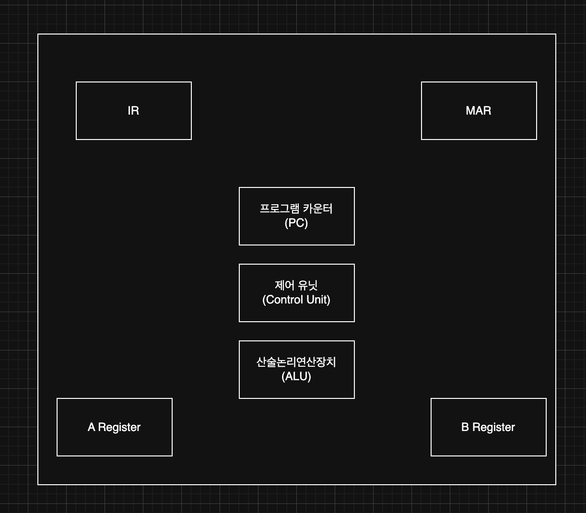

> 해당 블로그 글은 [감자님의 인프런 강의](https://inf.run/dQpKa)를 바탕으로 쓰여진 글입니다.

## 중앙 처리 장치(CPU)

현대 컴퓨터는 폰 노이만 구조를 따른다. 이 구조는 중앙 처리 장치, 메모리, 입출력 장치가 서로 독립적으로 분리된 형태를 가진다.

그러면 먼저 중앙 처리 장치인 CPU에 대해 학습해보자.

CPU는 실제 계산을 담당하는 산술 논리연산장치, 동작을 제어하는 제어 장치, 다음 실행 할 명령어의 주소를 가지고 있는 프로그램 카운터 그리고 여러 레지스터로 구성되어 있다. 레지스터는 컴퓨터의 가장 작은 단위의 메모리로 저장용량은 작지만 속도가 매우 빠르다. 산술 논리연산장치는 산술 연산과 논리 연산을 수행하는 여러 회로로 구성되어 있다. 이 장치는 회로가 비교적 단순하여 우리가 먼저 만들어 볼 구성요소이다. 반면 제어장치는 명령을 해석하고 실행하도록 하는 장치로 CPU내에서 가장 복잡한 부분이다.

> 제어 장치는 명령어를 해석하고 실행시키는 장치로 산술 논리 연산장치, 프로그램 카운터, 레지스터등을 제어한다.

이러한 복잡성 때문에 우리는 제어 장치를 여러 모듈로 구성할 예정이다.

산술 논리 연산 장치와 제어장치로 연산을 수행하려면 데이터를 일시적으로 저장할 임시 메모리가 필요하다. 이를 위해 CPU 내부에 레지스터라는 작은 임시 메모리가 있는데 시스템의 복잡성에 따라 개수가 천차만별이다. 보통은 수백개에서 수천개까지 존재한다. 우리는 기본적인 연산을 수행할때 꼭 필요한 레지스터 4개정도만 구현할 예정이다.

각 장치들은 작은 전선들을 통해 데이터를 전달하는데 이러한 데이터가 이동하는 통로를 버스라고 부른다. 

우리가 만든 프로그램은 명령어와 데이터로 구성된다. 프로그램을 실행하면 메모리에 적재되고 중앙처리 내에 있는 제어장치가 프로그램의 명령어와 필요한 데이터를 읽어와서 적잘한 연산을 반복하며 프로그램을 실행한다.

## 메모리

다음으로 메모리에 대해 학습해보자. 우리가 만든 프로그램은 폰 노이만 구조에 따라 우리가 작성한 코드와 데이터는 모두 메모리에 올라가서 실행된다. 이를 프로그램 내장 방식이라고 하며 이 덕분에 프로그램이 변경될 때마다 하드웨어의 변경이 없어지게 된다.

메모리는 메인 메모리와 보조 메모리로 나눠진다. 일단 먼저 메인 메모리에 대해 살펴보자.

메인 메모리는 RAM과 ROM으로 구성된다. RAM은 어떤 데이터에 접근하더라도 접근 시간이 동일한 메모리를 일컫는다. 반면에 자기 테이프나 하드 디스크처럼 데이터에 따라 접근 속도가 달라지는 보조 메모리도 존재한다. 램의 중요한 특성 중 하나는 휘발성 메모리라는 것이다. 즉, 전원이 끊기면 저장된 모든 내용이 사라진다. 그래서 우리가 프로그래밍 코드를 작성할때 비휘발성 보조 메모리인 SSD나 하드디스크에 저장하는 이유가 이 때문인 것이다.

ROM은 데이터를 영구적으로 저장할 수 있는 비휘발성 메모리이다. 단, 한 번 저장한 데이터는 수정할 수 없다는게 특징이다. 따라서 ROM은 일반 사용자의 저장용으로는 사용되지 않고 주로 컴퓨터 부팅을 담당하는 BIOS를 저장하는 용도로 많이 사용된다.

CPU가 프로그램을 실행할 때 코드와 데이터를 램에게 가져온다. CPU는 가져온 코드를 해석하여 어떤 명령인지 파악하고 데이터는 CPU의 최소 메모리 단위인 레지스터에 저장하여 연산을 수행한다. 연산이 끝나면 그 결과를 레지스터에 임시 저장을 해두다가 다시 RAM에게 전달(복사)한다. 레지스터는 램보다 읽고 쓰는 속도가 훨씬 빠르므로 자주 사용하는 데이터는 가능한 한 레지스터에 보관하는 것이 효율적이다.

CPU에서 램에게 데이터를 가져오는 것은 레지스터에 직접 접근하는 것보다 훨씬 빠르다. 왜냐하면 레지스터는 CPU 내부에 위치하지만 램은 CPU 외부에 존재하기 때문이다. 이를 해결하기 위해 CPU 내부에 램 보다 더 빠른 메모리인 캐시 메모리를 두는 것이다. 캐시 메모리는 레지스터보다는 느리지만 램보다는 빠른 장치로 필요한 데이터를 미리 저장해두어 전체적인 성능을 향상시킨다.

## 주변 장치

이번에는 컴퓨터 주변 장치에 대해 학습해보자. 주변 장치는 크게 입출력 장치와 보조기억장치로 구분된다. 

입력 장치의 대표적인 예로는 키보드와 마우스가 존재한다. 이러한 장치들을 조작하면 입력 데이터가 모두 컴퓨터로 전달된다.

출력 장치의 대표적인 예로는 모니터, 스피커, 프린터등이 존재한다. 컴퓨터의 계산 결과는 이러한 출력장치로 출력된다.

보조 기억 장치는 메인 메모리를 보조하는 메모리이다. 주로 부족한 용량을 보조하는 역할을 한다. 속도는 상대적으로 느리지만 용량이 크다는 장점이 존재한다. 대표적으로 SSD와 HDD가 존재한다. 우리가 컴퓨터에 프로그램을 다운로드 받아 설치를 진행하면 모두 이 보조 기억 장치에 저장이 된다. 프로그램을 실행하면 보조 기억 장치에 있던 프로그램이 메인 메모리로 이동하여 실행상태가 된다. 보조 기억 장치는 비휘발성 메모리로 컴퓨터의 전원을 꺼도 데이터가 유지된다.

## 32bit, 64bit, 8bit 컴퓨터

이번에는 32bit 컴퓨터와 64bit 컴퓨터의 차이를 알아보고 우리가 만들 컴퓨터는 어떤 종류의 컴퓨터인지 살펴보자.

컴퓨터가 처리하는 데이터는 0과 1로 구성된 기계어이다. 이러한 데이터들이 모여 명령어나 데이터를 나타낸다. 0과 1을 표현하는데 사용되는 기본 단위를 비트라고 한다. 하나의 비트는 0과 1을 표현할 수 있으며 따라서 1비트로 표현할 수 있는 경우의 수는 2개이다. 비트 8개가 모이면 이를 8비트라고 표현하며 이를 8비트 혹은 1 바이트라고 표현한다. 이 때 표현할 수 있는 경우의 수는 256개이다.

그러면 32bit는 몇 개의 비트로 구성될까? 너무나도 쉽다. 바로 32개이다. 32 비트는 비트가 32개 존재하므로 경우의 수는 2^32으로 약 42억개 정도 나온다. 마찬가지로 64bit도 비트가 64개 존재하고 경우의 수는 2^64으로 약 18경정도 된다.

컴퓨터가 계산을 할 때 CPU 내에 ALU 장치가 레지스터에 있는 값을 가져와 명령에 맞는 연산을 진행하고 그 결과는 다시 레지스터에 담는다. CPU에는 여러 레지스터가 존재하는데 각 레지스터들은 1비트를 저장할 수 있는 플립플롭이라는 회로를 이용해 만든다. 만약 플립플롭 8개로 레지스터를 만들었다면 8비트 레지스터라 부른다. 그러면 32비트 레지스터는 플립플롭 회로 32개로 만들어졌다고 유추할 수 있을 것이다. CPU 내에 레지스터가 32비트 레지스터라면 ALU가 한 번에 계산하는 단위는 32비트가 되고 이를 32비트 CPU, 32비트 컴퓨터라고 부른다.

그럼 64비트 CPU는 이제 알 수 있을 것이다. 64비트 CPU는 레지스터가 64개 플립플롭으로 구성되어 있고 ALU가 한 번에 계산하는 단위가 64비트인 셈이다. 레지스터가 64비트라면 이 데이터를 옮기는 전선도 64개가 되고 이런 수 많은 전선들의 집합을 버스라고 부르는데 이를 64비트 버스라고 일컫는다. 버스를 표현할 때는 비트 수만큼 표현하면 보기에 복잡하기 때문에 선 한줄로 표현한다.

그럼 32비트 컴퓨터와 64비트 컴퓨터의 차이는 무엇일까? 32비트 컴퓨터는 한 번에 32비트를 처리하고, 64비트 컴퓨터는 한 번에 64비트를 처리하기 때문에 표현할 수 있는 수의 차이가 존재한다. 이는 주소를 표현할 때도 마찬가지다. 32비트 레지스터가 표현할 수 있는 수는 약 42억개다. 따라서 메모리에 주소를 지정할 수 있는 수도 42억개이고 사용할 수 있는 RAM의 크기는 4GB인것이다. 메모리가 4GB밖에 되지 않으므로 게임같은 것을 한다면 상당히 부족한 메모리이다. 반면 64비트 컴퓨터의 레지스터는 64비트이고 약 18경개의 주소를 표현할 수 있다. 이는 사실 상 무한대에 가깝다. 따라서 아무리 큰 용량의 RAM을 설치해도 모든 주소를 표현할 수 있다.

> 🙋🏻 수 많은 램을 컴퓨터에 설치하면 거의 초고속 컴퓨터가 될까?
>
> 그렇지는 않다. 램은 실행 중인 프로그램만 올라가는 공간이다. 프로그램이 이미 램에 올라가 있다면 아무리 램을 여러개 늘려도 소용 없는 짓이다.

운영체제 덕분에 여러 프로그램을 메모리에 동시에 올릴 수 있게 되었다. 실행 할 모든 프로그램이 올라 갈 만큼 용량만큼 램의 용량이 부족하다면 램을 늘리는 것이 속도 측면에서 더 효율적이겠지만 이미 충분한 크기라면 더 늘릴 필요가 없다. 이 보다는 CPU가 명령어를 처리하는 속도와 메모리에서 CPU로 데이터를 가져오는 속도가 더 중요할 것이다.

이제 우리가 만들 컴퓨터의 스펙을 알아보자. 우리가 만들 컴퓨터의 스펙은 8비트 컴퓨터이다. 이는 CPU 내의 레지스터 크기가 8비트이고 버스 크기도 8비트이며 ALU가 한 번에 처리할 수 있는 크기도 8비트라는 의미이다.

> 잘못된 지식이 있을 경우 댓글로 남겨주시면 빠르게 반영하겠습니다!