> 본 포스팅은 인프런의 [만들면서 쉽게 배우는 컴퓨터 구조](https://inf.run/PnrRu)를 참조하여 작성한 글입니다.

## 명령어

제어장치를 만들기 위해서 가장 먼저 알아 볼 것은 명령어이다. 제어장치는 RAM에 저장된 데이터를 가져와 정해진 동작을 수행하는 장치이다. 우리는 8비트 컴퓨터를 만들고 있기 때문에 다루는 명령어와 데이터도 8비트이다. 명령어와 데이터는 모두 RAM에 저장되어 있다. 제어장치는 RAM에 저장된 명령어와 데이터를 순차적으로 가져온다. 우리는 상위 4비트를 명령어로 하위 4비트는 주소나 값으로 이용할 예정이다. 그리고 상위 4비트가 0001인 경우 레지스터 A의 값을 저장하는 명령어로 정의하려고 한다. 하위 4비트는 RAM의 주소에 저장된 값을 나타내는 것으로 정의하려고 한다. 그러면 0001 1010은 RAM의 10번 주소에 있는 값을 레지스터 A에 저장하라는 의미가 된다. 이렇게 명령어를 해석했다면 이전 포스팅에 우리가 수동으로 했던 동작들을 제어장치가 대신해주게 되는 것이다. 컴퓨터가 제대로 된 동작을 하려면 여러개의 명령어가 필요하다. 우리는 11개의 명령어를 만들어 볼 것이다.

첫번째 명령어는 **NOP**라는 이름의 명령어로 8비트중 상위 4비트 즉, OP코드가 0000인 명령어이다. 이 명령어는 아무런 동작을 안 하고 쉰다는 의미이다. 하위 4비트는 어떠한 값이 와도 상관없으므로 주로 0000으로 세팅한다. 두번째 명령어는 **LOADA**로 OP코드가 0001인 명령어이다. 이는 앞서 설명한 명령어로 하위 4비트가 가리키는 RAM 주소에 저장된 값을 레지스터 A에 불러오는 명령어이다. 세번째 명령어는 **ADD**로 OP코드가 0010인 명령어이다. ADD는 하위 4비트가 가리키는 RAM 주소에 있는 값과 현재 레지스터A에 있는 값을 더해서 레지스터A에 저장하는 명령어이다. 네번째 명령어는 **SUB**로 OP코드가 0011인 명령어이다. SUB은 하위 4비트가 가리키는 RAM 주소에 있는 값을 레지스터 A에 있는 값에서 빼서 그 결과를 다시 레지스터A에 저장하는 명령어이다. 다섯번째 명령어는 **STOREA**로 OP코드가 0100인 명령어이다. STOREA는 현재 레지스터A에 있는 값을 하위 4비트 값의 RAM 주소에 저장하는 명령어이다. 여섯번째 명령어는 **LOADI**로 레지스터A에 하위 4비트 값을 바로 저장하는 명령어이다. 다른 명령어들은 하위 4비트가 RAM의 주소를 나타냈지만 이 명령어는 값 자체를 직접 나타낸다는 점이 다르다. 일곱번째 명령어는 **JMP**로 OP코드가 0110인 명령어이다. 컴퓨터의 동작은 RAM의 0번주소부터 +1씩 다음 주소로 이동하여 명령어를 실행하지만 JMP명령어는 원하는 주소로 바로 점프하는 명령어이다. 여덟번째 명령어는 **JMPC**로 OP코드가 0111인 명령어이다. JMPC는 JMP에 조건이 추가된 것이다. ALU에서 나오는 Carry 플래그가 활성화 되었을 때 하위 4비트 주소로 점프한다는 의미이다. 아홉번째 명령어는 **JMPZ**로 OP코드가 1000인 명령어이다. JMPZ는 ALU에서 나오는 ZF가 활성화 되었을 때 하위 4비트 주소로 점프한다는 의미이다. 열번째 명령어는 **OUT**으로 OP코드가 1110이다. OUT은 현재 버스에 있는 값을 출력 레지스터에 저장해 출력 결과를 확인할 수 있게 만드는 명령어이다. 이 명령어도 NOP 명령어와 마찬가지로 하위 4비트 값은 어떤 값이여도 상관 없다. 마지막 명령어는 **HLT**로 OP코드가 1111인 명령어이다. HLT는 클럭을 멈추게 만들어 컴퓨터의 동작을 끝나게 한다. 이 명령어도 NOP와 마찬가지로 하위 4비트는 어떠한 값이 와도 상관이 없다.

## 프로그램 카운터

이번에는 프로그램 카운터에 대해 알아보자. 개발자가 프로그램을 만들어 RAM에 저장하고 컴퓨터를 동작시키면 0번 주소부터 시작해서 다음 주소로 쭉 실행되어야 한다. 때로는 원하는 주소로 이동할수도 있어야 한다. 명령어를 차례대로 실행하려면 이렇게 주소를 하나씩 올려주고 원하는 주소로 이동시켜주는 장치가 필요한데 이 기능을 수행하는 장치가 바로 **프로그램 카운터**이다. 말 그대로 프로그램을 카운팅 해주는 장치이다. 우리가 만든 RAM은 주소가 0번부터 15까지 16개밖에 없으므로 프로그램 카운터도 0부터 15까지 순서대로 카운팅해주면 된다. 0부터 15까지 카운팅하기 위해서는 4비트가 필요한데 우리는 각 비트를 JK 플립플롭을 이용해 저장할 것이다.

초기에는 4개의 플립플롭이 모두 0이기 때문에 0000으로 0을 출력할 것이고 클럭을 한번 토글하면 가장 먼저 4비트 중 LSB가 저장되는 플립플롭이 1이 되어 0001 즉, 1을 출력한다. 클럭을 한번 더 토글을 하면 LSB가 저장되는 플립플롭에서 자릿수 올림이 발생하여 0010 즉, 2가 된다. 이런식으로 4개의 플립플롭이 모두 1이되면 1111, 즉 15가 되고 여기서 한번 더 클럭을 토글하면 초기상태인 0000으로 돌아간다.

카운팅은 이런식으로 진행이 된다. 기본적 동작은 0부터 15까지 카운팅을 하는 것이지만 필요할 때는 사용자가 원하는 주소로 이동도 가능해야 한다. 이러한 동작을 점프라고 부르며 점프를 위해선 Jump핀과 이동할 주소를 나타내는 입력핀인 Jump_Address가 존재한다. 만약 Jump핀이 1이면 다음 클럭 토글에서 4개의 플립플롭은 Jump_Address의 주소를 저장하게 될 것이다.

이제 직접 구현을 해보자. 지금부터는 최종 결과만 이미지로 제공하겠다. 직접 독자가 그림을 보고 구현해보고 느껴보도록 하자.

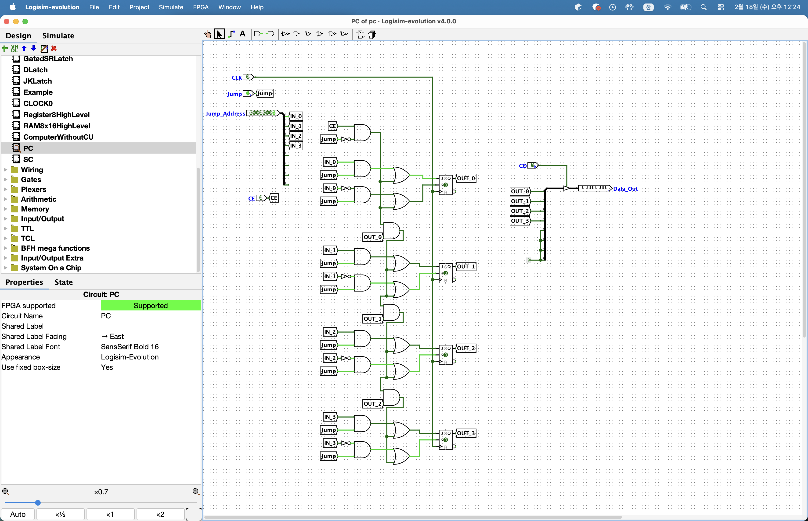

## 스텝 카운터

이번에는 제어장치에 필요한 또 다른 장치인 스텝 카운터에 대해 알아보고 구현해보도록 하겠다. 먼저 이전에 만든 프로그램 카운터를 이전에 제작한 컴퓨터에 추가설치를 해주도록 하겠다. 프로그램 카운터는 IR과 MAR 아래에 배치할 예정이니 참고 바란다. 프로그램 카운터를 배치하고 Jump Address와 출력핀을 버스에 연결하고 클럭은 터널을 생성해 연결한다. 나머지 핀들은 입력핀을 만들어 연결해준다.

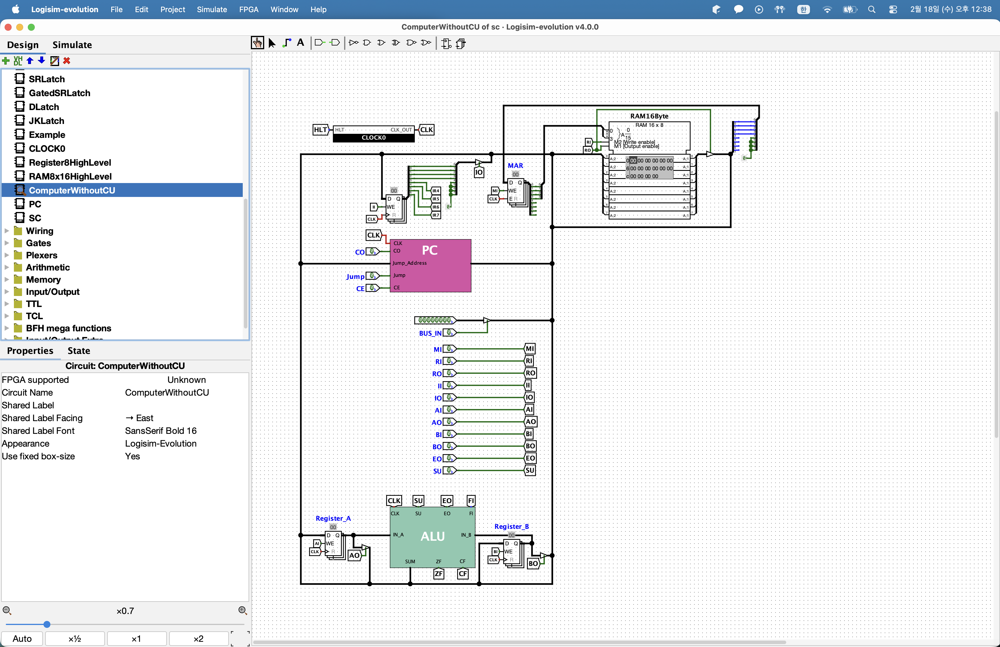

이렇게 프로그램 카운터가 수동으로 제어할 수 있게 조립되었다. 이제 스텝 카운터가 왜 필요한지 알아보자. 우리가 프로그램을 만들어 RAM에 저장을 했다고 해보자. 프로그램 카운터는 0번부터 시작하므로 RAM의 0번주소에 있는 명령어를 읽게 된다. RAM의 0번 주소에 1a라는 데이터가 있다고 하자. 1a를 2진수로 변환하면 0001 1010 된다. 해당 명령어는 LOADA 명령어로 뒤에 오는 주소에 있는 데이터를 레지스터A에 저장하는 명령어이다. 즉, RAM의 10번주소에 있는 데이터를 레지스터 A에 저장한다. 이 과정을 조금 더 상세하게 살펴보자.

제어장치의 첫번째 작업은 프로그램 카운터가 가리키는 RAM의 주소에서 명령어를 가져오는 것이다. 프로그램이 시작되면 프로그램 카운터는 0이므로 RAM의 0번 주소의 데이터를 가져온다. 이를 위해서 먼저 프로그램 카운터의 값을 MAR에 저장해야 한다. 그럴려면 CO핀과 MI핀을 활성화하면 MAR에 클럭을 토글할때 프로그램 카운터 값이 저장된다.

MAR에 RAM 접근 주소가 저장이 되었으니 이제 해당 주소의 명령어를 IR에 저장하고 프로그램 카운터 값을 1증가 시켜야 한다. RO, II, CE핀을 활성화하고 클럭을 토글시키면 된다. RO, II핀이 활성화되어 RAM의 0번주소에 있는 1A명령어가 IR에 저장되고 CE핀 활성화로 프로그램 카운터 값이 1 증가한다. 이렇게 지금까지 단계를 거치면 IR에 실행할 명령어가 저장이 되고 프로그램 카운터에는 다음 실행 할 명령어가 저장이 된다. 이 과정을 명령어 인출단계라고 표현한다.

IR에 저장된 값이 1a이므로 제어장치는 명령어의 앞부분을 통해 이것이 LOADA 명령어임을 알 수 있다. 이 명령어는 뒤에오는 4비트를 주소로 해석해서 RAM의 해당 주소에 있는 값을 레지스터 A에 저장한다. 이를 위해 먼저 MAR에 명령어 뒤에 있는 4비트의 주소 값을 저장해야 한다. 그러기 위해서는 IO를 활성화 해야하고 MI핀을 활성화해 클럭을 토글하면 IR의 하위 4비트인 1010, 10진수로 10, 16진수로 A가 저장이 된다. 이렇게 클럭이 토글되면서 또 하나의 단계가 수행이 되었다. 현재 MAR은 10번주소를 가리키고 있다.

RO와 AI핀을 활성화하고 클럭을 토글하면 레지스터 A에 5가 저장이 된다. 이렇게 LOADA 명령어는 0부터 3단계까지 총 4단계로 실행되며 0부터 1단계는 명령어 인출, 2부터 3단계는 명령어 해석 및 실행단계이다. LOADA 명령어가 실행된 다음 프로그램 카운터는 1이 되었다.

프로그램 카운터가 1이기 때문에 다음은 RAM의 1번 주소에 있는 명령어를 실행한다. 1번 주소에 2b라는 값이 저장되어 있다라고 가정하면 이는 2진수로 0010 1011이다. 0010은 ADD 명령어로 지정된 주소에 있는 값을 현재 레지스터 A의 값과 더한 뒤 그 결과를 다시 레지스터 A에 저장한다.

명령어를 수행하기 위한 가장 처음은 명령어 인출이다. 이 작업은 모든 명령어 실행 시 동일하게 진행된다. LOADA와 같은 방식으로 진행이 되니 생략을 할 것이다. 이렇게 명령어 인출단계가 끝나면 IR에는 2b가 저장이 될 것이고 MAR은 01이 될 것이며 프로그램 카운터는 2가 될 것이다.

이제 명령어 해석 및 실행단계를 수행해보겠다. 먼저 IR에 저장된 하위 4비트로 접근하기 위해 IO, MI를 활성화하고 클럭을 토글한다. 그러면 MAR에는 1011, 10진수로 11 16진수로 B가 저장되어 RAM의 11번 주소를 가리키게 된다.

다음으로 RAM의 11번 주소에 있는 데이터를 레지스터B에 저장한다. RO, BI핀을 활성화 하고 클럭을 토글하면 RAM의 11번 주소에 있는 3이 레지스터 B에 저장된다.

이제 두 레지스터의 값을 더해 레지스터 A에 저장하면 된다. 레지스터A와 B는 ALU에 직접 연결되어 있어서 항상 계산이 진행되므로 ALU의 EO핀과 AI핀을 활성화하고 클럭을 토글하면 레지스터A에 5 + 3의 결과인 8이 저장된다.

이렇듯 각 명령어 실행에는 일정 횟수의 클럭 토글이 필요하다. LOADA는 4번, ADD는 5번이 필요한것처럼 말이다. 우리가 구현할 11개 명령어 중에서 ADD 명령어가 5단계로 가장 많은 단계를 필요롤 한다. 그래서 이번에 만들 스텝 카운터는 명령어 인출, 해석 및 실행단계를 구분하는 장치이다. 각 단계를 세는 역할을 하기 때문에 스텝 카운터라고 이름을 지었다.

그러면 스텝 카운터를 아래처럼 만들어보자.

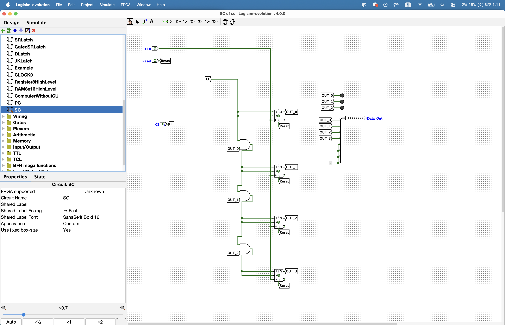

## 명령어 인출

지금부터 본격적으로 제어장치를 만들어보도록 하겠다. 제어장치의 입력은 간단하다. 8비트 명령어와 클럭 총 2개를 만들어 주면 된다. 과정은 생략하고 아래의 회로도데로 만들어주면 된다. 제어장치는 입력된 명령어를 해석하여 여러 제어핀을 통해 자동으로 명령어를 실행하기 때문에 출력핀의 수가 많다.

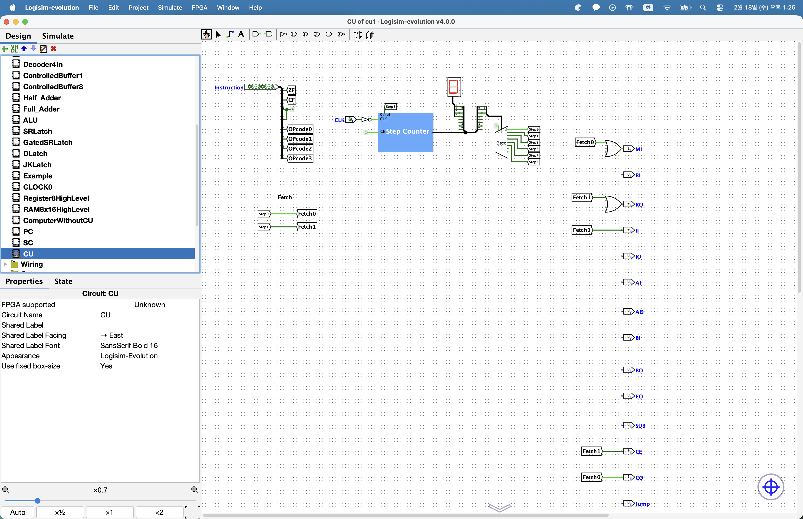

제어장치의 8비트 입력에서 MSB를 포함한 상위 4비트는 명령어이며 LSB를 포함한 하위 2비트는 각각 ZF, CF가 된다. 또한 이전에 우리는 LOADA와 ADD 명령어를 정의하고 각 실행단계에서 제어되는 핀들을 표로 정리하였다. 0단계와 1단계는 모든 명령어에서 동일하다고 언급을 하였다. 이 두 단계는 프로그램 카운터에 저장된 다음 실행할 명령어를 가져오고 프로그램 카운터의 값을 1 증가시키는 과정이다. 이를 인출 사이클 혹은 Fetch 사이클이라고 부르며 총 2단계로 구성이 된다. OP코드와는 관계없이 0번 1번 스텝일때 Fetch가 이루어져야 한다. 또한 제어장치는 컴퓨터의 여러 부분을 제어하는 역할을 하므로 제어해야 할 부분이 많을수록 제어 핀의 수도 늘어난다. 우리는 17개의 제어핀을 사용할 것이므로 출력핀 17개도 생성을 하였다.

## 명령어 실행 - NOP, LOADA

이번에는 우리가 정의한데로 명령어가 동작하도록 회로를 완성해보도록 하겠다. 명령어는 크게 2단계로 실행이 된다. 명령어를 인출하는 단계와 명령어를 해석하고 실행하는 단계이다. 이전에는 명령어 인출단계까지만 구현을 하였고 지금부터는 실행단계를 다루면서 NOP와 LOADA 명령어를 해석하고 실행하는 회로를 구성해보겠다.

먼저 NOP 명령어를 살펴보겠다. NOP는 아무런 동작도 하지 않는 명령어로 실제로 구현할 내용이 없다. OP 코드가 0000이든 정의되지 않은 다른 명령어가 들어오든 동작하지 않는 점에서 동일하다. 다만 OP 코드가 0000을 명시적으로 표현함으로써 의도적으로 아무 동작을 하지 않음을 나타낸다. 따라서 NOP는 별도 구현을 하지 않고 넘어가도록 하겠다.

본격적으로 살펴볼 첫번째 명령어는 LOADA이다. LOADA는 하위 4비트가 지정하는 RAM 주소의 값을 레지스터 A에 저장하는 명령어이다. 예를들어 0001 1010이라면 OP코드가 LOADA를 뜻하고 하위 4비트 operand 1010은 RAM의 10번 주소에 있는 값을 레지스터 A에 저장하라는 의미이다. LOADA는 총 4단계로 구성이 된다. 0부터 1단계까지는 명령어를 인출하고 2,3단계에서는 명령어를 실행한다. 명령어 인출은 이전에 구현했으므로 2,3단계만 구현하도록 하자.

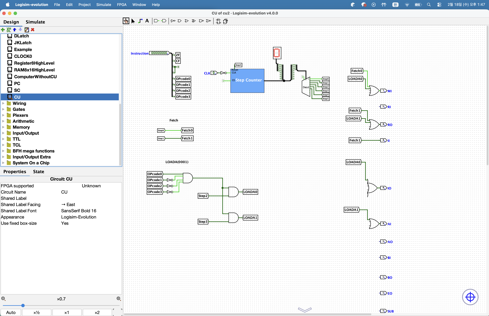

> OPCode0에 1 나머지에 0이 들어왔을 때 활성화 되므로 NOT 게이트를 붙여준 것이다.

LOADA 명령어의 실행 단계에서는 먼저 IR이 저장된 operand를 MAR에 넣어줘야 한다. 이는 operand가 주소값을 나타내기 때문이다. 따라서 IO와 MI핀에 LOADA0 터널을 연결해준 것이다. 다음 2단계에서 MAR가 가리키는 주소의 값을 레지스터 A에 저장한다. 이를 위해 RO와 AI핀을 활성화 해줘야 한다.

## 명령어 실행 - ADD

이번에는 ADD 명령어를 실행하는 회로를 만들어보겠다. ADD 명령어는 하위 4비트, 즉 operand가 가리키는 RAM 주소 값을 현재 레지스터 A의 값과 더한 후 그 결과를 다시 레지스터 A에 저장하는 명령어이다. ADD 명령어도 LOADA 명령어처럼 인출 단계를 거친다. 명령어 인출 단계는 이미 구현했으니 명령어 해석 및 실행단계만 구현하면 된다. 명령어 해석 및 실행은 총 3단계로 이루어진다.

첫째 명령어의 하위 4비트, 즉 operand를 MAR에 저장한다. 이를 위해 IO, MI핀을 활성화한다. 둘째 MAR에 저장된 주소의 값을 참조하여 해당 RAM의 주소 값을 레지스터 B에 저장한다. 이를 위해 RO와 BI를 활성화한다. ALU는 클럭에 영향을 받지 않으므로 이 시점에 레지스터 A와 B의 값이 즉시 더해진다. 셋째 ALU의 계산 결과를 레지스터 A에 다시 저장한다. 이를 위해 EO와 AI핀을 활성화 하고 계산 결과의 CF와 ZF를 저장하기 위해 FI핀도 활성화 한다.

구현하면 아래와 같다.

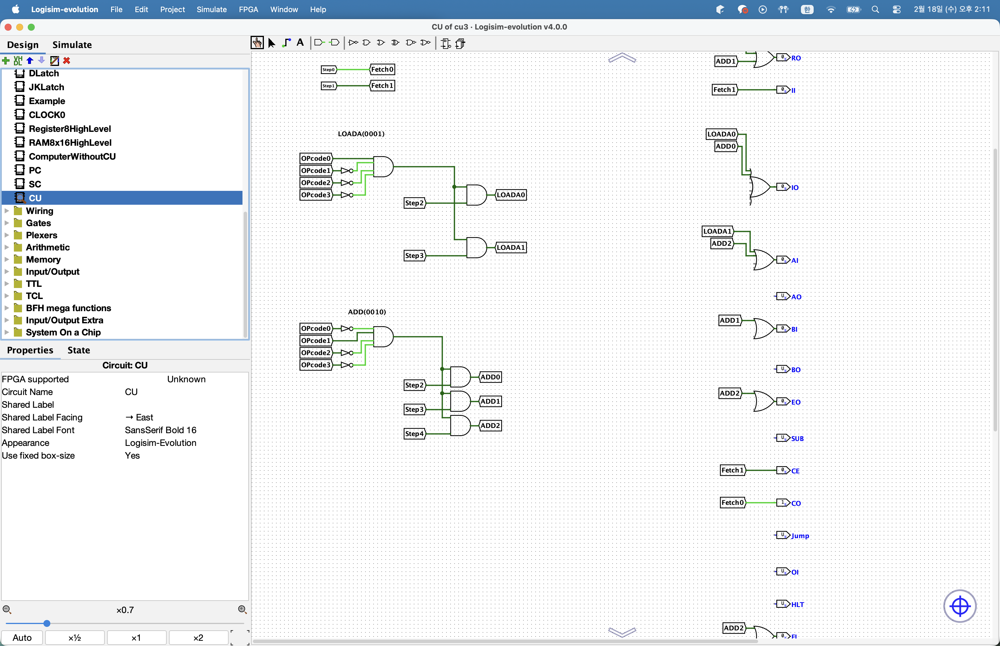

## 명령어 실행 - SUB

이번에는 SUB 명령어를 구현해보도록 하겠다. SUB 명령어는 ADD와 마찬가지로 명령어 인출 단계를 거친다. 명령어 인출은 이미 구현했으니 생략을 하겠다. 명령어 실행단계 역시 ADD처럼 총 3단계로 구성이 된다. SUB 명령어는 하위 4비트, 즉 operand가 가리키는 RAM의 주소의 값을 현재 레지스터 A의 값에서 뺀 뒤 그 결과를 다시 레지스터 A에 저장한다. 이는 ADD 명령어와 거의 동일한 과정이지만 ALU의 SU핀만 활성화된다는 점만 다르다.

명령어 실행 첫 단계는 명령어의 하위 4비트, 즉 operand를 MAR에 저장하는 것이다. 이를 위해 IO와 MI핀을 활성화한다. 두번째 단계에서는 뺄셈을 위해 MAR에 저장된 주소의 RAM 값을 레지스터 B에 저장한다. 이때는 RO와 BI를 활성화한다. 이 시점에서 ALU는 클럭에 영향을 받지 않으므로 레지스터 A와 B의 값을 즉시 더한다. 아직 뺄셈은 아니다. 마지막 단계에서는 레지스터 A에 최종 결과물을 저장한다. 이를 위해 EO와 AI핀을 활성화하고 뺄셈 연산을 위해 SU핀도 활성화 한다. 또한 CF와 ZF를 저장하기 위해 FI핀도 활성화 한다.

실제 구현을 해보면 아래와 같다.

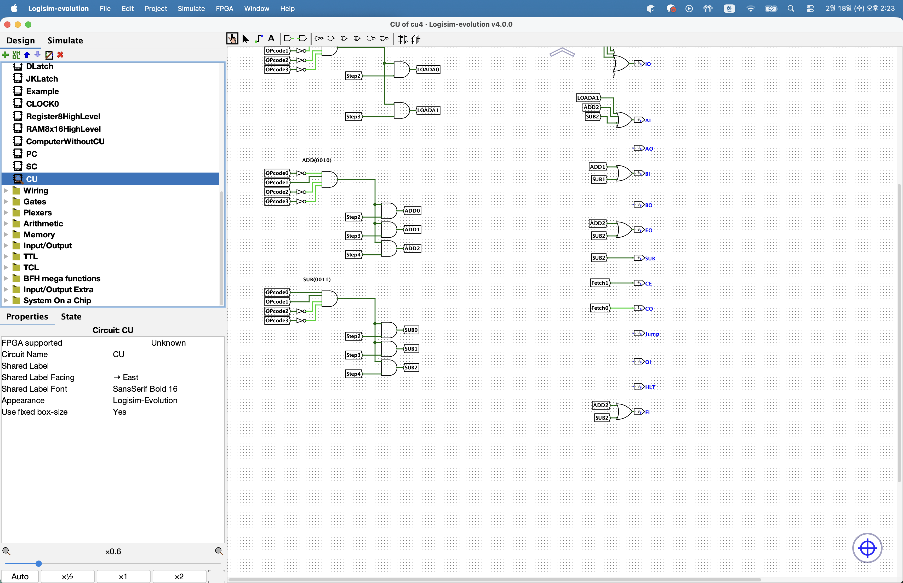

## 명령어 실행 - STOREA

이번에는 STOREA 명령어를 구현해보도록 하겠다. STOREA 명령어는 기존에 구현한 다른 명령어와 동일하게 명령어 인출단계를 거친다. 명령어 인출은 이미 구현했으니 생략한다. STOREA 명령어의 해석 및 실행 단계는 총 2단계로 나눠진다. STOREA 명령어는 레지스터 A의 저장된 값을 명령어의 하위 4비트, 즉 operand가 가리키는 RAM 주소에 저장하는 명령어이다.

명령어 실행의 첫 단계는 명령어의 하위 4비트, 즉 operand를 MAR에 저장하는 것이다. 이를 위해 IO핀과 MI핀을 활성화한다. 두번째 단계는 MAR가 가리키는 RAM 주소에 레지스터 A의 값을 저장하는 것이다. 이를 위해 AO핀과 RI핀을 활성화 해야 한다.

구현해보면 아래와 같다.

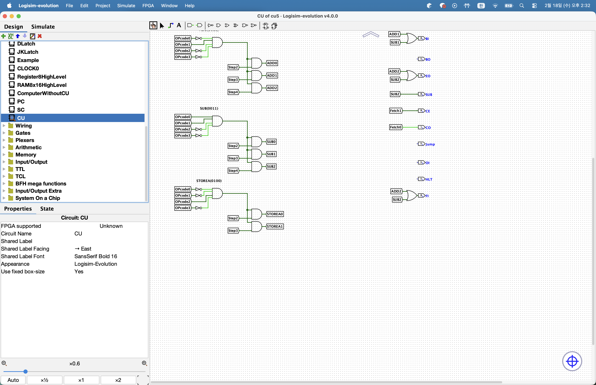

## 명령어 실행 - LOADI

이번에는 LOADI 명령어를 구현해보겠다. LOADI 명령어도 이전에 구현한 다른 명령어들처럼 명령어 인출 단계를 거친다. 명령어 인출 단계를 이미 구현했으니 생략한다. LOADI 명령어의 해석 및 실행 단계는 총 1단계로 매우 간단하다. LOADI 명령어는 하위 4비트, 즉 operand 값을 레지스터 A에 직접 저장하는 명령어이다. 값을 즉시 저장한다는 의미에서 LOADI로 이름이 지어진 것이다. 이 명령어는 IR의 하위 4비트, 즉 operand의 값을 직접 레지스터 A에 저장하므로 IO핀과 AI핀만 활성화하면 된다.

구현하면 아래와 같다.

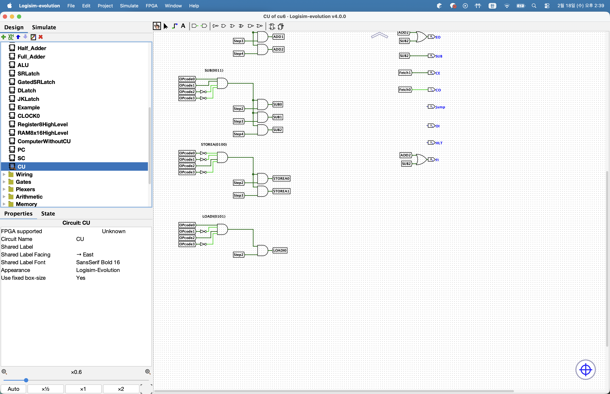

## 명령어 실행 - JMP, JMPC, JMPZ

이번에는 JMP, JMPC, JMPZ 명령어를 구현해보도록 하겠다. JMP 명령어는 하위 4비트, operand 값에 해당되는 RAM 주소로 이동하는 명령어이다. JMPC는 ALU에서 Carry 플래그가 발생했을 때, JMPZ는 ALU에서 Zero 플래그가 발생했을 때 각각 하위 4비트 즉, operand에 해당되는 RAM 주소로 이동하는 명령어이다. 이 세 명령어는 다 비슷하므로 한번에 구현하도록 하겠다. 이 명령어들도 기존 명령어들과 비슷하게 명령어 인출 단계를 거치지만 이미 구현되어 있으므로 생략하도록 하겠다.

명령어 해석 및 실행 단계는 1단계로 매우 간단하다. 점프 명령어들은 명령어 레지스터에 있는 값의 하위 4비트, 즉 operand를 프로그램 카운터로 전달하면 되므로 IO와 Jump핀을 활성화하면 된다. 이 Jump핀은 추후 프로그램 카운터의 Jump핀과 연결될 예정이다.

구현을 하면 다음과 같다.

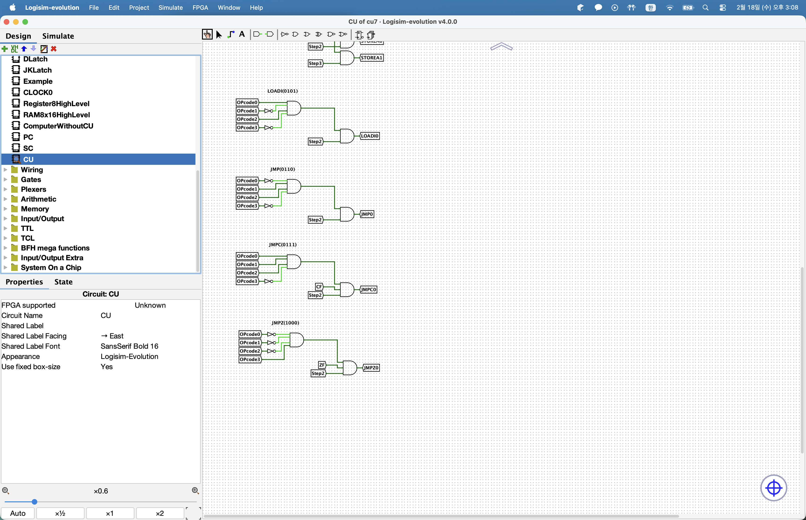

## 명령어 실행 - OUT, HLT

이번에는 레지스터 A의 값을 출력용 레지스터에 저장하는 OUT 명령어와 프로그램의 동작을 멈추는 HLT 명령어를 구현해보도록 하겠다. 이 두 명령어도 기종 명령어들과 동일하게 명령어 인출 단계를 거친다. 명령어 인출 단계는 이미 구현을 하였으니 생략하도록 하겠다.

이번에 구현할 두 명령어의 해석 및 실행 단계는 총 1단계로 매우 간단하다. OI핀과 AO핀을 활성화 시켜주면 되는데 바로 구현해보면 아래와 같다.

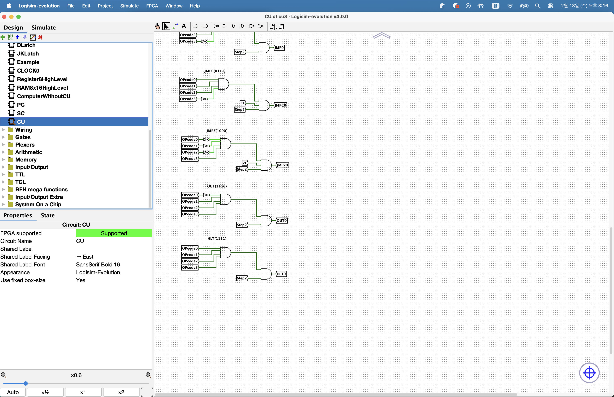

이로써 우리가 구현할 모든 명령어가 완성되었다.

## 출력 레지스터

이전에 우리는 OUT 명령어를 구현하였다. OUT 명령어는 레지스터 A의 값을 출력 레지스터에 저장하는 기능을 말한다. 즉, OUT 명령어가 동작하기 위해서는 출력 레지스터가 필요하다. 이번에는 출력 레지스터를 만들어보도록 하겠다. 기존 컴퓨터 회로에 출력 레지스터를 아래와 같이 연결하면 된다. 또한 부호 있는 정수와 부호 없는 정수를 표현하기 위해 출력핀을 2개로 둔 것이다.

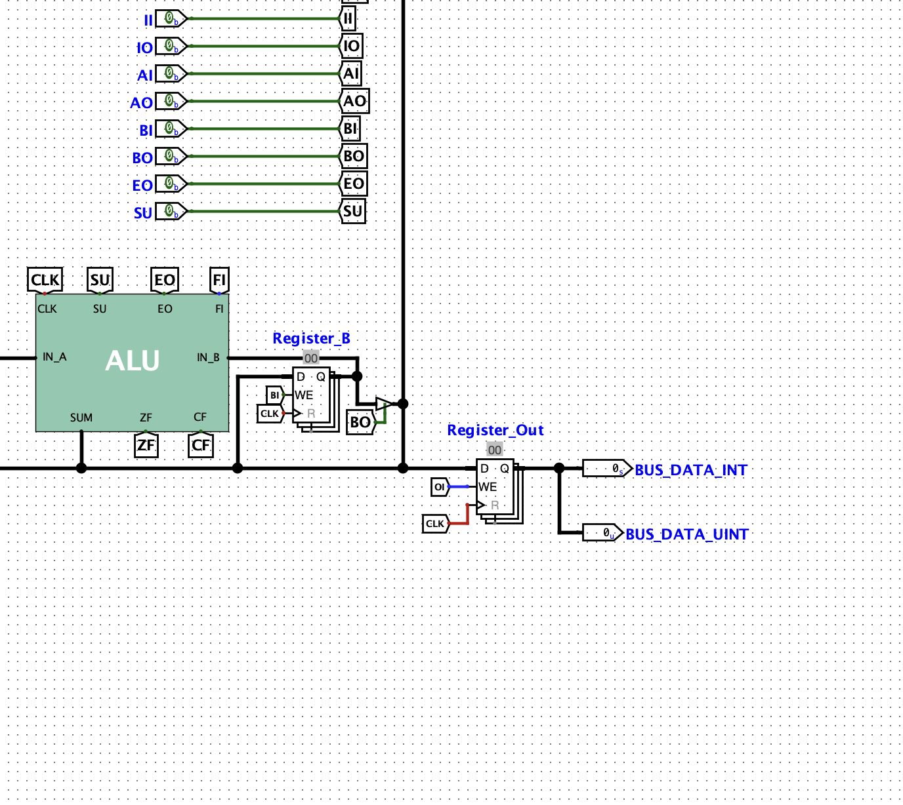

## 제어 장치 조립

제어장치가 완성되었으니 이제 우리가 만든 컴퓨터와 연결하여 자동 계산이 가능하도록 하겠다. 그러면 아래와 같을 것이다.

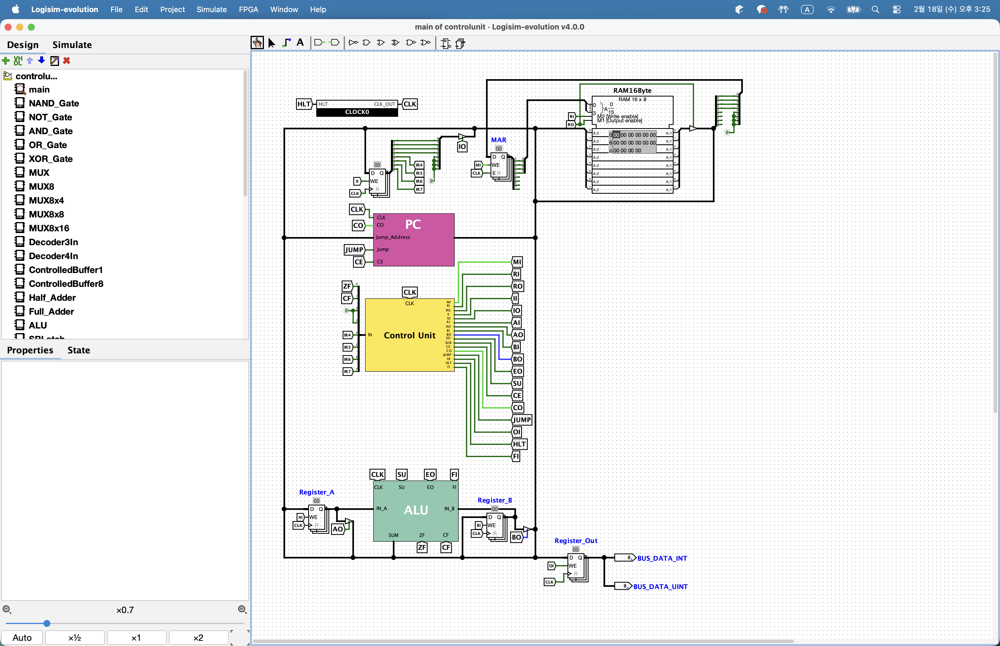