> 본 포스팅은 인프런의 [만들면서 쉽게 배우는 컴퓨터 구조](https://inf.run/PnrRu)를 참조하여 작성한 글입니다.

## 컴퓨터 만들기 개요

이전 포스팅에서 우리는 컴퓨터를 만드는데 필요한 지식과 부품들을 살펴보았다. 이번 포스팅부터는 본격적으로 컴퓨터를 만들어 볼 예정이다. 우리가 만들 컴퓨터의 구조는 폰 노이만 구조이다. 폰 노이만 컴퓨터 구조는 입출력 장치, 계산을 담당하는 중앙처리장치 그리고 데이터와 프로그램을 저장하는 메모리로 구성되어 있다. 여기서 우리가 가장 먼저 만들어 볼 장치는 중앙처리장치(CPU)이다.

CPU는 크게 산술논리연산장치와 제어장치 2가지로 나눠진다. 산술논리연산장치는 계산을 담당하고 제어장치는 제어를 담당하는데 제어장치는 가장 복잡하므로 나중에 만들어 볼 예정이다. 이번 포스팅에는 산술논리연산장치를 먼저 만들어보고 다음 포스팅에서는 메모리를, 그 다음에는 제어장치를 만들어 컴퓨터를 완성할 예정이다.

산술논리연산장치에서 산술연산은 덧셈과 뺄셈을 구현할 것이다. 곱셈과 나눗셈도 하드웨어로 구현할 수 있지만 그렇게 하면 회로가 너무 복잡해지고 컴퓨터의 동작을 이해하기 어려워진다. 그래서 우리는 이 연산들을 소프트웨어로 처리할 예정이다. 따라서 하드웨어는 덧셈과 뺄셈만 구현할 예정이다. 논리연산에서는 두 데이터를 비교하는 비교기와 데이터가 0인지 확인하는 제로 비교기를 만들어 볼 예정이다.

## 반 가산기

우리는 먼저 2개의 비트를 더하는 가산기를 만들어 볼 예정이다. 2개의 비트를 더하려면 입력이 2개가 필요하다. 그러면 출력은 몇개가 필요할까? 보통은 1개라고 생각하기 마련이지만 사실 출력이 하나 더 필요하다. 두 비트를 더할 때는 덧셈결과를 표현하는 비트 1개와 자리올림수를 표현하는 비트 1개가 필요하기 때문이다. 그러면 본격적으로 회로를 구현해보자.

먼저 2개의 입력핀 IN_A와 IN_B를 생성한다. 그리고 덧셈 결과를 나타 낼 출력핀 하나를 만들어 이름을 Sum으로 변경한다. 마지막으로 자리 올림 수를 위한 출력핀을 하나 더 만들어 이름을 Carry로 변경한다.

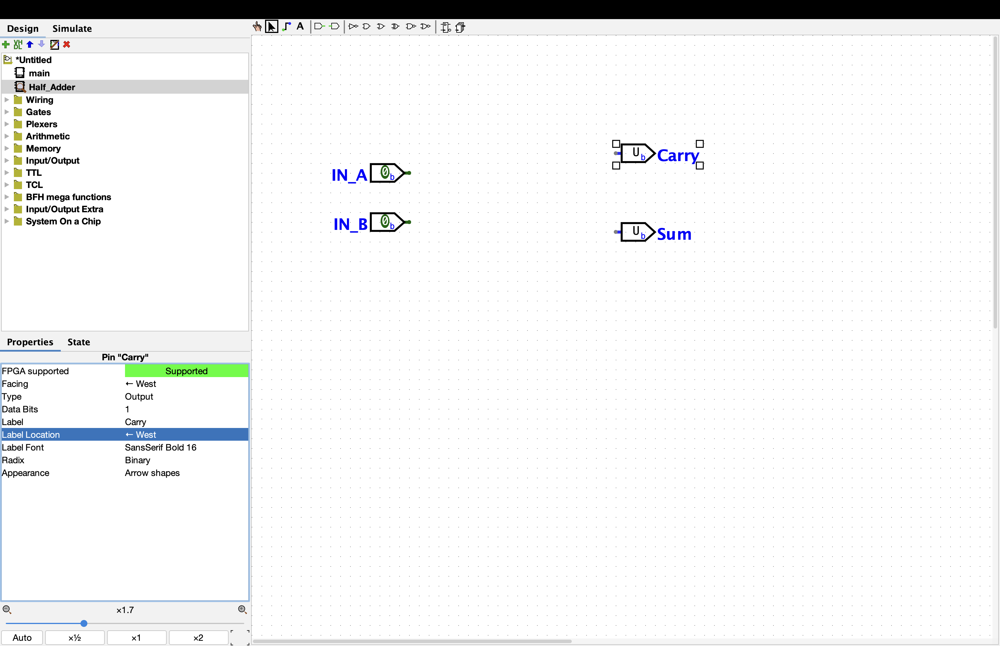

이제 본격적으로 회로를 완성해보자. 먼저 덧셈결과를 표현할 회로를 어떻게 만들지 확인해보도록 하겠다. IN_A가 0이고 IN_B가 0일 때 덧셈 결과는 0이다. IN_A가 0이고 IN_B가 1일 때 덧셈 결과는 1이다. IN_A가 1이고 IN_B가 0일 때 덧셈결과는 1이다. IN_A가 1이고 IN_B가 1일 때 덧셈결과는 0이고 자리올림이 발생한다. 여기서 자리 올림은 잠시 제외하고 덧셈 결과에만 집중을 하겠다. 그러면 해당 진리표가 XOR 게이트 진리표와 동일한 것을 알 수 있다. 그러면 XOR 게이트에 두 입력핀을 연결해보자. 그리고 XOR 게이트의 출력을 출력핀에 연결하자.

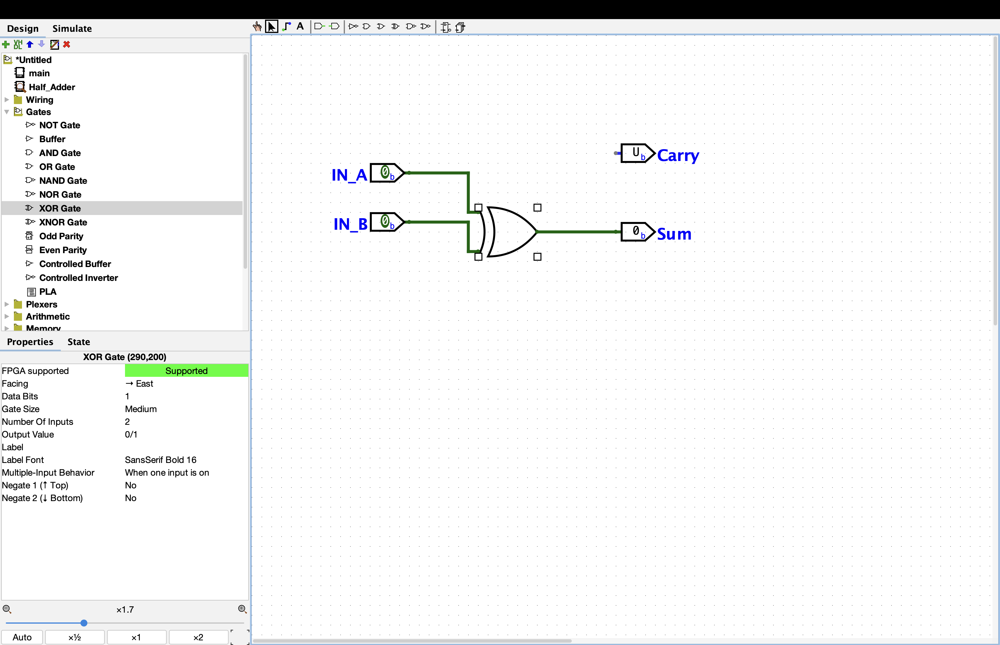

이제 자리 올림을 처리해보자. 두 입력에 따른 자리 올림 진리표를 만들어보자. IN_A와 IN_B가 모두 1일 때 자리올림이 발생하고 그 외에는 0이다. 따라서 해당 진리표는 AND 게이트와 동일하다는 것을 알 수 있다. 즉, 두 입력 핀에 AND 게이트와 연결하고 자리올림 출력핀을 AND 게이트 출력과 연결하면 된다.

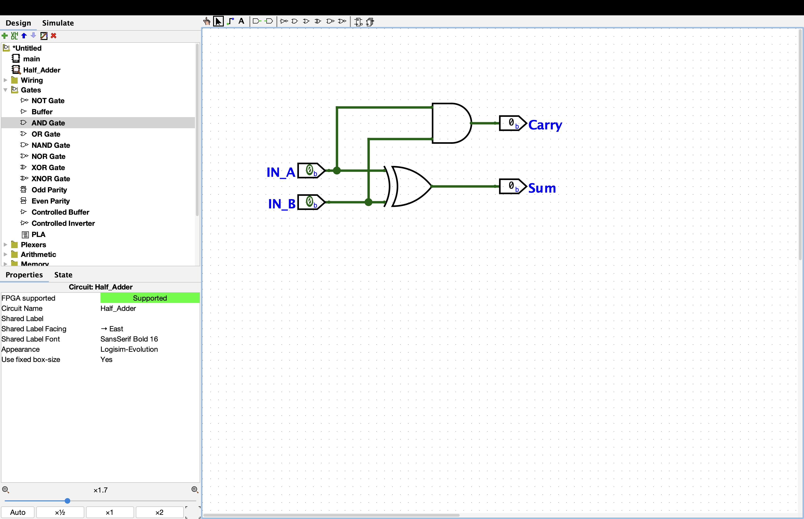

해당 가산기는 반쪽짜리 가산기이다. 지금 만든 가산기는 자리올림이 없는 두 비트만 더할 수 있다. 따라서 여러 비트를 더할 때 자리 올림이 없는 최하위 비트에서만 사용할 수 있다. 나머지 비트들은 이전 자릿수 올림까지 더해야 하므로 3개의 입력을 처리할 수 있는 가산기가 필요하다.

## 전 가산기

전 가산기는 반 가산기를 활용해 쉽게 구현할 수 있다. 반 가산기는 2비트만 더하고 자리 올림이 없어서 입력 2개와 출력 2개로 구성된다. 반면 전 가산기는 자리올림까지 계산해야 하므로 입력이 3개이며 출력은 반 가산기와 동일하게 2개이다. 그러면 본격적으로 전 가산기를 만들어보자.

입력 핀 3개를 만들어 각각 IN_A, IN_B, IN_C로 이름을 지정한다. 이제 이전에 만든 반 가산기를 배치하겠다. 그리고 Sum과 Carry라는 이름의 출력핀 2개를 만든다. 그런 다음에 반 가산기의 두 입력에 입력핀 A와 B를 연결한다.

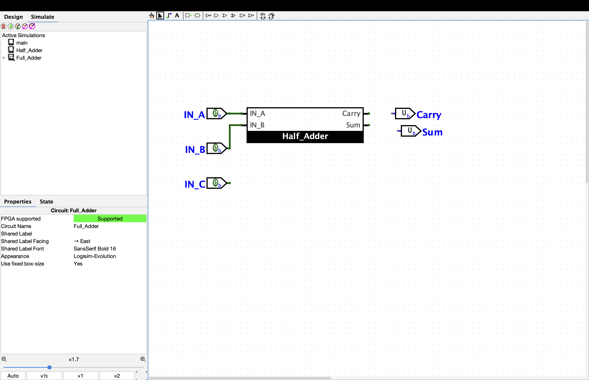

다음 반 가산기를 복사해 두번째 반 가산기를 배치한다. 첫번째 반 가산기의 Sum 출력과 입력 C를 두번째 반 가산기의 입력으로 연결해준다.

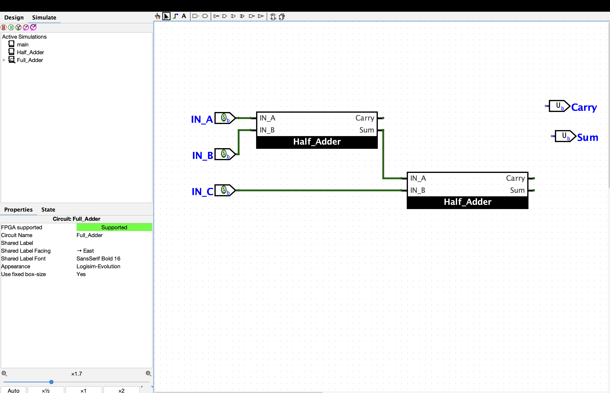

두번째 반 가산기의 Sum이 최종 덧셈 결과이므로 이를 출력핀 Sum과 연결한다. 다음은 Carry를 완성해보자. 자릿수 올림은 두 경우에 발생할 수 있다. 첫째, A와 B를 더할 때, 둘째 A와 B의 덧셈 결과와 C를 더할 때이다. 이 두 자릿수 올림을 처리하기 위해 OR 게이트를 추가하고 Gate Size를 Narrow로 변경해 작게 해준다.

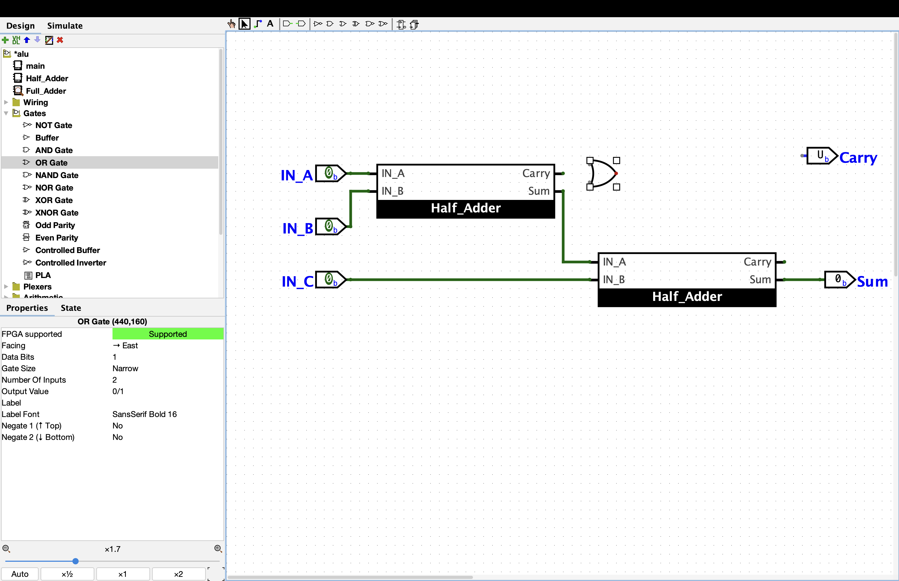

첫 번째 반가산기의 Carry와 두 번째 반 가산기의 Carry를 OR 게이트의 입력 핀과 연결한다. 마지막으로 OR 게이트의 출력을 최종 Carry 출력핀과 연결하면 끝이다.

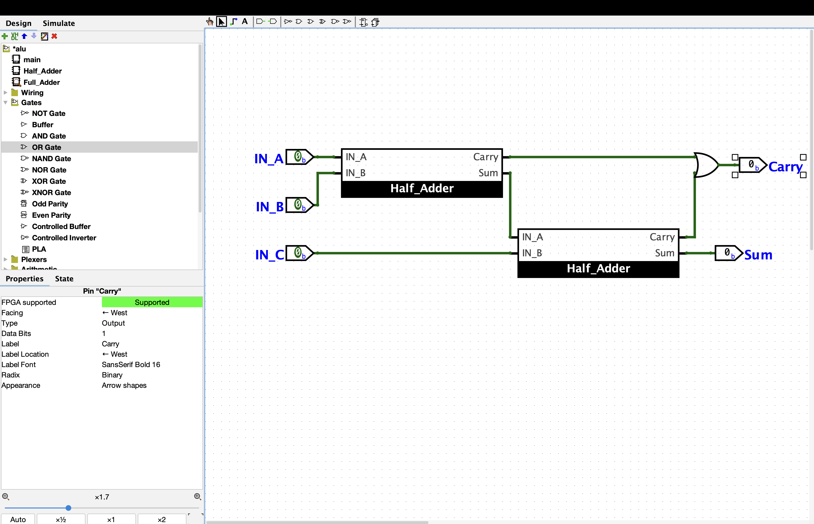

## 산술논리연산장치(ALU)

이번에는 컴퓨터의 계산 처리를 담당하는 ALU를 만들어보겠다. 우리가 만들고 있는 컴퓨터는 8bit이므로 ALU의 두 입력 값도 8bit로 구성하겠다.

먼저 입력핀을 배치하고 Data Bits를 8로 설정하겠다. 해당 입력핀을 2개 만들고 각각 IN_A와 IN_B로 설정하겠다. 또한 비트 별 계산을 위하여 Splitter로 비트를 분리하겠다. 세부 설정은 생략하고 아래 그림 처럼 진행을 해주면 좋을 것 같다.

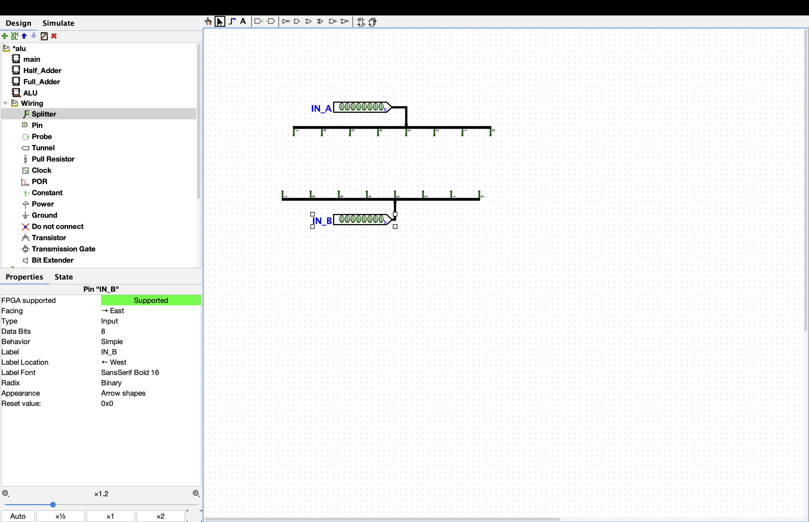

이제 각 입력 비트를 터널과 연결하자. 아래와 같이 만들면 되니 직접 만들어보자.

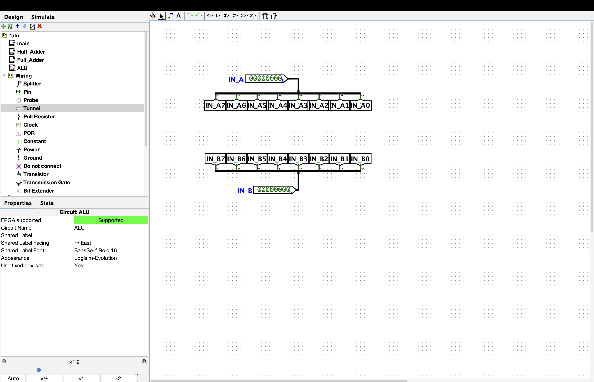

이제 이 입력들을 이전에 만든 전 가산기와 연결하겠다. 이것도 아래와 같이 만들면 되니 한번 따라 해보자.

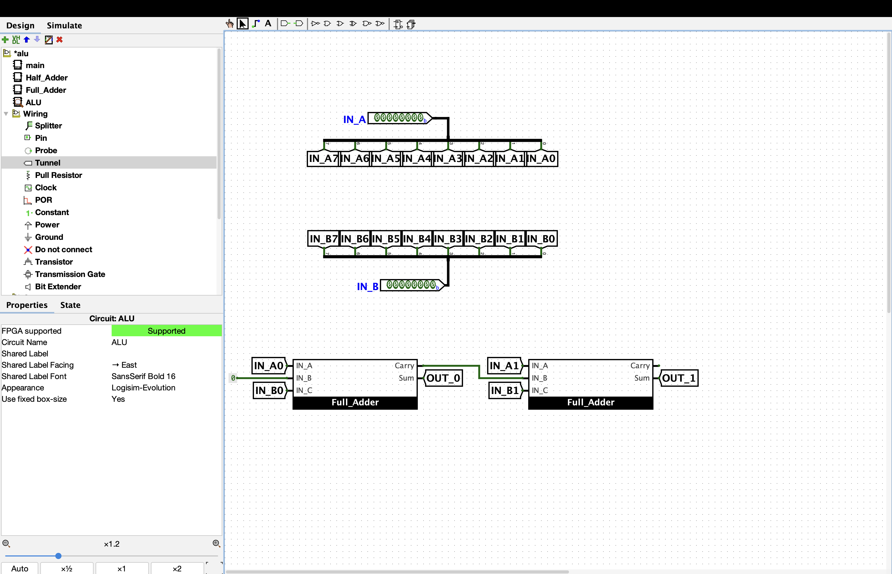

위와 같이 7번 비트까지 만들어주면 완성이 된다. 독자가 스스로 한번 해보자. 아마 아래와 같이 연결이 될 것이다.

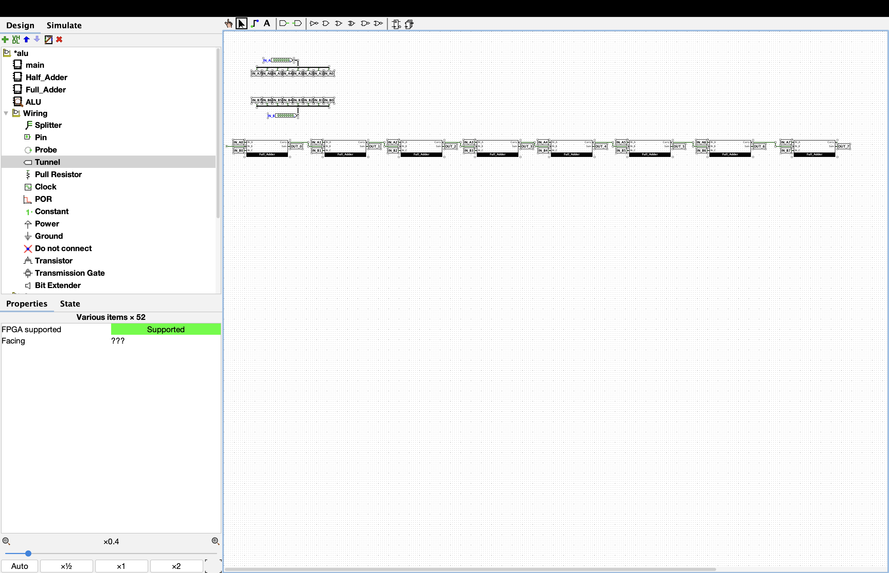

이렇게 8비트 덧셈을 위한 핵심 회로가 완성이 되었다. 다음으로 출력핀을 설정하겠다. 입력이 8비트이므로 출력도 8비트로 구성하고 이름을 Sum으로 변경하자. 그 다음 Splitter를 설치하여 Facing을 North로 Fan Out과 Bit Width In을 8로 Appearance를 Centered로 Spacing을 6으로 설정하고 Sum 출력핀과 연결한다. 다음으로 각각 Full Adder의 Sum 결과를 핀 순서대로 연결한다.

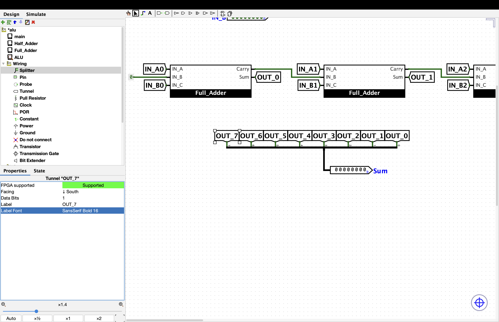

이것으로 ALU의 덧셈 구현이 완료되었다. 이제 뺄셈을 구현해보자. 뺄셈은 덧셈을 통해 간단히 구현할 수 있다. 바로 2의 보수를 활용하면 된다. 먼저 ALU의 뺄셈을 위한 입력핀을 추가하겠다. 입력 핀을 배치하고 이름을 Substraction의 약자인 SU로 지정한다. ALU는 이 입력 핀이 0일 때 덧셈, 1일 때 뺄셈을 수행한다. 2읭 보수는 모든 비트를 반전시키고 LSB에 1을 더하는 로직이다. 뺄셈일 때 SU핀이 1이기 때문에 SU핀을 0번 비트로 계산하는 Full Adder의 Carry로 연결한다.

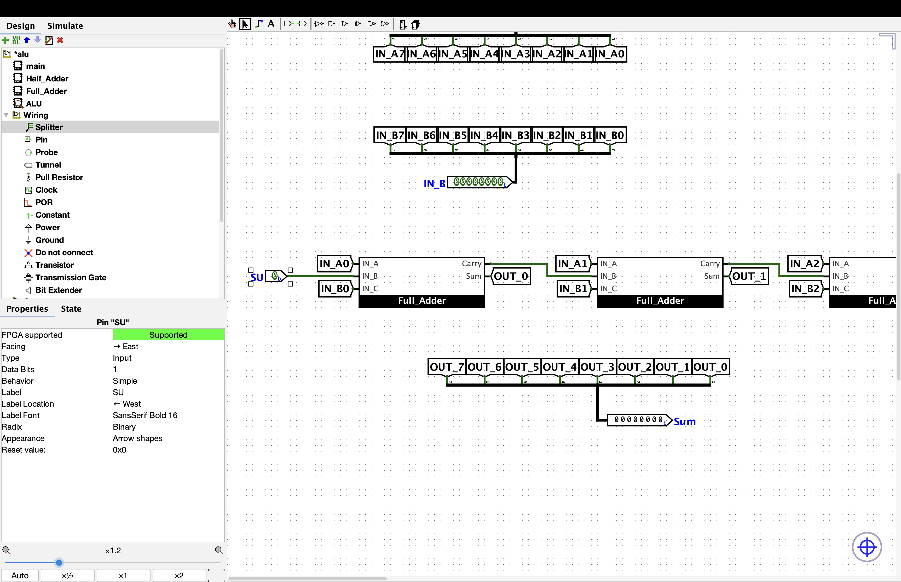

다음으로 SU핀이 1일 때 IN_B의 값을 반전시키려고 한다. SU핀이 0일 때는 IN_B의 원래 값을 1일 때는 IN_B의 반전된 값을 사용해야 하는데 해당 로직을 진리표로 작성해보면 XOR 게이트의 진리표와 정확히 일치한다. 따라서 XOR 게이트로 쉽게 구현이 가능하다. 바로 아래와 같이 말이다.

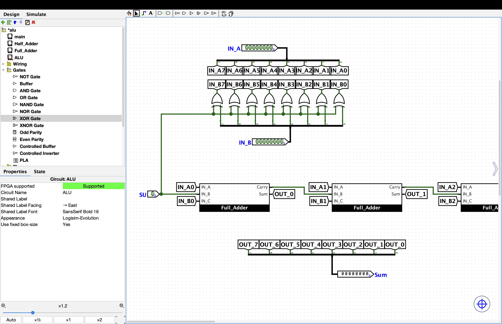

뺄셈 기능이 완성되었다. 이렇게 덧셈과 뺄셈 기능을 완성했으니 산술 연산은 끝이다! 지금부터는 제어장치가 ALU를 컨트롤하기 위해 추가회로를 구성해보도록 하겠다. 가장 먼저 ALU의 출력을 제어하기 위한 입력 핀을 추가하겠다. 입력핀을 배치하고 이름은 Enable Output의 약자인 EO로 변경하겠다. 그 다음 Controll Buffer를 추가하고 Data Bits를 8로 설정한 뒤 Sum과 Splitter 사이에 배치해준다. 그리고 Control Buffer의 Enalbe 핀을 EO 핀과 연결한다.

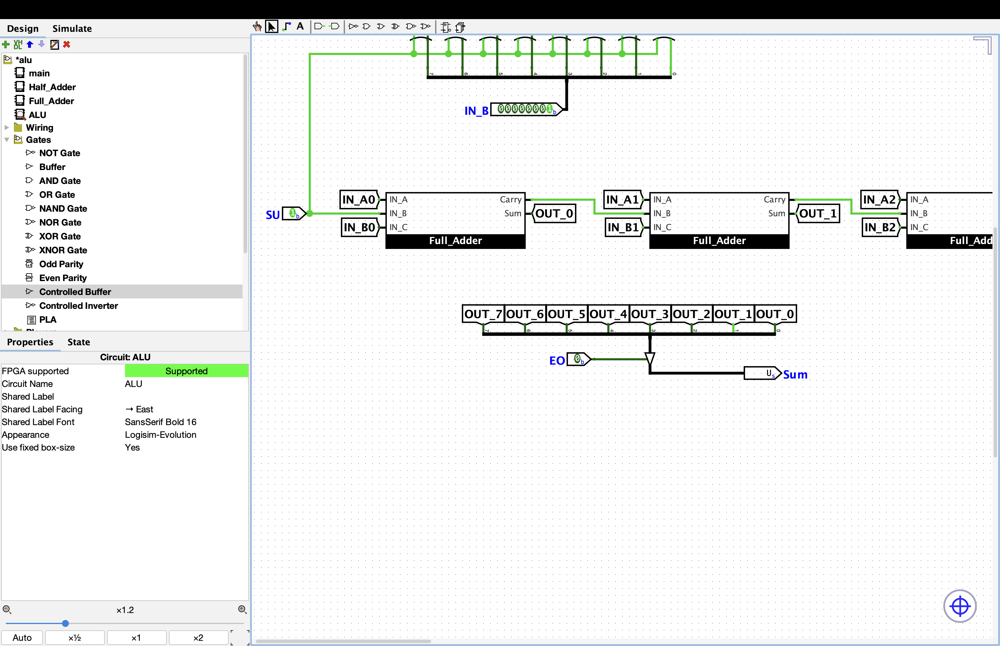

이렇게 하면 EO핀이 1일 때만 ALU의 계산 결과가 출력되도록 제어할 수 있다. 다음으로 추가할 것은 컨트롤 플래그이다. 제어장치가 ALU의 결과를 판단할 수 있도록 2개의 간단한 플래그를 만들어 보겠다. 첫번째는 Carry Flag로 ALU 계산 결과의 MSB 비트에서 캐리가 발생했는지를 알려주는 플래그이다. 두번째는 Zero Flag로 ALU의 계산 결과가 0인지 확인하는 논리연산 플래그이다.

먼저 Carry Flag부터 만들어 보겠다. 출력핀을 만들고 이름을 Carry Flag의 약자인 CF로 지정하고 7번 비트를 계산하는 Full Adder의 Carry핀과 연결하면 된다.

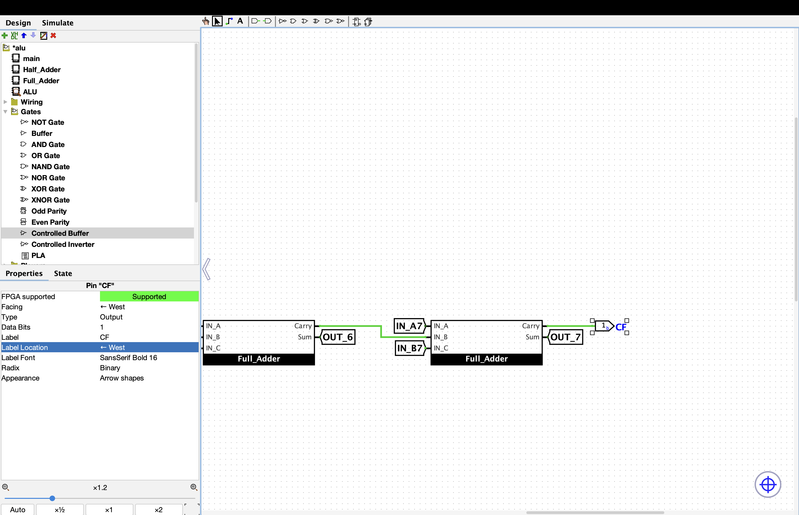

다음으로 Zero Flag를 설정해보겠다. 출력핀을 만들고 이름을 Zero Flag의 약자인 ZF로 변경한다. 이 출력핀은 계산 결과가 0일 때 활성화 되어야 하므로 계산 결과를 담고 있는 모든 비트를 터널로 가져온다. 또한 모든 출력이 0일 때 활성화 되어야 하므로 NOR 게이트를 활용하도록 하겠다.

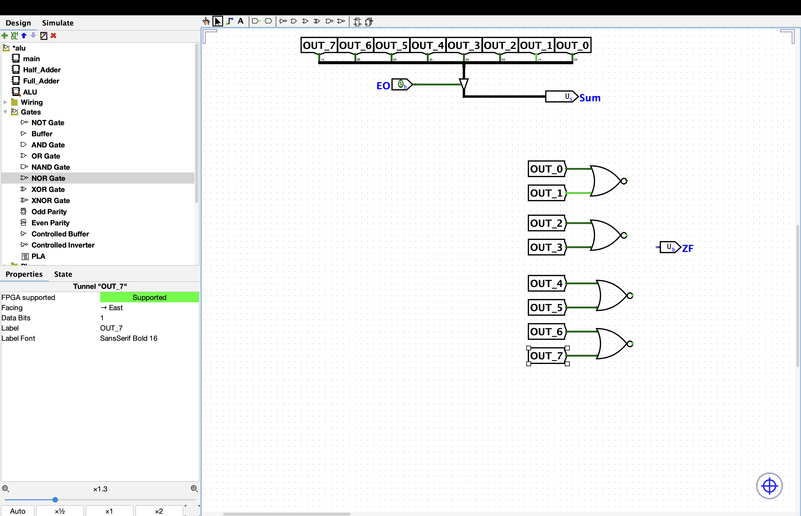

그리고 NOR 게이트의 출력을 AND 게이트에 연결해주면 8입력 NOR 게이트의 결과가 나온다.

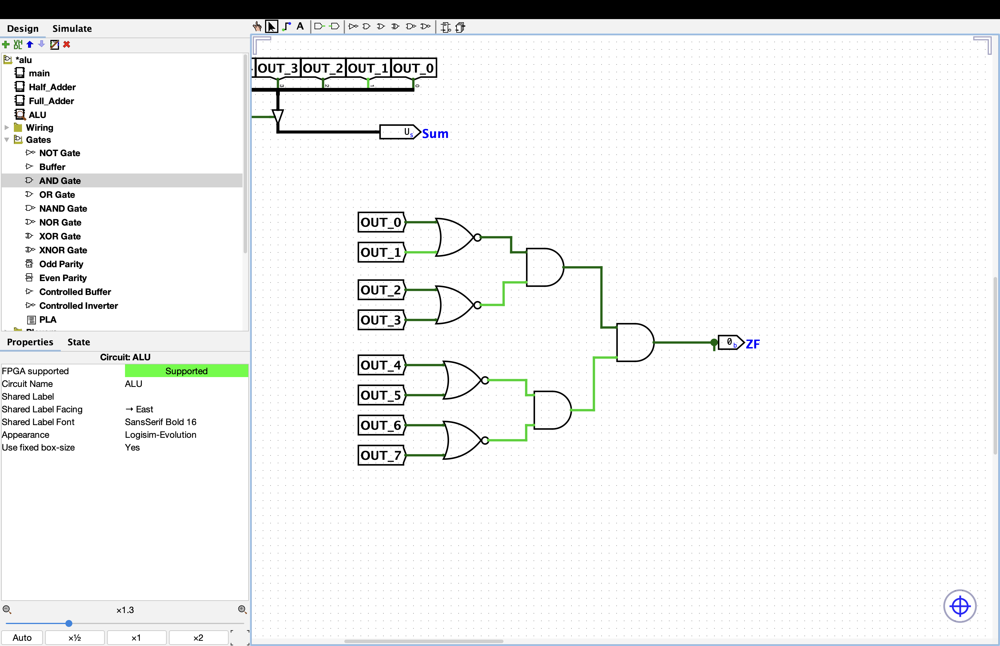