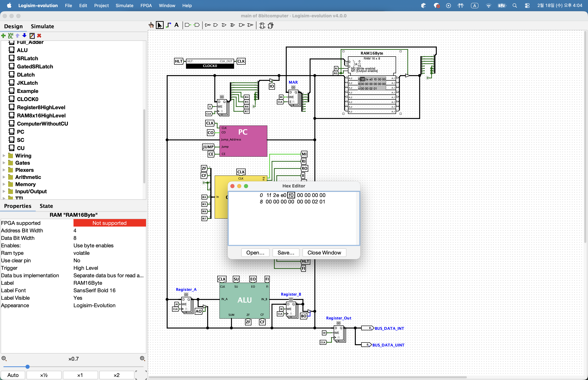

> 본 포스팅은 인프런의 [만들면서 쉽게 배우는 컴퓨터 구조](https://inf.run/PnrRu)를 참조하여 작성한 글입니다.

## 기게어 프로그래밍

이번에는 완성된 컴퓨터를 이용해 프로그램을 실행해보도록 하겠다. 우리가 만들 프로그램은 1+2의 결과를 출력하는 간단한 프로그램이다. 메모리에 1과 2를 미리 저장해두고 이를 레지스터로 불러와 계산하는 방식으로 프로그래밍을 진행하도록 하겠다. 우리의 RAM은 총 16바이트 크기로 0번부터 15번까지 총 16개의 메모리 공간을 제공한다. 이때 15번 주소에는 1이 14번 주소에는 2가 저장되어 있다고 가정하자.

먼저 15번지에 있는 데이터 1을 레지스터 A로 가져오자. 레지스터 A로 데이터를 가져오는 명령어는 LOADA 명령어이다. 명령어표에서 LOADA의 OP코드를 확인해보면 0001이다. 그러면 명령어의 상위 4비트는 0001로 넣어준다. 우리는 15번 주소에 있는 1을 가져오고 싶기 때문에 명령어의 하위 4비트, 즉 operand를 15로 입력해야 한다. 15는 2진수로 1111이기 때문에 operand를 1111로 적어준다. 이렇게 2진수로 된 명령어를 16진수로 변환하면 1F가 된다. 이 1F를 0번 주소에 저장할 것이다.

다음으로 어떤 명령어를 사용해야 할까? 현재 레지스터A에 1이 저장되어 있으므로 ADD 명령어를 이용하여 RAM의 14번 주소에 있는 값, 즉 2와 덧셈을 진행해야 한다. ADD 명령어의 OP코드는 0010이고 14번지는 2진수로 1110이다. 해당 2진수를 16진수로 변환하면 2E가 된다. 그럼 2E를 1번 주소에 저장할 것이다. 이 명령어가 실행되면 레지스터 A에는 1+2의 결과인 3이 저장될 것이다.

이제 이 레지스터에 저장된 결과를 출력 레지스터로 전송하는 OUT 명령어를 사용하겠다. OUT 명령어의 OP코드는 1110이며 operand는 필요 없으므로 0000으로 해준다. 이는 16진수로 E0가 된다. 그리고 해당 값을 2번주소에 저장할 것이다.

출력이 완료되었으니 이제 컴퓨터의 동작을 중지시켜야 할 것이다. 이를 위해 HLT 명령어를 사용할 것이다. HLT 명령어의 OP코드는 1111이고 operand는 필요 없으므로 0000이다. 이것을 16진수로 표현하면 F0가 된다. 그리고 해당 결과를 3번 주소에 저장할 예정이다.

이제 이 프로그램을 로지심에서 직접 실행시켜보겠다. 일단 메모리를 우 클릭하여 Edit Content를 통해 아래와 같이 작성해보자.



이렇게 프로그램이 RAM에 로드되었다면 클럭을 동작시켜 프로그램을 실행시켜주면 된다. 우리가 한 과정을 기계어 프로그래밍이라고 한다.

## 어셈블러와 어셈블리어

우리는 1+2를 계산하기 위해 명령어표를 참조하여 LOADA, ADD, OUT, HALT 명령어에 해당하는 2진수를 작성했습니다. 이처럼 우리가 원하는 동작을 수행하기 위해 명령어표를 참고해 명령을 2진수나 16진수로 변환하는 과정은 매우 번거롭다. 뿐만 아니라 오타가 발생하면 이를 찾아내기 어렵다.

기계어의 이런 단점을 해결하기 위해 컴퓨터 과학자들은 명령어표의 명령어를 직접 사용할 수 있는 언어로 만들었다. 이것이 바로 **어셈블리어** 또는 **어셈블리 언어**라고 말한다. 어셈블리의 각 명령어는 기계어와 1:1 매칭을 한다. 예를 들어 레지스터A에 RAM의 10번 주소에 있는 데이터를 저장하기 위해 이전에는 0001 1010이라는 기계어를 사용했지만 어셈블리 언어에서는 LOADA 10이라고만 해주면 된다. 이러한 어셈블리 언어를 기계어로 변환해주는 프로그램을 어셈블러라고 한다.

## 어셈블리 언어 프로그래밍 - 곱하기

이번에는 어셈블리 언어를 통하여 곱셈을 수행하는 프로그램을 만들어보겠다. 예제로 5x4를 구현해보겠다. 5x4는 5를 네번 더하는 방식으로 구현할 수 있다. 이러한 반복 작업을 수행하기 위해서는 조건을 검사하고 조건이 만족되었을 때 특정 위치로 이동하는 명령어가 필요하다. JMP, JMPC, JPMZ같은 JMP 명령어가 필요한셈이다.

그러면 지금부터 프로그래밍을 시작해보겠다. IDE는 vscode를 사용해보겠다. 일단 `5x4.asm`파일을 만들어준다. 확장자 asm은 어셈블리 언어로 작성된 파일임을 나타내지만 다른 확장자를 사용해도 무방하다. 우리는 5x4를 진행하기 때문에 숫자 5와 4를 RAM에 저장해주겠다.

먼저 RAM의 크기인 16만큼 텍스트 라인수를 만들어준다. 그리고 16번 라인, 즉 RAM 15번 주소에 5를 입력해준다. 15번 라인, 즉 RAM 14번 주소에는 4를 입력해준다. 그리고 14번 라인, 즉 RAM 13번 주소에는 곱샘의 결과를 저장해주겠다. 초기 값은 0으로 설정해주겠다. 5x4는 5를 4번 더해줘야 하므로 덧셈을 4번 반복해야 한다. 4를 시작으로 한번 반복할 때마다 1을 빼주기 위해서 메모리에 1도 저장하겠다. 13번 라인 즉, RAM의 12번 주소에 1을 입력해준다.

``` asm


1 // 반복할 때 빼주는 값
0 // 곱셈 결괴
4 // 승수
5 // 피승수
```

이렇게 계산에 필요한 데이터들 입력은 모두 끝이 났다. 이제 명령어 부분을 작성해주겠다. 가장 먼저 곱셈의 승수, 즉 현재 덧셈을 반복해야 하는 횟수를 레지스터A에 불러오겠다. LOADA 14명령어로 레지스터A에 4를 불러온다. 다음으로 반복 횟수에서 1을 빼서 한번 반복을 카운팅해준다. 이는 SUB 12 명령어로 수행하는데 RAM의 12번 주소에 저장된 1을 레지스터 A의 값 4에서 빼서 3이 된다.

``` asm
LOADA 14 // A = RAM[14]
SUB 12 // A -= RAM[12]


1 // 반복할 때 빼주는 값
0 // 곱셈 결괴
4 // 승수
5 // 피승수
```

이제 반복 회수를 파악하고 분기하는 명령어가 필요하다. 현재 레지스터A에 저장된 승수가 양수일때는 ALU의 CF가 비활성화되는데 이를 활용해 JUMPC 명령어를 사용한다. 점프할 주소는 나중에 결정하겠다. JMPC가 실행되지 않을 때, 즉 현재 레지스터A에 저장된 승수가 음수가 되어 계산이 완료되었을 때 명령어를 작성하겠다. RAM의 13번 주소에 있는 계산 결과를 LOADA 13으로 레지스터A에 불러오고 OUT 명령어로 출력 레지스터에 저장한 뒤 HLT 명령어로 프로그램을 종료하도록 하겠다.

``` asm
LOADA 14 // A = RAM[14]
SUB 12 // A -= RAM[12]
JMPC ?? // CF 활성 시 ??주소로 점프
LOADA 13 // 13번 주소에 있는 곱셈 결과를 레지스터A에 저장.
OUT
HLT


1 // 반복할 때 빼주는 값
0 // 곱셈 결괴
4 // 승수
5 // 피승수
```

다음은 JMPC가 실행될 때 즉 현재 레지스터가 A의 승수가 양수일 때의 영역이다. 이 부분은 7번라인, 즉 RAM의 6번 주소부터 시작하므로 JMPC의 점프 주소를 6으로 설정한다. 현재 레지스터A에 저장된 값을 STOREA 14로 RAM의 14번 주소에 저장한다. 그리고 곱셈 결과를 저장할 RAM 13번 주소의 값을 LOADA 13으로 레지스터 A에 불러온다. 이 시점에는 아직 계산을 시작하지 않았으므로 0이 저장되어 있을 것이다. 이제 피승수인 5를 더한다. ADD 15 명령어로 RAM의 15번 주소에 있는 피승수를 현재 레지스터A의 값과 더한다.

``` asm
LOADA 14 // A = RAM[14]
SUB 12 // A -= RAM[12]
JMPC 6 // CF 활성 시 6번주소로 점프
LOADA 13 // 13번 주소에 있는 곱셈 결과를 레지스터A에 저장.
OUT
HLT
STOREA 14
LOADA 13
ADD 15


1 // 반복할 때 빼주는 값
0 // 곱셈 결괴
4 // 승수
5 // 피승수
```

방금 구한 덧셈의 결과를 STOREA 13으로 RAM의 13번 주소에 저장한다. 이렇게 첫번째 반복이 완료되어 RAM의 13번 주소에 5가 저장이 된다. 남은 3번의 반복을 위해 JMP 0 명령으로 프로그램 시작 부분으로 돌아간다. 이후 레지스터 A에는 RAM의 14번 주소에 저장된 3이 로드되고 여기서 1을 뺀 2는 아직 양수이므로 다시 RAM의 6번 주소로 이동한다. 반복되는 영역을 수행하면서 RAM의 데이터를 갱신하면서 피승수를 더하는 과정을 반복한다.

승수가 음수가 되면 JMPC 6명령어가 실행되지 않고 최종결과가 출력되고 프로그램이 종료된다.

``` asm
LOADA 14 // A = RAM[14]
SUB 12 // A -= RAM[12]
JMPC 6 // CF 활성 시 6번주소로 점프
LOADA 13 // 13번 주소에 있는 곱셈 결과를 레지스터A에 저장.
OUT
HLT
STOREA 14
LOADA 13
ADD 15
STOREA 13
JMP 0

1 // 반복할 때 빼주는 값
0 // 곱셈 결괴
4 // 승수
5 // 피승수
```

## 어셈블리 언어 프로그래밍 - 나누기

이번에는 나누기 프로그램을 만들어보겠다. 실제 구현 과정은 상세하게 하지 않고 곱셈과 유사하니 결과만 제공하도록 하겠다.

``` asm
LOADA 15
SUB 14 // 피제수 -= 제수
JMPC 7 // 피제수가 제수보다 크면 RAM의 7번 주소로 점프
JMPZ 7 // 피제수와 제수가 같으면 RAM의 7번 주소로 점프
LOADA 13
OUT
HLT
STOREA 15 // 현재 레지스터A의 값을 피제수로 업데이트
LOADI 1 // 몫 += 1
ADD 13
STOREA 13
JMP 0

0 // 몫
3 // 제수
7 // 피제수(결과는 나머지)
```