> 본 포스팅은 인프런의 [만들면서 쉽게 배우는 컴퓨터 구조](https://inf.run/PnrRu)를 참조하여 작성한 글입니다.

## 조합 논리회로와 순차 논리회로

지금까지 우리가 만든 모든 회로는 입력 값에 따라 출력이 결정되었다. 예를 한번 들어보자. 반가산기는 현재 어떤 상태든 상관없이 새로운 입력이 들어오면 그에 맞는 결과를 출력한다. 이처럼 출력이 오직 현재 입력에만 의존하는 회로를 **조합 논리회로**라고 한다. 우리가 지금까지 다룬 모든 회로가 바로 이 조합 논리회로에 속한다. 조합 논리회로의 출력은 입력에만 영향을 받기 때문에 어떤 상태인지 기억을 하지 못한다. 따라서 상태를 기억하는 메모리를 만들기는 어렵다.

상태를 기억하는 회로를 만들기 위해서는 조합 논리회로의 출력이 다시 입력으로 들어가도록 해줘야 한다.

> 피드백 신호: 조합 논리 회로의 출력이 다시 입력으로 들어가도록 하는 것을 피드백 신호라고 한다.

이렇게 되면 이전 입력에 대한 출력이 피드백으로 다시 입력으로 들어가서 현재 상태를 만들고 이 상태와 다른 입력을 통해 다음 상태도 결정할 수 있다. 이렇게 이전 입력에 대한 출력이 다시 입력으로 들어가는 회로를 **순차 논리회로**라고 부른다. 우리가 주변에서 볼 수 있는 디지털 회로는 대부분 조합 논리회로와 순차 논리회로가 혼합되어 있다. 계산이나 명령을 처리하는 부분은 조합 논리회로로, 상태를 기억하는 순차 논리회로는 메모리 역할을 하며 복잡한 장치를 만드는 것이다.

## SR Latch

순차 논리회로에서 가장 먼저 살펴 볼 것은 SR Latch이다. 이 회로는 1비트를 저장할 수 있는 기본적인 회로이다. 그러면 바로 만들어 보자.

먼저 NOR 게이트 2개를 배치하자. 그리고 2개의 입력 핀을 만들어 이름을 각각 S와 R로 지정한다. S는 위쪽 NOR 게이트에 연결하고 R은 아래쪽 NOR 게이트에 연결한다.

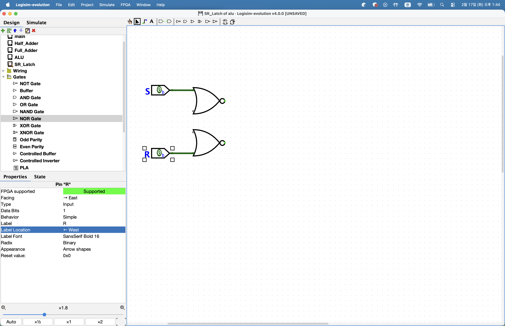

다음으로 위쪽 NOR 게이트의 출력을 아래쪽 NOR 게이트 입력으로 연결하고 아래쪽 NOR 게이트의 출력은 위쪽 NOR 게이트의 입력으로 연결한다.

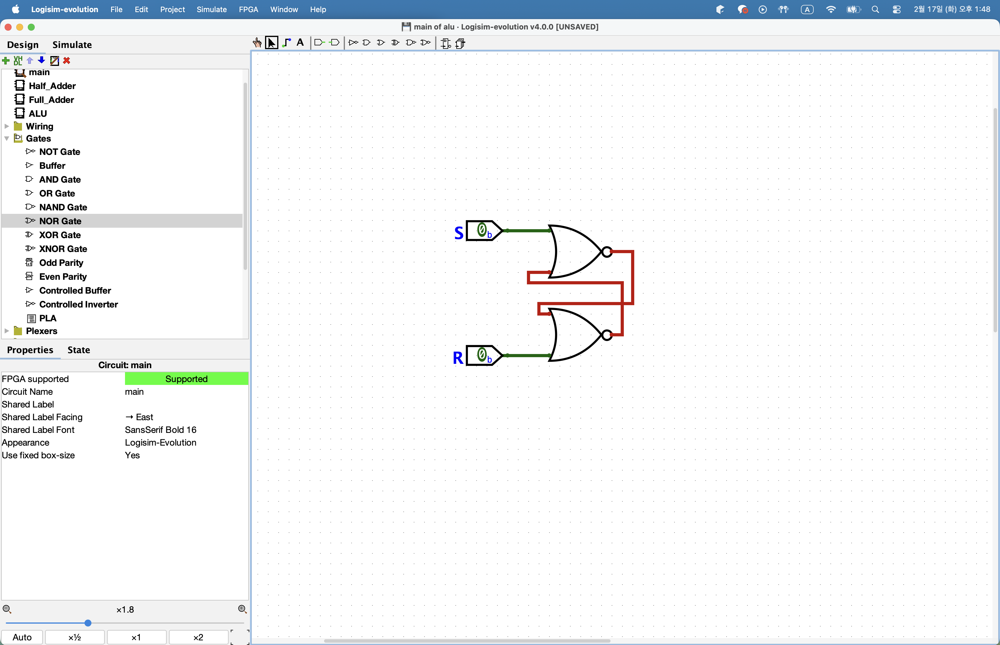

이렇게 출력을 다시 입력으로 연결함으로 상태를 저장할 수 있게 되었고 이러한 회로를 순차 논리회로라고 부른다. 마지막으로 아래쪽 NOR 게이트의 출력에 새로운 출력핀을 연결하고 이름을 Q로 지정한다.

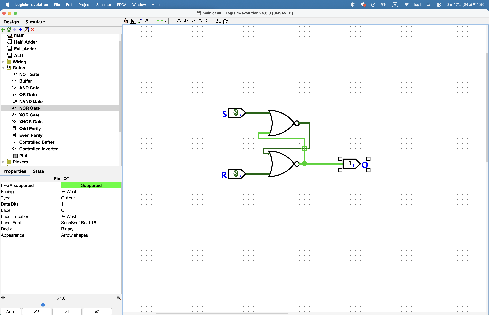

이렇게 SR Latch가 완성되었다. 처음에는 초기 값이 지정되지 않아 U로 상태가 나오지만 S에 입력 값을 넣어주면 해당 초기 값이 출력핀으로 저장이 된다. 그리고 S의 어떤 값을 넣든지 출력핀은 항상 고정이 된다. 만약 해당 초기 값을 변경하고 싶다면 R핀에 1을 넣어줘서 Reset을 해주면 된다.

이제 이 회로가 어떻게 동작하는지 자세히 알아보자. 먼저 회로의 초기 상태를 보면 S와 R이 모두 0이고 NOR 게이트에서도 출력이 없어 출력 신호가 끊어진 상태이다. R에 1을 입력하면 NOR 게이트의 진리표에 따라 0이 출력된다. 이에 따라 Q는 0이 되었고 Q 신호는 S와 연결된 NOR 게이트의 다른 입력으로 들어간다. 이 때 S와 연결된 NOR 게이트는 두 입력이 모두 0이므로 1을 출력한다. 이 1은 다시 R과 연결된 NOR 게이트로 들어가 0을 출력하게 만들고 이런식으로 회로는 안정된 상태를 유지한다.

SR Latch의 진리표를 보면 다음과 같다. S와 R이 모두 0이면 Q신호가 상태 유지를 하게 되고 R이 1이면 Reset이 되어 0이 출력되고 S만 1이면 1로 Q신호가 Set되며 둘다 1인 경우는 다시 출력이 0이 되므로 이 상태는 사용하지 않는다.

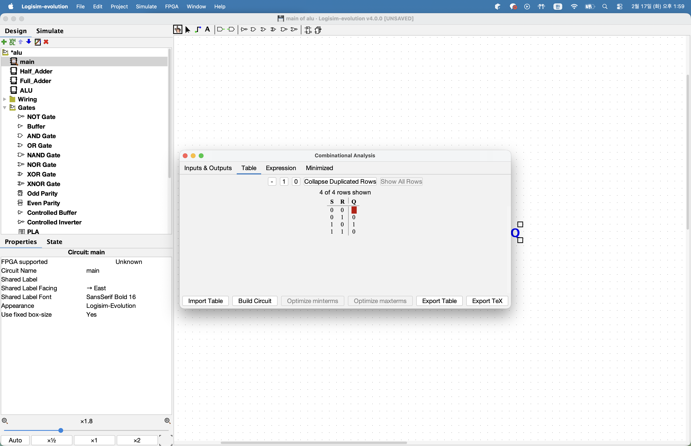

이렇게 SR Latch를 통해 1비트를 저장할 수 있게 된다. 이제 이 회로를 좀 더 수정하여 더 편리한 회로로 만들어 보겠다. 기존 SR Latch 회로에서 Enable이라는 입력 핀을 추가하여 Enable이 1일 때만 Set이나 Reset이 동작하도록 회로를 수정하겠다. 바로 아래와 같이 말이다.

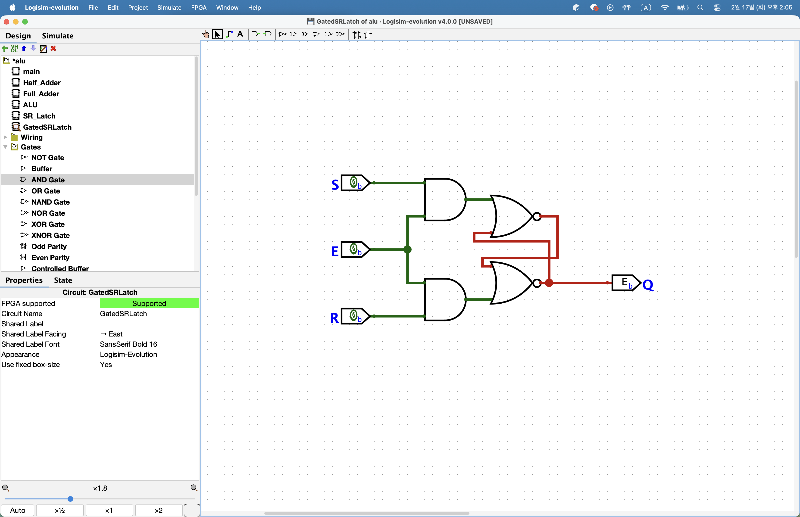

위와 같이 S와 R을 제어하기 위해 Enable이 추가된 회로를 Gated SR Latch라고 부른다.

## D Latch

이번에 만들어 볼 1비트 메모리는 지난 시간에 만들었던 Gated SR Latch를 조금 변형해서 만들 것이다. 이전에 만든 Gated SR Latch는 입력이 S, R, E로 총 3개였다. 우리는 Gated SR Latch에서 1을 저장하기 위해 E를 1로 만들어주고 S를 1로, R을 0으로 설정하였다. 반대로 0을 저장하기 위해서는 E를 1로, S를 0으로 R을 1로 설정해주었다. S가 1일 때는 R이 0, R이 1일 때는 S가 0이므로 정확히 반대로 동작한다. 따라서 이 두 입력을 하나로 묶어도 동작에 문제가 없을 것 같다. 바로 구현해보자.

기존 Gated SR Latch를 가져온다. 여기서 우리는 S와 R을 하나로 만들어주기 때문에 R은 지워주도록 하겠다. 그리고 S의 이름을 Data로 나타내는 D로 변경하자. 마지막으로 D에서 나온 출력을 NOT 게이트와 연결해 아래쪽 AND 게이트의 나머지 입력과 연결해준다.

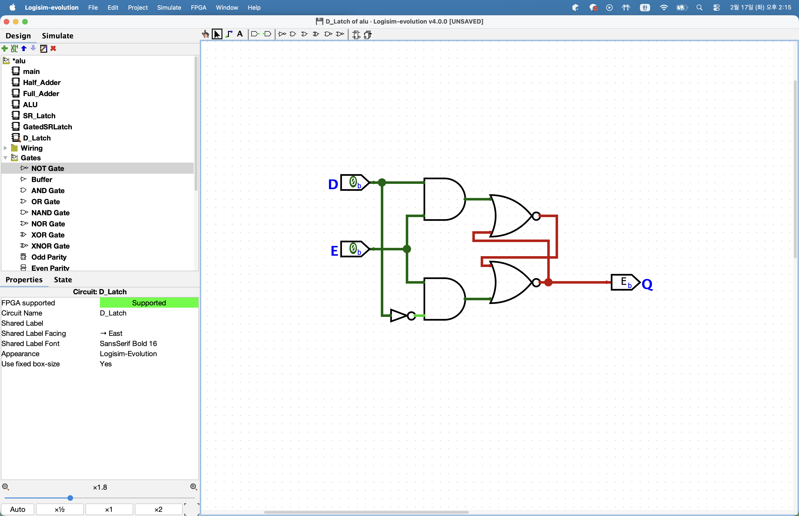

지금 만든 DLatch는 초기 값이 없으므로 초기 출력이 U로 나온다. 이 현상을 없애기 위해서 초기에 Enable 신호를 아주 잠깐 활성화시켜 출력값을 0으로 초기화시켜주자. logisim에는 Power On Reset이라는 회로가 있는데 이 회로는 시뮬레이션이 시작할 때 지정한 시간만큼 활성 신호를 주는 회로이다. 이 회로를 이용하여 수정해보도록 하겠다.

Wiring 폴더로 이동하여 POR을 선택해 배치한다.

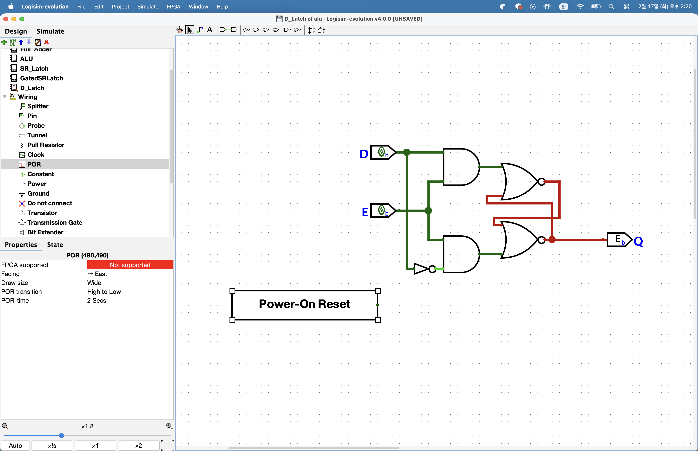

POR 타입을 1초로 변경한다. 그리고 OR 게이트를 배치하고 입력핀 E와 POR을 OR 게이트에 연결해, OR 게이트의 출력을 이전에 E가 연결되었던 선에 연결한다.

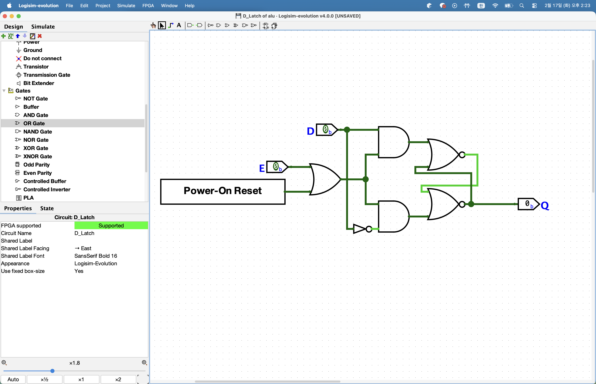

완성이 되었고 앞으로 DLatch를 사용할 때 logisim에 구현되어 있는 것을 사용하겠다.

## JK Latch

이전까지 SR Latch를 시작으로 이를 변형하여 Gated SR Latch, DLatch를 만들어보았다. 이 모두 SR Latch를 조금 변형해서 사용한 것이므로 모두 비슷했다. SR Latch는 두 입력이 모두 1일 때 사용이 불가능하다는 단점이 존재하였다. 이러한 단점을 개선한 회로가 JK Latch 회로이다. JK Latch 역시 SR Latch를 조금 변형한 형태이다. 바로 구현해보자.

기존 Gated SR Latch를 복사하여 입력 핀 S를 J로 R은 K로 변경해준다. 이제 AND 게이트의 입력을 늘려줄건데 각 AND 게이트를 선택하여 Number of Inputs를 3으로 바꿔 3입력 AND 게이트로 변경해준다. 그리고 J와 K를 보기 좋게 AND 게이트의 중앙 입력 핀으로 연결을 조정하고 NOR 게이트의 출력을 다시 AND 게이트의 입력으로 연결해주면 된다.

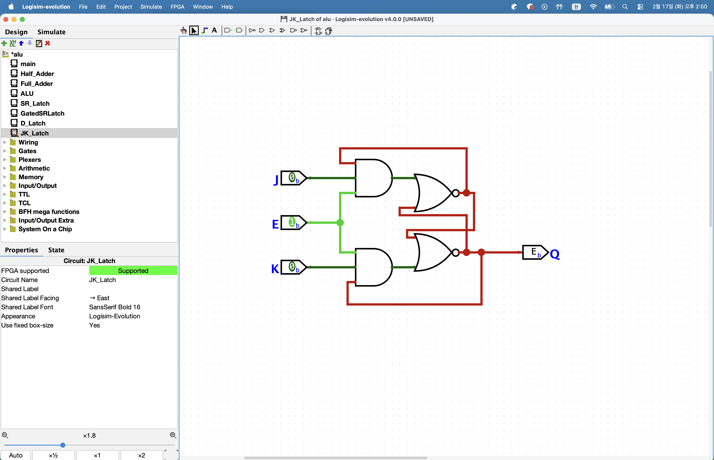

그리고 한번 테스트해보자. 그러면 동작하지 않는 것을 확인할 수 있을 것이다. 그 이유는 우리가 사용하는 이 프로그램은 회로에 딜레이가 없어서 동작하지 않는다. 현실에서 만든 회로는 전기가 흐르면서 동작은 할 것이다. 전류의 속도는 굉장히 빨라서 사람 눈으로 보기엔 눈 깜빡할 사이에 동작하지만 아주 미세하게나마 딜레이가 동작한다. 하지만 이 프로그램은 딜레이 없이 시뮬레이션 하기 때문에 회로가 동작하지 않는다. 따라서 이 프로그램에서 제공하는 내장된 JK Latch를 사용해보겠다.

메모리 폴더로 이동하여 J-K Flip Flop이라는 회로를 가져온다.

> 플립플롭이란 Latch의 클럭이 연결된 회로를 말하는데 이는 클럭을 알아본 후 알아 볼 예정이므로 지금은 그냥 Latch라고 생각하자.

그리고 입력핀과 출력핀을 만들어서 회로와 연결한다. 그리고 테스트하면 정상 동작을 한다.

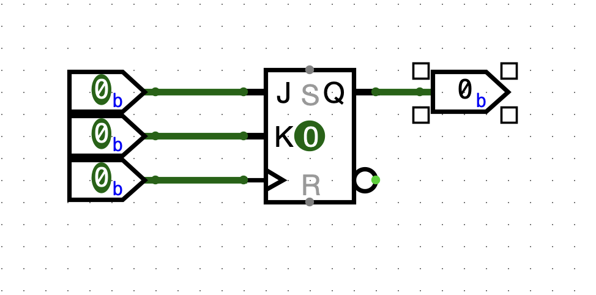

하지만 뭔가 이상하다. 우리가 학습한데로라면 Enable을 껐다가 킬 필요 없이 입력 값만 바꿔주면 출력이 바껴야 하지만 내장된 JK Latch는 그렇지 않다. 이유는 JK Latch 내부에 Enable 입력을 끊어주는 회로가 내장되어 있기 때문이다. 이 회로를 추가한 이유는 클럭을 배우면서 자세히 살펴보자.

다시 JK Latch의 동작 원리에 대해 살펴보자. SR Latch는 두 입력이 모두 1일 때 사용이 불가능하다. 반면 JK Latch는 두 입력이 모두 1일 때 현재 저장된 값을 반전시킨다. 즉, JK Latch의 동작은 기본적으로 SR Latch와 같지만 두 입력이 모두 1일 때 출력 값을 반전하는 Latch이다.

## 클럭과 플립플롭

입력 A와 B를 더하고 C와 D를 더한 결과를 다시 더해 결과적으로 A+B+C+D 회로가 있다고 가정하자. 이 회로를 생각해보았을 때는 덧셈만 하는것에 대해서는 문제가 없어 보인다. 하지만 실제로 실용적인 무언가를 만들 때는 문제가 될 수 있다. 우리가 원하는 것은 A + B + C + D의 결과이다. 하지만 우리가 입력의 데이터를 넣는 과정에서 A + 0 + 0 + 0, A + B + 0 + 0, A + B + C + 0, A + B + C + D가 차례대로 계산이 된 것이다. 따라서 출력도 1, 3, 6, 10으로 단계적으로 바뀐 것을 알 수 있다. 만약 덧셈의 결과가 또 다른 회로로 입력이 된다면 출력된 1, 3, 6, 10에 따라 각각 다른 처리가 이루어졌을 것이다.

> 위와 같은 결과가 일어난 것은 우리가 직접 입력해서 그런 것이 아닌가? 만약 입력이 다른 회로의 출력으로 연결되었다면 동시에 바뀌지 않았을까?

위의 질문에 대한 답변은 맞다! 예시에서 입력 A, B, C, D를 우리가 직접 값을 넣어줬기 때문에 딜레이가 커졌고 이로 인해 출력도 1, 3, 6, 10이 순차적으로 출력된 것이다. 하지만 다른 회로의 출력이 입력으로 연결되었다면 딜레이가 완전히 없어질까?

만약 입력 A, B, C, D가 서로 다른 회로의 출력에서 나왔다고 가정해보자. 이 회로들은 각자의 로직으로 처리되어 출력이 덧셈의 입력으로 전달되는데 회로마다 처리시간이 조금 다르다. 어떤 회로는 간단하지만 어떤 회로는 복잡할 수 있기 때문이다. 만약 A와 연결된 회로의 딜레이가 가장 짧다면 A에만 먼저 가장 유효한 값이 들어 올 것이다. A 회로의 출력이 1이라고 가정한다면 입력 A에는 1이 들어오고 나머지 입력은 아직 0이기 때문에 덧셈의 결과는 1이 될 것이다. 그 다음으로 입력 B에 대한 회로의 딜레이가 짧다면 입력 B의 값이 들어 올 것이다. B의 입력이 2라고 가정한다면 총 결과는 3이 나올 것이다. 그리고 나머지 입력과 연결된 회로도 순서대로 처리되어 6, 10 순서대로 나올 것이다.

이렇게 우리가 직접 입력하는 경우가 아닌 다른 회로의 출력을 입력으로 받더라도 우리가 원하는 값인 10만 나오는 것이 아니라 1, 3, 6, 10을 모두 출력하게 되는 것이다. 딜레이만 짧아졌을 뿐 우리가 원하는 최종 값만 출력되지 않는 문제가 여전히 존재하는 것이다.

> 그러면 이런 문제는 어떻게 해결할끼?

입력과 연결된 회로의 딜레이를 비슷하게 맞추면 되지 않을까? 사실 해당 솔루션은 적합하지 않다. 왜냐하면 어떤 회로는 복잡하고 어떤 회로는 간단한데 이들의 딜레이를 맞추는 것은 사실 상 불가능하다. 따라서 우리는 다른 방법을 고안해야 한다.

바로 메모리를 이용하는 방법이다. 입력 A, B, C, D의 덧셈 결과를 Latch에 연결하고 우리가 원하는 시점에 Latch에 저장해주는 것이다. 기존 회로에 Register를 가져와 덧셈의 결과와 연결해주면 되는 것이다.

> 레지스터란, Latch를 여러개 연결한 메모리를 뜻한다.

그리고 Register의 출력과 출력핀을 연결하고 레지스터의 Enable 핀에 새로운 입력 핀을 연결해준다. 그리고 Enable 핀을 1로 바꾸면 10으로 바로 나오는 것을 확인할 수 있다. 다시 Enable 핀을 0으로 바꾸고 입력 핀들을 임의의 값으로 변경해보겠다. 임의의 값을 바꾸는 동안 출력은 기존 10을 그대로 유지한다. 그리고 레지스터의 Enable을 1로 바꿔주면 출력이 변경되는 것을 알 수 있다.

하지만 지금 이 방법은 계산이 필요한 시점에 누군가가 Enable을 1로 만들어줘야 한다. 누가 이런 것을 해줄까? 사람이 직접 해주기에는 현실적으로 불가능할 것이다. 따라서 Enable을 1과 0을 반복해 바꿔주는 장치가 등장하게 되었다. 바로 **클럭**이라는 장치이다.

클럭은 특정 주파수를 걸러서 신호를 만드는 오실레이터라는 장치로 만들어진다. logisim은 오실레이터는 제공하지 않지만 클럭은 제공하므로 제공되는 클럭을 이용하면 된다. 그러면 기존 Enalbe 핀 대신에 클럭으로 교체를 하고 Simulate -> Auto Tick Frequency로 가서 1Hz로 변경해준다. 다음으로 Simulate -> Auto Tick Enabled를 체크하면 1초 간격으로 신호가 바뀌는 것을 알 수 있다.

만약 클럭이 0인 상태에서 다른 회로의 출력이 입력 A, B, C, D로 들어왔다면 덧셈의 결과는 바뀌지 않을 것이고 클럭이 1이 되는 순간에 변경이 될 것이다. 이제 지금까지 발견한 문제들은 해결되었다. 하지만 새로운 문제가 발생하였다. 만약 클럭이 1인 상태에서 입력 A, B, C, D가 서로 다른 딜레이로 입력되었다면 어떻게 될까? 그러면 클럭이 없었을 때와 달라지는게 없다. 클럭이 1을 출력하는 동안에는 출력 값이 마음대로 변할 수 있기 때문에 이전과 마찬가지로 1, 3, 6, 10이 출력되는 일이 발생할 수도 있다.

이 문제는 어떻게 해결할까? 이 문제를 다루기 위해서 우리는 트리거라는 것을 알아야 한다. 트리거는 Latch의 출력을 활성화 하는 조건을 말한다. 트리거는 크게 레벨 트리거와 엣지 트리거로 나뉜다. 레벨 트리거는 다시 High Level Trigger와 Low Level Trigger로 나뉘고 엣지 트리거는 다시 Rising Edge Trigger와 Falling Edge Trigger로 나뉜다. High Level Trigger는 입력이 1인 동안에만 값이 반영된다. Latch의 Enable이 초록색 영역, 즉 1인 동안에는 계속 값이 변할 수 있다는 뜻이다. 우리가 만든 Latch가 High Level Trigger에 속한다. 반대로 Low Level Trigger는 입력이 0인 동안에만 값이 반영된다. 이 경우는 우리가 만든 Latch의 Enable 값과 반대로 동작할 것이다.

반면 엣지 트리거는 어느 한 순간에만 값이 반영된다. Rising Edge Trigger는 0에서 1로 되는 그 순간에만 값이 변경되고 1인 동안에는 값이 변하지 않는다. 아주 짧은 시간동안만 값이 변할 수 있는 것이다. 반대로 Falling Edge Trigger는 1에서 0으로 되는 그 순간에만 값이 변경되고 0인 동안에는 값이 변하지 않는다.

이제 레벨 트리거와 엣지 트리거를 보았으니 앞서 우리가 직면한 문제를 해결할 수 있다. 우리가 사용한 Latch는 High Level Trigger였다. 이것을 Edge 트리거 형태로 변경해주면 될 것이다. 그렇다면 Rising Edge Trigger는 어떻게 만들까? AND 게이트롸 NOT 게이트 조합으로 구현은 하지만 실제 우리 프로그램에서는 딜레이가 반영이 안되기 때문에 내장된 기능을 잘 사용하면 된다.

> 그런데 우리는 Latch를 학습하고 있는데 회로 이름이 왜 플립플롭일까?

우리가 지금까지 배운 메모리의 이름은 Latch이다. 그리고 Latch의 Enable이 Level Trigger일 때의 단점까지 확인을 하였다. 이 단점을 해결하기 위해 우리는 Edge Trigger를 만들어 Latch와 연결했다. 이렇게 Latch의 Trigger를 Edge Trigger로 변경해주는 것을 플립플롭이라고 부른다.

이제 우리는 클럭에 다른 게이트를 연결해서 클럭을 멈출 수 있도록 해보겠다. Wiring에 clock을 선택해 설치하고 Control Buffer를 설치해 클럭과 연결해주고 출력핀을 만들어 이름을 CLOCK_OUT으로 변경한 후 Control Buffer와 연결해준다. 그리고 이 클럭을 멈출 수 있도록 컨트롤 해주는 입력 핀을 만들어 이름을 HLT로 변경하고 NOT 게이트와 연결해 Controll Buffer의 Enable 핀과 연결해준다.

## 레지스터

우리은 1비트를 저장하기 위한 회로인 래치와 플립플롭을 만들어 보았다. Latch는 Level Trigger, FlipFlop은 Edge Trigger로 동작하는 1비트 메모리이다. 이번에는 여러 비트를 저장할 수 있는 레지스터라는 메모리를 만들어보겠다. 여러 비트를 저장하려면 당연히 1비트도 저장을 할 수 있어야 할 것이다. 1비트를 저장할 수 있는 Latch와 FlipFlop이 있으므로 둘 중 하나를 이용하면 된다. Level Trigger로 동작하는 레지스터를 만들고 싶다면 Latch를, Edge Trigger로 동작하는 레지스터를 만들고 싶다면 FlipFlop을 이용하면 된다. FlipFlop으로 만들 때는 Enable 신호에 클럭을 연결해주면 된다.

우리는 Level Trigger로 동작하는 레지스터를 만들 것이기에 Latch를 이용하도록 하겠다. 우리는 8비트 컴퓨터를 만들것이기에 레지스터도 8비트로 만들어주면 된다. 먼저 8비트 입력핀과 출력핀을 각각 만들어준다.

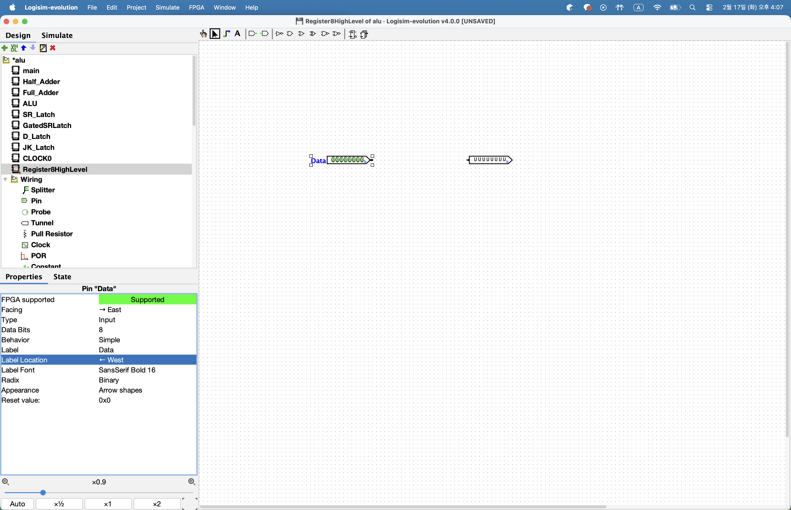

그리고 각 비트를 레지스터로 저장하기 위해 Splitter로 만들어 비트를 분리해주도록 하겠다.

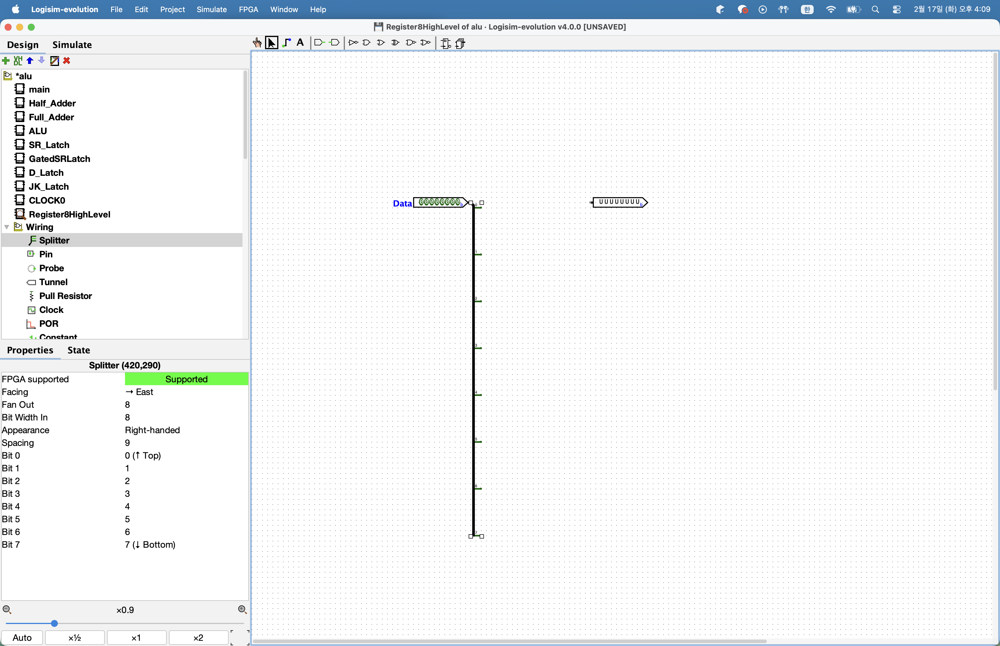

Splitter를 하나 더 배치하여 출력핀과 연결해준다.

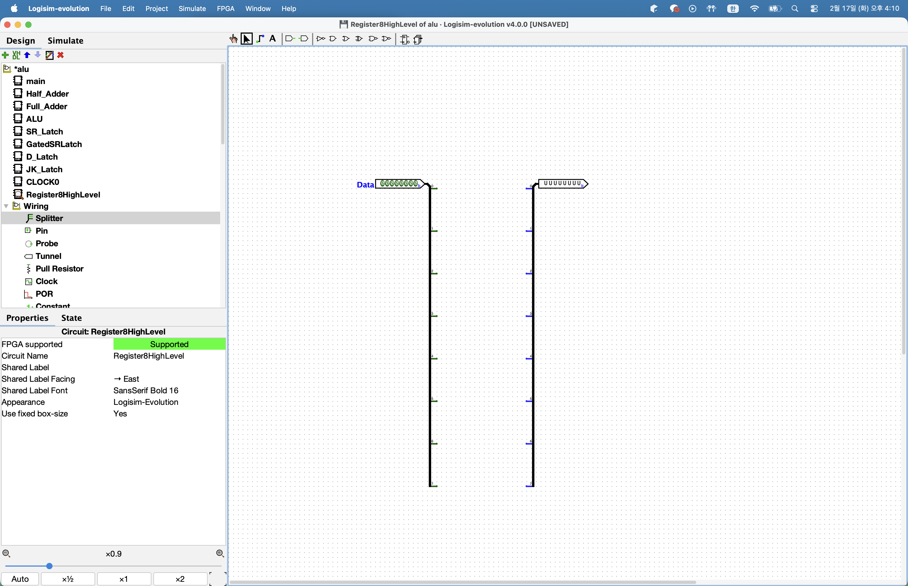

이제 Latch를 연결해주겠다. 메모리 폴더에서 D-FlipFlop을 가져오고 Trigger를 High Level로 바꿔서 D Latch로 변경해 준다. 그리고 0번 입력 핀을 Latch의 입력 핀 D에 연결해주고 출력핀 Q는 0번 출력핀에 연결해준다.

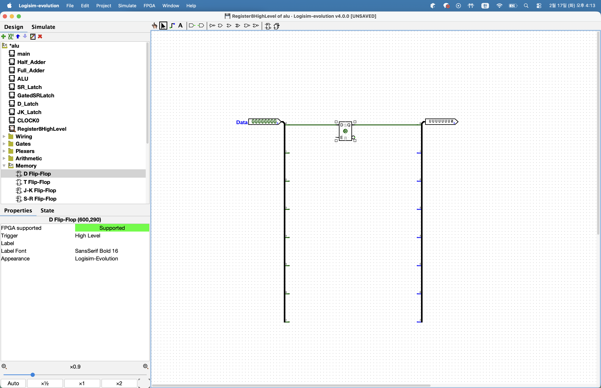

이제 Latch의 Enable 핀도 설정해줘야 한다. 입력 핀을 하나 만들어 이름을 Load로 변경해주고 Latch의 Enable과 연결해준다.

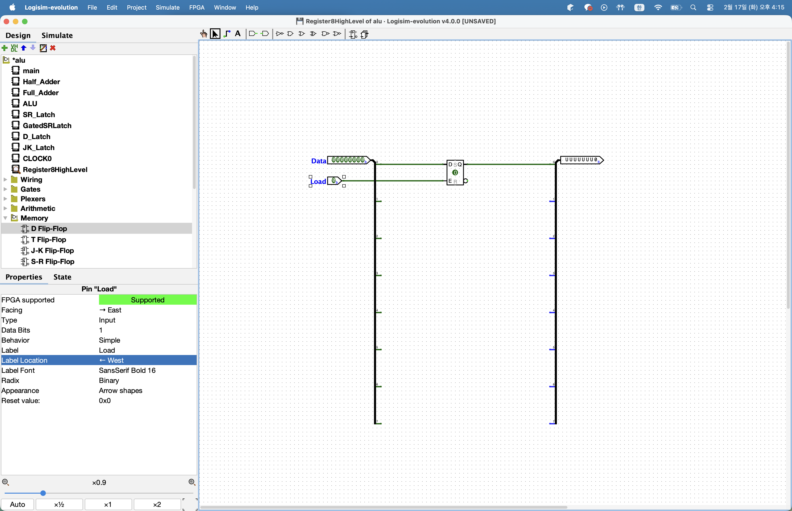

지금은 1비트만 저장하도록 만들었다. 이제 나머지 7개 핀도 Latch를 만들어 연결해준다. 그러면 레지스터가 완성된다.

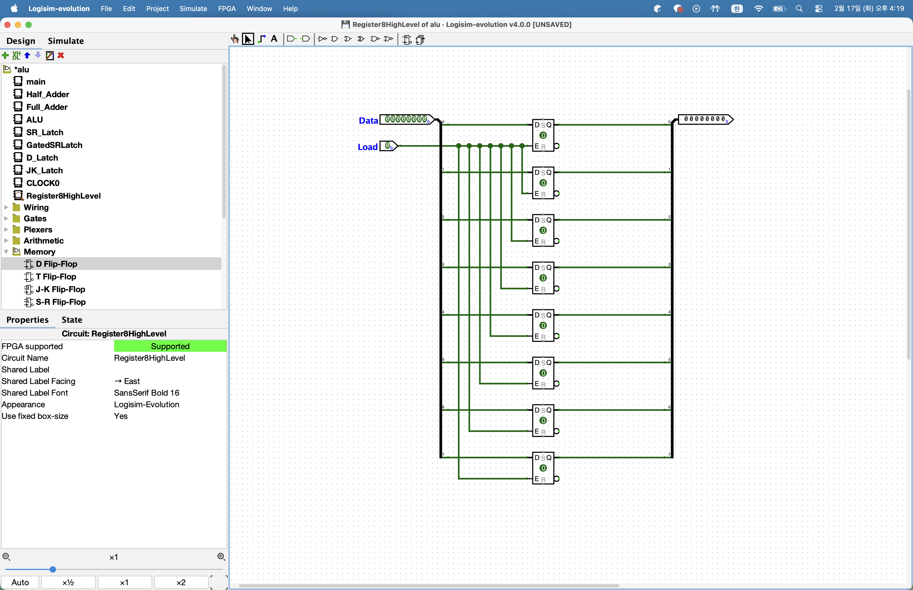

여기서 우리는 1가지 회로를 더 추가하겠다. 바로 출력을 할지 말지 결정하는 입력이다. 이를 Enable이라고 부르겠다. Enable이 1이면 현재 레지스터에 저장된 값을 출력하고 0이면 아무 값도 출력하지 않도록 만들어 보겠다. 이는 이전에 만들었던 Control Buffer를 이용하면 쉽게 구현할 수 있다. 1비트 입력핀을 추가로 만들어 이름을 Enable이라고 변경하자. 그리고 D Latch와 연결된 모든 선을 제거한 후 사이에 Controll Buffer를 설치해주겠다. 그리고 Controll Buffer의 Enable 핀에 Enable 입력핀을 연결해주면 된다. 그리고 Latch의 출력을 Control Buffer와 연결해준다.

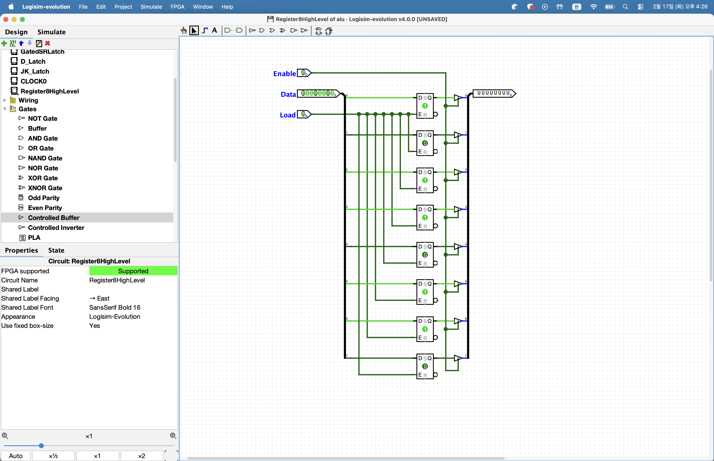

이렇게 레지스터의 구현은 끝났는데 편의성을 위한 회로 하나만 더 추가하도록 하겠다. 지금은 8개의 Latch가 값이 따로 저장되어 한눈에 보기에는 편하지 않다. Latch의 저장된 값을 16진수로 표현해주는 Hex Digit Display를 이용하여 조금 더 보기 편하게 만들어보자. 16진수는 4개의 비트를 이용해 표현할 수 있기 때문에 8비트를 표현하려면 2개의 16진수가 필요하다. Input/Output 폴더를 선택해 Hex Digit Display를 2개 설치한다.

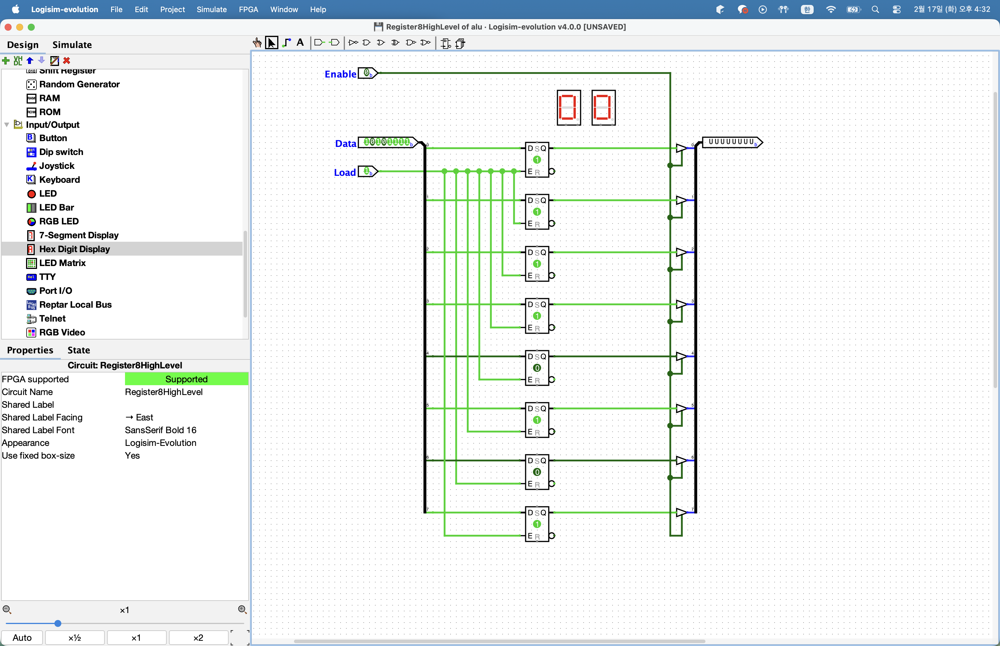

여기서 왼쪽에 있는 Display는 MSB를 포함한 상위 4개의 비트를 포함하는 것이고 오른쪽에 있는 Display는 하위 4개의 비트를 포함하는 것이다. 먼저 오른쪽 디스플레이부터 완성해보자. Splitter를 설치하고 각각 아래처럼 연결해주자.

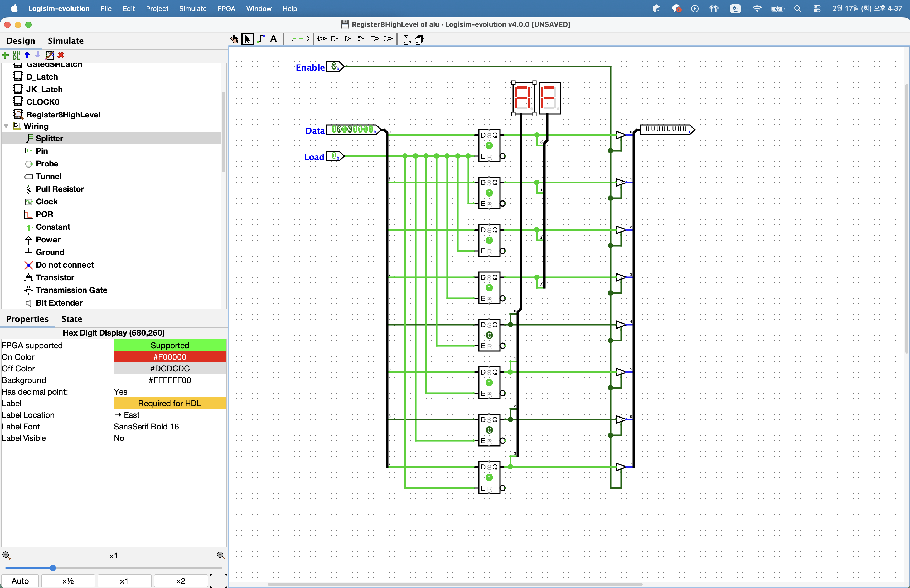

## RAM

이번에 만들어 볼 것은 RAM이다. 우리는 1비트를 저장하기 위해 Latch나 FlipFlop을 만들었고, 8비트로 표현되는 데이터 하나를 저장하기 위해서 레지스터를 만들어 보았다. RAM은 컴퓨터가 계산에 필요한 명령어와 데이터들이 저장되는 메모리로 수많은 데이터를 저장하기 위해서 수많은 레지스터를 이용한다. 우리가 만들고 있는 컴퓨터는 8비트이므로 명령어의 길이도 8비트이다. 우리는 8비트에서 MSB를 포함한 4비트는 명령어로 사용하고 LSB를 포함한 4비트는 메모리 주소를 가리키는 값으로 사용할 것이다. 메모리 주소를 가리키는 비트가 4비트이므로 표현할 수 있는 메모리 주소의 크기는 16개가 된다. 메모리에 접근할 수 있는 주소가 16개이므로 지금 만든 RAM의 주소공간도 16개까지 만들면 된다. RAM의 각 주소 공간에는 레지스터가 존재하고 레지스터는 8비트, 즉 1 바이트로 구성되기 때문에 RAM의 크기는 16바이트가 된다.

요즘 컴퓨터에서 사용되는 RAM의 크기는 최소 4GB, 약 42억 바이트로 구성되어 있는 것이 기본이지만 우리가 만드는 RAM은 16바이트로 크기가 굉장히 작다. 하지만 이는 간단한 구조로 컴퓨터의 구조를 이해하는데는 더 수월할 것이다. 그럼 본격적으로 RAM을 만들어보자.

먼저 입력 핀 4개를 만들어보자. 이 중 하나는 RAM의 주소를 선택하는 입력으로 이름을 ADDRESS로 변경해주고 Data Bits를 4로 변경한다. 다음은 저장할 데이터를 입력받는 핀으로 이름을 DATA_IN으로 변경하고 Data Bits를 8로 설정한다. 다음은 쓰기를 활성화하는 핀으로 이름을 ENABLE_WRITE로 변경하고 마지막은 출력을 활성화하는 핀으로 이름을 ENALBE_OUT으로 변경해준다.

이제 RAM의 0번 주소에 쓰기를 할 수 있는 회로를 만들어 보자. 이전에 만들었었던 4비트 디코더를 이용할 것이다. 4비트 디코더를 배치해주고 ADDRESS 핀을 디코더의 SELECTION 핀에 연결해주고 ENABLE_WRITE 핀을 디코더의 ENALBE에 연결한다.

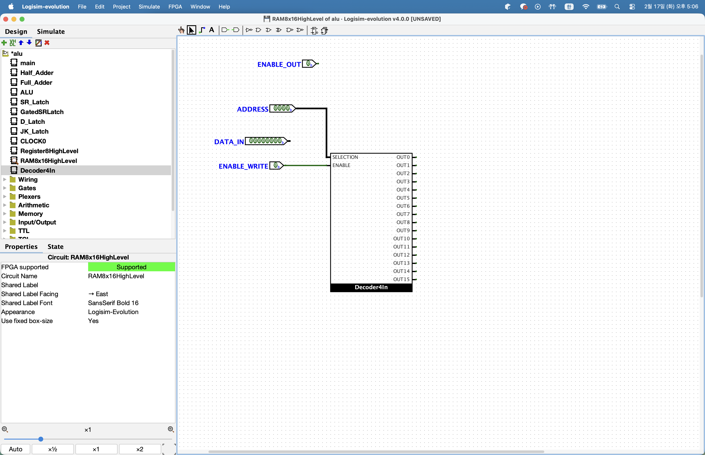

이전에 만든 레지스터를 가져와 배치하고 디코더의 출력 OUT0와 레지스터의 Load핀을 연결한다. 그리고 DATA_IN 핀을 레지스터의 IN 입력으러 넣어주면 끝이다.

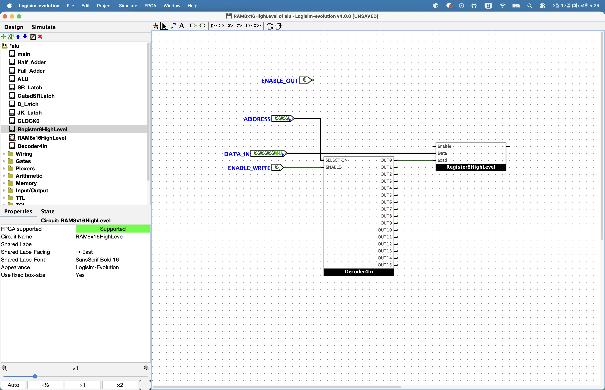

이제 RAM의 1번 주소에 쓰기를 할 수 있는 회로를 만들자. 레지스터를 복사해 아래쪽으로 옮겨주고 디코더 출력 OUT1를 1번 레지스터의 LOAD와 연결해주고 DATA_IN 핀을 1번 레지스터 IN과 연결해준다. 이런 방식으로 15번 레지스터까지 쭉 만들어준다. 이렇게 0번부터 15번 주소까지 16바이트 데이터를 저장할 수 있는 회로가 완성되었다. 현재는 원하는 주소의 쓰기만 가능한 상태이다. 이번에는 원하는 주소에 데이터를 읽을 수 있는 회로를 추가해보겠다. 이전에 8비트 16입력 MUX를 만들었는데 이 회로를 사용하면 된다.

Plexer 폴더로 이동하여 멀티플렉서를 가져와 배치한다. 그리고 select bit를 4로 Data bits를 8로 Select Location을 Top/Right로 변경해준다. 그리고 주소를 선택하는 ADDRESS 핀을 MUX의 select핀과 연결해주고 Enable out핀을 모든 레지스터의 출력을 활성화하는 Enable핀에 연결해준다. 다음으로 0번 레지스터의 출력을 MUX의 0번 입력으로 연결해주고 최종 출력핀을 만들어 8비트로 변경한 후 MUX의 출력과 연결해준다. 나머지 1번부터 15번도 이와 같이 해주면 아래와 같이 완성이 된다.

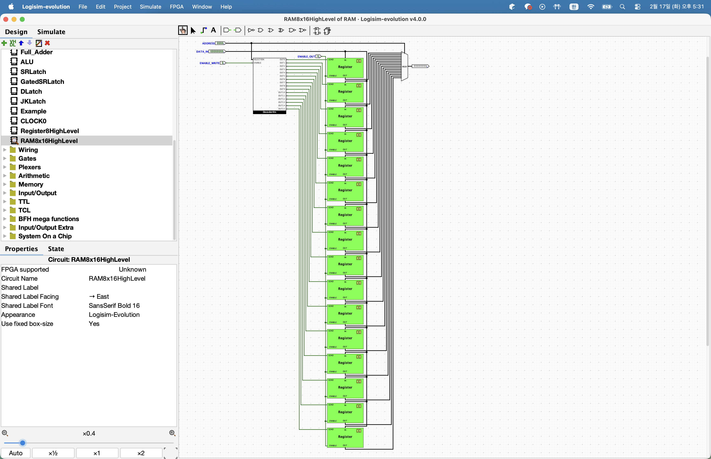

## ALU 업그레이드

지금까지 우리는 메모리를 구성하는 모듈을 만들어보았다. 1비트를 저장할 수 있는 Latch와 FlipFlop, 이를 이용해 더 많은 비트를 저장할 수 있는 레지스터, 그리고 레지스터를 활용하여 RAM을 만들어보았다. 이번에는 ALU의 2가지 flag, CF와 ZF를 레지스터에 저장해보겠다. 기존 ALU 회로도에 메모리 폴더를 열어서 레지스터를 배치한다. 8비트 레지스터인데 LSB를 포함한 하위 2비트만 사용하면 되기 때문에 Splitter로 비트를 분리해주겠다.

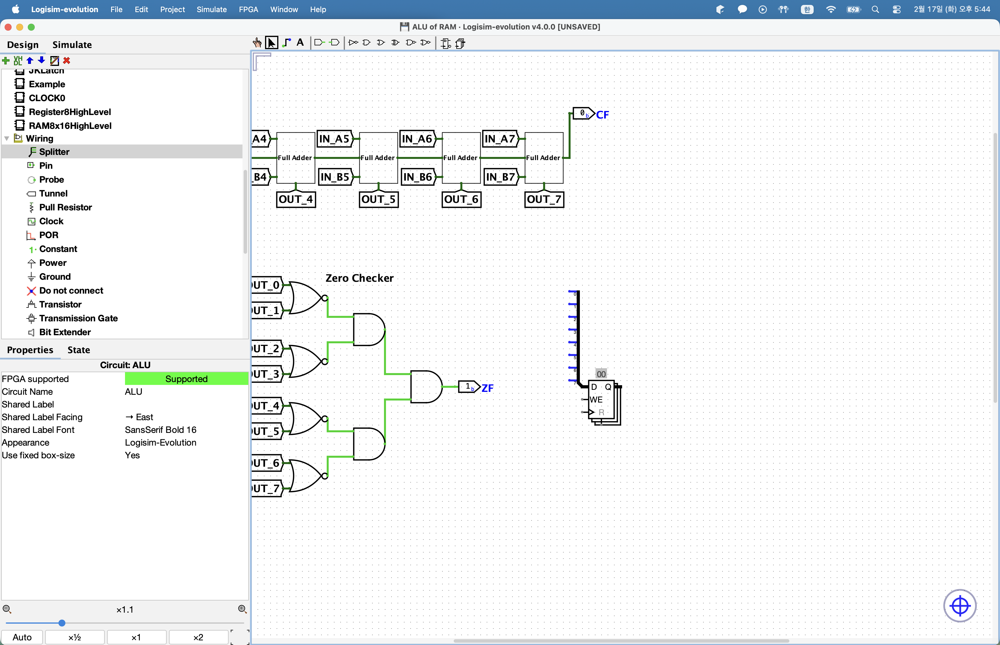

그리고 0번 비트엔 CF핀과 연결된 선을 연결하고 1번 핀에는 ZF핀과 연결된 선을 연결한다.

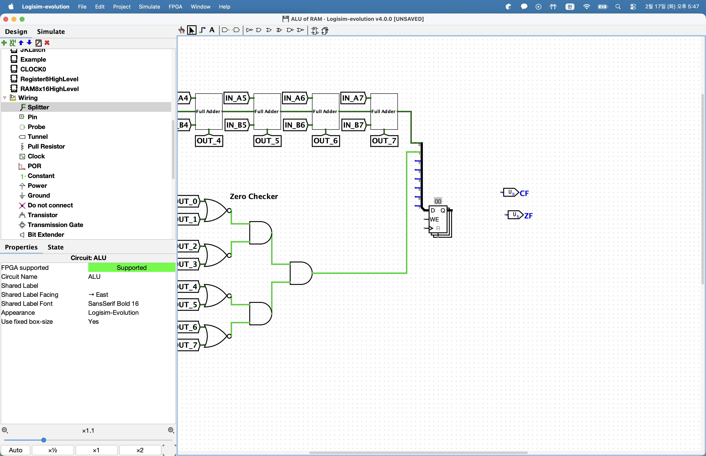

Splitter를 복사하여 레지스터와 연결해주고 0번 핀은 CF핀과 연결하고 1번핀은 ZF핀에 연결한다. 또한 이 레지스터는 Rising Edge 레지스터이므로 클럭도 연결을 해줘야 한다. 입력핀 하나를 만들어 CLK라는 이름을 붙이고 터널을 만들어 연결해준다.

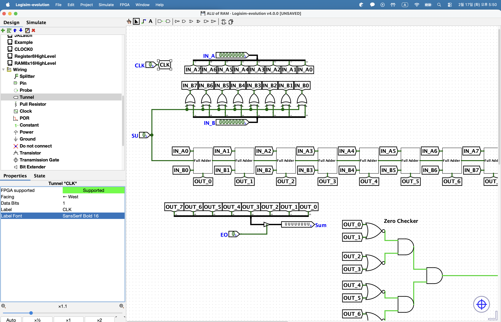

그리고 플래그를 저장할지를 결정하는 입력핀을 만들어주겠다. 입력핀을 만들어 FI라고 이름을 변경하고 터널을 만들어 연결해준다.

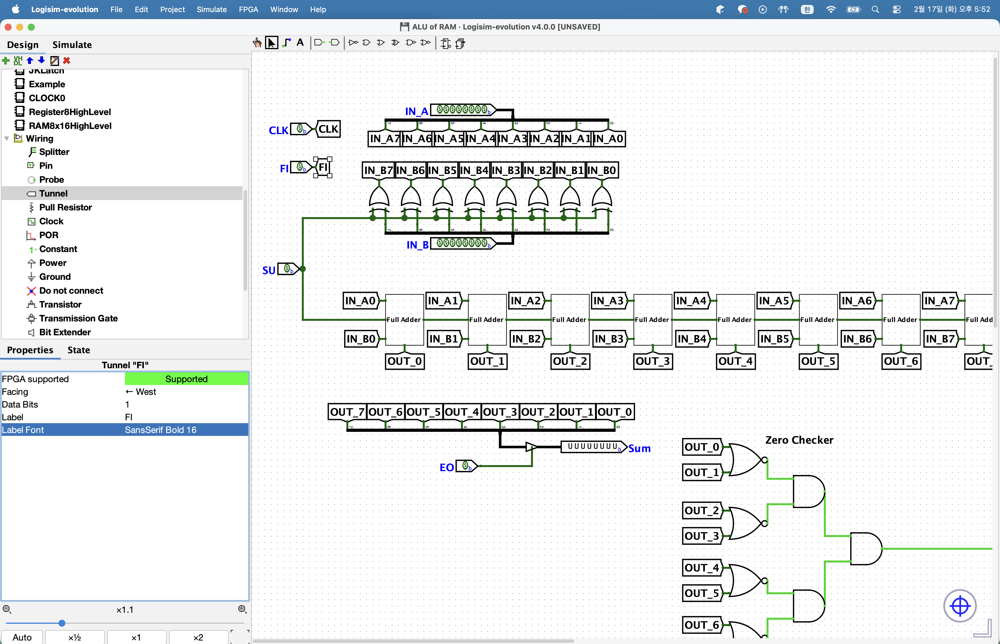

그리고 이 터널을 레지스터와 연결해준다. FI 터널을 만들어 레지스터의 WE와 연결해주고 CLK 터널을 만들어 레지스터의 Clock핀과 연결해준다. 그러면 이전 ALU에 이전 계산 결과를 저장할 수 있게 발전되었다.