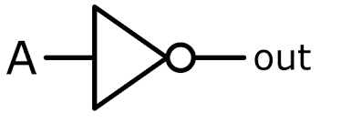
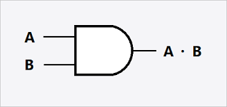
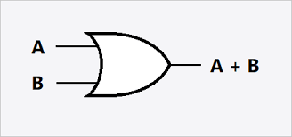
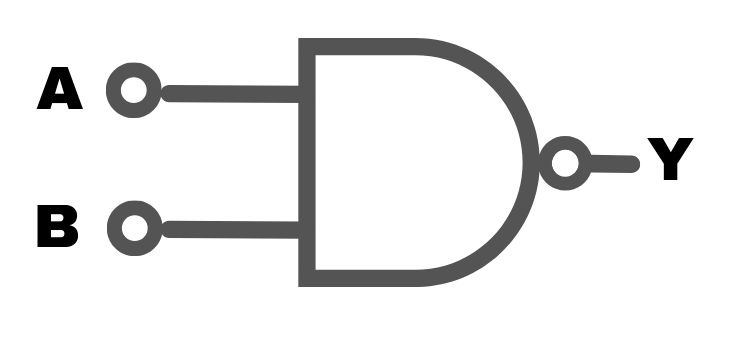
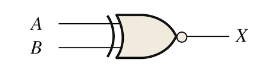
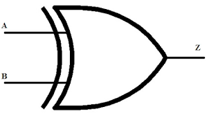
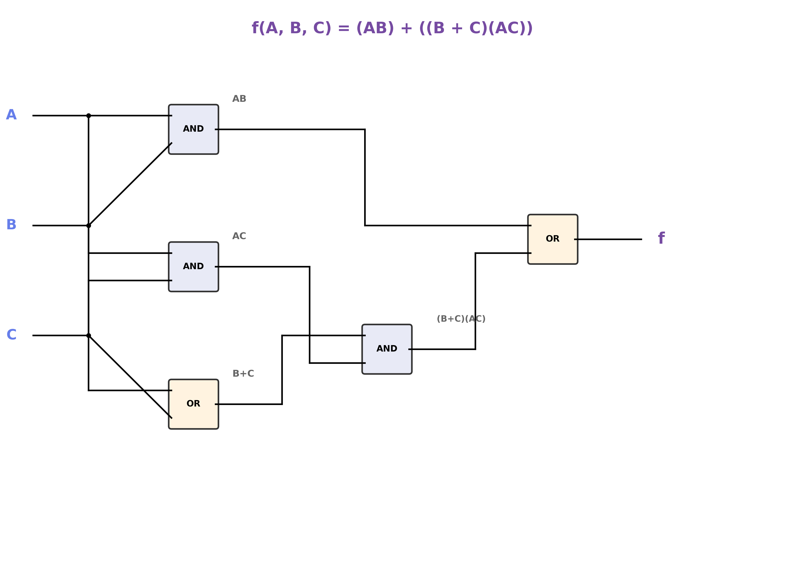
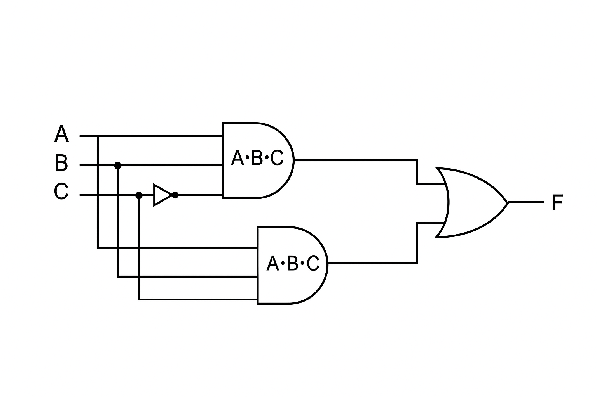
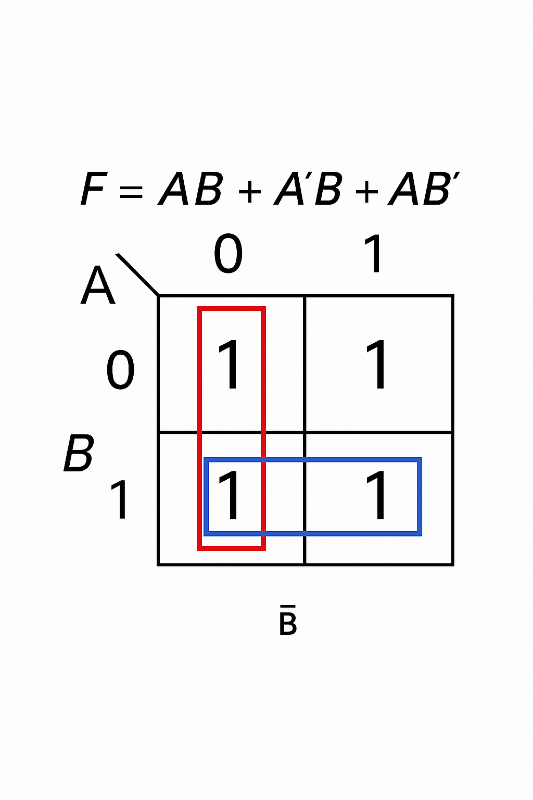

> 본 포스팅은 인프런의 [만들면서 쉽게 배우는 컴퓨터 구조](https://inf.run/PnrRu)를 참조하여 작성한 글입니다.

## 불 대수 개요

컴퓨터의 역사에서 알아본 것처럼 19세기까지 컴퓨터는 수동식이나 기계식으로 10진수를 이용했다. 이후에 클로드 새넌이라는 분이 불대수의 사칙연산이 가능하다는 것을 증명하면서 디지털의 시대의 문을 열었다. 오늘날 전기를 이용하는 장치들은 디지털 장치이며 모든 디지털 장치는 불 대수를 기반으로 작동한다.

불 대수는 일반 수학과 달리 0과 1, 또는 거짓과 참으로 표현되는 2가지 상태의 논리 값을 사용한다. 이런 2가지 상태로도 모든 계산이 가능하다.

> 그러면 불 대수는 어디서 사용이 가능할까?

불 대수는 다양한 분야에서 활용된다. 가장 대표적으로 디지털 논리 회로에서 사용이 많이 된다. 과거에는 릴레이 스위치가 스위치 역할을 하여 해당 값을 표현하였지만 기술이 발전함에 따라 트랜지스터가 이를 대체하였다. 불 대수는 디지털 논리 회로뿐만 아니라 0과 1로 표현되는 모든 영역에서 활용되곤 한다. 예를 들어, 프로그래밍 언어에서 조건문과 반복문에 사용되곤 한다.

``` c
if ((a > b) && (b < c))
{
  // 로직..
}
```

불 대수를 이용하면 위와 같은 조건식을 단순화 하거나 동일한 논리를 변형할 수 있다. 개발자가 프로그래밍을 하면서 다루는 수는 사실 수 많은 비트로 이루어져 있는데 불 대수를 통해 이 비트들로 다양한 연산이 가능하다. 또한 데이터베이스 쿼리 작성 시에도 불 대수를 활용하면 논리를 더 깔끔하게 정의하거나 다른 형태로 변환할 수 있다.

## 불 연산

불 대수에서 가장 먼저 다뤄 볼 것은 0과 1 2가지 값만 가지고 있는 논리 연산이다. 이 논리 연산을 불 연산이라고 부른다. 불 연산에서 가장 먼저 알아 볼 연산은 NOT 연산이다.

### NOT 연산

NOT 연산은 입력 값을 반전 시킨다. 입력 값이 0이면 1로 1이면 0으로 반전시키는 것이다. 불 대수에서 NOT 연산을 표현할 때는 변수에 작은 따옴표를 붙이거나 변수 위에 bar 기호를 붙인다.

> NOT A: A' 혹은 A&#773;로 표현한다.

이를 논리 회로로 표현하면 아래와 같으며 이 회로를 NOT 게이트라고 부른다.



입력 값에 따른 출력 값을 정리한 표를 진리표라고 부른다. 진리표만 보면 이 회로가 어떻게 동작하는지 알 수 있다. NOT 게이트의 진리표는 아래와 같다.

<table style="border-collapse: collapse; width: 100%; max-width: 400px; margin: 20px auto; box-shadow: 0 2px 8px rgba(0,0,0,0.1); border-radius: 8px; overflow: hidden;">
  <thead>
    <tr style="background: linear-gradient(135deg, #667eea 0%, #764ba2 100%);">
      <th style="padding: 15px; color: white; font-weight: 600; text-align: center; border: none;">입력 (A)</th>
      <th style="padding: 15px; color: white; font-weight: 600; text-align: center; border: none;">출력 (NOT A)</th>
    </tr>
  </thead>
  <tbody>
    <tr style="background-color: #f8f9fa;">
      <td style="padding: 12px; text-align: center; border-bottom: 1px solid #e9ecef; color:black; font-size: 16px;">0</td>
      <td style="padding: 12px; text-align: center; border-bottom: 1px solid #e9ecef; font-size: 16px; font-weight: 600; color: #28a745;">1</td>
    </tr>
    <tr style="background-color: #ffffff;">
      <td style="padding: 12px; color:black; text-align: center; font-size: 16px;">1</td>
      <td style="padding: 12px; text-align: center; font-size: 16px; font-weight: 600; color: #dc3545;">0</td>
    </tr>
  </tbody>
</table>

### AND 연산

다음으로 살펴 볼 연산은 AND 연산이다. AND 연산을 논리 회로로 표현하면 아래와 같으며 이를 AND 게이트라고 부른다.



AND 연산은 2개 이상의 피연산자를 가지며 모든 피연산자가 1일때만 결과 값이 1을, 그 외에는 0을 출력한다. AND 연산의 진리표는 다음과 같다.

<table style="border-collapse: collapse; width: 100%; max-width: 500px; margin: 20px auto; box-shadow: 0 2px 8px rgba(0,0,0,0.1); border-radius: 8px; overflow: hidden;">
  <thead>
    <tr style="background: linear-gradient(135deg, #667eea 0%, #764ba2 100%);">
      <th style="padding: 15px; color: white; font-weight: 600; text-align: center; border: none;">입력 A</th>
      <th style="padding: 15px; color: white; font-weight: 600; text-align: center; border: none;">입력 B</th>
      <th style="padding: 15px; color: white; font-weight: 600; text-align: center; border: none;">출력 (A AND B)</th>
    </tr>
  </thead>
  <tbody>
    <tr style="background-color: #f8f9fa;">
      <td style="padding: 12px; text-align: center; border-bottom: 1px solid #e9ecef; font-size: 16px; color: black;">0</td>
      <td style="padding: 12px; text-align: center; border-bottom: 1px solid #e9ecef; font-size: 16px; color: black;">0</td>
      <td style="padding: 12px; text-align: center; border-bottom: 1px solid #e9ecef; font-size: 16px; font-weight: 600; color: #dc3545;">0</td>
    </tr>
    <tr style="background-color: #ffffff;">
      <td style="padding: 12px; text-align: center; border-bottom: 1px solid #e9ecef; font-size: 16px; color: black;">0</td>
      <td style="padding: 12px; text-align: center; border-bottom: 1px solid #e9ecef; font-size: 16px; color: black;">1</td>
      <td style="padding: 12px; text-align: center; border-bottom: 1px solid #e9ecef; font-size: 16px; font-weight: 600; color: #dc3545;">0</td>
    </tr>
    <tr style="background-color: #f8f9fa;">
      <td style="padding: 12px; text-align: center; border-bottom: 1px solid #e9ecef; font-size: 16px; color: black;">1</td>
      <td style="padding: 12px; text-align: center; border-bottom: 1px solid #e9ecef; font-size: 16px; color: black;">0</td>
      <td style="padding: 12px; text-align: center; border-bottom: 1px solid #e9ecef; font-size: 16px; font-weight: 600; color: #dc3545;">0</td>
    </tr>
    <tr style="background-color: #ffffff;">
      <td style="padding: 12px; text-align: center; font-size: 16px; color: black;">1</td>
      <td style="padding: 12px; text-align: center; font-size: 16px; color: black;">1</td>
      <td style="padding: 12px; text-align: center; font-size: 16px; font-weight: 600; color: #28a745;">1</td>
    </tr>
  </tbody>
</table>

AND 연산의 진리표를 보면 입력 값에 대한 곱이 출력 값인것처럼 보인다. 이런 특징 때문에 AND 연산은 논리 곱이라고도 말하며 곱셈 기호로 표현한다.

### OR 연산

다음으로 알아 볼 연산은 OR 연산이다. OR 연산을 논리회로로 표현하면 아래와 같다.



이를 OR 게이트라고 부른다. OR 연산은 AND 연산자처럼 2개 이상의 피연산자를 가진다. 진리표는 아래와 같다.

<table style="border-collapse: collapse; width: 100%; max-width: 500px; margin: 20px auto; box-shadow: 0 2px 8px rgba(0,0,0,0.1); border-radius: 8px; overflow: hidden;">
  <thead>
    <tr style="background: linear-gradient(135deg, #667eea 0%, #764ba2 100%);">
      <th style="padding: 15px; color: white; font-weight: 600; text-align: center; border: none;">입력 A</th>
      <th style="padding: 15px; color: white; font-weight: 600; text-align: center; border: none;">입력 B</th>
      <th style="padding: 15px; color: white; font-weight: 600; text-align: center; border: none;">출력 (A OR B)</th>
    </tr>
  </thead>
  <tbody>
    <tr style="background-color: #f8f9fa;">
      <td style="padding: 12px; text-align: center; border-bottom: 1px solid #e9ecef; font-size: 16px; color: black;">0</td>
      <td style="padding: 12px; text-align: center; border-bottom: 1px solid #e9ecef; font-size: 16px; color: black;">0</td>
      <td style="padding: 12px; text-align: center; border-bottom: 1px solid #e9ecef; font-size: 16px; font-weight: 600; color: #dc3545;">0</td>
    </tr>
    <tr style="background-color: #ffffff;">
      <td style="padding: 12px; text-align: center; border-bottom: 1px solid #e9ecef; font-size: 16px; color: black;">0</td>
      <td style="padding: 12px; text-align: center; border-bottom: 1px solid #e9ecef; font-size: 16px; color: black;">1</td>
      <td style="padding: 12px; text-align: center; border-bottom: 1px solid #e9ecef; font-size: 16px; font-weight: 600; color: #28a745;">1</td>
    </tr>
    <tr style="background-color: #f8f9fa;">
      <td style="padding: 12px; text-align: center; border-bottom: 1px solid #e9ecef; font-size: 16px; color: black;">1</td>
      <td style="padding: 12px; text-align: center; border-bottom: 1px solid #e9ecef; font-size: 16px; color: black;">0</td>
      <td style="padding: 12px; text-align: center; border-bottom: 1px solid #e9ecef; font-size: 16px; font-weight: 600; color: #28a745;">1</td>
    </tr>
    <tr style="background-color: #ffffff;">
      <td style="padding: 12px; text-align: center; font-size: 16px; color: black;">1</td>
      <td style="padding: 12px; text-align: center; font-size: 16px; color: black;">1</td>
      <td style="padding: 12px; text-align: center; font-size: 16px; font-weight: 600; color: #28a745;">1</td>
    </tr>
  </tbody>
</table>

피연산자 중 하나라도 1이면 결과 값으로 1을 출력하고 모든 피연산자가 0일 때만 0을 출력한다. OR 연산의 진리표를 확인해보면 입력에 대한 출력이 두 입력을 더한것과 같은 유사한 패턴이 보인다. 따라서 불 대수에서는 OR 연산을 덧셈기호로 표기하며 이를 논리합이라고도 부른다.

### NAND 연산

다음으로 알아 볼 연산은 NAND 연산이다. NAND 연산을 논리회로로 표현하면 아래와 같다.



이는 AND 게이트에 동그라미 하나가 더 붙은 모습으로 NAND 게이트라고 부른다. NAND 연산은 2개 이상의 피연산자를 가지며, AND 연산의 결과에 NOT 연산을 한번 더 수행하는 연산이다. NAND 연산의 진리표를 보면 AND 연산의 출력과 정 반대임을 알 수 있다.

<table style="border-collapse: collapse; width: 100%; max-width: 500px; margin: 20px auto; box-shadow: 0 2px 8px rgba(0,0,0,0.1); border-radius: 8px; overflow: hidden;">
  <thead>
    <tr style="background: linear-gradient(135deg, #667eea 0%, #764ba2 100%);">
      <th style="padding: 15px; color: white; font-weight: 600; text-align: center; border: none;">입력 A</th>
      <th style="padding: 15px; color: white; font-weight: 600; text-align: center; border: none;">입력 B</th>
      <th style="padding: 15px; color: white; font-weight: 600; text-align: center; border: none;">출력 (A NAND B)</th>
    </tr>
  </thead>
  <tbody>
    <tr style="background-color: #f8f9fa;">
      <td style="padding: 12px; text-align: center; border-bottom: 1px solid #e9ecef; font-size: 16px; color: black;">0</td>
      <td style="padding: 12px; text-align: center; border-bottom: 1px solid #e9ecef; font-size: 16px; color: black;">0</td>
      <td style="padding: 12px; text-align: center; border-bottom: 1px solid #e9ecef; font-size: 16px; font-weight: 600; color: #28a745;">1</td>
    </tr>
    <tr style="background-color: #ffffff;">
      <td style="padding: 12px; text-align: center; border-bottom: 1px solid #e9ecef; font-size: 16px; color: black;">0</td>
      <td style="padding: 12px; text-align: center; border-bottom: 1px solid #e9ecef; font-size: 16px; color: black;">1</td>
      <td style="padding: 12px; text-align: center; border-bottom: 1px solid #e9ecef; font-size: 16px; font-weight: 600; color: #28a745;">1</td>
    </tr>
    <tr style="background-color: #f8f9fa;">
      <td style="padding: 12px; text-align: center; border-bottom: 1px solid #e9ecef; font-size: 16px; color: black;">1</td>
      <td style="padding: 12px; text-align: center; border-bottom: 1px solid #e9ecef; font-size: 16px; color: black;">0</td>
      <td style="padding: 12px; text-align: center; border-bottom: 1px solid #e9ecef; font-size: 16px; font-weight: 600; color: #28a745;">1</td>
    </tr>
    <tr style="background-color: #ffffff;">
      <td style="padding: 12px; text-align: center; font-size: 16px; color: black;">1</td>
      <td style="padding: 12px; text-align: center; font-size: 16px; color: black;">1</td>
      <td style="padding: 12px; text-align: center; font-size: 16px; font-weight: 600; color: #dc3545;">0</td>
    </tr>
  </tbody>
</table>

불 대수에서 NAND 연산은 AND 연산 위에 bar를 추가하여 표기한다.

> A&#773;B&#773;

디지털 논리 회로에서 NAND 게이트는 매우 중요하다. NAND 게이트만으로도 모든 논리 회로를 구성할 수 있기 때문이다.

### NOR 연산

다음으로 알아 볼 연산은 NOR 연산이다. NOR 연산을 논리회로로 표현하면 아래와 같다.



OR 게이트에 동그라미 하나가 더 붙은 모습으로 이를 NOR 게이트라고 부른다. NOR 연산은 2개 이상의 피연산자를 가지며 OR 연산의 결과에 NOT 연산을 한번 더 수행하는 연산이다. NOR 연산의 진리표를 보면 OR 연산의 반대임을 알 수 있다.

<table style="border-collapse: collapse; width: 100%; max-width: 500px; margin: 20px auto; box-shadow: 0 2px 8px rgba(0,0,0,0.1); border-radius: 8px; overflow: hidden;">
  <thead>
    <tr style="background: linear-gradient(135deg, #667eea 0%, #764ba2 100%);">
      <th style="padding: 15px; color: white; font-weight: 600; text-align: center; border: none;">입력 A</th>
      <th style="padding: 15px; color: white; font-weight: 600; text-align: center; border: none;">입력 B</th>
      <th style="padding: 15px; color: white; font-weight: 600; text-align: center; border: none;">출력 (A NOR B)</th>
    </tr>
  </thead>
  <tbody>
    <tr style="background-color: #f8f9fa;">
      <td style="padding: 12px; text-align: center; border-bottom: 1px solid #e9ecef; font-size: 16px; color: black;">0</td>
      <td style="padding: 12px; text-align: center; border-bottom: 1px solid #e9ecef; font-size: 16px; color: black;">0</td>
      <td style="padding: 12px; text-align: center; border-bottom: 1px solid #e9ecef; font-size: 16px; font-weight: 600; color: #28a745;">1</td>
    </tr>
    <tr style="background-color: #ffffff;">
      <td style="padding: 12px; text-align: center; border-bottom: 1px solid #e9ecef; font-size: 16px; color: black;">0</td>
      <td style="padding: 12px; text-align: center; border-bottom: 1px solid #e9ecef; font-size: 16px; color: black;">1</td>
      <td style="padding: 12px; text-align: center; border-bottom: 1px solid #e9ecef; font-size: 16px; font-weight: 600; color: #dc3545;">0</td>
    </tr>
    <tr style="background-color: #f8f9fa;">
      <td style="padding: 12px; text-align: center; border-bottom: 1px solid #e9ecef; font-size: 16px; color: black;">1</td>
      <td style="padding: 12px; text-align: center; border-bottom: 1px solid #e9ecef; font-size: 16px; color: black;">0</td>
      <td style="padding: 12px; text-align: center; border-bottom: 1px solid #e9ecef; font-size: 16px; font-weight: 600; color: #dc3545;">0</td>
    </tr>
    <tr style="background-color: #ffffff;">
      <td style="padding: 12px; text-align: center; font-size: 16px; color: black;">1</td>
      <td style="padding: 12px; text-align: center; font-size: 16px; color: black;">1</td>
      <td style="padding: 12px; text-align: center; font-size: 16px; font-weight: 600; color: #dc3545;">0</td>
    </tr>
  </tbody>
</table>

불 대수에서 NOR 연산은 OR 연산 위에 Bar를 붙인 것과 같다.

### XOR 연산

마지막으로 알아 볼 연산은 XOR 연산이다. XOR 연산을 논리회로로 표현하면 다음과 같다.



OR 게이트와 비슷하지만 입력 쪽에 줄이 하나 가 있는 모습니다. XOR 연산은 2개 이상의 피연산자를 가지며 입력 값 중에 1이 정확히 하나일 때만 1을 출력하고 나머지는 0을 출력한다. XOR 연산의 진리표는 다음과 같다.

<table style="border-collapse: collapse; width: 100%; max-width: 500px; margin: 20px auto; box-shadow: 0 2px 8px rgba(0,0,0,0.1); border-radius: 8px; overflow: hidden;">
  <thead>
    <tr style="background: linear-gradient(135deg, #667eea 0%, #764ba2 100%);">
      <th style="padding: 15px; color: white; font-weight: 600; text-align: center; border: none;">입력 A</th>
      <th style="padding: 15px; color: white; font-weight: 600; text-align: center; border: none;">입력 B</th>
      <th style="padding: 15px; color: white; font-weight: 600; text-align: center; border: none;">출력 (A XOR B)</th>
    </tr>
  </thead>
  <tbody>
    <tr style="background-color: #f8f9fa;">
      <td style="padding: 12px; text-align: center; border-bottom: 1px solid #e9ecef; font-size: 16px; color: black;">0</td>
      <td style="padding: 12px; text-align: center; border-bottom: 1px solid #e9ecef; font-size: 16px; color: black;">0</td>
      <td style="padding: 12px; text-align: center; border-bottom: 1px solid #e9ecef; font-size: 16px; font-weight: 600; color: #dc3545;">0</td>
    </tr>
    <tr style="background-color: #ffffff;">
      <td style="padding: 12px; text-align: center; border-bottom: 1px solid #e9ecef; font-size: 16px; color: black;">0</td>
      <td style="padding: 12px; text-align: center; border-bottom: 1px solid #e9ecef; font-size: 16px; color: black;">1</td>
      <td style="padding: 12px; text-align: center; border-bottom: 1px solid #e9ecef; font-size: 16px; font-weight: 600; color: #28a745;">1</td>
    </tr>
    <tr style="background-color: #f8f9fa;">
      <td style="padding: 12px; text-align: center; border-bottom: 1px solid #e9ecef; font-size: 16px; color: black;">1</td>
      <td style="padding: 12px; text-align: center; border-bottom: 1px solid #e9ecef; font-size: 16px; color: black;">0</td>
      <td style="padding: 12px; text-align: center; border-bottom: 1px solid #e9ecef; font-size: 16px; font-weight: 600; color: #28a745;">1</td>
    </tr>
    <tr style="background-color: #ffffff;">
      <td style="padding: 12px; text-align: center; font-size: 16px; color: black;">1</td>
      <td style="padding: 12px; text-align: center; font-size: 16px; color: black;">1</td>
      <td style="padding: 12px; text-align: center; font-size: 16px; font-weight: 600; color: #dc3545;">0</td>
    </tr>
  </tbody>
</table>

그런데 보통 학교에서 이렇게 가르키곤 한다. XOR 연산에서 두 입력 값이 같으면 0, 다르면 1을 출력한다라고 말이다. 2개의 입력일 때는 해당 규칙이 통하는 듯 보인다. 하지만 3개 이상일 때는 해당 규칙이 통하지 않는다. 주의해야 한다.

## 불 대수의 성질과 법칙

이번에는 불 대수의 여러 법칙들에 대해 알아보자.

### 항등원

불 대수에는 항등원이라는 개념이 존재한다.

> 📝 용어 정리
>
> 항등원이란, 임의의 수 a에 대하여 어떤 수를 연산했을 때 처음의 수 a가 되도록 만들어주는 수이다.

항등원의 예시를 살펴보자. 덧셈에서는 0이 항등원이다. 곱셈에서는 1이 항등원이다. 이는 불 대수에서도 동일하게 적용된다. AND 연산은 논리 곱, OR 연산은 논리 합이다. 따라서 AND 연산의 항등원은 1이고 OR 연산의 항등원은 0이다. 이를 응용하면 아래와 같은 공식이 나온다.

> A = A*1 = A + 0

그런데 독자들은 아래와 같은 생각이 들 것이다.

> 이건 너무 당현한 이야기인데 굳이 이렇게 길게 쓸 필요가 있냐?

A를 길게 표현하는 것이 불필요해보일 수 있겠지만 항등원 성질은 복잡한 식을 정리 할 때 유용하게 활용된다. 앞으로 배울 여러 법칙들과 식의 정리 과정에서 항등원 성질의 활용법을 자세히 알아보자. 일단 지금은 그렇구나라고 넘어가고 나중에 다뤄보자.

다음으로 불 대수의 여러 법칙들에 대해 알아보자. 이 법칙들은 불 대수로 만든 복잡한 식을 깔끔하게 정리하는데 도움이 된다.

### 교환 법칙

가장 먼저 알아 볼 법칙은 교환법칙이다.

<table style="border-collapse: collapse; width: 100%; max-width: 900px; margin: 20px auto; box-shadow: 0 2px 8px rgba(0,0,0,0.1); border-radius: 8px; overflow: hidden;">
  <thead>
    <tr style="background: linear-gradient(135deg, #667eea 0%, #764ba2 100%);">
      <th style="padding: 15px; color: white; font-weight: 600; text-align: center; border: none;">입력 A</th>
      <th style="padding: 15px; color: white; font-weight: 600; text-align: center; border: none;">입력 B</th>
      <th style="padding: 15px; color: white; font-weight: 600; text-align: center; border: none;">A AND B</th>
      <th style="padding: 15px; color: white; font-weight: 600; text-align: center; border: none;">B AND A</th>
      <th style="padding: 15px; color: white; font-weight: 600; text-align: center; border: none;">A OR B</th>
      <th style="padding: 15px; color: white; font-weight: 600; text-align: center; border: none;">B OR A</th>
      <th style="padding: 15px; color: white; font-weight: 600; text-align: center; border: none;">A XOR B</th>
      <th style="padding: 15px; color: white; font-weight: 600; text-align: center; border: none;">B XOR A</th>
    </tr>
  </thead>
  <tbody>
    <tr style="background-color: #f8f9fa;">
      <td style="padding: 12px; text-align: center; border-bottom: 1px solid #e9ecef; font-size: 16px; color: black;">0</td>
      <td style="padding: 12px; text-align: center; border-bottom: 1px solid #e9ecef; font-size: 16px; color: black;">0</td>
      <td style="padding: 12px; text-align: center; border-bottom: 1px solid #e9ecef; font-size: 16px; font-weight: 600; color: #dc3545;">0</td>
      <td style="padding: 12px; text-align: center; border-bottom: 1px solid #e9ecef; font-size: 16px; font-weight: 600; color: #dc3545;">0</td>
      <td style="padding: 12px; text-align: center; border-bottom: 1px solid #e9ecef; font-size: 16px; font-weight: 600; color: #dc3545;">0</td>
      <td style="padding: 12px; text-align: center; border-bottom: 1px solid #e9ecef; font-size: 16px; font-weight: 600; color: #dc3545;">0</td>
      <td style="padding: 12px; text-align: center; border-bottom: 1px solid #e9ecef; font-size: 16px; font-weight: 600; color: #dc3545;">0</td>
      <td style="padding: 12px; text-align: center; border-bottom: 1px solid #e9ecef; font-size: 16px; font-weight: 600; color: #dc3545;">0</td>
    </tr>
    <tr style="background-color: #ffffff;">
      <td style="padding: 12px; text-align: center; border-bottom: 1px solid #e9ecef; font-size: 16px; color: black;">0</td>
      <td style="padding: 12px; text-align: center; border-bottom: 1px solid #e9ecef; font-size: 16px; color: black;">1</td>
      <td style="padding: 12px; text-align: center; border-bottom: 1px solid #e9ecef; font-size: 16px; font-weight: 600; color: #dc3545;">0</td>
      <td style="padding: 12px; text-align: center; border-bottom: 1px solid #e9ecef; font-size: 16px; font-weight: 600; color: #dc3545;">0</td>
      <td style="padding: 12px; text-align: center; border-bottom: 1px solid #e9ecef; font-size: 16px; font-weight: 600; color: #28a745;">1</td>
      <td style="padding: 12px; text-align: center; border-bottom: 1px solid #e9ecef; font-size: 16px; font-weight: 600; color: #28a745;">1</td>
      <td style="padding: 12px; text-align: center; border-bottom: 1px solid #e9ecef; font-size: 16px; font-weight: 600; color: #28a745;">1</td>
      <td style="padding: 12px; text-align: center; border-bottom: 1px solid #e9ecef; font-size: 16px; font-weight: 600; color: #28a745;">1</td>
    </tr>
    <tr style="background-color: #f8f9fa;">
      <td style="padding: 12px; text-align: center; border-bottom: 1px solid #e9ecef; font-size: 16px; color: black;">1</td>
      <td style="padding: 12px; text-align: center; border-bottom: 1px solid #e9ecef; font-size: 16px; color: black;">0</td>
      <td style="padding: 12px; text-align: center; border-bottom: 1px solid #e9ecef; font-size: 16px; font-weight: 600; color: #dc3545;">0</td>
      <td style="padding: 12px; text-align: center; border-bottom: 1px solid #e9ecef; font-size: 16px; font-weight: 600; color: #dc3545;">0</td>
      <td style="padding: 12px; text-align: center; border-bottom: 1px solid #e9ecef; font-size: 16px; font-weight: 600; color: #28a745;">1</td>
      <td style="padding: 12px; text-align: center; border-bottom: 1px solid #e9ecef; font-size: 16px; font-weight: 600; color: #28a745;">1</td>
      <td style="padding: 12px; text-align: center; border-bottom: 1px solid #e9ecef; font-size: 16px; font-weight: 600; color: #28a745;">1</td>
      <td style="padding: 12px; text-align: center; border-bottom: 1px solid #e9ecef; font-size: 16px; font-weight: 600; color: #28a745;">1</td>
    </tr>
    <tr style="background-color: #ffffff;">
      <td style="padding: 12px; text-align: center; font-size: 16px; color: black;">1</td>
      <td style="padding: 12px; text-align: center; font-size: 16px; color: black;">1</td>
      <td style="padding: 12px; text-align: center; font-size: 16px; font-weight: 600; color: #28a745;">1</td>
      <td style="padding: 12px; text-align: center; font-size: 16px; font-weight: 600; color: #28a745;">1</td>
      <td style="padding: 12px; text-align: center; font-size: 16px; font-weight: 600; color: #28a745;">1</td>
      <td style="padding: 12px; text-align: center; font-size: 16px; font-weight: 600; color: #28a745;">1</td>
      <td style="padding: 12px; text-align: center; font-size: 16px; font-weight: 600; color: #dc3545;">0</td>
      <td style="padding: 12px; text-align: center; font-size: 16px; font-weight: 600; color: #dc3545;">0</td>
    </tr>
  </tbody>
</table>

교환 법칙은 피연산자들의 순서를 바꿔도 결과가 같다는 성질이다. 위의 진리표를 보면 확실히 이해할 수 있을 것이다.

### 결합 법칙

다음으로 알아 볼 법칙은 결합법칙이다.

<table style="border-collapse: collapse; width: 100%; max-width: 1000px; margin: 20px auto; box-shadow: 0 2px 8px rgba(0,0,0,0.1); border-radius: 8px; overflow: hidden;">
  <thead>
    <tr style="background: linear-gradient(135deg, #667eea 0%, #764ba2 100%);">
      <th style="padding: 15px; color: white; font-weight: 600; text-align: center; border: none;">A</th>
      <th style="padding: 15px; color: white; font-weight: 600; text-align: center; border: none;">B</th>
      <th style="padding: 15px; color: white; font-weight: 600; text-align: center; border: none;">C</th>
      <th style="padding: 15px; color: white; font-weight: 600; text-align: center; border: none;">(A AND B) AND C</th>
      <th style="padding: 15px; color: white; font-weight: 600; text-align: center; border: none;">A AND (B AND C)</th>
      <th style="padding: 15px; color: white; font-weight: 600; text-align: center; border: none;">(A OR B) OR C</th>
      <th style="padding: 15px; color: white; font-weight: 600; text-align: center; border: none;">A OR (B OR C)</th>
      <th style="padding: 15px; color: white; font-weight: 600; text-align: center; border: none;">(A XOR B) XOR C</th>
      <th style="padding: 15px; color: white; font-weight: 600; text-align: center; border: none;">A XOR (B XOR C)</th>
    </tr>
  </thead>
  <tbody>
    <tr style="background-color: #f8f9fa;">
      <td style="padding: 12px; text-align: center; border-bottom: 1px solid #e9ecef; font-size: 16px; color: black;">0</td>
      <td style="padding: 12px; text-align: center; border-bottom: 1px solid #e9ecef; font-size: 16px; color: black;">0</td>
      <td style="padding: 12px; text-align: center; border-bottom: 1px solid #e9ecef; font-size: 16px; color: black;">0</td>
      <td style="padding: 12px; text-align: center; border-bottom: 1px solid #e9ecef; font-size: 16px; font-weight: 600; color: #dc3545;">0</td>
      <td style="padding: 12px; text-align: center; border-bottom: 1px solid #e9ecef; font-size: 16px; font-weight: 600; color: #dc3545;">0</td>
      <td style="padding: 12px; text-align: center; border-bottom: 1px solid #e9ecef; font-size: 16px; font-weight: 600; color: #dc3545;">0</td>
      <td style="padding: 12px; text-align: center; border-bottom: 1px solid #e9ecef; font-size: 16px; font-weight: 600; color: #dc3545;">0</td>
      <td style="padding: 12px; text-align: center; border-bottom: 1px solid #e9ecef; font-size: 16px; font-weight: 600; color: #dc3545;">0</td>
      <td style="padding: 12px; text-align: center; border-bottom: 1px solid #e9ecef; font-size: 16px; font-weight: 600; color: #dc3545;">0</td>
    </tr>
    <tr style="background-color: #ffffff;">
      <td style="padding: 12px; text-align: center; border-bottom: 1px solid #e9ecef; font-size: 16px; color: black;">0</td>
      <td style="padding: 12px; text-align: center; border-bottom: 1px solid #e9ecef; font-size: 16px; color: black;">0</td>
      <td style="padding: 12px; text-align: center; border-bottom: 1px solid #e9ecef; font-size: 16px; color: black;">1</td>
      <td style="padding: 12px; text-align: center; border-bottom: 1px solid #e9ecef; font-size: 16px; font-weight: 600; color: #dc3545;">0</td>
      <td style="padding: 12px; text-align: center; border-bottom: 1px solid #e9ecef; font-size: 16px; font-weight: 600; color: #dc3545;">0</td>
      <td style="padding: 12px; text-align: center; border-bottom: 1px solid #e9ecef; font-size: 16px; font-weight: 600; color: #28a745;">1</td>
      <td style="padding: 12px; text-align: center; border-bottom: 1px solid #e9ecef; font-size: 16px; font-weight: 600; color: #28a745;">1</td>
      <td style="padding: 12px; text-align: center; border-bottom: 1px solid #e9ecef; font-size: 16px; font-weight: 600; color: #28a745;">1</td>
      <td style="padding: 12px; text-align: center; border-bottom: 1px solid #e9ecef; font-size: 16px; font-weight: 600; color: #28a745;">1</td>
    </tr>
    <tr style="background-color: #f8f9fa;">
      <td style="padding: 12px; text-align: center; border-bottom: 1px solid #e9ecef; font-size: 16px; color: black;">0</td>
      <td style="padding: 12px; text-align: center; border-bottom: 1px solid #e9ecef; font-size: 16px; color: black;">1</td>
      <td style="padding: 12px; text-align: center; border-bottom: 1px solid #e9ecef; font-size: 16px; color: black;">0</td>
      <td style="padding: 12px; text-align: center; border-bottom: 1px solid #e9ecef; font-size: 16px; font-weight: 600; color: #dc3545;">0</td>
      <td style="padding: 12px; text-align: center; border-bottom: 1px solid #e9ecef; font-size: 16px; font-weight: 600; color: #dc3545;">0</td>
      <td style="padding: 12px; text-align: center; border-bottom: 1px solid #e9ecef; font-size: 16px; font-weight: 600; color: #28a745;">1</td>
      <td style="padding: 12px; text-align: center; border-bottom: 1px solid #e9ecef; font-size: 16px; font-weight: 600; color: #28a745;">1</td>
      <td style="padding: 12px; text-align: center; border-bottom: 1px solid #e9ecef; font-size: 16px; font-weight: 600; color: #28a745;">1</td>
      <td style="padding: 12px; text-align: center; border-bottom: 1px solid #e9ecef; font-size: 16px; font-weight: 600; color: #28a745;">1</td>
    </tr>
    <tr style="background-color: #ffffff;">
      <td style="padding: 12px; text-align: center; border-bottom: 1px solid #e9ecef; font-size: 16px; color: black;">0</td>
      <td style="padding: 12px; text-align: center; border-bottom: 1px solid #e9ecef; font-size: 16px; color: black;">1</td>
      <td style="padding: 12px; text-align: center; border-bottom: 1px solid #e9ecef; font-size: 16px; color: black;">1</td>
      <td style="padding: 12px; text-align: center; border-bottom: 1px solid #e9ecef; font-size: 16px; font-weight: 600; color: #dc3545;">0</td>
      <td style="padding: 12px; text-align: center; border-bottom: 1px solid #e9ecef; font-size: 16px; font-weight: 600; color: #dc3545;">0</td>
      <td style="padding: 12px; text-align: center; border-bottom: 1px solid #e9ecef; font-size: 16px; font-weight: 600; color: #28a745;">1</td>
      <td style="padding: 12px; text-align: center; border-bottom: 1px solid #e9ecef; font-size: 16px; font-weight: 600; color: #28a745;">1</td>
      <td style="padding: 12px; text-align: center; border-bottom: 1px solid #e9ecef; font-size: 16px; font-weight: 600; color: #dc3545;">0</td>
      <td style="padding: 12px; text-align: center; border-bottom: 1px solid #e9ecef; font-size: 16px; font-weight: 600; color: #dc3545;">0</td>
    </tr>
    <tr style="background-color: #f8f9fa;">
      <td style="padding: 12px; text-align: center; border-bottom: 1px solid #e9ecef; font-size: 16px; color: black;">1</td>
      <td style="padding: 12px; text-align: center; border-bottom: 1px solid #e9ecef; font-size: 16px; color: black;">0</td>
      <td style="padding: 12px; text-align: center; border-bottom: 1px solid #e9ecef; font-size: 16px; color: black;">0</td>
      <td style="padding: 12px; text-align: center; border-bottom: 1px solid #e9ecef; font-size: 16px; font-weight: 600; color: #dc3545;">0</td>
      <td style="padding: 12px; text-align: center; border-bottom: 1px solid #e9ecef; font-size: 16px; font-weight: 600; color: #dc3545;">0</td>
      <td style="padding: 12px; text-align: center; border-bottom: 1px solid #e9ecef; font-size: 16px; font-weight: 600; color: #28a745;">1</td>
      <td style="padding: 12px; text-align: center; border-bottom: 1px solid #e9ecef; font-size: 16px; font-weight: 600; color: #28a745;">1</td>
      <td style="padding: 12px; text-align: center; border-bottom: 1px solid #e9ecef; font-size: 16px; font-weight: 600; color: #28a745;">1</td>
      <td style="padding: 12px; text-align: center; border-bottom: 1px solid #e9ecef; font-size: 16px; font-weight: 600; color: #28a745;">1</td>
    </tr>
    <tr style="background-color: #ffffff;">
      <td style="padding: 12px; text-align: center; border-bottom: 1px solid #e9ecef; font-size: 16px; color: black;">1</td>
      <td style="padding: 12px; text-align: center; border-bottom: 1px solid #e9ecef; font-size: 16px; color: black;">0</td>
      <td style="padding: 12px; text-align: center; border-bottom: 1px solid #e9ecef; font-size: 16px; color: black;">1</td>
      <td style="padding: 12px; text-align: center; border-bottom: 1px solid #e9ecef; font-size: 16px; font-weight: 600; color: #dc3545;">0</td>
      <td style="padding: 12px; text-align: center; border-bottom: 1px solid #e9ecef; font-size: 16px; font-weight: 600; color: #dc3545;">0</td>
      <td style="padding: 12px; text-align: center; border-bottom: 1px solid #e9ecef; font-size: 16px; font-weight: 600; color: #28a745;">1</td>
      <td style="padding: 12px; text-align: center; border-bottom: 1px solid #e9ecef; font-size: 16px; font-weight: 600; color: #28a745;">1</td>
      <td style="padding: 12px; text-align: center; border-bottom: 1px solid #e9ecef; font-size: 16px; font-weight: 600; color: #dc3545;">0</td>
      <td style="padding: 12px; text-align: center; border-bottom: 1px solid #e9ecef; font-size: 16px; font-weight: 600; color: #dc3545;">0</td>
    </tr>
    <tr style="background-color: #f8f9fa;">
      <td style="padding: 12px; text-align: center; border-bottom: 1px solid #e9ecef; font-size: 16px; color: black;">1</td>
      <td style="padding: 12px; text-align: center; border-bottom: 1px solid #e9ecef; font-size: 16px; color: black;">1</td>
      <td style="padding: 12px; text-align: center; border-bottom: 1px solid #e9ecef; font-size: 16px; color: black;">0</td>
      <td style="padding: 12px; text-align: center; border-bottom: 1px solid #e9ecef; font-size: 16px; font-weight: 600; color: #dc3545;">0</td>
      <td style="padding: 12px; text-align: center; border-bottom: 1px solid #e9ecef; font-size: 16px; font-weight: 600; color: #dc3545;">0</td>
      <td style="padding: 12px; text-align: center; border-bottom: 1px solid #e9ecef; font-size: 16px; font-weight: 600; color: #28a745;">1</td>
      <td style="padding: 12px; text-align: center; border-bottom: 1px solid #e9ecef; font-size: 16px; font-weight: 600; color: #28a745;">1</td>
      <td style="padding: 12px; text-align: center; border-bottom: 1px solid #e9ecef; font-size: 16px; font-weight: 600; color: #dc3545;">0</td>
      <td style="padding: 12px; text-align: center; border-bottom: 1px solid #e9ecef; font-size: 16px; font-weight: 600; color: #dc3545;">0</td>
    </tr>
    <tr style="background-color: #ffffff;">
      <td style="padding: 12px; text-align: center; font-size: 16px; color: black;">1</td>
      <td style="padding: 12px; text-align: center; font-size: 16px; color: black;">1</td>
      <td style="padding: 12px; text-align: center; font-size: 16px; color: black;">1</td>
      <td style="padding: 12px; text-align: center; font-size: 16px; font-weight: 600; color: #28a745;">1</td>
      <td style="padding: 12px; text-align: center; font-size: 16px; font-weight: 600; color: #28a745;">1</td>
      <td style="padding: 12px; text-align: center; font-size: 16px; font-weight: 600; color: #28a745;">1</td>
      <td style="padding: 12px; text-align: center; font-size: 16px; font-weight: 600; color: #28a745;">1</td>
      <td style="padding: 12px; text-align: center; font-size: 16px; font-weight: 600; color: #28a745;">1</td>
      <td style="padding: 12px; text-align: center; font-size: 16px; font-weight: 600; color: #28a745;">1</td>
    </tr>
  </tbody>
</table>

결합법칙은 3개 이상의 항을 연산할 때 어느 두 항을 먼저 계산하더라도 최종 결과가 같은 성질을 말한다. 단, 결합법칙에서 주의할 점이 존재한다. 결합법칙은 NAND, NOR, XOR에 NOT을 붙인 XNOR 연산에는 적용되지 않는다. 이는 수학에서 덧셈과 곱셈은 결합법칙이 성립하지만 뺄셈과 나눗셈은 성립하지 않는 것과 같은 원리이다.

> 불 대수에서는 AND, OR, XOR에서만 결합법칙이 성립한다.

### 분배 법칙

다음으로 살펴 볼 법칙은 분배 법칙이다.

<table style="border-collapse: collapse; width: 100%; max-width: 1000px; margin: 20px auto; box-shadow: 0 2px 8px rgba(0,0,0,0.1); border-radius: 8px; overflow: hidden;">
  <thead>
    <tr style="background: linear-gradient(135deg, #667eea 0%, #764ba2 100%);">
      <th style="padding: 15px; color: white; font-weight: 600; text-align: center; border: none;">A</th>
      <th style="padding: 15px; color: white; font-weight: 600; text-align: center; border: none;">B</th>
      <th style="padding: 15px; color: white; font-weight: 600; text-align: center; border: none;">C</th>
      <th style="padding: 15px; color: white; font-weight: 600; text-align: center; border: none;">A AND (B OR C)</th>
      <th style="padding: 15px; color: white; font-weight: 600; text-align: center; border: none;">(A AND B) OR (A AND C)</th>
      <th style="padding: 15px; color: white; font-weight: 600; text-align: center; border: none;">A OR (B AND C)</th>
      <th style="padding: 15px; color: white; font-weight: 600; text-align: center; border: none;">(A OR B) AND (A OR C)</th>
    </tr>
  </thead>
  <tbody>
    <tr style="background-color: #f8f9fa;">
      <td style="padding: 12px; text-align: center; border-bottom: 1px solid #e9ecef; font-size: 16px; color: black;">0</td>
      <td style="padding: 12px; text-align: center; border-bottom: 1px solid #e9ecef; font-size: 16px; color: black;">0</td>
      <td style="padding: 12px; text-align: center; border-bottom: 1px solid #e9ecef; font-size: 16px; color: black;">0</td>
      <td style="padding: 12px; text-align: center; border-bottom: 1px solid #e9ecef; font-size: 16px; font-weight: 600; color: #dc3545;">0</td>
      <td style="padding: 12px; text-align: center; border-bottom: 1px solid #e9ecef; font-size: 16px; font-weight: 600; color: #dc3545;">0</td>
      <td style="padding: 12px; text-align: center; border-bottom: 1px solid #e9ecef; font-size: 16px; font-weight: 600; color: #dc3545;">0</td>
      <td style="padding: 12px; text-align: center; border-bottom: 1px solid #e9ecef; font-size: 16px; font-weight: 600; color: #dc3545;">0</td>
    </tr>
    <tr style="background-color: #ffffff;">
      <td style="padding: 12px; text-align: center; border-bottom: 1px solid #e9ecef; font-size: 16px; color: black;">0</td>
      <td style="padding: 12px; text-align: center; border-bottom: 1px solid #e9ecef; font-size: 16px; color: black;">0</td>
      <td style="padding: 12px; text-align: center; border-bottom: 1px solid #e9ecef; font-size: 16px; color: black;">1</td>
      <td style="padding: 12px; text-align: center; border-bottom: 1px solid #e9ecef; font-size: 16px; font-weight: 600; color: #dc3545;">0</td>
      <td style="padding: 12px; text-align: center; border-bottom: 1px solid #e9ecef; font-size: 16px; font-weight: 600; color: #dc3545;">0</td>
      <td style="padding: 12px; text-align: center; border-bottom: 1px solid #e9ecef; font-size: 16px; font-weight: 600; color: #dc3545;">0</td>
      <td style="padding: 12px; text-align: center; border-bottom: 1px solid #e9ecef; font-size: 16px; font-weight: 600; color: #dc3545;">0</td>
    </tr>
    <tr style="background-color: #f8f9fa;">
      <td style="padding: 12px; text-align: center; border-bottom: 1px solid #e9ecef; font-size: 16px; color: black;">0</td>
      <td style="padding: 12px; text-align: center; border-bottom: 1px solid #e9ecef; font-size: 16px; color: black;">1</td>
      <td style="padding: 12px; text-align: center; border-bottom: 1px solid #e9ecef; font-size: 16px; color: black;">0</td>
      <td style="padding: 12px; text-align: center; border-bottom: 1px solid #e9ecef; font-size: 16px; font-weight: 600; color: #dc3545;">0</td>
      <td style="padding: 12px; text-align: center; border-bottom: 1px solid #e9ecef; font-size: 16px; font-weight: 600; color: #dc3545;">0</td>
      <td style="padding: 12px; text-align: center; border-bottom: 1px solid #e9ecef; font-size: 16px; font-weight: 600; color: #dc3545;">0</td>
      <td style="padding: 12px; text-align: center; border-bottom: 1px solid #e9ecef; font-size: 16px; font-weight: 600; color: #dc3545;">0</td>
    </tr>
    <tr style="background-color: #ffffff;">
      <td style="padding: 12px; text-align: center; border-bottom: 1px solid #e9ecef; font-size: 16px; color: black;">0</td>
      <td style="padding: 12px; text-align: center; border-bottom: 1px solid #e9ecef; font-size: 16px; color: black;">1</td>
      <td style="padding: 12px; text-align: center; border-bottom: 1px solid #e9ecef; font-size: 16px; color: black;">1</td>
      <td style="padding: 12px; text-align: center; border-bottom: 1px solid #e9ecef; font-size: 16px; font-weight: 600; color: #dc3545;">0</td>
      <td style="padding: 12px; text-align: center; border-bottom: 1px solid #e9ecef; font-size: 16px; font-weight: 600; color: #dc3545;">0</td>
      <td style="padding: 12px; text-align: center; border-bottom: 1px solid #e9ecef; font-size: 16px; font-weight: 600; color: #28a745;">1</td>
      <td style="padding: 12px; text-align: center; border-bottom: 1px solid #e9ecef; font-size: 16px; font-weight: 600; color: #28a745;">1</td>
    </tr>
    <tr style="background-color: #f8f9fa;">
      <td style="padding: 12px; text-align: center; border-bottom: 1px solid #e9ecef; font-size: 16px; color: black;">1</td>
      <td style="padding: 12px; text-align: center; border-bottom: 1px solid #e9ecef; font-size: 16px; color: black;">0</td>
      <td style="padding: 12px; text-align: center; border-bottom: 1px solid #e9ecef; font-size: 16px; color: black;">0</td>
      <td style="padding: 12px; text-align: center; border-bottom: 1px solid #e9ecef; font-size: 16px; font-weight: 600; color: #dc3545;">0</td>
      <td style="padding: 12px; text-align: center; border-bottom: 1px solid #e9ecef; font-size: 16px; font-weight: 600; color: #dc3545;">0</td>
      <td style="padding: 12px; text-align: center; border-bottom: 1px solid #e9ecef; font-size: 16px; font-weight: 600; color: #28a745;">1</td>
      <td style="padding: 12px; text-align: center; border-bottom: 1px solid #e9ecef; font-size: 16px; font-weight: 600; color: #28a745;">1</td>
    </tr>
    <tr style="background-color: #ffffff;">
      <td style="padding: 12px; text-align: center; border-bottom: 1px solid #e9ecef; font-size: 16px; color: black;">1</td>
      <td style="padding: 12px; text-align: center; border-bottom: 1px solid #e9ecef; font-size: 16px; color: black;">0</td>
      <td style="padding: 12px; text-align: center; border-bottom: 1px solid #e9ecef; font-size: 16px; color: black;">1</td>
      <td style="padding: 12px; text-align: center; border-bottom: 1px solid #e9ecef; font-size: 16px; font-weight: 600; color: #28a745;">1</td>
      <td style="padding: 12px; text-align: center; border-bottom: 1px solid #e9ecef; font-size: 16px; font-weight: 600; color: #28a745;">1</td>
      <td style="padding: 12px; text-align: center; border-bottom: 1px solid #e9ecef; font-size: 16px; font-weight: 600; color: #28a745;">1</td>
      <td style="padding: 12px; text-align: center; border-bottom: 1px solid #e9ecef; font-size: 16px; font-weight: 600; color: #28a745;">1</td>
    </tr>
    <tr style="background-color: #f8f9fa;">
      <td style="padding: 12px; text-align: center; border-bottom: 1px solid #e9ecef; font-size: 16px; color: black;">1</td>
      <td style="padding: 12px; text-align: center; border-bottom: 1px solid #e9ecef; font-size: 16px; color: black;">1</td>
      <td style="padding: 12px; text-align: center; border-bottom: 1px solid #e9ecef; font-size: 16px; color: black;">0</td>
      <td style="padding: 12px; text-align: center; border-bottom: 1px solid #e9ecef; font-size: 16px; font-weight: 600; color: #28a745;">1</td>
      <td style="padding: 12px; text-align: center; border-bottom: 1px solid #e9ecef; font-size: 16px; font-weight: 600; color: #28a745;">1</td>
      <td style="padding: 12px; text-align: center; border-bottom: 1px solid #e9ecef; font-size: 16px; font-weight: 600; color: #28a745;">1</td>
      <td style="padding: 12px; text-align: center; border-bottom: 1px solid #e9ecef; font-size: 16px; font-weight: 600; color: #28a745;">1</td>
    </tr>
    <tr style="background-color: #ffffff;">
      <td style="padding: 12px; text-align: center; font-size: 16px; color: black;">1</td>
      <td style="padding: 12px; text-align: center; font-size: 16px; color: black;">1</td>
      <td style="padding: 12px; text-align: center; font-size: 16px; color: black;">1</td>
      <td style="padding: 12px; text-align: center; font-size: 16px; font-weight: 600; color: #28a745;">1</td>
      <td style="padding: 12px; text-align: center; font-size: 16px; font-weight: 600; color: #28a745;">1</td>
      <td style="padding: 12px; text-align: center; font-size: 16px; font-weight: 600; color: #28a745;">1</td>
      <td style="padding: 12px; text-align: center; font-size: 16px; font-weight: 600; color: #28a745;">1</td>
    </tr>
  </tbody>
</table>

위의 진리표를 보면 우리가 수학시간에 배운 것과 유사하다는 것을 알 수 있을 것이다. 이 법칙은 AND, OR, XOR 연산에 모두 성립한다. 분배 법칙도 결합 법칙처럼 NAND, NOR, XNOR에는 적용되지 않는다.

### 동일 법칙

다음으로 알아 볼 법칙은 동일 법칙이다. 동일 법칙은 AND나 OR에서 같은 값을 두번 연산해도 결과가 그 값과 같다는 성질이다.

### 이중 부정 법칙

다음으로 알아 볼 법칙은 이중 부정 법칙이다. 이중 부정 법칙은 어떠한 값을 두번 부정하면 원래 값으로 돌아온다는 성질이다.

### 흡수 법칙

흡수 법칙은 아래와 같은 2가지 형태를 가진다.

> A(A + B) = A
>
> A + (AB) = A

이는 복잡한 식이 A 하나로 흡수되는 성질을 나타내는 법칙이다. 흡수 법칙은 지금까지 배운 법칙으로 증명이 가능하다. 독자들도 직접 해보면 쉽게 나올 것이며 이해가 안되다면 댓글로 작성하면 ASAP으로 답변을 달도록 하겠다.

### 드모르간 법칙

다음으로 알아 볼 법칙은 드모르간 법칙이다. 드모르간 법칙은 다음과 같다.

<table style="border-collapse: collapse; width: 100%; max-width: 900px; margin: 20px auto; box-shadow: 0 2px 8px rgba(0,0,0,0.1); border-radius: 8px; overflow: hidden;">
  <thead>
    <tr style="background: linear-gradient(135deg, #667eea 0%, #764ba2 100%);">
      <th style="padding: 15px; color: white; font-weight: 600; text-align: center; border: none;">A</th>
      <th style="padding: 15px; color: white; font-weight: 600; text-align: center; border: none;">B</th>
      <th style="padding: 15px; color: white; font-weight: 600; text-align: center; border: none;">NOT(A AND B)</th>
      <th style="padding: 15px; color: white; font-weight: 600; text-align: center; border: none;">(NOT A) OR (NOT B)</th>
      <th style="padding: 15px; color: white; font-weight: 600; text-align: center; border: none;">NOT(A OR B)</th>
      <th style="padding: 15px; color: white; font-weight: 600; text-align: center; border: none;">(NOT A) AND (NOT B)</th>
    </tr>
  </thead>
  <tbody>
    <tr style="background-color: #f8f9fa;">
      <td style="padding: 12px; text-align: center; border-bottom: 1px solid #e9ecef; font-size: 16px; color: black;">0</td>
      <td style="padding: 12px; text-align: center; border-bottom: 1px solid #e9ecef; font-size: 16px; color: black;">0</td>
      <td style="padding: 12px; text-align: center; border-bottom: 1px solid #e9ecef; font-size: 16px; font-weight: 600; color: #28a745;">1</td>
      <td style="padding: 12px; text-align: center; border-bottom: 1px solid #e9ecef; font-size: 16px; font-weight: 600; color: #28a745;">1</td>
      <td style="padding: 12px; text-align: center; border-bottom: 1px solid #e9ecef; font-size: 16px; font-weight: 600; color: #28a745;">1</td>
      <td style="padding: 12px; text-align: center; border-bottom: 1px solid #e9ecef; font-size: 16px; font-weight: 600; color: #28a745;">1</td>
    </tr>
    <tr style="background-color: #ffffff;">
      <td style="padding: 12px; text-align: center; border-bottom: 1px solid #e9ecef; font-size: 16px; color: black;">0</td>
      <td style="padding: 12px; text-align: center; border-bottom: 1px solid #e9ecef; font-size: 16px; color: black;">1</td>
      <td style="padding: 12px; text-align: center; border-bottom: 1px solid #e9ecef; font-size: 16px; font-weight: 600; color: #28a745;">1</td>
      <td style="padding: 12px; text-align: center; border-bottom: 1px solid #e9ecef; font-size: 16px; font-weight: 600; color: #28a745;">1</td>
      <td style="padding: 12px; text-align: center; border-bottom: 1px solid #e9ecef; font-size: 16px; font-weight: 600; color: #dc3545;">0</td>
      <td style="padding: 12px; text-align: center; border-bottom: 1px solid #e9ecef; font-size: 16px; font-weight: 600; color: #dc3545;">0</td>
    </tr>
    <tr style="background-color: #f8f9fa;">
      <td style="padding: 12px; text-align: center; border-bottom: 1px solid #e9ecef; font-size: 16px; color: black;">1</td>
      <td style="padding: 12px; text-align: center; border-bottom: 1px solid #e9ecef; font-size: 16px; color: black;">0</td>
      <td style="padding: 12px; text-align: center; border-bottom: 1px solid #e9ecef; font-size: 16px; font-weight: 600; color: #28a745;">1</td>
      <td style="padding: 12px; text-align: center; border-bottom: 1px solid #e9ecef; font-size: 16px; font-weight: 600; color: #28a745;">1</td>
      <td style="padding: 12px; text-align: center; border-bottom: 1px solid #e9ecef; font-size: 16px; font-weight: 600; color: #dc3545;">0</td>
      <td style="padding: 12px; text-align: center; border-bottom: 1px solid #e9ecef; font-size: 16px; font-weight: 600; color: #dc3545;">0</td>
    </tr>
    <tr style="background-color: #ffffff;">
      <td style="padding: 12px; text-align: center; font-size: 16px; color: black;">1</td>
      <td style="padding: 12px; text-align: center; font-size: 16px; color: black;">1</td>
      <td style="padding: 12px; text-align: center; font-size: 16px; font-weight: 600; color: #dc3545;">0</td>
      <td style="padding: 12px; text-align: center; font-size: 16px; font-weight: 600; color: #dc3545;">0</td>
      <td style="padding: 12px; text-align: center; font-size: 16px; font-weight: 600; color: #dc3545;">0</td>
      <td style="padding: 12px; text-align: center; font-size: 16px; font-weight: 600; color: #dc3545;">0</td>
    </tr>
  </tbody>
</table>

## 불 함수

이번에는 불 함수에 대해 알아보자. 수학에서 함수는 입력 값이 변함에 따라 출력 값도 변한다. 불 함수는 이러한 함수 중에서 입력 값과 출력 값이 모두 참 또는 거짓인 특별한 함수이다. 예를 들어, AND 연산을 이용한 함수는 아래처럼 표기할 수 있다.

> f(A, B) = AB

물론 이렇게 간단한 불 함수도 존재하지만 더 복잡한 함수도 있다. 예를 들면 아래와 같다.

> f(A, B, C) = (AB) + ((B + C)(AC))

불 함수는 이러한 방정식 형태뿐만 아니라 진리표나 논리회로로도 표현할 수 있다. 불 함수를 방정식에서 진리표나 논리회로로, 진리표에서 방정식이나 논리회로로 변환할 수 있다면 컴퓨터 회로 설계를 하는데 상당히 유용할 것이다. 한번 연습해보자.

먼저 방정식으로 된 불 함수를 진리표로 변환하는 것을 해보자. 이 과정은 매우 간단하다. 방정식의 각 변수에 가능한 모든 값을 대입하여 계산한 결과를 진리표에 기록하면 되는 것이다. 이것은 굳이 직접 안 보여줘도 독자들이 쉽게 할 수 있을 것이라 생각한다.

이번에는 방정식을 논리 회로로 변환하는 방법에 대해 알아보자. 만약 방정식이 아래와 같이 구성되어 있다고 해보자.

> f(A, B, C) = (AB) + ((B + C)(AC))

그러면 일단 먼저 입력 값 A, B, C를 만들어준다. 가장 먼저 A AND B를 계산하기 위해서 입력 값 A와 입력 값 B를 AND 게이트에 연결해준다. 그 다음 B OR C를 계산하기 위해서 B와 C에 OR 게이트를 연결해준다. 이제 A와 C를 AND 연산 하기 위해서 A와 C를 AND 게이트로 연결해준다. 이제 B OR C 결과와 A AND C 결과를 AND 게이트에 연결해준다. 그리고 해당 결과 값과 처음 A AND B 결과를 OR 게이트에 연결해준다. 그러면 마치 아래와 같을 것이다.



이처럼 수학의 연산의 우선순위를 기반으로 하나씩 논리 회로로 변환해주면 된다.

## 진리표를 변환하는 방법

이번 시간에는 진리표를 방정식과 논리회로로 변환하는 방법에 대해 살펴보자.

<table style="border-collapse: collapse; width: 100%; max-width: 500px; margin: 20px auto; box-shadow: 0 2px 8px rgba(0,0,0,0.1); border-radius: 8px; overflow: hidden;">
  <thead>
    <tr style="background: linear-gradient(135deg, #667eea 0%, #764ba2 100%);">
      <th style="padding: 15px; color: white; font-weight: 600; text-align: center; border: none;">입력 A</th>
      <th style="padding: 15px; color: white; font-weight: 600; text-align: center; border: none;">입력 B</th>
      <th style="padding: 15px; color: white; font-weight: 600; text-align: center; border: none;">입력 C</th>
      <th style="padding: 15px; color: white; font-weight: 600; text-align: center; border: none;">출력 f</th>
    </tr>
  </thead>
  <tbody>
    <tr style="background-color: #f8f9fa;">
      <td style="padding: 12px; text-align: center; border-bottom: 1px solid #e9ecef; font-size: 16px; color: black;">0</td>
      <td style="padding: 12px; text-align: center; border-bottom: 1px solid #e9ecef; font-size: 16px; color: black;">0</td>
      <td style="padding: 12px; text-align: center; border-bottom: 1px solid #e9ecef; font-size: 16px; color: black;">0</td>
      <td style="padding: 12px; text-align: center; border-bottom: 1px solid #e9ecef; font-size: 16px; font-weight: 600; color: #dc3545;">0</td>
    </tr>
    <tr style="background-color: #ffffff;">
      <td style="padding: 12px; text-align: center; border-bottom: 1px solid #e9ecef; font-size: 16px; color: black;">0</td>
      <td style="padding: 12px; text-align: center; border-bottom: 1px solid #e9ecef; font-size: 16px; color: black;">0</td>
      <td style="padding: 12px; text-align: center; border-bottom: 1px solid #e9ecef; font-size: 16px; color: black;">1</td>
      <td style="padding: 12px; text-align: center; border-bottom: 1px solid #e9ecef; font-size: 16px; font-weight: 600; color: #dc3545;">0</td>
    </tr>
    <tr style="background-color: #f8f9fa;">
      <td style="padding: 12px; text-align: center; border-bottom: 1px solid #e9ecef; font-size: 16px; color: black;">0</td>
      <td style="padding: 12px; text-align: center; border-bottom: 1px solid #e9ecef; font-size: 16px; color: black;">1</td>
      <td style="padding: 12px; text-align: center; border-bottom: 1px solid #e9ecef; font-size: 16px; color: black;">0</td>
      <td style="padding: 12px; text-align: center; border-bottom: 1px solid #e9ecef; font-size: 16px; font-weight: 600; color: #dc3545;">0</td>
    </tr>
    <tr style="background-color: #ffffff;">
      <td style="padding: 12px; text-align: center; border-bottom: 1px solid #e9ecef; font-size: 16px; color: black;">0</td>
      <td style="padding: 12px; text-align: center; border-bottom: 1px solid #e9ecef; font-size: 16px; color: black;">1</td>
      <td style="padding: 12px; text-align: center; border-bottom: 1px solid #e9ecef; font-size: 16px; color: black;">1</td>
      <td style="padding: 12px; text-align: center; border-bottom: 1px solid #e9ecef; font-size: 16px; font-weight: 600; color: #dc3545;">0</td>
    </tr>
    <tr style="background-color: #f8f9fa;">
      <td style="padding: 12px; text-align: center; border-bottom: 1px solid #e9ecef; font-size: 16px; color: black;">1</td>
      <td style="padding: 12px; text-align: center; border-bottom: 1px solid #e9ecef; font-size: 16px; color: black;">0</td>
      <td style="padding: 12px; text-align: center; border-bottom: 1px solid #e9ecef; font-size: 16px; color: black;">0</td>
      <td style="padding: 12px; text-align: center; border-bottom: 1px solid #e9ecef; font-size: 16px; font-weight: 600; color: #dc3545;">0</td>
    </tr>
    <tr style="background-color: #ffffff;">
      <td style="padding: 12px; text-align: center; border-bottom: 1px solid #e9ecef; font-size: 16px; color: black;">1</td>
      <td style="padding: 12px; text-align: center; border-bottom: 1px solid #e9ecef; font-size: 16px; color: black;">0</td>
      <td style="padding: 12px; text-align: center; border-bottom: 1px solid #e9ecef; font-size: 16px; color: black;">1</td>
      <td style="padding: 12px; text-align: center; border-bottom: 1px solid #e9ecef; font-size: 16px; font-weight: 600; color: #dc3545;">0</td>
    </tr>
    <tr style="background-color: #f8f9fa;">
      <td style="padding: 12px; text-align: center; border-bottom: 1px solid #e9ecef; font-size: 16px; color: black;">1</td>
      <td style="padding: 12px; text-align: center; border-bottom: 1px solid #e9ecef; font-size: 16px; color: black;">1</td>
      <td style="padding: 12px; text-align: center; border-bottom: 1px solid #e9ecef; font-size: 16px; color: black;">0</td>
      <td style="padding: 12px; text-align: center; border-bottom: 1px solid #e9ecef; font-size: 16px; font-weight: 600; color: #28a745;">1</td>
    </tr>
    <tr style="background-color: #ffffff;">
      <td style="padding: 12px; text-align: center; font-size: 16px; color: black;">1</td>
      <td style="padding: 12px; text-align: center; font-size: 16px; color: black;">1</td>
      <td style="padding: 12px; text-align: center; font-size: 16px; color: black;">1</td>
      <td style="padding: 12px; text-align: center; font-size: 16px; font-weight: 600; color: #28a745;">1</td>
    </tr>
  </tbody>
</table>

위와 같은 진리표가 있다고 하자. 위의 진리표만 보면 어떤 불 연산들이 조합되었는지 알기가 힘들다. 여기서 우리가 가장 먼저 할 일은 결과 값이 0인 행들은 모두 제외하는 것이다. 결과가 0인 행들은 신경쓰지 않는 행이라고 하여 Don't care라고도 부른다. Don't care행을 지우면 행은 2개밖에 남지 않는다.

<table style="border-collapse: collapse; width: 100%; max-width: 500px; margin: 20px auto; box-shadow: 0 2px 8px rgba(0,0,0,0.1); border-radius: 8px; overflow: hidden;">
  <thead>
    <tr style="background: linear-gradient(135deg, #667eea 0%, #764ba2 100%);">
      <th style="padding: 15px; color: white; font-weight: 600; text-align: center; border: none;">입력 A</th>
      <th style="padding: 15px; color: white; font-weight: 600; text-align: center; border: none;">입력 B</th>
      <th style="padding: 15px; color: white; font-weight: 600; text-align: center; border: none;">입력 C</th>
      <th style="padding: 15px; color: white; font-weight: 600; text-align: center; border: none;">출력 f</th>
    </tr>
  </thead>
  <tbody>
    <tr style="background-color: #f8f9fa;">
      <td style="padding: 12px; text-align: center; border-bottom: 1px solid #e9ecef; font-size: 16px; color: black;">1</td>
      <td style="padding: 12px; text-align: center; border-bottom: 1px solid #e9ecef; font-size: 16px; color: black;">1</td>
      <td style="padding: 12px; text-align: center; border-bottom: 1px solid #e9ecef; font-size: 16px; color: black;">0</td>
      <td style="padding: 12px; text-align: center; border-bottom: 1px solid #e9ecef; font-size: 16px; font-weight: 600; color: #28a745;">1</td>
    </tr>
    <tr style="background-color: #ffffff;">
      <td style="padding: 12px; text-align: center; font-size: 16px; color: black;">1</td>
      <td style="padding: 12px; text-align: center; font-size: 16px; color: black;">1</td>
      <td style="padding: 12px; text-align: center; font-size: 16px; color: black;">1</td>
      <td style="padding: 12px; text-align: center; font-size: 16px; font-weight: 600; color: #28a745;">1</td>
    </tr>
  </tbody>
</table>

우리는 이 2개의 행만 방정식이나 논리회로로 변환하면 되는 것이다. 첫 번째 행을 방정식으로 변환해보자. 같은 행 내에서는 AND 연산으로 연결하여 결과가 1이 되도록 하면 된다. 그러면 아래와 같은 방정식이 될 것이다.

> f(A, B, C) = ABC'

마찬가지로 두 번째 행도 진행해주면 아마 아래와 같을 것이다.

> f(A, B, C) = ABC

이제 2개의 행을 통해 나온 각각의 방정식을 OR 연산을 통해 진행해준다.

> f(A, B, C) = ABC' + ABC

이렇게 완성된 방정식에 변수 A, B, C를 대입해보면 진리표와 동일하다는 것을 알 수 있을 것이다. 이 방정식을 바탕으로 논리회로도 쉽게 구성할 수 있다. 이것은 독자들이 직접 그려보자.



너무 간단하다. 하지만 여기서 좀 더 최적화를 해보자. 우리가 배운 법칙들을 활용하면 방정식을 최적화하고 이에 따라 논리회로도 최적화할 수 있을 것이다. 이렇게 최적화 과정을 거치면 논리회로도 단순화가 될 것이고 필요한 부품도 줄어들고 비용도 절감되고 속도도 향상될 것이다.

최적화 과정을 진행하면 위의 방정식이 아래처럼 최적화 될 것이다.

> f(A, B, C) = AB

이렇게 간단해진 방정식으로 논리 회로를 구성하면 A AND B 논리 게이트가 나오게 될 것이다.

## 카르노 맵

다음으로 배울 카르노 맵은 복잡한 불 방정식을 쉽고 빠르게 정리하기 위한 기법이다. 해당 기법은 정보처리기사 시험 문제로 단골 출제하니 잘 알아두면 좋을 것이다.

방정식은 불 대수 법칙으로도 쉽게 간단히 줄일 수 있다. 하지만 식이 조금만 복잡해져도 불 대수 법칙은 시간이 너무 오래 걸리고 어렵다. 이러한 문제를 해결하기 위해 카르노 맵이 만들어졌다라고 생각해도 좋을 것이다. 카르노 맵은 입력 변수에 따라 달라지는 표를 만들어 정리한다. 먼저 변수 A, B 2개가 있는 식을 간소화 하는 방법을 알아보자. 우리가 간소화 해볼 방정식은 다음과 같다.

> F = AB + AB' + A'B'

카르노 맵에서 변수가 2개일 때는 갑이 2의 2제곱개 즉 4개가 들어갈 수 있는 표를 만들고 왼쪽 위에 A와 B를 적는다. 그리고 A행에 0과 1을 B행이 0과 1을 적어준다. 이제 각 항을 표에 그려보면 된다. 즉, 계산하는 값이 1이 되도록 하는 교차점에 값을 적어주면 된다. 그 다음으로 1이 적힌 칸들을 묶어줘야 한다. 묶는 단위는 2의 거듭제곱으로 최대한 크게 선택해야 한다. 먼저 2의 1젭곱인 2개로 묶어준다. 그러면 1이 하나 남게 되는데 이것도 2의 1제곱인 2개로 묶어준다. 첫번째로 묶인 것은 A값과 관계없이 B가 0인 케이스이므로 B'를 의미한다. 2번째로 묶인 것은 B값과 관계없이 A값이 1이므로 A이다. 따라서 정리하면 A + B'이 되는 것이다.



이번엔 변수 3개를 간소화해보자. 간소화할 식은 아래와 같다고 해보자.

> F(A, B, C) = ABC' + ABC

변수가 3개이므로 2의 3젭곱인 8개의 칸을 만들어준다. 그 다음 왼쪽 위에 A를 적어주고 오른쪽 위에 BC를 적어준다. 그 다음 A열에 0과 1을 적어준다. BC행은 00을 적어주고 1비트만 달라지게 01 -> 11, 10 순서로 적어준다.

> 카르노 맵에서 가로행을 적어줄 때 앞전 비트보다 1비트만 달라지도록 적어줘야 한다. 이 점을 꼭 기억하자!!

이제 카르노 맵에 칸을 채워보자. ABC'가 1이 되려면 먼저 A는 1, B는 1 C는 0이 되는 칸에 1을 표기한다. 다음으로 ABC가 1이 되려면 각 항이 전부 1이어야 한다. 이렇게 되면 두 칸을 하나로 묶어준다. 이렇게 보면 A와 B가 1일 때 C값 상관 없이 같다. 따라서 AB로 간소화가 가능하다.