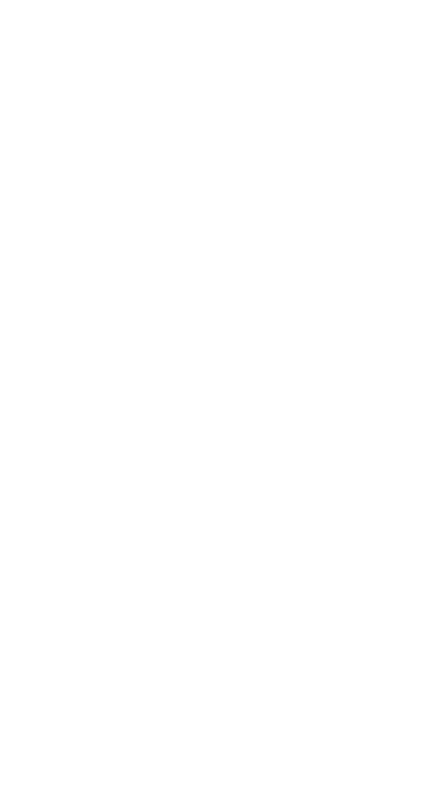

> 본 포스팅은 인프런의 [만들면서 쉽게 배우는 컴퓨터 구조](https://inf.run/PnrRu)를 참조하여 작성한 글입니다.

## 10진법과 2진법

이전 포스팅에서는 0과 1로 이루어진 비트를 이용하여 논리를 다루는 불 대수에 대해 알아 보았다. 이번 포스팅에서는 사람이 수를 다루는 방법과 컴퓨터가 수를 처리하는 방식에 대해 살펴보도록 하겠다.

### 10진법

사람이 수를 세는 방법은 0,1,2,3,4,5,6,7,8,9와 같이 하나씩 올라가다가 자릿수가 바뀌어 10이 된다. 이렇게 한 자리수가 10개의 수를 표현하는 체계를 **10진수**라고 한다. 10진법에서 각 자릿수의 값은 10^n을 해당 자리의 숫자와 곱하여 계산한다.

> 350 = 3 * 10^2 + 5 * 10^1 + 0 * 10^0

10진법은 사람이 숫자를 세는데 가장 자연스러운 방법이여서 우리는 수를 셀 때 당연히 10진수를 떠올린다. 이는 사람의 손가락이 10개이기 때문에 자연스럽게 발달한 체계이다. 사람은 10진법에 익숙하지만 컴퓨터는 10진법으로 계산하는 것이 비효율적이다.

### 2진법

컴퓨터는 정보를 저장할 때 0과 1만 사용하는데 이를 비트라고 부른다. 컴퓨터는 모든 데이터를 비트로 저장하기 때문에 비트를 이용해 수를 표현하는 방법이 필요하다. 1개의 비트로 표현할 수 있는 경우의 수는 2가지 밖에 존재하지 않는다. 이러한 이유로 컴퓨터는 한 자릿수를 10진법으로 표현하는 대신에 **2진법**을 사용한다.

그러면 2진법을 사용하려면 어떻게 해야할까? 2진법으로 5를 표현하려면 적어도 3개의 비트가 필요하다. 2비트는 2^2=4까지 표현 못하므로 2^3개인 8개의 값을 표현할 수 있는 3개의 비트를 사용해야 한다. 이렇게 한 자릿수에 2개의 수만 표현할 수 있어서 이를 2진법이라고 부른다. 그러면 이런 생각이 들 수도 있을 것이다.

> 2진법은 너무 복잡하고 읽기가 어렵지 않나요?

물론 어렵다. 하지만 2진수를 10진수로 빠르게 변환하는 방법이 존재한다. 10진수가 10^n으로 계산하여 수를 표현하듯이 2진수는 2^n으로 자릿수를 곱해 계산한다. 예를 들어 1101(2)라는 2진수가 존재한다면 10진수로 표현하면 (1 * 2^3 + 1 * 2^2 + 0 * 2^1 + 1 * 2^0)으로 13으로 표현이 가능하다.

또한, 어떤 수를 표기할 때 어떤 진법으로 표기했냐가 중요하여 숫자 밑첨자로 해당 진법을 적어준다. 예를 들어 10진법 13은 13(10)으로 표현하며 2진법 1101은 1101(2)로 표현한다. 일반적으로 10진법 같은 경우는 우리가 자주 사용하는 진법으로 밑첨자를 생략한다. 이렇게 밑첨자를 적는 이유는 다른 진법과 같은 수를 달리 표현하기 위한 용도 때문에 적어준다. 그러면 이런 의문이 들 것이다.

> 10진수를 2진수로 변환하는 방법은 없을까?

물론 존재한다. 해당 방법은 바로 다음에 살펴보도록 하겠다.

## 10진수를 2진수로 변환하기

10진수를 2진수로 변환하는 방법은 간단하다. 10진수를 2로 나눌 수 없을 때까지 계속 나누고 나머지를 역순으로 읽으면 끝이다. 그러면 한번 예시를 통해 살펴보도록 하다.

10진수 9를 2진수로 변환해보자. 9를 2로 나누면 몫은 4이고 나머지는 **1**이다. 다음 몫인 4를 2로 나누면 몫은 2이고 나머지는 **0**이다. 다음 몫인 2를 숫자 2로 나누면 몫은 1이고 나머지는 **0**이다. 다음 몫인 1을 2로 나누면 몫은 0이고 나머지는 **1**이다. 그리고 이제 나머지를 역순으로 나열해보면 1001(2)이 된다. 이렇게 1001(2)를 10진수로 표현하면 9가 되는 것이 알 수 있다. 이때 2진수에서 가장 오른쪽에 있는 가장 큰 비트를 MSB라고 하고 가장 오른쪽에 가장 작은 비트를 LSB라고 한다.

## 16진법

우리는 컴퓨터가 정보를 저장할 때 비트를 사용한다는 것을 알고 있다. 비트는 0과 1 2가지 상태만 가지므로 2진법을 사용한다. 2진법에서 1개의 비트는 0 혹은 1이므로 우리가 상용에서 사용하는 수를 사용하려면 여러개 비트가 필요하다. 예를 들어 245라는 10진수를 사용하려면 8개의 비트가 필요하다. 245를 2진수로 한번 표현해보자. 앞서 배운 공식을 이용하면 245를 2진수로 표현하면 11110101(2)가 된다. 이렇게 2진수는 10진수에 비해 자릿수가 길어진다는 단점이 존재한다. 그래서 큰 수를 다룰 때는 가독성이 떨어지게 된다.

그래서 나온 진법이 바로 **16진법**이다. 16진법은 2진법을 더 간단하게 표현하기 위해 사용된다. 16진법은 한 자리에 16가지 수로 표현이 가능하다. 0부터 9까지는 일반 숫자를 사용하고 10부터 15까지는 알파벳 A부터 F까지 사용한다. 그리고 16진수 F에 1을 더하면 자리올림이 발생하여 10(16)이 된다. 그런데 이런 의문이 들 수 있다.

> 그냥 간단하게 10진법으로 사용하면 되는데 왜 16진법까지 사용해야 할까?

2진수를 16진수로 표현하면 10진수로 표현하는 것보다 더 단순해진다. 16진수 1자리는 2진수 네자리와 정확히 대응이 된다. 네자리 2진수가 0부터 15까지 총 16개의 값을 사용할 수 있는 것처럼 16진수도 0부터 F까지 정확히 16개의 값으로 표현이 가능하다. 10진수 14를 2진수로 표현하면 1110(2)이 된다. 그리고 해당 2진수는 16진수 1자리로 표현이 가능하므로 16진수 E(16)이 된다.

그러면 이전의 예시를 다시 들어보자. 10진수 245를 2진수로 표현하면 11110101(2)이 된다. 이렇게 8자리의 2진수는 16진수 2자리로 표현이 가능하다. 먼저 앞의 1111은 10진수로 15이고 16진수로 F가 되고 뒤의 0101은 10진수로 5이고 16진수로도 5가 된다, 따라서 최종적으로 F5(16)이 된다.

이전에 우리가 10진수를 2진수로, 2진수를 10진수로 변환했던 것처럼 10진수에서 16진수로 16진수에서 10진수로 변환하는 방법이 존재한다. 하지만, 우리는 대부분의 상황에서 2진수를 간결하게 표현하기 위해서 16진수를 사용하기 때문에 10진수를 16진수로 16진수를 10진수로 변환하는 방법은 생략하고 2진수에서 16진수로 16진수에서 2진수로 변환하는 방법만 알아보고 가겠다.

해당 방법을 알아보기 전에 먼저 정확한 진법 표기를 알아보자. 표기 방식은 아래처럼 적고 상시로 기억해두자.

- 2진법: 1001(2) = 0b1001
- 10진법: 1001(10) = 1001
- 16진법: 1001(16) = 0x1001

## 빅 엔디안과 리틀 엔디안

비트를 다룰 때 반드시 알아야 할 개념이 존재한다. 바로 **빅 엔디안**과 **리틀 엔디안**이다. 이해를 돕기 위해 예시를 들어보자.

한 공간의 크기가 8비트, 즉 1 바이트 단위로 나눠진 메모리가 존재한다고 하자. 첫번째 메모리 공간은 1바이트를 저장할 수 있으며 주소는 0이다. 두번째 메모리 공간도 1바이트를 저장할 수 있고 주소는 1이다. 이런식으로 각각의 1 바이트 저장공간에 순차적으로 주소가 할당된다. 그리고 여기에 32비트, 즉 4 바이트로 이루어진 데이터 0x12345678이 있다고 해보자. 비트 옆에 0x가 있으므로 이는 16진수로 해석해야 한다. 16진수는 한 자릿수가 4비트이므로 두자리가 1바이트가 되고 총 8자리이므로 4바이트가 된다.

1바이트 메모리 공간에는 4바이트 데이터를 한번에 저장할 수 없으므로 1바이트 메모리 4개를 이용해 저장해야 한다. 4바이트 데이터를 1바이트로 쪼개서 0번지부터 채우는 방법에는 2가지가 존재한다.

첫번째 방법은 MSB를 먼저 채우는 방식이다. 가장 큰 자릿수를 낮은 번지의 주소에 먼저 채웠기 때문에 빅 엔디안이라고 부른다. 두번째 방법은 데이터의 가장 오른쪽, 즉 LSB부터 먼저 채우는 방법이 존재한다. 가장 작은 자릿수를 낮은 번지의 주소에 할당했기 때문에 리틀 엔디안이라고 부른다. 그러면 빅 엔디안과 리틀 엔디안중에 좋은 방법은 어떤 것일까? 사실은 두 방법중 어느것이 더 좋거나 안 좋은 방법은 존재하지 않는다. 다만 하나의 방법으로 통일하지 않는다면 원래 데이터와 달라지기 때문에 반드시 통일해야 한다.

## 오버플로우와 인터럽트

### 오버플로우

이번에는 비트 연산중에 발생하는 오버플로우에 대해 살펴보도록 하겠다. 오버플로우는 컴퓨터에서 치명적인 오류를 일으킬 수 있는 중요한 문제이다. 이는 데이터를 표현할 수 있는 비트수가 제한되어 있어서 발생하는 현상이다.

8비트로 구성된 0b11110001 + 0b00001011를 더해보는 예시를 한번 보자. 이 수는 241 + 10과 같다. 그러면 일반 덧셈을 한번 해보자. 가장 오른쪽 비트부터 계산을 하면 된다. 그러면 결과는 어떻게 될까? 0b11111100가 되며 오버플로우가 발생하지 않는다. 이제 다른 경우의 수를 살펴보자. 0b11111111 + 0b00000001을 더하면 어떻게 될까? 덧셈을 진행하면 LSB부터 자리올림이 연쇄적으로 발생해 덧셈의 결과는 256이 된다. 하지만 이것이 문제이다. 우리는 데이터를 8비트에 저장하는데 256은 9비트가 있어야 표현이 가능하다. 256을 결국 8비트로 표현해야 하기 때문에 마지막 자리올림 수는 버리고 나머지 숫자만 확인하게 된다. 그러면 계산의 결과가 256이 아니라 0이 되는 것이다. 이렇게 어떤 계산 결과로 유효한 비트의 범위를 넘는 현상을 **오버플로우**라고 부른다.

> 그러면 오버플로우는 덧셈에서만 발생할까?

아니다. 곱셈, 나눗셈, 뺄셈에서도 발생이 가능하다. 연산 결과가 현재 비트로 표현할 수 있는 범위를 넘어선다면 이를 모두 오버플로우라고 한다. 지금처럼 왼쪽으로 최대 범위를 벗어나는게 아니라 오른쪽으로 최소 범위를 벗어날 때 언더플로우라고 말해주시는 분들도 계시는데 이것은 엄밀히 말하면 전부 오버플로우라고 말하는 것이 맞다. 오버플로우가 발생하면 사용자의 데이터가 완전히 달라지므로 의도하지 않은 결과가 발생하거나 이를 악용한 해킹까지 가능한 심각한 문제이다. 따라서 컴퓨터 과학자들은 오버플로우가 발생하면 진행중인 동작을 멈추고 이를 처리할 수 있도록 시스템을 구상했는데 이를 **인터럽트**라고 한다.

### 인터럽트

인터럽트는 CPU가 현재 어떤 동작을 수행 중이더라도 즉시 중단하고 인터럽트 처리 동작을 수행한다. 특정 인터럽트가 발생하면 이미 등록된 인터럽트 서비스 루틴(ISR)을 통해 처리한다. 인터럽트로 인해 기존 동작이 중단되고 인터럽트 서비스 루틴이 실행된 후에는 원래 수행하던 동작을 수행한다. 인터럽트는 오버플로우 외에도 다양한 상황에서 발생할 수 있으며 필요에 따라 비활성화 할 수 있다.

인터럽트는 크게 외부 인터럽트와 내부 인터럽트로 나눠진다. 외부 인터럽트는 입출력 장치나 외부 전원과 같은 외부 요소에서 발생한다. 내부 인터럽트는 명령어나 데이터 처리 과정에서 오류가 발생했을 때 일어난다.

## 음수

이번에는 컴퓨터가 음수를 표현하는 방법에 대해 알아보자. 컴퓨터는 2의 보수법을 사용해 음수를 표현하는데 이 방법을 이용하면 뺄셈도 쉽게 할 수 있다.

7을 2진수 4비트로 표현하면 0b0111이다. 4비트는 0부터 15까지 총 16개의 수를 표현할 수 있다. 이 때 0부터 15까지는 부호 없는 정수라고 부르며 모두 양수이다. 반면 음수를 표현하려면 부호 있는 정수로 표현해야 하며 부호 있는 정수는 MSB를 부호 표현에 사용한다. MSB가 0이면 양수로, 1이면 음수로 표현한다. 4비트를 사용할 때 MSB는 부호표현에 사용되므로 실제 수를 표현하는데는 3비트만 사용한다. 이러한 이유로 4비트로 부호 있는 정수의 범위는 -8부터 7까지 표현이 가능하다. 

그렇다면 양수 7을 음수로 변경하려면 어떻게 해야할까? 먼저 10진수 7을 2진수로 표현한다. 2진수로 표현하면 0b0111이 된다. 그 다음에 모든 비트를 반전시킨다. 그러면 0b1000이 된다. 이를 1의 보수라고 말한다. 여기서 LSB에 1을 더하면 0b1001이 되고 음수 변환이 완료된다. 이렇게 1의 보수에 1을 더하는 것을 2의 보수라고 한다. 따라서 부호있는 정수 -7을 2진수로 표현하면 0b1001이 되는 것이다. 2의 보수법의 가장 큰 장점은 덧셈 연산에서 드러난다. 예를 들어 수학에서 7 - 7은 0이 되어야 한다. 이를 부호 있는 정수로 표현해서 계산해보자. 부호있는 7을 4비트로 표현하면 0b0111이 된다. -7은 0b1001이 된다. 그리고 이 둘을 더해보면 LSB에서 자리올림이 발생하고 결국 오버플로우가 발생해 4비트 체계에서는 0b0000이 된다. 이렇게 뺄셈도 덧셈으로 가능한 것이다.

> 그러면 MSB가 1인 비트는 무조건 음수인가?

그렇지 않다. 예를 들어 0b1101이라는 비트가 있다면 부호 없는 정수나 부호 있는 정수로 해석할 수 있다. 부호없는 정수로 생각하면 13이 되고 부호 없는 정수는 -3이 된다. 따라서 무조건 이렇게 해석한다라기 보다는 시스템의 약속에 따라 다르다는 것을 인지하자.