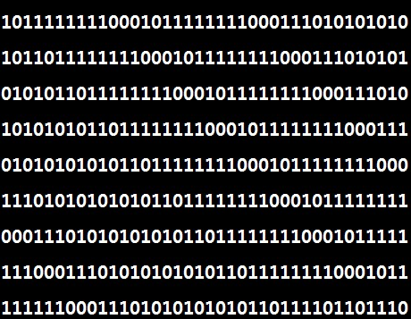

> 본 포스팅은 인프런의 [개발자를 위한 컴퓨터공학 1: 혼자 공부하는 컴퓨터구조 + 운영체제](https://inf.run/6vJaw)를 참조하여 작성한 글입니다.

## 소스 코드와 명령어

아래의 코드가 있다고 해보자.

``` c
#include <stdio.h>

void main()
{
  printf("Hello World!");
}
```

해당 C언어 코드가 과연 컴퓨터가 알아들을 수 있을까? 물론 이 언어 그 자체로는 컴퓨터는 알아듣지 못한다.

> 근데 우리가 코드를 실행하면 잘 결과가 나오는데 알아듣는거 아니에요?

그것은 이 자체로 컴퓨터가 언어를 알아듣지 않고 변환과정을 거쳐서 컴퓨터가 알아 들을 수 있는 명령어로 변환하기 때문이다. 그럼 이에 대해 한번 알아보자.

### 고급 언어와 저급 언어

우리가 프로그램을 만들 때 사용하는 프로그래밍 언어는 컴퓨터가 이해하는 언어가 아닌 사람이 이해하고 작성하기 쉽게 만들어진 언어이다. 컴퓨터는 이 언어를 이해하지 못한다. 이렇게 사람을 위한 언어를 **고급 언어**라고 표현한다. 반대로 컴퓨터가 직접 이해하고 실행할 수 있는 언어를 **저급 언어**라고 표현한다. 그리고 이 고급 언어를 저급 언어로 변환해야 컴퓨터가 이해하고 실행을 하는 것이다. 그럼 한번 정리해보겠다.

- 고급 언어
  - 종류: C, C++, Java...
  - 개발자가 이해하기 쉽게 만든 언어
- 저급 언어
  - 종류: 기계어, 어셈블리 언어
  - 컴퓨터가 이해하고 실행하는 언어

그러면 저급 언어의 기계어부터 한번 살펴보자. 기계어는 다음과 같이 0과 1로 구성된 언어이다.



컴퓨터는 위와 같이 구성이 되어야 실행을 해주는 것이다. 물론 위와 같은 2진수를 16진수로도 표현해도 컴퓨터가 해석하고 실행을 해준다. 하지만 위와 같은 형태를 사람이 해석하기에는 매우 어렵다. 그래서 그나마 사람이 읽기 편한 형태로 번역한 언어가 존재하는데 바로 그것을 **어셈블리어**라고 표현한다.

``` asm
LOADA 15
SUB 14 // 피제수 -= 제수
JMPC 7 // 피제수가 제수보다 크면 RAM의 7번 주소로 점프
JMPZ 7 // 피제수와 제수가 같으면 RAM의 7번 주소로 점프
LOADA 13
OUT
HLT
STOREA 15 // 현재 레지스터A의 값을 피제수로 업데이트
LOADI 1 // 몫 += 1
ADD 13
STOREA 13
JMP 0

0 // 몫
3 // 제수
7 // 피제수(결과는 나머지)
```

### 컴파일 언어와 인터프리터 언어

그러면 이제 고급 언어를 살펴보도록 하겠다. 개발자들이 고급언어로 작성한 소스코드는 결국 저급 언어로 변환되어 실행이 되어야 한다. 그러면 고급 언어는 어떻게 저급언어로 변환을 할까? 여기에는 크기 2가지 방식이 존재한다. **컴파일**방식과 **인터프리터**방식이 존재한다. 컴파일 방식으로 작동하는 프로그래밍 언어를 컴파일 언어, 인터프리터 방식으로 작동하는 프로그래밍 언어를 인터프리터 언어라고 표현한다.

컴파일 언어는 컴파일러에 의해 소스 코드 전체가 저급 언어로 변환이 된다. 즉, 컴파일 언어로 작성된 소스 코드 전체가 저급 언어로 변환되는데 이 과정을 **컴파일**이라고 한다. 그리고 이런 컴파일을 해주는 장치를 **컴파일러**라고 한다. 컴파일러는 개발자가 작성한 소스 코드 전체를 쭉 훓어보며 소스 코드에 문법적인 오류는 없는지, 실행 가능한 코드인지 불필요한 코드는 없는지 검사를 진행하고 소스코드 처음부터 끝까지 저급 언어로 컴파일을 한다. 그리고 컴파일러를 통해 저급 언어로 변환된 코드를 **목적 코드**라고 한다. 컴파일 언어는 소스 코드 전체를 훓어서 만약 오류가 발견하면 실행을 하지 않고 그 자체로 중단한다.

다음으로 인터프리터 언어를 살펴보자. 인터프리터 언어는 인터프리터에 의해 한줄씩 실행을 한다. 소스코드 전체가 저급언어로 변환될 때까지 기달리지 않고 한줄씩 실행을 한다. 그러다가 에러가 발생하면 실행 도중에 중단을 한다. 그리고 이렇게 인터프리터 언어를 저급 언어로 변환해주는 장치를 **인터프리터**라고 표현한다.

그러면 이런 생각이 들 것이다. 과연 컴파일 언어와 인터프리터 언어는 칼로 자르듯이 명확하게 구분할 수 있는 개념일까? C, C++과 같이 명확하게 구분할 수 있는 언어도 있으나 현대의 많은 프로그래밍 언어 중에는 컴파일 언어와 인터프리터 언어 간의 경계가 모호한 경우가 많다. 대표적으로 인터프리터 언어로 알려진 Python도 컴파일을 하지 않는 것은 아니며 Java의 경우 저급 언어가 되는 과정에서 컴파일과 인터프리트를 동시에 수행한다.

## 명령어의 구조

이번에는 하나의 명령어를 자세히 들여다보면서 연산 코드, 오퍼랜드, 주소 지정 방식이라는 개념에 대해 학습해보도록 하겠다.

### 연산 코드와 오퍼랜드

우리가 누구한테 명령을 한테 이렇게 말할 것이다.

> "철수야, 노트북좀 가져와줄래?"

컴퓨터도 마찬가지다. 명령어는 **무엇을 대상으로, 어떤 동작을 수행해라**라는 구조로 되어 있다. 명령어는 연산 코드와 오퍼랜드로 구성되어 있다. 연산 코드는 MSB 포함한 비트들을 나타내고 나머지가 오퍼랜드라고 봐도 무방하다. 연산 코드는 수행할 연산을 의미한다. 그리고 연산에 사용할 데이터를 오퍼랜드라고 의미한다. 

오퍼랜드에는 실제 수행할 데이터가 직접적으로 들어가져 있는 경우도 존재하면 해당 데이터가 있는 메모리 주소 값을 표현하기도 한다. 또한 명령어 종류에 따라 오퍼랜드가 하나도 없을 경우도 있고 많으면 3개인 경우도 존재한다. 이럴때 오퍼랜드가 하나도 없는 명령어를 **0-주소 명령어**라고 하고, 오퍼랜드가 하나인 명령어를 **1-주소 명령어**, 두 개인 명령어를 **2-주소 명령어**, 세 개인 명령어를 **3-주소 명령어**라고 말한다.

> 오퍼랜드에는 실제 데이터 혹은 메모리의 주소가 들어 있을 수 있는데 많은 경우 메모리의 주소가 들어가져 있다. 이 때문에 우리는 오퍼랜드를 주소 필드라고도 부른다.

다음은 연산 코드를 살펴보도록 하겠다. 연산 코드의 종류는 매우 많지만 가장 기본적인 연산 코드 유형은 크게 4가지로 존재한다.

- 데이터 전송
- 산술/논리 연산
- 제어 흐름 변경
- 입출력 제어

연산 코드에는 정말 많은 코드들이 존재하는데 아래 정리를 해두었으니 암기는 하지 말고 한번 이해해보도록 하자.

- 데이터 전송
  - MOVE: 데이터를 옮겨라 (레지스터 -> 레지스터)
  - STORE: 메모리를 저장해라
  - LOAD(FETCH): 메모리에서 CPU로 데이터를 가져와라
  - PUSH: 스택에 데이터를 저장하라
  - POP: 스택에 최상단 데이터를 가져와라
- 산술/논리 연산
  - ADD / SUBSTRACT / MULTIPLY / DIVIDE: 덧셈 / 뺄셈 / 곱셈 / 나눗셈을 수행하라
  - INCREMENT / DECREMENT: 오퍼랜드에 1을 더하라 / 오퍼랜드에 1을 빼라
  - AND / OR / NOT: AND/ OR / NOT 연산을 수행하라
  - COMPARE: 두 개의 숫자 또는 TRUE / FASLE 값을 비교하라
- 제어 흐름 변경
  - JUMP: 특정 주소로 실행 순서를 옮겨라
  - CONDITIONAL JUMP: 조건에 부합할 때 특정 주소로 실행 순서를 옮겨라
  - HALT: 프로그램의 실행을 멈춰라
  - CALL: 되돌아올 주소를 지정한 채 특정 주소로 실행 순서를 옮겨라 (함수 실행)
  - RETURN: CALL을 호출할 때 저장했던 주소로 돌아가라
- 입출력 제어
  - READ(INPUT): 특정 입출력 장치로부터 데이터를 읽어라
  - WRITE(OUTPUT): 특정 입출력 장치로 데이터를 써라
  - START IO: 입출력 장치를 시작하라
  - TEST IO: 입출력 장치의 상태를 확인해라

### 주소 지정 방식

명령어의 오퍼랜드 필드에 메모리나 레지스터의 주소를 담는 경우가 많다. 그런데 아래와 같은 의문이 들 수도 있다.

> 왜 오퍼랜드 필드에 메모리나 레지스터의 주소를 담는가? 그냥 사용할 데이터를 직접적으로 담으면 안되나?

바로 명령어 내에서 표현할 수 있는 데이터 크가가 제한되기 때문이다. 직접적으로 저장되면 오퍼랜드가 할당된 크기밖에 데이터들을 표현을 못하지만 주소 값으로 하면 더 확장되기 때문에 해당 방식들을 많이 채택한다. 또한 연산 코드에 사용할 데이터가 저장된 위치, 즉 연산의 대상이 되는 데이터가 저장된 위치를 **유효 주소**라고 한다.

이런 명령어 주소 지정 방식에는 여러가지가 존재한다. 일단 명령어 주소 지정 방식이란 연산에 사용할 데이터가 저장된 위치를 찾는 방법을 말한다. 즉, 유효 주소를 찾는 방법이다. 해당 방식은 다양한 명령어 주소 지정 방식들이 아래와 같이 존재한다. 한번 살펴보자.

- 즉지 주소 지정 방식
  - 연산에 사용할 데이터를 오퍼랜드 필드에 직접 명시
  - 가장 간단한 형태의 주소 지정 방식
  - 연산에 사용할 데이터의 크기가 작아질 수 있지만 빠름
- 직접 주소 지정 방식
  - 오퍼랜드 필드에 유효주소를 직접적으로 명시
  - 유효주소를 표현할 수 잇는 크기가 연산코드만큼 줄어든다. (단점)
- 간점 주소 지정 방식
  - 오퍼랜드 필드에 유효주소의 주소를 명시
  - 앞선 주소 지정 방식들에 비해 속도가 느림
- 레지스터 주소 지정 방식
  - 연산에 사용할 데이터가 저장된 레지스터 명시
  - 메모리에 접근하는 속도보다 레지스터에 접근하는 것이 빠름
- 레지스터 간접 주소 지정 방식
  - 연산에 사용할 데이터를 메모리에 저장
  - 그 주소를 저장한 레지스터를 오퍼랜드 필드에 명시

## 소스 코드가 명령어가 되기까지

그러면 우리는 C언어를 통해서 소스코드가 명령어가 되기까지의 과정을 한번 살펴보도록 하겠다. 아래의 C언어 코드가 있다고 하자.

``` c
#include <stdio.h>

int main()
{
    printf("Hello World!\n");
    return 0;
}
```

C언어는 컴파일 언어이기 때문에 컴파일 과정을 거쳐서 실행파일이 된다. 그런데 엄밀히 과정을 나타내면 아래와 같은 과정을 거친다.

- 전처리 과정
- 컴파일 과정
- 어셈블 과정
- 링킹 과정

그러면 과정 하나씩 살펴보도록 하겠다. `test.c`파일이 있다고 해보자. 해당 과정을 전 처리과정을 전처리기를 통해 거치면 `test.i`라는 파일이 된다. 전 처리과정에서 하는 것은 다음과 같다.

- 본격적으로 컴파일 하기 전에 처리 할 작업들
- 외부에서 선언된 다양한 소스코드, 라이브러리 포함 (e.g. #include)
- 프로그래밍의 편의를 위해 작성된 매크로 변환 (e.g. #define)
- 컴파일 할 영역 명시 (e.g. #if, #ifdef)

이렇게 `test.i`파일이 된 코드를 컴파일러를 통해서 컴파일을 한다. 컴파일 과정에서 다음과 같은 과정을 거친다.

- 전처리가 완료되어 여전히 소스코드
- 전처리 완료된 소스코드를 저급언어(어셈블리어)로 변환

이렇게 `test.i`가 컴파일 과정을 통해 `test.s`라는 어셈블리 언어 파일이 되었다. 이제 해당 파일을 어셈블 과정을 거쳐야 한다.

- 어셈블리어를 기계어로 변환
- 목적 코드를 포함하는 목적 파일이 됨

그리고 마지막으로 링킹 과정을 통하여 최종 실행파일이 된다. 링킹 과정에서는 다른 c언어 파일이라던지 외부 라이브러리들을 연결 시켜주는 작업을 한다.

> 목적 파일과 실행파일의 차이는 무엇일까? 목적 파일과 실행 파일은 둘다 기계어로 이루어진 파일이다. 하지만 목적 파일과 실행 파일은 다르다. 목적 파일은 링킹을 거친 이후에 실행 파일이 된다.