> 본 포스팅은 인프런의 [만들면서 쉽게 배우는 컴퓨터 구조](https://inf.run/PnrRu)를 참조하여 작성한 글입니다.

## 컴퓨터 조립하기

이번에는 지금까지 만든 모듈을 활용해서 컴퓨터를 조립해보겠다. 물론 아직까지 제어장치를 만들지 않았기 때문에 제어장치와 그와 관련된 프로그램 카운터는 없지만 우리가 수동으로 계산할 수 있는 컴퓨터의 모습은 구현할 수 있다. 지금부터 모듈을 연결해보겠다.

가장 먼저 컴퓨터의 연산을 담당하는 ALU를 설치해주도록 하겠다. 그리고 가장 먼저 클럭을 연결해주도록 하겠다. 터널을 배치하여 이름을 CLK로 변경하고 ALU의 CLK핀과 연결해둔다. 

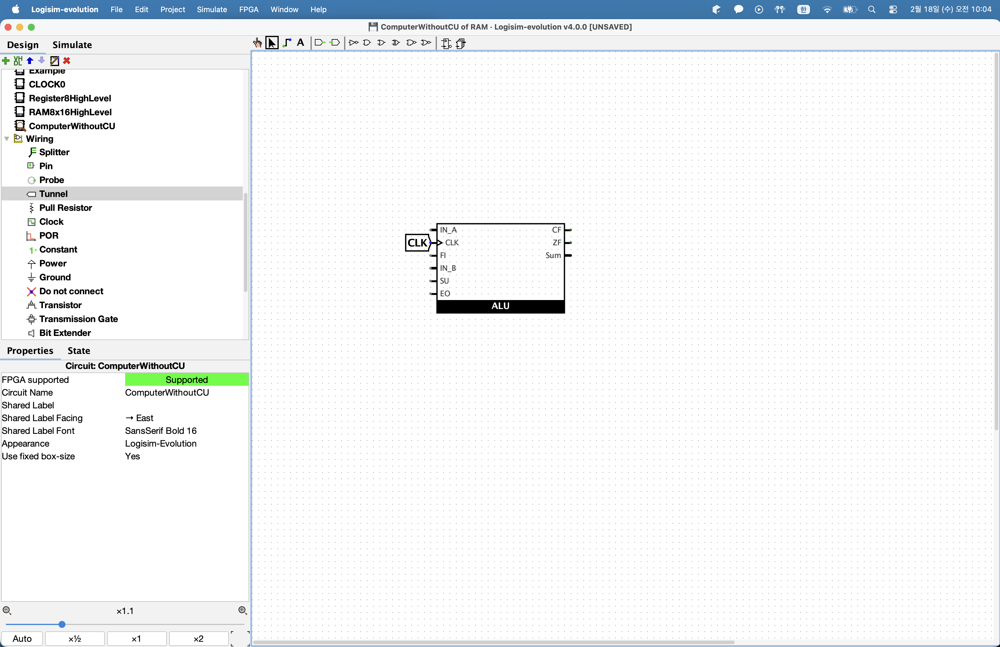

이제 이 CLK 터널에 신호를 주는 클럭을 연결해야 한다. 우리가 만들었던 Clock0를 설치해준다. 그리고 이 클럭의 CLK_OUT 핀을 터널 CLK를 만들어 연결해준다. 다음 새로운 터널을 만들어 이름을 HLK라고 변경하고 CLOCK0의 HLT 핀과 연결해준다.

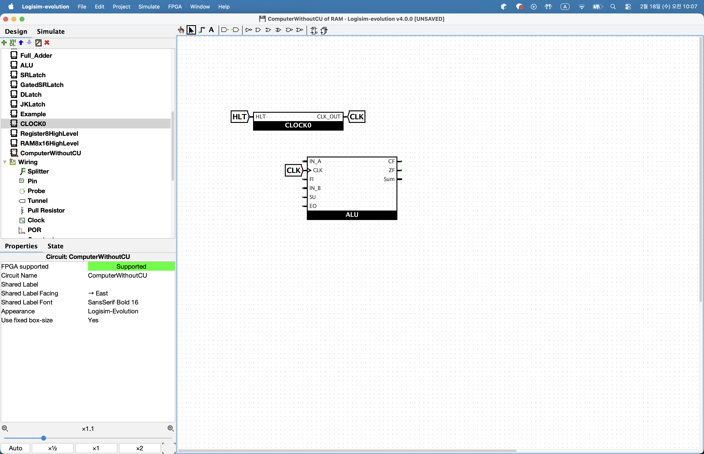

이렇게 하면 HLT 터널로 클럭을 멈출 수도 있고 클럭 신호는 ALU의 클럭으로 들어간다. 이제 메뉴의 Simulate -> Manual Tick Half Cycle을 클릭하거나 command + t를 눌러 클럭을 동작시켜보자. 이제 다른 핀들을 연결해보겠다. 새로운 터널을 만들어 이름을 SU로 변경하고 ALU의 SU핀에 연결해준다. 터널을 복사하여 이름을 EO로 변경해주고 ALU의 Enable Out핀에 연결해준다. FI핀도 같은 방식으로 연결해주고 ZF도 연결해준다. CF도 연결을 진행해준다.

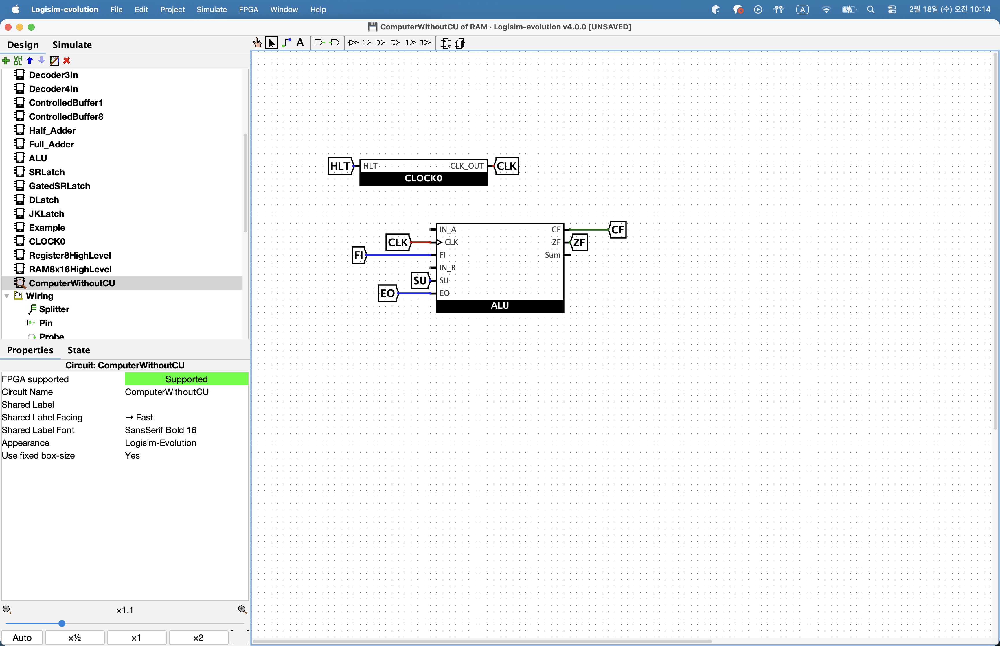

이제 ALU의 피연산자로 사용되는 두 입력 핀과 계산 결과인 Sum만 연결해주도록 한다. 먼저 출력핀 Sum은 바로 버스와 연결되기 때문에 아래로 선을 뽑아서 버스를 만들어주겠다. 다음으로 ALU의 피연산자 A를 연결해주도록 하겠다. ALU 피연산자 A는 레지스터와 연결된다. 먼저 메모리 폴더에서 레지스터를 선택하여 ALU 근처에 설치를 해주고 이름을 Register_A로 변경해준다. 이 레지스터의 입력은 버스와 바로 연결해주고 클럭은 터널을 통해 연결해준다.

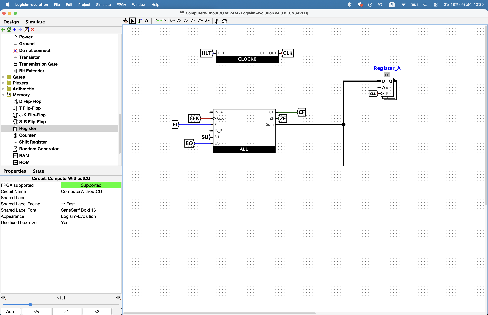

그리고 레지스터A의 입력을 활성화하는 터널을 만들어 이름을 AI로 하고 레지스터의 WE핀에 연결해준다. 그리고 레지스터A의 출력은 ALU의 IN_A에 연결해주고 Control Buffer를 만들어 레지스터 A의 출력과 버스와 연결해준다.

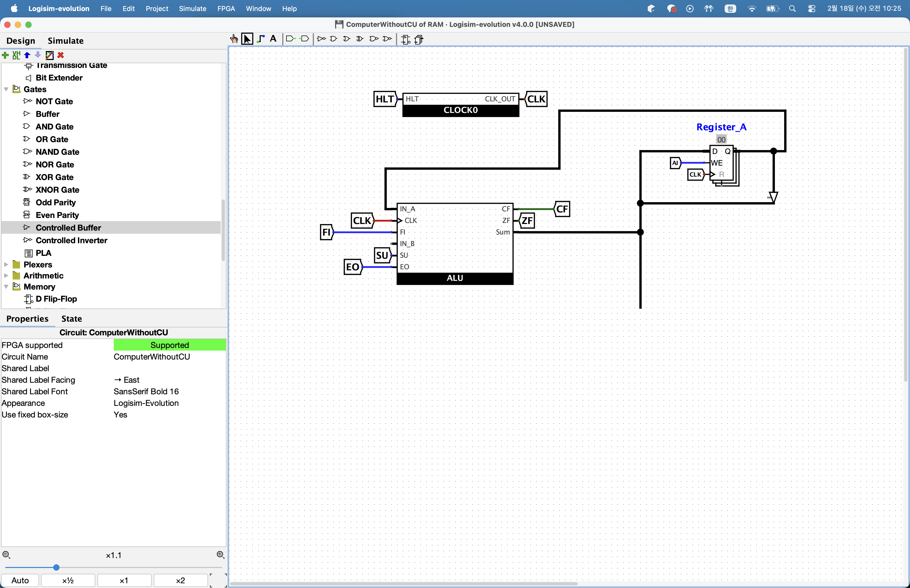

그리고 터널을 만들어 이름을 AO로 지정하고 Control Buffer의 Enalbe핀에 연결해준다. 이렇게 구성한다면 버스에 있는 데이터를 AI핀으로 레지스터 A에 저장할 수 있고 AO핀을 이용하여 A의 데이터를 버스에 출력할 수도 있다.

다음으로 ALU의 피연산자 B입력을 연결해주도록 하겠다. ALU 피연산자 B는 레지스터 B와 연결해줘야 한다. 아까의 과정을 거치면 된다.

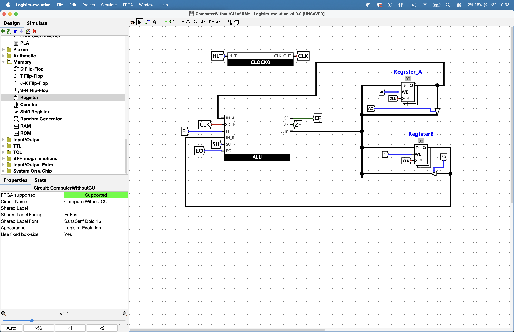

이렇게 ALU와 관련된 핀은 모두 연결되었다. 이제 이 회로에서 ALU를 이용하여 계산을 해보도록 하겠다. 바로 아래와 같이 진행을 하면 되니 독자가 직접 해보자.

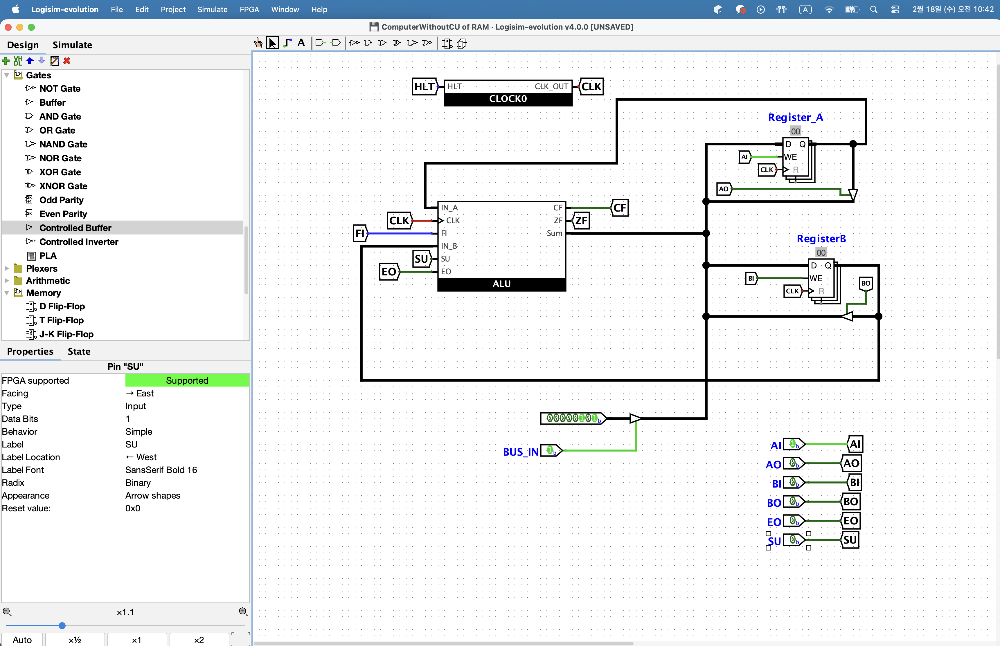

이제 RAM과 레지스터 2개를 설치해주면 끝이다. 메모리 폴더에서 RAM을 선택하여 CPU 외부 오른쪽에 설치를 진행해준다. 그리고 Address Bit Width를 4로 설정해주고 Trigger를 High Level로 변경하여 우리가 이전에 만들어 보았던 RAM과 동일하게 만들어준다. 추가로 이름을 RAM16bytes로 Label Visible을 yes로 해서 이름을 표시해준다.

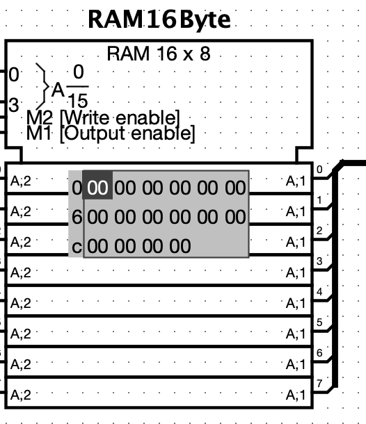

이제 터널 2개를 만들어 이름을 RI, RO로 변경하고 RI는 RAM의 Store 핀에 RO는 RAM의 load핀에 연결해준다. 그리고 RAM의 데이터 입력핀과 버스와 연결을 해준다. 이제 Control Buffer를 RAM의 출력핀과 연결해주고 Control Buffer의 출력과 버스와 연결한다. 이 Control Buffer의 Enable 핀은 RO와 연결해준다.

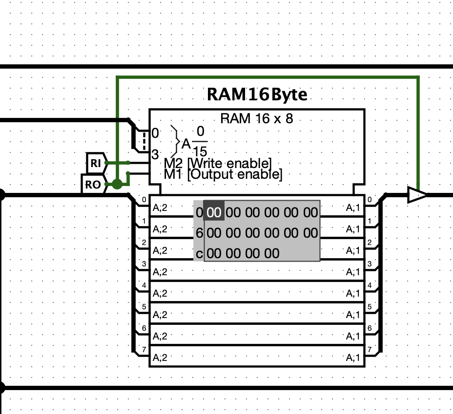

다음으로 RAM의 주소를 지정하는 레지스터인 Memory Address Register를 만들어주겠다. 메모리 폴더에서 레지스터를 선택하여 설치해주고 Trigger를 HighLevel로 이름을 MAR로 설정한다. 그리고 터널 2개를 만들어 하나는 클럭 이름으로 변경하고 다른 하나는 MI로 변경하여 레지스터에 연결해준다.

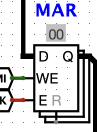

우리의 RAM은 16바이트로 주소의 수가 16개밖에 되지를 않는다. 따라서 주소는 4비트로 표현한다. 이러한 이유로 MAR이 8비트이지만 LSB를 포함한 하위 4비트만 것이다. Splitter를 배치하여 레지스터의 출력과 연결한다. 그리고 Splitter를 하나 더 설치하여 하위 4비트와 연결해준다. 그리고 이 Splitter를 RAM의 Address 핀과 연결해준다.

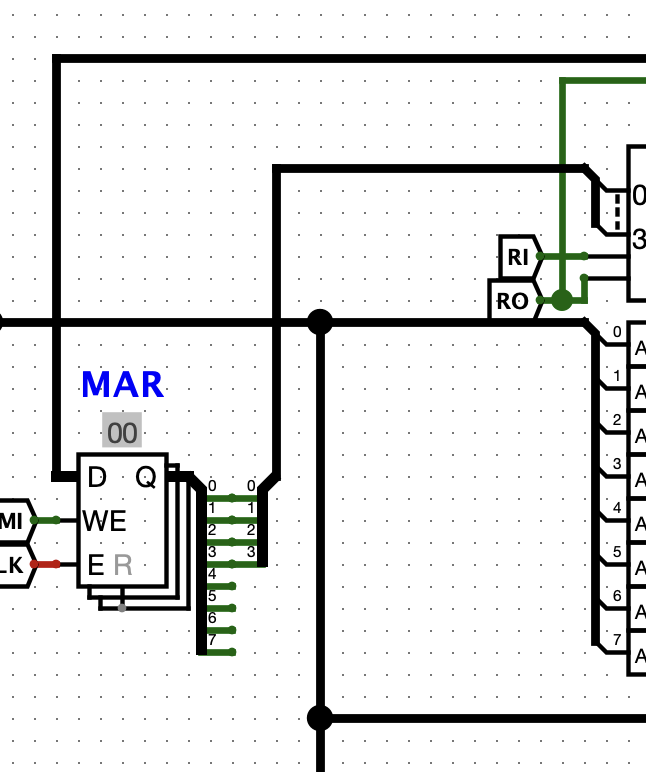

다음으로 RAM에 저장된 데이터를 가져올 때 상위 4비트는 명령어 부분, 하위 4비트는 주소부분이기 때문에 상위 4비트는 0으로 만들고 하위 4비트만 가져와야 한다. 이 부분도 Splitter를 이용할 것이다. Splitter를 설치하여 버스와 연결해준다. Splitter를 복사하고 하위 4비트와 연결을 해주고 상위 4비트는 Constant를 가져와 0으로 세팅을 해준다.

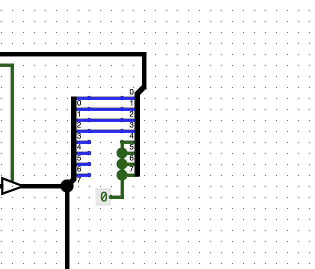

그리고 이 Splitter를 MAR의 D핀과 연결을 해준다. 이렇게 되면 RAM에 저장된 명령어를 해석할 때 상위 4비트는 명령어 부분이므로 0으로 변경하고 하위 4비트값만 MAR에 저장하게 된다.

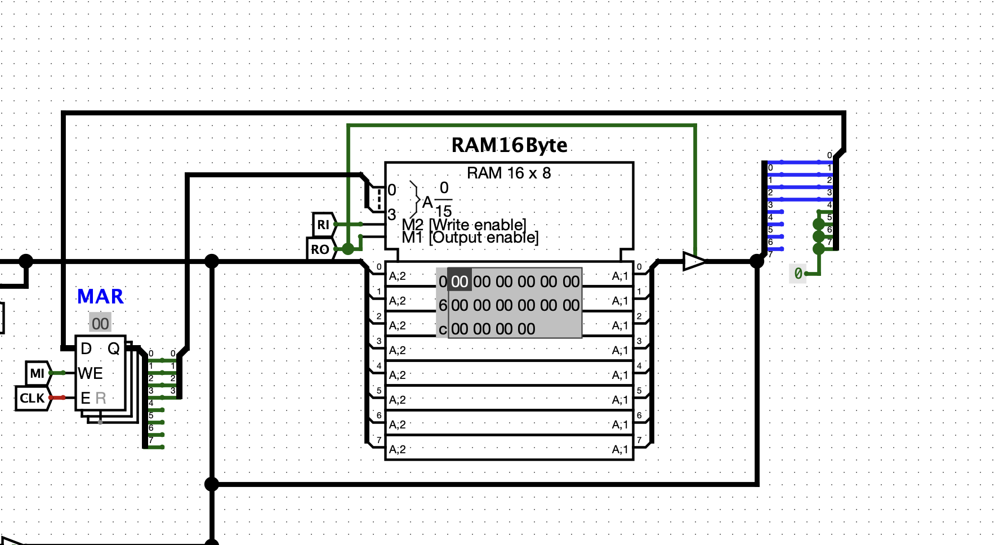

마지막으로 명령어를 저장하는 레지스터인 IR를 만들어 보겠다. IR은 MAR과 반대 개념으로 8비트로 구성된 명령어와 주소에서 상위 4비트 명령어만 가져와 저장한다. 메모리 폴더에서 레지스터를 선택하여 배치한다. 그리고 D핀을 버스와 연결해주고 터널을 만들어 이름을 CLK로 변경하여 CLK핀과 연결해주고 터널을 복사하여 II로 이름을 변경하여 레지스터의 WE핀과 연결한다. 이제 Splitter를 만들어 레지스터의 출력과 연결한다. 그리고 터널 4개를 만들어 각 자릿수를 나타내는 이름으로 IR4, IR5, IR6, IR7로 변경해 4,5,6,7번 핀에 연결한다. IR4~7 터널은 지금 당장 사용되지 않지만 명령어 부분이므로 이후 제어장치 입력으로 사용될 예정이다.

Splitter를 하나 더 설치해주고 기존 Splitter의 하위 4비트와 연결해주고 상위 4비트는 명령어 부분이기 때문에 Constant 0과 연결해준다. 마지막으로 Control Buffer를 설치하여 Splitter와 연결하고 버스와 연결해준다. 마지막으로 IO라는 이름의 터널을 만들어 Control Buffer의 Enalbe핀과 연결해주면 완성이다.

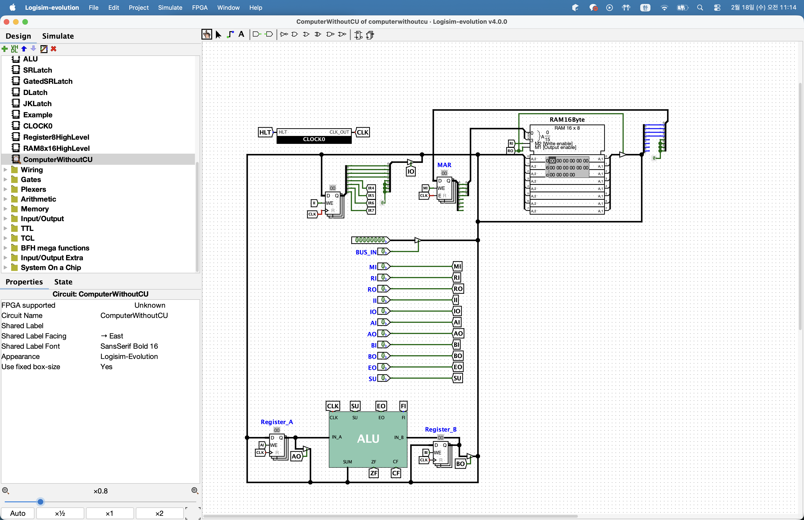