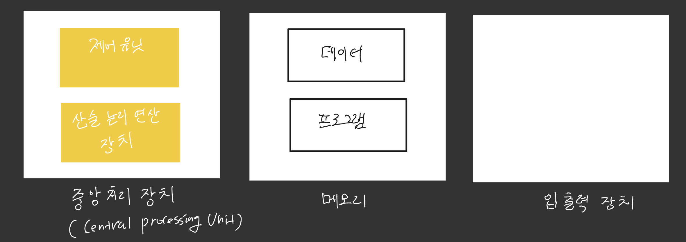
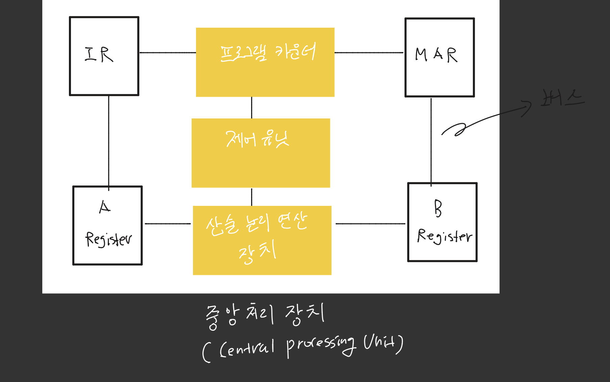

> 본 포스팅은 인프런의 [만들면서 쉽게 배우는 컴퓨터 구조](https://inf.run/PnrRu)를 참조하여 작성한 글입니다.

## 중앙 처리 장치(CPU)

우리는 이전 포스팅을 통하여 현대 컴퓨터의 구조가 폰노이만의 구조를 따른다는 것을 학습하였다. 이 구조는 중앙 처리 장치, 메모리, 입출력 장치가 서로 독립적으로 분리된 형태를 가진다. 이번에는 컴퓨터의 핵심 요소인 중앙 처리 장치에 대해 살펴보도록 하자.

**중앙 처리 장치**는 실제 계산을 담당하는 **산술 논리 연산 장치**, 동작을 제어하는 **제어 장치**, 다음 실행 할 명령어의 주소를 가지고 있는 **프로그램 카운터** 그리고 여러 **레지스터**로 구성된다. 레지스터는 컴퓨터의 가장 작은 단위의 메모리로 저장 용량은 작지만 속도가 매우 빠르다.

산술 논리 연산 장치는 산술 연산과 논리 연산을 수행하는 여러 회로로 구성되어 있다. 이 장치는 회로가 비교적 단순하다. 반면, 제어 장치는 명령을 해석하고 실행하도록 하는 장치로 CPU 내에서 가장 복잡한 장치이다. 산술 논리 연산 장치와 제어 장치로 계산을 수행하려면 데이터를 일시적으로 저장할 메모리가 필요하다. 이를 위해 CPU 내부에는 레지스터라는 작은 메모리가 존재하는데 시스템의 복잡성에 따라 수백개까지 존재할 수 있다.

위의 그림에서 예를 들어보면 A 레지스터와 B 레지스터는 2개의 피연산자를 저장하는데 사용되는 레지스터로 보면 좋을 것 같다. 예를 들어 `1+2`라는 연산을 수행할 때 A 레지스터에 1을 B 레지스터에 2를 저장하고 해당 값을 산술 논리 연산 장치로 계산을 수행한다. 그리고 결과 값 3을 A 레지스터이든, B 레지스터에 저장을 하는 것이다. 각 장치들은 작은 전선 다발을 통하여 데이터를 전달하는데 이러한 데이터가 이동하는 통로를 버스라고 부른다.

우리가 만든 프로그램은 명령어와 데이터로 구성된다. 프로그램을 실행하면 메모리에 적재되고 CPU 내에 있는 제어 장치가 프로그램의 명령어와 필요한 데이터를 읽어와 적절한 계산을 반복하며 프로그램을 실행한다.

> ✅ 한번 더 체크!
>
> 제어 장치는 명령어를 해석하고 실행하는 장치로, 산술 논리 연산 장치, 프로그램 카운터, 레지스터등을 제어한다.

## 메모리

다음으로, **메모리**에 대해 살펴보자. 폰 노이만 구조에서 우리가 만든 프로그램의 데이터와 명령어는 모두 메모리에 올라가서 실행된다. 이를 프로그램 내장 방식이라고 하며 이 방식 덕분에 프로그램이 변경될 때마다 하드웨어의 연결을 바꿀 필요가 없게 되었다.

메모리는 **메인 메모리**와 **보조 메모리**로 나뉜다. 먼저, 메인 메모리에 대해 살펴보도록 하자. 메인 메모리는 **RAM**과 **ROM**으로 구성된다. RAM은 어떤 데이터에 접근하더라도 접근 시간이 동일한 메모리이다. 반면에 자기 테이프나 HDD처럼 데이터 위치에 따라 접근 시간이 달라지는 보조 메모리도 존재하긴 한다.

RAM의 중요한 특성 중 하나는 **휘발성 메모리**라는 점이다. 즉, 전원이 끊기면 저장된 모든 내용이 사라진다. 그래서 우리가 만든 프로그램은 보통은 비휘발성 보조 메모리인 HDD나 SSD에 저장해두었다가 실행할 때 RAM으로 불러온다. 다음으로 ROM은 데이터를 영구적으로 저장할 수 있는 **비휘발성 메모리**이다. 단, 한번 저장한 데이터는 수정할 수 없다는 특징이 있다. 따라서, ROM은 일반 사용자용의 데이터를 저장하지 않고 주로 컴퓨터 부팅을 위한 **BIOS를 저장하는 용도**로 사용된다.

CPU가 프로그램을 실행할 때, 코드와 데이터를 RAM에서 가져온다. CPU는 가져온 코드를 해석하여 어떤 명령어인지 파악하고 데이터는 CPU의 최소 메모리인 레지스터에 저장하여 연산을 수행한다. 연산이 종료되면 그 결과를 레지스터에 저장했다가 다시 RAM으로 복사하는 과정을 거친다. 레지스터는 RAM보다 읽고 쓰는 속도가 훨씬 빠름으로 자주 사용하는 데이터는 가능한 한 레지스터에 보관하는 것이 효율적이다. CPU가 아무리 빠르게 동작해도 RAM에서 데이터를 가져오는 시간이 느리기 때문에 성능에 한계가 있다. 이를 해결하기 위해 CPU 내부에 더 빠른 메모리인 **캐시 메모리**를 둔다.

> ✅ 한번 더 체크!
>
> 캐시메모리는 레지스터보다는 느리지만 저장할 수 있는 공간이 크고 RAM보다는 빠르지만, 저장할 수 있는 공간이 작다.

## 주변 장치

다음으로, 주변 장치에 대해 살펴보자. 주변 장치는 크게 입출력 장치와 보조기억장치로 구분된다.

### 입출력 장치

입력 장치의 대표적인 예시로는 키보드와 마우스가 있다. 이러한 장치들을 조작하면 입력 데이터가 컴퓨터로 전달된다. 출력장치에는 모니터, 스피커, 프린터등이 있다. 컴퓨터의 계산 결과는 이러한 장치들을 통해 출력된다.

### 보조기억장치

**보조기억장치**는 메인 메모리를 보조하는 메모리이다. 주로 부족한 용량을 보조하는 역할을 한다. 속도는 상대적으로 느리지만 용량이 크다는 장점을 가진다. 대표적으로 HDD와 SSD가 존재한다. 우리가 컴퓨터에 설치한 모든 프로그램은 이 보조기억장치에 저장된다. 프로그램을 실행하면 보조기억장치에 있던 프로그램이 메인 메모리로 이동하여 실행 상태가 된다. 보조기억장치는 **비휘발성 메모리**로 컴퓨터의 전원을 꺼도 데이터가 유지된다.

## 32bit, 64bit, 8bit 컴퓨터

다음으로 32bit 컴퓨터와 64bit 컴퓨터의 차이가 무엇인지 알아보고 우리가 직접 만들어 볼 컴퓨터는 어떤 종류의 컴퓨터인지 살펴보도록 하자.

컴퓨터가 처리하는 데이터는 0 또는 1로 구성된 기계어이다. 이러한 데이터들이 모여서 명령어나 데이터를 나타낸다. 0과 1을 표현하는 정보의 기본 단위를 비트라고 한다. 하나의 비트는 0 또는 1을 표현할 수 있고 따라서 경우의 수는 2^1 = 2개이다. 비트 8개가 모이면 이를 8bit 또는 1byte라고 부르며 이 때 표현할 수 있는 경우의 수는 256개이다. 그러면 32bit는 어떻게 될까? 32bit는 비트가 32개이고 표현할 수 있는 경우의 수는 약 42억개 정도 된다. 마찬가지로 64bit는 비트가 64개 있는 것으로 표현할 수 있는 경우의 수는 약 18경개 정도 된다.

이제 비트에 대해 알아봤으니 32bit 컴퓨터와 64bit 컴퓨터를 이해할 수 있다. 컴퓨터가 계산을 할 때는 CPU 내의 산술 논리 연산 장치가 레지스터에 있는 값을 가져와 명령에 맞는 연산을 하고 결과는 다시 레지스터에 저장한다. CPU에는 레지스터가 여러개 존재하는데 각 레지스터들은 1비트를 저장할 수 있는 플립플롭이라는 회로를 이용해 만들 수 있다. 만약, 플립플롭 8개로 레지스터를 구성하였다면 해당 레지스터는 8bit 레지스터가 되는 것이다.

CPU 내의 레지스터가 32bit 레지스터라면 산술 논리 연산 장치가 한번에 계산하는 단위는 32bit가 되고 이를 32bit CPU, 혹은 32bit 컴퓨터라고 부른다. 그러면 64bit CPU도 이와 유사할 것이다. 레지스터가 만약 64bit라면 이 데이터를 옮기는 전선도 64bit이고 이렇게 많은 전선 다발을 버스라고 부르는데 이 버스도 64bit 버스가 되는 것이다.

그럼 32bit 컴퓨터와 64bit 컴퓨터의 차이를 알아보자. 32bit 컴퓨터는 한번에 32bit를 처리하고 64bit 컴퓨터는 한번에 64bit를 처리하기 때문에 표현할 수 있는 수의 차이가 존재한다. 이는 주소를 표현할때도 마찬가지다. 32bit가 최대로 표현할 수 있는 수는 42억개다. 따라서 메모리에 주소를 지정할 수 있는 수도 42억개이므로 RAM의 최대 크기는 4GB인 셈이다. 메모리 크기가 4GB밖에 되지 않으니 게임이나 영상 편집으로는 매우 부족한 용량이다. 그러면 아래와 같이 의문이 들 수 있을 것이다.

> RAM을 여러개 사서 설치하면 되지 않을까?

그래도 소용이 없다. 레지스터에서 주소를 표현할 수 있는 수가 42억개로 제한되어 있어서 4GB 이상은 사용할 수 없다. 더 많은 RAM은 돈 낭비이다. 반면, 64bit 컴퓨터가 표현할 수 있는 주소의 수는 18경개 정도 된다. 이는 사실상 무한대이다. 그래서 RAM이 거의 무한대로 사용이 가능하다. 그러면 이런 질문도 있을 수 있을 것이다.

> RAM을 무한정으로 많이 설치하면 컴퓨터가 겁나 빨라지겠네요?

꼭 그렇지는 않다. RAM은 실행 중인 프로그램이 올라가있는 공간이다. 이미 모든 프로그램이 RAM에 올라가 있다면 이 이상 RAM을 늘려도 소용이 없다. 이미 RAM에 모든 프로그램이 올라가져 있는데 성능을 올리고 싶다면, 클럭 속도, 명령어 최적화, 메모리와 레지스터 간의 속도를 극복하는 것이 더 중요하다.

> ✅ 참고
>
> 64bit 컴퓨터는 RAM을 무한대로 낄 수 있다고는 했지만 사실 이것은 틀린 정보이다. 운영체제 종류마다 제한을 두었으며 각 운영체제 공식 사이트에서 찾아보면 최대 몇 GB까지 지원하는지 알 수 있을 것이다.

> ✅ 용어
>
> 플립플롭: 1비트를 저장할 수 있는 회로