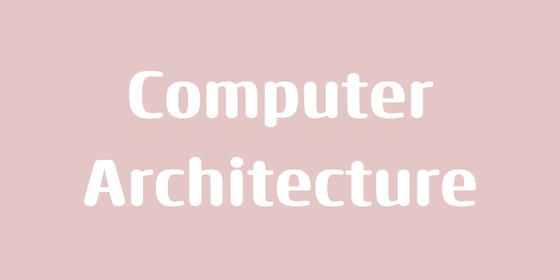

> 본 포스팅은 인프런의 [만들면서 쉽게 배우는 컴퓨터 구조](https://inf.run/PnrRu)를 참조하여 작성한 글입니다.

## 컴퓨터 구조를 배워야 하는 이유

컴퓨터 구조는 왜 배워야 할까? 왜 서울대나, 카이스트, MIT 같은 곳에서 '컴퓨터 구조론'을 전공 필수 과목으로 두었을까? 그것에 대해 알아보자.

컴퓨터 구조론을 잘 배워두명 다음과 같은 이점이 있다. 

첫째, **컴퓨터의 동작 원리**를 잘 알 수 있다는 점이다. 컴퓨터는 트랜지스터라는 반도체 소자로 만들 수 있다. 트랜지스터 여러개를 이용하여 NAND 논리 게이트를 만들 수 있으며 NAND 게이트 여러개로 컴퓨터를 만들 수 있다. 해당 시리즈에서는 컴퓨터 부품 단위로 개념만 익히는 것이 아니라 직접 만들어보면서 부품 별로 동작 원리가 어떻게 되는지 해당 부품이 컴퓨터가 동작함에서 어떤 역할을 하는지에 대해 살펴 볼 예정이다.

둘째, **메모리에 대한 이해**를 할 수 있다는 점이다. 우리가 무슨 프로그래밍 언어로 작성하던지 모든 프로그램은 메모리에 올라가서 실행된다. 우리는 해당 시리즈에서 1bit 메모리부터 아주 큰 메모리까지 만들어보고 컴퓨터가 메모리에서 직접 데이터를 가져오게 함으로 메모리에 대해 확실하게 이해가 가능하게 될 것이다. 그리고 메모리 누수와 관련된 문제가 어떤 문제를 발발하는지 스스로 이해할 수 있게 되고 메모리 관리의 중요성을 이해할 수 있게 된다.

셋째, 컴퓨터가 다루는 정보의 가장 작은 논리적 단위인 **비트 연산**에 대해 알 수 있을 것이다. 비트는 주로 하드웨어에서 쓰이지만 소프트웨어에서도 비트연산을 할 때가 존재한다. 필자의 경우 코딩 테스트 시험을 볼 때도 비트연산을 이용하여 성능 최적화 과정까지도 이뤄 본 경험이 존재한다. 만약 비트를 잘 다루지 못한다면 비트를 통한 코드 작성은 어려울 것이고 다른 사람의 코드도 이해를 못 할 것이다.

컴퓨터가 이해할 수 있는 명령어는 0과 1로 구성된 기계어이다. 해당 시리즈에서 우리는 명령어 표를 보면서 기계어 프로그래밍을 해볼텐데 여기서 많은 불편함이 존재할 것이다. 그리고 생산성을 올리기 위해서 어셈블리어를 이용해 프로그래밍을 해보고 **어셈블리어가 왜 이렇게 작성되는지 이해**가 될 것이다. 그리고 이보다 더 생산성을 올리기 위해서 고급언어를 사용하는 이유에 대해 알아볼 것이다.

컴퓨터 구조를 이해하고 있지 않다면 **잘못된 정보**에 휘둘릴 수 있다. 개발자 커뮤니티에서 올라온 글이 잘못된 정보인지 아닌지를 판단하는 힘이 결국 컴퓨터 구조론에서부터 나오기 때문이다.

사실 프로그래밍을 이용해 어떻게든 동작하게끔 한다면 프로그래밍 언어만 배워도 무방하다. 하지만 요즘 시대에 이것을 제일 잘하는 것은 AI이고 AI에 대체되기 쉬울 것이다. 앞으로 살아남는 개발자는 이렇게 동작만 하게끔 하는 개발자가 아니라, AI를 이용해 AI가 **잘못된 정보를 주더라도 그것을 판단하고 응용하는 개발자**가 살아남을 것이다. 그래서 요즘 시대에 더욱 더 컴퓨터 구조론이 매우 중요하다.

> 📝 용어 정리
>
> - 트랜지스터: 전자 회로에서 신호를 증폭하거나 스위치 역할을 하는 반도체 소자
> - NAND 게이트: 디지털 논리 회로에서 사용되는 기본 논리 게이트로, NAND 게이트로 컴퓨터를 만들 수 있다.

## 블랙박스

엔지니어들은 복잡한 문제를 더 쉽고 잘 분석하기 위해서 작은 단위로 나누는 습관이 있다. 예를 들어, 자동차를 만들 때는 처음부터 전체를 한꺼번에 만들지 않고 프레임, 엔진, 바퀴등 작은 단위로 나눈다. 그리고 각 부품을 맡은 엔지니어는 다른 부품들을 신경쓰지 않고 규격에 맞는 부품 개발에만 집중할 수 있다. 각 부품이 완성되면 이를 조립하기만 하면 된다. 조립 담당자는 만들어진 부품들이 어떻게 동작하는지 내부 원리를 몰라도 된다. 다만, 부품들이 잘 만들어졌겠거니 하고 정해진 방식으로 조립만 하면 된다. 조립 담당자는 각 부품이 어떤 역할을 하는지만 알아도 이를 이용해 충분히 자동차를 완성할 수 있다.

이처럼 내부 작동 원리는 숨겨져 있고 입력에 따른 출력만 예측 가능한 것을 **블랙박스**라고 한다. 각 부품들을 블랙박스로 표현이 가능하다. 심지어 자동차 자체도 블랙박스로 표현이 가능하다. 이런 방식으로 복잡한 시스템을 여러 블랙박스로 나누는 것을 **모듈화**라고 한다. 컴퓨터 하드웨어나 소프트웨어 같은 복잡한 시스템을 만들 때는 문제를 작은 단위로 나누어 하나씩 해결해나가는 **분할 정복 방식**을 사용한다. 이는 블랙박스 개념과 모듈화 개념을 통해 이루어진다.

우리는 해당 시리즈에서 컴퓨터를 직접 만들어 볼 건데 Top-down 방식으로 전체적인 그림을 설명하고, 각 부품의 구현단계에서는 Bottom-up 방식을 이용하여 세부 내용을 자세히 살펴 볼 예정이다.

> 📝 용어 정리
>
> - 분할 정복 방식: 큰 문제를 보다 작은 문제로 분할해 복잡함을 단순화 하는 방법
> - Top-down: 위에서 아래로 내려보는 방식으로, 전체에서 시작해 점차 세부로 좁혀감.
> - Bottom-up: 가장 작은 문제부터 답을 구해가며 전체 문제의 답을 찾는 방식.

## 컴퓨터의 역사

컴퓨터는 compute라는 동사의 '계산하다'와 접미사 er를 붙여서 계산기를 뜻한다. 지금부터 수동식 컴퓨터부터 오늘날 컴퓨터가 되기까지 어떻게 발전해왔는지 살펴보도록 하자.

인류가 최초로 사용한 컴퓨터는 **주판**이다. 주판을 이용해 사람이 구슬을 움직여서 결과를 얻었기에 **수동식 계산기**로 분류된다. 주판은 암산보다 훨씬 빠른 계산이 가능했기에 우리나라에서도 개인용 컴퓨터가 보급되기 전까지는 주판 학원이 큰 인기를 끌었다.

이후에는 네이피어라는 사람이 **계산봉**을 그 이후에는 파스칼이 **파스칼린**을 발명했다. 또 이후에는 라이프니츠가 **라이프니츠 휠**을 발명했는데 이는 추후에 **탁상용 계산기(기계식 계산기)**에 시초가 되었다.

찰스 베비지는 기계식 계산기에 영감을 받아 **차분 기관**이라는 것을 설계하였다. 차분 기관은 수 많은 톱니바퀴를 이용하여 이전 계산 결과를 자동으로 활용이 가능한 진보된 계산기였다. 하지만 기술적 한계와 예산 부족으로 발명은 끝내 하지 못하였다. 이에 베비지는 좌절하지 않고 **해석 기관**이라는 것을 설계하였다. 해석 기관은 차분 기관과 달리 프로그래밍이 가능했고 복잡한 톱니바퀴로 인해 증기기관으로 작동하였다. 이는 현대 컴퓨터와 유사한 구조를 가졌지만 기술과 예산의 한계로 완성되지 못했다.

기술이 발달하면서 전기를 이용한 계산기가 등장하였다. 콘라드 추제라는 사람이 릴레이 스위치로 구성된 **Z3**를 개발하였다. Z3는 세계 최초로 펀치카드를 이용하여 프로그래밍이 가능했던 계산기였으나 2차 세계대전 중에 망가져 세상에는 널리 알리지 못했다. Z3는 릴레이 스위치를 이용하는데 릴레이 스위치는 전기신호로 기계적 스위치를 작동시켰기 때문에 속도가 제한적이였으며 부품이 마모되는 단점이 있었다.

이후, 미국 펜실베니아 대학에서 이러한 단점을 해결하고자 여러 진공관을 이용하여 **에니악**이라는 것을 발명했다. 에니악은 진공관 덕에 마모가 적고 훨씬 빠른 속도를 자랑했다. 그러나 에니악은 펀치카드 대신에 전선을 직접 연결하는 방식으로 프로그래밍을 해야했기 때문에 프로그램 변경에 많은 시간과 인력이 필요했다. 게다가 에니악이 사용하던 진공관은 작동 중 자주 고장났다.

이러한 단점 때문에 **프로그래밍 내장 방식**이 구상되었다. 폰 노이만이라는 사람이 이를 바탕으로 폰 노이만 구조라는 것을 발표하게 되었고 이는 오늘날 컴퓨터의 주류가 되었다. 폰 노이만 구조는 중앙처리장치와 메모리, 입출력 장치를 분리하고 프로그램과 데이터를 메모리에 저장하는 방식이다. 중앙처리장치에서는 ALU가 계산을 수행하고 제어유닛이 모든 동작을 제어한다. 이러한 구조 덕분에 프로그래머들은 전선 연결 없이 펀치카드로 프로그램을 손 쉽게 수정할 수 있었다.

트랜지스터가 개발되면서 컴퓨터의 크기는 작아지고 성능은 좋아지고 전력 소모는 감소했다. 이후, 트랜지스터를 더 작게 만든 직접 회로가 만들어지면서 컴퓨터는 더욱 소형화 및 가격이 저렴해졌다. 이후, 고밀도 직접 회로 -> 초고밀도 직접 회로 -> 극초고밀도 직접 회로로 발전하면서 오늘 날 컴퓨터가 되었다.

## 프로그램은 어떻게 동작할까요?

프로그램은 어떻게 동작할까? 우리가 사용하는 프로그래밍 언어는 목적에 따라 천차 만별이다. 수 많은 언어중 하나를 이용해 프로그램을 개발한다. 프로그램을 실행하면 컴퓨터는 이를 분석하고 결과를 도출한다. 프로그램이 어떤 언어로 만들어졌든 컴퓨터는 문제없이 실행한다. 그러면 이런 의문이 생긴다.

> 그러면 컴퓨터는 이런 프로그래밍 언어를 미리 다 알고 있는 것일까?

그렇지 않다. 컴퓨터는 사실, 0과 1로 이루어진 기계어만 해석할 수 있다. 그러면 어떻게 우리의 프로그래밍 언어를 컴퓨터가 어떻게 알고 처리를 하는 것일까? 바로 우리가 작성한 프로그래밍 언어를 기계어로 변환해야 한다. 그리고 이런 변환 작업을 해주는 소프트웨어가 2가지 존재한다.

첫째, 컴파일러가 있다. 컴파일러는 우리의 프로그래밍 전체 소스 코드를 훓고 컴퓨터가 이해할 수 있는 기계어로 미리 변환한다. 그리고 이 기계어를 실행한다. 두번째는 인터프리터가 있다. 인터프리터는 프로그램을 실행하는 순간부터 소스 코드를 한 줄씩 읽어가서 기계어로 변환해 이를 실행으로 바로 해준다.

두 방식의 장단점을 살펴보자. 먼저 컴파일러의 장점은 전체 소스 코드를 기계어로 변환하는 과정에서 문법 에러같은 것들을 조기에 발견할 수 있다는 점이다. 따라서 프로그램 실행 중에 문법 에러가 발생 할 수 없다. 또한, 미리 기계어로 번역해두어서 실행 속도가 굉장히 빠르다. 이러한 이유로 C나 C++같은 언어는 속도가 생명인 곳에서 쓰인다. 컴파일러의 단점은 실행 전에 기계어로 변환하는데 오래 걸린다. 또한, 테스트를 위해 전체 코드를 컴파일해야 하므로 번거롭다.

인터프리터의 장점은 코드를 한 줄씩 해석하며 기계어로 번역 후 실행하기 때문에 코드를 단계적으로 보면서 개발할 수 있다. 단점은 실행 중 한 줄씩 해석해 실행해서 실행 중에 문법에러가 발생 할 수 있고 실행 속도도 느리다.

> 이런 문제를 해결하기 위해 JIT 컴파일러를 도입하여 Javascript, Python에 사용되지만 그래도 컴파일 언어보다 느리다.

이처럼 우리가 자주 사용되는 프로그래밍 언어를 고급언어라고 불리며, 반대로 어셈블리어나 기계어같이 사람이 이해하기 힘든 언어를 저급언어라고 일컫는다.