> 본 포스팅은 인프런의 [만들면서 쉽게 배우는 컴퓨터 구조](https://inf.run/PnrRu)를 참조하여 작성한 글입니다.

## 불 대수를 활용할 수 있는 방법

우리는 지금까지 프로그램의 동작 방식과 컴퓨터의 구조에 대해 살펴보았다. 비트에 저장되는 0과 1을 논리적인 거짓과 참으로 해석하여 수학적으로 다루는 불대수를 배웠고 이 비트들을 10진수와 16진수로 표현하는 방법에 대해 학습하였다. 하지만 우리는 단순히 이론적으로만 학습하여 실제 불대수가 어떻게 활용되는지 추상적으로만 알아서 조금 모호한 경향이 없지 않아 있다. 그래서 우리는 실제 컴퓨터를 만들어보고자 한다.

컴퓨터를 만들 수 있는 방법은 여러가지가 존재한다. 컴퓨터의 본질은 단순하다. 0과 1을 제어할 수 있는 스위치만 있으면 만들 수 있다. 다만 기술들이 발전하면서 더 효율적인 장치들이 사용되어 왔다. 처음에는 릴레이라는 기계적 스위치를 사용해왔고 이후 진공관으로 발전하였으며 현재는 더 효율적인 트랜지스터를 사용하고 있다. 미래에는 물이나 공기같은 매채로 0과 1을 제어할 수 있는 더 좋은 부품이 만들어진다면 트랜지스터의 시대도 아마 종말을 맞이할 것이다.

아무튼 컴퓨터를 직접 만들려면 이러한 방식 중에 하나를 선택해야 한다. 가장 직관적인 방법은 브래드보드에 전기배선을 하여 물리적으로 만드는 것이다. 하지만 이 방법은 부품 구입 비용이 들고 규모가 커지면 관리가 어렵다. 그래서 우리는 다른 접근법을 택하려고 한다. 바로 하드웨어 소프트웨어 시뮬레이션을 활용할 예정이다. 이렇게 하면 추가 비용 없이 더 쉽게 컴퓨터를 만들고 관리할 수 있다.

## 하드웨어 시뮬레이터 설치하기

우리가 설치 할 하드웨어 시뮬레이션은 **logisim-evolution**이다. 이 프로그램은 자바 기반으로 작동하므로 자바가 미리 설치되어 있어야 한다. 필자는 이미 자바가 설치되어 있고 MAC환경에서 `homebrew`로 쉽게 설치할 수 있었다. 자바가 설치되어 있는지 유무는 아래와 같은 명령어를 터미널에 작성하면 될 것이고 혹시나 설치가 안되어 있다면 AI나 구글링을 통해 쉽게 찾을 수 있을 것이다.

``` bash
java --version
```

이제 logisim-evolution을 설치해보자. [다운로드 링크](https://github.com/logisim-evolution/logisim-evolution/releases)로 접속하자. 그러면 아래와 같은 화면이 나올 것이다.

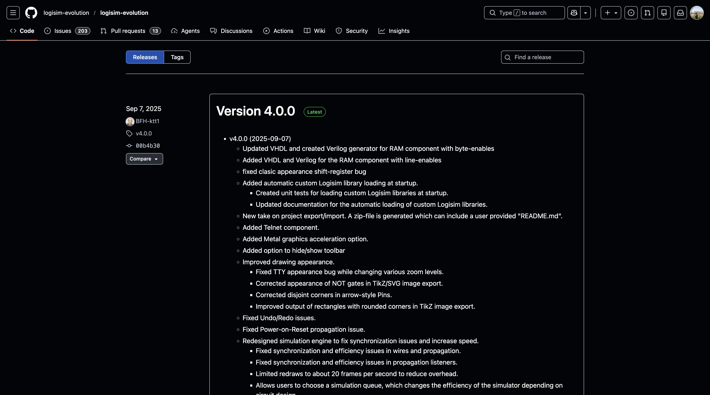

가장 최신버전으로 가서 확장자가 `.jar`파일을 다운로드 받아주면 된다. 그리고 다운받은 경로에 jar파일을 실행시켜준다.

``` bash
java -jar ./logisim-evolution-4.0.0-all.jar
```

그러면 아래와 같이 정상적으로 잘 나오는 것을 확인할 수 있다.

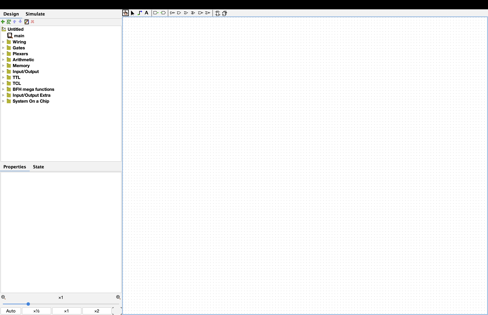

## NAND 게이트

이제 본격적으로 실습을 가져보도록 하겠다. 먼저 NAND 게이트를 만들어보자. 컴퓨터에 필요한 모든 회로는 NAND 게이트로 만들 수 있기 때문에 먼저 실습해보자. NAND 게이트는 트랜지스터로 만들어지는데 결국 컴퓨터는 트랜지스터로 만들어졌다라고 해도 무방하다.

> 트랜지스터는 어떻게 만들어지는가?

트랜지스터는 전기의 흐름을 제어하는 스위치 역할을 하는 장치이다. 수학, 전자기학, 전자공학의 도움으로 탄생이 된 것이다. 컴퓨터 공학에서는 더 이상 아래로 내려가지 않는다. 컴퓨터를 만들기 위해서는 0과 1을 자유자재로 제어할 수만 있으면 되는데 현 시대에는 트랜지스터가 가장 효율적이기 때문에 이를 사용한다. 컴퓨터 공학은 기초 과학에서 스위치 역할을 하는 장치를 잘 만들었다고 가정하고 이 스위치로 컴퓨터를 만든다. 여기서도 블랙박스 개념이 적용되는 것이다.

우리는 트랜지스터 원리까지 깊게 들어가지 않고 단순히 스위치 역할을 한다는 점만 기억하며 이를 이용해 컴퓨터를 만들어보자. 그러면 트랜지스터를 다루기에 앞서 logisim의 기본 사용법부터 살펴보도록 하자.

### logisim 기본 사용법


화면 왼쪽에는 우리가 만들 회로와 이를 구성하는데 필요한 부품들이 준비되어 있다. 컴퓨터를 만드는데 필요한 모든 부품들이 이미 만들어져 있지만 우리는 트랜지스터를 이용하여 이 부품들을 직접 만들어보며 원리를 이해할 예정이다. 기본적으로 생성되는 main 회로는 그대로 두고 왼쪽 위의 초록색 플러스 버튼을 눌러 새로운 회로를 만들어보자. 초록색 버튼을 누르면 회로 이름을 입력하는 입력 창이 나오는데 이 회로의 이름을 `NAND_Gate`로 하자.

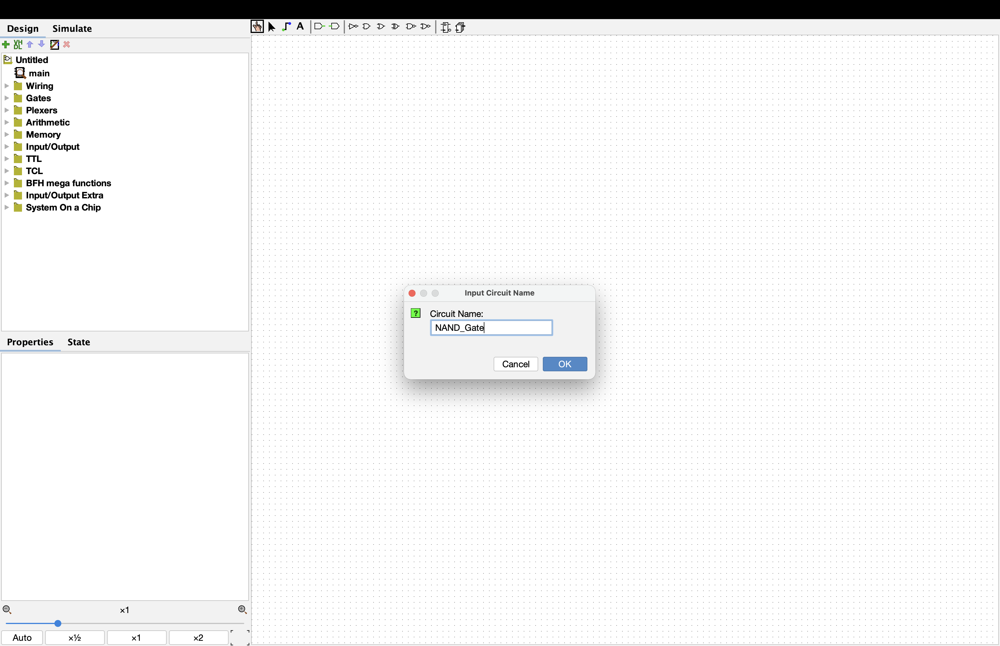

다음으로 왼쪽에 Wiring 폴더를 열어주시고 Pin을 선택하고 회로에서 마우스 왼쪽 클릭을 해보자. 그리고 키보드의 Ctrl키와 마우스 휠을 이용하여 화면을 확대해주자.

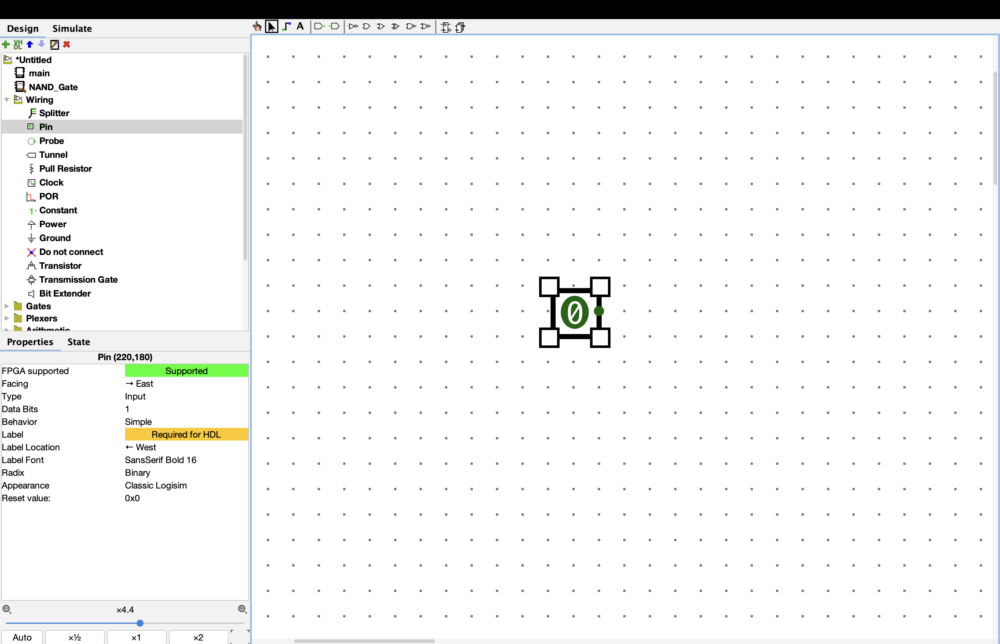

이 핀은 입력이나 출력신호를 전달하는 역할을 수행한다. 핀을 선택하면 왼쪽 하단 Properties에서 속성을 확인할 수 있다. 현재 Type이 Input으로 설정되어 있다. 핀의 외형이 구버전으로 선택되어 있는데 Appearance에서 Arrow Shapes를 선택해 최신 외형으로 변경해보자.

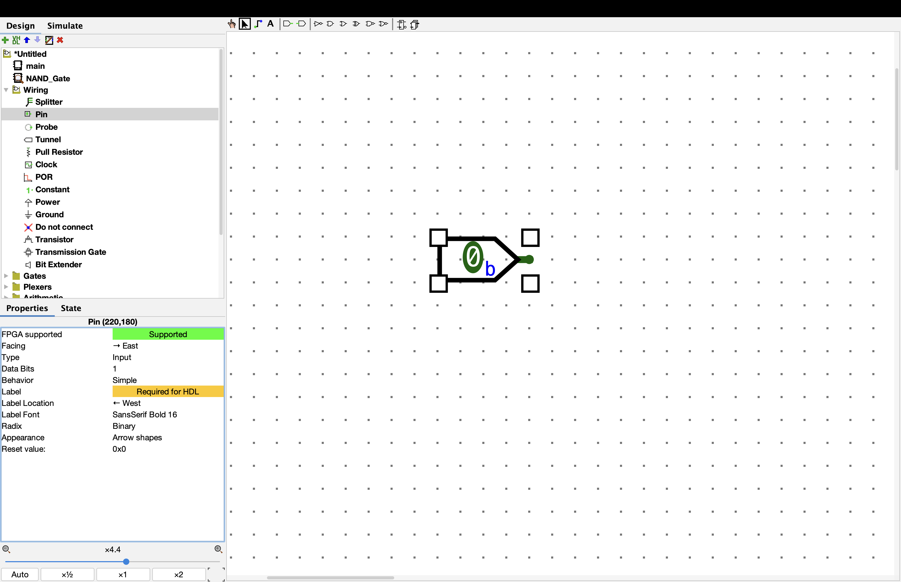

이는 화면 상단에 Add Pin을 사용하는 것과 동일한 결과를 만든다. 이제 입력 신호를 LED에 연결하여 불을 켜보도록 하겠다. 왼쪽 탭에 Input/Output 폴더에 LED를 선택하고 회로에 마우스 왼쪽 클릭으로 배치한다. LED는 처음에는 꺼진 상태라 검은색으로 표시된다.

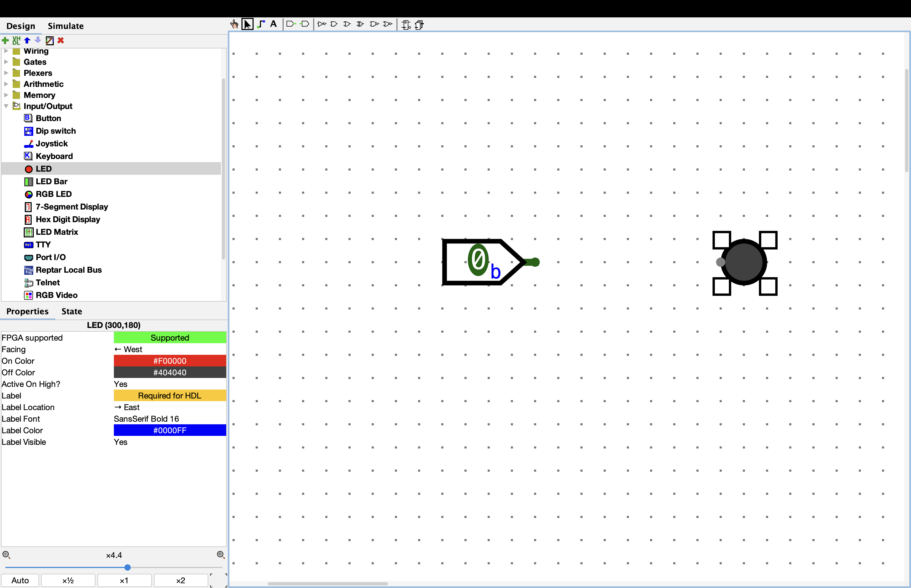

앞서 만든 입력핀과 LED를 연결해보자. 입력핀의 초록색 부분을 클릭하고 드래그하면 전선이 생기는데 이 전선을 LED의 핀까지 연결한다. 그러면 LED에 변화는 없을 것이다. 왜냐하면 아직 전기신호를 주지 않았기 때문이다. 전기신호를 줄려면 시뮬레이션 모드를 실행해야 한다. 그러면 한번 실행해보겠다.

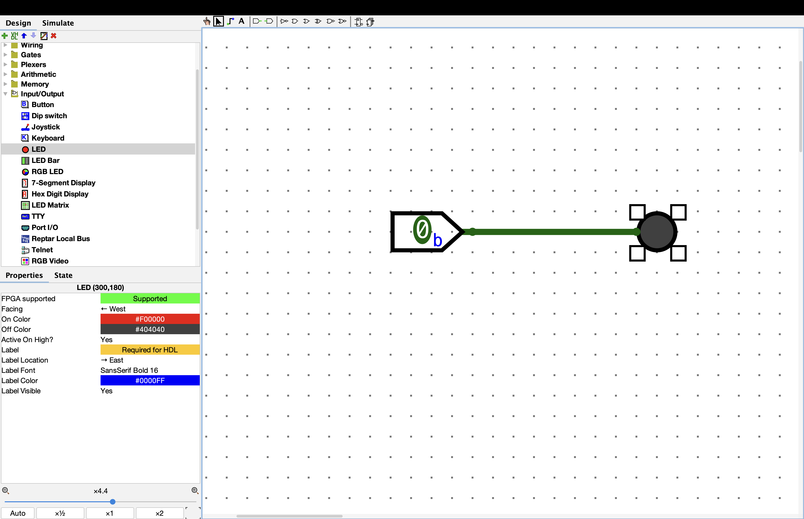

시뮬레이션 모드는 화면 위쪽에 손가락 버튼을 클릭하거나 Ctrl + 1을 눌러서 활성화 할 수 있다. 그리고 입력 핀을 클릭하면 아래와 같이 LED에 불이 켜질 것이다.

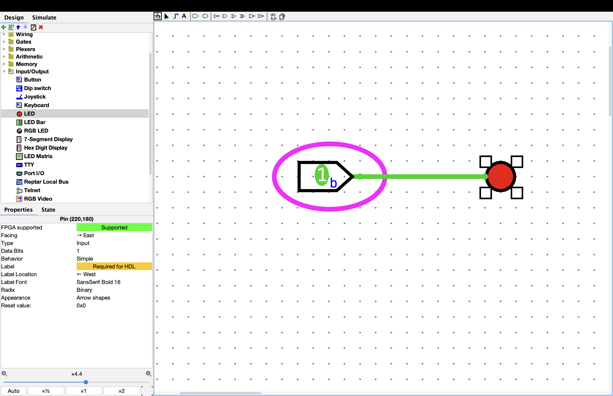

시뮬레이션 모드에서는 회로는 수정할 수 없고 시뮬레이션 모드를 해제해야 한다. 해제하려면 상단에 손가락 버튼 오른쪽의 마우스 버튼을 누르면 시뮬레이션 모드를 해제할 수 있다. 그러면 추가적으로 LED 하나를 더 추가해보겠다. LED를 Ctrl + d로 복제하거나 이전 처럼 끌어서 배치한다. 그런 다음 전선 중앙을 클릭하고 선을 끌어와 새로운 LED와 연결한다.

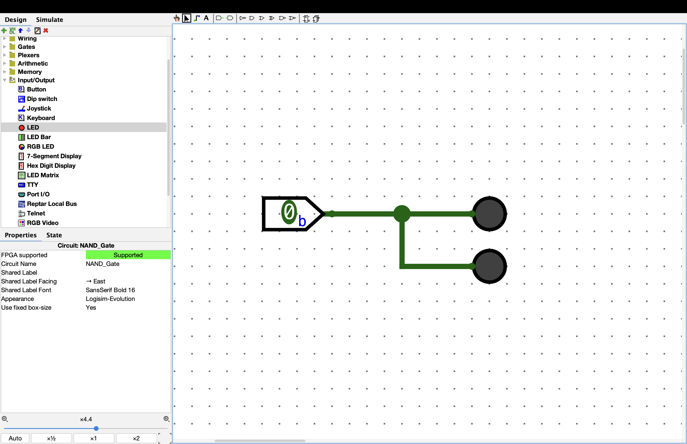

이번에는 입력핀과 더불어서 출력핀도 연결해보도록 하겠다. 2개의 LED 중에 하나를 지우고 그 자리에 Add Pin으로 출력핀을 하나 추가한다. 시뮬레이션 모드로 전환하고 입력 핀에 신호를 넣으면 LED와 출력핀이 함께 반응하는 것을 볼 수 있다.

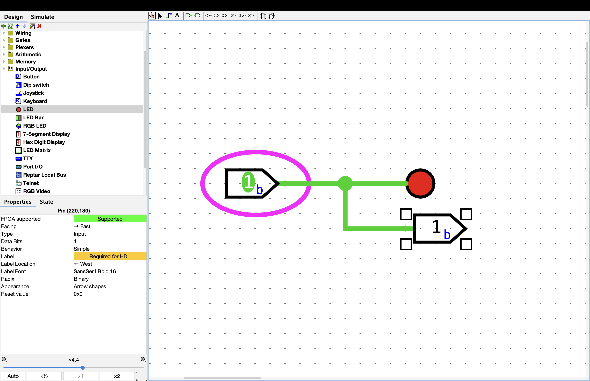

> 여기서 LED도 출력이고 출력 핀도 출력인데 왜 출력핀이 필요한가요?

사실 LED와 출력핀은 모두 출력장치이다. 하지만 중요한 차이가 존재한다. LED는 현재 회로에서 신호를 시각적으로 보여주는 역할을 하지만 출력핀은 외부 회로와 연결될 수 있다. 다른 회로가 이 출력핀을 입력으로 받아 추가 처리할 수 있다. LED로는 이런 연결이 불가능하다.

이제 logisim의 기본 조작벙법에 대해 살펴보았으니 트랜지스터를 이용해 NAND 회로를 만들어 보겠다. 회로에서 만든것을 전체 선택하여 delete 키를 눌러서 모두 지운 다음에 왼쪽에 Wiring 폴더에서 트랜지스터를 선택해 화면에 배치한다.

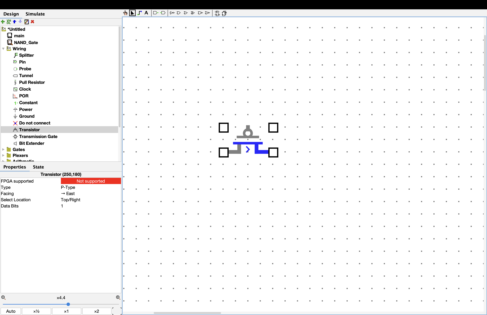

트랜지스터의 속성을 보면 P-Type으로 표시되어 있다. 트랜지스터는 PNP 타입과 NPN 타입이 있는데 우리는 현재 PNP 타입만 살펴보도록 하겠다. 현재 사용 중인 P-Type, 즉 PNP 타입은 왼쪽에 Emitter, 위쪽이 Base, 오른쪽이 Collector이다. 이 트랜지스터의 특징은 Emitter에서 Base로 전류가 흐르면 Emitter에서 Collector로도 전류가 흐른다. 전류는 전압이 높은 곳에서 낮은 곳으로 흐른다. Emitter에 5V의 전압, Base의 0V의 전압이 있다면 Base의 전압이 더 낮으므로 전류가 Emitter에서 Base로 흐르게 된다. 이 때 Emitter에서 Collector로도 전류가 흐르므로 Collector쪽에 LED가 연결되어 있다면 불이 켜진다. 어렵게 느껴질 수도 있지만 이는 트랜지스터라는 스위치를 사용하는 방법 혹은 약속이라고 기억하면 좋을 것이다.

그러면 트랜지스터의 동작을 한번 확인해보자. P-Type의 트랜지스터의 Emitter에는 5V의 출력을 내는 Power를 연결하고 Base에는 입력핀을 연결한다. 그리고 Collector에 LED를 연결하면 LED에 불이 들어오는 것을 확인할 수 있다.

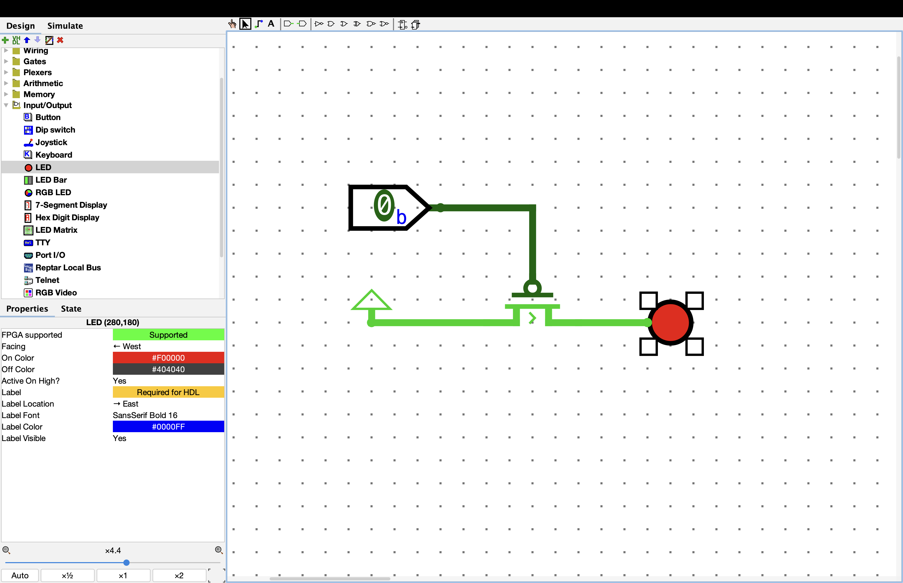

그러면 Base, 즉 입력핀에 신호를 넣으면 어떻게 될까? LED가 아마 꺼질 것이다.

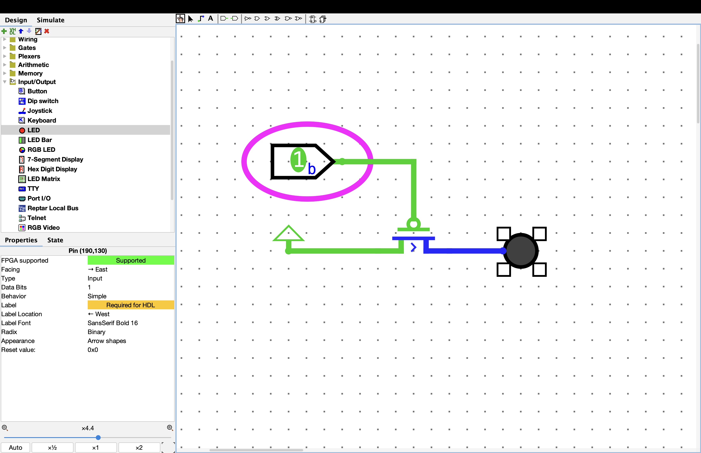

입력핀에 신호를 넣으면 Emitter와 Base 전부 5V가 되어 전류가 흐르지 않게 된다. 그 결과 Collector쪽으로 전류가 흐르지 않는다. 그러면 이를 통해 NAND 회로를 만드는 것은 아주 간단하다. 기존 회로에 트랜지스터를 하나 더 추가하자. 보기 좋기 하기 위해 트랜지스터 Properties에 Select Location에서 Bottom/Left로 방향을 바꿔준다. 이는 보기 좋게 방향을 바꾼 것일 뿐 회로의 동작에는 전혀 영향을 끼치지 않는다. Emitter에는 Power에 연결하고 Base는 새로운 입력 핀과 연결한다.

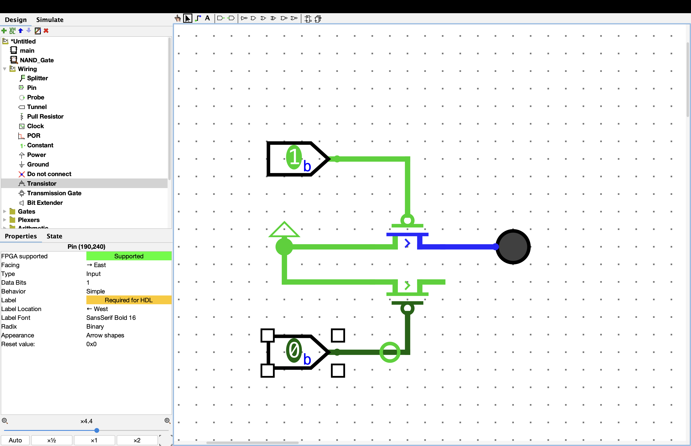

두 입력핀을 구분하기 위해 이름을 지정하겠다. 첫번째 입력 핀은 Properties의 Label을 선택해 A로 지정하고 두번째 입력핀은 B로 지정한다.

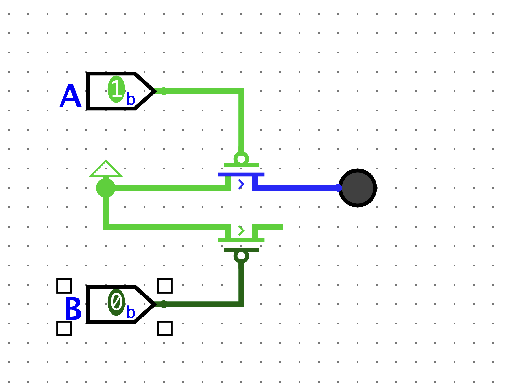

마지막으로 Collector를 첫번째 트랜지스터의 Collector와 연결해주면 끝이다.

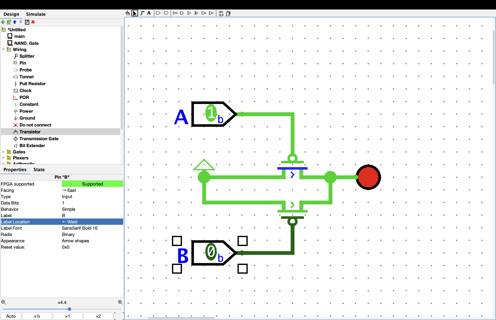

하지만 이렇게 NAND 회로를 만들면 복잡할 것이다. 그것을 위해 logisim이 준비해둔 NAND 게이트를 이용하면 된다.

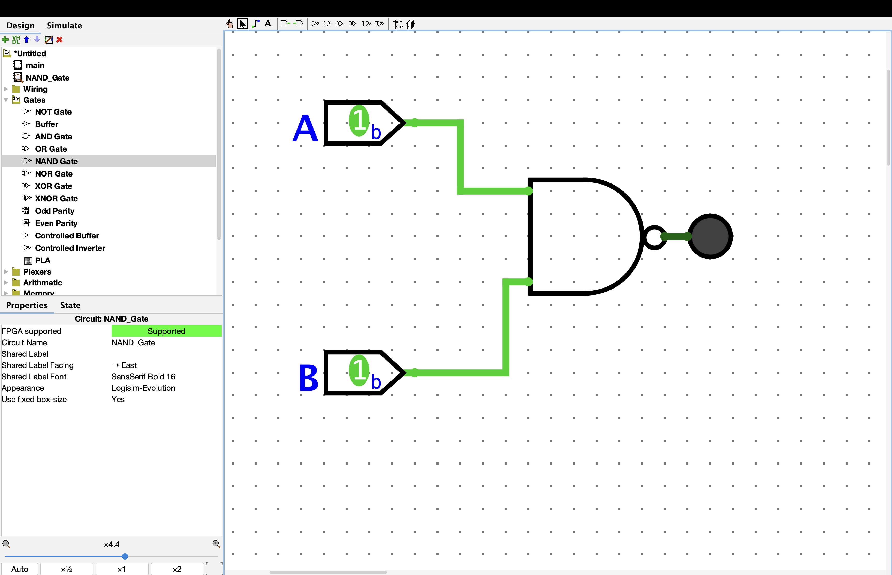

## NOT 게이트

NAND 게이트로 가장 먼저 만들어 볼 게이트는 NOT 게이트이다. Gates 폴더에서 NAND 게이트를 하나 가져와 배치한다. NAND 게이트로 NOT 게이트를 만드는 과정은 매우 간단하다. 먼저 입력 핀을 하나 만들어 이름을 A로 설정하고 이 입력핀을 NAND 게이트 입력에 둘다 연결한다. 마지막으로 출력 핀을 만들어 이름을 Q로 설정하고 NAND 게이트 출력과 연결하면 끝이다.

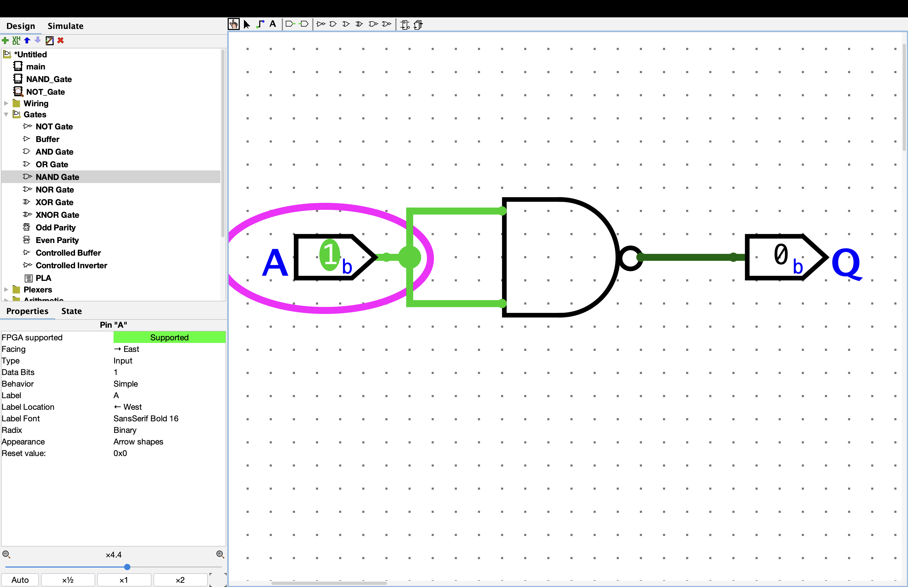

우리가 만든 NOT_Gate 프로젝트를 우 클릭하여 Analyze Circuit를 선택하면 새 창이 나타난다. 여기서 Table을 클릭하면 우리가 만든 회로의 진리표를 볼 수 있다.

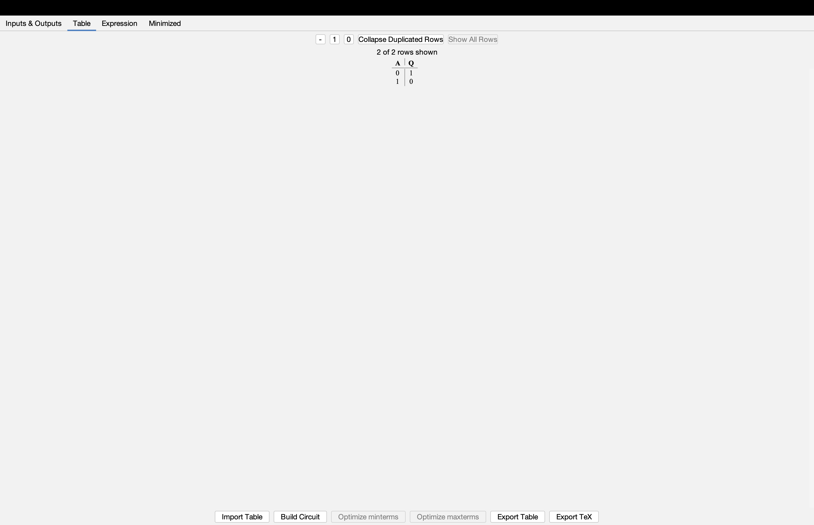

## AND 게이트

이번에는 AND 연산을 수행하는 AND 게이트를 만들어 볼 것이다. AND 게이트는 NAND 게이트와 NOT 게이트 하나로 구성할 수 있다. 입력핀 2개를 만들어 각각 A,B라고 이름을 변경하고 NAND 게이트를 만들어 배치하고 2개의 입력핀을 연결해준다. 그리고 NOT 게이트를 배치해 NAND 게이트의 출력을 NOT 게이트의 입력으로 하여 연결하고 출력핀을 하나 만들어 이름을 Q로 하여 NOT 게이트 출력과 연결해준다.

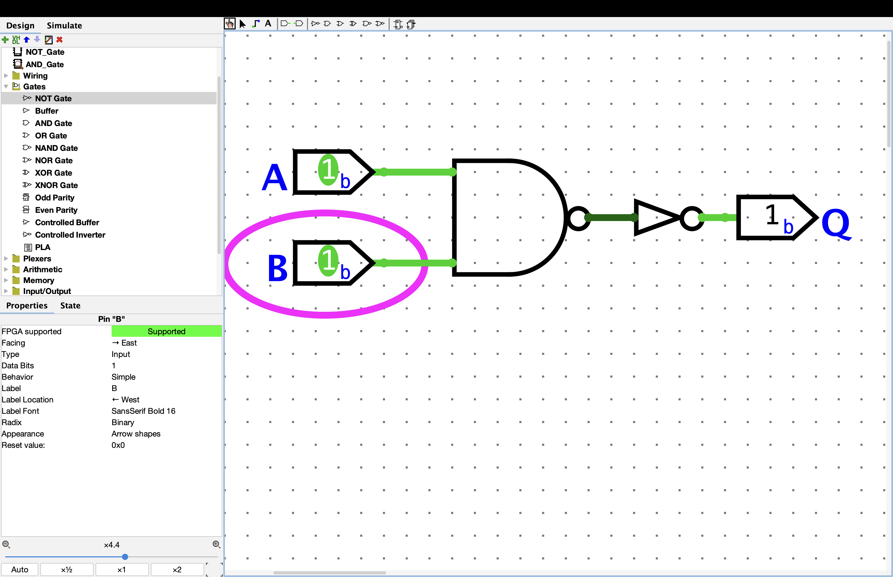

그러면 우리가 만든 회로의 진리표를 보면 AND 게이트와 동일하다는 것을 알 수 있다.

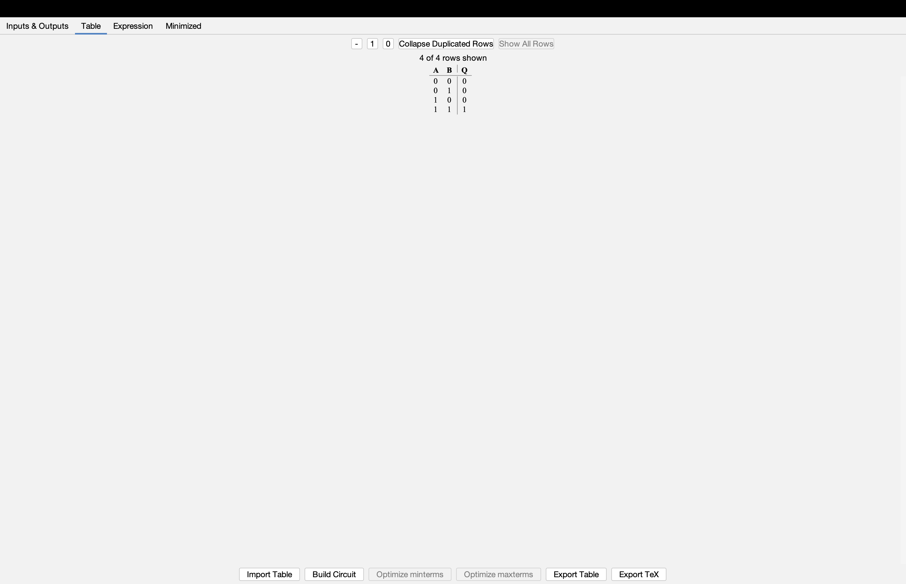

그러면 입력이 3개일때는 어떻게 할까? 방법은 2가지가 존재한다. 첫번째는 입력 3개를 만들어 2개의 입력을 AND 게이트에 연결하고 이 AND 게이트의 출력과 나머지 입력을 AND게이트에 연결하는 것이다.

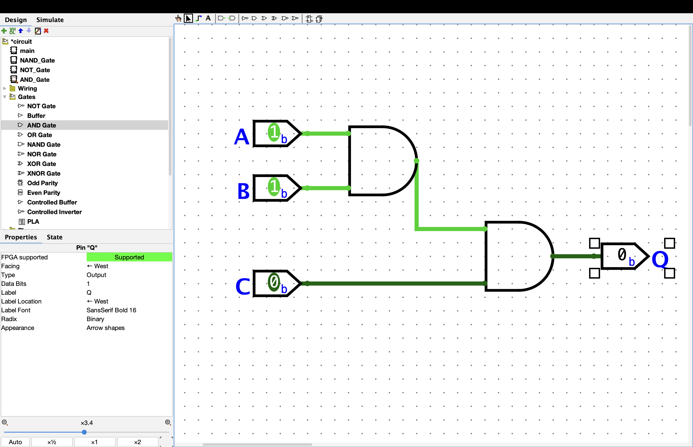

하지만 너무 복잡하다. 그래서 더 간단한 방법이 있다. 바로 내장 AND 게이트의 속성을 변경해주면 된다. AND 게이트의 Properties의 Number of Inputs를 3으로 변경해준다. 그리고 입력핀과 출력핀을 연결만 해주면 된다.

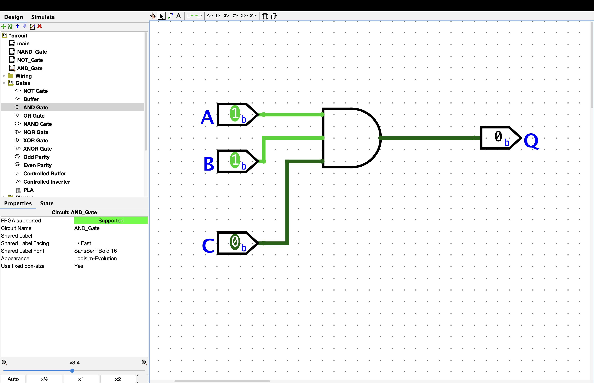

## OR 게이트

이제는 OR 게이트를 만들어보겠다. 입력 핀 2개를 만들어 각각 A,B로 이름을 설정하고 두 입력을 각각 NOT Gate에 연결한다. 다음으로 NAND 게이트를 하나 배치하고 NOT 게이트의 출력을 NAND 게이트 입력으로 둔다. 마지막으로 NAND 게이트의 출력을 출력핀으로 연결하면 OR 게이트가 완성된다.

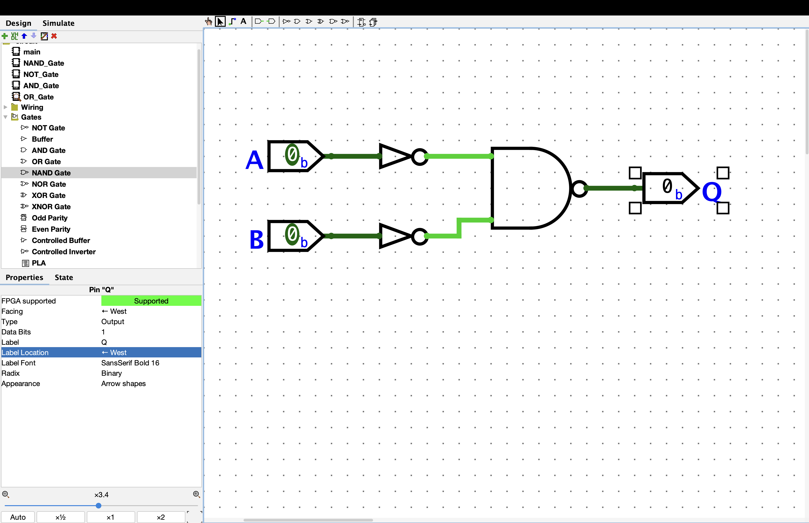

## XOR 게이트

이번에는 XOR 게이트를 만들어보자. XOR 게이트는 NAND 게이트 4개로 만들 수 있다. 먼저 A와 B라는 이름의 입력 핀 2개를 만들고 NAND 게이트 4개를 생성한다. NAND 게이트를 쉽게 구분하기 위해 각각 이름을 한번 지정해보자. 각각 N1부터 N4까지 지정해보자. 그리고 두 입력핀을 N1에 연결한다. N1의 출력은 N2와 N3의 입력으로 연결한다. 이 때 N2와 N3에는 입력이 하나씩 부족한데 이 때 N2의 입력을 A 입력핀과 N3의 입력을 B 입력핀과 연결한다. 그리고 N2와 N3의 출력을 N4와 연결하면 기본 구조가 완성된다. 마지막으로 N4의 출력을 출력핀 Q와 연결하면 끝이다.

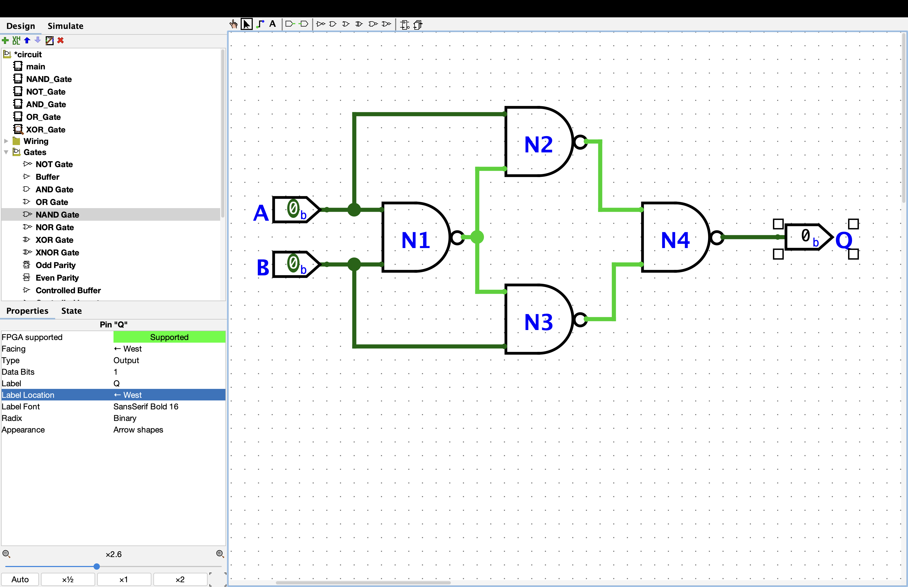

## 1비트 2입력 MUX

이번에는 멀티플렉서에 대해 알아보고 만들어보자. 멀티플렉서는 여러 입력 중 하나를 선택하여 출력으로 내보내는 장치이다. 줄여서 MUX라고도 부르며 한글로는 데이터 선택기라고 부른다. 반대로 하나의 입력을 여러 출력 중 하나로 선택하는 장치를 DeMultiflexer 혹은 DEMUX라고 한다.

멀티플렉서가 A와 B 2개의 입력을 받을 때는 이 입력들 중 하나를 선택하기 위한 추가 입력이 필요하다. 이 데이터 선택력 입력을 셀렉션이라고 부르겠다. 입력이 2개이므로 셀렉션 비트는 1비트면 충분하다. 셀렉션 비트가 0이면 출력은 입력 A가 되고 셀렉션 비트가 1이면 출력은 입력 B가 된다. 멀티플렉서의 입력 데이터 수가 늘어나면 셀렉션 비트수도 더 필요해진다. 이렇게 생각하니 많이 복잡한 것 같다. 일단 너무 복잡한 것을 한번에 보기보다 지금은 2개의 입력 MUX에 대해서만 알아보도록 하겠다.

그러면 한번 만들어보자. 먼저 입력 A,B를 생성하고 셀렉션으로 사용 할 입력도 하나 생성한다. 다음으로 NAND 게이트 3개를 생성하고 구분하기 쉽게 이름을 변경하자. 그리고 입력핀을 연결해주자. 먼저 A를 N1에 입력으로, B를 N2에 입력으로 연결하자. 그리고 셀렉션을 N1과 N2에 각각 연결하는데 N1에 연결할 때는 NOT 게이트를 거치도록 한다. 이 NOT 게이트가 데이터 선택을 가능하게 하는 MUX의 핵심 부분이다. 마지막으로 N1과 N2의 출력을 N3의 입력으로 연결하면 된다.

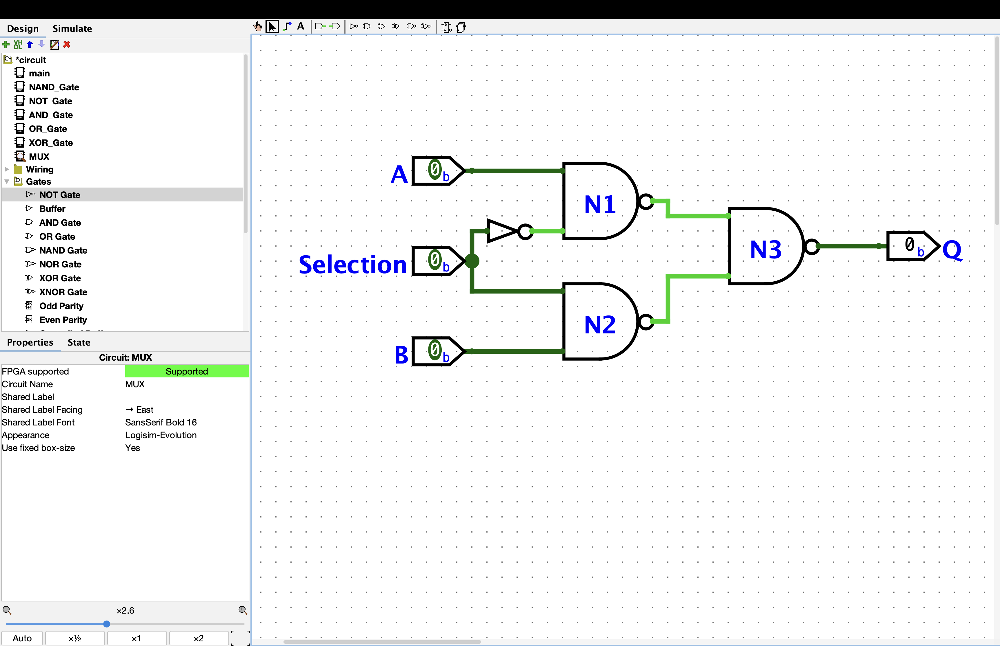

이처럼 MUX는 Selection을 통해 원하는 입력을 출력으로 선택할 수 있어 컴퓨터 설계에서 매우 광범위하게 활용된다.

## 8비트 2입력 MUX(feat.터널 사용법)

이번에는 8비트 입력 2개 중 하나를 선택하는 8비트 MUX를 만들어보자. 그 다음 8비트 입력 2개와 셀렉션 비트를 만들건데 2개의 8비트 입력은 Data bits를 8로 변경한다. 두 입력의 이름은 각각 IN_A, IN_B로 변경하고 셀렉션 비트는 Selection으로 변경한다. 8비트 MUX는 이전에 만든 1비트 MUX를 이용해 두 입력의 각 비트를 1비트 MUX와 연결하면 된다. 따라서 8비트의 각 비트를 쪼갤 필요는 있다.

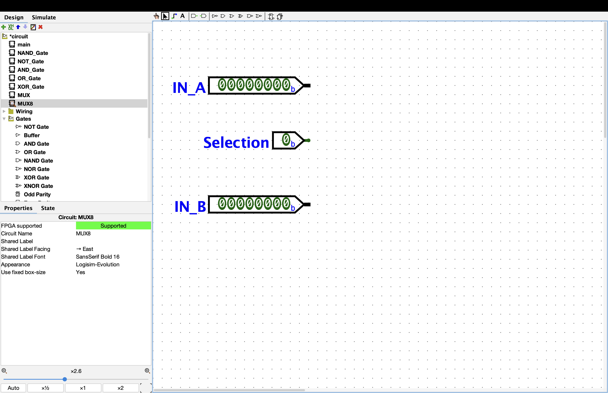

이를 위해서 왼쪽에 Wiring으로 이동하여 Splitter를 선택해준다. 그리고 Splitter를 선택하고 Fan Out과 Bit Width In을 8로 변경해준다. IN_A와 나오는 방향을 일치시키기 위해서 Facing을 East로 Appearance를 Right Handed로 변경해주고 Spacing을 3으로 하여 간격을 늘려준다. 그리고 IN_A와 연결해주면 입력이 하나하나 분리된다.

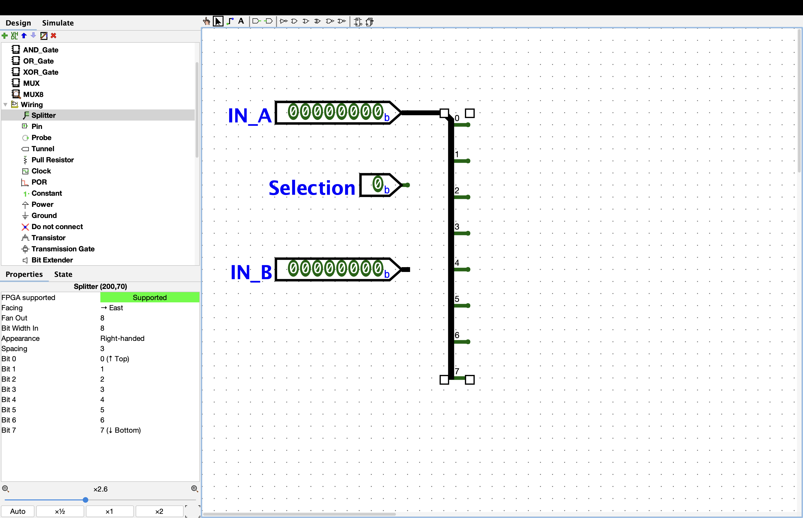

이제 Splitter를 Ctrl + D를 눌러 복사해주고 Appearance만 Left-Handed로 변경해주고 보기 좋게 IN_B와 연결해준다.

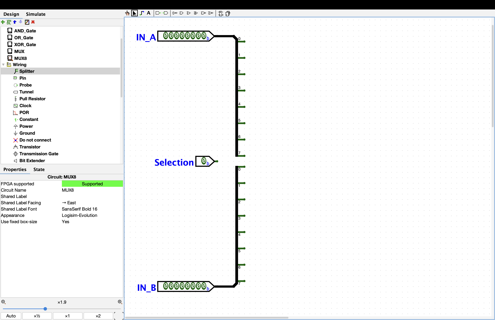

이제 이전에 만든 1비트 MUX를 활용하여 8개의 비트를 각각 연결해줘야 한다. 왼쪽에 Plexers로 이동하여 멀티 플렉서를 배치한다. 총 8개 배치한다.

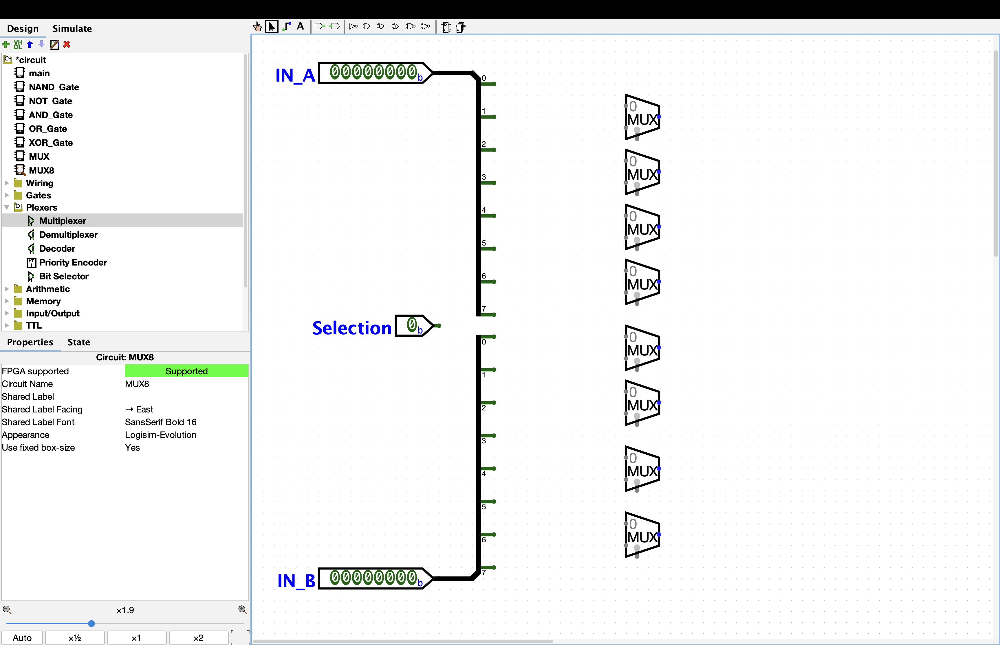

그리고 각각 연결을 시켜준다. 그리고 셀렉션 비트도 각각 MUX와 연결하고 마지막 출력도 출력핀과 연결한다. 출력핀을 만들고 Data Bits를 8로 변경한다. 그리고 8개의 비트를 하나의 선으로 만들기 위해 Splitter를 설치하고 Facing을 West로 Fan Out과 Bit Width In을 8로, Spacing을 3으로 변경한다. 그리고 Appearance를 Centered로 변경해준다. 그리고 각 MUX와 연결해준다.

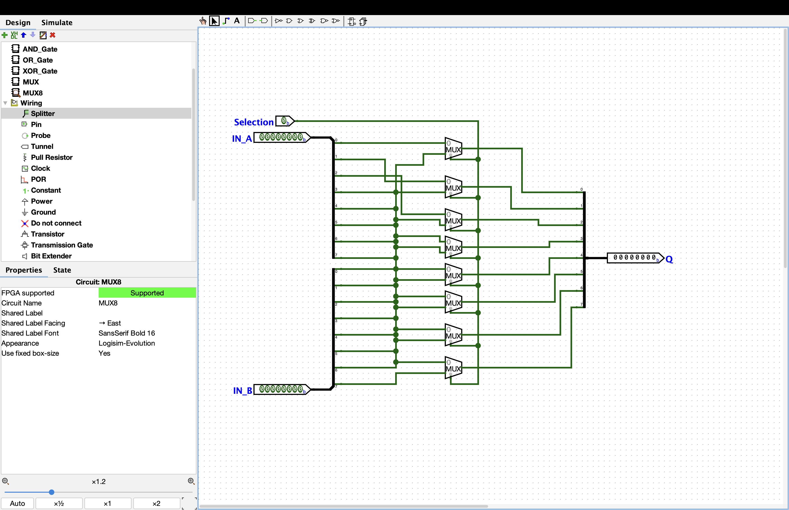

이렇게 우리가 브레드보드라고 가정한다면 위와 같이 8개의 전선을 모두 직접 연결해야 하는데 이렇게 선이 길게 늘어나면 선이 복잡해보인다. 더 큰 회로를 만들수록 선이 많아져 더 복잡해진다. 하지만 logisim은 시뮬레이션 프로그램이기 때문에 현실에서는 불가능한 방식도 구현할 수 있다. 선을 직접 연결하는 대신에 포탈같은 것을 만들어 시작과 끝을 연결해줄 수 있는데 이런 기능을 바로 터널이라고 한다. 터널 사용법은 매우 직관적이여서 복잡한 설명이 필요가 없다. 지금 만든 회로를 터널을 만들어서 더 깔끔하게 만들어보겠다.

먼저 기존에 연결한 선을 모두 제거 후, 화면 왼쪽의 Wiring 폴더로 이동하여 터널을 선택 해 배치한다. 이 터널은 입력 0번째 비트와 연결한다. 터널 이름은 A0이라고 하자. 이렇게 Splitter에 각 터널을 만들고 이름을 입력하자.

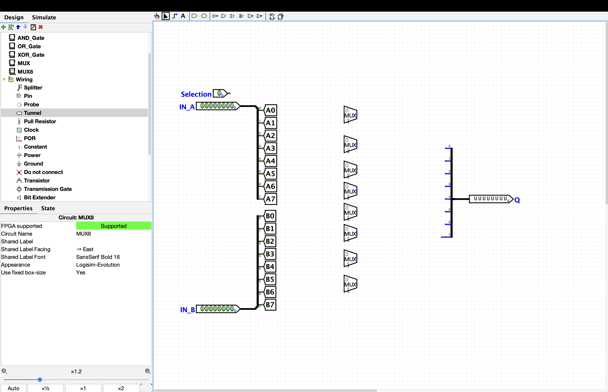

이제 만들어진 터널과 MUX의 입력과 연결하자. 새로운 터널을 만들고 Facing을 East로 변경한다. 그리고 첫번째 MUX 입력에 터널 A0, B0을 각각 연결한다. 이렇게 나머지도 마찬가지로 연결해준다.

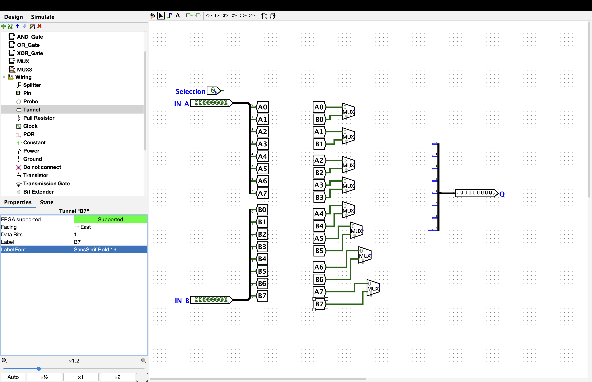

다음으로 셀렉션 비트에 터널을 연결하고 터널의 이름을 셀렉션으로 변경한다. 그리고 셀렉션 터널을 하나 더 만들고 MUX의 셀렉션 핀에 연결해준다.

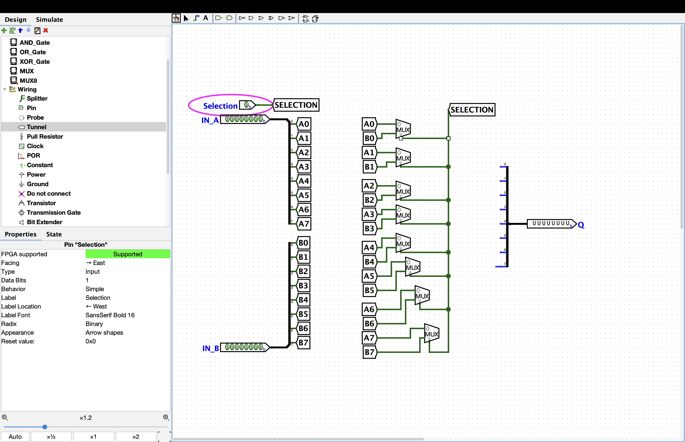

이제 출력을 다음과 같이 연결해보자.

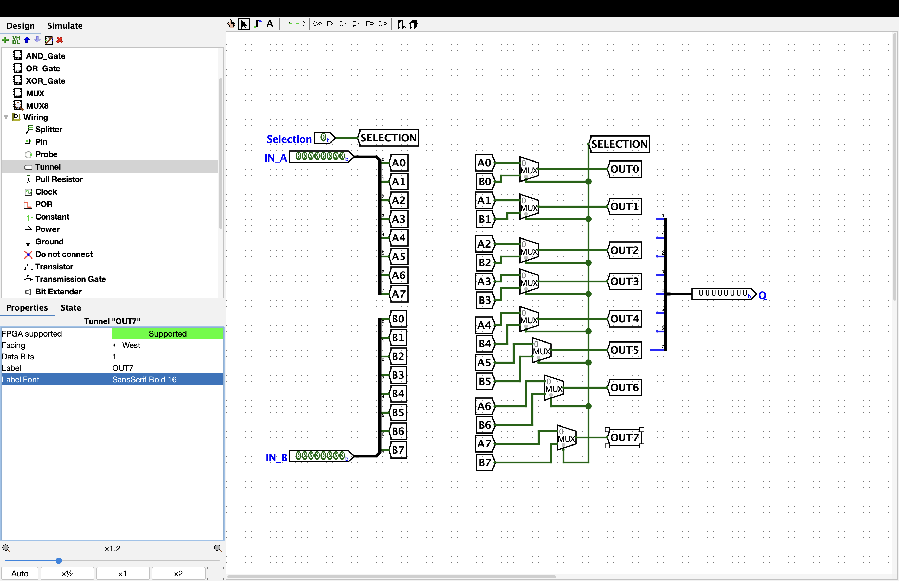

마지막으로 출력핀과 연결된 Splitter의 각 비트에 MUX의 출력을 터널을 이용해 연결한다.

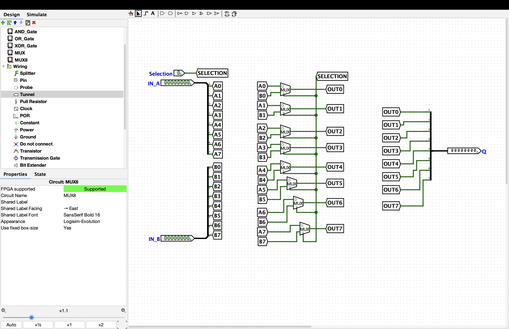

## 8비트 4입력 MUX

이번에도 8비트 MUX를 만들어보자. 단, 이번에는 입력이 2개가 아닌 4개의 MUX를 만들어보자. 먼저 8비트 입력 핀 4개를 만들어 이름을 각각 IN_0, 1, 2, 3으로 변경한다. 4개의 입력을 선택하기 위해 셀렉션 비트는 2비트로 설정한다. 다음으로 8비트 출력핀을 하나 만든다. 이제 Data Bits가 8인 MUX 3개를 설치한다.

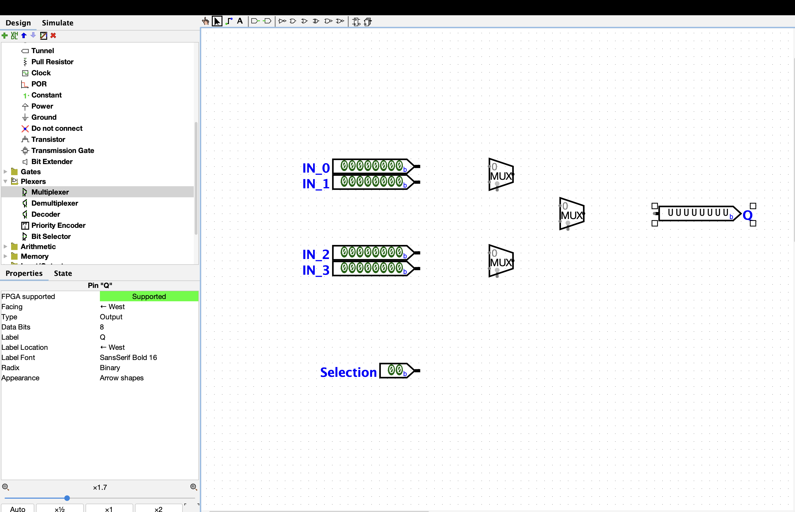

그리고 Wiring 폴더에 Splitter를 가져와 Fan Out을 2로 Bit With In을 2로 설정한다. Splitter를 셀렉션 비트에 연결하여 비트를 하나씩 분리한다. 이제 입력 0과 1을 1번 MUX에 연결하고 입력 2와 3을 2번 MUX에 연결한다. 그리고 두 MUX의 결과를 3번 MUX에 연결한다. 이제 셀렉션 비트의 0번 비트는 1번, 2번 MUX의 셀렉트 핀과 연결하고 1번 비트는 3번 MUX의 셀렉트 핀과 연결해주면 된다. 3번 MUX는 출력핀과 연결한다.

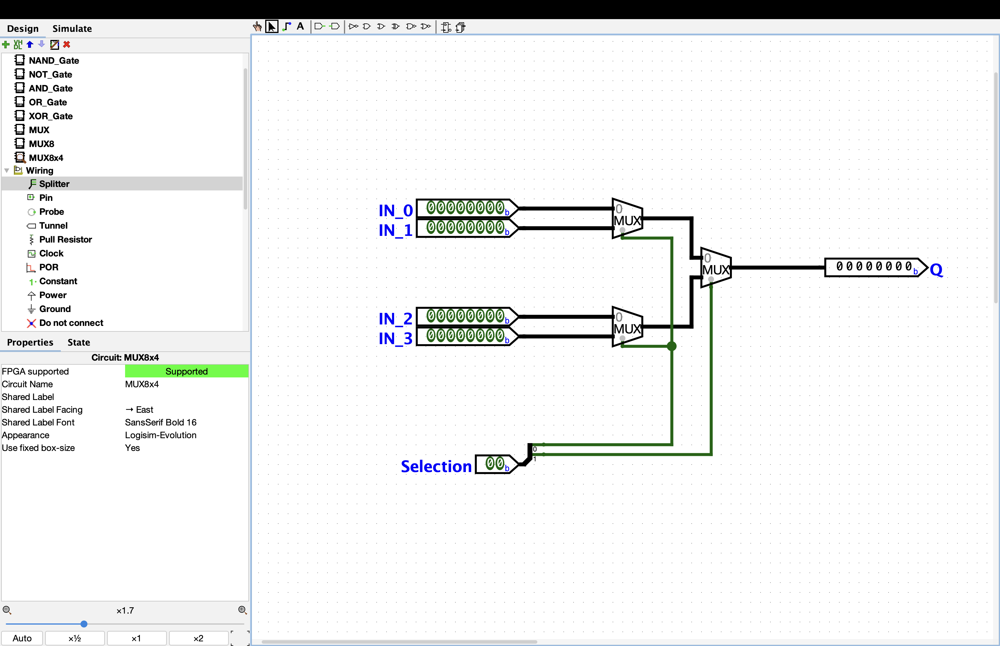

셀렉션 비트의 0번 비트로는 입력 0 또는 1을 선택하거나 입력 1 또는 3을 선택한다. 여기서 4개의 입력이 2개의 입력으로 줄어든다. 그리고 Selection의 1번 비트로는 1번 MUX나 2번 MUX를 선택한다.

## 8비트 8입력 MUX

이번에는 8비트 8입력 MUX를 만들어 볼려고 한다. 이전에 만든 8비트 4입력 MUX를 기반으로 만들어보겠다. 그리고 8비트 입력 핀 IN_0~IN_7까지 총 8개를 만든다. 다음으로 Selection 입력 핀을 생성하는데 8개의 입력을 선택하기 위해서는 3비트가 필요하므로 Data Bits를 3으로 설정한다.

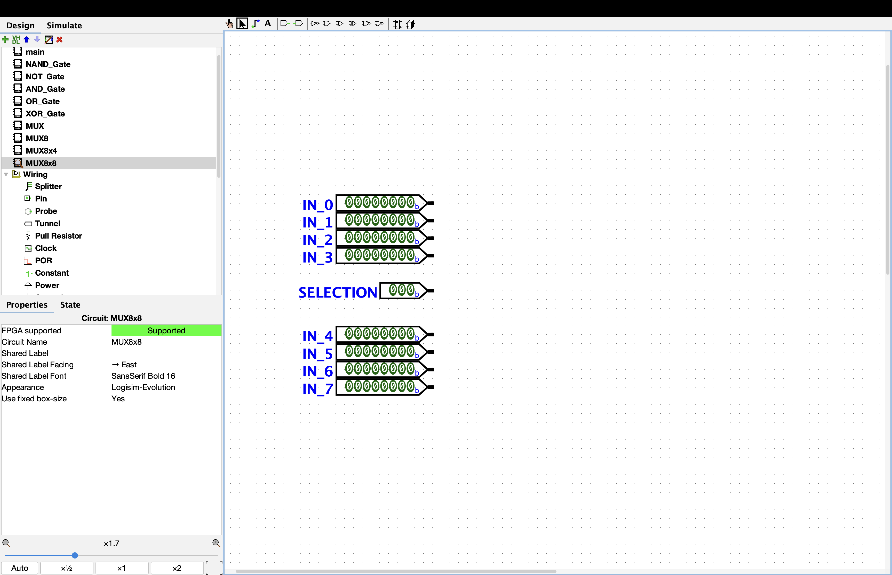

이제 Splitter를 이용해 셀렉션 입력 핀을 나눈다. Fan Out과 Bit Width In을 3으로 설정해서 말이다. Appearance는 Centered로 변경해준다.

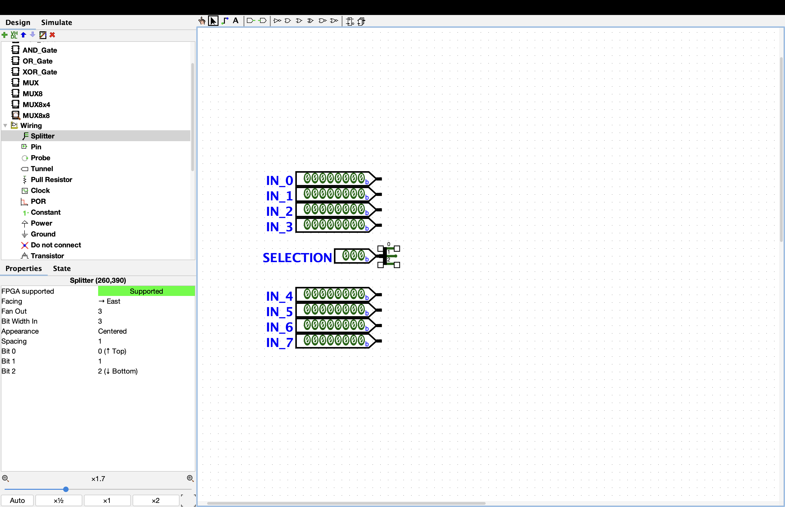

다음으로 MUX를 배치하고 셀렉션 비트를 2, Data Bits를 8로 설정한다. 4개의 입력을 순서대로 MUX에 연결한다. 그리고 4개의 입력을 처리하기 위해 2개의 셀렉트 비트가 필요하고 이를 위해 새로운 Splitter를 배치하고 Fan Out과 Bit Width In을 2로 설정한다. Facing은 West로 설정하고 MUX의 셀렉트 핀과 연결한 뒤 셀렉션 입력 핀에 0번, 1번에 연결한다.

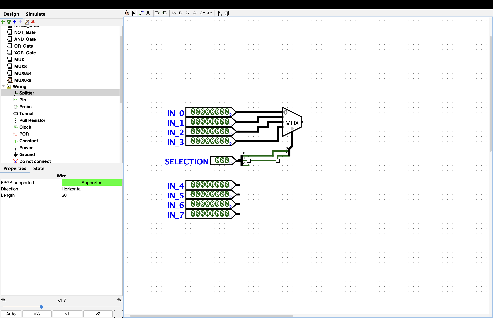

MUX를 하나 더 배치하고 셀렉트 비트를 2로, Data Bits를 8로 설정한다. 그리고 나머지 입력을 순서대로 연결해준다. Select Location은 Top/Right로 설정해준다.

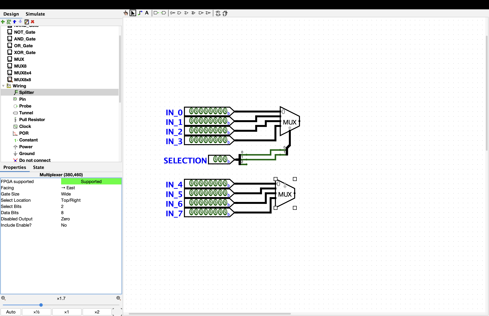

다음으로 Splitter를 복사해주고 Appearance를 Right-Handed로 변경하고 MUX의 셀렉트 핀과 연결한다.

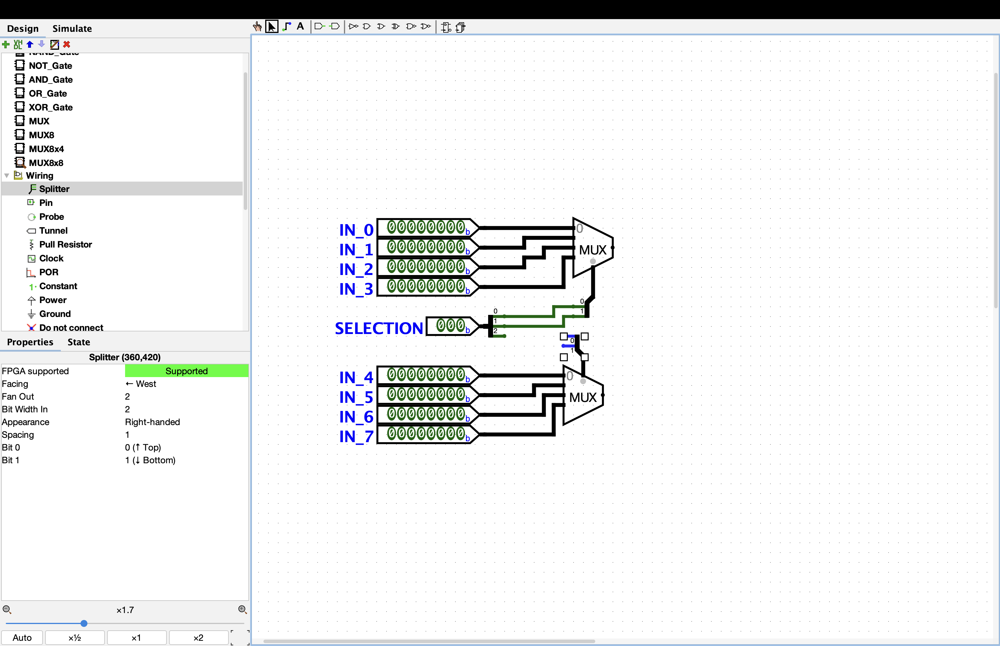

그리고 셀렉션 입력 핀의 0번, 1번 비트를 순서대로 연결해준다.

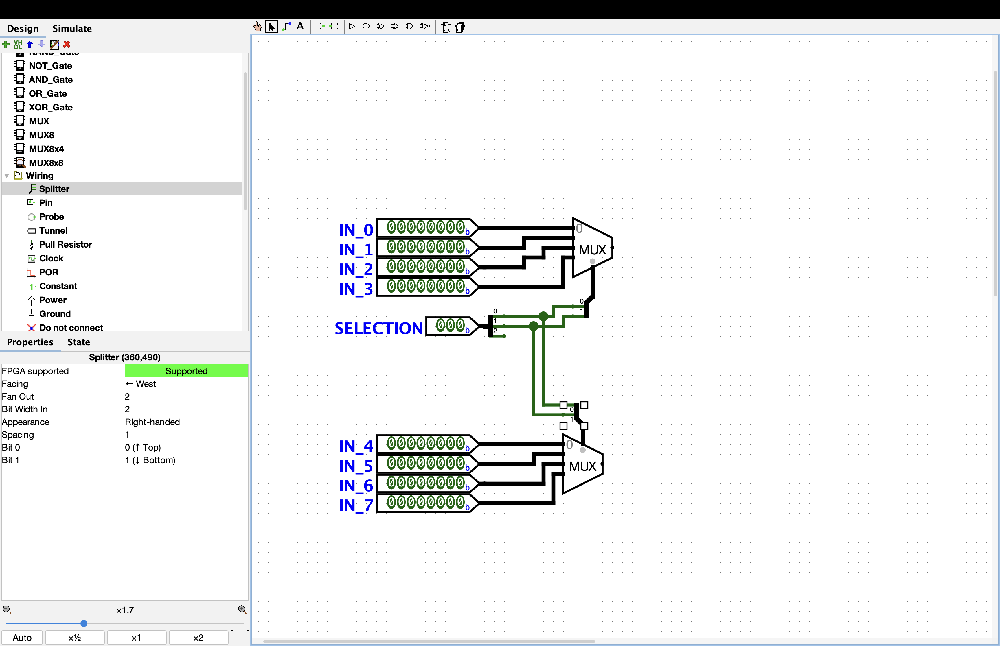

이 회로는 2개의 MUX가 8개의 입력을 각각 4개씩 나누어 처리하게 된다. 각 MUX는 하나의 출력을 생성하므로 결과적으로 2개의 입력으로 줄어들게 된다. 이제 이 2개의 출력을 2입력 MUX로 최종 처리하자.

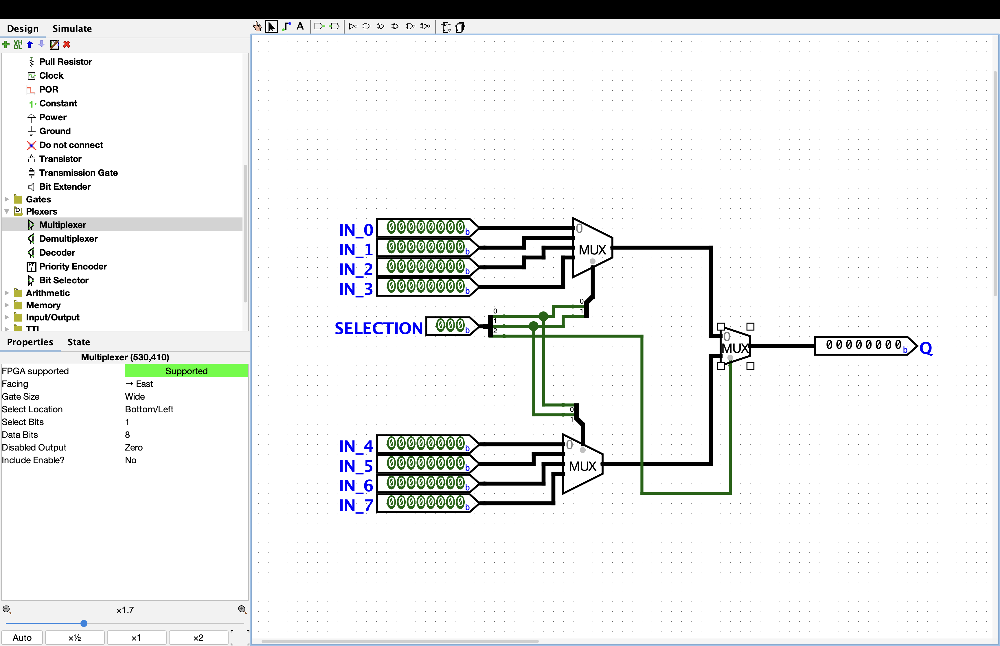

## 8비트 16입력 MUX

이번에는 8비트 8입력 MUX 2개를 사용하여 8비트 16입력 MUX를 만들어 보겠다. 그 다음에 8비트 입력 핀 16개를 만들고 이름을 IN_0부터 IN_15까지 설정해준다. 16개의 입력을 선택하기 위해서는 4비트의 셀렉션 비트가 필요하다. 4비트 셀렉션 비트 입력 핀을 만들자. 이제 Splitter를 이용해 입력을 4개로 나눈다. 이제 8비트 8입력 MUX를 이용해 8개의 입력을 처리해보자. Selection Bit를 3으로 Data Bits를 8로 설정한다. 그리고 0번부터 7번까지 입력핀을 연결한다.

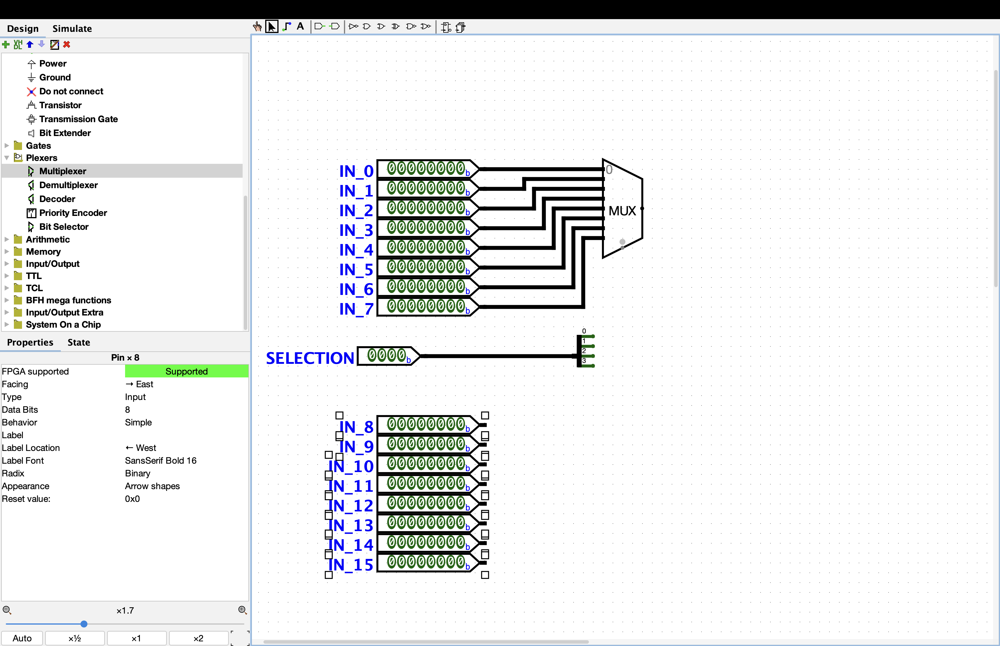

그 다음 Splitter를 추가로 배치하고 Fan Out과 Bit Width In을 3으로 설정해 3개의 입력으로 분리한다. Facing은 West로 설정하여 MUX의 셀렉트 핀과 연결하고 셀렉션 비트의 0번, 1번, 2번 비트를 순서대로 연결한다.

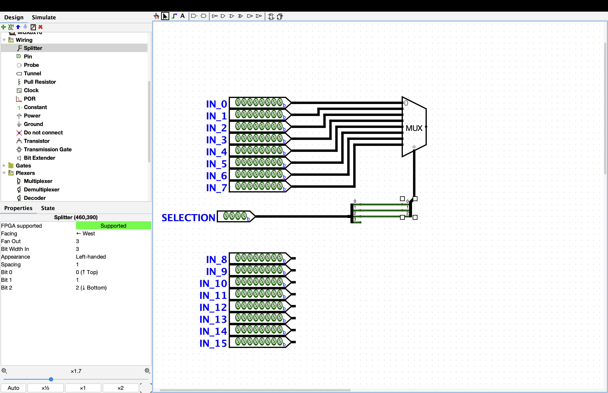

추가적인 MUX를 만들어 아까의 과정을 반복한다.

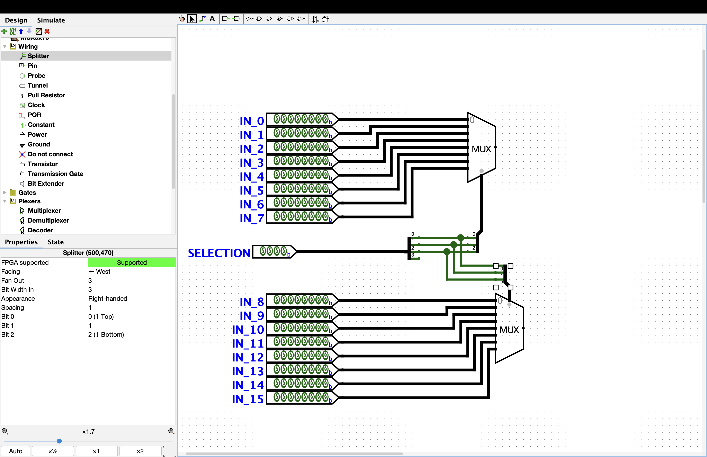

이제 2개로 좁혀진 입력을 합치기 위하여 2입력 MUX를 이용한다.

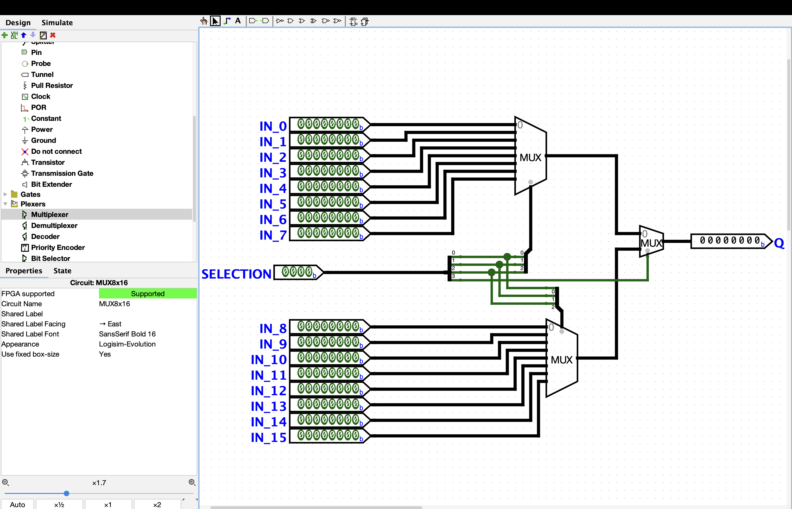

## 3비트 디코더

이번에는 디코더를 만들어보겠다. 디코더는 nbit의 입력을 2^n개의 출력 중, 하나만 활성하는 장치이다. 예를 들어, 3bit의 입력의 경우 2^3개인 8개의 출력을 만들고 3개의 비트가 000일때 즉, 10진수 0일때는 8개의 비트 중 0번 비트만 1이 되고 3개의 비트가 001일 때 즉, 10진수로 1인 경우 8개의 비트중에 1번 비트만 1이 되는 장치이다.

이번에 만들 3비트 디코더는 나중에 제어장치를 구현하는데 사용된다. 그러면 3비트 디코더를 만들어보자. 먼저 입력 핀을 생성하여 Data Bits를 3으로 설정하고 이름을 SELECTION으로 지정한다. 다음으로 하나의 입력 핀을 더 만들어 ENABLE로 이름을 지정한다. 해당 입력 핀은 디코더의 활성화 여부를 제어하는 장치이다.

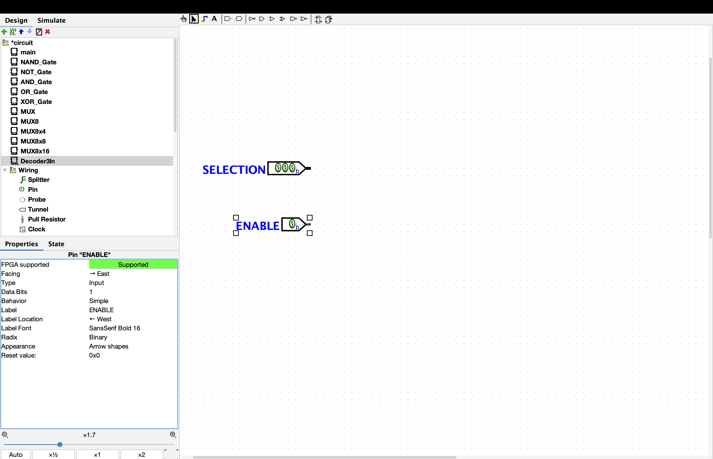

다음으로 8개의 출력핀을 생성한다.

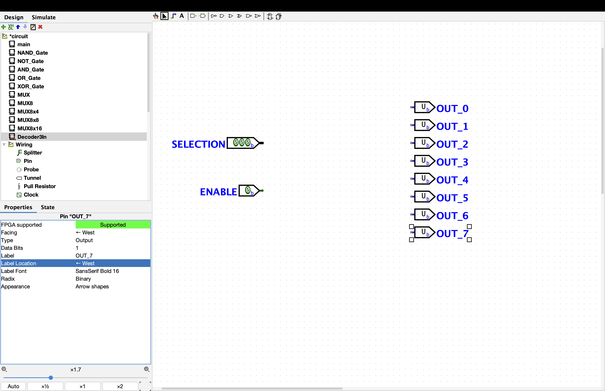

셀렉션의 3비트를 분리하기 위해 Splitter를 추가한다.

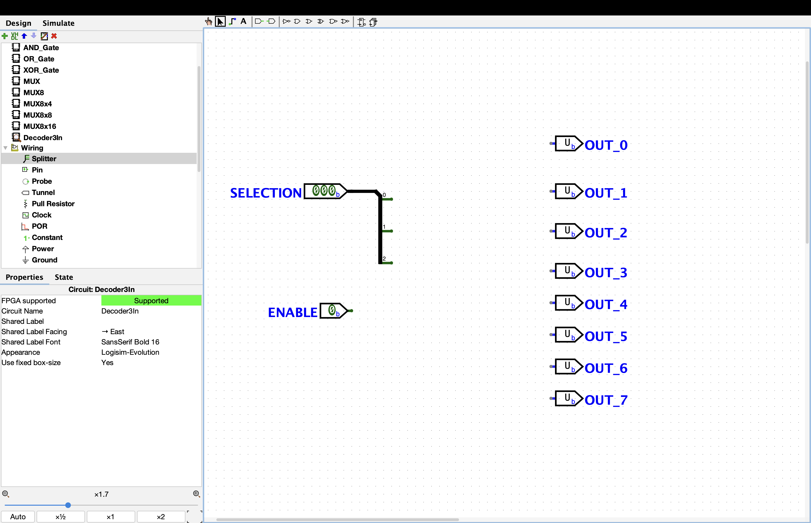

이제 OUT0부터 하나씩 구현해보자. OUT0이 1이 되는 조건은 입력 3비트가 000이 되고 ENABLE가 1이 되는 상황이다. 따라서 4개의 입력을 받는 AND 게이트를 설치하고 그 다음 NOT 게이트 3개를 설치하여 3개의 입력 비트 아래에 연결한다.


NOT 게이트 출력을 각각 AND 게이트에 연결하고 ENABLE 핀도 AND 게이트에 연결한다.

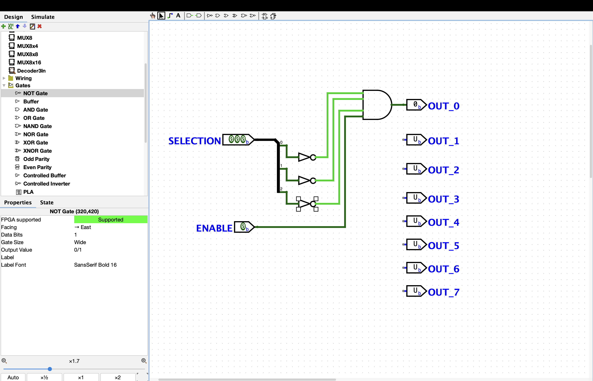

이제 나머지도 마찬가지로 구성하면 완성된다. 독자가 직접 작성해보자.

## 4비트 디코더

이번에는 4비트 디코더를 만들어 보겠다. 4비트 디코더는 이전에 구현한 3비트 디코더에 1비트가 추가가 된 것이다. 이 4비트 디코더는 추후 RAM을 구현할 때 사용이 된다. 이 회로는 4비트 입력을 받기 때문에 셀렉션 비트를 4로 설정한다. 또한 4비트 셀렉션 비트이기에 출력핀은 16개가 된다. 이 제작 방식은 3비트 디코더와 유사하니 독자가 직접 만들어보면 좋을 것이다.

## 컨트롤 버퍼

이번에는 컨트롤 버퍼를 만들어보겠다. 그 전에 실제 컴퓨터가 어떻게 전기 신호를 0과 1로 표현하는지 알아보겠다.

컴퓨터에 사용되는 전압은 부품마다 다르지만 여기서는 간단히 5V로 가정하겠다. 컴퓨터 과학자들은 0V를 논리적으로 0으로 5V를 논리적으로 1로 해석하기로 약속했다. 예를 들어, A와 B가 있고 전선으로 연결하여 A에 5V 전압을 주면 전류가 흘러 B에도 5V가 전달된다. 하지만 현실에서는 그렇지 않다. 전선 주변의 자기장과 여러 변수들로 인해 전압이 왜곡되기 때문이다. 만약 5V로 가했는데 실제는 4.5V라면 어떻게 표현해야 할까? 아무리 왜곡된 4.5V라고 하더라도 5V로 인식하여 1로 해석해야 한다.

이러한 왜곡때문에 실제 전압을 측정할 때는 일정 범위의 여유 값을 둔다. 예를 들어 0부터 0.8V는 0으로 2부터 5V까지는 1로 해석한다는 것이다. 만약 전압이 0.8~2V 영역 사이에 있다면 이는 왜곡이 너무 심해 해석한 값을 신뢰할 수 없는 상태가 된다. 이 지식을 기억하고 다음으로 가자.

컨트롤 버퍼는 말 그대로 제어되는 버퍼로 출력을 제어하는 장치이다. A와 B 사이에 나오는 선 사이에 설치하여 필요에 따라 선을 끊어주는 역할을 한다. 즉, A와 B가 같은 선으로 연결하고 다른 전압을 주는 것은 현실적으로 불가능하다. 하지만 컨트롤 버퍼가 이를 해결해주는 셈이다. 이런 역할 덕분에 출력은 0 또는 1 또는 U가 나온다.

> 여기서 U는 undefined의 약자이다.

이렇게 3가지 상태를 출력하기 때문에 Tri-state buffer라고 부른다. 컨트롤 버퍼는 트랜지스터를 직접 스위치처럼 사용해 NAND 게이트를 처음 만들 때와 같은 방식으로 구현된다.