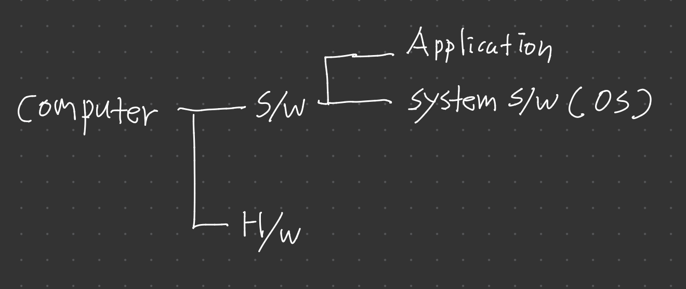

> 본 포스팅은 인프런의 [넓고 얕게 외워서 컴공 전공자 되기](https://inf.run/udDJ6)를 참조하여 작성한 글입니다.

## 동시성과 병렬성

### 동시성

동시성이란, 쉽게 말해 **여러 가지 일**이 **동시**에 진행되는 것이라고 생각하면 쉽다. 예를 들어, 라면 먹는 일과 TV 보는 일은 하나의 독립적인 개별 사건이다. 이 일을 문제없이 동시에 할 수 있으면 이 사건들은 동시성이 있다고 말할 수 있다. 만약 그게 동시에 일어날 수 없다면 동시성이 없다는 것으로 말할 수 있다. 또 다른 예를 들어보자. 우리가 어떤 게임을 설치받고 있다고 하자. 그 게임을 설치받는 동안 우린 크롬에서 유튜브를 접속하여 영상을 시청이 가능하다. 이 2개의 사건은 동시성이 있다고 볼 수 있다. 서로의 사건이 상호간섭 없이 연산하고 실행이 가능하기 때문이다. 어떻게 보면 번갈아가면서 독립적인 개별 사건을 처리하는 것도 동시성이라고 볼 수 있다. 또 다른 예시로 하나의 커피머신에 여러 사람이 줄을 서서 커피를 타는 모습은 동시성과 비슷하다. 여러 명이 동시에 커피를 만들고 싶지만, 자원이 하나뿐이므로 번갈아가며 사용하는 것이다. 반면, 여러 대의 커피머신이 있다면 그것은 병렬성에 더 가깝다.

> ✅ 요약
>
> 동시성이란 서로 다른 2가지 일이 동시에 일어나는 것이라고 볼 수 있다.

### 병렬성

동시성과 같이 쓰이는 용어가 병렬성이다. 병렬성이란, **같은 일**을 **여러 주체**가 함께 동시에 진행하는 것이다. 예를들어, 인형 눈을 붙이는 작업이 있다고 하자. 그런데 이 작업을 하는 사람이 1명일 때 보단, 여러 사람이 작업을 하는 게 더 효율적일 것이다. 이런 인형에 눈 붙이는 일은 병렬성이 있다고 말할 수 있다. 즉, 어떻게 보면 병렬성 또한 동시성 범주에 포함될 수 있을 것이다.

병렬성은 동시성과 달리 물리적으로 동시에 정확히 실행되는 것을 말한다.

그럼 이런 병렬성은 어디서 확인이 가능할까? 바로, 비트코인의 채굴이 이런 병렬성을 띄운다. 코인을 채굴할때 GPU를 통하여 해시연산을 하는 작업인데 그래픽카드의 GPU 여러 유닛이 이 작업을 진행하는 것이다. 이것을 병렬성이라고 볼 수 있다. 또 다른 예로 영상처리를 할 때 픽셀단위로 합성을 하는데 이것도 여럿이 진행을 하면 더 빨리 가능함으로 이런 영상처리도 병렬성을 이용한다고 볼 수 있다. 또 다른 예로 n개의 커피머신의 n개의 줄이 있는 모습을 볼 수 있다. 이 때 각 커피머신마다 하나의 줄을 가지고 있어 각각의 줄마다 커피를 받아가는 모습이 병렬성이 있다고 볼 수 있다.

## 원자성, 동기화 그리고 교착상태

### 원자성

동시성을 얘기하면 따라오는 단어가 원자성이다. 동시성은 저번에 설명했듯이, A라는 일과 B라는 일이 서로 상호간섭 없이 일을 하는 것이 동시성이라고 하는데 만약에 A라는 일과 B라는 일이 어떤 요소를 동시에 접근하고 먼저 선점하려고 노력한다고 보자. 쉽게 얘기하면 화장실을 들어가는 예를 들어보자. 화장실을 순서로 표현하면 다음과 같을 것이다.

- 화장실을 가고싶어하는 신호를 받는다.
- 화장실로 향한다.
- 노크를 한다.
- 진입을 한다.
- 볼일을 보고 물을 내린다.
- 손을 씻는다.
- 화장실에 나온다.

이런 순서에서 가장 중요한 부분이 3번째와 4번째 과정 사이이다. 3번째 과정에 노크하는 과정은 화장실이라는 자원을 다른 누군가가 선점하였는지 조사를 하는 행위이며, 진입과정은 화장실이라는 자원을 아무도 선점하지 않았을 때, 진행이 된다. 이때, 화장실 문을 잠그듯이 선점된 자원을 Lock을 건다. 그리고 손을 씻는 행위까지 Lock이 걸리다가 화장실을 나오는 순간에 Unlock을 해줌으로 자원을 반납하는 행위를 한다. 즉, Lock이 걸린 부분들 4~ 6번째까지의 과정이 원자성이 보장된다고 할 수 있다. 만약 노크를 하는 과정에 누군가가 있다고 하면 wait을 해야 하는 과정이 있다. 그런데 만약 집에서 나 혼자 자취를 하는 상황이라면 3번 노크하는 과정은 없을 것이다. 즉, 원자성은 동시성이 발생 안되었을 때는 항상 보장받기 때문에 따로 신경을 안 써줘도 된다.

### 동기화

동기화는 우리가 익숙하게 아는 용어처럼 보인다. 원본이 변경되었을 때 사본을 '동기화' 해준다는 표현을 많이 쓸 것이다. 하지만 지금부터 설명하려는 용어는 이것과 다른 용어이다. 동기화란 신호등과 잠금 장치의 필요성과 유사하다. 위의 화장실 예를 들어보면 우린 화장실을 들어갈지 안 할지 노크하는 과정으로 판단한다. 또한 교통체계에서 이 길을 건너도 되는지 아닌지 판별은 신호등으로 판별한다. 즉, 이런 상황을 정리해 주는 판별해 주는 것을 동기화라고 말할 수 있다. 이런 동기화과정 즉, 이런 판별장치 혹은 잠금장치를 OS에서 보통 제공해 준다.

### 교착상태(DeadLock)

항상 동기화 개념이 나오면 문제가 되는 것이 논리적인 오류 문제가 나오는데 바로 이런 문제를 교착상태라고 한다. 예를 들어보면 내가 화장실이라는 자원을 선점해서 볼일을 보고 있다고 가정하자. 그런데, 이제 휴지로 마무리를 하려고 하는데 휴지가 없다고 가정해 보자. 그러면 나는 나가지도 못하고 wait라는 상태가 되고 휴지라는 자원을 기다리게 된다. 즉, 휴지라는 자원이 없어서 나는 기달리게 되는데 밖에 화장실이라는 자원이 필요한 다른 누군가는 휴지라는 자원을 가지고 있다고 해보자. 즉, 화장실 밖 사람은 내가 나오기를 화장실이 Unlock이 되기를 기다란 것이다. 즉, 지금 상황이 이러지도 저러지도 못하는 상태가 되었는데 이런 상태를 바로 DeadLock이라고 부른다. 이런 상태의 원인 논리적인 하자로 인하여 발생한다. 즉, 우리가 S/W를 개발할 때, 발생가능한 오류나 예외상황을 생각하지 않고 개발할 때 나올 수 있는 상태이다. 또한 프로그램 2개나 동시성 이슈가 터지면서 시스템이 무너지는 현상이 발생할 수 있다. 또한 무언가를 우리가 접근함에 있어서 이것을 접근하는 거든 연산을 하든 여러 연산주체가 동시에 접근할 때 발생할 문제를 막기 위해서 Lock도 걸고 동기화도 하면서 원자성을 보장받지만 그게 잘못된 특히, 외부자원에 대한 무언가를 요구함으로써 특히 양단간에 의존성이 존재하는 자원들끼리 동시에 무언가 하다가 교착상태에 빠질 수 있다.

## 컴퓨터의 구성요소와 아바타

### 컴퓨터의 구성요소

컴퓨터는 하드웨어와 소프트웨어로 이루어진다. 이전 포스트들까지 하드웨어에 대해 알아보았다면 이제 소프트웨어에 대해 알아보자. 소프트웨어는 2가지로 나눠지는데 애플리케이션과 시스템 소프트웨어로 구분이 되는데 대표적인 시스템 소프트웨어로는 운영체제가 있다.

### 프로그램, 프로세스, 스레드

운영체제 책을 보다보면 프로그램, 프로세스, 스레드라는 용어가 자주 등장한다. 그럼 정확히 이 용어들의 정의는 무엇일까? 프로그램은 쉽게 말해 설치하는 것이다. 흔히 우리가 컴퓨터에서 포토샵을 이용하려면 먼저 설치를 해야 할 것이다. 그게 프로그램이다. 프로그램을 설치 후 더블클릭하여 실행을 하는데 이 때 운영체제는 이 프로그램을 메모리에 올려 프로세스로 만들어준다. 즉, 프로세스는 실행한 프로그램을 의미한다.

> 프로세스는 환경적(관리) 단위이며, 프로세스는 사람의 주민등록번호처럼 PID라는 것을 운영체제에게 부여받는다.

스레드는 프로세스 속에 존재하는 실행(연산)의 단위이다. 프로세스는 적어도 스레드 1개를 가지고 있으며 운영체제가 프로세스에게 자원(메모리)을 할당시켜 주면 이 할당된 자원을 스레드가 나눠서 사용한다. 

정리를 해보면 컴퓨터를 하나의 세상이라 비유하면 프로세스는 '나'라는 아바타라고 생각하면 쉽다. 메이플이라는 게임을 예시로 들어보자. 우리는 메이플이라는 것을 로그인한다. 이때 '나'라는 프로세스가 생성이 되는 것이다. 이때, '나'라는 프로세스가 컴퓨터에서 쉘이 되는 것이다. 즉, 우리가 컴퓨터를 켜고 로그인하면 가장 먼저 작동되는 것이 shell이고, 윈도우 운영체제로는 윈도우 탐색기가 되는 것이다.

### 용도에 따른 기억공간의 구분

기억공간 즉, 메모리라는 것이 용도에 따라 구분이 된다. 가장 대표적인 공간이 stack, heap이라는 공간이다. stack이라는 공간은 스레드가 사용하고 있으며, heap이라는 공간은 프로세스 전체가 사용하고 있다. 쉽게 얘기하면 stack은 각자 방을 의미하고 heap은 거실처럼 공용공간을 뜻한다. 그럼 예를 들어 스레드가 4개가 동작한다고 보면 stack도 4개가 존재한다고 봐도 된다. 그럼 왜 공간을 구분했을까? 왜냐하면 동시성 문제라던데 앞에서 설명한 문제들을 해결하기 위하여 공간구분을 한 것이다.

만약, 메모리 공간을 우리 집 주거공간이라고 비유하자면 화장실에서 밥먹거나, 옷방에서 샤워를 하는 행위는 가능은 하지만, 제 3자가 보아도 적절하다고 하지는 않는다. 메모리 공간도 이러한 행위를 방지하기 위해서 목적과 용도에 따라서 구분을 해두었고 대표적인 공간은 스택과 힙이 있다라고만 생각해보자.

## 국가와 국민으로 이해하는 컴퓨터 세상

국가(근대국가)라는 것이 존재하려면 영토, 영공, 영해가 존재해야 하며, 주권과 정부영역, 민간영역이 존재해야 한다. OS를 이해하는 데 있어서 갑자기 국가가 나오는지 이해가 안 될 것이다. 좀 더 다른 비유를 들어보자. 어떤 요소가 있다고 보자. 요소가 레이어 구조로 계층적으로 탑처럼 쌓여있다고 볼 때, 가장 아래에 있는 요소는 위에 있는 요소에 존립기반이 된다. 즉, 가장 아래에 있는 요소가 없고서는 위의 요소도 없다는 의미이다. 다른 의미로는 존립기반을 전제조건이라고도 말할 수 있는 것이다. 그러면 위의 요소는 그 아래의 요소에 대해서 존립 자체라고 말할 수 있으며 다른 말로는 의존적이다라고 말할 수 있다.

다시 국가차원으로 돌아가자면 정부영역은 영토, 영공, 영해에 대해서 의존적이며 민간영역은 정부영역에 대해서 의존적이다라고 할 수 있다. 다시애기해보면 영토는 물리적인 요소이고 정부영역은 행정조직이기 때문에 다시 말하면 논리적인 조직이다라고 말할 수 있다. 그리고 민간영역에는 '나'라는 요소가 있고 '나'라는 요소는 하나의 주거공간을 가지게 된다. '나'라는 요소뿐만 아니라 다른 국민들도 존재하고 그 국민들도 각자의 공간을 가지게 된다.

그러면 국가를 컴퓨터라는 것으로 보면 다음과 같을 것이다. 영토, 영공, 영해는 H/W인것이고 정부영역, 민간영역을 S/W라고 볼 수 있다. 그리고 S/W는 Application과 System S/W로 나눠지는데 이것은 각각 민간영역과 정부영역으로 볼 수 있을 것이다. 그런데 System S/W에서 가장 대표적인 것이 OS가 있다고 볼 수 있다. 또한 Application은 국민이라는 요소가 있는데 이것을 프로그램이다라고 보면 프로그램을 실행시킬 때 하나의 메모리 공간을 가지는데 그것은 결국 국민+주거공간 = 프로세스라고 볼 수 있다.

그러면 갑자기 어떤 B라는 국민이 화장실이 급해서 A라는 국민의 허락없이 화장실을 이용할 수 있을까? 대한민국 헌법상 주거침입죄로 불법행위이다. 이것을 누가 막아주고 있을까? 얘기했듯이 대한민국 정부가 헌법을 통하여 막고 있다. 즉, 컴퓨터로 얘기하면 프로세스가 다른 프로세스의 메모리 공간을 침입을 할 경우 OS가 막아준다. 만약 그럼에도 불구하고 그런 행위를 시도하려고 하면 OS에서 화를 내듯이 '삐'하고 그 행위를 멈추게 한다. 즉, 이런 상황이 발생할 때 우리는 흔히 프로그램이 죽었다고 말한다. 사실 죽었다기보다는 OS가 그 행위를 멈추게 한 것이다. 또한, 이렇게 국민영역에 수많은 프로세스 동시에 존재하는 환경을 멀티태스킹 환경이라고 한다.

추가적으로, 어떤 국민이 남의 주거공간을 침입할 수 있는 조건도 있다. 우리나라의 검찰이나 경찰이 영장을 국가로부터 부여받으면 수색을 할 수 있는데 이것은 컴퓨터환경에서 Debugger라고 부른다. 또한 OS의 핵심을 이루는 알맹이를 kernel이라고 부른다. kernel의 가장 큰 역할은 접근 통제의 역할을 한다.

## User mode와 Kernel mode 그리고 가상화까지!

컴퓨터는 크게 H/W와 S/W로 나눠지는데 H/W의 특징은 물리적이며 가장 핵심은 CPU이며 S/W에서는 논리적인 것이 특징인데 IT 쪽에서 논리적이다라는 표현을 Virtual이라는 말과 거의 동일하게 사용한다. 본론으로 가서 S/W에서 Kernel mode까지를 우리는 OS영역이다라고 부르며 H/W에 OS는 의존적이어서 붙여진 용어가 Platform이라고 붙여진다. 즉, H/W도 Platform, Kenrel mode도 Platform이라고 볼 수 있다. 그래서 우리가 64bit platform이라고 부르면 CPU도 64bit, OS도 64bit라고 한다.

H/W에서 메인보드에서 장착할 수 있는 장치가 있다고 할 때 어떤 OS든 이 장치를 제어할 수 있는 Device Driver라는 커널모드에서 작동하는 S/W가 있다. 그리고 어떤 장치이냐에 따라 Kernel mode에 요소가 달라진다. 그리고 그 장치를 File System이라고 한다. 예를 들어 video card라고 할 경우 kernel mode의 요소는 Graphic Engine이라고 부른다. 그리고 User mode에는 프로세스가 여러 개 존재하는 멀티 태스킹 환경이다. 만약 '나'라는 프로세스가 Kernel mode에 메시지를 전달하고 싶은 경우는 어떻게 할까? 비유를 들어 user mode를 인간계, kernel mode를 신계라고 할때 우리는 기도라는 매개수단을 통해 신한테 메세지를 전달한다. 왜 그럴까? 신이 그렇게 하라고 전달한것이다. 만약, 다른 비유로 user mode를 국민 kernel mode를 정부라고 할때 우리는 국민청원이라는 수단을 통하여 메세지를 전달할 수 있다. 이런 메세지 전달 수단을 컴퓨터 세상에서는 인터페이스라고 한다. 또한 이 인터페이스는 파일 형태로 존재한다. 그리고 이 파일을 디바이스 파일이라고 불린다.

좀 더 어렵게 표현하자면 kernel의 구성요소에 대한 추상화된 인터페이스를 user mode에 제공해 줄 때 파일의 형태를 띠고 있다고 표현한다. 그리고 '나'라는 프로세스는 이 파일에 대하여 Read or Write or Execute를 한다. 예를 들면 우리가 "Hello World!"라는 문자열을 출력하고 싶다고 할 때 코딩을 한 후 이 문자열을 kernel mode에 내려보내게 된다. 그러면 kernel mode에서 무언가 작업을 한 후 driver를 통하여 장치를 알맞게 제어를 한다. 즉, 다시 보면 프로세스가 주체가 되고 파일이 하나의 대상체가 된다고 볼 수 있다. 또한 프로세스는 인터페이스로부터 이 파일에 대한 접근권한을 획득해야 하는데 그 접근권한은 운영체제가 부여한다.

또한 user mode에서 interface가 보조기억장치를 볼 수 있는 프로세스가 존재하는데 이것을 윈도우에서는 탐색기, 맥에서는 파인더라고 부른다. 즉, 다시 말해 File System의 파일구조들을 시각화하여 GUI형태로 보여주는 것이다.

또한 kernel mode에 driver와 file system 사이에 filter가 존재하는데 user mode에 메시지를 보내면 filter에 걸리는데 filter는 행위를 모니터링하다가 바이러스 같은 것을 감지하면 V3 같은 프로그램에 요청하고 그 파일을 차단한다. 그리고 이런 filter를 실시간 감지 엔진이라고 불린다.

> 📝 추가
>
> physical인 하드웨어를 소프트웨어화하는 기술이 있는데 이것을 위에서 언급한 소프트웨어 다른 말인 Virtual로 바꾸면 Virtualization(가상화)가 된다. 이 용어도 잘 알아두자.

## 가상 메모리 소개

우리가 범용적인 윈도 같은 OS를 얘기할 때는 가상 메모리에 대하여 이야기하게 된다. 윈도우에서 작업관리자를 켜게 되면 페이징풀과 비페이징풀이라는 생소한 용어가 등장하게 된다. 또한 여기서 공통적인 용어 페이지라는 용어도 생소할 것이다. 유추해 보면 페이지를 하는 것을 페이징, 안 하는 것을 비페이징이라고 하는 것 같은데 그럼 페이지는 무엇일까? 페이지란 OS에서 RAM처럼 사용하는 하드 디스크 영역이다. 이게 무슨 말일까? 예를 들어보자. 8GB RAM이 존재하고 프로그램을 10개 정도 실행할 수 있다고 해보자. 근데 내가 만약 15개 프로그램을 실행하고 싶다고 하자. 하지만 메모리 부족으로 실행이 안될 것 같지만 그게 아니고 HDD 영역의 일부를 끌고 와서 RAM인 것처럼 사용을 한다. 물론 속도는 느려지겠지만 실행은 가능하다. 페이지라는 조각난 단위를 HDD와 RAM사이를 공간이동하면서 RAM이 있는 것처럼 작동을 하는 것이다.

좀 더 구체적으로 보자. 크롬을 실행해서 웹 사이트에 접속했다고 보자. 크롬을 실행될때 프로세스가 생성되고 OS로부터 메모리를 할당받는다. 이때 이 메모리를 VMS(Virtual Memory Space)라고 불린다. 그때 메모리 안에 페이지를 공간 조각 단위가 있는데 이 페이지를 따라가면 RAM이 나올 수도 있고 HDD가 나올 수가 있는데 만약 MS Word 같은 프로그램이 동시에 실행되고 있다고 보자. 그러면 똑같이 프로세스가 생성되고 VMS를 할당받고 그 안에 페이지를 따라갈 건데 만약 빠른 작업으로 RAM을 써야 하는데 RAM용량이 부족하면 OS가 기존에 쓰고 있던 RAM의 공간을 HDD로 이동하고 사용하게 된다. 이렇게 주기억장치에서 보조기억장치로 페이지가 쫓겨나는 것을 페이지 아웃이라고 불린다. 만약 다시 안으로 들어오면 페이지 인이라고 불린다. 이렇게 되면 프로세스간에 서로 간섭을 할 필요가 없어지며 만약 프로세스가 어떠한 오류로 죽으면 페이지 조각 및 VMS를 회수하게 된다.

결론을 내리면 다음과 같다. 가상 메모리를 사용하는 이유는 각 프로세스 공간을 완벽히 분리 및 통제가 가능하며, 잘못하여 프로세스가 도중에 중단되더라도 다른 프로세스나 운영체제까지 영향을 주지 못한다. 또한, 메모리가 부족해도 여러 프로그램들이 작동하게 할 수 있고 자원을 효율적으로 이용할 수 있다.

자세한 내용은 운영체제에서 한번 다뤄보도록 해보고 이번에는 여기까지만 이해하고 암기하고 넘어가자.