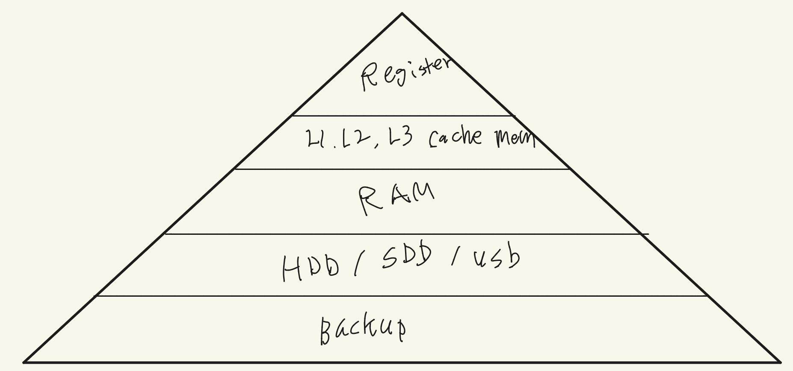
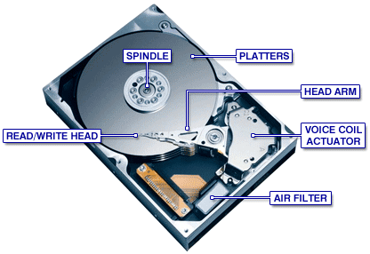

> 본 포스팅은 인프런의 [넓고 얕게 외워서 컴공 전공자 되기](https://inf.run/udDJ6)를 참조하여 작성한 글입니다.

## 디지털 회로와 덧셈(CPU 자작도 가능)

### 디지털 회로

디지털 회로를 우리가 왜 배울까? 뭐 면접에도 나오기도 하고 각 종 시험에서 나오기도 하지만 근본적인 이유는 바로 CPU를 제작하기 위해서이다. 여기서 의문이 드는 게 그럼 CPU는 왜 우리가 만들어야 할까? 이미 대기업에서 만들어진 CPU를 잘 사용하면 된다. 하지만 이것이 어떻게 만들어지고 동작이 되는지는 알고 쓰면 더 좋기 때문이며 그게 근간하는 내용이 디지털 회로이다. 아래의 그림은 각 연산 gate들의 진리표이므로 잘 숙지해둬야 한다.

<table style="border-collapse:collapse; width:100%; text-align:center;">
  <caption style="caption-side:top; font-weight:600; padding:8px 0;">
    논리연산 진리표 (NOT은 A에 대한 보수)
  </caption>
  <thead>
    <tr>
      <th scope="col" style="border:1px solid #ccc; padding:8px;">A</th>
      <th scope="col" style="border:1px solid #ccc; padding:8px;">B</th>
      <th scope="col" style="border:1px solid #ccc; padding:8px;">AND</th>
      <th scope="col" style="border:1px solid #ccc; padding:8px;">OR</th>
      <th scope="col" style="border:1px solid #ccc; padding:8px;">XOR</th>
      <th scope="col" style="border:1px solid #ccc; padding:8px;">NOT A</th>
    </tr>
  </thead>
  <tbody>
    <tr>
      <td style="border:1px solid #eee; padding:6px;">0</td>
      <td style="border:1px solid #eee; padding:6px;">0</td>
      <td style="border:1px solid #eee; padding:6px;">0</td>
      <td style="border:1px solid #eee; padding:6px;">0</td>
      <td style="border:1px solid #eee; padding:6px;">0</td>
      <td style="border:1px solid #eee; padding:6px;">1</td>
    </tr>
    <tr>
      <td style="border:1px solid #eee; padding:6px;">1</td>
      <td style="border:1px solid #eee; padding:6px;">0</td>
      <td style="border:1px solid #eee; padding:6px;">0</td>
      <td style="border:1px solid #eee; padding:6px;">1</td>
      <td style="border:1px solid #eee; padding:6px;">1</td>
      <td style="border:1px solid #eee; padding:6px;">0</td>
    </tr>
    <tr>
      <td style="border:1px solid #eee; padding:6px;">0</td>
      <td style="border:1px solid #eee; padding:6px;">1</td>
      <td style="border:1px solid #eee; padding:6px;">0</td>
      <td style="border:1px solid #eee; padding:6px;">1</td>
      <td style="border:1px solid #eee; padding:6px;">1</td>
      <td style="border:1px solid #eee; padding:6px;">1</td>
    </tr>
    <tr>
      <td style="border:1px solid #eee; padding:6px;">1</td>
      <td style="border:1px solid #eee; padding:6px;">1</td>
      <td style="border:1px solid #eee; padding:6px;">1</td>
      <td style="border:1px solid #eee; padding:6px;">1</td>
      <td style="border:1px solid #eee; padding:6px;">0</td>
      <td style="border:1px solid #eee; padding:6px;">0</td>
    </tr>
  </tbody>
</table>

그러면 원래 CPU는 뭐하는 것인가? 간단히 얘기하면 '전자계산기'라고 한다. 여기서 '전자'라는 말이 중요한데 왜 전자를 사용할까? 빛이나 물을 이용할 수는 없을까? 물론 이용이 가능하지만 전자를 사용하는 이유는 빠르기 때문이다. 그럼 어떤 계산기일까? 바로 산수연산에 대한 계산기이다. 즉, CPU를 만들고 싶다고 하면 산수 계산기를 만들면 되고 산수의 기본이 되는 더하기 기능부터 만들면 된다. 그럼 더하기 기능을 어떻게 만들지 회로에 대해서 살펴보자.

> 위의 표에서 input으로 들어가는 a,b는 하나하나가 1bit라고 할 수 있다.

### 컴퓨터가 덧셈을 하는 방법

- 2진수 1 + 1은 2진수 10(2) 이다.
- A가 1, B가 1이면 XOR 연산결과 S는 0이다.
- 동시에 A가 1, B가 1이면 AND 연산결과 C는 1이다. 이 1은 자리 올림(Carry)이다.
- 두 수를 더할 수 있으면 CPU를 만들 수 있다.

위의 그림은 반가산기로 덧셈을 해주는 논리 회로이다. 하지만 이것은 1bit 한정이며 예를 들어 8bit끼리 덧셈을 하려고 하면 자리올림 또한 생각을 해줘야 하므로 반가산기로는 부족하다. 그래서 나온 회로가 전가산기다. 전가산기는 아래와 같다.

전가산기를 병렬로 이어서 두개의 input과 자리올림 bit를 이용해 다양한 bit의 계산이 가능하다.

## 컴퓨터가 뺄셈하는 방법

컴퓨터가 뺄셈을 어떻게 할까? 뺄셈은 보수의 덧셈을 하면 해결이 된다. 그럼 보수는 무엇일까? 예를 들어 6을 10의 보수를 구하라고 한다고 하면 답은 4가 나온다. 즉, 어떤 수를 더해서 n이 되었을 때 어떤 수가 n의 보수가 된다. 즉, 뺄셈은 보수의 덧셈으로 보면 될 것이다. 전에 배웠던 전가산기에 input값을 보수를 넣어주면 된다. 2진수도 비슷하다. 2진수는 1의 보수를 구한 다음에 더하기 1만 해주면 된다.

> 2의 보수 = 1의 보수(not gate) + 1

이렇게 보면 뺄셈도 덧셈의 응용편이다. 그럼 이제 곱셈과 나눗셈이 문제인데 이것도 마찬가지다. 곱셈은 여러 번 덧셈을 하는 것이고 나눗셈은 여러 번 뺄셈을 하는 것이다. 즉, 모든 사칙연산이 덧셈에 근간한 거고 CPU도 사칙 계산기로 덧셈에 근간한다고 볼 수 있다.

## CPU가 곱하고 나누는 방법

### 컴퓨터가 곱셈을 하는 방법

곱셈은 여러번 더하기를 진행하면 된다. 하지만, 이 메커니즘은 너무 비효율적이라 shift연산을 이용하여 효율적인 메커니즘을 구축하게 되었다. 곱셈은 left shift연산을 하게 되는데 여기서 shift연산은 어떻게 하는 것일까? 왼쪽 마지막 자리를 기준으로 왼쪽으로 한 칸씩 미루는 행위이다. 그러면 기준자리를 넘어가는 부분은 버리고 오른쪽에 비어지게 되는 자리는 0으로 채워진다(padding). 2진수 기준으로 1칸씩 shift연산은 2씩 곱하는 행위와 같게 된다. 아래는 left shift연산의 예시의 이미지이니, 한번 참고해 보자.

### 컴퓨터가 나누는 방법

나눗셈도 곱셈과 마찬가지이다. 원래 나눗셈은 여러 번 뺄셈을 진행하면 되었지만 이 또한 비효율적이라 shift연산을 이용하게 되었다. 나눗셈은 right shift연산을 진행한다. right shift연산은 오른쪽 자리를 기준으로 오른쪽으로 한 칸씩 미는 행위이다. 자리를 넘어가는 것은 버리고 왼쪽에 비어지는 자리는 0으로 채운다.(padding)

### 0으로 나누는 무서운 짓

그런데 문득, 이런 생각을 해본 적이 있을 것이다. 만약 어떤 수를 0으로 나누면 어떻게 될까? 예를 들어, 22라는 수를 0으로 나누면 어떻게 될까? 나눗셈은 뺄셈의 연장선이다. 그래서 22에서 0을 뺄 것이다. 그러면 22가 나올 것이고 또 0을 뺄 것이다. 언제까지 뺄까? 더 이상 뺄 수 없을 상태, 즉 무한대로 뺄 것이다. 그러면 CPU는 이를 처리하기 위해 열 에너지가 발생할 것이고 결국 폭발을 할 것이다. 하지만 우리가 사용하는 범용 CPU는 폭발하지 않는다. 그 이유는 예외처리를 해두었기 때문이다. 하지만 ATMEGA128 같은 장치로 이 과정을 수행하면 폭발을 하게 되는데 아래 [동영상 링크](https://www.youtube.com/watch?v=mZ7pUADoo58)를 참조할 테니 한번 확인해 보자.

## 컴퓨터가 연산하는 과정

컴퓨터라고 하면 기본적으로 CPU를 의미하며 그 외 나머지 장치들은 CPU를 보조하는 장치이다. 하지만 우리는 컴퓨터라고 하면 CPU에 RAM까지 포함시켜서 생각을 하면 좋을 것 같다. CPU는 연산하는 장치이며 RAM은 메모리(정보 저장) 반도체이다. 여기서 컴퓨터가 연산할 때 주로 보조기억장치(SSD, HDD)에서 CPU로 가져와서 연산을 한다. CPU로 가져오는 과정은 우리가 직접 하지 않고 거의 HDD수준이나 운영체제에서 자동으로 알아서 해준다.

RAM에는 수많은 일련번호가 있는데 일련번호의 value값에다가 메모리를 저장해준다. 여기서 0,1번은 주로 OS에서 사용을 한다. 이 과정은 우리가 엑셀을 작성하는 것과 유사하다고 생각하면 된다. 즉, 우리가 연산하는 결과를 RAM의 일련번호의 저장소에 담는데 이 일련번호의 저장소의 값을 CPU의 레지스터라는 임시 저장소에 담는다. 그 임시저장소의 값을 ALU라는 장치를 통해 연산을 하여 결과 값이 나오게 된다. 그 결과 값을 메모리의 일련번호의 저장소에 담게 된다. 그럼 일련번호는 무한대로 존재하는가? 그건 아니고 RAM의 bit수의 따라 다르다. 일반적으로 64bit를 사용함으로 일련번호는 2^64byte까지 존재한다. 즉, 결론을 보면 CPU에서 연산을 한다는 것은 RAM이 엄청 중요한 역할을 하고 있다는 것이다. 그리고 여기서 RAM을 1차 메모리라고 한다. 그리고 HDD나 SSD 같은 보조기억장치들을 2차 메모리라고 한다.

## 컴퓨터가 기억공간을 관리하는 방법

기억 장치는 여러 분류로 나눠지는데 CPU가 가지고 있는 메모리 장치인 레지스트리가 있으며, RAM이라는 1차 메모리와 HDD, SDD 등 2차 메모리가 존재한다. 여기서 가장 핵심은 레지스트리이며 여기까지 값을 가져와야 연산을 하든 무엇을 하든 진행이 가능하다.

속도차원에서 봤을때 가장 빠른 속도는 레지스터가 가장 빠르며 RAM에 비해 4배 정도 더 빠르다. 또한 레지스터와 2차 메모리의 속도 차이는 비행기와 사람이 걸어가는 속도차이라고 보면 좋을 것이다. 그래서 레지스터와 2차 메모리와 속도차이가 너무 크기 때문에 이것을 극복하기 위해 RAM과 L1~L3 캐시 메모리가 존재한다. 레지스터와 RAM까지의 특징이 있는데 휘발성 메모리라는 특징이다. 즉, 전원을 꺼버리면 다 날아간다는 특징이 있다. 위의 그림을 보면 레지스터로 올라갈수록 극소량의 메모리 + 가격이 비싸며 2차 메모리로 올라갈수록 가격이 싸고 대량 메모리로 저장할 수 있다.

그럼 좀 궁금한게 L1~L3까지의 캐시메모리는 어떤 역할을 할까? RAM의 정보들을 미리 예측하여 CPU가 캐시 메모리에 저장을 해두어서 RAM에서 복사하는 과정을 최소화한다. 이런 행동을 캐시가 hit되었다라고 표현한다. 물론 CPU 예측이 틀릴 수 있는데 이런 것을 캐시 fault가 났다고 한다. 캐시 fault가 날 때는 RAM에서 정보를 복사해와야 하는 경우가 있다. 만약 RAM에도 찾는 정보가 없다고 하면 2차 메모리에서 찾아야 하고 거기도 없으면 예외가 발생한다. 프로그래밍으로 치면 NullPointerException이 발생하는 것이다.

한번 쉽게 생각해보자. CPU 내부가 연구실이라고 예를 들어보자. 박사님이라고 하고 연구활동을 열심히 하고 계신다. 박사님이 연구활동을 열심히 할 수 있도록 조교들이 박사님이 연구활동을 하는데 필요한 자료들을 가져다 주는 역할을 한다 해보자. 박사님이 연구활동을 위해 A라는 자료를 달라고 요청한다. 그러면 조교는 해당 요청에 따라 A라는 자료를 연구실 밖의 서재에서 가져와야 한다. 하지만, 이것이 귀찮은 조교는 박사님이 A라는 책을 달라고 하셨고 B라는 책도 달라고 하겠지라고 하고 B라는 책도 미리 가져와서 책장에 꽂아둔다. 그리고 박사님이 B라는 책을 달라고 하면 책꽂이에서 바로 전달하고 이 과정을 캐시가 hit되었다라고 한다. 만약 C라는 책을 요청하면 이것은 캐시가 fault가 된 것이고 다시 조교가 서재에 가서 가져와야 한다. 만약 서재에도 없으면 서점에 가서 가져오는 행위까지도 해야한다.

CPU와 보조기억장치의 속도차이를 극복하기 위하여 RAM이 존재하는 것이다. 예를 한번 들어보자. 우리가 SSD에 OS를 설치하고 OS를 실행한다고 해보자. 그러면 그 OS정보를 RAM에 copy가 된다. 그리고 그 OS의 명령들을 CPU에 보내서 실행하게 되는 것이다.

> 컴퓨터의 모든 정보는 숫자이며, 레지스터는 개별적으로 고유의 이름이 붙어있다. RAM은 key, value형식으로 구성되어 있으며 key값에는 일련번호가 들어가져 있으며 이 일련번호를 우리는 **메모리의 주소**라고 부른다. 마지막으로 HDD는 트랙과 섹터로 구분되는데 이 이야기는 다음 포스트에서 정리해보겠다.

## HDD, SSD와 파일 시스템

레지스터는 CPU의 가장 핵심 장치이며 각 요소마다 이름이 존재한다. RAM은 요소마다 일련번호가 붙고 이것을 메모리 주소라고 한다. 그 요소는 용량이 1byte 단위로 관리가 된다.

### HDD의 논리적 구조

HDD 구조는 아래의 그림처럼 구성되어 있으며 HDD 속도를 말할 때는 HDD의 spindle이 돌아가는 속도로 따진다. 즉 HDD의 Head가 spindle을 돌면서 정보를 읽는다.

HDD를 논리적으로 보았을 때 어떤 개념으로 관리체계를 나누는데 바로 트랙과 섹터로 나눠진다. 섹터쪽에서 우리의 정보를 기술할 수 있는데 이 기술된 정보를 우리는 Read 혹은 Write를 할 수 있다. 여기서 좀 알아둬야 할 것이 있는데 하나의 섹터의 write가 되어있는 상태에서 또 write를 하면 overwrite가 되는데 이 과정을 몇 수십만 번 반복하면 이 섹터는 더 이상 사용이 불가능하다. 이런 경우를 Bad Sector라고 한다. 물론 이런 것은 OS가 빈 공간에서 알아서 write를 해주기 때문에 우리는 크기 신경을 안 써도 되지만 이런 증상이 일어날 수 있으니 알아두자. 섹터 하나당 용량은 512byte 정도 된다.

### 조각 모음

섹터 하나당 크기가 512byte라고 했는데 만약 파일 크기가 1MB라고 하고 저장을 한다 했을 때 섹터를 연속적으로 write를 한다면 좋지만 연속적으로 될 수 있는 경우가 있다. 그럴 때 마다 트랙을 옮겨서 워프를 하는데 이 과정이 HDD 물리적으로 디스크가 돌아야 하기 때문에 I/O 성능이 떨어진다. 그런데 조각모음을 하면 연속적으로 정보를 write 할 수 있도록 다른 정보를 다른 트랙으로 이사시키는 과정이라고 보면 된다. 하지만 이 조각모음은 옛날에나 사용했고 요즘은 OS가 알아서 해준다.

### 파일이 저장되는 방법(파일 시스템)

각 OS마다 파일시스템은 다르며, 윈도우 같은 경우에는 NTFS라는 파일시스템을 사용한다. 어느 파일이 몇 번 트랙 몇 번 섹터 저장된 파일 이름을 표형태로 저장하는데 이것을 file allocation이라고 하고 모든 파일 시스템이 이 표 형태를 다 가지고 있다. 그럼 만약에 파일을 삭제했을 경우 어떻게 될까? 0으로 overwrite 하는 게 아니고 파일명 앞에 ##을 붙이고 deleted라는 칼럼에 체크를 해두는 형태로 진행한다. 그래서 삭제되었던 파일이 복원도 가능한 것이다. 

또한 알아두어야 할 용어가 있는데 0번 트랙 0번 섹터에 있는 것을 마스터 부트 레코드(MBR)라고 부른다. 이 마스터 부트 레코드에는 일반 파일정보가 들어가는 것이 아니라 OS의 부트 로더라는 코드가 들어간다. 즉, 마스터 레코드에 정보를 꺼내서 메모리에 적재하면서 메모리등 기타 장치들을 체크하는 과정이 있는 게 이것을 부팅한다라고 한다.

포맷이라는 용어가 있는데 디스크를 포맷한다라는 의미는 디스크의 file allocation형식을 바꾸거나 FAT의 데이터를 날린다고 보면 된다. 자세히 보면 빠른 포맷이라고 하면 FAT테이블 데이터를 날려버리는 것이고 느린 포맷은 트랙과 섹터들을 0으로 overwrite 하는 것으로 보면 된다.

> SSD도 마찬가지로 트랙과 섹터로 관리한다. 단, SSD는 디스크가 회전하는게 아니라 전자칩으로 타고 들어가서 바로 찾을 수 있다.