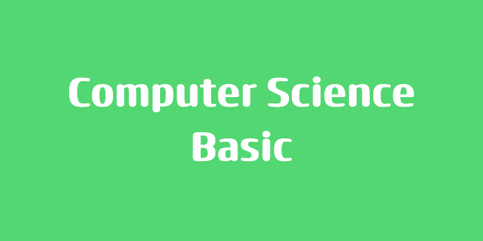

> 본 포스팅은 인프런의 [넓고 얕게 외워서 컴공 전공자 되기](https://inf.run/udDJ6)를 참조하여 작성한 글입니다.

## 자료를 정리하는 이유

프로그래밍을 공부하다 보면 주위에서 이렇게들 이야기를 한다. 자료구조랑 알고리즘(문제 해결에 관한 공식)이 중요하다고 한다. 그러면 왜 자료를 정리할까? 자료를 잘 아는 것도 중요하지만 그것을 나중에 찾기 쉽게 정리라는 것이 필요하다.

효율이 좋은 사람은 '정리'를 잘한다. 그런데 이 정리를 할 때 어떤 규칙에 맞게 자료를 정리하는데 이 때, **일정규칙으로 자료를 나열하는 것**이 자료구조이고 **구조화된 자료에서 원하는 것을 빨리 찾아내는 방법**이 알고리즘이다.

### 자료구조의 종류

자료구조에는 크게 2가지 종류로 구분할 수 있다.

- 선형구조 : 일렬로 줄을 세우는것으로 1차원 구조를 가진다. ex. 스택, 큐
- 비선형구조 : 2차원적 구조를 가지며 선형구조에 비해 매우 성능이 뛰어나다. 단, 선형구조에 비해 논리구조가 복잡하다. ex. 트리구조

> 비선형구조는 매우 성능이 뛰어남으로 우리가 흔히 데이터를 저장하는 DB가 전부 비선형구조를 취한다.

## 선형 자료구조 Stack과 Queue

### Stack

스택은 1차원적인 선형자료구조이며, 입출력 지점이 1개뿐인 자료구조이다.

- Last In First Out 구조
- 처음 넣은 것은 맨 아래바닥에 깔린다.
- 넣는 것은 push, 빼는 것은 pop이다.
- 두 번째부터는 처음 넣은 것 위에 쌓인다.
- 바닥에 있는 것을 꺼내려 면 위에 쌓인 것들을 모두 치우는 수밖에 없다.
- '(정보) 뒤집기'나 '되돌아가기'에서 많이 사용한다.

### Queue

큐는 1차원적인 선형자료구조이며, 입출력 지점이 2개인 자료구조이다.

- First In First Out 구조
- 버스를 타기 위해 줄을 서는 것과 같다.
- 은행에서도 비슷한 경험을 할 수 있다.
- 넣는 것은 enqueue, 빼는 것을 dequeue

큐는 동기화와 매우 많은 관련이 있다. 멀티태스킹이나 멀티쓰레딩 환경에서 동시다발적으로 연산하기 좋게 할 때 큐라는 자료구조를 쓴다.

## 비선형 자료구조 2진 트리

비선형구조가 왜 선형구조보다 뛰어날까? 우리는 자료구조를 배우는 이유가 정보를 빠르게 찾기 위해서라고 하였다. 예를 들어 원하는 수를 검색하는 경우를 보자. 선형구조는 일일이 다 확인해봐야 한다. 물론 운이 좋으면 바로 찾겠지만 나쁘면 다 뒤집어야 한다. 하지만 비선형구조는 어떤 기준점을 두고 크면 오른쪽 작으면 왼쪽으로 노드를 이동해서 찾아가는 방법으로 선형구조보다 훨씬 빠를 것으로 기대된다.

- 자료당 두 개의 위치정보 (링크)를 이용해 셋을 하나로 묶는다.
- 맨 꼭대기를 기준으로 왼쪽 에는 작은 숫자, 오른쪽에는 큰 숫자 카드가 있다고 가정한다.

## 마무리

개발자가 되고 싶고 프로그래밍 언어를 배움에 있어서 반드시 자료구조는 학습해야한다. 자료구조 공부할 때 비선형구조까지 공부를 해야 한다. 그리고 프로그래밍 언어로 직접 구현해 보는 게 좋다. 특히나 각각의 자료구조를 배우면서 본인만의 언어로 직접 구현을 해보면서 어떤 원리로 동작하는지 알아두면 나중에 개발자 커리어에 큰 도움이 되지 않을까?