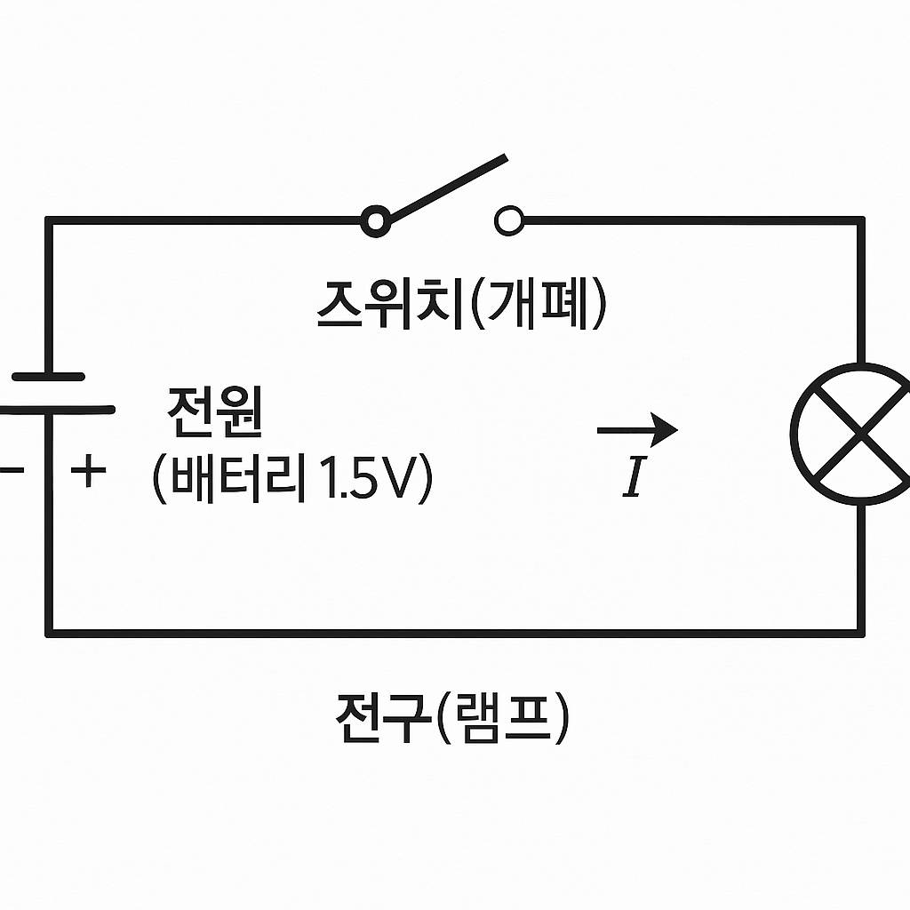
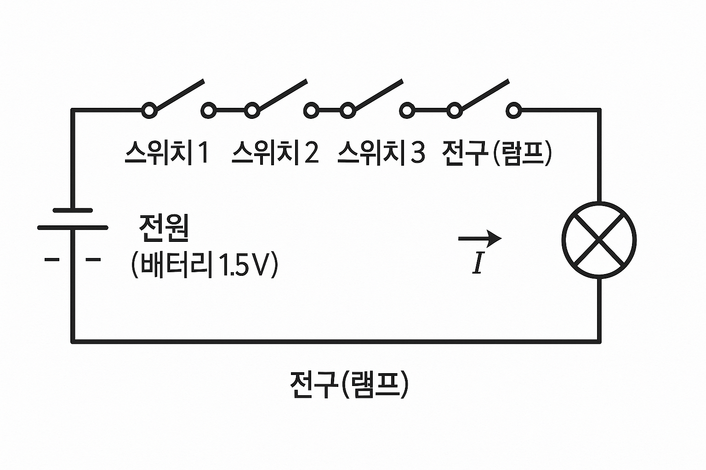
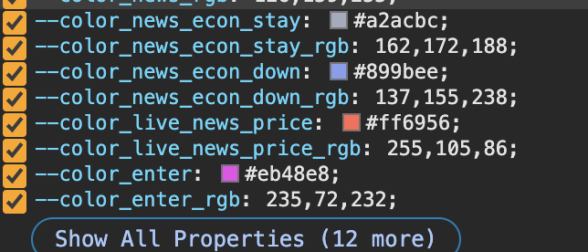
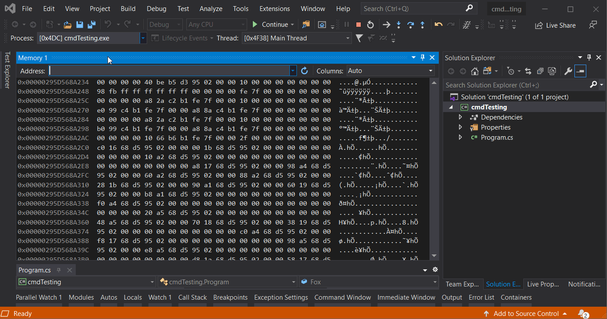

> 본 포스팅은 인프런의 [넓고 얕게 외워서 컴공 전공자 되기](https://inf.run/udDJ6)를 참조하여 작성한 글입니다.

## 1비트와 디지털

그러면 본격적으로 컴공 이론에 기초가 되는 지식에 대해 학습해보자.

### 1bit와 2진수

1비트가 무엇일까? 필자가 대학교 시절, 비트라는 단위는 들어봤지만, 정확히 뭐 하는 것인지 파악이 힘들었던 적이 있었다. 쉽게 생각해서 **전기스위치 1개**를 생각하면 된다. 즉, 1비트는 전기스위치 1개이고 전기 스위치가 켜진 상태를 숫자로 보면 1이고 꺼진 상태를 0이라고 보면 된다. 참, 거짓으로 보면 전기 스위치가 켜진 상태를 참, 꺼진 상태를 거짓으로 외워보자. 

숫자로는 1비트가 0과 1로 나타낸다고 했는데 여기서 나오는 개념이 **2진수**이다. 컴퓨터는 논리적으로 0과 1로 이루어져 있기에 2진수를 사용한다. 그리고 여기서 추가적으로 나오는 용어가 디지털인데, 디지털은 0이냐 1이냐 흑백논리로 따지는 것을 의미한다. 일단 자세한 개념이 왜 이렇게 되고는 해당 포스팅에서 다루지 않겠다. 일단 핵심 개념만 암기로 넘어가보도록 하자.

### 스위치 4개를 조합해서 4bit

전기스위치 4개가 있다고 해보자. 전기스위치 4개는 앞에서 이야기한 토대로 보면 4비트일 것이다. 그러면 이 전기스위치 4개의 경우의 수는 어떻게 될까? 비트 1개는 2진수로 0과 1 2가지이다. 경우의 수를 구해보면 2^1=2가 되는 것이다. 그러면 4비트는 2^4=16가지 경우의 수가 나올 것이다. 이렇게 유추해보았을 때 아래와 같은 공식이 나온다. 해당 공식은 중학교 과정에서 배웠지만 다시 한번 복기해보자.

> 📝 공식
>
> n 비트의 경우의 수: 2^n

추가적으로 알아야 할 부분이 **8421**이다. 예를 들어, 10진수 321이라는 숫자는 (3*100) + (2*10) + (1*1)이 되는 것이고 이 수식을 풀어 쓰면 (3*10^2) + (2*10^1) + (1*10^0)이다. 이것으로 유추할 때 4비트 또한 2^3, 2^2, 2^1, 2^0으로 나타낼 수 있으며 이것은 8,4,2,1로 나타낼 수 있다.

> ✅ 정리
>
> - 1비트 = 전기 스위치 1개 = 2진수 = 디지털
> - 4비트 = 전기 스위치 4개 = 16 = 8421

## 4비트와 16진수 그리고 진법변환

<table style="border-collapse:collapse; width:100%; text-align:center;">
  <caption style="caption-side:top; font-weight:600; padding:8px 0;">
    2진수 ↔ 16진수 변환표
  </caption>
  <thead>
    <tr>
      <th scope="col" style="border:1px solid #ccc; padding:8px;">2진수</th>
      <th scope="col" style="border:1px solid #ccc; padding:8px;">16진수</th>
    </tr>
  </thead>
  <tbody>
    <tr><td style="border:1px solid #eee; padding:6px;">0000</td><td style="border:1px solid #eee; padding:6px;">0</td></tr>
    <tr><td style="border:1px solid #eee; padding:6px;">0001</td><td style="border:1px solid #eee; padding:6px;">1</td></tr>
    <tr><td style="border:1px solid #eee; padding:6px;">0010</td><td style="border:1px solid #eee; padding:6px;">2</td></tr>
    <tr><td style="border:1px solid #eee; padding:6px;">0011</td><td style="border:1px solid #eee; padding:6px;">3</td></tr>
    <tr><td style="border:1px solid #eee; padding:6px;">0100</td><td style="border:1px solid #eee; padding:6px;">4</td></tr>
    <tr><td style="border:1px solid #eee; padding:6px;">0101</td><td style="border:1px solid #eee; padding:6px;">5</td></tr>
    <tr><td style="border:1px solid #eee; padding:6px;">0110</td><td style="border:1px solid #eee; padding:6px;">6</td></tr>
    <tr><td style="border:1px solid #eee; padding:6px;">0111</td><td style="border:1px solid #eee; padding:6px;">7</td></tr>
    <tr><td style="border:1px solid #eee; padding:6px;">1000</td><td style="border:1px solid #eee; padding:6px;">8</td></tr>
    <tr><td style="border:1px solid #eee; padding:6px;">1001</td><td style="border:1px solid #eee; padding:6px;">9</td></tr>
    <tr><td style="border:1px solid #eee; padding:6px;">1010</td><td style="border:1px solid #eee; padding:6px;">A</td></tr>
    <tr><td style="border:1px solid #eee; padding:6px;">1011</td><td style="border:1px solid #eee; padding:6px;">B</td></tr>
    <tr><td style="border:1px solid #eee; padding:6px;">1100</td><td style="border:1px solid #eee; padding:6px;">C</td></tr>
    <tr><td style="border:1px solid #eee; padding:6px;">1101</td><td style="border:1px solid #eee; padding:6px;">D</td></tr>
    <tr><td style="border:1px solid #eee; padding:6px;">1110</td><td style="border:1px solid #eee; padding:6px;">E</td></tr>
    <tr><td style="border:1px solid #eee; padding:6px;">1111</td><td style="border:1px solid #eee; padding:6px;">F</td></tr>
  </tbody>
</table>

4비트는 경우의 수로 16진수이며, 해당 4비트는 위의 표를 보면 알 듯이 **16진수 1자리 숫자**이다. 그러면 왜 갑자기 16진수 이야기를 하며, 왜 16진수를 알아야 할까? 

컴퓨터의 모든 정보는 0과 1로 된 디지털이고 이 정보는 2진수로 쓰이지 않고 16진수로 바꿔서 표현한다. 그 이유는 2진수로 표기를 하면 자리가 길어져서 정보를 알아보기 힘들기에 16진수로 줄여서 표현을 많이 하며, 특히 C언어에서 많이 사용된다. 그리고 보통 C언어 같은 곳에서 16진수를 표기할 때 아래와 같이 0x라는 prefix를 붙여서 많이 사용하니 이해하자.

> 0xF4 // 16진수 2자이므로 총 8bit

## 16진수 표기가 사용되는 예

16진수가 표기되는 예는 우리 생활에서 흔히 볼 수가 있다. 이런 예시를 통하여 어떤 경우에 16진수 표기가 사용되는지 알고 익숙해지도록 노력해 보자.

### 색상 표현 (RGB 컬러)

제일 먼저 색상표현을 할 때 사용이 된다. 빛의 3 원색 RGB를 컴퓨터에서 나타낼 때 16진수를 이용한다. RGB에 R값, G값, B값 하나하나를 표기할 때 8비트를 사용한다. 8비트는 총경우의 수가 2^8=256가지이며, 0~255까지 표현이 된다. 즉, 이 숫자들을 조합해서 총 24bit를 사용하고 여기서 추가적으로 alpha 채널 값이라고 투명도를 다루는 값이 존재하는데 해당 값은 총 8bit로 이루어져 있다. 그래서 RGB + A 값을 추가하여 총 32bit를 색상을 표현하는데 사용하며, 2^32의 경우의 수가 우리가 모니터로 볼 수 있는 색상의 수인 셈이다.

### CSS

우리는 웹 개발을 할 때 HTML로 프레임을 만들고 CSS로 디자인을 입힌다. 아직 HTML이 뭐고, CSS가 뭔지 몰라도 괜찮다. 지금은 이렇게만 이해해 두는 것이 좋다. 이때 CSS에 색상을 입힐 때 16진수를 이용한다. 아래 그림이 크롬 브라우저에 색상을 표기할 때 사용하는 css 예시를 보면 이해가 편할 것이다.

위의 사진을 보면 #을 제외하고 보면 전부 16진수로 이루어져 있는 것을 확인할 수 있고 총 24비트가 사용되는 것을 볼 수 있다.

### 컴퓨터 하드웨어 주소 표현

컴퓨터에는 주소라는 개념이 존재한다. 마치 우리 집 주소처럼 말이다. 이런 컴퓨터의 메모리 주소를 표현할 때도 16진수를 이용한다. 아래 그림은 Visual Studio로 C언어를 작성우 메모리 윈도우를 펼친 모습니다. 아래 그림을 보면 전부 16진수로 이루어진 것을 볼 수 있다.

### 메모리 값 표현

컴퓨터의 메모리 값, 즉 정보는 디지털이고 디지털은 0과 1로 이루어져 있고 16진수로 거의 표기한다. 이러한 이유로 우리는 컴퓨터 공부를 하면, 16진수와 매우 밀접하게 연관되어 있으니 매우 잘 알아야 한다.

## 외워야 할 단위 체계와 숫자

1000ml가 되면 1L라고 단위가 바뀌는 것처럼 용량도 단위가 바뀐다. 8비트가 되면 1byte로 단위가 변경이 된다. 1byte란, 영문자 한 글자가 저장될 수 있는 메모리 크기이며 컴퓨터의 CPU나 OS가 관리하는 최소 단위이다. 그러면 1byte에서도 단위가 변경이 된다. 1024byte가 되면 1KB로 단위가 변경이 된다. 이 처럼 용량의 단위가 1024 단위로 변경이 되는데 아래의 표를 통하여 자세히 살펴보자.

> ✅ 참조
>
> 한글은 코드체계에 따라 상이하지만 보통은 2byte의 기억공간을 가지고 있다.

<table style="border-collapse:collapse; width:100%; text-align:center;">
  <caption style="caption-side:top; font-weight:600; padding:8px 0;">
    데이터 단위와 대략적 규모
  </caption>
  <thead>
    <tr>
      <th scope="col" style="border:1px solid #ccc; padding:8px;">단위</th>
      <th scope="col" style="border:1px solid #ccc; padding:8px;">크기</th>
      <th scope="col" style="border:1px solid #ccc; padding:8px;">특징</th>
    </tr>
  </thead>
  <tbody>
    <tr>
      <td style="border:1px solid #eee; padding:6px;">1bit</td>
      <td style="border:1px solid #eee; padding:6px;">전기 스위치 1개</td>
      <td style="border:1px solid #eee; padding:6px;">용량이 아니라 표현의 최소 단위</td>
    </tr>
    <tr>
      <td style="border:1px solid #eee; padding:6px;">1byte</td>
      <td style="border:1px solid #eee; padding:6px;">8bit</td>
      <td style="border:1px solid #eee; padding:6px;">영문자 한 글자를 저장할 수 있는 기억공간의 최소 단위이다.</td>
    </tr>
    <tr>
      <td style="border:1px solid #eee; padding:6px;">1KB</td>
      <td style="border:1px solid #eee; padding:6px;">1024byte</td>
      <td style="border:1px solid #eee; padding:6px;">보통 JPEG 사진 파일 하나가 몇백 KB정도 된다.</td>
    </tr>
    <tr>
      <td style="border:1px solid #eee; padding:6px;">1MB</td>
      <td style="border:1px solid #eee; padding:6px;">1024KB</td>
      <td style="border:1px solid #eee; padding:6px;">mp3 파일 하나가 대략 4~5MB 정도 크기이다</td>
    </tr>
    <tr>
      <td style="border:1px solid #eee; padding:6px;">1GB</td>
      <td style="border:1px solid #eee; padding:6px;">1024MB</td>
      <td style="border:1px solid #eee; padding:6px;">영화(.avi, .mp4) 파일 하나가 대략 2~6GB정도 크기이다.</td>
    </tr>
    <tr>
      <td style="border:1px solid #eee; padding:6px;">1TB</td>
      <td style="border:1px solid #eee; padding:6px;">1024GB</td>
      <td style="border:1px solid #eee; padding:6px;">HDD 1개 용량이 보통 1~2TB</td>
    </tr>
    <tr>
      <td style="border:1px solid #eee; padding:6px;">1PB</td>
      <td style="border:1px solid #eee; padding:6px;">1024TB</td>
      <td style="border:1px solid #eee; padding:6px;">2016년 7월 네이버 IDC 센터 각의 규모는 900PB정도</td>
    </tr>
    <tr>
      <td style="border:1px solid #eee; padding:6px;">1EB</td>
      <td style="border:1px solid #eee; padding:6px;">1024PB</td>
      <td style="border:1px solid #eee; padding:6px;">64bit를 용량으로 계산하면 16EB가 된다.</td>
    </tr>
    <tr>
      <td style="border:1px solid #eee; padding:6px;">1ZB</td>
      <td style="border:1px solid #eee; padding:6px;">1024EB</td>
      <td style="border:1px solid #eee; padding:6px;">2017년 기준 전 세계 데이터 센터 트래픽이 약 7.7ZB이다.</td>
    </tr>
    <tr>
      <td style="border:1px solid #eee; padding:6px;">1YB</td>
      <td style="border:1px solid #eee; padding:6px;">1024ZB</td>
      <td style="border:1px solid #eee; padding:6px;">상상하기 힘든 정도</td>
    </tr>
  </tbody>
</table>

## 컴퓨터가 글자를 다루는 방법

우리 컴퓨터가 만들어질 당시, 숫자만 가지고 무언갈 하겠다는 생각은 하지 않았다. 글자를 이용하는 것도 하나의 목표였기 때문이다. 그래서  컴퓨터를 개발하는 분들의 생각은 다음과 같았다. 컴퓨터는 숫자만 이용이 가능하기 때문에 어떤 숫자를 어떤 글자로 매핑하자는 생각을 하게 되었다. 이런 것을 바로 코드체계라고 한다. 즉, 숫자가 나오면 해당되는 글자의 그림을 그려준다. 고급 용어로 렌더링 한다고 표현한다.

### ASCII

하지만 문제가 있었다. 바로 컴퓨터 제조사마다 코드체계가 다른 상황이 나오게 된 것이다. 아래의 예시를 보자. 

A제조사가 있고 B제조사가 있다 하자. A제조사에서는 숫자 27이 A를 나타내고 B제조사는 숫자 99가 A를 나타낸다. 그리고 두 제조사의 컴퓨터끼리 메일을 주고받는다고 하자. 그러면 각 사용자들은 수신된 메일을 확인이 불가능할 것이다. 이유는 서로 코드체계가 다르기 때문에 글자가 다 깨져서 나오기 때문이다. 그래서 미국정부가 나서서 표준코드체계를 만들었는데 그것이 바로 **ASCII**이다.

그러면 필자는 여기서 궁금해지는 사항이 존재한다. 만약 우리가 숫자 65와 문자 A를 입력했을 때 컴퓨터는 바이너리 정보로 0x41을 받을텐데 어떻게 컴퓨터는 해당 정보가 숫자 65인지 아니면 문자 A인지 구분을 할 수 있을까? 결론을 말하면 컴퓨터는 ‘A’와 숫자 “65”를 같은 값으로 보지 않고, 각각 다른 입력 시퀀스(다른 코드들의 나열)로 받아들인다. ‘A’는 단일 문자로서 코드값 65(0x41) 하나만 전달되지만, “65”는 문자 ‘6’(0x36)과 문자 ‘5’(0x35) 두 개가 순서대로 전달된다. 즉, 컴퓨터는 키보드에서 어떤 키들이 눌렸는지(문자 단위)를 먼저 구별하고, 그 이후에 필요하다면 그 문자들을 숫자로 해석(파싱)하기 때문에 둘을 혼동하지 않기에 서로 다르게 바라본다는 점이다.

### 바이너리

우리는 이제 구분을 해야 할 것이 생겼다. 숫자 1과 문자 1이 다르다는 사실이고 이 2개를 구분하는 것이 중요하다. 둘은 명백히 다르다. 숫자 1과 문자 1은 16진수 값만 비교해도 다르기 때문이다. 그리고 이런 2진수에 대한 정보를 말할 때 **바이너리**라고 부른다. 또한 우리가 흔히 쓰는 띄어쓰기의 빈칸과 엔터키도 하나의 바이너리로 속하게 된다. 이를 잘 숙지하자.

## 컴퓨터가 사진을 다루는 방법

컴퓨터를 개발하고 사용을 하다 보니 사진도 다루고 싶어 하였다. 그러면 어떻게 사진을 다룰 수 있었을까? 사진이 무엇인지 알아보기 전에, 사진이 무엇인지 먼저 확인해보자. 사진은 픽셀들의 집합체이다. 픽셀은 모니터 화면상 '점' 하나를 픽셀이라고 한다.

### 비트맵

가장 먼저 나온 사진의 포맷이 바로 비트맵이다. 비트맵이란, 픽셀들마다 용량을 표현한 고용량의 집합체이다. 자세히 설명하면 각각의 픽셀을 RGBA를 명시하여 표현한 집합체를 의미한다. 이 형식은 자주 사용하지 않는데 이유는 전체의 사진을 스캔을 해야 하기 때문에 용량이 크기에 많은 사용자들이 불편했다. 딱 생각만 해도 하나의 픽셀당, RGBA를 명시하면 하나의 픽셀에 4byte의 용량이 나오는데 가로가 만약 1024개이고 세로가 1024개이면, 4MB의 엄청난 용량이 나올 것이다.

그래서 요즘은 비트맵 이미지는 특수한 상황을 제외하고는 사용되지 않는다. 요즘은 비트맵 이미지 대신에 영상의 압축을 이용한 png, jpg, jpeg 형식의 이미지들을 이용한다. 영상의 압축을 이용하면 적은용량의 이미지가 사용이 가능하다. 영상의 압축의 예시를 좀 살펴보자. 영상의 압축기법중 하나로 렌더링할 픽셀들만 렌더링 하고 그 외의 모든 픽셀들에게는 정보를 표기하지 않는 방식으로 표현한다. 이런 식으로 접근을 하면 데이터가 적은 용량으로 큰 영역의 사진들이 표현이 가능하다. 자세한 것은 실제 잘 몰라도 되니, 이런게 있구나라고만 알고 넘어가자.