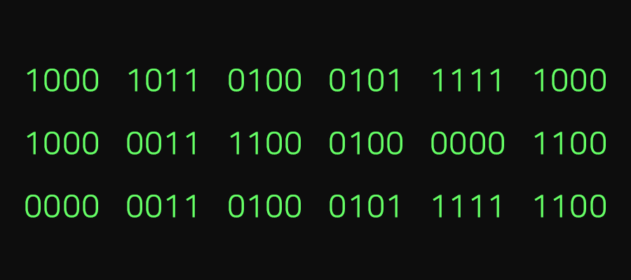
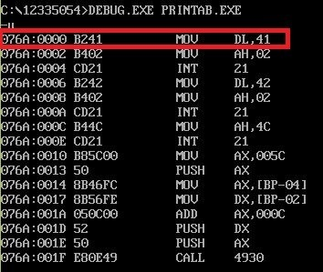
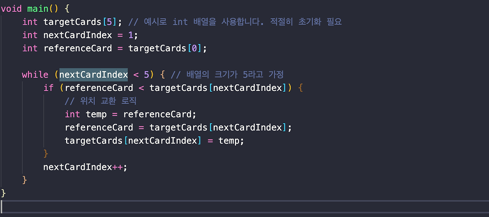

> 본 포스팅은 인프런의 [넓고 얕게 외워서 컴공 전공자 되기](https://inf.run/udDJ6)를 참조하여 작성한 글입니다.

## 프로그래밍의 다른 이름 절차적 글쓰기

프로그래밍은 어렵게 생각하지 말고 그냥 해당되는 언어를 배워서 '**절차적 글쓰기**'를 하는 것이라고 보면 된다. 절차적 글쓰기에 앞서서 먼저 선행되어야 하는 것이 있는데 바로 절차적 글쓰기에 대한 조건의 분석을 먼저 잘해야 한다. 그 분석을 바탕으로 머리에 시뮬레이션한 후에 절차를 기술하는 방식으로 해야 한다. 이런 식으로 프로그래밍에 다가가는 것이 학습에 있어서 좋을 것 같다.

## 가장 큰 수 찾기

알고리즘 문제 사이트 같은 곳이나 책을 보면 항상 나오는 문제가 있다. 바로 이 '큰 수 찾기' 문제이다. 이번에는 절차적 글쓰기로 해당 문제를 어떻게 풀지 알아보도록 하겠다. 먼저 문제부터 확인해보자. 문제는 다음과 같다.

- 모든 카드는 그림과 같이 뒷면이 보이도록 나열하며 카드 앞면에는 1~10까지 숫자가 적혀 있으며 같은 숫자는 없다고 가정한다.
- 영희는 철수의 지시에 따라 카드를 뒤집어 볼 수 있다.
- 철수는 카드는 한번에 두장만 뒤집어 보라고 영희에게 부탁할 수 있으며 영희는 두 카드 중 어떤 카드의 값이 더 큰지 알려준다. 단 숫자를 알려주지 는 않는다.
- 영희의 답을 듣고 철수가 원한다면 두 카드의 위치를 바꿀 수 있다.
- 어떤 카드부터 어떤 순서로 뒤집어 볼지는 온전히 철수 마음이다.
- 이제 가장 적은 회수로 카드를 뒤집어 보고 모든 카드를 오름차순으로 나열해 보자.

아마 푸는 사람마다 다 다를 것이다. 일단 필자의 생각을 기술할테니 독자들도 특이한 방법이 있다면 댓글로 달아주시면 감사할 것 같다.

- 먼저 처음 2개의 카드를 비교하여 큰 카드는 오른쪽 작은 카드는 왼쪽을 유지한다.
- 그리고 큰 숫자 카드와 다음 카드를 비교한다. 거기서 큰 카드는 오른쪽 작은 카드는 왼쪽을 유지한다.
- 이렇게 반복 후, 가장 오른쪽의 카드가 가장 큰 수가 될 것이다.

또한, 더 심화적으로 오름차순 정렬도 해보자. 바로 위의 로직의 확장판이다.

- 먼저 처음 2개의 카드를 비교하여 큰 카드는 오른쪽 작은 카드는 왼쪽을 유지한다.
- 그리고 큰 숫자 카드와 다음 카드를 비교한다. 거기서 큰 카드는 오른쪽 작은 카드는 왼쪽을 유지한다.
- 이렇게 반복 후, 가장 오른쪽의 카드가 가장 큰 수가 될 것이다.
- 이러고 나머지 큰 카드를 제외한 나머지 카드도 위의 로직처럼 비교
- 이렇게 비교할 카드가 있을 때까지 반복

그러면 이렇게 글쓰기과 완료되었으니 이제 언어의 문법을 가지고 해당 글쓰기를 매핑해주면 된다. 정말 간단하지 않나? 위의 큰 수 찾기에 대한 로직을 C언어 문법으로 작성해보면 아마 아래와 같을 것이다.

``` c
#include <stdio.h>

void main() {
    int targetCards[5]; // 예시로 int 배열을 사용합니다. 적절히 초기화 필요
    int nextCardIndex = 1;
    int referenceCard = targetCards[0];

    while (nextCardIndex < 5) { // 배열의 크기가 5라고 가정
        if (referenceCard < targetCards[nextCardIndex]) {
            // 위치 교환 로직
            int temp = referenceCard;
            referenceCard = targetCards[nextCardIndex];
            targetCards[nextCardIndex] = temp;
        }
        nextCardIndex++;
    }
}
```

## 일단 써놓고 규칙을 찾자

### 프로그램을 잘 작성하고 싶다면

일단 프로그래밍 규칙들을 단순하고 무식하게 작성하자. 그리고 프로그래밍을 추상적인 프로그램(ex. 정렬) 같은 걸로 하지 말고 우리가 좋아하는 단순한 게임(ex. 체스, 바둑등)으로 게임 규칙(처리의 조건)을 알아보고 작성해 보자. 필자도 학부생 1학년때 교수님께서 내주신 과제 중에 게임관련 과제가 많았다. 그런 게임의 대한 규칙을 찾아보고 직접 해보고 그리고 나서 해당 내용을 정리를 하고 이후에 프로그램을 작성하니 훨씬 작성하기 쉬웠던 것 같다. 독자들에게도 한번 추천드린다.

### 변수와 상수

위에 언급한 데로 단순하고 무식하게 규칙을 작성하다 보면 1칸 이동, 2칸 이동... 이런 규칙들이 보이는데 우리는 이걸 n칸 이동한다라고 규칙을 정할 수 있다. 이때 n은 변수이다. 그리고 놀이공원의 입장료와 같은 것은 상수라고 표현한다. 정리를 하자면 변수는 변하는 수이면서, 정해지지 않는 수로 파악이 되고 상수는 변하지 않고 정해진 수로 파악을 할 수 있다.

## 컴파일과 고급어 저급어

고급어와 저급어는 무엇일까? 고급어는 고급스러운 언어이고 저급어는 저급한 언어일까? 그것은 아니다. 우리가 레이어드로 운영체제를 설명을 했었다. 이 때 user mode쪽에 가까운게 고급이고 하드웨어에 가까운게 저급으로 직역을 할 수 있다. 그러면 이제 알 수 있을 것이다. 고급어는 user mode에 가까운 언어이고, 저급어는 하드웨어에 가까운 언어를 저급어라고 표현할 수 있다. 대표적인 고급어는 우리가 흔히 사용하는 파이썬, C언어, Java등이 있고, 저급어는 기계어로 볼 수 있다. 

우리가 프로그래밍을 작성하는 것은 실행을 위한 것이며 실행은 곧 연산하는 것과 같다. 연산은 CPU가 하며 CPU는 기계이다. 그리고 우리는 기계에 명령을 내려서 설정을 할 수가 있다. 그런 CPU가 인식할 수 있는 명령 코드 체계가 있는데 그 코드체계가 기계어라고 할 수 있다.

### 기계어

기계어는 우리 인간이 알아보기 힘든 코드이다. 아마 아래와 같이 생긴 코드일 것이다.



### 디스어셈블 코드

기계어 코드를 또 다른 심벌 즉, 알아보기 쉬운 글자로 바꾸는 것이 어셈블리 코드이다. 아래와 같이 생긴 코드이다.



### 고급어

우리가 흔히 사용하는 프로그래밍 언어가 고급어이다. 대표적인 C언어나 자바같은 언어가 고급언어이다.



### 컴파일

High Level의 언어를 Low Level 언어로 번역하는 것을 컴파일이라고 한다. 그리고 컴파일을 해주는 S/W가 컴파일러다. 컴파일 과정은 High Level의 코드들을 한 번에 전체 번역을 한다.

### Native Code

Native Code는 운영체제와 H/W에 의존적으로 운영체제가 변경될 시, 작동이 되질 않는다. 대표적으로 C언어가 있다.

### Managed Code

Native Code와 반대로 플랫폼에 종속적이고 운영체제에 독립적인 코드를 의미하며 대표적으로 java가 있다.

### Virtual Machine

우리는 CPU를 machine 즉, 기계라고 불렀다. 또한 S/W는 logical 또는 virtual이라고 불렀다. 즉, S/W로 CPU를 만들 수 있는데 이것을 Virtual Machine이라고 부른다.

> 컴파일러 방식 코드는 고급언어를 기계어로 번역 후 실행을 한다.

## 인터프리터

컴파일 언어는 프로그래밍 코드를 작성하고 전체를 번역 후, 실행에 이어지는 반면에 인터프리터 언어는 한 줄 단위로 번역 후 실행을 한다. 그러기에 사용자 입장에서는 그 즉시 실행되는 것 같아 코드를 직접 실행한다라고도 표현을 한다. 인터프리터는 컴파일러에 비해 유연하지만 성능면에서는 컴파일러보다 느리다. 대표적인 인터프리터 언어에는 Javascript, Python 등이 이에 속한다.

## API와 SDK

### API

API란, Application Programming Interface로 쉽게 생각해서 함수라고 생각하면 된다. 자세히 보면 API는 다른 프로그래밍을 개발하는 데 있어서 쉽게 개발할 수 있게 도와주는 함수이다. 그래서 우리는 카카오 API, 구글 API 등 이런 용어들을 들어봤을 텐데 바로 이것들이 API다.

### SDK

SDK란, Software Development Kit로 어느 특수 목적 함수 패키지라고 보면 된다. 우리는 안드로이드 SDK라는 용어들을 들어봤을텐데 이것이 바로 그것이다.

> 📝 정리
>
> API가 주방기구라고 비유하자면 SDK는 가정용 주방기구세트라고 이해하면 쉬울 것이다.