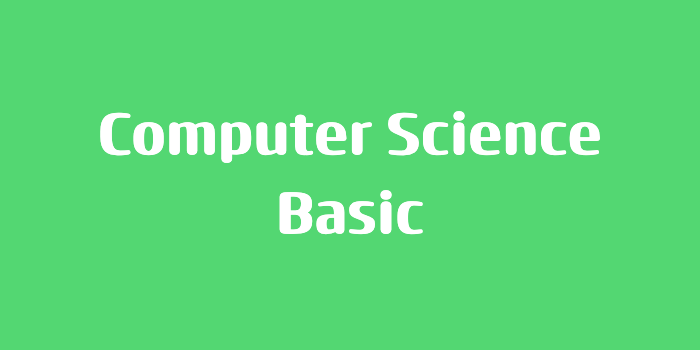

> 본 포스팅은 인프런의 [넓고 얕게 외워서 컴공 전공자 되기](https://inf.run/udDJ6)를 참조하여 작성한 글입니다.

## 수강에 앞서 강의 소개

추석을 맞이하여 스스로 돌이켜보면서 컴퓨터 지식이 부족하다는 것을 많이 깨달았다. 이에 해당 강의를 학습하면서 스스로 정리해보며 내가 부족했던 점을 보완하면서 성장을 해보려고 한다. 해당 강의에서 강사님께서 하신 말을 정리하면 핵심은 다음과 같다.

뭔가 빠르게 지식을 터득하는 것은 없다. 뭔가 요즘 광고에서도 '몇 주만에 개발자 취업하기', '네카라쿠배 3개월이면 된다'라는 허위성 광고가 많이 보인다. 필자도 이런 광고를 보면서 너무나 어처구니가 없었는데 강사님도 나와 유사한 생각을 가지신다고 하셨다.

또한, 질문하는 것에 두려움을 가지지 말라고 하셨다. 바보같은 질문이여도 좋으니 내가 뭘 모르는지를 구체적으로 질문해보라고 하셨다. 맞는 말 같다. 가장 문제는 자기 자신이 뭘 모르는지에 대한 것인데 필자 또한 이 점이 부족한 것 같다. 그래서 해당 강의를 들으면서 필자도 모르는 점을 질문을 통해 보완하고 나만의 글로 한번 풀어볼려고 한다.

## 다나와에 가보세요.

컴퓨터 부품 용어에 대해 '다나와'라는 사이트를 통하여 컴퓨터 부품 용어 정리를 해보려고 한다. '컴퓨터 부품 용어를 굳이 알아야할까?'라는 생각을 많이 하게 될 것이다. 그냥 무작정 CS(Computer Science)에 가면 안될까? 필자가 생각하기로는 CS를 공부하다보면 어떤 부분이든 컴퓨터 용어가 나올것이고 이것이 그 학습을 하는데 있어서 많은 불편함을 초래할 수 있기에 용어정리를 시작으로 CS공부의 기초를 시작해보려고 한다.

[다나와](https://www.danawa.com/)라는 사이트는 컴퓨터 부품들을 돈 주고 구매할 수 있는 쇼핑몰이다. 그런데 이 사이트에서 왜 용어정리를 하려는 이유는 아래와 같다. 먼저, 링크로 컴퓨터 부품 용어정리가 잘 되어있다. 또한, 단순 용어 정리를 해둔것이 아닌, 예를 들어 설명을 많이 되어있어서 학습에 도움이 될 것 같아 이 쇼핑몰 사이트를 참조하여 학습을 할 예정이다. 그러면 내가 찾아본 용어들을 정리를 해보겠다.

### CPU

그럼 먼저 CPU에 대하여 한번 정리를 해보도록 하겠다. CPU란 어떤 장치일까? CPU라는 정의는 따로 생각해보질 못하여 찾아보았다. 그래서 CPU관련 용어들을 정리해보았다.

- CPU란 연산하는 장치라고 말한다.
- Core 개수가 CPU에 중요한데 Core란 연산하는 주체이다.
- CPU의 동작속도는 Hz라는 단위를 사용하며 이를 다른 말로는 클럭(clock) 이라고 한다. 이는 1초 동안 파장이 한 번 움직이는 시간이며 이 시간 동안 데이터를 얼마나 많이 처리하느냐에 따라 CPU의 속도가 달라지게 된다.
- L2 캐시 메모리는 CPU 내부에서 임시로 사용하는 버퍼(Buffer) 메모리 중 하나이다.
- L3 캐시 메모리도 L2 캐시 메모리와 마찬가지로 CPU 안에 내장되어 있는 일종의 임시 메모리이다. 다중 코어 CPU의 경우 L2 캐시는 코어마다 하나씩 들어있으나 L3 캐시 메모리는 CPU 전체에서 하나만 존재한다. CPU에 따라 있을 수도 있고 없을 수도 있다.
- 메모리 클럭이란 CPU에서 지원하는 메모리의 동작 클럭입니다. 메모리의 동작 클럭은 메모리의 동작 속도를 나타냅니다. 숫자가 클 수록 동작 속도가 빠르다.

### 하이퍼 쓰레딩

다나와에 보면 요즘 CPU는 대부분 하이퍼 쓰레딩 기술을 적용하였다고 하였다. 그래서 하이퍼 쓰레딩 기술이 궁금하게 되었다. 그래서 찾아본 결과 아래와 같다.

하이퍼 쓰레딩이란, 여러가지 기술적인 용어 대신 간단하게 말하자면 A-B-C-D라는 4가지 공정을 거쳐야 완성되는 물건(쓰레드)이 있다고 가정해 보자. A 공정이 끝나고 B공정으로 넘어가면 A공정은 쉬게 되는데, 이는 비효율적이다.따라서 B공정으로 넘어가면 다시 A공정에 새로운 작업을 투입하여 병목이 생겨 놀고있는 부분을 줄이도록 업무 처리 과정을 개선한 기술이 인텔 하이퍼쓰레딩과 AMD SMT이다. 1개의 코어에서 2개의 쓰레드를 처리할 수 있도록 개선하였기 때문에 해당 기술이 적용된 CPU를 장착한 PC에서 윈도우즈 작업 관리자를 켜면 쿼드코어 CPU라도 8개의 코어를 가진 것으로 보이게 된다.

### DDR5? DDR4?

DDR5와 DDR4 메모리는 한 사이클에 데이터를 동시에 주고 받을 수 있는 DDR (Double Data Rate) 메모리의 한 종류로써 최신 CPU와 메인보드에서 지원하는 방식이다.

DDR5는 DDR4 대비 기본으로 높은 클럭을 지원하며, 전압이 낮아졌고, PMIC칩이 메인보드가 아닌 메모리 모듈에 탑재된 부분, 온다이ECC 등의 차이가 있으며, 다만 클럭이 높아진 만큼 레이턴시가 길어진 부분은 참고해야 한다.

> DDR4는 64비트*1WAY = 64비트 (1개만 장착시 단일채널로 인식)
>
> DDR5는 32비트*2WAY = 64비트 (1개만 장착시 듀얼채널로 인식)

DDR5도 대역폭을 높이려면 2개를 사용하여 쿼드채널로 구성하는 것이 유리하다.

### 메인보드

PS/2, VGA, Type C, HDMI, USB 3.0, USB2.0등이 소켓처럼 장착되어 있는데 고급진 용어로 인터페이스라고 불린다. 인터페이스란 즉, 컴퓨터와 주변기기를 연결시켜주는 접점의 역할을 한다.

### 추가 알아 본 사항

- QPI와 FSB: 메모리와 CPU를 연결하는 버스의 일종으로 요즘의 시스템에서는 FSB 대신 QPI(QuickPath Interconnect)를 사용한다.
- DMI 4.0 8 GT/s: DMI(Direct Media Interface)는 CPU와 PCH(Platform Controller Hub)를 연결하는 인터페이스로, PCIe와는 다른 독립적인 버스이다. 8 GT/s는 Giga Transfers per second를 의미하며, 하나의 전송 당 크기는 프로토콜에 따라 다르지만, 보통 PCIe에서는 1 Transfer가 1비트입니다. 따라서 8 GT/s는 대략 1GB/s의 전송 속도로 이해될 수 있다.
- CPU와 메모리 클럭 동기화: 흔히 CPU 클럭과 메모리 클럭은 동기화되지 않는다. 각각 고유의 클럭 속도로 동작하며, 메모리 컨트롤러와 타이밍 메커니즘이 있어서 이는 원활하게 동작할 수 있게 합니다.

> DMI는 메인보드의 PCH와 연결을 하는 CPU만 사용하는 PCIe 버스이다.

> 잘못된 정보가 있을 시, 댓글 부탁드립니다.