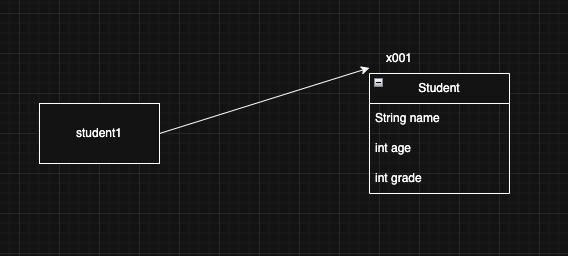
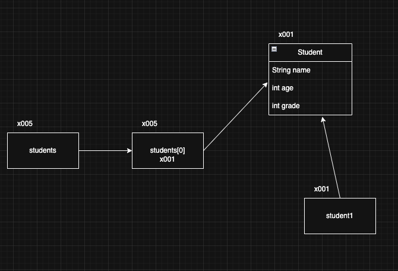

> 해당 블로그 글은 [영한님의 인프런 강의](https://inf.run/PuC6W)를 바탕으로 쓰여진 글입니다.

## 프로젝트 환경 구성

프로젝트 환경 구성은 필자가 쓴 [자바 입문편 내용](https://sungbin.kr/Hello-World/#%EA%B0%9C%EB%B0%9C-%ED%99%98%EA%B2%BD-%EC%84%A4%EC%A0%95)을 참고 바란다.

## 클래스가 필요한 이유

우리가 살아가는 세상은 전부 사물, 생물들로 이루어져 있다. 이것을 컴퓨터 용어로 객체라고 표현한다. 자바세상도 마찬가지로 인간세상과 똑같이 객체로 이루어져 있다. 또 객체하면 연관 검색어로 클래스가 나온다. 그러면 왜 클래스와 객체가 필요한지를 예제코드를 발전하면서 살펴보자.

``` java
package class1;

public class ClassStart1 {
    public static void main(String[] args) {
        String student1Name = "학생1";
        int student1Age = 15;
        int student1Grade = 90;

        String student2Name = "학생2";
        int student2Age = 16;
        int student2Grade = 80;

        System.out.println("이름: " + student1Name + " 나이: " + student1Age + " 성적: " + student1Grade);
        System.out.println("이름: " + student2Name + " 나이: " + student2Age + " 성적: " + student2Grade);
    }
}
```

위와 같은 코드가 있다고 하자. 딱 봐도 지저분해보인다. 일단 변수명도 1, 2같은 숫자가 들어가져 있고 학생이 추가될 때마다 많은 부분을 추가해야 한다. 변경에 유연하지 못한 코드이다. 그러면 이것을 어떻게 바꿀 수 있을까? 입문편때 배운 배열로 리팩토링을 할 수 있다.

``` java
package class1;

public class ClassStart2 {
    public static void main(String[] args) {
        String[] studentNames = {"학생1", "학생2"};
        int[] studentAges = {15, 16};
        int[] studentGrades = {90, 80};

        for (int i = 0; i < studentNames.length; i++) {
            System.out.println("이름: " + studentNames[i] + " 나이: " + studentAges[i] + " 성적: " + studentGrades[i]);
        }
    }
}
```

이제 반복된 코드도 제거하고 이전 코드에 비해 매우 단순해졌고 변경에도 용이해졌다. 학생이 추가되더라도 각각의 데이터만 추가해주면 되는 것이다. 하지만 위의 코드에는 찜찜한 문제가 있다. 만약, 학생이 존재하는데 성적이 존재하지 않을 수도 있을 것이다. 또한 학생의 데이터를 삭제하고 싶을 때 3개의 배열 변수에 데이터를 정확히 눈 부릅뜨고 지워야 한다. 즉, 우리한테는 여전히 좋지 못한 코드이다.

우리는 뭔가를 묶어서 관리하는 것을 좋아한다. 엑셀 같은 경우를 생각해도 같은 분류끼리 테이블을 만들어서 하나의 시트에 관리를 한다. 이처럼 위의 3개의 변수로 나눠진 것을 묶고 싶은 생각이 든다. 바로 학생이라는 큰 집합으로 말이다. 이런 것을 객체라고 말하고 이후 위의 코드를 객체로 리팩토링 해 볼 생각이다.

## 클래스 도입

그러면 클래스를 도입해서 코드를 리팩토링 해보자.

``` java
package class1;

public class Student {
    String name;

    int age;

    int grade;
}
```

위와 같이 클래스를 정의하였다. 새로운 클래스를 만들어서 `main` 메서드를 만들지 않고 위와 같이 작성하면 된다. 또한 위와 같이 정의한 변수들을 **멤버변수** 혹은 **필드**라고 한다.

- 멤버변수: 특정 클래스에 소속된 멤버이기 때문에 이렇게 부른다.
- 필드: 데이터 항목을 가리키는 전통적인 용어이다. 데이터베이스, 엑셀 등에서 데이터 각각의 항목을 필드
라 한다.
- 멤버 변수, 필드 다 같은 말이다.

> 클래스는 관례상, 낙타 표기법을 사용한다.

이제 해당 객체를 사용해서 코드를 작성해보자.

``` java
package class1;

public class ClassStart3 {
    public static void main(String[] args) {
        Student student1;
        student1 = new Student();
        student1.name = "학생1";
        student1.age = 15;
        student1.grade = 90;

        Student student2 = new Student();
        student2.name = "학생2";
        student2.age = 16;
        student2.grade = 80;

        System.out.println("이름: " + student1.name + " 나이: " + student1.age + " 성적: " + student1.grade);
        System.out.println("이름: " + student2.name + " 나이: " + student2.age + " 성적: " + student2.grade);

    }
}
```

코드가 좀 더 복잡해졌지만 객체라는 개념이 도입이 되어서 이제 약간 데이터들이 소속감이 생긴 것 같다.

### 클래스와 사용자 타입

- 타입은 `int`나 `double`과 같이 데이터 형을 의미한다.
- 즉 해당 타입에는 그 타입만 들어 갈 수 있는 에코백이다.
- 클래스를 사용하면 우리가 원하는 타입의 에코백을 만들 수 있다.
- 비유가 조금 그렇지만 학생을 담을 수 있는 에코백을 만드는 것이다.
- 다른 비유로 하면 클래스를 이용하면 신이 학생이라는 객체를 탄생시켜주는 것과 유사하다.
- 신이 객체를 탄생할 때 설명서를 보고 만들어줘야 하는데 그것이 바로 클래스이다.
- 설명서인 클래스를 사용해서 **실제 메모리에 만들어진 실체를 객체 또는 인스턴스**라 한다.
- 클래스를 통해서 사용자가 원하는 종류의 데이터 타입을 마음껏 정의할 수 있다.

> 📚 용어 정리
>
> 클래스는 설계도이고, 이 설계도를 기반으로 실제 메모리에 만들어진 실체를 객체 또는 인스턴스라 한다. 둘다 같은 의미로 사용된다.

이제 위의 코드를 분석해보겠다.


- `Student student1;`
    - `Student`타입을 받을 수 있는 변수를 선언한다.
    - 객체(인스턴스)를 받을 수 있다.
    - 비유로 들자면 일종의 생명 하나를 만들어 둔다 생각하자. 이 비유가 이해가 안되겠지만 아래 부분을 읽으면 이해가 될 것이다.


- `student1 = new Student();`
    - 객체를 사용하려면 먼저 설계도인 클래스를 기반으로 객체(인스턴스)를 생성해야 한다.
    - `new` 연산자는 배열 시간에도 살펴봤지만 새로 생성해주는 연산자이다. `new Student()`는 설명서를 보고 신이 새로운 학생을 만들어 준다라는 뜻이다. 이렇게 하면 메모리에 실제 `Student` 객체(인스턴스)를 생성한다.
    - 학생이라는 생명체는 필요한 데이터들이 있을 것이다. 설명서에 따르면 이름, 나이, 성적으로 이루어져 있다. 그러면 해당 공간의 크기만큼은 미리 만들어 둘 것이다. 신이 학생을 탄생시킬 때 심장과 혈액같은 필수 값들은 공간을 미리 만들어서 넣어두는 것처럼 말이다.
    - 다음으로 이렇게 탄생된 인스턴스는 16진수로 이루어진 참조값을 반환한다. 그리고 그 반환값이 이전에 만들어 둔 변수에 저장되는 것이다.
    - 신이 학생을 만들었으면 그 학생과 미리 만들어준 생명과 연결하는 것처럼 말이다.
    - 또 다른 예시로 들자면 손님(변수)이 와서 방 하나를 요청한다. 그러면 안내원이 방 하나를 이루는데 필요한 것들을 설계도(클래스)를 보고 방(객체)을 만든다. 그리고 해당 방에 접근할 수 있게 열쇠(참조값)를 제공한다.
    
## 객체 사용



클래스를 통해 생성한 객체를 사용하려면 먼저 메모리에 존재하는 객체에 접근해야 한다. 객체에 접근하려면 `.` (점, dot)을 사용하면 된다.

``` java
student1.name = "학생1";
student1.age = 15;
student1.grade = 90;

System.out.println("이름: " + student1.name + " 나이: " + student1.age + " 성적: " + student1.grade);
```

객체의 멤버변수에 대입 및 읽기를 하려면 먼저 객체에 접근을 해야 한다. 우리가 방에 화장실에 가고 싶다고 한다면 먼저 그 방에 접근을 해야 할 것이다. 그 방에 접근하려면 우리는 참조값이라는 열쇠를 통해 그 방에 접근해서 화장실에 들어 갈 수 있다. 자바에서는 참조 값을 통해 인스턴스에 접근 후 `.`이라는 것으로 멤버변수를 읽거나 쓸 수 있다.

## 클래스, 객체, 인스턴스 정리

### 클래스

클래스는 일종의 설명서, 설계서, 틀이라고 볼 수 있다. 클래스는 객체가 가져야 할 속성(변수)과 기능(메서드)를 정의한다.

- 틀: 붕어빵 틀을 생각해보자. 붕어빵 틀은 붕어빵이 아니다! 이렇게 생긴 붕어빵이 나왔으면 좋겠다고 만드는 틀일뿐이다. 실제 먹을 수 있는 것이 아니다. 실제 먹을 수 있는 팥 붕어빵을 객체 또는 인스턴스라 한다.
- 설계서: 자동차 설계도를 생각해보자. 자동차 설계도는 자동차가 아니다! 설계도는 실제 존재하는 것이 아니라 개념으로만 있는 것이다.

### 객체 - Object

객체는 클래스에서 정의한 속성과 기능을 가진 실체이다. 객체는 서로 독립적인 상태를 가진다.

### 인스턴스

인스턴스는 특정 클래스로부터 생성된 객체를 의미한다. 그래서 객체와 인스턴스라는 용어는 자주 혼용된다. 인스턴스는 주로 객체가 어떤 클래스에 속해 있는지 강조할 때 사용한다. 예를 들어서 `student1` 객체는 `Student` 클래스의 인스턴스다 라고 표현한다.

### 객체 vs 인스턴스

둘다 클래스에서 나온 실체라는 의미에서 비슷하게 사용되지만, 용어상 인스턴스는 객체보다 좀 더 관계에 초점을 맞춘 단어이다. 하지만 실제 실무에서는 두 단어를 혼용해서 사용하니 크게 신경 쓸 필요는 없다.

## 배열 도입 - 시작

이제 조금 더 리팩토링을 해보자. 클래스를 이용해서 조금 사람이 보기 쉽게 만들었더니 조금 문제가 생겼다. 바로 학생이 하나 더 생성될 때 마다 출력문을 계속 만들어줘야 한다는 것이다. 그래서 우리는 객체 배열을 만들어서 해결해 볼 수 있을 것이다.

``` java
package class1;

public class ClassStart4 {
    public static void main(String[] args) {
        Student student1;
        student1 = new Student();
        student1.name = "학생1";
        student1.age = 15;
        student1.grade = 90;

        Student student2 = new Student();
        student2.name = "학생2";
        student2.age = 16;
        student2.grade = 80;

        Student[] students = new Student[2];
        students[0] = student1;
        students[1] = student2;

        System.out.println("이름: " + students[0].name + " 나이: " + students[0].age + " 성적: " + students[0].grade);
        System.out.println("이름: " + students[1].name + " 나이: " + students[1].age + " 성적: " + students[1].grade);
    }
}
```

배열로 객체들을 넘겨주었다. 일단 하나씩 살펴보자.



`new` 연산자를 통해 2개짜리 배열을 만들었다. 그리고 참조값을 반환했다고 하자. 위의 그림에서는 x005라고 하자. x005에 객체를 넘겨준다. 그런데 여기서 객체 자체를 넘겨주는 것이 아닌 객체의 참조값을 넘겨준다. **자바에서 대입은 항상 변수에 들어 있는 값을 복사한다.** 그래서 인스턴스 자체가 아닌 참조값이 복사되서 넘어간다. 그게 바로 x001이라고 하자. 이것을 통해 배열에 접근해서 사용해도 객체 변수와 같은 인스턴스를 가리키게 된다.

> ⚠️ 주의
>
> 변수에는 인스턴스 자체가 들어있는 것이 아니다! 인스턴스의 위치를 가리키는 참조값이 들어있을 뿐이다! 따라서 대입(`=`)시에 인스턴스가 복사되는 것이 아니라 참조값만 복사된다.

## 배열 도입 - 리펙토링

이제 좀 더 리팩토링 해보자. 배열 초기화도 더 단순히 해볼 수 있고 for문도 향상된 for문으로 변경이 가능하다.

``` java
package class1;

public class ClassStart5 {
    public static void main(String[] args) {
        Student student1;
        student1 = new Student();
        student1.name = "학생1";
        student1.age = 15;
        student1.grade = 90;

        Student student2 = new Student();
        student2.name = "학생2";
        student2.age = 16;
        student2.grade = 80;

        Student[] students = {student1, student2};

        for (Student student : students) {
            System.out.println("이름: " + student.name + " 나이: " + student.age + " 성적: " + student.grade);
        }
    }
}
```

> 잘못된 지식이 있을 경우 댓글로 남겨주시면 빠르게 반영하겠습니다!