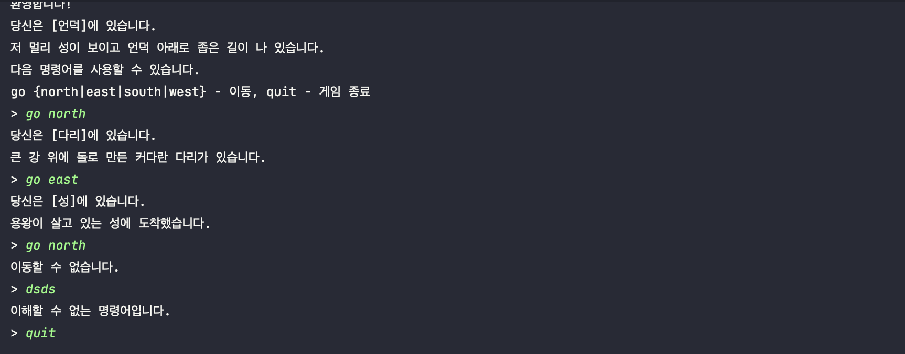

> 해당 블로그 글은 [조영호님의 인프런 강의](https://inf.run/HXdiC)를 바탕으로 쓰여진 글입니다.

## 텍스트 어드벤쳐 게임

그럼 설계 원칙을 적용하는데 있어서 우리가 해당 원칙을 적용할 예제를 미리 만들어보자.

우리가 만들 예제는 텍스트 어드벤쳐 게임이라는 것이다. 해당 게임의 실행화면은 아래와 같다.



해당 게임에는 지도가 존재한다. 지도에는 다양한 방들이 존재하고 방들이 서로 연결되어 있다고 하자. 물론 방이 동,서,남,북으로 모두 연결되어 있지는 않는다. 지도 가장 아래에 있는 방은 남쪽으로 이동이 불가능하며 가장 북쪽에 있는 방은 북쪽으로 이동이 불가능하다. 마찬가지로 가장 오른쪽에 있는 방들은 동쪽으로 이동이 불가능하며 가장 왼쪽에 있는 방은 서쪽으로 이동이 불가능하다. 물론 중간에 있는 방이더라도 방이 없다면 이동이 불가능하다는 제약사항이 존재한다.

다음으로 해당 게임에는 플레이어가 존재한다. 해당 플레이어의 초기 위치값이 설정되어야 하고 명령어를 통해 해당 플레이어를 이동시킬 수 있다. 또한 각 방에는 해당 방이 무슨 방인지 이름이 존재하고 방의 위치값도 존재하며 해당 방에 대한 설명도 존재한다. 그럼 해당 요구사항을 코드로 옮겨보자.

먼저 방에 대한 클래스를 설계하면 아래와 같다.

``` java
package me.sungbin;

public class Room {

    private int x, y;

    private String name;

    private String description;

    public Room(int x, int y, String name, String description) {
        this.x = x;
        this.y = y;
        this.name = name;
        this.description = description;
    }

    public String name() {
        return name;
    }

    public String description() {
        return description;
    }

    public int x() {
        return x;
    }

    public int y() {
        return y;
    }
}
```

요구사항에 맞춰 이름과 설명을 필드로 두고 각 방의 위치값을 x,y값으로 두었다.

다음으로 지도를 구현해보려고 한다. 여기서는 가로 2 세로 3인 지도를 만들려는데 2차원 배열을 사용하는 것이 아닌 1차원 배열로 사용하려고 한다. 1차원 배열로 만들려면 인덱스마다 방의 정보를 넣어줘야 하는데 인덱스는 **x + y * 가로 길이** 공식을 이용하여 매핑을 해주도록 하겠다. 이것을 코드로 옮겨보자. 일단 `Map`이라는 지도 클래스를 만들기 전에 `Game` 클래스에 구현해보도록 하겠다.

``` java
package me.sungbin;

import java.util.Scanner;

public class Game {

    private int width, height;

    private Room[] rooms;

    private int x, y;

    private boolean running;

    public Game() {
        this.x = 0;
        this.y = 2;
        this.width = 2;
        this.height = 3;
        this.rooms = arrangeRooms(
                new Room(0, 0, "샘", "아름다운 샘물이 흐르는 곳입니다. 이곳에서 휴식을 취할 수 있습니다."),
                new Room(0, 1, "다리", "큰 강 위에 돌로 만든 커다란 다리가 있습니다."),
                new Room(1, 1, "성", "용왕이 살고 있는 성에 도착했습니다."),
                new Room(0, 2, "언덕", "저 멀리 성이 보이고 언덕 아래로 좁은 길이 나 있습니다."),
                new Room(1, 2, "동굴", "어둠에 잠긴 동굴 안에 작은 화톳불이 피어 있습니다."));
    }

    private Room[] arrangeRooms(Room... rooms) {
        Room[] result = new Room[width * height];
        for (var room : rooms) {
            result[room.x() + room.y() * width] = room;
        }
        return result;
    }

    public void run() {
        System.out.println("환영합니다!");
        System.out.println("당신은 [" + rooms[x + y * width].name() + "]에 있습니다.");
        System.out.println(rooms[x + y * width].description());
        System.out.println("다음 명령어를 사용할 수 있습니다.");
        System.out.println("go {north|east|south|west} - 이동, quit - 게임 종료");

        Scanner scanner = new Scanner(System.in);

        running = true;
        while (running) {
            System.out.print("> ");
            String[] commands = scanner.nextLine().toLowerCase().trim().split("\\s+");
            switch (commands[0]) {
                case "go" -> {
                    switch (commands[1]) {
                        case "north" -> {
                            if (y - 1 < 0 || rooms[x + (y - 1) * width] == null) {
                                System.out.println("이동할 수 없습니다.");
                            } else {
                                y -= 1;
                                System.out.println("당신은 [" + rooms[x + y * width].name() + "]에 있습니다.");
                                System.out.println(rooms[x + y * width].description());
                            }
                        }
                        case "south" -> {
                            if (y + 1 >= height || rooms[x + (y + 1) * width] == null) {
                                System.out.println("이동할 수 없습니다.");
                            } else {
                                y += 1;
                                System.out.println("당신은 [" + rooms[x + y * width].name() + "]에 있습니다.");
                                System.out.println(rooms[x + y * width].description());
                            }
                        }
                        case "east" -> {
                            if (x + 1 >= width || rooms[(x + 1) + y * width] == null) {
                                System.out.println("이동할 수 없습니다.");
                            } else {
                                x += 1;
                                System.out.println("당신은 [" + rooms[x + y * width].name() + "]에 있습니다.");
                                System.out.println(rooms[x + y * width].description());
                            }
                        }
                        case "west" -> {
                            if (x - 1 < 0 || rooms[(x - 1) + y * width] == null) {
                                System.out.println("이동할 수 없습니다.");
                            } else {
                                x -= 1;
                                System.out.println("당신은 [" + rooms[x + y * width].name() + "]에 있습니다.");
                                System.out.println(rooms[x + y * width].description());
                            }
                        }
                        default -> System.out.println("이해할 수 없는 명령어입니다.");
                    }
                }

                case "quit" -> running = false;
                default -> System.out.println("이해할 수 없는 명령어입니다.");
            }
        }

        System.out.println("\n게임을 종료합니다.");
    }
}
```

위의 코드를 보면 지도의 크기값을 위해 `width`, `heigth`를 선언해두고 `x`, `y`값도 선언을 하였으며 방의 위치도 생성자를 통해 공식을 통해 초기화 시켜두었다. 또한 게임 시작 여부를 `running`이라는 `boolean` 타입으로 선언해두었다.

나머지 명령어 로직도 요구사항에 맞춰서 구현을 해둔 상태이다. 해당 부분은 코드를 읽어보면 대강 이해가 가능하기에 따로 설명은 생략한다.

이렇게 텍스트 어드벤쳐 게임을 구현해보았다. 하지만 해당 게임 코드에는 문제가 있다. `Game`클래스가 너무 장황하고 유지보수 하기 힘들다는 점이 있다. 이것을 한번 개선해보도록 하겠다.

## 테스트와 리팩터링

설계 원칙을 배우기 전에 먼저 테스트와 리팩토링에 대해 알아가보자.

리팩토링이란, 외부 동작 변경 없이, 내부 설계 구조를 개선하는 작업을 의미한다. 하지만 개발자도 사람이기에 동작이 변경이 되었을 때 기존 설계가 조금 잘못되었다는 알림 장치를 두면 더욱 효율적으로 리팩토링을 할 수 있을 것 같다. 이런 알림장치는 어떻게 제공받을 수 있을까?

눈치를 챈 분들도 계시겠지만 해당 알림장치가 바로 테스트 코드이다. 만약 리팩토링 전에 성공한 테스트 코드가 리팩토링 후에도 성공 가능한지 테스트를 해보는 것으로 알림장치 역할을 하게 할 수 있다. 만약 리팩토링을 한 후에 테스트 코드가 실패한다면 우리가 진행한 리팩토링 작업은 잘못된 작업이라고 알 수 있는 것으로 다시 코드를 고칠 수 있는 것이다.

즉, 이렇게 리팩토링 전과 후가 전부 테스트 코드가 성공하는지 확인하는 테스트를 **회귀 테스트**라고 한다.

그러면 리팩토링을 잘 하려면 테스트 하기 좋은 코드로 작성을 해야할 것이다. 그러면 테스트 관점에서 객체를 바라 볼 필요가 있다. 객체는 외부 객체와 협력을 통해 책임을 구현한다. 외부 객체로부터 메세지를 공용 인터페이스를 통하여 전달 받으면 내부 상태를 변경한 후에 결과 값이 있다면 공용 인터페이스를 통해 전달해준다. 여기서 전달 받은 공용 인터페이스 부분을 입력 부분이라고 할 수 있고 결과 값을 돌려줄 때 사용하는 공용 인터페이스를 출력이라고 할 수 있다.

여기서 외부 객체는 실제 책임을 구현하기 위해 필요한 객체일 수 있지만 테스트 코드 객체일 수도 있다. 테스트 코드는 테스트 할 객체에게 입력을 보내 출력을 받아 적절한 출력이 나왔는지를 검증을 테스트한다. 이런 테스트 방식을 **상태 기반 검증** 테스트라고 부른다.

즉, 테스트 과점에서 객체는 입력과 출력을 잘 제어할 수 있는 설계를 해야 테스트 하기 쉬운 코드가 되는 것이다. 그럼 위의 텍스트 어드벤쳐 예제가 테스트 하기 쉬운 코드인지 살펴보자.

``` java
while (running) {
            System.out.print("> ");
            String[] commands = scanner.nextLine().toLowerCase().trim().split("\\s+");
            switch (commands[0]) {
                case "go" -> {
                    switch (commands[1]) {
                        case "north" -> {
                            if (y - 1 < 0 || rooms[x + (y - 1) * width] == null) {
                                System.out.println("이동할 수 없습니다.");
                            } else {
                                y -= 1;
                                System.out.println("당신은 [" + rooms[x + y * width].name() + "]에 있습니다.");
                                System.out.println(rooms[x + y * width].description());
                            }
                        }
                    }
                }
            }
}
```

`Game` 클래스 예제를 살펴보면 일단 먼저 `Scanner`라는 외부 객체를 사용하고 있다. 또한 출력을 위해 `System.out`이라는 외부 객체도 사용한다. 하지만 이런 객체들은 실제 테스트할 때 어려움이 있다. 즉, 해당 코드를 테스트하려면 키보드 입력을 설정하고 콘솔 출력 결과를 위해 `System` 내부 상태도 변경이 되어야 한다. 그럼 이렇게 테스트를 작성해보자.

``` java
package me.sungbin;

import org.junit.jupiter.api.Test;

import java.io.ByteArrayInputStream;
import java.io.ByteArrayOutputStream;
import java.io.OutputStream;
import java.io.PrintStream;

import static org.assertj.core.api.Assertions.assertThat;

class GameTest {

    @Test
    public void contains_welcome() {
        // given
        OutputStream output = new ByteArrayOutputStream();
        System.setOut(new PrintStream(output));
        System.setIn(new ByteArrayInputStream("quit\n".getBytes()));

        // when
        Game game = new Game();
        game.run();

        // then
        assertThat(output.toString().split("\n")).containsSequence(
                "환영합니다!",
                "당신은 [언덕]에 있습니다.",
                "저 멀리 성이 보이고 언덕 아래로 좁은 길이 나 있습니다.",
                "다음 명령어를 사용할 수 있습니다.",
                "go {north|east|south|west} - 이동, quit - 게임 종료",
                "> ",
                "게임을 종료합니다.");
    }

    @Test
    public void move_north_passed() {
        // given
        OutputStream output = new ByteArrayOutputStream();
        System.setOut(new PrintStream(output));
        System.setIn(new ByteArrayInputStream("go north\nquit\n".getBytes()));

        // when
        Game game = new Game();
        game.run();

        // then
        assertThat(output.toString().split("\n")).containsSequence(
                "> 당신은 [다리]에 있습니다.",
                "큰 강 위에 돌로 만든 커다란 다리가 있습니다.",
                "> ",
                "게임을 종료합니다.");
    }

    @Test
    public void move_north_blocked() {
        // given
        OutputStream output = new ByteArrayOutputStream();
        System.setOut(new PrintStream(output));
        System.setIn(new ByteArrayInputStream("go north\ngo north\ngo north\nquit\n".getBytes()));

        // when
        Game game = new Game();
        game.run();

        // then
        assertThat(output.toString().split("\n")).containsSequence(
                "> 당신은 [다리]에 있습니다.",
                "큰 강 위에 돌로 만든 커다란 다리가 있습니다.",
                "> 당신은 [샘]에 있습니다.",
                "아름다운 샘물이 흐르는 곳입니다. 이곳에서 휴식을 취할 수 있습니다.",
                "> 이동할 수 없습니다.",
                "> ",
                "게임을 종료합니다.");
    }

    @Test
    public void move_east_passed() {
        // given
        OutputStream output = new ByteArrayOutputStream();
        System.setOut(new PrintStream(output));
        System.setIn(new ByteArrayInputStream("go east\nquit\n".getBytes()));

        // when
        Game game = new Game();
        game.run();

        // then
        assertThat(output.toString().split("\n")).containsSequence(
                "> 당신은 [동굴]에 있습니다.",
                "어둠에 잠긴 동굴 안에 작은 화톳불이 피어 있습니다.",
                "> ",
                "게임을 종료합니다.");
    }

    @Test
    public void move_east_blocked() {
        // given
        OutputStream output = new ByteArrayOutputStream();
        System.setOut(new PrintStream(output));
        System.setIn(new ByteArrayInputStream("go east\ngo east\nquit\n".getBytes()));

        // when
        Game game = new Game();
        game.run();

        // then
        assertThat(output.toString().split("\n")).containsSequence(
                "> 당신은 [동굴]에 있습니다.",
                "어둠에 잠긴 동굴 안에 작은 화톳불이 피어 있습니다.",
                "> 이동할 수 없습니다.",
                "> ",
                "게임을 종료합니다.");
    }

    @Test
    public void move_south_passed() {
        // given
        OutputStream output = new ByteArrayOutputStream();
        System.setOut(new PrintStream(output));
        System.setIn(new ByteArrayInputStream("go north\ngo south\nquit\n".getBytes()));

        // when
        Game game = new Game();
        game.run();

        // then
        assertThat(output.toString().split("\n")).containsSequence(
                "> 당신은 [다리]에 있습니다.",
                "큰 강 위에 돌로 만든 커다란 다리가 있습니다.",
                "> 당신은 [언덕]에 있습니다.",
                "저 멀리 성이 보이고 언덕 아래로 좁은 길이 나 있습니다.",
                "> ",
                "게임을 종료합니다.");
    }

    @Test
    public void move_south_blocked() {
        // given
        OutputStream output = new ByteArrayOutputStream();
        System.setOut(new PrintStream(output));
        System.setIn(new ByteArrayInputStream("go south\nquit\n".getBytes()));

        // when
        Game game = new Game();
        game.run();

        // then
        assertThat(output.toString().split("\n")).containsSequence(
                "> 이동할 수 없습니다.",
                "> ",
                "게임을 종료합니다.");
    }

    @Test
    public void move_west_passed() {
        // given
        OutputStream output = new ByteArrayOutputStream();
        System.setOut(new PrintStream(output));
        System.setIn(new ByteArrayInputStream("go east\ngo west\nquit\n".getBytes()));

        // when
        Game game = new Game();
        game.run();

        // then
        assertThat(output.toString().split("\n")).containsSequence(
                "> 당신은 [동굴]에 있습니다.",
                "어둠에 잠긴 동굴 안에 작은 화톳불이 피어 있습니다.",
                "> 당신은 [언덕]에 있습니다.",
                "저 멀리 성이 보이고 언덕 아래로 좁은 길이 나 있습니다.",
                "> ",
                "게임을 종료합니다.");
    }

    @Test
    public void move_west_blocked() {
        // given
        OutputStream output = new ByteArrayOutputStream();
        System.setOut(new PrintStream(output));
        System.setIn(new ByteArrayInputStream("go west\nquit\n".getBytes()));

        // when
        Game game = new Game();
        game.run();

        // then
        assertThat(output.toString().split("\n")).containsSequence(
                "> 이동할 수 없습니다.",
                "> ",
                "게임을 종료합니다.");
    }

    @Test
    public void move_empty() {
        // given
        OutputStream output = new ByteArrayOutputStream();
        System.setOut(new PrintStream(output));
        System.setIn(new ByteArrayInputStream("go north\ngo north\ngo east\nquit\n".getBytes()));

        // when
        Game game = new Game();
        game.run();

        // then
        assertThat(output.toString().split("\n")).containsSequence(
                "> 당신은 [다리]에 있습니다.",
                "큰 강 위에 돌로 만든 커다란 다리가 있습니다.",
                "> 당신은 [샘]에 있습니다.",
                "아름다운 샘물이 흐르는 곳입니다. 이곳에서 휴식을 취할 수 있습니다.",
                "> 이동할 수 없습니다.",
                "> ",
                "게임을 종료합니다.");
    }
}
```

위의 테스트 코드를 보면 알겠지만 `System.setIn`을 통하여 입력 값을 설정해주는데 흐름을 설정하기 위해 `\n`이라는 값도 인위적으로 넣게 했다. 또한 출력도 그대로 표현하기 위해 콘솔에 있는 그대로 출력을 이어나갔다.

근데 해당 부분에 문제가 있다. 예를 들어 `go north`라는 명령과 출력 사이의 관계가 명확하지 않다. 즉, 둘 사이의 힌트가 부족하다는 것이다. 그리고 `System.setIn`과 같은 메서드는 변경된 상태가 유지되기 때문에 테스트 케이스마다 매번 초기화를 해줘야 하는 불편함도 있다.

이렇게 테스트 하기 어렵다는 것은 결국 우리에게 리팩토링이 필요하다는 알림을 해준다. 이를 통해 설계 또한 개선이 필요하다는 지표가 된다. 그럼 이제 해당 게임 예제를 한번 설계 원칙을 적용하여 리팩토링을 진행해보겠다.

> 잘못된 지식이 있을 경우 댓글로 남겨주시면 빠르게 반영하겠습니다!