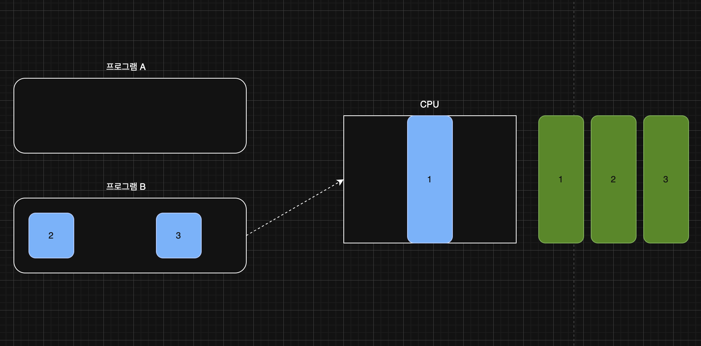
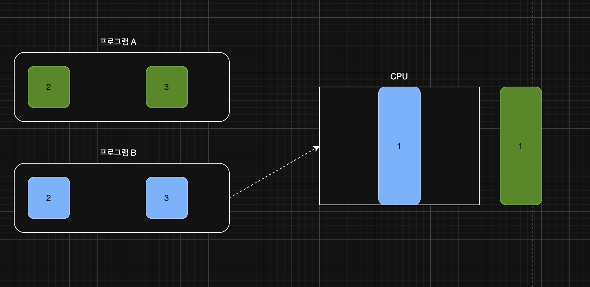
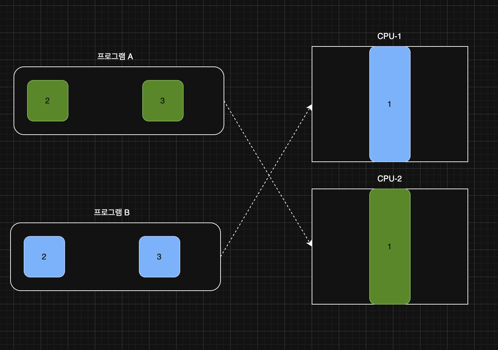
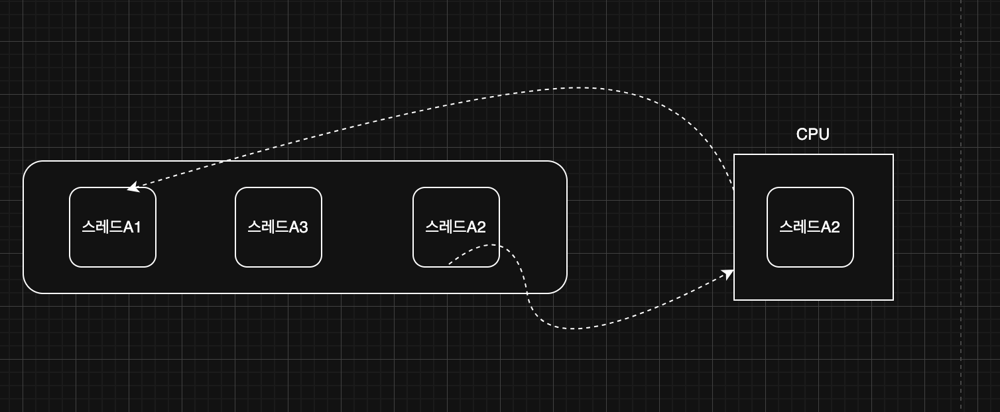
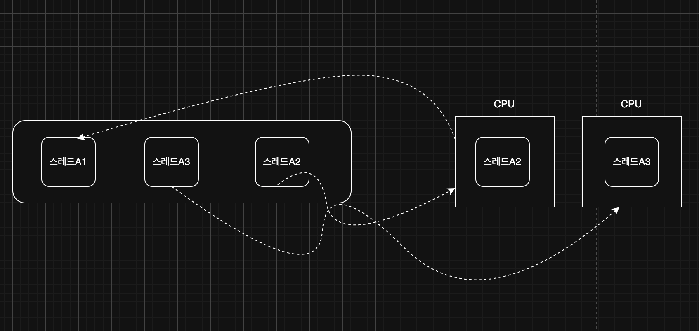

> 해당 블로그 글은 [영한님의 인프런 강의](https://inf.run/6oSgn)를 바탕으로 쓰여진 글입니다.

## 멀티 태스킹과 멀티 프로세싱

멀티스레드에 대해 자세히 이해할려면 기본적인 운영체제 지식들이 필요하다. 해당 지식들을 먼저 간략히 학습 후에 멀티스레드에 대해 공부하면 더욱 이해하기 쉬울 것이다.

### 단일 프로그램 실행

프로그램을 설치한다고 해서 실행이 되는 것은 아니다. 엑셀이라는 프로그램을 설치했다고 해서 엑셀을 사용할 수 있는 것은 아닌 것처럼 말이다. 프로그램을 실행하면 설치된 실행파일을 더블클릭하여 실행을 시켜야 한다. 일단 현재 이 개념을 아는 상태로 '단일 프로그램 실행'에 대해 알아보자.

만약 위와 같이 프로그램A와 프로그램B를 동시에 실행한다고 해보자. 하자만 CPU는 코어가 1개이기 때문에 한번에 하나의 프로그램밖에 실행을 할 수 없다고 해보자. 그러면 CPU는 프로그램A를 먼저 다 실행한 후에 프로그램B를 실행할 것이다. 이러면 사용자 입장에서 매우 답답할 것이다. 예를 들어, 엑셀작업을 하면서 음악 프로그램을 듣는다고 해보자. 프로그램A가 엑셀이고 프로그램B가 음악 프로그램이라고 했을 때 이런 환경이라면 엑셀작업을 마칠때까지 음악은 못들을 것이다. 실제로 초창기의 컴퓨터는 이 처럼 한 번에 하나의 프로그램만 실행했다. 이를 해결하기 위해 하나의 CPU 코어로 여러 프로그램을 동시에 실행하는 '멀티태스킹' 기술이 등장했다.

> ✅ 참고
>
> 프로그램의 실행이란 프로그램을 구성하는 코드를 순서대로 CPU에서 연산(실행)하는 일이다.

### 멀티 태스킹

현대의 CPU는 초당 수십억 번 이상의 연산을 수행한다. 즉, 엄청 빠른 속도로 연산을 실행한다. 이것을 만약 프로그램을 번갈아 가면서 실행할 수 있다면 어떻게 될까? 사용자 입장에서는 두개의 프로그램이 동시에 실행된다고 착각을 할 것이다. 즉, 프로그램A를 0.0001초 실행했다가 프로그램B를 0.0001초 실행했다가 이 과정을 반복하는 것이다. 이렇게 각 프로그램의 실행 시간을 분할해서 마치 동시에 실행되는 것 처럼 하는 기법을 시분할 기법이라 한다. 이런 방식을 사용하면 CPU 코어가 하나만 있어도 여러 프로그램이 동시에 실행되는 것 처럼 느낄 수 있다. 이렇게 하나의 컴퓨터 시스템이 동시에 여러 작업을 수행하는 능력을 멀티태스킹이라 한다.

> ✅ 참고
>
> CPU에 어떤 프로그램이 얼마만큼 실행될지는 운영체제가 결정하는데 이것을 스케줄링이라 한다. 이때 단순히 시간으로만 작업을 분할하지는 않고, CPU를 최대한 활용할 수 있는 다양한 우선순위와 최적화 기법을 사용한다. 우리는 운영체제가 스케줄링을 수행하고, CPU를 최대한 사용하면서 작업이 골고루 수행될 수 있게 최적화한다는 정도로 이해하면 충분하다. 자세한 내용은 추후 운영체제 포스팅에서 다루겠다.

### 멀티 프로세싱

사실 현재 컴퓨터에서 CPU 코어는 1개가 아니다. 현대 CPU는 코어가 여러개이다. 둘 이상의 코어를 사용하여 여러 작업을 동시에 처리하는 기술을 의미한다. 멀티프로세싱 시스템은 하나의 CPU 코어만을 사용하는 시스템보다 동시에 더 많은 작업을 처리할 수 있다. 즉, 멀티 태스킹은 동시에 처리한다 착각을 일으키는 것이라면 멀티 프로세싱은 실제 동시에 처리할 수 있는 것이다.

### 멀티 태스킹 vs 멀티 프로세싱

멀티프로세싱은 하드웨어 장비의 관점이고, 멀티태스킹은 운영체제 소프트웨어의 관점이다.

- 멀티 프로세싱
    - 여러 CPU를 사용하여 동시에 여러 작업을 수행하는 것을 의미한다.
    - 하드웨어 기반으로 성능을 향상시킨다.
- 멀티 태스킹
    - 단일 CPU가 여러 작업을 동시에 수행하는 것처럼 보이게 하는 것을 의미한다.
    - 소프트웨어 기반으로 CPU 시간을 분할하여 각 작업에 할당한다.

현대 컴퓨터는 멀티 프로세싱 기술과 멀티 태스킹 기술을 같이 사용하고 있다.

> ✅ 참고
>
> CPU 안에는 실제 연산을 처리할 수 있는 코어라는 것이 있다. 과거에는 하나의 CPU 안에 보통 하나의 코어만 들어있었다. 그래서 CPU와 코어를 따로 분리해서 이야기하지 않았다. 최근에는 하나의 CPU 안에 보통 2개 이상의 코어가 들어있다.

## 프로세스와 스레드

### 프로세스

우리는 엑셀이라는 프로그램을 설치했다고 해서 그것을 '프로그램을 실행했다'라고 표현하지 않는다. 설치한 프로그램을 실행하였을 때 해당 프로그램이 메모리에 올라왔을 때 그것을 비로소 '프로그램을 실행했다'라고 표현한다. 이렇게 실행한 프로그램을 개발 전문 용어로 **프로세스**라고 표현한다. 이렇게 운영체제 안에서 **실행중인 프로그램을 프로세스**라 한다.

조금 비유적인 표현을 들어보자. 운영체제가 하나의 국가라고 가정하자. 국가에서 살기 위해서는 주거공간이 필요하다. 이 주거 공간은 건설업체나 혹은 내가 직접 설계하여 집을 만든다. 이런 집을 바로 프로세스로 비유할 수 있을 것이다. 

프로세스는 실행 중인 프로그램의 인스턴스이다. 각 프로세스는 독립적인 메모리 공간을 갖고 있으며, 운영체제에서 별도의 작업 단위로 분리해서 관리된다. 각 프로세스는 별도의 메모리 공간을 갖고 있기 때문에 서로 간섭하지 않는다. 그리고 프로세스가 서로의 메모리에 직접 접근할 수 없다. 프로세스는 이렇듯 서로 격리되어 관리되기 때문에, 하나의 프로세스가 충돌해도 다른 프로세스에는 영향을 미치지 않는다. 쉽게 이야기해서 특정 프로세스(프로그램)에 심각한 문제가 발생하면 해당 프로세스만 종료되고, 다른 프로세스에 영향을 주지 않는다.

비유적으로 표현하자면 어느 집이 다른 집을 침법해서 건설하면 안된다. 이것은 바로 우리 대한민국 정부가 이런 행위를 헌법이라는 것에 명시하였다. 만약 그래도 다른 집을 침범해서 건설하면 이것은 엄밀히 주거 침입죄로 국가가 못하게 막는다. 이와 마찬가지로 운영체제가 이런 행위 자체를 막아준다. 만약 그래도 어떤 프로세스가 운영체제의 메모리 영역을 침법하게 된다면 블루스크린등 오류를 발생시키는 것이다. 이것은 어느 가구가 청와대의 영역을 침범해서 짓는것과 같은 행위이다.

#### 프로세스의 메모리 구성

- 코드 섹션: 실행할 프로그램의 코드가 저장되는 부분
- 데이터 섹션: 전역 변수 및 정적 변수가 저장되는 부분
- 힙: 동적으로 할당되는 메모리 영역
- 스택: 메서드(함수) 호출 시 생성되는 지역 변수와 반환 주소가 저장되는 영역(스레드에 포함)

### 스레드

프로세스는 하나 이상의 스레드를 반드시 포함한다. 스레드는 프로세스 내에서 실행되는 작업의 단위이다. 한 프로세스 내에서 여러 스레드가 존재할 수 있으며, 이들은 프로세스가 제공하는 동일한 메모리 공간을 공유한다. 스레드는 프로세스보다 단순하므로 생성 및 관리가 단순하고 가볍다.

비유적으로 표현하면 아까 프로세스를 주거공간이라고 비유했다면 스레드는 그 주거공간에 살아가는 대한민국 국민이다. 하나의 주거공간에는 반드시 한 국민이 살아가야 한다. 물론 한명의 국민이 아니라 여러명의 국민이 살아갈 수 있는 것이다.

#### 메모리 구성

- 공유 메모리: 같은 프로세스의 코드 섹션, 데이터 섹션, 힙은 프로세스 안의 모든 스레드가 공유한다.
- 개별 스택: 각 스레드는 자신의 스택을 갖고 있다.

비유적으로 표현하자면 한 주거공간에 살아가는 국민은 각자 자신의 방이 존재한다. 각자 자신의 방을 스택이라고 비유할 수 있을 것이다. 또한 하나의 주거공간에 살아가는 여러 국민이 공유하는 공간들이 있다. 부엌이나 화장실, 거실등이 있을 것이다. 이런 공간들을 우리는 각각 코드 섹션, 데이터 섹션, 힙 영역이라고 명칭할 수 있다.

#### 프로그램이 실행된다는 것은 어떤 의미일까?

프로그램을 실행하면 운영체제는 먼저 디스크에 있는 파일 덩어리인 프로그램을 메모리로 불러오면서 프로세스를 만든다. 그럼 만들어진 프로세스를 어떻게 실행할까? 프로그램이 만약 자바 어플리케이션 프로그램이라면 프로그램이 실행된다는 것은 사실 프로세스 안에 있는 코드가 한 줄씩 실행되는 것이다. 코드는 보통 `main()` 부터 시작해서 하나씩 순서대로 내려가면서 실행된다. 즉, 무언가가 이 코드들을 한줄씩 내려가면서 실행해주는 것이다. 이것이 바로 **스레드**이다.

스레드의 종류에는 2가지가 존재한다.

- 단일 스레드: 한 프로세스 내에 하나의 스레드만 존재
- 멀티 스레드: 한 프로세스 내에 여러 스레드가 존재

하나의 프로세스 안에는 최소 하나의 스레드가 존재한다. 그래야 프로그램이 실행될 수 있다. 이게 이해가 안된다면 아까 비유를 든 하나의 주거공간에 하나의 국민이 반드시 살아가야 한다라고 생각하자.

### 멀티 스레드가 필요한 이유

하나의 프로그램도 그 안에서 동시에 여러 작업이 필요하다. 예를들어, 카카오톡으로 친구와 채팅을 한다고 해보자. 친구가 채팅을 쳐서 받는 메세지 기능과 내가 채팅을 쳐서 전송하는 기능, 채팅을 치는 동안 맞춤법 검사 기능등이 존재한다. 이런것을 한번에 실행하기 때문에 멀티 스레드는 반드시 필요하다. 만약 카카오톡이 단일 스레드로 실행했다면 엄청 답답해 바로 탈퇴를 했을 것이다.

좀 더 비유적인 표현을 해보자. 하나의 주거공간에 1명의 국민이 살아갈 수 있다. 하지만 혼자 살면 외롭고 내가 해야할 집안 일들이 많아진다. 이에 여러 국민들이 필요하고 그 국민들이 내가 해야하는 집안 일을 분담할 수 있는 것이다. 우리는 이런 것을 가족 혹은 다가구라고 부르고 컴퓨터 용어로 멀티 스레드라고 부른다.

## 스레드와 스케줄링

그럼 지금까지 이야기를 조금 종합해보자. 프로세스안에는 1개 이상의 스레드가 존재하고 운영체제 안에는 여러 프로세스가 존재한다. 그리고 CPU가 이것을 스케줄링 기법과 시분할 기법을 통하여 프로세스 안에 스레드의 태스크를 번걸아가면서 실행을 한다. 즉, 프로세스A안에 스레드A가 있다면 스레드A의 태스크를 실행했다가 다른 프로세스의 스레드A를 실행시킬 수 있고 또 스레드B가 존재한다면 스레드B를 실행시킬 수 있는 것이다.

### 단일 코어 스케줄링

운영체제는 내부에 스케줄링 큐를 가지고 있고, 각각의 스레드는 스케줄링 큐에서 대기한다. 위의 그림처럼 A1을 먼저 실행했다가 일정 시간 이후에 다시 스케줄링 큐 뒤로 보내고 다음 태스크를 CPU가 실행한다. 이런 과정을 반복한다.

### 멀티 코어 스케줄링

CPU 코어가 2개 이상이면 한 번에 더 많은 스레드를 물리적으로 진짜 동시에 실행할 수 있다. 즉, 한번에 2개 스레드씩 실행하다가 시간이 다 되면 다음 스케쥴링 큐의 스레드를 꺼낸다. 이 과정을 반복하는 것이다.

### 프로세스, 스레드, 스케줄링 정리

#### 멀티태스킹과 스케줄링

- 멀티태스킹이란 동시에 여러 작업을 수행하는 것을 말한다. 이를 위해 운영체제는 스케줄링이라는 기법을 사용한다. 스케줄링은 CPU 시간을 여러 작업에 나누어 배분하는 방법이다.

#### 프로세스와 스레드

- 프로세스는 실행 중인 프로그램의 인스턴스이다. 각 프로세스는 독립적인 메모리 공간을 가지며, 운영체제에서 독립된 실행 단위로 취급된다.
- 스레드는 프로세스 내에서 실행되는 작은 단위이다. 여러 스레드는 하나의 프로세스 내에서 자원을 공유하며, 프로세스의 코드, 데이터, 시스템 자원등을 공유한다. 실제로 CPU에 의해 실행되는 단위는 스레드이다.

#### 프로세스의 역할

- 프로세스는 실행 환경을 제공한다. 여기에는 메모리 공간, 파일 핸들, 시스템 자원(네트워크 연결) 등이 포함된다. 이는 프로세스가 컨테이너 역할을 한다는 의미이다.
- 프로세스 자체는 운영체제의 스케줄러에 의해 직접 실행되지 않으며, 프로세스 내의 스레드가 실행된다. 참고로 1개의 프로세스 안에 하나의 스레드만 실행되는 경우도 있고, 1개의 프로세스 안에 여러 스레드가 실행되는 경우도 있다.

## 컨텍스트 스위칭

멀티 태스킹이 반드시 효율적일까? 꼭 그렇지는 않다. 사람에 비유해보자. 우리가 업무를 열심히 하고 있다고 해보자. 그런데 갑자기 기획자가 와서 다른 일을 먼저 해달라고 요청한다. 그러면 처음에는 우리는 흥쾌히 진행한다. 하지만 이런 과정이 계속 반복되다가는 내가 원래하는 업무의 속도가 늦어질 것이고 결국 그 업무에서 내가 무엇을 하려는지 헷갈리기 시작할 것이다.

컴퓨터도 마찬가지다. 하나의 코어에 여러 프로세스가 실행되고 있다고 하자. 그럼 하나의 프로세스의 스레드를 처리하고 있다가 적정 시간이 다 되어서 다른 프로세스의 스레드로 교체하려고 한다. 이 과정은 하나의 문맥이 바뀌는 과정이다. 이것을 전문용어로 **컨텍스트 스위칭**이라고 말한다. 컨텍스트 스위칭 과정에서 이전에 실행 중인 값을 메모리에 잠깐 저장하고, 이후에 다시 실행하는 시점에 저장한 값을 CPU에 다시 불러와야 한다. 결과적으로 컨텍스트 스위칭 과정에는 약간의 비용이 발생한다.

예시를 들어보자. 만약 1부터 100만까지 더하는 과정이 있다고 해보자. 만약 CPU 코어가 2개이면 1부터 50만까지 하나의 코어가 진행하고 50만 1부터 100만까지 또 하나의 코어가 진행한다고 해보자. 그러면 두개의 작업을 병렬적으로 진행이 가능하니 엄청 빠를 것이다. 그런데 만약 코어가 1개인데 굳이 스레드를 2개 만들어서 한다면 컨텍스트 스위칭 비용이 발생할 것이고 오히려 단일 스레드로 돌리는 것보다 성능이 더 안 나올 수 있다. 그래서 스레드는 코어수를 생각해서 적절하게 생성해야 한다.

### 실무 이야기

#### CPU 4개, 스레드 2개

스레드의 숫자가 너무 적으면 모든 CPU를 100% 다 활용할 수 없지만, 스레드가 몇 개 없으므로 컨텍스트 스위칭 비용이 줄어든다.

#### CPU 4개, 스레드 100개

스레드의 숫자가 너무 많으면 CPU를 100% 다 활용할 수 있지만 컨텍스트 스위칭 비용이 늘어난다.

#### CPU 4개, 스레드 4개

스레드의 숫자를 CPU의 숫자에 맞춘다면 CPU를 100% 활용할 수 있고, 컨텍스트 스위칭 비용도 자주 발생하지 않기 때문에 최적의 상태가 된다. 이상적으로는 CPU 코어 수 + 1개 정도로 스레드를 맞추면 특정 스레드가 잠시 대기할 때 남은 스레드를 활용할 수 있다.

#### CPU 바운드 작업 vs I/O 바운드 작업

- CPU 바운드 작업
    - CPU의 연산 능력을 많이 요구하는 작업을 의미한다.
    - 이러한 작업은 주로 계산, 데이터 처리, 알고리즘 실행 등 CPU의 처리 속도가 작업 완료 시간을 결정하는 경우다.
    - 예시: 복잡한 수학 연산, 데이터 분석, 비디오 인코딩, 과학적 시뮬레이션 등
- I/O 바운드 작업
    - 디스크, 네트워크, 파일 시스템 등과 같은 입출력(I/O) 작업을 많이 요구하는 작업을 의미한다.
    - 이러한 작업은 I/O 작업이 완료될 때까지 대기 시간이 많이 발생하며, CPU는 상대적으로 유휴(대기) 상태에 있는 경우가 많다. 쉽게 이야기해서 스레드가 CPU를 사용하지 않고 I/O 작업이 완료될 때 까지 대기한다.
    - 예시: 데이터베이스 쿼리 처리, 파일 읽기/쓰기, 네트워크 통신, 사용자 입력 처리 등

#### 웹 어플리케이션 서버

웹 백엔드 개발을 하다 보면 스레드 풀(thread pool) 설정을 어떻게 해야 할지 고민하게 된다. 흔히 “CPU 코어가 8개니까 스레드도 8개만 쓰자”라고 간단히 결정하지만, 실제 서비스에서는 이 방식이 오히려 병목을 초래할 수 있다. 이미지 처리 서버를 예시로, 왜 I/O-바운드 작업이 많고 어떻게 최적의 스레드 수를 찾아야 하는지 살펴보겠다.

우리가 운영하는 서비스에 수많은 사용자가 프로필 사진을 올린다고 해보자. 사용자가 이미지를 업로드하면, 서버는 S3나 네트워크 스토리지에 저장해야 한다. 또한 다른 사용자가 그 이미지를 조회하면, 다시 외부 스토리지에서 다운로드해 응답한다. 이때 CPU는 단순히 파일 전송을 위한 직렬화/역직렬화 정도만 수행하고, 실제로는 네트워크 응답을 기다리는 시간이 훨씬 길다. 즉, 스레드는 “대기” 상태로 머무르는 시간이 많아 I/O-바운드 작업이라고 한다.

반면 CPU-바운드는 암호화, 이미지 리사이징 같은 고연산 작업이 대표적이다. 사용자가 올린 이미지를 AI로 실시간 보정하거나, 동영상 트랜스코딩을 수행할 때 이 경우엔 스레드 하나가 CPU를 80~100%까지 점유하며 작업을 수행한다.

그러면 코어 수와 스레드 수를 일치시켜야 할까? 여기에는 함정이 존재한다. 만약에 CPU 4코어 서버에서 스레드 풀을 4로 고정한다고 해보자. I/O-바운드 이미지 조회 요청 4건 동시 처리를 하면 각 스레드는 네트워크 응답 대기에 머물며 CPU는 겨우 4%만 사용한다. 결과적으로 동시 처리 용량은 4건으로 제한되고, CPU는 대부분 유휴 상태가 됩니다. 그런데 여기서 사람들은 서버 하드웨어쪽이 문제라고 스케일업을 진행하는데 스케일업을 해도 효과는 똑같다는 것을 이러한 이유때문이다.

동일 서버에서 스레드를 100개로 확대한다고 해보자. 각 스레드가 실제 CPU는 1%만 소모되고 나머지는 I/O 대기한다. 즉, 총 동시 처리량 100건으로 증가하게 된다. CPU 사용률은 여전히 100%×1% = 1% 수준으로 여유가 남는다.

#### 최적화

그러면 무작정 스레드를 많이 늘리기에는 메모리상 문제가 될 수 있다. 또한 놀고 있는 스레드도 많을 수 있다. 그래서 적절한 스레드 수를 찾는 것이 관건이다. 그러면 어떻게 적절한 스레드 수를 찾을까? 아래와 같이 부하테스트나 성능테스트를 통하여 적절한 개수를 찾으면 될 것이다.

- 부하 시나리오 설계: 실제 트래픽 패턴에 맞춘 테스트 케이스를 준비
- 성능 테스트 도구 활용: JMeter, Gatling 등으로 스레드 풀별 처리량·응답 시간을 측정
- 모니터링 기반 조정: CPU, GC, 네트워크 대기 시간 등을 동시에 관찰하며 스레드 수 조정
- 커넥션 풀·타임아웃 설정: 데이터베이스 커넥션 풀 크기, 타임아웃 값도 함께 튜닝

> 잘못된 지식이 있을 경우 댓글로 남겨주시면 빠르게 반영하겠습니다!