> 해당 블로그 글은 [영한님의 인프런 강의](https://inf.run/WUc1V)를 바탕으로 쓰여진 글입니다.

## 프로젝트 생성

그러면 먼저 스프링 부트 프로젝트를 만들고 실행까지 진행해보자. 스프링 부트 프로젝트를 생성하는 방법으로는 2가지가 존재한다.

### start.spring.io

[start.spring.io](https://start.spring.io/)에 접속한 다음 아래와 같이 세팅을 진행한다.

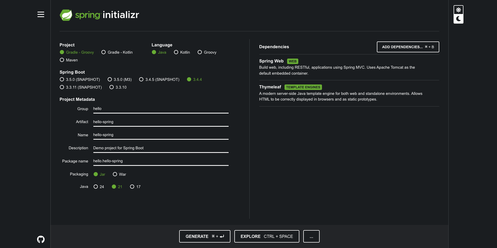

이후 하단의 GENERATE 버튼을 클릭하면 압축파일이 다운로드 받아지는데 해당 압축파일을 해제하고 인텔리제이에서 import를 진행해주면 된다. import하는 방법은 [자바 입문 포스팅](https://sungbin.kr/Hello-World/)을 참조바란다.

### 인텔리제이

인텔리제이 상용버전을 사용한다면 인텔리제이 자체 내에서 생성이 가능하다. 인텔리제이를 실행하고 나서 New Project를 클릭 후, 아래와 같이 세팅을 진행한다.

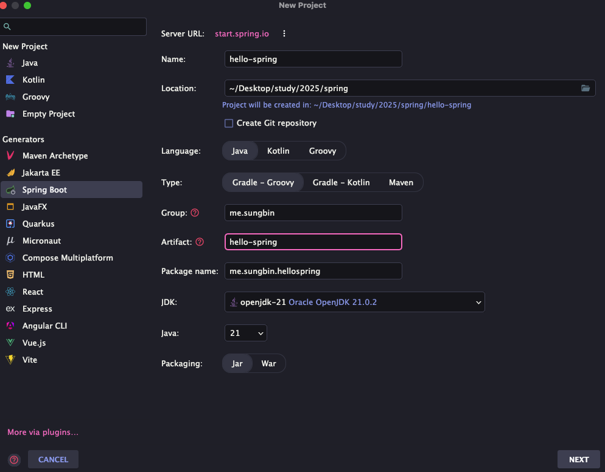

이후 NEXT를 클릭하고 나서 의존성을 아래와 같이 검색해서 추가해준다.

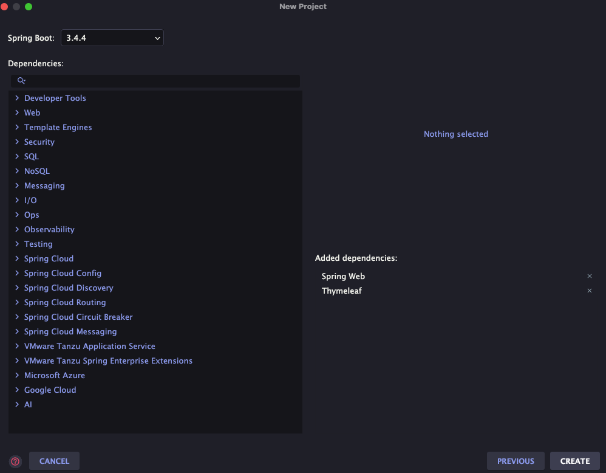

### 의존성 잠깐 알아보기

- Spring Web: 스프링 웹 서버를 띄우주게 하는 역할을 한다.

- Thymeleaf: html과 자바를 연동시켜서 동적으로 화면을 보여주게끔 하는 템플릿 엔진 역할을 한다.

> ⚠️ 주의
>
> 스프링 부트 프로젝트를 생성하기 전에 **반드시** JDK가 설치되어 있어야 한다.

> ✅ 참고
>
> 빌드 툴을 설정 할 때, gradle-groovy, gradle-kotlin, maven 3개 선택하는게 있다. 일단 필자는 gradle로 진행하였다. 왜냐하면 maven은 흔히 레거시 프로젝트에서 많이 사용했고 gradle에 비하여 조금 느리기 때문이다.

스프링 부트 프로젝트가 정상적으로 로드가 되면 아래와 같이 프로젝트 구조가 되어 있을 것이다.

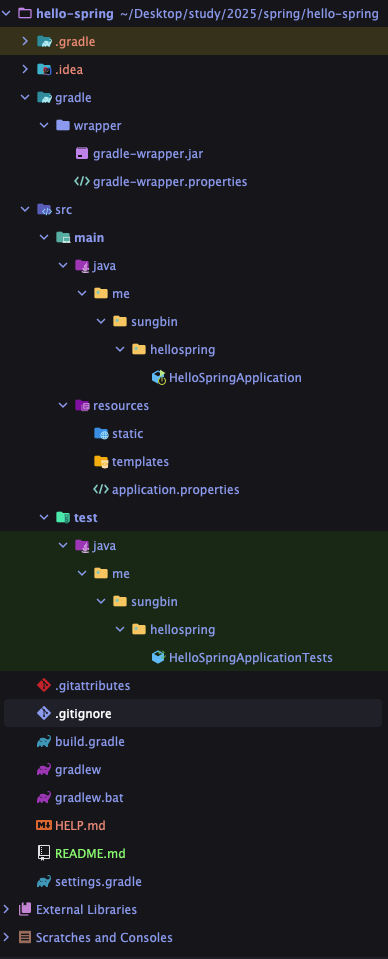

그러면 각각 디렉토리가 무슨 역할을 하는지 하나하나 살펴보자.

- gradle: gradle 관련 정보가 담겨 있다. ex. 버전정보

- src/main/java: 실제 자바로 작성된 코드들이 들어가 있다.

- src/main/resources: 자바 파일 외의 xml이나 html, 각종 설정 파일들이 들어가 있는 곳이다.

- src/test: 테스트 코드가 작성되는 곳이다.

- .gitignore: 버전관리에서 제외시킬 파일이나 디렉토리 명을 기재한다.

- build.gradle: 제일 중요한 파일이다. 각종 라이브러리, 의존성등 다양한 설정을 하는 곳이다.

- settings.gradle: 프로젝트 이름이 들어가져 있으며 나중에 멀티모듈 프로젝트를 할때 수정이 필요하다.

여기서 가장 중요한 build.gradle을 자세히 살펴보자.

``` groovy
plugins {
    id 'java'
    id 'org.springframework.boot' version '3.4.4'
    id 'io.spring.dependency-management' version '1.1.7'
}

group = 'me.sungbin'
version = '0.0.1-SNAPSHOT'

java {
    toolchain {
        languageVersion = JavaLanguageVersion.of(21)
    }
}

repositories {
    mavenCentral()
}

dependencies {
    implementation 'org.springframework.boot:spring-boot-starter-thymeleaf'
    implementation 'org.springframework.boot:spring-boot-starter-web'
    testImplementation 'org.springframework.boot:spring-boot-starter-test'
    testRuntimeOnly 'org.junit.platform:junit-platform-launcher'
}

tasks.named('test') {
    useJUnitPlatform()
}
```

`plugins`는 각 종 플러그인의 id값을 통해 일종의 플러그인을 불러오는 역할을 한다. group은 프로젝트 생성 시, 우리가 작성했던 값이 있고 version은 자동으로 생성해주었다. `java`는 플러그인 java를 활용하여 언어 버전 정보를 표시해주었다. `repositories`는 라이브러리나 프레임워크를 불러올 때 저장소를 명시하는 역할을 하며 현재는 `mavenCentral()`을 이용한다. `dependencies`는 라이브러리들을 명시하는 곳이다. `tasks.named`는 기존에 존재하는 test 태스크를 명시하여 클로져에 구현을 해두었다.

그럼 이제 스프링 부트 프로젝트를 실행하면 아래와 같이 정상적으로 톰캣이 가동이 될 것이다.

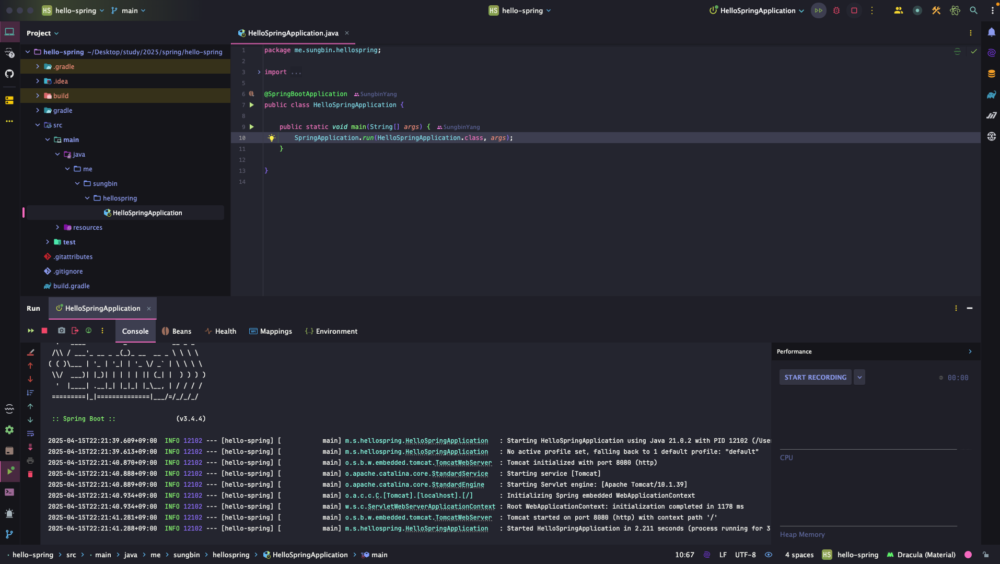

> ✅ 참고
>
> 스프링 부트는 톰캣과 같은 웹 서버를 내장하고 있다.

그리고 웹 브라우저에 `localhost:8080`을 입력하면 아래와 같이 스프링 부트가 자동으로 만든 에러페이지를 볼 수 있을 것이다.


### 꿀팁

최근 IntelliJ 버전은 Gradle을 통해서 실행 하는 것이 기본 설정이다. 이렇게 하면 실행속도가 느리다. 다음과 같이 변경하면 자바로 바로 실행해서 실행속도가 더 빠르다.

- `Preferences` -> `Build, Execution, Deployment` -> `Build Tools Gradle`
- Build and run using: Gradle -> IntelliJ IDEA
- Run tests using: Gradle -> IntelliJ IDEA

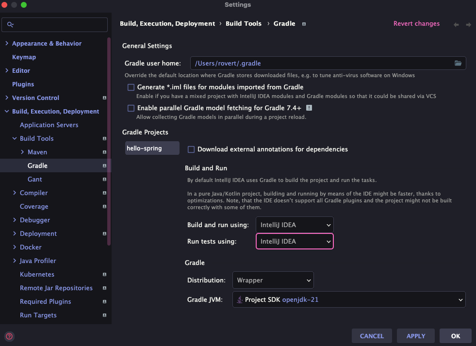

### JDK 설치 확인

정상적으로 해당 프로젝트가 JDK를 제대로 인식하고 있는지를 확인할 수 있는 곳이 있다. 맥 기준 단축키로 `command + ;`를 입력하면 아래와 같이 화면이 나오는데 설치한 JDK가 나오면 제대로 적용이 된 것이다.

또한 현재 스프링 부트는 3.4버전이므로 JDK17이상이 반드시 필수이다. 이하 버전일 경우 에러가 발생하니 유의 바란다.

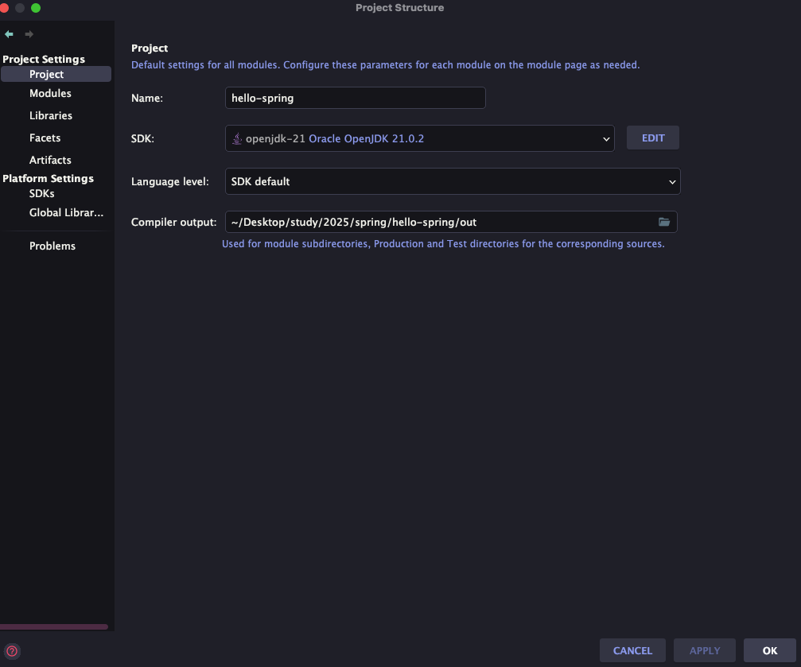

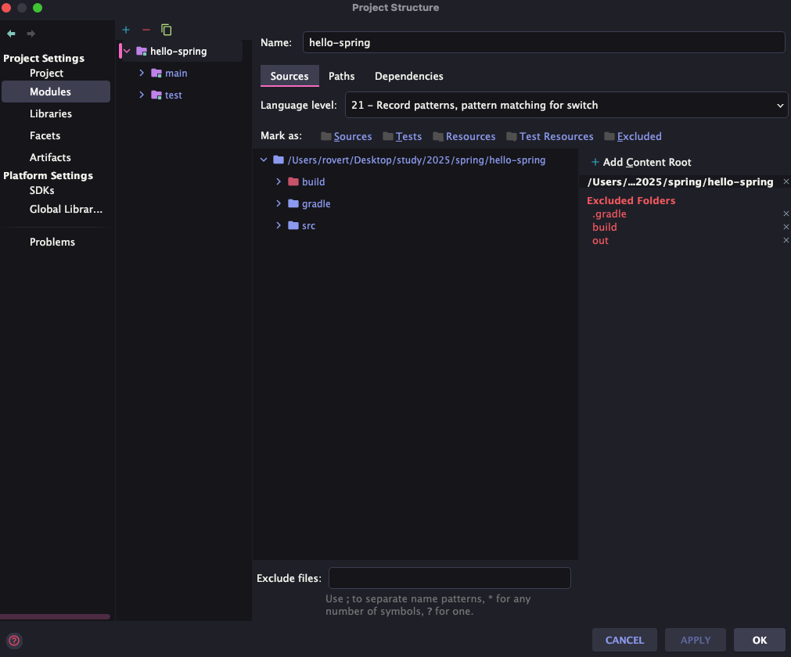

## 라이브러리 살펴보기

gradle같은 빌드 툴을 사용하면 의존관계를 관리해준다. 즉, 필요한 의존성이 있는 경우 알아서 땡겨온다. 그래서 우리는 이전에 2가지 라이브러리만 추가 했지만 실제는 아래처럼 수 많은 라이브러리들이 받아와진다.

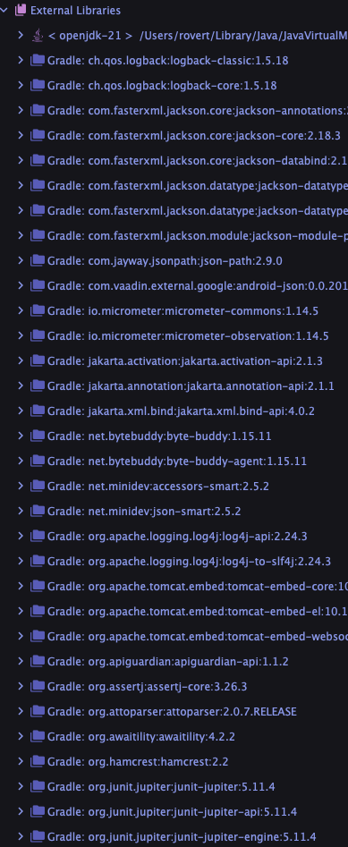

그러면 핵심적인 라이브러리 구조에 대해 살펴보자.

### 스프링 부트 라이브러리

- spring-boot-starter-web
    - spring-boot-starter-tomcat: 톰캣 (웹서버)
    - spring-webmvc: 스프링 웹 MVC
- spring-boot-starter-thymeleaf: 타임리프 템플릿 엔진(View)
- spring-boot-starter(공통): 스프링 부트 + 스프링 코어 + 로깅
    - spring-boot
        - spring-core
    - spring-boot-starter-logging
        - logback, slf4j(로깅 라이브러리, slf4j는 인터페이스라 생각, logback이 구현체)

> 📚 꿀팁
>
> 실제 실무에서는 `System.out.println()`을 사용하지 않는다. 대신에 로깅 라이브러리를 이용한다. 왜냐하면 실제 여러가지 기능도 있고 나중에 한데 모아서 보기 좋기 때문이다. 로깅 라이브러리들은 여러가지가 존재하지만 그중에 slf4j-logback 조합을 많이 이용한다. 왜냐하면 성능도 더 좋고 기능도 다양하기 때문이다.

## View 환경설정

### 웰컴 페이지 만들기

스프링 부트에서는 웰컴 페이지 기능을 제공한다. `resources/static` 디렉토리에 `index.html`을 만들어서 넣어주면 해당 html파일이 웰컴 페이지로 등록이 된다.

하지만 해당 페이지는 너무 정적인 페이지이다. 동적인 페이지를 만들고 싶을 때는 어떻게 할까? 그럴때 `Thymeleaf`를 이용하는 것이다. 그러면 예시코드를 작성해보자. 우리는 `/hello`라는 url에 동적인 페이지를 만들 것이다. 그려먼 먼저 url 매핑을 해줘야 한다. 컨트롤러 클래스를 만들어서 매핑하자.

``` java
package me.sungbin.hellospring.controller;

import org.springframework.stereotype.Controller;
import org.springframework.ui.Model;
import org.springframework.web.bind.annotation.GetMapping;

@Controller
public class HelloController {

    @GetMapping("/hello")
    public String hello(Model model) {
        model.addAttribute("data", "hello!!");

        return "hello";
    }
}
```

그리고 `resources/templates` 디렉토리 하위에 컨트롤러에 반환한 문자열 이름의 html파일을 넣어준다. 지금 예시는 hello이니 hello.html을 아래와 같이 작성한다.

``` html
<!DOCTYPE html>
<html lang="ko" xmlns:th="http://www.thymeleaf.org">
<head>
  <meta charset="UTF-8">
  <title>Hello</title>
</head>
<body>
<p th:text="'안녕하세요. ' + ${data}">안녕하세요. 손님</p>
</body>
</html>
```

일반 html과 살짝 다른 점은 `xmlns:th`라는 타임리프 문법을 적용한걸 볼 수 있다. 그리고 `th:text`를 통하여 동적 텍스트를 받을 수 있다는 것을 알 수 있었다.

> ✅ 참고
>
> 위의 코드에서 data란 컨트롤러에 model에서 addAttribute를 할 때 key값을 뜻한다.

### 동작 환경

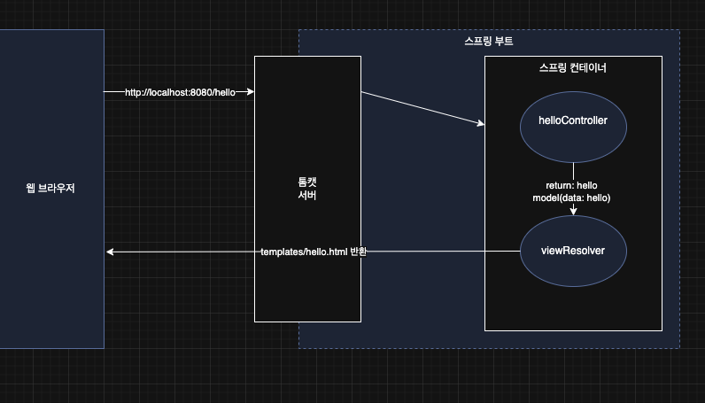

웹 브라우저에 url을 입력을 한다. 그러면 해당 url이 톰캣 웹 서버에 도착을 하고 스프링 컨테이너로 전달해준다. 해당 전달해준 url에 매핑되는 컨트롤러를 찾는다. 그리고 스프링 컨테이너에서 만들어주는 `Model` 객체를 통하여 data를 넣어주고 문자열 리턴을 한다. 그러면 viewResolver를 통하여 html파일을 반환해준다.

> ✅ 참고
>
> `spring-boot-devtools` 라이브러리를 추가하면, `html` 파일을 컴파일만 해주면 서버 재시작 없이 View 파일 변경이 가능하다.
>
> 인텔리J 컴파일 방법: 메뉴 build Recompile

## 빌드하고 실행하기

터미널이나 콘솔창으로 이동하여 아래와 같이 빌드를 진행할 수 있다.

1. `./gradlew clean build`

2. `cd build/libs`

3. `java -jar hello-spring-0.0.1-SNAPSHOT.jar`

그러면 아래와 같이 정상 실행 되는 것을 볼 수 있다.

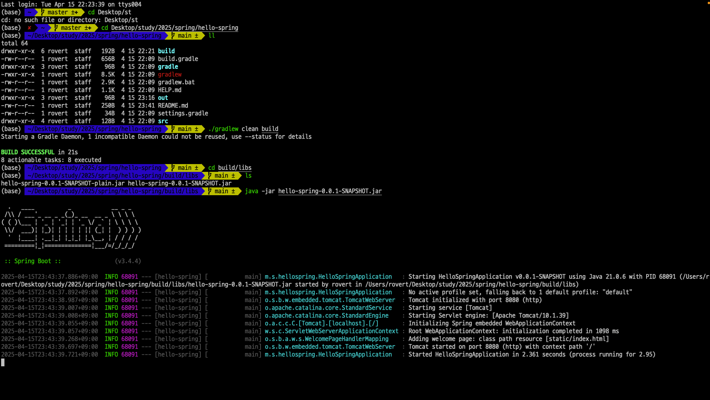

> 잘못된 지식이 있을 경우 댓글로 남겨주시면 빠르게 반영하겠습니다!