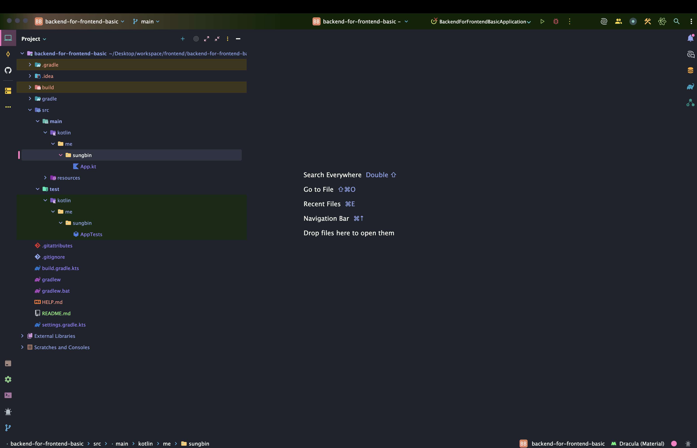
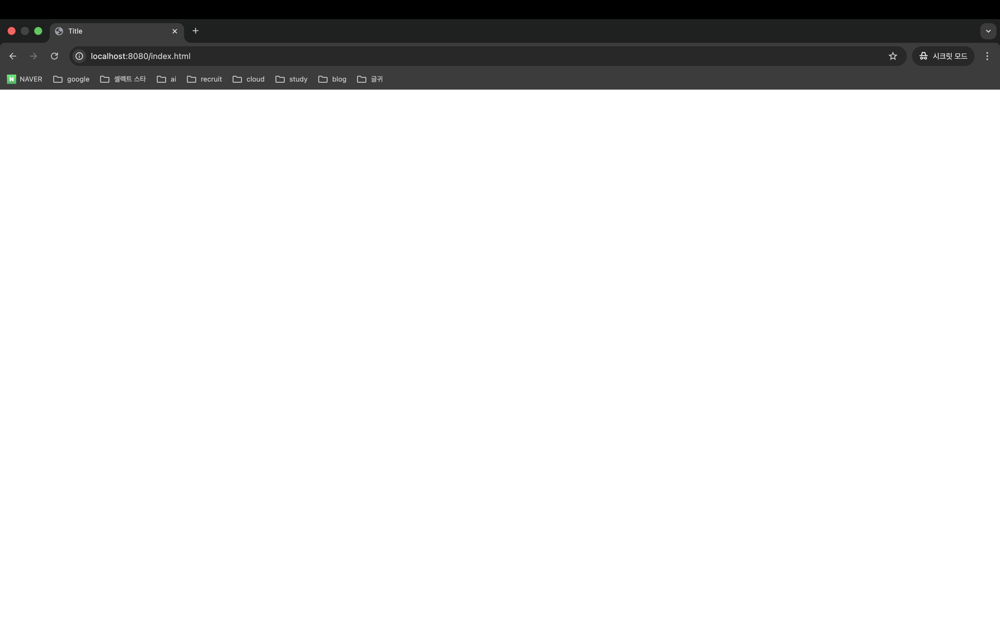

> 해당 포스팅은 인프런의 [백엔드 개발자에 의한, 백엔드 개발자들을 위한 프론트엔드 강의 - 기본편](https://inf.run/DQ8mU)를 참조하여 만들었습니다.


## 백엔드와 프론트엔드

### 여러분이 만든 API 서버는 어느 곳에 위치해 있는가?

그럼 지금부터 프론트엔드에 대해 살펴보자. 바로 프론트엔드 코드를 살펴볼 것은 아니고 백엔드와 프론트엔드의 관계를 중심으로 어떻게 프론트엔드를 학습해야 할지를 살펴보자. 그러면 우리가 만든 API 서버가 어디에 위치해 있는지부터 알아보자. 보통 우리가 만든 API 서버는 웹 브라우저와 스마트폰 사이 뒷단에 걸쳐져 있을 것이다.

웹 브라우저를 이용해서 웹 서비스를 사용하는 사용자는 먼저 HTML, CSS, Javascript가 포함된 웹 페이지를 다운 받는다. 보통 전문 용어로 렌더링한다라고도 말한다. 그리고 렌더링 받은 웹 페이지에 포함된 Javascript에 따라 API 서버를 호출하여 그 결과를 받아오는 형태이다. 따라서 정확히는 프론트엔드 페이지에서 API 서버를 호출하고 있다기 보다는 프론트엔드 페이지를 로딩한 웹 브라우저가 API 서버를 호출하고 있는 것이다. 물론 스마트폰을 사용하는 경우도 이와 유사할 것이다.

결국, 우리가 만든 API 서버는 크게 2가지 사용자가 존재하는 것이다. 바로 웹 브라우저와 스마트폰 앱이다. 이 둘은 모두 HTTP라는 프로토콜을 통해 API 서버와 통신하게 된다. 동일한 프로토콜을 쓰고 화면에 동일한 데이터를 보여주기 때문에 두 클라이언트가 오직 하나의 API만으로도 서비스가 될 수 있는 것이다. 이 둘다 종종 프론트엔드라고도 부르기도 하지만 통상 프론트엔드라고 말하면 웹 브라우저를 통해서 API 서버와 통신 하는 부분을 이야기 한다.

### 웹 브라우저의 프론트엔드

웹 브라우저의 프론트엔드는 크게 2가지로 나뉠 수 있다. 프론트엔드 프레임워크를 사용하지 않는 순수한 HTML, CSS, Javascript로 개발하는 방법이 존재하고, 다른 하나는 프론트엔드 프레임워크를 사용하는 방법이 존재한다. 해당 시리즈에서는 순수한 HTML, CSS, Javascript를 사용하여 프론트엔드를 개발하는 방법에 대해 알아보도록 하려고 한다.

### 스마트폰의 프론트엔드

스마트폰 앱쪽에서의 프론트엔드는 복잡하다. 여기서 네이티브 앱을 제외하면 나머지(웹 뷰, 하이브리드 앱, React Native)는 프론트엔드 영역이라고 부른다. 왜냐하면 웹 뷰, 하이브리드 앱, React Native는 HTML, CSS, Javascript를 다루던 개발자들이 동일한 언어로 개발할 수 있기 때문이다.

## Thymeleaf vs HTML + RestController

그럼 지금부터 Thymeleaf로 개발하는 방식이 좋을 지 혹은 HTML를 따로 만들고 RestController를 통해 서버 개발을 하면 좋을지 알아보도록 하겠다.

이전에 우리는 하나의 API 서버로 웹 브라우저, 스마트폰등 클라이언트 요청을 처리할 수 있다라고 배웠다. 왜냐하면 프론트와 서버간 데이터만 주고받기 때문이다. 보통은 JSON이라고 부르는 형식의 데이터를 주고 받는 것이다. 우리가 만약 백엔드 API 서버를 한번이라도 만들어보았다면 JSON이 뭔지 알 것이다. 그래서 여기서 설명은 생략은 하는데 만약 모르시다면 AI Agent나 구글링을 해보면 좋을 것이다.

아무튼 일반적으로 웹 브라우저에서 HTML, CSS, Javascript가 이미 로딩된 상태에서 JSON을 API 서버와 주고 받아서 서비스를 제공하는 형태이다. 그리고 스마트폰 앱도 자체적인 UI를 가지고 있고 JSON만을 API와 주고 받아서 서비스를 제공하면 된다. API 서버는 웨 브라우저, 스마트폰이 모두 사용할 수 있도록 공통된 인터페이스를 가지고 있는 꼴이다. 하지만 프론트엔드와 백엔드가 이런 모습의 구조를 가지고 있었던 것은 아니다.

### 초창기 웹

짧게 웹이 발전해온 단계를 알아보도록 하자. 초창기 웹은 HTML이라는 문서를 주고 받는 용도였다. 정말 처음에는 웹 브라우저도 없었고 사용자들이 많이 사용하는 구글 크롬도 한참 후에야 만들어졌다. 아무튼 클라이언트가 서버에게 받고 싶은 HTML 문서를 요청하면 서버는 이를 응답해주었던 형태였다.

### 더 나은 사용자 경험을 위해 추가된 CSS, Javascript

그러다가 웹 서비스가 발전하면서 HTML과 함께 CSS, Javascript가 추가되었다. 더 나은 사용자 경험을 위해서 추가되었던 것이다. 여기서 주고 받는 HTML 문서에는 여러분들이 API로 제공해줄 만한 데이터들이 이미 모두 포함되어 있었다. 따라서 새로운 데이터가 포함된 HTML 문서를 제공해주려면 페이지가 새로고침되어야 했다. 하지만 이런 과정은 사용자에게 매우 불편했을 것이다. 이런 불편함으로 인해 Ajax가 추가가 되었다.

### 더 나은 사용자 경럼을 위해 추가된 Ajax

Ajax를 통해 이제 화면을 새로고침하거나 다른 페이지를 전환하지 않고도 서버에서 새로운 데이터를 받아올 수 있게 되었다. 초창기에는 Ajax를 통해 HTML 문서를 통째로 받아와서 활용되기도 했지만 점점 데이터만 주고 받는 형태로 발전해 왔다. 마치 우리가 이전에 살펴본 구조처럼 발전해온 것이다. 

그러면 여기서 Thymeleaf가 무엇인지 알아봐야 한다. Thymeleaf는 마치 Ajax를 사용하지 않았을 때와 비슷한 것이다. 즉, html 문서에 서비스에서 필요한 데이터가 포함된 상태로 클라이언트에게 전달되는 것이다. 간단한 예시를 살펴보자.

``` html
<!DOCTYPE html>
<html lang="ko" xmlns:th="http://www.thymeleaf.org">
<head th:replace="fragments.html :: head"></head>
<body class="bg-light">
    <div th:replace="fragments.html :: main-nav"></div>
    <section class="jumbtron text-center">
        <div class="container">
            <p>
                <a th:href="@{/sign-up}" class="btn btn-primary my-2">회원 가입</a>
            </p>
        </div>
    </section>

    <div class="container">
        <div class="row justify-content-center pt-3">
            <div th:replace="fragments.html :: study-list (studyList = ${studyList})"></div>
        </div>
        <div th:replace="fragments.html :: footer"></div>
    </div>

    <script src="/node_modules/moment/min/moment-with-locales.min.js"></script>
    <script type="application/javascript" th:src="@{/js/eventView.js}"></script>
    <script type="application/javascript" th:src="@{/js/footer.js}"></script>
</body>
</html>
```

위의 코드가 Thymeleaf를 사용한 HTML 문서이고 아래가 위의 Thymeleaf에 변수를 매핑할 수 있는 컨트롤러이다.

``` java
@GetMapping("/")
public String home(@CurrentAccount Account account, Model model) {
    if (account != null) {
        Account accountLoaded = accountRepository.findAccountWithTagsAndZonesById(account.getId());

        model.addAttribute(accountLoaded);
        model.addAttribute("enrollmentList", enrollmentRepository.findByAccountAndAcceptedOrderByEnrolledAtDesc(accountLoaded, true));
        model.addAttribute("studyList", studyRepository.findByAccount(accountLoaded.getTags(), accountLoaded.getZones()));
        model.addAttribute("studyManagerOf", studyRepository.findFirst5ByManagersContainingAndClosedOrderByPublishedDateTimeDesc(account, false));
        model.addAttribute("studyMemberOf", studyRepository.findFirst5ByMembersContainingAndClosedOrderByPublishedDateTimeDesc(account, false));

        return "index-after-login";
    }

    model.addAttribute("studyList", studyRepository.findFirst9ByPublishedAndClosedOrderByPublishedDateTimeDesc(true, false));

    return "index";
}
```

코드를 살펴보면 studyList를 정의한 값을 HTML 문서의 studyList에 매핑된다라고 생각하면 쉬울 것이다. 이게 바로 타임리프를 통해 HTML 문서와 데이터를 서버에 조합하여 클라이언트에게 제공해주는 방식이다. 이런 방식을 서버사이드 템플릿 엔진이라고 부른다. 이런 서버사이드 템플릿 엔진의 장점도 분명히 존재하지만 단점도 분명히 존재한다.

### Thymeleaf를 쓰면 스마트폰 앱은 어디서 데이터를 받아오나?

웹 브라우저는 타임리프로 생성된 HTML 페이지를 받아서 처리를 할 것이다. 그런데 스마트폰은 어떻게 데이터를 받아올까? 만약 API 서버가 있다면 해당 데이터를 API 서버가 받아와서 처리를 할 것이다. 그게 아니라면 HTML 문서에 있는 데이터만을 뽑아서 사용해내면 될 것이다. 하지만 이러한 방식은 매우 불편할 것이다. 일단 첫번째 별도의 API 서버를 두면 관리 포인트가 늘어날 것이고 HTML 문서에 데이터를 파싱하는 작업은 직접 해보시면 알겠지만 상당히 까다로운 작업이다. UI가 살짝만 바껴도 파싱 로직을 바꿔줘야 하기 때문이다. 또한, 프론트엔드가 점점 발전함에 따라 프론트가 백엔드와 강하게 결합하는게 매우 힘들어졌다.

그래서 우리는 HTML을 별도로 만들고 JSON을 주고 받는 방식을 사용해보도록 할 것이다.

## 지향하는 프론트엔드 코드

그러면 이 시리즈에서 지향하는 프론트엔드 코드에 대해서 살펴보도록 할 것이다. 가장 먼저 이야기하고 싶은 내용은 여기서 설명하는 프론트엔드 코드는 클린코드 원칙을 지키지 않는 코드이다. 이 시리즈에서 지향하는 프론트엔드 코드는 우리가 백엔드 API를 활용할 수 있는 코드이다. 지금은 클린코드 원칙을 지킨 프론트엔드 코드보다는 백엔드 개발자가 살펴 볼 프론트엔드 코드이기에 이를 더 포커스를 해서 알아가보도록 하겠다.

프론트엔드를 구성하는 요소로는 HTML, CSS, Javascript가 있지만 그 중에 프론트엔드 기술적 선택 요소는 주로 Javascript를 어떻게 다룰 것인가이다. 프론트엔드 개발자를 나눌 때에도 어떤 자바스크립트 프레임워크를 사용하는가에 따라 나눈다. 그래서 보통 React나 Vue를 사용하지만 여기서는 이런 프레임워크를 사용하지 않고 순수 Javascript를 사용해보도록 하겠다.

## 실습 진행 방법

그러면 앞으로 포스팅을 하면서 실습 환경에 대해 말해보도록 하겠다. 앞으로 백엔드 코드와 프론트엔드 코드 전부 인텔리제이를 통해 진행을 해보려고 한다. 스프링부트 프로젝트에서 정적 파일을 추가해서 프론트 문법을 알아보도록 할 것이다.

> ✅ 참고
>
> 여기서는 어느정도 백엔드 개발은 할 줄 안다는 가정하에 작성한 것이다. 실습 기반은 기본적으로 Spring Boot Project를 세팅하고 진행해야 한다.

그럼 이미 인텔리제이로 Spring Boot Project를 잘 세팅했다면 아래와 같이 나올 것이다.



그러면 해당 구조에 `resources/static`으로 가서 html을 만들고 실습을 해보도록 하자. html 파일명은 `index.html`로 진행한다. 여기서 index.html의 네이밍에는 특별한 기능이 있는데 이것은 다음 포스팅에서 알아보도록 하겠다. 아래와 같이 `index.html`을 작성하고 spring boot application을 실행해보자.

``` html
<!DOCTYPE html>
<html lang="ko">
<head>
    <meta charset="UTF-8">
    <title>Title</title>
</head>
<body>

</body>
</html>
```

그리고 url에 `localhost:8080/index.html`을 입력해보면 아래와 같이 우리가 만든 html 문서가 렌더링 된 것을 확인할 수 있다.

