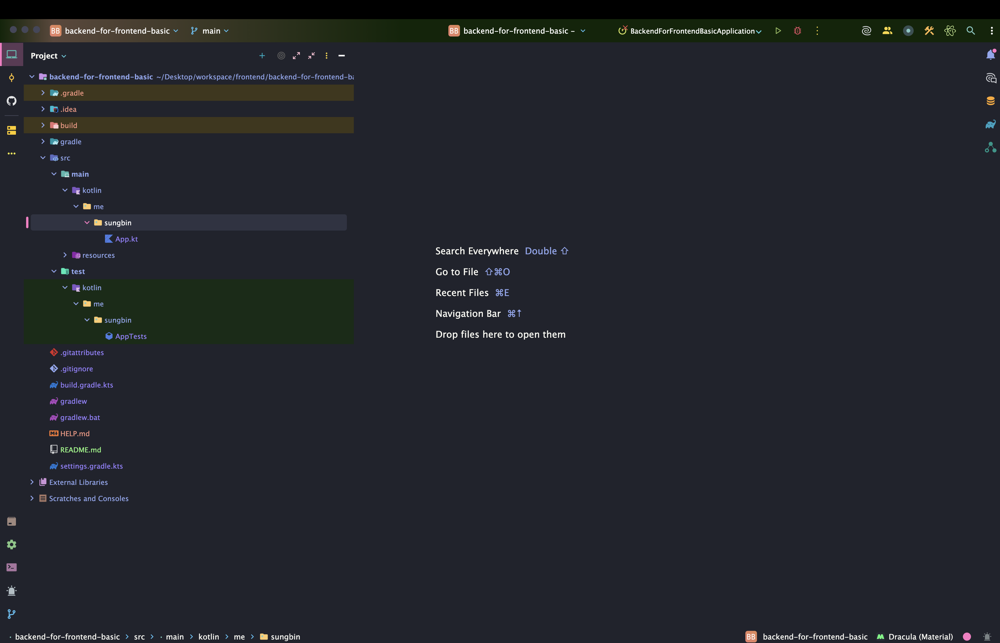
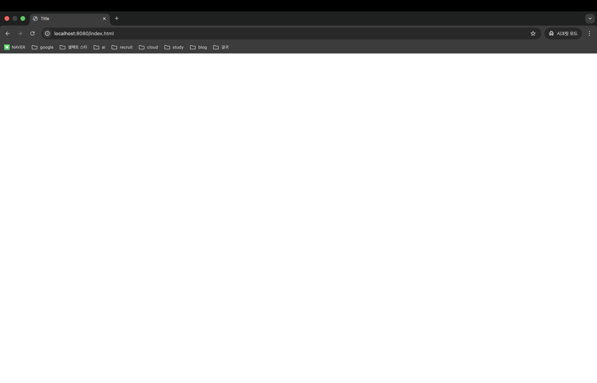

> 해당 포스팅은 인프런의 [백엔드 개발자에 의한, 백엔드 개발자들을 위한 프론트엔드 강의 - 기본편](https://inf.run/DQ8mU)를 참조하여 만들었습니다.


## 백엔드와 프론트엔드

### 여러분이 만든 API 서버는 어느 곳에 위치해 있는가?

그럼 지금부터 프론트엔드에 대해 살펴보자. 바로 프론트엔드 코드를 살펴볼 것은 아니고 백엔드와 프론트엔드의 관계를 중심으로 어떻게 프론트엔드를 학습해야 할지를 살펴보자. 그러면 우리가 만든 API 서버가 어디에
위치해 있는지부터 알아보자. 보통 우리가 만든 API 서버는 웹 브라우저와 스마트폰 사이 뒷단에 걸쳐져 있을 것이다.

웹 브라우저를 이용해서 웹 서비스를 사용하는 사용자는 먼저 HTML, CSS, Javascript가 포함된 웹 페이지를 다운 받는다. 보통 전문 용어로 렌더링한다라고도 말한다. 그리고 렌더링 받은 웹 페이지에 포함된
Javascript에 따라 API 서버를 호출하여 그 결과를 받아오는 형태이다. 여기서 한 가지 짚고 넘어갈 부분이 있다. 우리는 보통 "프론트엔드가 API를 호출한다"라고 말하지만, 엄밀히 말하면 프론트엔드 페이지
자체가 API 서버를 호출하는 것이 아니라 **프론트엔드 페이지를 로딩한 웹 브라우저가 API 서버를 호출**하고 있는 것이다. 즉 실제 HTTP 요청의 주체는 브라우저이고, 프론트엔드 코드는 그 요청을 만들어내는
명령서 역할에 가깝다. 이 구분은 CORS나 쿠키 정책 같은 이슈를 이해할 때 중요해지기 때문에 초반에 잡아두면 좋다. 물론 스마트폰을 사용하는 경우도 이와 유사할 것이다.

결국, 우리가 만든 API 서버는 크게 2가지 사용자가 존재하는 것이다. 바로 웹 브라우저와 스마트폰 앱이다. 이 둘은 모두 HTTP라는 프로토콜을 통해 API 서버와 통신하게 된다. 동일한 프로토콜을 쓰고 화면에
동일한 데이터를 보여주기 때문에 두 클라이언트가 오직 하나의 API만으로도 서비스가 될 수 있는 것이다. 이 덕분에 백엔드 개발자는 "웹용 API"와 "앱용 API"를 따로 만들 필요 없이 하나의 인터페이스만 잘
설계해두면 된다. 이 둘다 종종 프론트엔드라고도 부르기도 하지만 통상 프론트엔드라고 말하면 웹 브라우저를 통해서 API 서버와 통신 하는 부분을 이야기 한다.

### 웹 브라우저의 프론트엔드

웹 브라우저의 프론트엔드는 크게 2가지로 나뉠 수 있다. 프론트엔드 프레임워크를 사용하지 않는 순수한 HTML, CSS, Javascript로 개발하는 방법이 존재하고, 다른 하나는 React, Vue, Svelte
같은 프론트엔드 프레임워크를 사용하는 방법이 존재한다. 두 방식은 결과적으로 브라우저에서 동작하는 HTML, CSS, Javascript를 만들어낸다는 점에서는 동일하지만, 개발 과정에서의 생산성과 구조화 방식에서
큰 차이를 보인다.

순수 HTML/CSS/Javascript 방식은 브라우저가 이해하는 언어를 직접 쓰는 것이기에 중간 단계가 없고, 프레임워크에 의존하지 않는다는 장점이 있다. 반면 프레임워크를 사용하는 방식은 컴포넌트 단위로 화면을
구조화하고 상태 관리를 체계적으로 할 수 있다는 장점이 있지만, 번들러 설정이나 빌드 과정, 프레임워크 자체의 학습 비용이 함께 따라온다. 해당 시리즈에서는 순수한 HTML, CSS, Javascript를 사용하여
프론트엔드를 개발하는 방법에 대해 알아보도록 하려고 한다. 백엔드 개발자가 프론트엔드를 학습할 때는 프레임워크의 추상화 위에서 시작하는 것보다, 브라우저가 실제로 어떻게 동작하는지를 먼저 체감하는 것이 더 오래 남는
지식이 되기 때문이다.

### 스마트폰의 프론트엔드

스마트폰 앱쪽에서의 프론트엔드는 웹에 비해 조금 더 복잡하다. 크게 나누면 네이티브 앱, 웹 뷰, 하이브리드 앱, React Native 같은 방식이 있다. 네이티브 앱은 iOS의 경우 Swift, Android의
경우 Kotlin 같은 플랫폼 고유의 언어로 개발하는 방식이다. 성능과 플랫폼 기능 활용 측면에서 가장 강력하지만, 각 플랫폼별로 별도의 코드베이스를 유지해야 하는 비용이 존재한다.

여기서 네이티브 앱을 제외하면 나머지(웹 뷰, 하이브리드 앱, React Native)는 통상적으로 프론트엔드 영역이라고 부른다. 왜냐하면 이들 모두 HTML, CSS, Javascript를 다루던 개발자들이 동일한
언어로 개발할 수 있기 때문이다. 웹 뷰는 네이티브 앱 안에 브라우저 화면을 띄워 웹 페이지를 그대로 보여주는 방식이고, 하이브리드 앱은 웹 뷰를 기반으로 하되 카메라나 위치 같은 네이티브 기능을 연결해서 쓸 수
있도록 한 방식이다. React Native는 조금 결이 다른데, JavaScript로 코드를 작성하지만 실제 렌더링은 각 플랫폼의 네이티브 컴포넌트로 이루어진다. 이 구분이 백엔드 개발자에게 왜 중요하냐면,
클라이언트가 어떤 방식으로 구현되었느냐에 따라 API 응답에서 요구되는 형태(예: 이미지 URL의 크기, 인증 토큰의 저장 방식 등)가 달라질 수 있기 때문이다.

## Thymeleaf vs HTML + RestController

그럼 지금부터 Thymeleaf로 개발하는 방식이 좋을 지 혹은 HTML를 따로 만들고 RestController를 통해 서버 개발을 하면 좋을지 알아보도록 하겠다.

이전에 우리는 하나의 API 서버로 웹 브라우저, 스마트폰등 클라이언트 요청을 처리할 수 있다라고 배웠다. 왜냐하면 프론트와 서버간 데이터만 주고받기 때문이다. 보통은 JSON이라고 부르는 형식의 데이터를 주고 받는
것이다. 우리가 만약 백엔드 API 서버를 한번이라도 만들어보았다면 JSON이 뭔지 알 것이다. 그래서 여기서 설명은 생략은 하는데 만약 모르신다면 AI Agent나 구글링을 해보면 좋을 것이다.

아무튼 일반적으로 웹 브라우저에서 HTML, CSS, Javascript가 이미 로딩된 상태에서 JSON을 API 서버와 주고 받아서 서비스를 제공하는 형태이다. 그리고 스마트폰 앱도 자체적인 UI를 가지고 있고
JSON만을 API와 주고 받아서 서비스를 제공하면 된다. API 서버는 웹 브라우저, 스마트폰이 모두 사용할 수 있도록 공통된 인터페이스를 가지고 있는 꼴이다. 하지만 프론트엔드와 백엔드가 처음부터 이런 모습의
구조를 가지고 있었던 것은 아니다. 지금의 "데이터만 주고받는" 구조가 왜 표준이 되었는지를 이해하려면, 웹이 어떻게 발전해왔는지를 잠깐 살펴볼 필요가 있다.

### 초창기 웹

짧게 웹이 발전해온 단계를 알아보도록 하자. 초창기 웹은 HTML이라는 문서를 주고 받는 용도였다. 정말 처음에는 웹 브라우저도 없었고 사용자들이 많이 사용하는 구글 크롬도 한참 후에야 만들어졌다. 이 시기의 웹은
지금 우리가 생각하는 "서비스"라기보다 논문이나 문서를 하이퍼링크로 연결해둔 문서 공유 시스템에 가까웠다. 아무튼 클라이언트가 서버에게 받고 싶은 HTML 문서를 요청하면 서버는 이를 응답해주었던 형태였다. 이때는
화면에 보이는 모든 내용이 HTML 안에 이미 담겨 있었고, 서버가 응답해주는 HTML이 곧 사용자가 보게 될 화면이었다.

### 더 나은 사용자 경험을 위해 추가된 CSS, Javascript

그러다가 웹 서비스가 발전하면서 HTML과 함께 CSS, Javascript가 추가되었다. 더 나은 사용자 경험을 위해서 추가되었던 것이다. CSS는 HTML 문서의 구조와 시각적인 스타일을 분리하기 위해 등장했고,
Javascript는 정적인 문서에 동적인 상호작용을 불어넣기 위해 등장했다. 하지만 이때까지도 핵심 구조는 크게 달라지지 않았다. 여기서 주고 받는 HTML 문서에는 여러분들이 API로 제공해줄 만한 데이터들이
이미 모두 포함되어 있었다. 따라서 새로운 데이터가 포함된 HTML 문서를 제공해주려면 페이지가 새로고침되어야 했다.

예를 들어 게시글 목록에서 "다음 페이지" 버튼을 누르면, 서버는 다음 페이지에 해당하는 HTML 전체를 다시 만들어서 응답해야 했다. 사용자 입장에서는 버튼을 누를 때마다 화면이 깜빡이며 전체가 다시 그려지는
경험을 해야 했던 것이다. 하지만 이런 과정은 사용자에게 매우 불편했을 것이다. 데이터 몇 줄을 바꾸기 위해 페이지 전체를 다시 불러오는 것은 네트워크 관점에서도 비효율적이었다. 이런 불편함으로 인해 Ajax가
추가가 되었다.

### 더 나은 사용자 경험을 위해 추가된 Ajax

Ajax(Asynchronous JavaScript and XML)를 통해 이제 화면을 새로고침하거나 다른 페이지를 전환하지 않고도 서버에서 새로운 데이터를 받아올 수 있게 되었다. 이름에는 XML이 들어가 있지만,
이는 역사적 흔적일 뿐 현재는 주로 JSON을 주고받는다. Ajax가 가져온 변화는 단순히 "깜빡임이 사라졌다" 수준이 아니라, 웹 애플리케이션을 바라보는 관점 자체를 바꿔놓았다. 화면을 한 번 로딩한 뒤에는 필요한
부분만 비동기로 갱신하면 되기 때문에, 웹이 점점 데스크톱 애플리케이션과 비슷한 경험을 제공할 수 있게 된 것이다.

초창기에는 Ajax를 통해 HTML 문서를 통째로 받아와서 화면의 일부를 교체하는 용도로 쓰이기도 했지만, 시간이 지나면서 점점 데이터만 주고 받는 형태로 발전해 왔다. 마치 우리가 이전에 살펴본 구조처럼 발전해온
것이다. 서버는 오직 데이터(JSON)만 책임지고, 화면을 그리는 책임은 클라이언트로 완전히 넘어간 것이다. 이 구조가 자리 잡으면서 프론트엔드와 백엔드의 역할 분리도 훨씬 명확해졌다.

그러면 여기서 Thymeleaf가 무엇인지 알아봐야 한다. Thymeleaf는 마치 Ajax를 사용하지 않았을 때와 비슷한 것이다. 즉, html 문서에 서비스에서 필요한 데이터가 포함된 상태로 클라이언트에게
전달되는 것이다. 서버가 "어떤 데이터가 들어간 HTML을 내려줄지"를 최종적으로 결정하고, 클라이언트는 그 결과물을 그대로 받아 보여주는 방식이다. 간단한 예시를 살펴보자.

``` html
<!DOCTYPE html>
<html lang="ko" xmlns:th="http://www.thymeleaf.org">
<head th:replace="fragments.html :: head"></head>
<body class="bg-light">
    <div th:replace="fragments.html :: main-nav"></div>
    <section class="jumbtron text-center">
        <div class="container">
            <p>
                <a th:href="@{/sign-up}" class="btn btn-primary my-2">회원 가입</a>
            </p>
        </div>
    </section>
 
    <div class="container">
        <div class="row justify-content-center pt-3">
            <div th:replace="fragments.html :: study-list (studyList = ${studyList})"></div>
        </div>
        <div th:replace="fragments.html :: footer"></div>
    </div>
 
    <script src="/node_modules/moment/min/moment-with-locales.min.js"></script>
    <script type="application/javascript" th:src="@{/js/eventView.js}"></script>
    <script type="application/javascript" th:src="@{/js/footer.js}"></script>
</body>
</html>
```

위의 코드가 Thymeleaf를 사용한 HTML 문서이고 아래가 위의 Thymeleaf에 변수를 매핑할 수 있는 컨트롤러이다.

``` java
@GetMapping("/")
public String home(@CurrentAccount Account account, Model model) {
    if (account != null) {
        Account accountLoaded = accountRepository.findAccountWithTagsAndZonesById(account.getId());
 
        model.addAttribute(accountLoaded);
        model.addAttribute("enrollmentList", enrollmentRepository.findByAccountAndAcceptedOrderByEnrolledAtDesc(accountLoaded, true));
        model.addAttribute("studyList", studyRepository.findByAccount(accountLoaded.getTags(), accountLoaded.getZones()));
        model.addAttribute("studyManagerOf", studyRepository.findFirst5ByManagersContainingAndClosedOrderByPublishedDateTimeDesc(account, false));
        model.addAttribute("studyMemberOf", studyRepository.findFirst5ByMembersContainingAndClosedOrderByPublishedDateTimeDesc(account, false));
 
        return "index-after-login";
    }
 
    model.addAttribute("studyList", studyRepository.findFirst9ByPublishedAndClosedOrderByPublishedDateTimeDesc(true, false));
 
    return "index";
}
```

코드를 살펴보면 컨트롤러에서 `model.addAttribute("studyList", ...)`로 정의한 값이 HTML 문서의 `studyList`에 매핑된다라고 생각하면 쉬울 것이다. 이게 바로 타임리프를 통해
HTML 문서와 데이터를 서버에서 조합하여 클라이언트에게 제공해주는 방식이다. 이런 방식을 서버사이드 템플릿 엔진이라고 부른다. 서버사이드 템플릿 엔진은 초기 로딩 시 SEO에 유리하고, 별도의 프론트엔드 빌드
파이프라인 없이도 화면을 구성할 수 있다는 장점이 있다. 하지만 동시에 뚜렷한 단점도 존재한다.

### Thymeleaf를 쓰면 스마트폰 앱은 어디서 데이터를 받아오나?

웹 브라우저는 타임리프로 생성된 HTML 페이지를 받아서 처리를 할 것이다. 그런데 스마트폰은 어떻게 데이터를 받아올까? 스마트폰 앱은 HTML을 그대로 렌더링하는 방식이 아니라 자체 UI로 데이터를 구성하기
때문에, HTML 문서를 받아봐야 그대로 쓸 수가 없다. 만약 별도의 API 서버가 있다면 해당 서버가 데이터를 응답해주면 된다. 그게 아니라면 HTML 문서에 있는 데이터만을 뽑아서 사용해내야 하는데, 이러한
방식은 매우 불편할 것이다.

이유는 두 가지다. 첫번째로 별도의 API 서버를 두면 결국 웹용 Thymeleaf 렌더링 로직과 앱용 JSON API 로직을 이중으로 관리해야 하기 때문에 관리 포인트가 늘어난다. 같은 데이터를 꺼내오는 로직을 두
군데에서 유지보수해야 하니 변경이 있을 때마다 두 곳 모두 손을 대야 한다. 두번째로 HTML 문서에 있는 데이터를 파싱하는 작업은 직접 해보시면 알겠지만 상당히 까다로운 작업이다. UI가 살짝만 바뀌어도 파싱
로직을 바꿔줘야 하기 때문이다. 웹 화면의 className 하나만 바뀌어도 앱에서 데이터 추출이 실패할 수 있는 것이다. 또한, 프론트엔드가 점점 발전함에 따라 프론트가 백엔드와 강하게 결합하는 구조는 유지하기가
매우 힘들어졌다. 프론트엔드가 독립적인 프레임워크와 빌드 시스템을 갖추면서, 백엔드와 분리된 채로 배포되는 것이 훨씬 자연스러운 구조가 된 것이다.

그래서 우리는 HTML을 별도로 만들고 JSON을 주고 받는 방식을 사용해보도록 할 것이다.

## 지향하는 프론트엔드 코드

그러면 이 시리즈에서 지향하는 프론트엔드 코드에 대해서 살펴보도록 할 것이다. 가장 먼저 이야기하고 싶은 내용은 여기서 설명하는 프론트엔드 코드는 클린코드 원칙을 지키지 않는 코드라는 것이다. 컴포넌트 분리, 상태
관리 패턴, 재사용성 같은 프론트엔드 고유의 고민들은 과감하게 생략할 것이다. 이 시리즈에서 지향하는 프론트엔드 코드는 어디까지나 **우리가 만든 백엔드 API를 활용할 수 있는 수준의 코드**이다. 지금은 클린코드
원칙을 지킨 프론트엔드 코드보다는 백엔드 개발자가 살펴볼 프론트엔드 코드이기에 이를 더 포커스를 해서 알아가보도록 하겠다.

프론트엔드를 구성하는 요소로는 HTML, CSS, Javascript가 있지만 그 중에 프론트엔드 기술적 선택 요소는 주로 Javascript를 어떻게 다룰 것인가이다. 프론트엔드 개발자를 나눌 때에도 어떤
자바스크립트 프레임워크를 사용하는가에 따라 나눈다. 보통 실무에서는 React나 Vue를 사용하지만 여기서는 이런 프레임워크를 사용하지 않고 순수 Javascript를 사용해보도록 하겠다. 프레임워크는 분명 강력한
도구이지만, 그 위에서 시작하면 "왜 이렇게 동작하는가"보다 "어떻게 쓰는가"에 먼저 집중하게 된다. 우리의 목적은 백엔드 API가 클라이언트와 어떻게 맞물리는지를 이해하는 것이기에, 가능한 한 얇은 층에서 시작하는
것이 가장 빠른 길이다.

## 실습 진행 방법

그러면 앞으로 포스팅을 하면서 실습 환경에 대해 말해보도록 하겠다. 앞으로 백엔드 코드와 프론트엔드 코드 전부 인텔리제이를 통해 진행을 해보려고 한다. 별도의 프론트엔드 프로젝트를 만들지 않고, 스프링부트
프로젝트에서 정적 파일을 추가해서 프론트 문법을 알아보도록 할 것이다. 이렇게 하면 프론트엔드 전용 번들러나 개발 서버 설정 없이도, 스프링부트가 띄워주는 내장 톰캣 위에서 바로 프론트엔드 코드를 확인할 수 있다.

> ✅ 참고
>
> 여기서는 어느정도 백엔드 개발은 할 줄 안다는 가정하에 작성한 것이다. 실습 기반은 기본적으로 Spring Boot Project를 세팅하고 진행해야 한다.

그럼 이미 인텔리제이로 Spring Boot Project를 잘 세팅했다면 아래와 같이 나올 것이다.



그러면 해당 구조에 `resources/static`으로 가서 html을 만들고 실습을 해보도록 하자. 스프링부트에서 `resources/static` 디렉토리는 정적 리소스(HTML, CSS, JavaScript,
이미지 등)를 제공하는 기본 위치이다. 이 경로에 파일을 두면 별도의 컨트롤러 매핑 없이도 URL을 통해 바로 접근할 수 있다. html 파일명은 `index.html`로 진행한다. 여기서 `index.html`의
네이밍에는 특별한 기능이 있는데 이것은 다음 포스팅에서 알아보도록 하겠다. 아래와 같이 `index.html`을 작성하고 spring boot application을 실행해보자.

``` html
<!DOCTYPE html>
<html lang="ko">
<head>
    <meta charset="UTF-8">
    <title>Title</title>
</head>
<body>
 
</body>
</html>
```

그리고 url에 `localhost:8080/index.html`을 입력해보면 아래와 같이 우리가 만든 html 문서가 렌더링 된 것을 확인할 수 있다.

