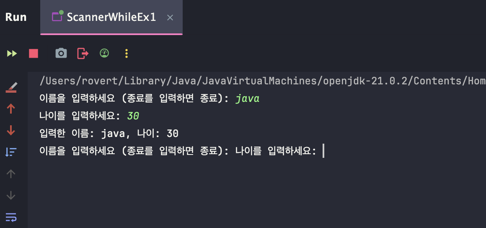

> 해당 블로그 글은 [영한님의 인프런 강의](https://inf.run/WUc1V)를 바탕으로 쓰여진 글입니다.

## Scanner 학습

우리는 이제까지 정적인 프로그램들을 작성해왔다. 즉, 동적인 프로그램을 만들지는 않았다. 동적인 프로그램이 되려면 사용자 입력이 있어야 한다. 자바에서 이것을 쉽게 하기 위해 `Scanner`라는 클래스를 제공해준다.

### Scanner

`System.out` 을 통해서 출력을 했듯이, `System.in` 을 통해서 사용자의 입력을 받을 수 있다. 그런데 자바가 제공하는 `System.in` 을 통해서 사용자 입력을 받으려면 여러 과정을 거쳐야해서 복잡하고 어렵다. 자바는 이런 문제를 해결하기 위해 `Scanner` 라는 클래스를 제공한다. 이 클래스를 사용하면 사용자 입력을 매우 편리하게 받을 수 있다. 그럼 예제를 한번 살펴보자.

``` java
package scanner;

import java.util.Scanner;

public class Scanner1 {
    public static void main(String[] args) {
        Scanner scanner = new Scanner(System.in);

        System.out.print("문자열을 입력하세요: ");
        String str = scanner.nextLine();
        System.out.println("입력한 문자열 : " + str);

        System.out.print("정수를 입력하세요: ");
        int intValue = scanner.nextInt();
        System.out.println("입력한 정수: " + intValue);

        System.out.print("실수를 입력하세요: ");
        double doubleValue = scanner.nextDouble();
        System.out.println("입력한 실수 : " + doubleValue);

        scanner.close();
    }
}
```

- `import java.util.Scanner`
    - Scanner라는 클래스를 불러오는 기능을 한다.
    - 자세한 건 추후 학습한다. 지금은 Scanner를 사용하려면 패키지 선언 다음으로 적어줘야 한다라고 기억하자.
- `Scanner scanner = new Scanner(System.in);`
    - 이 부분은 클래스에 대해 알아야 정확히 알 수 있다. 지금은 그냥 아 뭔가 입력받게 해주는 도구를 만들어준다라고 이해하자.
- `scanner.nextLine();`
    - 엔터(\n)을 입력할 때 까지의 문자열을 가져온다.
- `scanner.nextInt();`
    - 사용자가 입력한 정수를 가져온다.
- `scanner.nextDouble();`
    - 사용자가 입력한 실수를 가져온다.
- `scanner.close();`
    - 이것은 Scanner 객체를 종료시킨다.
    - 반드시 해줘야 한다. 만약 안 해주면 리소스 자원을 계속 가지고 있기 때문에 불필요한 CPU와 메모리 사용이 있다.

> ⚠️ 주의
>
> 입력한 값이 데이터 타입과 다르면 에러가 발생한다.

### print() vs println()

우리는 이제까지 `println()` 메서드를 많이 이용했다. 이 메서드는 출력할 것과 함께 "\n"을 추가해주는 것이다. 반면에 `print()` 메서드는 출력할 것만 출력해주는 기능을 한다. 즉 쉽게 설명하면 아래와 같다.

> println() = print("\n")

우리가 엔터 키를 치면 (`\n` )이라는 문자를 남기는 것이다.
이 문자는 영어로 new line character, 한글로 줄바꿈 문자 또는 개행 문자라고 하는데, 이름 그대로 새로운 라인으로
넘기라는 뜻이다. 콘솔에서는 이 문자를 보고 다음 라인으로 넘긴다.

이제 다양한 예제들을 강의에서 살펴본다. 하지만 예제를 너무 따라하는 것은 좋지 않고 여러분께서 하나의 주제를 정해서 만들어 보는 것도 좋을 것 같다. 여기서는 따로 다루지 않겠다. 또한 `Scanner`는 실무에서 많이 사용하지 않는다. 특히 웹 어플리케이션을 만드는 백엔드 개발자라면 더욱 그럴 것이다. 이것은 순수히 콘솔 어플리케이션을 만들거나 코딩 테스트때 유용할 것 같다.

### 💡 꿀팁

가끔가다가 아래와 같은 경우가 있을 것이다.

``` java
package scanner.ex;

import java.util.Scanner;

public class ScannerEx {
    public static void main(String[] args) {
        Scanner scanner = new Scanner(System.in);

        while (true) {
            System.out.print("이름을 입력하세요 (종료를 입력하면 종료): ");
            String name = scanner.nextLine();

            if (name.equals("종료")) {
                System.out.println("프로그램을 종료합니다.");
                break;
            }

            System.out.print("나이를 입력하세요: ");
            int age = scanner.nextInt();

            System.out.println("입력한 이름: " + name + ", 나이: " + age);
        }
    }
}
```

이렇게 하면 아래와 같이 이상하게 나오는 경우가 있다.



이 이유는 바로 `scanner.nextInt()`라는 비밀이 있다. 원래 `scanner.nextLine()`은 입력한 값과 "\n"을 같이 읽는다. 하지만 `scanner.nextInt()`는 "\n"을 읽지 않는다. 그래서 위와 같이 결과가 나온다. 그러면 해결방법은 `scanner.nextLine()`을 추가하면 된다.

> 잘못된 지식이 있을 경우 댓글로 남겨주시면 빠르게 반영하겠습니다!